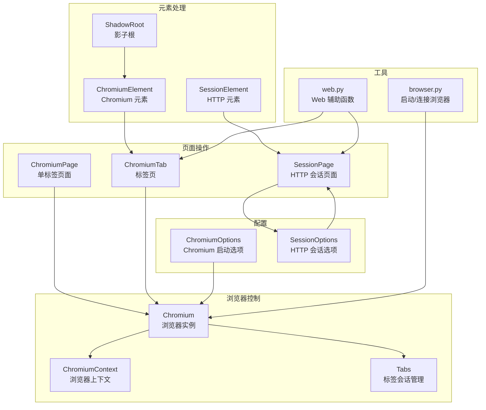
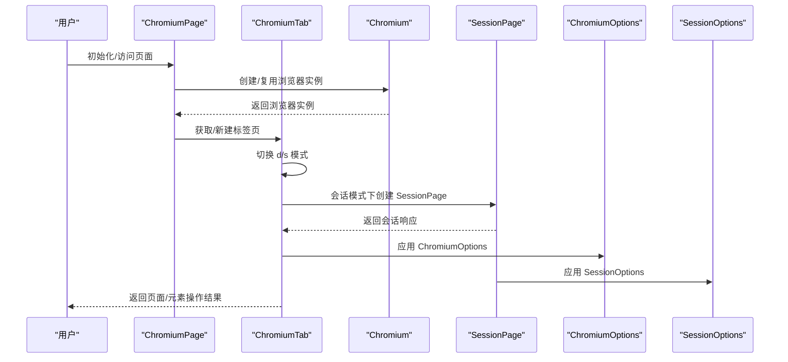
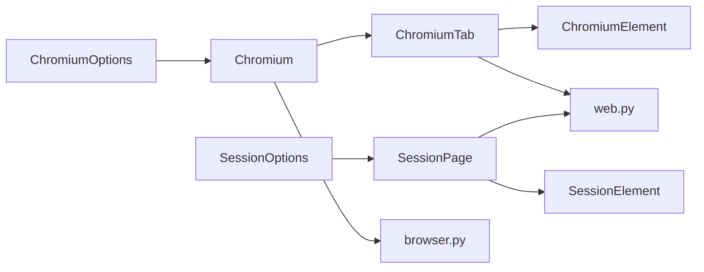

# API 参考

<cite>
**本文引用的文件**
- [__init__.py](file://DrissionPage/__init__.py)
- [version.py](file://DrissionPage/version.py)
- [common.py](file://DrissionPage/common.py)
- [errors.py](file://DrissionPage/errors.py)
- [items.py](file://DrissionPage/items.py)
- [chromium.py](file://DrissionPage/_browsers/chromium.py)
- [chromium_page.py](file://DrissionPage/_pages/chromium_page.py)
- [chromium_tab.py](file://DrissionPage/_pages/chromium_tab.py)
- [session_page.py](file://DrissionPage/_pages/session_page.py)
- [chromium_options.py](file://DrissionPage/_configs/chromium_options.py)
- [session_options.py](file://DrissionPage/_configs/session_options.py)
- [chromium_element.py](file://DrissionPage/_elements/chromium_element.py)
- [session_element.py](file://DrissionPage/_elements/session_element.py)
- [browser.py](file://DrissionPage/_functions/browser.py)
- [web.py](file://DrissionPage/_functions/web.py)
</cite>

## 目录
1. [简介](#简介)
2. [项目结构](#项目结构)
3. [核心组件](#核心组件)
4. [架构总览](#架构总览)
5. [详细组件分析](#详细组件分析)
6. [依赖分析](#依赖分析)
7. [性能考虑](#性能考虑)
8. [故障排查指南](#故障排查指南)
9. [结论](#结论)
10. [附录](#附录)

## 简介
本参考文档面向 DrissionPage 的使用者，系统梳理浏览器控制、页面操作、元素处理、HTTP 会话等模块的公共 API，覆盖类、方法、属性、参数、返回值、异常与最佳实践。文档严格基于仓库源码，确保准确性与一致性。

## 项目结构
DrissionPage 采用模块化设计，核心模块包括：
- 浏览器控制：Chromium 类及其上下文、标签管理
- 页面操作：ChromiumPage、ChromiumTab、SessionPage
- 元素处理：ChromiumElement、SessionElement、ShadowRoot
- 配置管理：ChromiumOptions、SessionOptions
- 工具函数：浏览器连接、Web 辅助、键鼠动作等

图表来源
- [chromium.py](file://DrissionPage/_browsers/chromium.py)
- [chromium_page.py](file://DrissionPage/_pages/chromium_page.py)
- [chromium_tab.py](file://DrissionPage/_pages/chromium_tab.py)
- [session_page.py](file://DrissionPage/_pages/session_page.py)
- [chromium_options.py](file://DrissionPage/_configs/chromium_options.py)
- [session_options.py](file://DrissionPage/_configs/session_options.py)
- [chromium_element.py](file://DrissionPage/_elements/chromium_element.py)
- [session_element.py](file://DrissionPage/_elements/session_element.py)
- [browser.py](file://DrissionPage/_functions/browser.py)
- [web.py](file://DrissionPage/_functions/web.py)

章节来源
- [__init__.py](file://DrissionPage/__init__.py)
- [version.py](file://DrissionPage/version.py)

## 核心组件
本节概述对外公开的主要类与入口，便于快速定位功能模块。

- 浏览器控制
  - Chromium：Chromium 浏览器实例，支持多标签、上下文、下载、代理、超时等
  - ChromiumContext：浏览器上下文，隔离 Cookie、缓存、代理等
  - Tabs：内部会话与目标管理容器
- 页面操作
  - ChromiumPage：单标签页面封装，继承 ChromiumTab
  - ChromiumTab：标签页页面，支持 d/s 模式切换（DevTools/Session）
  - SessionPage：纯 HTTP 会话页面，基于 requests
- 元素处理
  - ChromiumElement：Chromium 元素，支持属性、样式、滚动、截图、输入、拖拽等
  - SessionElement：HTTP 元素，基于 lxml 定位与解析
  - ShadowRoot：Shadow DOM 根元素
- 配置
  - ChromiumOptions：Chromium 启动参数、用户数据、扩展、偏好、超时、重试等
  - SessionOptions：HTTP 会话头、Cookie、代理、证书、超时、重试等
- 工具
  - browser.py：启动/连接浏览器、设置用户数据、Flags/Prefs
  - web.py：元素文本提取、链接补全、PDF/MHTML 导出、Blob 读取、树形打印等

章节来源
- [chromium.py](file://DrissionPage/_browsers/chromium.py)
- [chromium_page.py](file://DrissionPage/_pages/chromium_page.py)
- [chromium_tab.py](file://DrissionPage/_pages/chromium_tab.py)
- [session_page.py](file://DrissionPage/_pages/session_page.py)
- [chromium_element.py](file://DrissionPage/_elements/chromium_element.py)
- [session_element.py](file://DrissionPage/_elements/session_element.py)
- [chromium_options.py](file://DrissionPage/_configs/chromium_options.py)
- [session_options.py](file://DrissionPage/_configs/session_options.py)
- [browser.py](file://DrissionPage/_functions/browser.py)
- [web.py](file://DrissionPage/_functions/web.py)

## 架构总览
下图展示 DrissionPage 的高层交互：Chromium 作为浏览器入口，ChromiumPage/ChromiumTab 提供页面能力；SessionPage 提供 HTTP 会话能力；ChromiumElement/SessionElement 提供元素操作；ChromiumOptions/SessionOptions 提供配置；browser.py/web.py 提供底层支撑。

图表来源
- [chromium_page.py](file://DrissionPage/_pages/chromium_page.py)
- [chromium_tab.py](file://DrissionPage/_pages/chromium_tab.py)
- [chromium.py](file://DrissionPage/_browsers/chromium.py)
- [session_page.py](file://DrissionPage/_pages/session_page.py)
- [chromium_options.py](file://DrissionPage/_configs/chromium_options.py)
- [session_options.py](file://DrissionPage/_configs/session_options.py)

## 详细组件分析

### 浏览器控制：Chromium
- 角色与职责
  - 单例浏览器实例管理、多标签/上下文、下载、代理、超时、事件处理
- 关键属性
  - id：浏览器实例标识
  - user_data_path：用户数据目录
  - process_id：浏览器进程 ID
  - timeout/timeouts：统一超时配置
  - load_mode：页面加载策略
  - download_path：下载目录
  - set/states/wait：设置器、状态查询、等待器
  - tab_ids/latest_tab：标签集合与最新标签
- 关键方法
  - context：获取 ChromiumContext
  - cookies(all_info=False)：获取 Cookie 列表
  - new_context(proxy=None, proxy_bypass=None, auto_close=True)：创建隔离上下文
  - new_tab(url=None, new_window=False, background=False, hidden=False)：新建标签
  - get_tab/get_tabs：按条件检索标签
  - close_tabs：关闭指定标签或“除某标签外”
  - activate_tab：激活标签
  - reconnect：断线重连
  - clear_cache：清理缓存/Cookie
  - quit(timeout=5, force=False, del_data=False)：退出浏览器并清理资源
- 异常
  - BrowserConnectError、PageDisconnectedError、CDPError、IncorrectURLError 等
- 最佳实践
  - 使用 new_context 隔离 Cookie/代理，避免跨会话污染
  - 显式设置 download_path，避免权限问题
  - 使用 reconnect 处理断线场景
  - 避免频繁 quit，尽量复用浏览器实例

章节来源
- [chromium.py](file://DrissionPage/_browsers/chromium.py)
- [errors.py](file://DrissionPage/errors.py)

### 页面操作：ChromiumPage
- 角色与职责
  - 单标签页面封装，继承 ChromiumTab，提供便捷属性与方法
- 关键属性
  - set/wait：设置器与等待器
  - tabs_count/tab_ids/latest_tab/process_id：标签与进程信息
  - browser_version/address：浏览器版本与地址
- 关键方法
  - get_tab/get_tabs/new_tab/activate_tab/close_tabs：标签管理
  - quit：退出浏览器
- 最佳实践
  - 优先使用 ChromiumPage 管理单一标签，简化上下文
  - 注意 d/s 模式切换对 Cookie/UA 的影响

章节来源
- [chromium_page.py](file://DrissionPage/_pages/chromium_page.py)

### 页面操作：ChromiumTab
- 角色与职责
  - 标签页页面，支持 d（DevTools）/s（Session）双模式
- 关键属性
  - url/title/raw_data/html/json/response/mode/user_agent/timeout
- 关键方法
  - get/post：导航/请求，支持超时与重试
  - ele/eles/s_ele/s_eles：元素查找
  - change_mode(mode=None, go=True, copy_cookies=True)：d/s 模式切换
  - cookies_to_session/cookies_to_browser：Cookie 双向同步
  - cookies/all_domains/all_info：Cookie 查询
  - close(others=False, session=False)：关闭标签与会话
  - save(path=None, name=None, as_pdf=False, **kwargs)：导出 PDF/MHTML
- 最佳实践
  - 切换模式前明确 Cookie 同步需求
  - 导出 PDF/MHTML 前检查页面是否已渲染完成

章节来源
- [chromium_tab.py](file://DrissionPage/_pages/chromium_tab.py)

### 页面操作：SessionPage
- 角色与职责
  - 基于 requests 的 HTTP 会话页面，适合静态/动态 HTML 解析与数据抓取
- 关键属性
  - title/url/_session_url/raw_data/html/json/user_agent/session/response/encoding/set/timeout
- 关键方法
  - get/post：发起请求，支持重试、超时、错误提示
  - ele/eles/s_ele/s_eles：基于 lxml 的元素查找
  - cookies(all_domains=False, all_info=False)：获取 Cookie 列表
  - close：关闭会话与响应
- 最佳实践
  - 明确设置 headers/cookies/proxies，避免被服务端限制
  - 对于需要 JS 渲染的页面，建议使用 d 模式（Chromium）

章节来源
- [session_page.py](file://DrissionPage/_pages/session_page.py)

### 元素处理：ChromiumElement
- 角色与职责
  - Chromium 元素对象，提供属性、样式、滚动、截图、输入、拖拽、选择框等能力
- 关键属性
  - tag/html/inner_html/attrs/text/raw_text：元素信息
  - set/states/pseudo/rect/sr/scroll/click/wait/select/value：功能子对象与状态
- 关键方法
  - attr(name)/property(name)/run_js/script/as_expr：属性与脚本
  - input(vals, clear=False, by_js=False)/clear(by_js=False)/focus()/hover()/drag()/drag_to()
  - get_screenshot(path=None, name=None, as_bytes=None, as_base64=None, scroll_to_center=True)
  - src(timeout=None, base64_to_bytes=True)/save(path=None, name=None, timeout=None, rename=True)
  - ele/eles/s_ele/s_eles/_find_elements：元素查找
  - parent/child/prev/next/before/after/children/prevs/nexts/befores/afters：相对定位
  - over(offset_x=None, offset_y=None)/offset(locator=None, x=None, y=None, timeout=None)：遮挡检测与偏移定位
- 异常
  - ElementLostError、NoRectError、JavaScriptError、LocatorError 等
- 最佳实践
  - 输入前先等待可点击，避免误触
  - 截图前确保元素可见并滚动至可视区域
  - 使用 select 对 select 元素进行选项选择

章节来源
- [chromium_element.py](file://DrissionPage/_elements/chromium_element.py)
- [errors.py](file://DrissionPage/errors.py)

### 元素处理：SessionElement
- 角色与职责
  - 基于 lxml 的元素对象，提供 XPath/CSS 定位与文本/属性提取
- 关键属性
  - inner_ele/tag/html/inner_html/attrs/text/raw_text：元素信息
- 关键方法
  - attr(name)/ele/eles/s_ele/s_eles/_find_elements：定位与属性
  - parent/child/prev/next/before/after/children/prevs/nexts/befores/afters：相对定位
  - _get_ele_path(xpath=True)：生成定位路径
- 最佳实践
  - CSS 定位注意与父元素的关系，必要时使用绝对路径
  - 对于复杂页面，优先使用 XPath 精确定位

章节来源
- [session_element.py](file://DrissionPage/_elements/session_element.py)

### 元素处理：ShadowRoot
- 角色与职责
  - 影子根元素，支持在 Shadow DOM 中进行元素查找与操作
- 关键方法
  - run_js/run_async_js：执行脚本
  - parent/child/next/before/after：相对定位
- 最佳实践
  - 在 Shadow DOM 中定位时避免使用不支持的 CSS 语法

章节来源
- [chromium_element.py](file://DrissionPage/_elements/chromium_element.py)

### 配置管理：ChromiumOptions
- 角色与职责
  - 管理 Chromium 启动参数、用户数据、扩展、偏好、Flags、超时、重试等
- 关键属性
  - download_path/browser_path/user_data_path/tmp_path/user/load_mode/timeouts/proxy/address/arguments/extensions/preferences/flags/system_user_path/is_existing_only/is_auto_port/retry_times/retry_interval/is_headless
- 关键方法
  - set_retry(times=None, interval=None)：设置重试
  - set_argument(arg, value=None)/remove_argument(value)：增删启动参数
  - add_extension(path)/remove_extensions()：扩展管理
  - set_pref(arg, value)/remove_pref(arg)/remove_pref_from_file(arg)：偏好管理
  - set_flag(flag, value=None)/clear_flags_in_file()/clear_flags()/clear_arguments()/clear_prefs()：Flags/Prefs 清理
  - set_timeouts(base=None, page_load=None, script=None)：超时设置
  - set_user(user='Default')/headless(on_off=True)/no_imgs/on_off)/no_js/on_off)/mute(on_off)/incognito(on_off)/new_env(on_off)/ignore_certificate_errors(on_off)
  - set_user_agent(user_agent)/set_proxy(proxy)/set_load_mode(value)/set_local_port(port)/set_address(address)/set_browser_path(path=None, edge=False)/set_download_path(path)/set_tmp_path(path)/set_user_data_path(path)/set_cache_path(path)/use_system_user_path(on_off=True)/auto_port(on_off=True, scope=None)/existing_only(on_off=True)
  - save(path=None)/save_to_default()/remove_test_type()
- 最佳实践
  - 使用 set_proxy 与 set_user_agent 统一代理与 UA
  - 使用 set_user_data_path 与 use_system_user_path 控制用户数据隔离
  - 合理设置 load_mode 与超时，平衡速度与稳定性

章节来源
- [chromium_options.py](file://DrissionPage/_configs/chromium_options.py)

### 配置管理：SessionOptions
- 角色与职责
  - 管理 HTTP 会话的 headers、cookies、auth、proxies、params、verify、cert、stream、trust_env、max_redirects、timeout、download_path、retry_times/retry_interval
- 关键属性
  - download_path/timeout/proxies/retry_times/retry_interval/headers/cookies/auth/hooks/params/verify/cert/adapters/stream/trust_env/max_redirects
- 关键方法
  - set_download_path(path)/set_timeout(second)/set_proxies(http=None, https=None)/set_retry(times=None, interval=None)
  - set_headers(headers)/set_a_header(name, value)/remove_a_header(name)/clear_headers()
  - set_cookies(cookies)/set_auth(auth)/set_hooks(hooks)/set_params(params)/set_verify(on_off)/set_cert(cert)/add_adapter(url, adapter)/set_stream(on_off)/set_trust_env(on_off)/set_max_redirects(times)
  - save(path=None)/save_to_default()/as_dict()/make_session()/from_session(session, headers=None)
- 最佳实践
  - 明确设置 headers/cookies/proxies，避免被服务端识别为爬虫
  - 对于需要认证的接口，使用 set_auth/set_cert/set_verify

章节来源
- [session_options.py](file://DrissionPage/_configs/session_options.py)

### 工具函数：browser.py
- 角色与职责
  - 启动/连接浏览器、设置用户数据、Flags/Prefs、路径探测
- 关键方法
  - connect_browser(opt)：连接或启动浏览器
  - get_launch_args(opt)：生成启动参数
  - set_prefs(opt)/set_flags(opt)：写入 Preferences/Local State
  - test_connect(ip, port)：测试连接
  - _run_browser(port, path, args)：启动浏览器进程
  - get_chrome_path()/get_edge_path()：探测浏览器路径
  - get_sys_Chrome_user_data_dir()/get_edge_user_data_dir()：系统用户数据目录
- 最佳实践
  - 使用 auto_port 与 system_user_path 降低冲突与权限问题
  - 启动前确保浏览器可执行文件存在

章节来源
- [browser.py](file://DrissionPage/_functions/browser.py)

### 工具函数：web.py
- 角色与职责
  - Web 辅助：元素文本提取、链接补全、PDF/MHTML 导出、Blob 读取、树形打印、头格式化
- 关键方法
  - get_ele_txt(e)：提取元素文本
  - format_html(text)：HTML 实体解码与空白处理
  - location_in_viewport(page, loc_x, loc_y)：判断坐标是否在视口
  - offset_scroll(ele, offset_x, offset_y)：计算滚动后的点击点
  - make_absolute_link(link, baseURI=None)：补全绝对链接
  - is_js_func(func)：判断是否为 JS 函数字符串
  - get_blob(page, url, as_bytes=True)：读取 Blob 数据
  - save_page(tab, path=None, name=None, as_pdf=False, kwargs=None)：导出 PDF/MHTML
  - get_mhtml(page, path=None, name=None)：导出 MHTML
  - get_pdf(page, path=None, name=None, kwargs=None)：导出 PDF
  - tree(ele_or_page, text=False, show_js=False, show_css=False)：树形打印
  - format_headers(txt)：标准化头字段
  - get_proxy_info(proxy_str)：解析代理字符串
- 最佳实践
  - 导出 PDF 前确保页面已完全渲染
  - 使用 tree 快速查看页面结构

章节来源
- [web.py](file://DrissionPage/_functions/web.py)

## 依赖分析
- 内聚性
  - 各模块职责清晰：浏览器控制、页面操作、元素处理、配置、工具函数相互独立
- 耦合性
  - Chromium 与 ChromiumTab/ChromiumPage 存在强耦合（继承/组合）
  - SessionPage 与 SessionOptions 紧密绑定
  - ChromiumElement/SessionElement 依赖对应页面对象
- 外部依赖
  - requests、lxml、DrissionRecord、psutil、tldextract 等

图表来源
- [chromium_options.py](file://DrissionPage/_configs/chromium_options.py)
- [session_options.py](file://DrissionPage/_configs/session_options.py)
- [chromium.py](file://DrissionPage/_browsers/chromium.py)
- [chromium_tab.py](file://DrissionPage/_pages/chromium_tab.py)
- [chromium_element.py](file://DrissionPage/_elements/chromium_element.py)
- [session_page.py](file://DrissionPage/_pages/session_page.py)
- [session_element.py](file://DrissionPage/_elements/session_element.py)
- [browser.py](file://DrissionPage/_functions/browser.py)
- [web.py](file://DrissionPage/_functions/web.py)

## 性能考虑
- 超时与重试
  - ChromiumOptions/SessionOptions 支持设置 base/page_load/script 超时与 retry_times/retry_interval
  - 建议根据网络环境与目标站点特性调整
- 下载与缓存
  - 明确 download_path，避免磁盘 IO 瓶颈
  - clear_cache 可定期清理缓存提升稳定性
- 模式切换
  - d 模式更接近真实浏览体验，但开销更大；s 模式轻量，适合静态内容
- 元素操作
  - 输入/截图前确保元素可见并滚动至可视区域，减少失败重试

## 故障排查指南
- 连接与启动
  - BrowserConnectError：检查 address/port、浏览器可执行文件、系统用户数据目录
  - FileNotFoundError/RuntimeError：确认浏览器路径与用户数据目录存在
- 元素相关
  - ElementLostError/NoRectError/LocatorError：确认元素存在、可见、定位符正确
- 请求与会话
  - ConnectionError/Status code 错误：检查 headers/cookies/proxies/timeout
- 版本与兼容
  - 版本号：4.2.0b10
  - 如遇异常，优先查看异常类名称与错误信息，结合日志定位

章节来源
- [errors.py](file://DrissionPage/errors.py)
- [browser.py](file://DrissionPage/_functions/browser.py)
- [session_page.py](file://DrissionPage/_pages/session_page.py)

## 结论
DrissionPage 提供了从浏览器控制到页面操作、元素处理与 HTTP 会话的完整能力矩阵。通过 ChromiumOptions/SessionOptions 统一配置，配合 browser.py/web.py 工具函数，可在不同场景下灵活选择 d/s 模式，兼顾性能与稳定性。建议在生产环境中合理设置超时与重试、明确 Cookie/UA/代理策略，并遵循最佳实践以规避常见陷阱。

## 附录
- 版本信息
  - 当前版本：4.2.0b10
- 常用入口
  - from .__init__ 导出：Chromium、ChromiumPage、SessionPage、ChromiumOptions、SessionOptions
- 导出项
  - from .items 导出：ChromiumElement、ShadowRoot、NoneElement、SessionElement、ChromiumFrame、ChromiumTab
  - from .common 导出：make_session_ele、Actions、Keys、By、Settings、wait_until、configs_to_here、get_blob、tree、from_selenium、from_playwright

章节来源
- [__init__.py](file://DrissionPage/__init__.py)
- [items.py](file://DrissionPage/items.py)
- [common.py](file://DrissionPage/common.py)
- [version.py](file://DrissionPage/version.py)