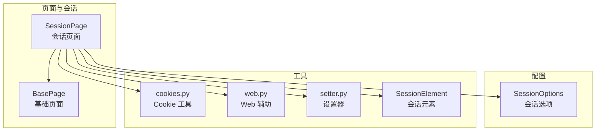
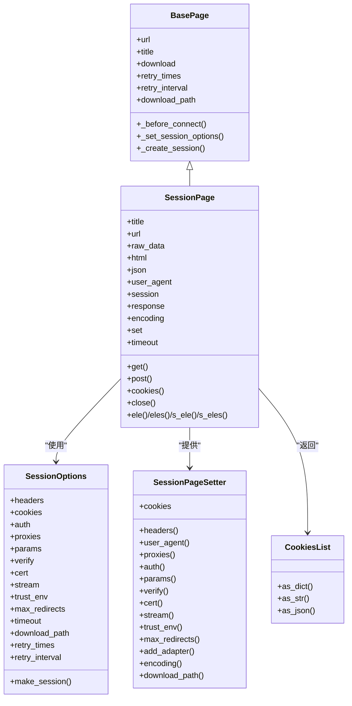
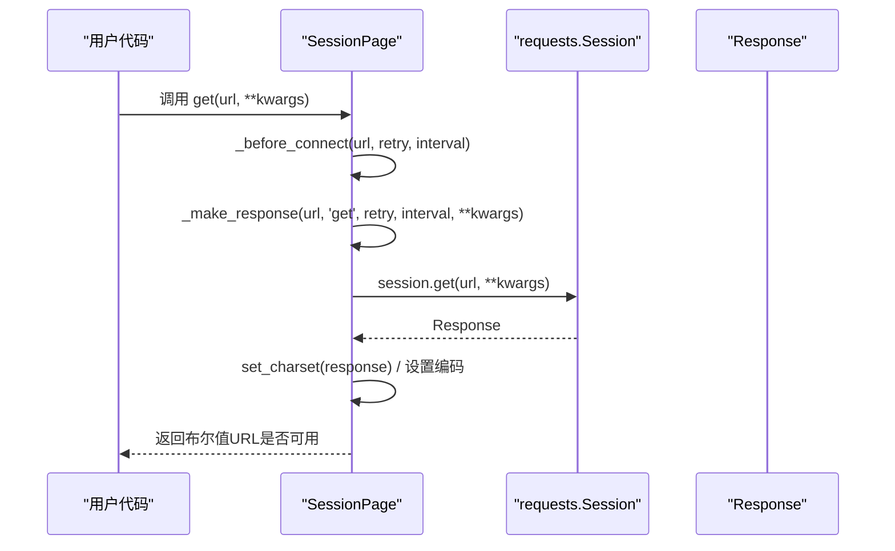
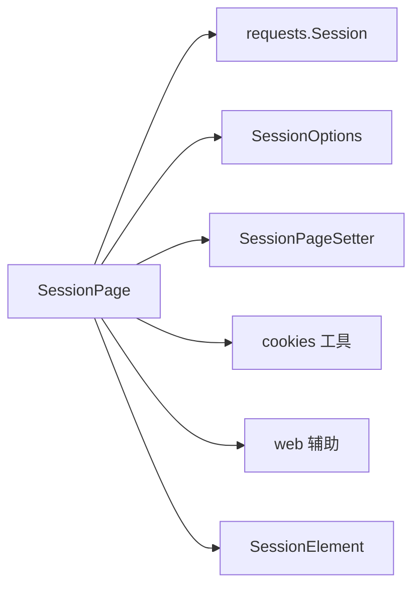

# HTTP 会话 API

<cite>
**本文引用的文件**
- [session_page.py](file://DrissionPage/_pages/session_page.py)
- [session_page.pyi](file://DrissionPage/_pages/session_page.pyi)
- [base.py](file://DrissionPage/_base/base.py)
- [session_options.py](file://DrissionPage/_configs/session_options.py)
- [session_options.pyi](file://DrissionPage/_configs/session_options.pyi)
- [cookies.py](file://DrissionPage/_functions/cookies.py)
- [cookies.pyi](file://DrissionPage/_functions/cookies.pyi)
- [web.py](file://DrissionPage/_functions/web.py)
- [setter.py](file://DrissionPage/_units/setter.py)
- [session_element.py](file://DrissionPage/_elements/session_element.py)
- [session_element.pyi](file://DrissionPage/_elements/session_element.pyi)
- [settings.py](file://DrissionPage/_functions/settings.py)
</cite>

## 目录
1. [简介](#简介)
2. [项目结构](#项目结构)
3. [核心组件](#核心组件)
4. [架构总览](#架构总览)
5. [详细组件分析](#详细组件分析)
6. [依赖分析](#依赖分析)
7. [性能考虑](#性能考虑)
8. [故障排查指南](#故障排查指南)
9. [结论](#结论)
10. [附录](#附录)

## 简介
本文件为 DrissionPage 的 HTTP 会话模块 API 参考，聚焦 SessionPage 类的公共接口与行为，覆盖 HTTP 请求发送、响应处理、Cookie 管理、会话状态维护、请求头与请求体处理、响应解析与状态码检查、会话持久化、代理与 SSL 配置、以及安全使用建议。读者无需深入底层即可理解如何通过 SessionPage 发起 GET/POST/PUT/DELETE 等请求，并进行会话级配置与管理。

## 项目结构
围绕 SessionPage 的关键文件组织如下：
- 页面与会话：session_page.py、session_page.pyi、base.py
- 会话配置：session_options.py、session_options.pyi
- Cookie 工具：cookies.py、cookies.pyi
- Web 辅助：web.py
- 设置器：setter.py
- 元素封装：session_element.py、session_element.pyi
- 全局设置：settings.py

图表来源
- [session_page.py:25-294](file://DrissionPage/_pages/session_page.py#L25-L294)
- [session_page.pyi:22-323](file://DrissionPage/_pages/session_page.pyi#L22-L323)
- [base.py:270-371](file://DrissionPage/_base/base.py#L270-L371)
- [session_options.py:20-372](file://DrissionPage/_configs/session_options.py#L20-L372)
- [cookies.py:18-243](file://DrissionPage/_functions/cookies.py#L18-L243)
- [web.py:304-349](file://DrissionPage/_functions/web.py#L304-L349)
- [setter.py:41-104](file://DrissionPage/_units/setter.py#L41-L104)
- [session_element.py:23-301](file://DrissionPage/_elements/session_element.py#L23-L301)

章节来源
- [session_page.py:25-294](file://DrissionPage/_pages/session_page.py#L25-L294)
- [session_page.pyi:22-323](file://DrissionPage/_pages/session_page.pyi#L22-L323)
- [base.py:270-371](file://DrissionPage/_base/base.py#L270-L371)

## 核心组件
- SessionPage：基于 requests 的会话页面，提供 HTTP 请求、响应读取、元素查找、Cookie 管理、设置器等能力。
- SessionOptions：会话级配置，支持 headers、cookies、auth、proxies、verify、cert、stream、trust_env、max_redirects、timeout、download_path、retry_times/retry_interval 等。
- SessionPageSetter：会话设置器，提供 headers、user_agent、proxies、auth、params、verify、cert、stream、trust_env、max_redirects、add_adapter、encoding、download_path 等设置入口。
- Cookies 工具：cookies.py 提供 cookie 解析、格式化、批量设置等。
- Web 辅助：web.py 提供请求头格式化、代理信息解析等。
- SessionElement：对 HTML 片段的元素封装，支持属性、文本、父子兄弟查找等。

章节来源
- [session_page.py:25-294](file://DrissionPage/_pages/session_page.py#L25-L294)
- [session_page.pyi:22-323](file://DrissionPage/_pages/session_page.pyi#L22-L323)
- [session_options.py:20-372](file://DrissionPage/_configs/session_options.py#L20-L372)
- [cookies.py:18-243](file://DrissionPage/_functions/cookies.py#L18-L243)
- [web.py:304-349](file://DrissionPage/_functions/web.py#L304-L349)
- [setter.py:41-104](file://DrissionPage/_units/setter.py#L41-L104)
- [session_element.py:23-301](file://DrissionPage/_elements/session_element.py#L23-L301)

## 架构总览
SessionPage 以 requests.Session 为核心，结合 SessionOptions 与 SessionPageSetter 实现统一的会话配置与请求流程；通过 cookies 工具与 web 辅助完成 Cookie 管理与请求头处理；SessionElement 提供 DOM 式的元素访问能力。

图表来源
- [session_page.py:25-294](file://DrissionPage/_pages/session_page.py#L25-L294)
- [session_page.pyi:22-323](file://DrissionPage/_pages/session_page.pyi#L22-L323)
- [base.py:270-371](file://DrissionPage/_base/base.py#L270-L371)
- [session_options.py:20-372](file://DrissionPage/_configs/session_options.py#L20-L372)
- [setter.py:41-104](file://DrissionPage/_units/setter.py#L41-L104)
- [cookies.py:221-243](file://DrissionPage/_functions/cookies.py#L221-L243)

## 详细组件分析

### SessionPage 类 API 参考
- 初始化
  - 支持传入 requests.Session 或 SessionOptions 对象；若未提供则创建默认会话与选项。
  - 运行时设置：timeout、download_path、retry_times、retry_interval 从 SessionOptions 注入。
- 属性
  - title：页面标题（基于 DOM 中 title 元素）。
  - url：当前访问 URL。
  - raw_data：响应原始字节数据。
  - html：响应 HTML 文本。
  - json：响应 JSON 字典（解析失败返回 None）。
  - user_agent：请求头中的 User-Agent。
  - session：底层 requests.Session。
  - response：最近一次请求的 Response 对象。
  - encoding：显式设置的编码（影响响应解码）。
  - set：会话设置器 SessionPageSetter。
  - timeout：当前超时设置。
- 方法
  - get(url, show_errmsg=False, retry=None, interval=None, timeout=None, **kwargs) -> bool
    - 以 GET 方式访问 URL，支持本地文件路径（file://）、重试、超时、请求参数与请求体等。
    - kwargs 支持 headers、params、data、json、cookies、files、auth、allow_redirects、proxies、hooks、stream、verify、cert 等。
    - 返回布尔值表示 URL 是否可用。
  - post(url, show_errmsg=False, retry=None, interval=None, **kwargs) -> bool
    - 以 POST 方式访问 URL，参数与 get 类似。
  - cookies(all_domains=False, all_info=False) -> CookiesList
    - 返回当前会话 Cookie 列表；可选择跨域与返回详细信息。
  - close() -> None
    - 关闭会话与响应资源。
  - ele/们/s_ele/s_eles：元素查找与封装，返回 SessionElement 或列表。
- 内部流程
  - _before_connect：预处理 URL（含本地文件检测）、编码、重试与间隔注入。
  - _s_connect：统一调度 get/post，更新 _url_available 并处理状态码。
  - _make_response：构建请求头（合并默认与传入）、设置 Referer/Host/timeout、执行请求、设置编码、重试逻辑。

章节来源
- [session_page.py:25-294](file://DrissionPage/_pages/session_page.py#L25-L294)
- [session_page.pyi:22-323](file://DrissionPage/_pages/session_page.pyi#L22-L323)
- [base.py:306-338](file://DrissionPage/_base/base.py#L306-L338)

#### 请求流程时序图（GET）

图表来源
- [session_page.py:104-196](file://DrissionPage/_pages/session_page.py#L104-L196)
- [session_page.py:198-266](file://DrissionPage/_pages/session_page.py#L198-L266)

### 会话设置器（SessionPageSetter）
- headers(headers)：设置请求头（大小写不敏感）。
- user_agent(ua)：设置 User-Agent。
- proxies(http=None, https=None)：设置代理。
- auth(auth)：设置认证。
- params(params)：设置 URL 参数。
- verify(on_off)：是否校验证书。
- cert(cert)：SSL 客户端证书。
- stream(on_off)：是否流式传输。
- trust_env(on_off)：是否信任环境变量。
- max_redirects(times)：最大重定向次数。
- add_adapter(url, adapter)：挂载适配器。
- encoding(encoding, set_all=True)：设置编码（可同时设置响应对象）。
- download_path(path)：设置下载路径。
- cookies：返回 SessionCookiesSetter，支持设置、删除、清理 Cookie。

章节来源
- [setter.py:41-104](file://DrissionPage/_units/setter.py#L41-L104)
- [session_page.pyi:108-116](file://DrissionPage/_pages/session_page.pyi#L108-L116)

### Cookie 管理
- cookies(all_domains=False, all_info=False)：返回 CookiesList，支持仅 name/value/domain 或更详细信息。
- CookiesList：提供 as_dict/as_str/as_json 等便捷转换。
- cookies_to_tuple/cookie_to_dict/format_cookie：将多种 Cookie 表示转换为标准元组或字典，支持 expiry、sameSite、priority、sourceScheme 等字段规范化。
- set_session_cookies：将 Cookie 应用到 requests.Session。

章节来源
- [session_page.py:151-174](file://DrissionPage/_pages/session_page.py#L151-L174)
- [cookies.py:18-243](file://DrissionPage/_functions/cookies.py#L18-L243)
- [cookies.pyi:19-96](file://DrissionPage/_functions/cookies.pyi#L19-L96)

### 会话选项（SessionOptions）
- 支持设置 headers、cookies、auth、proxies、hooks、params、verify、cert、stream、trust_env、max_redirects、timeout、download_path、retry_times、retry_interval。
- make_session()：创建 requests.Session 并应用上述配置。
- from_session(session, headers=None)：从现有 Session 复制配置。
- save/save_to_default/as_dict：配置持久化与导出。

章节来源
- [session_options.py:20-372](file://DrissionPage/_configs/session_options.py#L20-L372)
- [session_options.pyi:19-174](file://DrissionPage/_configs/session_options.pyi#L19-L174)

### 请求头与代理处理
- format_headers：将字符串或字典格式化为大小写不敏感的请求头字典，并移除内部使用的伪头部。
- get_proxy_info：解析代理字符串，提取协议、主机、端口、用户名、密码等。

章节来源
- [web.py:304-349](file://DrissionPage/_functions/web.py#L304-L349)

### 元素封装（SessionElement）
- 支持 tag、html、inner_html、attrs、text/raw_text 等属性。
- 支持 parent/child/prev/next/before/after 及其复数版本 children/prevs/nexts/befores/afters。
- 支持 attr(name) 获取属性值，自动处理 href/src 的绝对链接转换。
- 支持 ele/eles/s_ele/s_eles 递归查找。

章节来源
- [session_element.py:23-301](file://DrissionPage/_elements/session_element.py#L23-L301)
- [session_element.pyi:20-308](file://DrissionPage/_elements/session_element.pyi#L20-L308)

## 依赖分析
- SessionPage 依赖 requests.Session 与 requests.Response。
- 通过 SessionOptions 统一注入 headers、cookies、auth、proxies、verify、cert、stream、trust_env、max_redirects 等。
- 通过 SessionPageSetter 将配置映射到 Session 属性。
- 通过 cookies 工具与 web 辅助完成 Cookie 与请求头处理。
- 通过 SessionElement 提供 DOM 式元素访问。

图表来源
- [session_page.py:25-294](file://DrissionPage/_pages/session_page.py#L25-L294)
- [session_options.py:20-372](file://DrissionPage/_configs/session_options.py#L20-L372)
- [setter.py:41-104](file://DrissionPage/_units/setter.py#L41-L104)
- [cookies.py:18-243](file://DrissionPage/_functions/cookies.py#L18-L243)
- [web.py:304-349](file://DrissionPage/_functions/web.py#L304-L349)
- [session_element.py:23-301](file://DrissionPage/_elements/session_element.py#L23-L301)

章节来源
- [session_page.py:25-294](file://DrissionPage/_pages/session_page.py#L25-L294)
- [session_options.py:20-372](file://DrissionPage/_configs/session_options.py#L20-L372)
- [setter.py:41-104](file://DrissionPage/_units/setter.py#L41-L104)
- [cookies.py:18-243](file://DrissionPage/_functions/cookies.py#L18-L243)
- [web.py:304-349](file://DrissionPage/_functions/web.py#L304-L349)
- [session_element.py:23-301](file://DrissionPage/_elements/session_element.py#L23-L301)

## 性能考虑
- 超时与重试：合理设置 timeout、retry_times、retry_interval，避免长时间阻塞。
- 编码设置：通过 encoding 显式设置可减少不必要的 apparent_encoding 推断。
- 代理与证书：在高并发场景下，谨慎使用代理与自定义证书链，避免额外握手开销。
- 流式传输：对大文件下载启用 stream，结合分块读取降低内存占用。
- 适配器挂载：对特定域名挂载适配器可优化连接池与并发策略。

## 故障排查指南
- 状态码错误：当响应非 ok 且 show_errmsg=True 时抛出异常；否则返回 False。
- 连接异常：重试机制会在指定间隔后再次尝试；若仍失败可根据异常信息定位网络或代理问题。
- Cookie 丢失：确认 cookies(all_domains/all_info) 返回值，必要时通过 SessionPageSetter.cookies 进行设置或清理。
- 代理与证书：使用 proxies/verify/cert 进行调试；必要时通过 get_proxy_info 校验代理字符串格式。
- 元素查找失败：检查定位符是否正确，或切换为 s_ele/s_eles 获取元素对象进一步分析。

章节来源
- [session_page.py:180-196](file://DrissionPage/_pages/session_page.py#L180-L196)
- [session_page.py:198-266](file://DrissionPage/_pages/session_page.py#L198-L266)
- [cookies.py:149-159](file://DrissionPage/_functions/cookies.py#L149-L159)
- [web.py:321-349](file://DrissionPage/_functions/web.py#L321-L349)
- [settings.py:13-69](file://DrissionPage/_functions/settings.py#L13-L69)

## 结论
SessionPage 提供了简洁一致的 HTTP 会话接口，结合 SessionOptions 与 SessionPageSetter 实现灵活的会话配置；通过 cookies 工具与 web 辅助保障 Cookie 与请求头的正确性；借助 SessionElement 提供 DOM 式的页面元素访问。遵循本文的安全与性能建议，可稳定地完成各类 HTTP 请求与会话管理任务。

## 附录

### 常用 API 速查
- 发送请求
  - get(url, show_errmsg=False, retry=None, interval=None, timeout=None, **kwargs) -> bool
  - post(url, show_errmsg=False, retry=None, interval=None, timeout=None, **kwargs) -> bool
- 读取响应
  - raw_data：原始字节
  - html：HTML 文本
  - json：JSON 字典或 None
- 会话配置
  - set.headers/set.user_agent/set.proxies/set.auth/set.params/set.verify/set.cert/set.stream/set.trust_env/set.max_redirects/set.add_adapter/set.encoding/set.download_path
- Cookie 管理
  - cookies(all_domains=False, all_info=False) -> CookiesList
  - set.cookies(...)：设置 Cookie
  - cookies(...).as_dict()/as_str()/as_json()
- 元素访问
  - ele()/eles()/s_ele()/s_eles() 返回 SessionElement 或列表

章节来源
- [session_page.pyi:118-200](file://DrissionPage/_pages/session_page.pyi#L118-L200)
- [session_page.pyi:256-264](file://DrissionPage/_pages/session_page.pyi#L256-L264)
- [setter.py:66-104](file://DrissionPage/_units/setter.py#L66-L104)
- [session_element.pyi:231-268](file://DrissionPage/_elements/session_element.pyi#L231-L268)