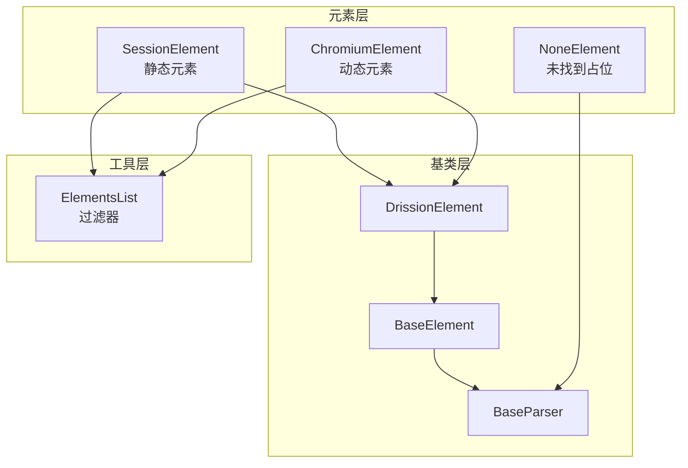
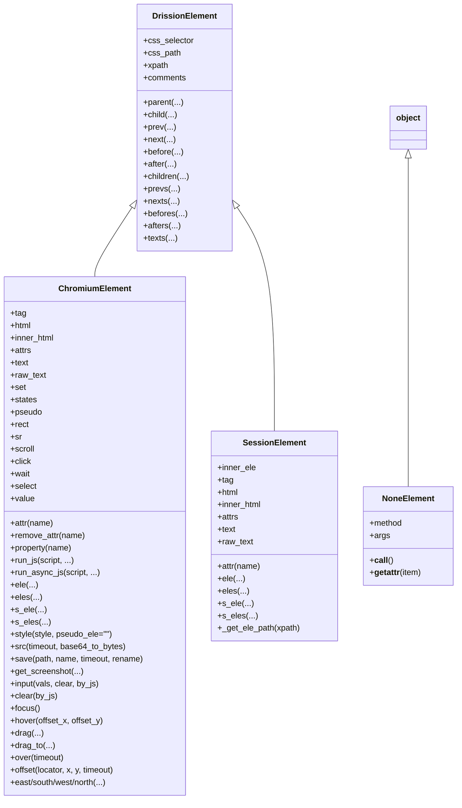
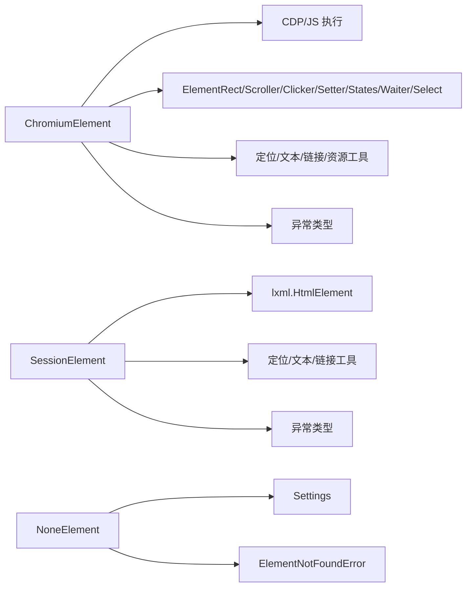
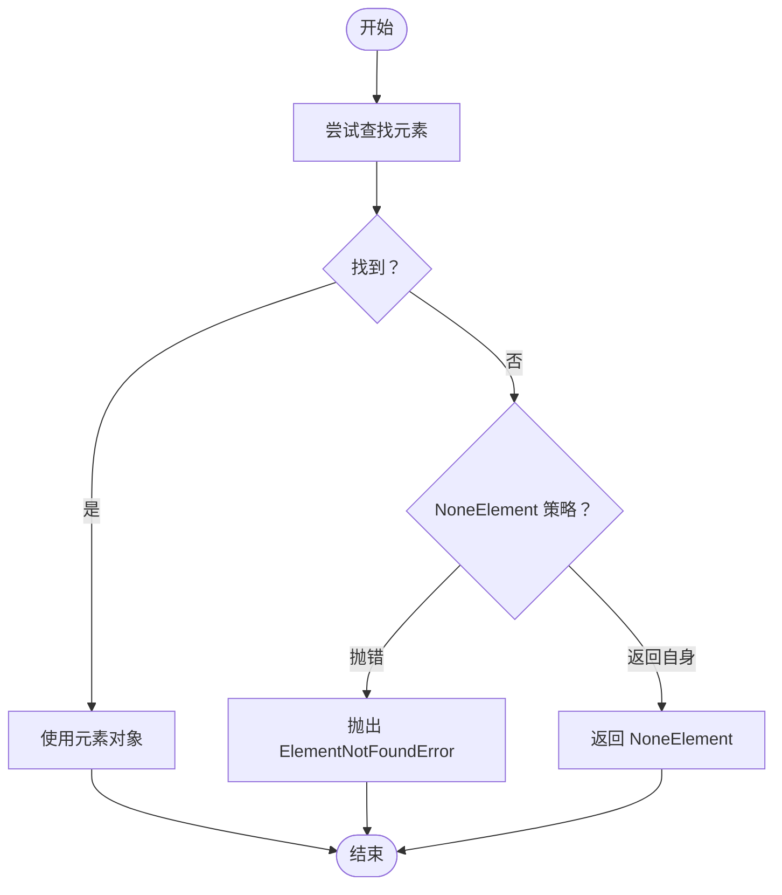

# 元素处理 API

<cite>
**本文引用的文件**
- [chromium_element.py](file://DrissionPage/_elements/chromium_element.py)
- [chromium_element.pyi](file://DrissionPage/_elements/chromium_element.pyi)
- [none_element.py](file://DrissionPage/_elements/none_element.py)
- [none_element.pyi](file://DrissionPage/_elements/none_element.pyi)
- [session_element.py](file://DrissionPage/_elements/session_element.py)
- [session_element.pyi](file://DrissionPage/_elements/session_element.pyi)
- [base.py](file://DrissionPage/_base/base.py)
- [elements.py](file://DrissionPage/_functions/elements.py)
</cite>

## 目录
1. [简介](#简介)
2. [项目结构](#项目结构)
3. [核心组件](#核心组件)
4. [架构总览](#架构总览)
5. [详细组件分析](#详细组件分析)
6. [依赖关系分析](#依赖关系分析)
7. [性能考量](#性能考量)
8. [故障排查指南](#故障排查指南)
9. [结论](#结论)
10. [附录](#附录)

## 简介
本文件为 DrissionPage 的元素处理模块提供完整的 API 参考文档，重点覆盖 ChromiumElement、NoneElement 与 SessionElement 三类元素对象的公共方法与属性。内容涵盖：
- 元素定位与导航（父子兄弟、前后文档元素、相对位置）
- 属性与文本获取、样式查询
- 事件触发（输入、清空、聚焦、悬停、拖拽）
- 等待与状态检查（可交互、可见、矩形、覆盖物）
- 高亮与截图、资源下载与保存
- 异常处理与错误恢复策略

本参考面向不同技术背景的读者，既提供方法签名与行为说明，也给出流程图与序列图帮助理解。

## 项目结构
元素处理模块位于 DrissionPage/_elements 下，主要文件如下：
- chromium_element.py / .pyi：Chromium 浏览器环境下的动态元素实现
- session_element.py / .pyi：基于静态 HTML 的会话元素实现
- none_element.py / .pyi：未找到元素时的占位对象
- base.py：元素基类与通用能力
- elements.py：元素列表与过滤器等辅助结构

图表来源
- [chromium_element.py:38-174](file://DrissionPage/_elements/chromium_element.py#L38-L174)
- [session_element.py:23-108](file://DrissionPage/_elements/session_element.py#L23-L108)
- [none_element.py:12-53](file://DrissionPage/_elements/none_element.py#L12-L53)
- [base.py:70-120](file://DrissionPage/_base/base.py#L70-L120)
- [elements.py:16-62](file://DrissionPage/_functions/elements.py#L16-L62)

章节来源
- [chromium_element.py:38-174](file://DrissionPage/_elements/chromium_element.py#L38-L174)
- [session_element.py:23-108](file://DrissionPage/_elements/session_element.py#L23-L108)
- [none_element.py:12-53](file://DrissionPage/_elements/none_element.py#L12-L53)
- [base.py:70-120](file://DrissionPage/_base/base.py#L70-L120)
- [elements.py:16-62](file://DrissionPage/_functions/elements.py#L16-L62)

## 核心组件
- ChromiumElement：Chromium 页面中的动态元素，支持 CDP 与 JS 交互，提供丰富的等待、滚动、点击、拖拽、截图、资源下载等能力。
- SessionElement：基于静态 HTML 的元素，通过 lxml 解析，适合离线或会话页面场景。
- NoneElement：当元素查找失败时返回的占位对象，可配置抛出异常或返回自身以实现链式容错。

章节来源
- [chromium_element.py:38-174](file://DrissionPage/_elements/chromium_element.py#L38-L174)
- [session_element.py:23-108](file://DrissionPage/_elements/session_element.py#L23-L108)
- [none_element.py:12-53](file://DrissionPage/_elements/none_element.py#L12-L53)

## 架构总览
ChromiumElement 与 SessionElement 均继承自 DrissionElement，后者扩展了通用的元素导航与路径能力；NoneElement 继承自普通对象，用于容错。

图表来源
- [chromium_element.py:38-174](file://DrissionPage/_elements/chromium_element.py#L38-L174)
- [chromium_element.pyi:28-602](file://DrissionPage/_elements/chromium_element.pyi#L28-L602)
- [session_element.py:23-108](file://DrissionPage/_elements/session_element.py#L23-L108)
- [session_element.pyi:20-308](file://DrissionPage/_elements/session_element.pyi#L20-L308)
- [none_element.py:12-53](file://DrissionPage/_elements/none_element.py#L12-L53)
- [none_element.pyi:13-39](file://DrissionPage/_elements/none_element.pyi#L13-L39)

## 详细组件分析

### ChromiumElement API 参考
- 基础属性
  - tag：元素标签名
  - html / inner_html：外层/内层 HTML 文本
  - attrs：元素属性字典
  - text / raw_text：格式化/原始文本
  - value：元素 value 属性
  - css_selector / css_path / xpath：元素路径
  - comments：注释节点列表
  - texts(text_node_only=False)：文本节点集合

- 导航与定位
  - parent(level_or_loc=1, index=1, timeout=None)
  - child(locator='', index=1, timeout=None, ele_only=True)
  - prev/next/before/after(locator='', index=1, timeout=None, ele_only=True)
  - children/prevs/nexts/befores/afters(locator='', timeout=None, ele_only=True)
  - ele(locator, index=1, timeout=None)
  - eles(locator, timeout=None)
  - s_ele(locator=None, index=1, timeout=None)
  - s_eles(locator=None, timeout=None)
  - over(timeout=None)：获取遮挡在上方的元素
  - offset(locator=None, x=None, y=None, timeout=None)：相对偏移位置的元素
  - east/south/west/north(loc_or_pixel=None, index=1)：相对方向元素

- 属性与样式
  - attr(name)：获取 attribute 值，特殊处理 href/src/text/innerText/html/innerHTML
  - remove_attr(name)
  - property(name)：获取 property 值
  - style(style, pseudo_ele='')：获取计算样式
  - set：ChromiumElementSetter 对象（用于设置属性）

- 状态与几何
  - states：ElementStates 对象（显示、可交互、选中、可滚动等状态）
  - rect：ElementRect 对象（位置、尺寸、中点等）
  - sr/sr.shadow_root：ShadowRoot 对象
  - scroll：ElementScroller 对象（滚动控制）
  - click：Clicker 对象（点击封装）
  - wait：ElementWaiter 对象（等待封装）

- 输入与交互
  - input(vals, clear=False, by_js=False)
  - clear(by_js=False)
  - focus()
  - hover(offset_x=None, offset_y=None)
  - drag(offset_x=0, offset_y=0, duration=0.5)
  - drag_to(ele_or_loc, duration=0.5)

- 资源与截图
  - src(timeout=None, base64_to_bytes=True)：获取资源内容（含 blob/dataURL 处理）
  - save(path=None, name=None, timeout=None, rename=True)：保存资源到文件
  - get_screenshot(path=None, name=None, as_bytes=None, as_base64=None, scroll_to_center=True)：截图

- JS 执行
  - run_js(script, *args, as_expr=False, timeout=None)
  - run_async_js(script, *args, as_expr=False)
  - _run_js(script, *args, as_expr=False, timeout=None)

- 内部与辅助
  - _get_obj_id(node_id=None, backend_id=None)
  - _get_node_id(obj_id=None, backend_id=None)
  - _get_backend_id(node_id)
  - _refresh_id()
  - _get_ele_path(xpath=True)
  - _set_file_input(files)

- 示例用法（方法签名路径）
  - [ChromiumElement.__init__:40-72](file://DrissionPage/_elements/chromium_element.py#L40-L72)
  - [ChromiumElement.attr:372-397](file://DrissionPage/_elements/chromium_element.py#L372-L397)
  - [ChromiumElement.input:547-572](file://DrissionPage/_elements/chromium_element.py#L547-L572)
  - [ChromiumElement.get_screenshot:527-545](file://DrissionPage/_elements/chromium_element.py#L527-L545)
  - [ChromiumElement.run_js:410-411](file://DrissionPage/_elements/chromium_element.py#L410-L411)

章节来源
- [chromium_element.py:38-174](file://DrissionPage/_elements/chromium_element.py#L38-L174)
- [chromium_element.pyi:28-602](file://DrissionPage/_elements/chromium_element.pyi#L28-L602)

### SessionElement API 参考
- 基础属性
  - inner_ele：lxml HtmlElement
  - tag / html / inner_html / attrs / text / raw_text

- 导航与定位
  - parent/child/prev/next/before/after(...)
  - children/prevs/nexts/befores/afters(...)
  - ele/eles/s_ele/s_eles(...)
  - _get_ele_path(xpath=True)

- 重要实现
  - make_session_ele(html_or_ele, loc=None, index=1, method=None)：从多种输入生成 SessionElement 或列表

- 示例用法（方法签名路径）
  - [SessionElement.__init__:25-32](file://DrissionPage/_elements/session_element.py#L25-L32)
  - [SessionElement.attr:110-135](file://DrissionPage/_elements/session_element.py#L110-L135)
  - [make_session_ele:169-300](file://DrissionPage/_elements/session_element.py#L169-L300)

章节来源
- [session_element.py:23-108](file://DrissionPage/_elements/session_element.py#L23-L108)
- [session_element.pyi:20-308](file://DrissionPage/_elements/session_element.pyi#L20-L308)

### NoneElement API 参考
- 行为特性
  - 未找到元素时返回 NoneElement，可配置抛出异常或返回自身
  - 对大部分属性访问返回预设值或自身，便于链式容错
  - 支持 __call__ 返回自身或抛出异常

- 关键字段
  - method：调用的方法名
  - args：调用参数
  - _none_ele_value：未找到时返回的默认值
  - _none_ele_return_value：是否返回自身而非抛错

- 示例用法（方法签名路径）
  - [NoneElement.__init__:13-24](file://DrissionPage/_elements/none_element.py#L13-L24)
  - [NoneElement.__getattr__:35-46](file://DrissionPage/_elements/none_element.py#L35-L46)

章节来源
- [none_element.py:12-53](file://DrissionPage/_elements/none_element.py#L12-L53)
- [none_element.pyi:13-39](file://DrissionPage/_elements/none_element.pyi#L13-L39)

### 元素导航与等待（通用能力）
- DrissionElement 提供统一的导航与路径能力
  - parent/child/prev/next/before/after 及其复数版本
  - css_selector/css_path/xpath/texts/comments
  - timeout 属性与等待行为

- 示例用法（方法签名路径）
  - [DrissionElement.parent:146-160](file://DrissionPage/_base/base.py#L146-L160)
  - [DrissionElement.child:162-176](file://DrissionPage/_base/base.py#L162-L176)
  - [DrissionElement.timeout:96-98](file://DrissionPage/_base/base.py#L96-L98)

章节来源
- [base.py:70-200](file://DrissionPage/_base/base.py#L70-L200)

### 元素列表与过滤（SessionElementsList / ChromiumElementsList）
- SessionElementsList：会话元素列表，支持 get/filter/filter_one
- ChromiumElementsList：扩展支持 search/search_one 与状态过滤（displayed/checked/selected/enabled/clickable/have_rect/have_text/tag）

- 示例用法（方法签名路径）
  - [SessionElementsList:16-41](file://DrissionPage/_functions/elements.py#L16-L41)
  - [ChromiumElementsList.search:53-61](file://DrissionPage/_functions/elements.py#L53-L61)

章节来源
- [elements.py:16-62](file://DrissionPage/_functions/elements.py#L16-L62)

## 依赖关系分析
- ChromiumElement 依赖：
  - CDP 与 JS 执行（运行时调用）
  - 辅助类：ElementRect、ElementScroller、Clicker、ChromiumElementSetter、ElementStates、ElementWaiter、SelectElement
  - 工具函数：get_loc、locator_to_tuple、get_ele_txt、format_html、is_js_func、get_blob、make_absolute_link
  - 错误类型：ElementLostError、JavaScriptError、CDPError、NoResourceError、AlertExistsError、NoRectError、LocatorError

- SessionElement 依赖：
  - lxml（HtmlElement、fromstring、tostring）
  - 工具函数：get_loc、get_ele_txt、make_absolute_link
  - 错误类型：LocatorError

- NoneElement 依赖：
  - Settings（全局配置）、ElementNotFoundError

图表来源
- [chromium_element.py:15-33](file://DrissionPage/_elements/chromium_element.py#L15-L33)
- [session_element.py:8-20](file://DrissionPage/_elements/session_element.py#L8-L20)
- [none_element.py:8-9](file://DrissionPage/_elements/none_element.py#L8-L9)

章节来源
- [chromium_element.py:15-33](file://DrissionPage/_elements/chromium_element.py#L15-L33)
- [session_element.py:8-20](file://DrissionPage/_elements/session_element.py#L8-L20)
- [none_element.py:8-9](file://DrissionPage/_elements/none_element.py#L8-L9)

## 性能考量
- 使用 run_async_js 在长耗时脚本中避免阻塞主线程。
- 对 img 等资源，src/save 会等待加载完成，合理设置 timeout。
- 截图时建议 scroll_to_center=True 以减少滚动开销。
- 列表过滤（ChromiumElementsList.search）可减少后续遍历成本。
- 尽量使用 ele/eles 的 index 控制返回数量，避免一次性获取过多元素。

## 故障排查指南
常见异常与处理
- ElementLostError：元素对象 ID 失效，可调用 _refresh_id 或重新定位。
- JavaScriptError：JS 执行异常，检查脚本与参数类型。
- CDPError：CDP 调用失败，检查页面状态与权限。
- NoResourceError：无法获取资源，确认 src/href 与网络状态。
- AlertExistsError：存在弹窗，先处理弹窗再执行 JS。
- NoRectError：元素无矩形信息，检查元素是否渲染。
- LocatorError：定位符无效，检查 xpath/css/ax 格式。
- ElementNotFoundError：元素未找到，可启用 NoneElement 的容错策略。

图表来源
- [none_element.py:13-30](file://DrissionPage/_elements/none_element.py#L13-L30)
- [base.py:81-94](file://DrissionPage/_base/base.py#L81-L94)

章节来源
- [none_element.py:13-30](file://DrissionPage/_elements/none_element.py#L13-L30)
- [base.py:81-94](file://DrissionPage/_base/base.py#L81-L94)

## 结论
本参考文档系统梳理了 ChromiumElement、SessionElement 与 NoneElement 的公共 API，覆盖定位、导航、属性与文本、样式、事件、等待、截图与资源处理等核心能力，并提供了异常处理与性能优化建议。建议在实际使用中结合 NoneElement 的容错策略与元素列表过滤能力，提升稳定性与效率。

## 附录
- 方法签名与详细说明请参见各文件的 .pyi 类型定义与 .py 实现。
- 示例用法可参考各方法的“方法签名路径”标注。