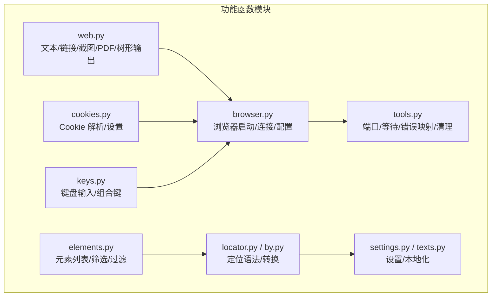
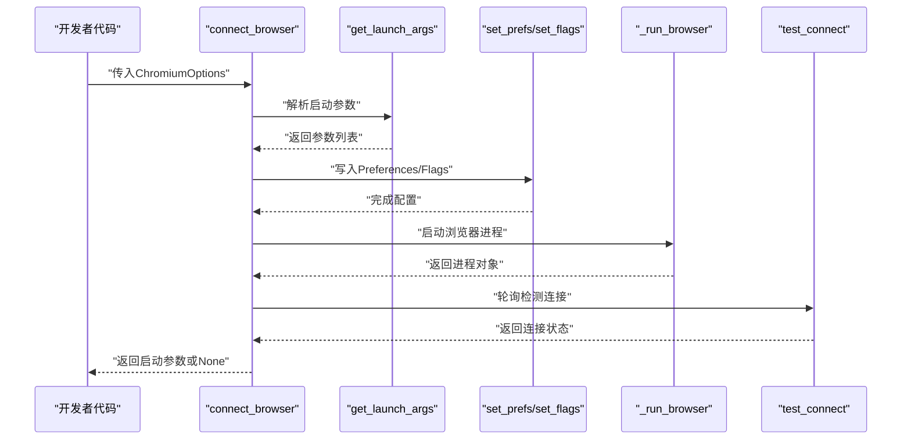
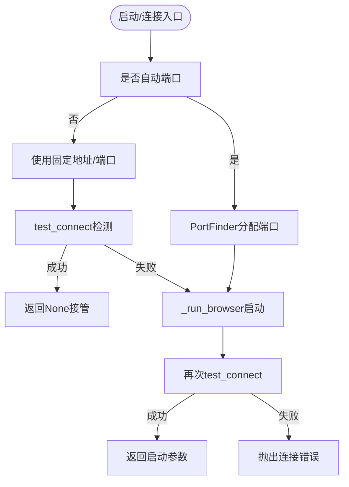
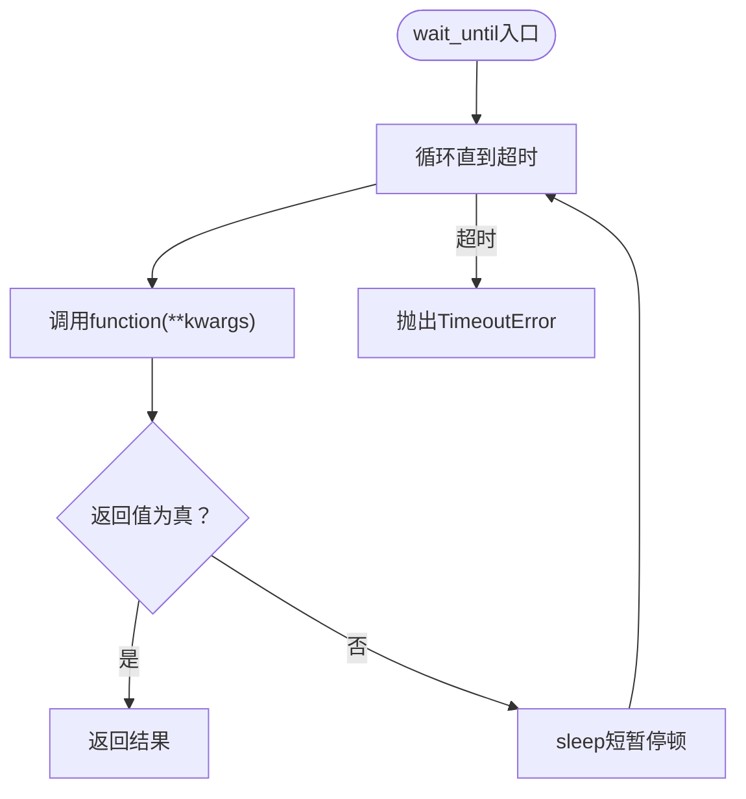
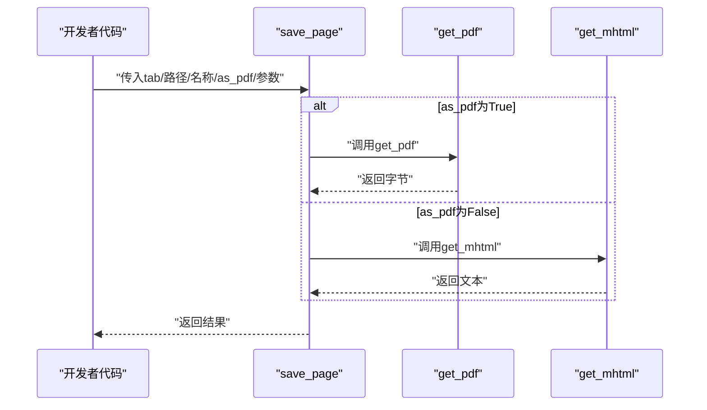
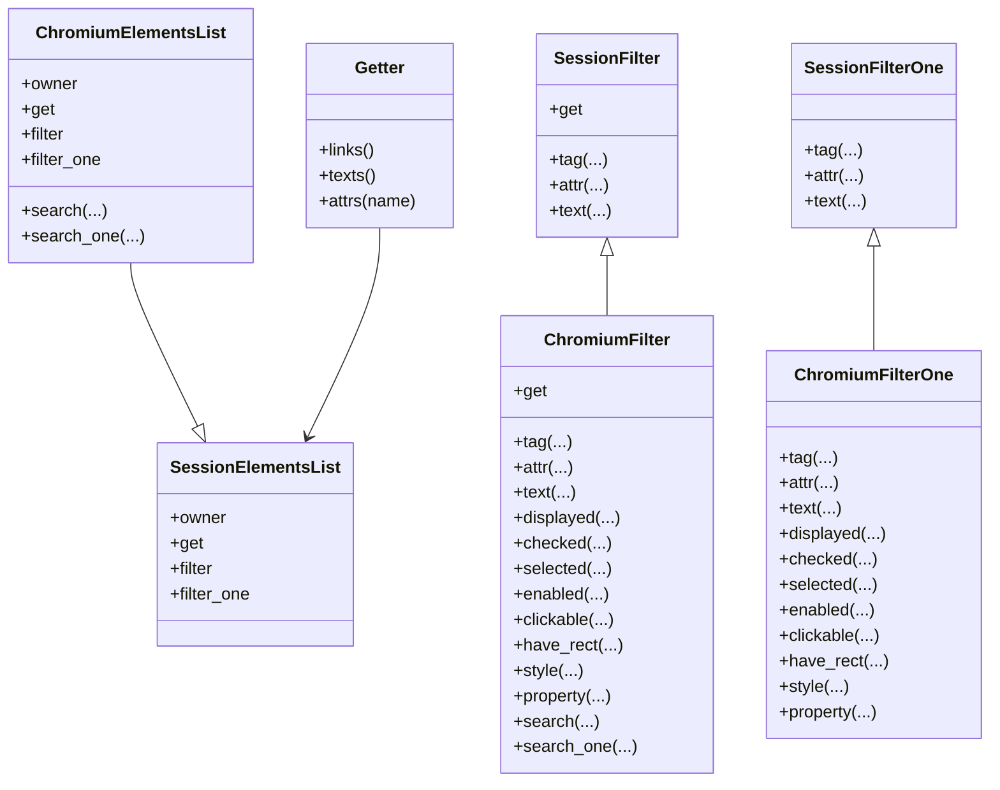
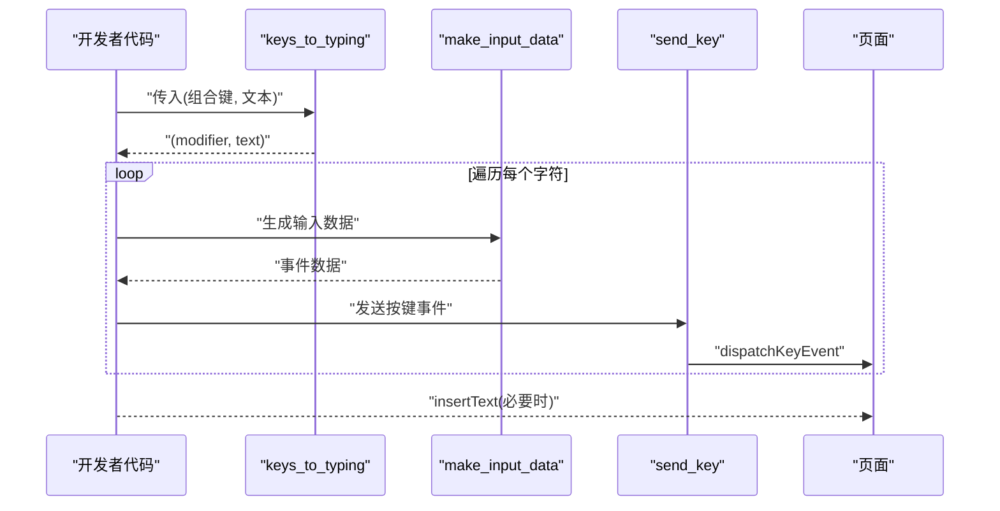
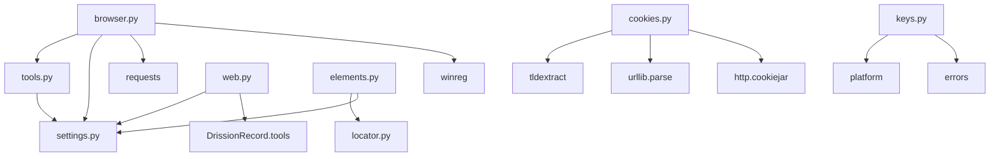

# 功能函数 API

<cite>
**本文引用的文件**
- [browser.py](file://DrissionPage/_functions/browser.py)
- [browser.pyi](file://DrissionPage/_functions/browser.pyi)
- [tools.py](file://DrissionPage/_functions/tools.py)
- [tools.pyi](file://DrissionPage/_functions/tools.pyi)
- [web.py](file://DrissionPage/_functions/web.py)
- [web.pyi](file://DrissionPage/_functions/web.pyi)
- [elements.py](file://DrissionPage/_functions/elements.py)
- [elements.pyi](file://DrissionPage/_functions/elements.pyi)
- [locator.py](file://DrissionPage/_functions/locator.py)
- [locator.pyi](file://DrissionPage/_functions/locator.pyi)
- [by.py](file://DrissionPage/_functions/by.py)
- [settings.py](file://DrissionPage/_functions/settings.py)
- [texts.py](file://DrissionPage/_functions/texts.py)
- [cookies.py](file://DrissionPage/_functions/cookies.py)
- [keys.py](file://DrissionPage/_functions/keys.py)
</cite>

## 目录
1. [简介](#简介)
2. [项目结构](#项目结构)
3. [核心组件](#核心组件)
4. [架构总览](#架构总览)
5. [详细组件分析](#详细组件分析)
6. [依赖分析](#依赖分析)
7. [性能考量](#性能考量)
8. [故障排查指南](#故障排查指南)
9. [结论](#结论)
10. [附录](#附录)

## 简介
本文件为 DrissionPage 项目“功能函数模块”的完整 API 参考文档，覆盖浏览器操作、元素定位、工具函数、Web 相关功能、数据处理与格式转换、键鼠输入、Cookie 处理等常用能力。文档按函数维度给出签名、参数、返回值、典型使用场景、性能与最佳实践建议，并提供可视化流程图帮助理解关键流程。

## 项目结构
功能函数模块位于 DrissionPage/_functions 下，按职责划分为：
- 浏览器控制：browser.py
- 通用工具：tools.py
- Web 数据处理：web.py
- 元素筛选与过滤：elements.py
- 定位语法与转换：locator.py、by.py
- 设置与本地化：settings.py、texts.py
- Cookie 处理：cookies.py
- 键盘输入：keys.py

图表来源
- [browser.py:24-87](file://DrissionPage/_functions/browser.py#L24-L87)
- [tools.py:21-56](file://DrissionPage/_functions/tools.py#L21-L56)
- [web.py:19-104](file://DrissionPage/_functions/web.py#L19-L104)
- [elements.py:16-62](file://DrissionPage/_functions/elements.py#L16-L62)
- [locator.py:15-52](file://DrissionPage/_functions/locator.py#L15-L52)
- [by.py:10-19](file://DrissionPage/_functions/by.py#L10-L19)
- [settings.py:13-24](file://DrissionPage/_functions/settings.py#L13-L24)
- [texts.py:13-33](file://DrissionPage/_functions/texts.py#L13-L33)
- [cookies.py:18-44](file://DrissionPage/_functions/cookies.py#L18-L44)
- [keys.py:23-65](file://DrissionPage/_functions/keys.py#L23-L65)

章节来源
- [browser.py:1-439](file://DrissionPage/_functions/browser.py#L1-L439)
- [tools.py:1-213](file://DrissionPage/_functions/tools.py#L1-L213)
- [web.py:1-349](file://DrissionPage/_functions/web.py#L1-L349)
- [elements.py:1-461](file://DrissionPage/_functions/elements.py#L1-L461)
- [locator.py:1-579](file://DrissionPage/_functions/locator.py#L1-L579)
- [by.py:1-19](file://DrissionPage/_functions/by.py#L1-L19)
- [settings.py:1-69](file://DrissionPage/_functions/settings.py#L1-L69)
- [texts.py:1-405](file://DrissionPage/_functions/texts.py#L1-L405)
- [cookies.py:1-243](file://DrissionPage/_functions/cookies.py#L1-L243)
- [keys.py:1-451](file://DrissionPage/_functions/keys.py#L1-L451)

## 核心组件
- 浏览器连接与启动：connect_browser、get_launch_args、set_prefs、set_flags、test_connect、get_chrome_path、get_edge_path、get_sys_Chrome_user_data_dir、get_edge_user_data_dir
- 通用工具：PortFinder、port_is_using、clean_folder、show_or_hide_browser、get_browser_progress_id、get_hwnds_from_pid、wait_until、configs_to_here、raise_error、ensure_del_dir
- Web 数据处理：get_ele_txt、format_html、location_in_viewport、offset_scroll、make_absolute_link、is_js_func、get_blob、save_page、get_mhtml、get_pdf、tree、format_headers、get_proxy_info
- 元素筛选：SessionElementsList、ChromiumElementsList、SessionFilter、SessionFilterOne、ChromiumFilter、ChromiumFilterOne、Getter、get_eles、get_frame、_search、_search_one
- 定位语法：locator_to_tuple、is_str_loc、is_selenium_loc、get_loc、str_to_xpath_loc、str_to_css_loc、translate_loc、translate_css_loc、css_trans、_preprocess
- 设置与本地化：Settings、get_txt_class、Texts/English
- Cookie 处理：cookie_to_dict、cookies_to_tuple、set_session_cookies、set_browser_cookies、set_tab_cookies、is_cookie_in_driver、format_cookie、CookiesList
- 键盘输入：Keys、keys_to_typing、make_input_data、send_key、input_text_or_keys

章节来源
- [browser.py:24-439](file://DrissionPage/_functions/browser.py#L24-L439)
- [tools.py:21-213](file://DrissionPage/_functions/tools.py#L21-L213)
- [web.py:19-349](file://DrissionPage/_functions/web.py#L19-L349)
- [elements.py:16-461](file://DrissionPage/_functions/elements.py#L16-L461)
- [locator.py:15-579](file://DrissionPage/_functions/locator.py#L15-L579)
- [by.py:10-19](file://DrissionPage/_functions/by.py#L10-L19)
- [settings.py:13-69](file://DrissionPage/_functions/settings.py#L13-L69)
- [texts.py:13-405](file://DrissionPage/_functions/texts.py#L13-L405)
- [cookies.py:18-243](file://DrissionPage/_functions/cookies.py#L18-L243)
- [keys.py:23-451](file://DrissionPage/_functions/keys.py#L23-L451)

## 架构总览
浏览器自动化流程概览：通过 connect_browser 启动或连接浏览器，借助 get_launch_args/set_prefs/set_flags 配置启动参数与用户数据，使用 test_connect 验证连接；随后通过 web.py 的页面操作与 elements.py 的元素筛选完成页面交互；定位语法由 locator.py 提供统一转换；工具函数 tools.py 提供端口、等待、错误映射等支撑；cookies.py 与 keys.py 分别负责 Cookie 设置与键盘输入。

图表来源
- [browser.py:24-87](file://DrissionPage/_functions/browser.py#L24-L87)
- [browser.py:192-228](file://DrissionPage/_functions/browser.py#L192-L228)

## 详细组件分析

### 浏览器操作 API
- connect_browser(opt)
  - 功能：连接浏览器，若不存在则启动并连接
  - 参数：opt（ChromiumOptions）
  - 返回：新创建浏览器返回命令行参数，接管现有浏览器返回 None
  - 使用场景：启动/接管 Chromium/Edge 实例
  - 性能与最佳实践：合理设置端口与用户数据目录，避免冲突；首次启动可启用自动端口与用户目录隔离
  - 章节来源
    - [browser.py:24-87](file://DrissionPage/_functions/browser.py#L24-L87)
    - [browser.pyi:14-19](file://DrissionPage/_functions/browser.pyi#L14-L19)

- get_launch_args(opt)
  - 功能：从 ChromiumOptions 获取命令行启动参数
  - 返回：参数列表
  - 章节来源
    - [browser.py:90-119](file://DrissionPage/_functions/browser.py#L90-L119)
    - [browser.pyi:22-27](file://DrissionPage/_functions/browser.pyi#L22-L27)

- set_prefs(opt) / set_flags(opt)
  - 功能：写入 Preferences 与 Flags 到用户数据目录
  - 返回：None
  - 章节来源
    - [browser.py:122-189](file://DrissionPage/_functions/browser.py#L122-L189)
    - [browser.pyi:30-43](file://DrissionPage/_functions/browser.pyi#L30-L43)

- test_connect(ip, port, timeout)
  - 功能：检测浏览器调试端口连通性
  - 返回：布尔值
  - 章节来源
    - [browser.py:192-210](file://DrissionPage/_functions/browser.py#L192-L210)
    - [browser.pyi:46-53](file://DrissionPage/_functions/browser.pyi#L46-L53)

- get_chrome_path() / get_edge_path()
  - 功能：跨平台查找浏览器可执行路径
  - 返回：路径字符串或抛错
  - 章节来源
    - [browser.py:277-340](file://DrissionPage/_functions/browser.py#L277-L340)
    - [browser.py:343-386](file://DrissionPage/_functions/browser.py#L343-L386)
    - [browser.pyi:56-63](file://DrissionPage/_functions/browser.pyi#L56-L63)

- get_sys_Chrome_user_data_dir() / get_edge_user_data_dir()
  - 功能：获取系统用户数据目录
  - 返回：Path 对象
  - 章节来源
    - [browser.py:389-438](file://DrissionPage/_functions/browser.py#L389-L438)
    - [browser.pyi:66-73](file://DrissionPage/_functions/browser.pyi#L66-L73)

图表来源
- [browser.py:24-87](file://DrissionPage/_functions/browser.py#L24-L87)
- [browser.py:192-228](file://DrissionPage/_functions/browser.py#L192-L228)

### 通用工具 API
- PortFinder.get_port(scope)
  - 功能：在指定范围内查找可用端口
  - 返回：整数端口
  - 章节来源
    - [tools.py:37-55](file://DrissionPage/_functions/tools.py#L37-L55)
    - [tools.pyi:30-36](file://DrissionPage/_functions/tools.pyi#L30-L36)

- port_is_using(ip, port)
  - 功能：检查端口占用
  - 返回：布尔值
  - 章节来源
    - [tools.py:58-64](file://DrissionPage/_functions/tools.py#L58-L64)
    - [tools.pyi:39-44](file://DrissionPage/_functions/tools.pyi#L39-L44)

- clean_folder(folder_path, ignore)
  - 功能：清空文件夹（保留忽略列表）
  - 返回：None
  - 章节来源
    - [tools.py:67-77](file://DrissionPage/_functions/tools.py#L67-L77)
    - [tools.pyi:48-53](file://DrissionPage/_functions/tools.pyi#L48-L53)

- show_or_hide_browser(tab, hide)
  - 功能：显示/隐藏浏览器窗口（Windows）
  - 返回：None
  - 章节来源
    - [tools.py:79-99](file://DrissionPage/_functions/tools.py#L79-L99)
    - [tools.pyi:57-62](file://DrissionPage/_functions/tools.pyi#L57-L62)

- get_browser_progress_id(progress, address)
  - 功能：根据地址反查浏览器进程ID
  - 返回：字符串或 None
  - 章节来源
    - [tools.py:101-116](file://DrissionPage/_functions/tools.py#L101-L116)
    - [tools.pyi:66-71](file://DrissionPage/_functions/tools.pyi#L66-L71)

- get_hwnds_from_pid(pid, title)
  - 功能：通过 PID 获取窗口句柄
  - 返回：句柄列表
  - 章节来源
    - [tools.py:119-136](file://DrissionPage/_functions/tools.py#L119-L136)
    - [tools.pyi:75-81](file://DrissionPage/_functions/tools.pyi#L75-L81)

- wait_until(function, kwargs, timeout)
  - 功能：等待函数返回真值
  - 返回：执行结果，超时抛异常
  - 章节来源
    - [tools.py:139-148](file://DrissionPage/_functions/tools.py#L139-L148)
    - [tools.pyi:84-91](file://DrissionPage/_functions/tools.pyi#L84-L91)

- configs_to_here(save_name)
  - 功能：复制默认配置到当前目录
  - 返回：None
  - 章节来源
    - [tools.py:151-155](file://DrissionPage/_functions/tools.py#L151-L155)
    - [tools.pyi:94-98](file://DrissionPage/_functions/tools.pyi#L94-L98)

- raise_error(result, browser, ignore, user)
  - 功能：将底层错误映射为具体异常
  - 返回：None（抛异常）
  - 章节来源
    - [tools.py:157-197](file://DrissionPage/_functions/tools.py#L157-L197)
    - [tools.pyi:102-111](file://DrissionPage/_functions/tools.pyi#L102-L111)

- ensure_del_dir(path)
  - 功能：尽力删除目录（带重试）
  - 返回：布尔值
  - 章节来源
    - [tools.py:200-212](file://DrissionPage/_functions/tools.py#L200-L212)
    - [tools.pyi:114-117](file://DrissionPage/_functions/tools.pyi#L114-L117)

图表来源
- [tools.py:139-148](file://DrissionPage/_functions/tools.py#L139-L148)

### Web 相关 API
- get_ele_txt(e)
  - 功能：提取元素内文本，规范化换行与空白
  - 返回：字符串
  - 章节来源
    - [web.py:20-104](file://DrissionPage/_functions/web.py#L20-L104)
    - [web.pyi:17-22](file://DrissionPage/_functions/web.pyi#L17-L22)

- format_html(text)
  - 功能：HTML 实体解码与空格处理
  - 返回：字符串
  - 章节来源
    - [web.py:106-107](file://DrissionPage/_functions/web.py#L106-L107)
    - [web.pyi:25-30](file://DrissionPage/_functions/web.pyi#L25-L30)

- location_in_viewport(page, loc_x, loc_y)
  - 功能：判断坐标是否在视口内
  - 返回：布尔值
  - 章节来源
    - [web.py:110-118](file://DrissionPage/_functions/web.py#L110-L118)
    - [web.pyi:33-40](file://DrissionPage/_functions/web.pyi#L33-L40)

- offset_scroll(ele, offset_x, offset_y)
  - 功能：将元素某点滚动至视口中心并返回相对坐标
  - 返回：坐标元组
  - 章节来源
    - [web.py:121-134](file://DrissionPage/_functions/web.py#L121-L134)
    - [web.pyi:43-51](file://DrissionPage/_functions/web.pyi#L43-L51)

- make_absolute_link(link, baseURI)
  - 功能：生成绝对链接
  - 返回：字符串
  - 章节来源
    - [web.py:137-157](file://DrissionPage/_functions/web.py#L137-L157)
    - [web.pyi:54-60](file://DrissionPage/_functions/web.pyi#L54-L60)

- is_js_func(func)
  - 功能：判断字符串是否为函数
  - 返回：布尔值
  - 章节来源
    - [web.py:160-166](file://DrissionPage/_functions/web.py#L160-L166)
    - [web.pyi:63-65](file://DrissionPage/_functions/web.pyi#L63-L65)

- get_blob(page, url, as_bytes)
  - 功能：获取 blob 资源
  - 返回：字节或字符串
  - 章节来源
    - [web.py:169-195](file://DrissionPage/_functions/web.py#L169-L195)
    - [web.pyi:68-75](file://DrissionPage/_functions/web.pyi#L68-L75)

- save_page(tab, path, name, as_pdf, kwargs)
  - 功能：保存页面为 PDF 或 MHTML
  - 返回：字节或字符串
  - 章节来源
    - [web.py:198-218](file://DrissionPage/_functions/web.py#L198-L218)
    - [web.pyi:78-91](file://DrissionPage/_functions/web.pyi#L78-L91)

- get_mhtml(page, path, name)
  - 功能：保存为 MHTML
  - 返回：MHTML 文本
  - 章节来源
    - [web.py:221-231](file://DrissionPage/_functions/web.py#L221-L231)
    - [web.pyi:94-103](file://DrissionPage/_functions/web.pyi#L94-L103)

- get_pdf(page, path, name, kwargs)
  - 功能：保存为 PDF
  - 返回：字节
  - 章节来源
    - [web.py:234-254](file://DrissionPage/_functions/web.py#L234-L254)
    - [web.pyi:106-117](file://DrissionPage/_functions/web.pyi#L106-L117)

- tree(ele_or_page, text, show_js, show_css)
  - 功能：打印 DOM 树
  - 返回：None
  - 章节来源
    - [web.py:257-302](file://DrissionPage/_functions/web.py#L257-L302)
    - [web.pyi:120-131](file://DrissionPage/_functions/web.pyi#L120-L131)

- format_headers(txt)
  - 功能：从浏览器复制的头文本解析为字典
  - 返回：字典
  - 章节来源
    - [web.py:304-318](file://DrissionPage/_functions/web.py#L304-L318)
    - [web.pyi:134-139](file://DrissionPage/_functions/web.pyi#L134-L139)

- get_proxy_info(proxy_str)
  - 功能：解析代理字符串为 (url, user, pwd)
  - 返回：三元组
  - 章节来源
    - [web.py:321-348](file://DrissionPage/_functions/web.py#L321-L348)
    - [web.pyi:142-147](file://DrissionPage/_functions/web.pyi#L142-L147)

图表来源
- [web.py:198-218](file://DrissionPage/_functions/web.py#L198-L218)
- [web.py:234-254](file://DrissionPage/_functions/web.py#L234-L254)
- [web.py:221-231](file://DrissionPage/_functions/web.py#L221-L231)

### 元素定位与筛选 API
- locator_to_tuple(loc)
  - 功能：解析定位字符串为内部结构
  - 返回：字典
  - 章节来源
    - [locator.py:15-51](file://DrissionPage/_functions/locator.py#L15-L51)
    - [locator.pyi:11-16](file://DrissionPage/_functions/locator.pyi#L11-L16)

- is_str_loc(text) / is_selenium_loc(loc)
  - 功能：判断是否为定位符
  - 返回：布尔值
  - 章节来源
    - [locator.py:85-94](file://DrissionPage/_functions/locator.py#L85-L94)
    - [locator.pyi:19-26](file://DrissionPage/_functions/locator.pyi#L19-L26)

- get_loc(loc, translate_css)
  - 功能：标准化定位元组（可翻译 CSS 为 XPath）
  - 返回：定位元组
  - 章节来源
    - [locator.py:96-115](file://DrissionPage/_functions/locator.py#L96-L115)
    - [locator.pyi:29-36](file://DrissionPage/_functions/locator.pyi#L29-L36)

- str_to_xpath_loc(loc) / str_to_css_loc(loc)
  - 功能：字符串定位转为 XPath/CSS
  - 返回：定位元组
  - 章节来源
    - [locator.py:147-235](file://DrissionPage/_functions/locator.py#L147-L235)
    - [locator.pyi:39-52](file://DrissionPage/_functions/locator.pyi#L39-L52)

- translate_loc(loc) / translate_css_loc(loc)
  - 功能：将 By 类型定位转换为 XPath/CSS
  - 返回：定位元组
  - 章节来源
    - [locator.py:468-543](file://DrissionPage/_functions/locator.py#L468-L543)
    - [locator.pyi:55-68](file://DrissionPage/_functions/locator.pyi#L55-L68)

- css_trans(txt)
  - 功能：CSS 特殊字符转义
  - 返回：字符串
  - 章节来源
    - [locator.py:546-550](file://DrissionPage/_functions/locator.py#L546-L550)
    - [locator.pyi:71-75](file://DrissionPage/_functions/locator.pyi#L71-L75)

- get_eles(locators, owner, any_one, first_ele, timeout)
  - 功能：批量获取元素
  - 返回：字典（定位符->元素/列表）
  - 章节来源
    - [elements.py:276-302](file://DrissionPage/_functions/elements.py#L276-L302)
    - [elements.pyi:562-576](file://DrissionPage/_functions/elements.pyi#L562-L576)

- get_frame(owner, loc_ind_ele, timeout)
  - 功能：获取 Frame 对象
  - 返回：Frame 对象
  - 章节来源
    - [elements.py:305-338](file://DrissionPage/_functions/elements.py#L305-L338)
    - [elements.pyi:579-588](file://DrissionPage/_functions/elements.pyi#L579-L588)

- SessionElementsList / ChromiumElementsList
  - 功能：元素列表容器，支持 filter/filter_one/search/search_one
  - 章节来源
    - [elements.py:16-62](file://DrissionPage/_functions/elements.py#L16-L62)
    - [elements.pyi:18-62](file://DrissionPage/_functions/elements.pyi#L18-L62)

- SessionFilter / SessionFilterOne / ChromiumFilter / ChromiumFilterOne
  - 功能：元素筛选链式 API（tag/attr/text/style/property/displayed/checked/selected/enabled/clickable/have_rect）
  - 章节来源
    - [elements.py:64-260](file://DrissionPage/_functions/elements.py#L64-L260)
    - [elements.pyi:127-365](file://DrissionPage/_functions/elements.pyi#L127-L365)

- Getter
  - 功能：批量获取属性（links/texts/attrs）
  - 章节来源
    - [elements.py:262-275](file://DrissionPage/_functions/elements.py#L262-L275)
    - [elements.pyi:537-559](file://DrissionPage/_functions/elements.pyi#L537-L559)

图表来源
- [elements.py:16-275](file://DrissionPage/_functions/elements.py#L16-L275)
- [elements.pyi:18-559](file://DrissionPage/_functions/elements.pyi#L18-L559)

### 设置与本地化 API
- Settings
  - 功能：全局配置（异常抛出开关、超时、语言、后缀列表等）
  - 方法：set_raise_when_ele_not_found/.../set_language/set_suffixes_list
  - 章节来源
    - [settings.py:13-69](file://DrissionPage/_functions/settings.py#L13-L69)

- get_txt_class(lang)
  - 功能：获取本地化文本类实例
  - 返回：Texts/English
  - 章节来源
    - [texts.py:13-33](file://DrissionPage/_functions/texts.py#L13-L33)

- Texts/English
  - 功能：内置错误与提示文案
  - 章节来源
    - [texts.py:35-405](file://DrissionPage/_functions/texts.py#L35-L405)

### Cookie 处理 API
- cookie_to_dict(cookie)
  - 功能：统一为字典格式
  - 返回：字典
  - 章节来源
    - [cookies.py:18-44](file://DrissionPage/_functions/cookies.py#L18-L44)

- cookies_to_tuple(cookies)
  - 功能：统一为元组格式
  - 返回：元组
  - 章节来源
    - [cookies.py:47-71](file://DrissionPage/_functions/cookies.py#L47-L71)

- set_session_cookies(session, cookies)
  - 功能：设置 requests 会话 Cookie
  - 返回：None
  - 章节来源
    - [cookies.py:74-87](file://DrissionPage/_functions/cookies.py#L74-L87)

- set_browser_cookies(browser, cookies)
  - 功能：设置浏览器上下文 Cookie
  - 返回：None
  - 章节来源
    - [cookies.py:89-99](file://DrissionPage/_functions/cookies.py#L89-L99)

- set_tab_cookies(page, cookies)
  - 功能：设置标签页 Cookie（自动推断域）
  - 返回：None
  - 章节来源
    - [cookies.py:101-147](file://DrissionPage/_functions/cookies.py#L101-L147)

- is_cookie_in_driver(page, cookie)
  - 功能：检查 Cookie 是否已生效
  - 返回：布尔值
  - 章节来源
    - [cookies.py:149-159](file://DrissionPage/_functions/cookies.py#L149-L159)

- format_cookie(cookie)
  - 功能：标准化 Cookie 字段
  - 返回：字典
  - 章节来源
    - [cookies.py:162-218](file://DrissionPage/_functions/cookies.py#L162-L218)

- CookiesList.as_dict()/as_str()/as_json()
  - 功能：序列化 Cookie 列表
  - 返回：字典/字符串/JSON
  - 章节来源
    - [cookies.py:221-231](file://DrissionPage/_functions/cookies.py#L221-L231)

### 键盘输入 API
- Keys
  - 功能：特殊键常量（如 ENTER、TAB、META、COMMAND 等）
  - 章节来源
    - [keys.py:23-96](file://DrissionPage/_functions/keys.py#L23-L96)

- keys_to_typing(value)
  - 功能：解析输入序列（修饰键与文本）
  - 返回：(modifier, text)
  - 章节来源
    - [keys.py:353-368](file://DrissionPage/_functions/keys.py#L353-L368)

- make_input_data(modifiers, key)
  - 功能：生成输入事件数据
  - 返回：字典
  - 章节来源
    - [keys.py:371-422](file://DrissionPage/_functions/keys.py#L371-L422)

- send_key(page, modifier, key)
  - 功能：发送单个按键事件
  - 返回：None
  - 章节来源
    - [keys.py:425-434](file://DrissionPage/_functions/keys.py#L425-L434)

- input_text_or_keys(page, text_or_keys)
  - 功能：输入文本或按键序列
  - 返回：None
  - 章节来源
    - [keys.py:436-451](file://DrissionPage/_functions/keys.py#L436-L451)

图表来源
- [keys.py:353-451](file://DrissionPage/_functions/keys.py#L353-L451)

## 依赖分析
- 模块内聚与耦合
  - browser.py 依赖 settings.py 与 tools.py（错误映射、端口/目录工具），间接依赖 requests、winreg 等
  - web.py 依赖 settings.py 与 DrissionRecord（工具函数）、requests 结构
  - elements.py 依赖 locator.py 与 settings.py
  - tools.py 依赖 settings.py 与多种异常类型
  - cookies.py 依赖 tldextract、urllib.parse、http.cookiejar
  - keys.py 依赖 platform 与 errors
- 外部依赖
  - requests、winreg（Windows）、tldextract、DrissionRecord

图表来源
- [browser.py:1-22](file://DrissionPage/_functions/browser.py#L1-L22)
- [web.py:8-17](file://DrissionPage/_functions/web.py#L8-L17)
- [elements.py:10-13](file://DrissionPage/_functions/elements.py#L10-L13)
- [tools.py:15-18](file://DrissionPage/_functions/tools.py#L15-L18)
- [cookies.py:13-11](file://DrissionPage/_functions/cookies.py#L13-L11)
- [keys.py:8-10](file://DrissionPage/_functions/keys.py#L8-L10)

章节来源
- [browser.py:1-22](file://DrissionPage/_functions/browser.py#L1-L22)
- [web.py:8-17](file://DrissionPage/_functions/web.py#L8-L17)
- [elements.py:10-13](file://DrissionPage/_functions/elements.py#L10-L13)
- [tools.py:15-18](file://DrissionPage/_functions/tools.py#L15-L18)
- [cookies.py:13-11](file://DrissionPage/_functions/cookies.py#L13-L11)
- [keys.py:8-10](file://DrissionPage/_functions/keys.py#L8-L10)

## 性能考量
- 端口与进程
  - 使用 PortFinder 时注意范围与并发，避免频繁端口扫描导致性能下降
  - ensure_del_dir 采用短时重试，避免长时间阻塞
- 浏览器连接
  - test_connect 轮询间隔与超时应结合网络与系统负载调整
  - 自动端口与用户数据目录隔离可减少冲突与重启成本
- 元素查找
  - get_eles 支持多定位符并行等待，timeout 与 first_ele 控制策略影响性能
  - ChromiumFilter 的链式筛选尽量前置条件，减少后续遍历
- 文本与链接
  - get_ele_txt 对复杂 DOM 的文本提取有一定开销，必要时限制层级或使用更精确的定位
- Cookie 设置
  - set_tab_cookies 会尝试多种域组合，建议明确 domain/url 以减少尝试次数
- 键盘输入
  - send_key 逐键发送，长文本建议使用 input_text_or_keys 一次性插入

## 故障排查指南
- 浏览器连接失败
  - 检查端口占用与地址合法性；确认 is_existing_only 与 test_connect 结果
  - 参考提示信息与 Settings 中的语言文案定位问题
  - 章节来源
    - [browser.py:192-210](file://DrissionPage/_functions/browser.py#L192-L210)
    - [tools.py:157-197](file://DrissionPage/_functions/tools.py#L157-L197)
    - [texts.py:74-174](file://DrissionPage/_functions/texts.py#L74-L174)

- 元素查找失败
  - 使用 tree 打印 DOM 校验定位；检查 is_str_loc/is_selenium_loc
  - 使用 wait_until 等待元素出现；必要时调整 get_loc 的 translate_css
  - 章节来源
    - [locator.py:85-115](file://DrissionPage/_functions/locator.py#L85-L115)
    - [web.py:257-302](file://DrissionPage/_functions/web.py#L257-L302)
    - [tools.py:139-148](file://DrissionPage/_functions/tools.py#L139-L148)

- Cookie 设置异常
  - 明确 domain/url；检查 format_cookie 的字段校验
  - 使用 is_cookie_in_driver 检查是否已生效
  - 章节来源
    - [cookies.py:162-218](file://DrissionPage/_functions/cookies.py#L162-L218)
    - [cookies.py:149-159](file://DrissionPage/_functions/cookies.py#L149-L159)

- 键盘输入无效
  - 确认页面焦点；检查 make_input_data 的 key 映射
  - 在 macOS 上 Meta 组合键行为不同，注意区分
  - 章节来源
    - [keys.py:371-422](file://DrissionPage/_functions/keys.py#L371-L422)
    - [keys.py:15-21](file://DrissionPage/_functions/keys.py#L15-L21)

## 结论
本 API 参考文档系统梳理了 DrissionPage 功能函数模块的核心能力，覆盖浏览器启动/连接、元素定位/筛选、Web 数据处理、Cookie/键盘输入、通用工具与本地化等。建议在实际使用中结合超时与重试策略、合理选择定位方式与筛选条件、明确 Cookie 域与字段，以获得稳定高效的自动化体验。

## 附录
- 常用最佳实践
  - 定位优先使用稳定属性（id/class/name），避免过于复杂的 XPath
  - 大量元素筛选时，先用 tag/attr 缩小范围，再用 text/have_text 精确匹配
  - 页面截图/PDF 前确保页面完全加载，必要时等待布局完成
  - Cookie 设置前明确 domain/url，避免多次尝试
  - 键盘输入长文本时优先使用 input_text_or_keys，按键序列使用 send_key 逐键发送