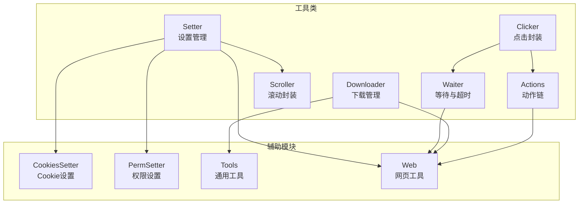
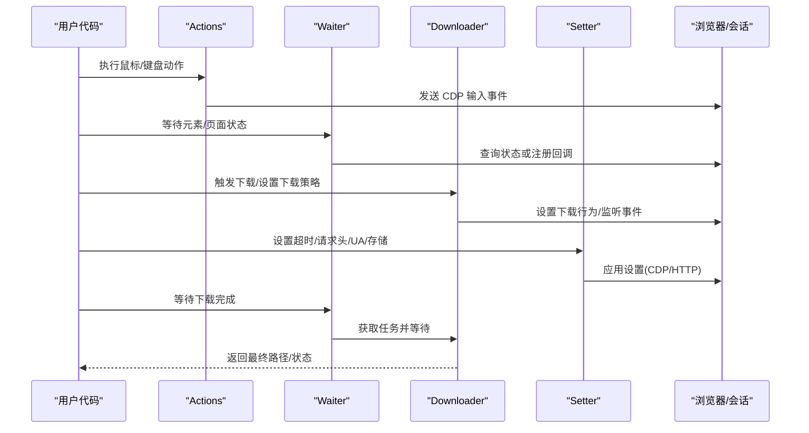
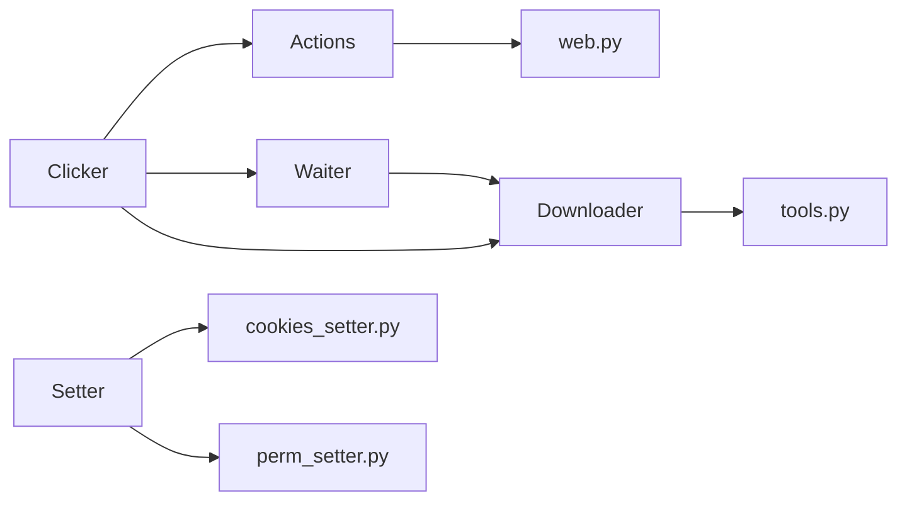

# 工具类 API

<cite>
**本文引用的文件**
- [actions.py](file://DrissionPage/_units/actions.py)
- [actions.pyi](file://DrissionPage/_units/actions.pyi)
- [downloader.py](file://DrissionPage/_units/downloader.py)
- [downloader.pyi](file://DrissionPage/_units/downloader.pyi)
- [waiter.py](file://DrissionPage/_units/waiter.py)
- [waiter.pyi](file://DrissionPage/_units/waiter.pyi)
- [setter.py](file://DrissionPage/_units/setter.py)
- [setter.pyi](file://DrissionPage/_units/setter.pyi)
- [clicker.py](file://DrissionPage/_units/clicker.py)
- [scroller.py](file://DrissionPage/_units/scroller.py)
- [cookies_setter.py](file://DrissionPage/_units/cookies_setter.py)
- [perm_setter.py](file://DrissionPage/_units/perm_setter.py)
- [tools.py](file://DrissionPage/_functions/tools.py)
- [web.py](file://DrissionPage/_functions/web.py)
</cite>

## 目录
1. [简介](#简介)
2. [项目结构](#项目结构)
3. [核心组件](#核心组件)
4. [架构总览](#架构总览)
5. [详细组件分析](#详细组件分析)
6. [依赖关系分析](#依赖关系分析)
7. [性能考量](#性能考量)
8. [故障排查指南](#故障排查指南)
9. [结论](#结论)
10. [附录](#附录)

## 简介
本文件为 DrissionPage 工具类模块的完整 API 参考文档，聚焦以下工具类：
- Actions：鼠标键盘操作、拖拽、滚动、输入等动作链
- Downloader：下载任务管理、下载路径与策略配置、下载进度与完成处理
- Waiter：页面、元素、下载等条件等待与超时控制
- Setter：设置管理，包括下载路径、超时、请求头、用户代理、存储、权限、窗口等

文档提供各工具类的公共方法与属性说明、方法签名、典型使用场景与注意事项，并给出性能优化与资源管理建议，帮助开发者高效、稳定地进行浏览器自动化。

## 项目结构
工具类模块位于 DrissionPage/_units/ 目录，主要文件如下：
- actions.py / actions.pyi：动作链与鼠标键盘操作
- downloader.py / downloader.pyi：下载管理与任务生命周期
- waiter.py / waiter.pyi：等待与超时控制
- setter.py / setter.pyi：设置管理
- clicker.py：元素点击封装
- scroller.py：滚动封装
- cookies_setter.py：Cookie 设置器
- perm_setter.py：权限设置器
- tools.py：通用工具函数
- web.py：网页辅助函数

图表来源
- [actions.py:16-266](file://DrissionPage/_units/actions.py#L16-L266)
- [downloader.py:18-309](file://DrissionPage/_units/downloader.py#L18-L309)
- [waiter.py:15-433](file://DrissionPage/_units/waiter.py#L15-L433)
- [setter.py:21-619](file://DrissionPage/_units/setter.py#L21-L619)
- [clicker.py:19-207](file://DrissionPage/_units/clicker.py#L19-L207)
- [scroller.py:11-142](file://DrissionPage/_units/scroller.py#L11-L142)
- [cookies_setter.py:12-82](file://DrissionPage/_units/cookies_setter.py#L12-L82)
- [perm_setter.py:2-311](file://DrissionPage/_units/perm_setter.py#L2-L311)
- [tools.py:21-213](file://DrissionPage/_functions/tools.py#L21-L213)
- [web.py:110-135](file://DrissionPage/_functions/web.py#L110-L135)

章节来源
- [actions.py:16-266](file://DrissionPage/_units/actions.py#L16-L266)
- [downloader.py:18-309](file://DrissionPage/_units/downloader.py#L18-L309)
- [waiter.py:15-433](file://DrissionPage/_units/waiter.py#L15-L433)
- [setter.py:21-619](file://DrissionPage/_units/setter.py#L21-L619)
- [clicker.py:19-207](file://DrissionPage/_units/clicker.py#L19-L207)
- [scroller.py:11-142](file://DrissionPage/_units/scroller.py#L11-L142)
- [cookies_setter.py:12-82](file://DrissionPage/_units/cookies_setter.py#L12-L82)
- [perm_setter.py:2-311](file://DrissionPage/_units/perm_setter.py#L2-L311)
- [tools.py:21-213](file://DrissionPage/_functions/tools.py#L21-L213)
- [web.py:110-135](file://DrissionPage/_functions/web.py#L110-L135)

## 核心组件
- Actions：提供鼠标移动、点击、滚轮、修饰键、文本输入、拖拽等动作链能力；支持等待与延时。
- Downloader：统一管理下载任务，支持设置下载路径、文件名策略、同名文件处理策略、任务取消/跳过/完成清理。
- Waiter：提供页面加载、元素状态、URL/标题变更、弹窗关闭、下载开始/完成等等待能力，支持超时与异常处理。
- Setter：集中管理超时、下载路径、请求头、UA、本地/会话存储、上传文件、权限、窗口等设置。
- Clicker：对元素点击进行封装，支持 JS 点击、中键打开新标签、下载触发、上传文件等。
- Scroller：对滚动进行封装，支持滚动到顶部/底部/居中、相对滚动、可见区域滚动等。

章节来源
- [actions.py:16-266](file://DrissionPage/_units/actions.py#L16-L266)
- [downloader.py:18-309](file://DrissionPage/_units/downloader.py#L18-L309)
- [waiter.py:15-433](file://DrissionPage/_units/waiter.py#L15-L433)
- [setter.py:21-619](file://DrissionPage/_units/setter.py#L21-L619)
- [clicker.py:19-207](file://DrissionPage/_units/clicker.py#L19-L207)
- [scroller.py:11-142](file://DrissionPage/_units/scroller.py#L11-L142)

## 架构总览
工具类围绕 Chromium/Session 页面对象协作，通过 CDP 或 HTTP 请求实现底层交互。Downloader 通过浏览器回调监听下载事件；Waiter 通过轮询或回调检测状态变化；Setter 封装设置项并通过 CDP/HTTP 应用到浏览器或会话；Actions/Clicker/Scroller 提供高层操作抽象。

图表来源
- [actions.py:25-266](file://DrissionPage/_units/actions.py#L25-L266)
- [waiter.py:52-433](file://DrissionPage/_units/waiter.py#L52-L433)
- [downloader.py:18-309](file://DrissionPage/_units/downloader.py#L18-L309)
- [setter.py:126-619](file://DrissionPage/_units/setter.py#L126-L619)

## 详细组件分析

### Actions 工具类 API
- 主要职责：鼠标移动、点击、滚轮、修饰键、文本输入、拖拽、等待等动作链操作。
- 关键方法与属性
  - move_to(ele_or_loc, offset_x=0, offset_y=0, duration=.5)：移动到元素中点或绝对坐标，支持偏移与持续时间
  - move(offset_x=0, offset_y=0, duration=.5)：相对位移
  - click/on/r_click/m_click(...)/hold/release(...)/r_hold/r_release(...)/m_hold/m_release(...)：鼠标点击与按住/释放
  - scroll(delta_y=0, delta_x=0, on_ele=None)：滚轮滚动
  - up/down/left/right(pixel)：方向移动
  - key_down/key_up(key)：修饰键与按键
  - type(keys, interval=0)：输入文本或组合键序列
  - input(text)：输入文本或组合键
  - drag_in(ele_or_loc, files=None, text=None, title=None, baseURL=None, offset_x=None, offset_y=None)：触发拖拽进入
  - wait(second, scope=None)：等待秒数或随机范围
  - 属性：modifier、curr_x、curr_y、_holding、_mouse_trail
- 典型用法
  - 在元素上点击并等待：Actions(owner).move_to(ele).click().wait(.5)
  - 输入文本并按回车：Actions(owner).input("hello").key_down("enter").key_up("enter")
  - 拖拽文件到元素：Actions(owner).drag_in(target, files=["/path/a.jpg"])
- 注意事项
  - 持续时间过短可能导致输入不稳定，interval 参数可调节输入节奏
  - 拖拽时需确保目标元素可见或滚动至可视区域

章节来源
- [actions.py:25-266](file://DrissionPage/_units/actions.py#L25-L266)
- [actions.pyi:44-266](file://DrissionPage/_units/actions.pyi#L44-L266)
- [web.py:110-135](file://DrissionPage/_functions/web.py#L110-L135)

### Downloader 工具类 API
- 主要职责：下载任务的创建、监控、完成处理、取消/跳过、路径与命名策略、同名文件处理策略。
- 关键类与方法
  - DownloadManager
    - set_path(tab, path)：设置下载路径
    - set_rename(tab_id, rename=None, suffix=None)：设置重命名策略
    - set_file_exists(tab_id, mode)：设置同名文件处理策略（skip/rename/overwrite）
    - set_flag/get_flag/clear_tab_info：任务标记与清理
    - get_tab_missions：获取标签页任务集合
    - cancel/skip/set_done：任务控制
    - 内部回调：_onDownloadWillBegin/_onDownloadProgress
  - TabDownloadSettings：每个标签页的下载设置缓存
  - DownloadMission：单个任务对象
    - 属性：rate、is_done、url、id、folder、name、state、total_bytes、received_bytes、final_path
    - 方法：cancel()、wait(show=True, timeout=None, cancel_if_timeout=True)
- 典型用法
  - 触发下载并等待完成：dl_mgr.set_flag(tid, True); clicker.left(); mission = wait_mission(browser, tid, timeout); mission.wait()
  - 设置下载路径与重命名：dl_mgr.set_path(tab, "/path"); dl_mgr.set_rename(tab_id, "name", "pdf")
- 注意事项
  - 需先设置下载路径，否则无法监听下载事件
  - 同名文件策略会影响最终文件路径与覆盖行为
  - 超时控制可选择取消未完成任务

章节来源
- [downloader.py:18-309](file://DrissionPage/_units/downloader.py#L18-L309)
- [downloader.pyi:16-211](file://DrissionPage/_units/downloader.pyi#L16-L211)
- [waiter.py:421-433](file://DrissionPage/_units/waiter.py#L421-L433)

### Waiter 工具类 API
- 主要职责：等待页面/元素状态变化、URL/标题变更、弹窗关闭、下载开始/完成等。
- 关键类与方法
  - OriginWaiter：基础等待器，支持固定秒数或随机范围等待
  - BrowserContextWaiter：上下文级等待，如新标签页
  - BrowserWaiter：浏览器级等待，如下载开始/全部完成
  - BaseWaiter：页面级等待，如元素显示/隐藏、加载开始/完成、URL/标题变更、上传路径输入完成
  - ChromiumTabWaiter：标签页级等待，如下载完成、弹窗关闭
  - ChromiumPageWaiter：页面级等待，如新标签页、下载完成
  - ElementWaiter：元素级等待，如删除、显示/隐藏、可点击、停止移动等
  - FrameWaiter：框架级等待
  - 工具函数：wait_mission(browser, tid, timeout)
- 典型用法
  - 等待元素可点击：ele.wait.clickable(timeout=5)
  - 等待页面加载完成：page.wait.doc_loaded(timeout=10)
  - 等待下载开始：page.wait.download_begin(timeout=5)
  - 等待下载完成：page.wait.downloads_done(timeout=30, cancel_if_timeout=True)
- 注意事项
  - 超时参数为 None 时可能无限等待，建议设置合理超时
  - raise_err 参数可控制失败时抛出异常或返回 False

章节来源
- [waiter.py:15-433](file://DrissionPage/_units/waiter.py#L15-L433)
- [waiter.pyi:20-665](file://DrissionPage/_units/waiter.pyi#L20-L665)

### Setter 工具类 API
- 主要职责：统一管理超时、下载路径、请求头、UA、存储、权限、窗口等设置。
- 关键类与方法
  - BaseSetter：通用设置基类
    - NoneElement_value(value=None, on_off=True)：空元素返回值控制
    - retry_times(times)、retry_interval(interval)：重试次数与间隔
    - download_path(path)：下载路径设置
  - SessionPageSetter：会话页面设置
    - cookies：会话 Cookie 设置器
    - timeout(encoding/set_all)、headers/header/user_agent/proxies/auth/hooks/params/verify/cert/stream/trust_env/max_redirects/add_adapter
  - BrowserBaseSetter：浏览器/ChromiumBase 设置
    - load_mode：页面加载模式
    - timeouts(base, page_load, script)：超时设置
  - BrowserContextSetter：浏览器上下文设置
    - perm：权限设置器
    - cookies：浏览器 Cookie 设置器
  - BrowserSetter：浏览器设置
    - window：窗口设置器
    - auto_handle_alert(on_off=True, accept=True)
    - download_path/download_file_name/when_download_file_exists
  - ChromiumBaseSetter：Chromium 基础设置
    - scroll：页面滚动设置器
    - cookies：Cookie 设置器
    - headers/user_agent/session_storage/local_storage/upload_files/auto_handle_alert/blocked_urls/show_trail
  - ChromiumTabSetter：标签页设置
    - window/cookies/headers/user_agent/timeouts/download_path/download_file_name/when_download_file_exists/activate
  - ChromiumPageSetter：页面设置
    - cookies
  - ChromiumElementSetter：元素设置
    - attr/property/style/innerHTML/value
  - LoadMode：页面加载模式
  - PageScrollSetter：滚动设置
  - WindowSetter：窗口设置
- 典型用法
  - 设置 UA 与请求头：page.set.user_agent("...").headers({...})
  - 设置下载路径与策略：page.set.download_path("/path").when_download_file_exists("rename")
  - 设置本地/会话存储：page.set.local_storage("key", "val").session_storage("key", "val")
  - 设置权限：page.browser.set.perm.camera(False).microphone(True)
  - 设置窗口：page.set.window.size(width=1200,height=800).location(x=100,y=100)
- 注意事项
  - 权限设置需在对应上下文 ID 下生效
  - 存储设置需启用 DOMStorage 并正确传递 storageId

章节来源
- [setter.py:21-619](file://DrissionPage/_units/setter.py#L21-L619)
- [setter.pyi:30-660](file://DrissionPage/_units/setter.pyi#L30-L660)
- [cookies_setter.py:12-82](file://DrissionPage/_units/cookies_setter.py#L12-L82)
- [perm_setter.py:2-311](file://DrissionPage/_units/perm_setter.py#L2-L311)

### Clicker 工具类 API
- 主要职责：对元素点击进行封装，支持 JS 点击、中键打开新标签、下载触发、上传文件等。
- 关键方法
  - __call__/left(by_js=False, timeout=2, wait_stop=False)：左键点击
  - right()/middle(get_tab=True)：右键/中键点击
  - at(offset_x=None, offset_y=None, button='left', count=1)：在偏移处点击
  - multi(times=2)：多次点击
  - to_download(save_path=None, rename=None, suffix=None, new_tab=None, by_js=False, timeout=None)：触发下载并等待任务
  - to_upload(file_paths, by_js=False)：触发上传并等待路径输入完成
  - for_new_tab(by_js=False, timeout=3)：点击后等待新标签页
  - for_url_change(text=None, exclude=False, by_js=False, timeout=None)/for_title_change(...)：点击后等待 URL/标题变化
- 典型用法
  - 中键打开新标签并获取新标签页：clicker.middle(get_tab=True)
  - 触发下载并等待：clicker.to_download(save_path="/path", rename="file", suffix="pdf", timeout=10)
  - 等待上传路径输入：clicker.to_upload(["/path/file.txt"]).wait.upload_paths_inputted()
- 注意事项
  - 中键打开新标签需要等待新标签页出现，超时失败会抛出异常
  - 下载触发需确保已设置下载路径或启用自动下载路径

章节来源
- [clicker.py:19-207](file://DrissionPage/_units/clicker.py#L19-L207)
- [waiter.py:421-433](file://DrissionPage/_units/waiter.py#L421-L433)

### Scroller 工具类 API
- 主要职责：滚动封装，支持滚动到顶部/底部/居中、相对滚动、可见区域滚动等。
- 关键方法
  - __call__(pixel=300)：默认向下滚动
  - to_top/to_bottom/to_half/to_rightmost/to_leftmost/to_location(x,y)：滚动到指定位置
  - up/down/left/right(pixel)：相对滚动
  - ElementScroller.to_see(center=None)/to_center()
  - PageScroller.to_see(loc_or_ele, center=None)：滚动到元素可见
  - FrameScroller：框架滚动
- 典型用法
  - 滚动到底部：page.scroll.to_bottom()
  - 滚动到元素可见：page.scroll.to_see(element).to_center()
- 注意事项
  - 滚动完成后可选择等待滚动完成，避免立即读取布局导致误判

章节来源
- [scroller.py:11-142](file://DrissionPage/_units/scroller.py#L11-L142)

## 依赖关系分析
- Actions 依赖 web.py 的坐标转换与元素定位辅助
- Downloader 依赖 tools.py 的路径可用性工具与错误映射
- Waiter 依赖各等待工具函数与浏览器回调
- Setter 依赖 cookies_setter 与 perm_setter 实现具体设置
- Clicker 依赖 Actions/Waiter/Downloader 完成复杂流程

图表来源
- [actions.py:11-13](file://DrissionPage/_units/actions.py#L11-L13)
- [downloader.py:13-15](file://DrissionPage/_units/downloader.py#L13-L15)
- [waiter.py:10-12](file://DrissionPage/_units/waiter.py#L10-L12)
- [setter.py:13-18](file://DrissionPage/_units/setter.py#L13-L18)
- [clicker.py:12-16](file://DrissionPage/_units/clicker.py#L12-L16)
- [web.py:110-135](file://DrissionPage/_functions/web.py#L110-L135)
- [tools.py:15-18](file://DrissionPage/_functions/tools.py#L15-L18)

章节来源
- [actions.py:11-13](file://DrissionPage/_units/actions.py#L11-L13)
- [downloader.py:13-15](file://DrissionPage/_units/downloader.py#L13-L15)
- [waiter.py:10-12](file://DrissionPage/_units/waiter.py#L10-L12)
- [setter.py:13-18](file://DrissionPage/_units/setter.py#L13-L18)
- [clicker.py:12-16](file://DrissionPage/_units/clicker.py#L12-L16)
- [web.py:110-135](file://DrissionPage/_functions/web.py#L110-L135)
- [tools.py:15-18](file://DrissionPage/_functions/tools.py#L15-L18)

## 性能考量
- 异步与轮询
  - Downloader 通过浏览器回调监听下载进度，避免频繁轮询
  - Waiter 在无回调场景下采用短周期轮询，建议合理设置超时与间隔
- 资源管理
  - 下载完成后及时清理临时文件与任务记录，避免磁盘占用
  - 设置合理的超时与重试次数，防止长时间阻塞
- 操作粒度
  - Actions 的 move_to 支持持续时间与分段移动，减少一次性大位移带来的抖动
  - Scroller 支持等待滚动完成，避免立即读取布局导致的重复计算
- 网络与存储
  - Setter 的 headers/user_agent/session_storage/local_storage 等设置应尽量批量应用，减少多次 CDP 调用
  - 权限设置仅在必要时开启，避免不必要的安全检查

[本节为通用指导，无需特定文件引用]

## 故障排查指南
- 下载相关
  - 未设置下载路径：Downloader 抛出运行时错误，需先设置下载路径
  - 同名文件策略冲突：根据策略选择 skip/rename/overwrite，避免覆盖或重复
  - 任务超时：可选择取消未完成任务或延长超时
- 等待相关
  - 超时未触发：检查超时参数与 raise_err 设置，确认等待条件是否可达
  - 元素无矩形：确保元素可见并可获取尺寸，必要时先滚动到可见区域
- 设置相关
  - Cookie 设置失败：确认上下文与会话模式，必要时切换 d_mode 或 messenger_running
  - 权限设置无效：确认上下文 ID 与权限类型，确保浏览器支持相应 API
- 通用错误
  - CDP 错误：检查浏览器版本与方法兼容性，必要时降级或升级
  - 端口占用：使用 PortFinder 获取可用端口，避免端口冲突

章节来源
- [downloader.py:54-56](file://DrissionPage/_units/downloader.py#L54-L56)
- [waiter.py:46-49](file://DrissionPage/_units/waiter.py#L46-L49)
- [tools.py:157-198](file://DrissionPage/_functions/tools.py#L157-L198)

## 结论
本 API 参考文档系统梳理了 Actions、Downloader、Waiter、Setter 等工具类的核心能力与使用方式，结合典型流程与注意事项，帮助开发者构建稳定高效的浏览器自动化流程。建议在实际使用中结合超时控制、重试机制与资源清理策略，确保性能与可靠性。

[本节为总结，无需特定文件引用]

## 附录
- 方法签名与属性参考请参阅各 .pyi 文件，其中包含类型注解与更详细的参数说明
- 使用示例建议结合具体业务场景，优先采用组合式等待与下载策略，提升稳定性

[本节为补充说明，无需特定文件引用]