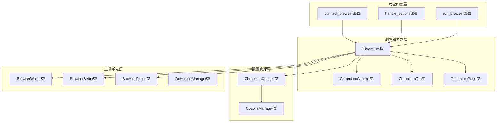
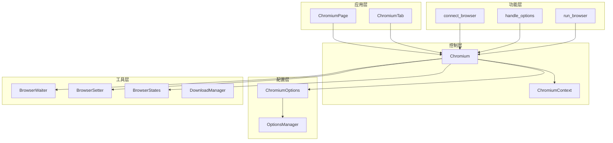
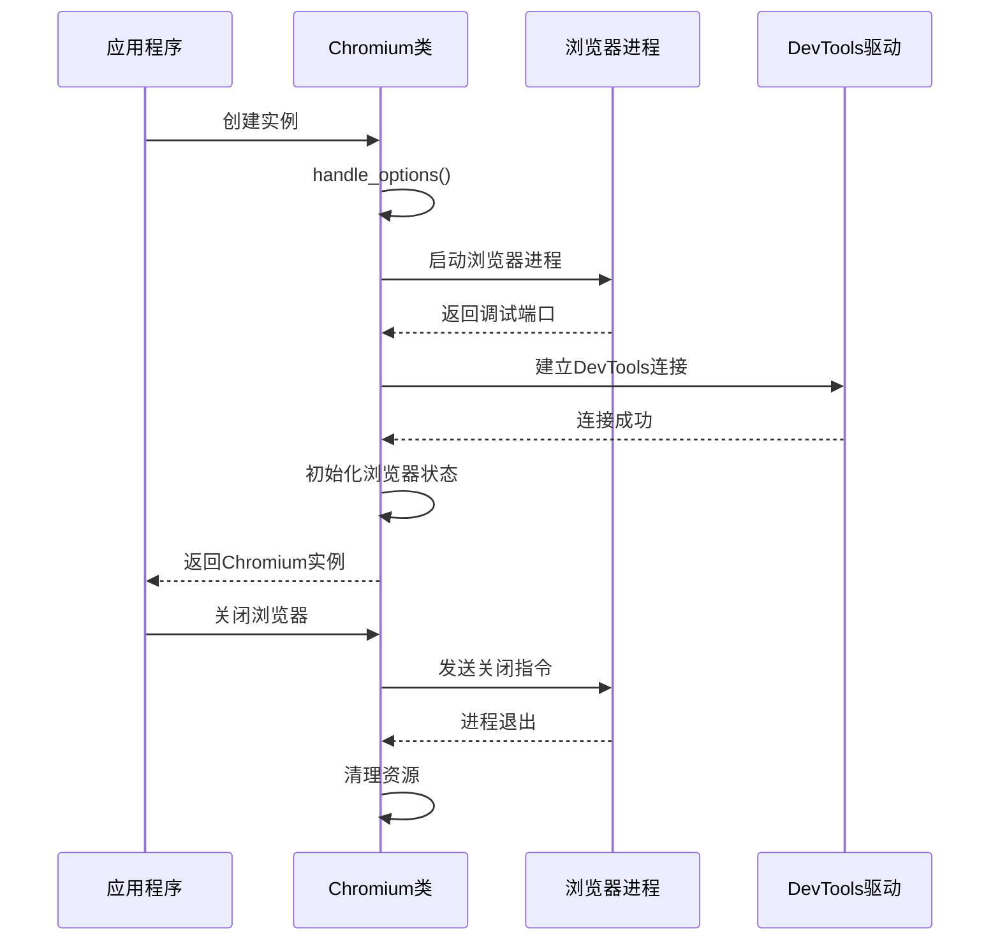
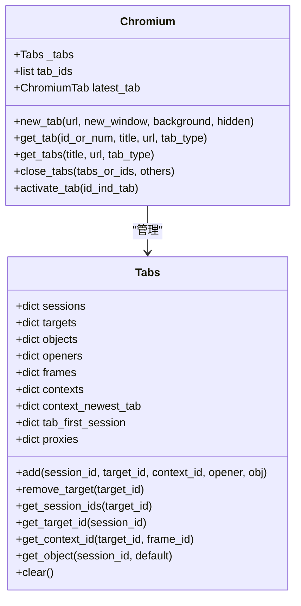
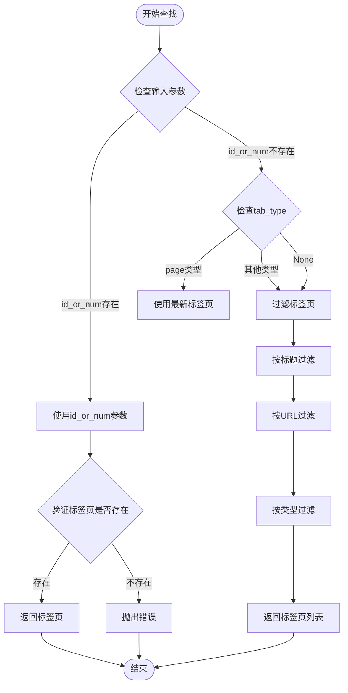
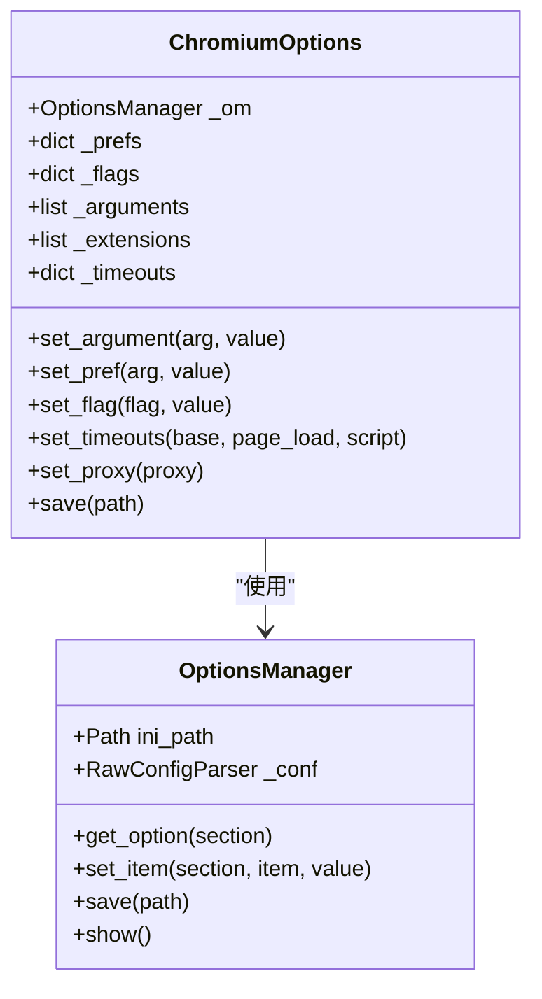
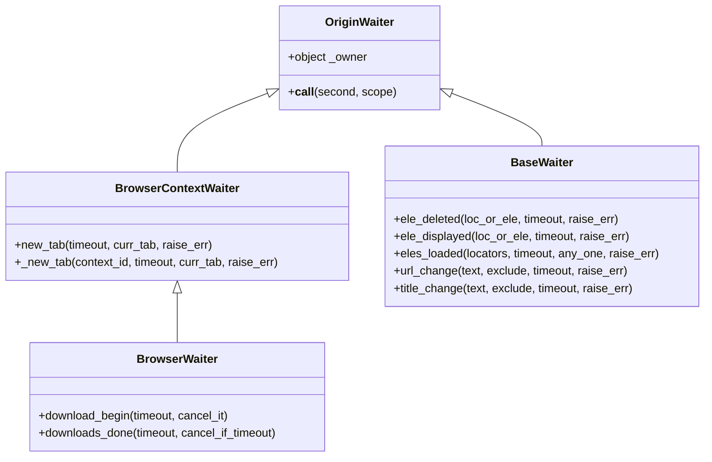
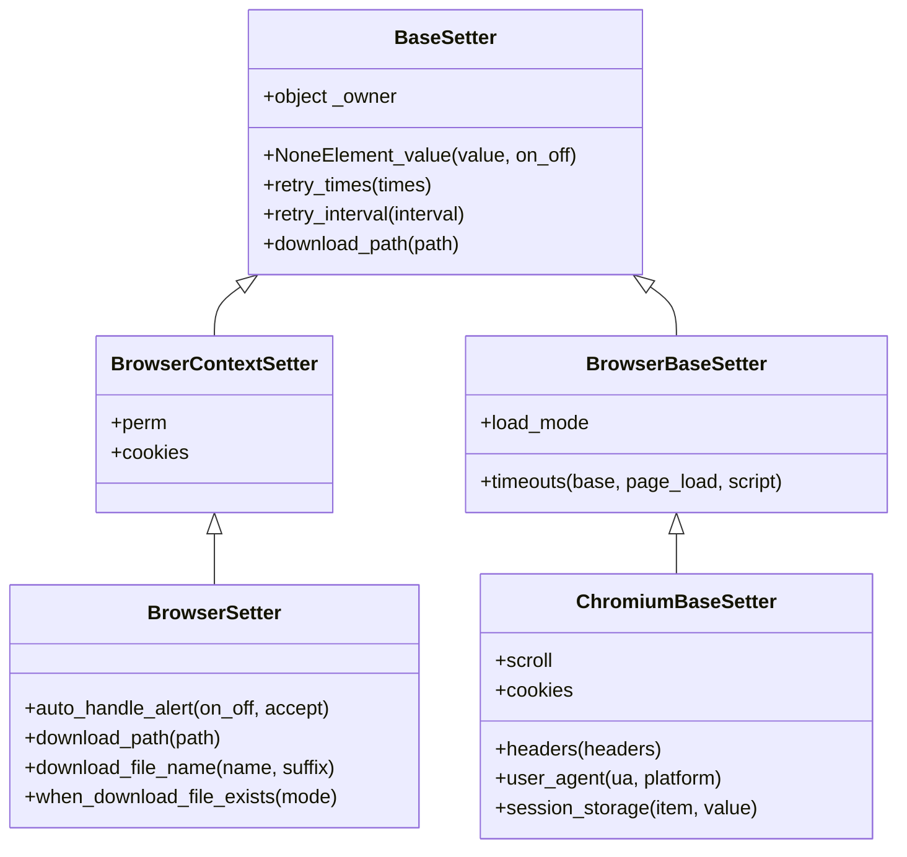
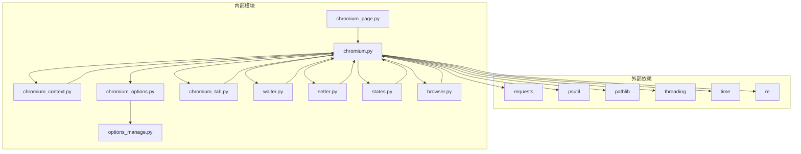

# 浏览器控制 API

<cite>
**本文档引用的文件**
- [chromium.py](file://DrissionPage/_browsers/chromium.py)
- [chromium.pyi](file://DrissionPage/_browsers/chromium.pyi)
- [chromium_context.py](file://DrissionPage/_browsers/chromium_context.py)
- [chromium_context.pyi](file://DrissionPage/_browsers/chromium_context.pyi)
- [chromium_options.py](file://DrissionPage/_configs/chromium_options.py)
- [chromium_options.pyi](file://DrissionPage/_configs/chromium_options.pyi)
- [chromium_tab.py](file://DrissionPage/_pages/chromium_tab.py)
- [chromium_page.py](file://DrissionPage/_pages/chromium_page.py)
- [waiter.py](file://DrissionPage/_units/waiter.py)
- [setter.py](file://DrissionPage/_units/setter.py)
- [states.py](file://DrissionPage/_units/states.py)
- [browser.py](file://DrissionPage/_functions/browser.py)
- [options_manage.py](file://DrissionPage/_configs/options_manage.py)
- [__init__.py](file://DrissionPage/__init__.py)
</cite>

## 目录
1. [简介](#简介)
2. [项目结构](#项目结构)
3. [核心组件](#核心组件)
4. [架构概览](#架构概览)
5. [详细组件分析](#详细组件分析)
6. [依赖关系分析](#依赖关系分析)
7. [性能考虑](#性能考虑)
8. [故障排除指南](#故障排除指南)
9. [结论](#结论)

## 简介

DrissionPage 是一个强大的浏览器自动化框架，专注于 Chromium 浏览器的控制和管理。本文档提供了浏览器控制模块的完整 API 参考，详细介绍了 Chromium 类的所有公共方法、属性和配置选项。该框架支持浏览器实例创建、启动参数配置、标签页管理、窗口控制等功能，并提供了丰富的错误处理和异常情况说明。

## 项目结构

DrissionPage 采用模块化设计，主要包含以下核心模块：



**图表来源**
- [chromium.py:33-730](file://DrissionPage/_browsers/chromium.py#L33-L730)
- [chromium_context.py:7-62](file://DrissionPage/_browsers/chromium_context.py#L7-L62)
- [chromium_options.py:16-417](file://DrissionPage/_configs/chromium_options.py#L16-L417)

**章节来源**
- [chromium.py:1-730](file://DrissionPage/_browsers/chromium.py#L1-L730)
- [chromium_context.py:1-62](file://DrissionPage/_browsers/chromium_context.py#L1-L62)
- [chromium_options.py:1-417](file://DrissionPage/_configs/chromium_options.py#L1-L417)

## 核心组件

### Chromium 类

Chromium 类是整个框架的核心，负责浏览器实例的创建和管理。它继承自 Messenger 类，提供了完整的浏览器控制功能。

#### 主要属性

| 属性名 | 类型 | 描述 | 默认值 |
|--------|------|------|--------|
| `context` | ChromiumContext | 返回当前浏览器默认的BrowserContext | 动态创建 |
| `id` | str | 返回浏览器id | 动态生成 |
| `user_data_path` | str | 返回用户文件夹路径 | None |
| `process_id` | Optional[int] | 返回浏览器进程id | None |
| `timeout` | float | 返回基础超时设置 | 来自ChromiumOptions |
| `timeouts` | Timeout | 返回所有超时设置 | Timeout对象 |
| `load_mode` | str | 返回页面加载模式 | 'normal' |
| `download_path` | str | 返回默认下载路径 | 来自ChromiumOptions |
| `set` | BrowserSetter | 返回用于设置的对象 | 动态创建 |
| `states` | BrowserStates | 返回用于获取状态的对象 | 动态创建 |
| `wait` | BrowserWaiter | 返回用于等待的对象 | 动态创建 |

#### 主要方法

##### 构造函数
```python
def __new__(cls, addr_or_opts=None, session_options=None):
    """
    创建Chromium实例
    
    参数:
        addr_or_opts: 浏览器地址:端口、ws地址、ChromiumOptions对象或端口数字(int)
        session_options: 使用双模Tab时使用的默认Session配置
    
    返回:
        Chromium实例
    """
```

##### 标签页管理
```python
def new_tab(self, url=None, new_window=False, background=False, hidden=False):
    """新建一个标签页"""
    
def get_tab(self, id_or_num=None, title=None, url=None, tab_type='page'):
    """在默认浏览器上下文获取一个标签页对象"""
    
def get_tabs(self, title=None, url=None, tab_type='page'):
    """在默认浏览器上下文查找符合条件的tab"""
    
def close_tabs(self, tabs_or_ids, others=False):
    """关闭传入的标签页，可传入多个"""
    
def activate_tab(self, id_ind_tab):
    """使默认上下文中一个标签页显示到前端"""
```

##### 浏览器控制
```python
def reconnect(self):
    """断开重连"""

def clear_cache(self, cache=True, cookies=True):
    """清除缓存，可选要清除的项"""

def quit(self, timeout=5, force=False, del_data=False):
    """关闭浏览器"""
```

##### Cookie管理
```python
def cookies(self, all_info=False):
    """以list格式返回默认上下文所有域名的cookies"""
```

##### 上下文管理
```python
def new_context(self, proxy=None, proxy_bypass=None, auto_close=True):
    """新建一个浏览器上下文"""
```

**章节来源**
- [chromium.py:33-730](file://DrissionPage/_browsers/chromium.py#L33-L730)
- [chromium.pyi:26-552](file://DrissionPage/_browsers/chromium.pyi#L26-L552)

### ChromiumContext 类

ChromiumContext 类代表浏览器的上下文环境，支持多上下文隔离。

#### 主要属性
- `browser`: 返回关联的Chromium实例
- `tab_ids`: 返回当前浏览器上下文所有标签页id组成的列表
- `latest_tab`: 返回当前浏览器上下文最新的标签页

#### 主要方法
```python
def cookies(self, all_info=False):
    """以list格式返回当前上下文的所有域名的cookies"""

def new_tab(self, url=None, new_window=False, background=False, hidden=False):
    """在当前上下文新建一个标签页"""

def get_tab(self, id_or_num=None, title=None, url=None, tab_type='page'):
    """在当前浏览器上下文获取一个标签页对象"""

def get_tabs(self, title=None, url=None, tab_type='page'):
    """在当前浏览器上下文查找符合条件的tab"""

def close(self):
    """关闭当前浏览器上下文，里面的标签页会同时关闭"""
```

**章节来源**
- [chromium_context.py:7-62](file://DrissionPage/_browsers/chromium_context.py#L7-L62)
- [chromium_context.pyi:11-105](file://DrissionPage/_browsers/chromium_context.pyi#L11-L105)

### ChromiumOptions 类

ChromiumOptions 类负责浏览器启动参数的配置和管理。

#### 主要属性
- `download_path`: 下载路径
- `browser_path`: 浏览器可执行文件路径
- `user_data_path`: 用户数据目录
- `tmp_path`: 临时文件路径
- `user`: 用户配置文件夹
- `load_mode`: 页面加载模式
- `timeouts`: 超时设置
- `proxy`: 代理设置
- `address`: 浏览器地址
- `arguments`: 启动参数列表
- `extensions`: 扩展列表
- `preferences`: 浏览器偏好设置
- `flags`: 实验性标志
- `system_user_path`: 使用系统用户路径
- `is_existing_only`: 仅连接现有浏览器
- `is_auto_port`: 自动端口分配
- `retry_times`: 重试次数
- `retry_interval`: 重试间隔

#### 配置方法
```python
def set_argument(self, arg, value=None):
    """添加或修改启动参数"""

def set_pref(self, arg, value):
    """设置偏好设置"""

def set_flag(self, flag, value=None):
    """设置实验性标志"""

def set_timeouts(self, base=None, page_load=None, script=None):
    """设置超时参数"""

def set_user(self, user='Default'):
    """设置用户配置文件夹"""

def headless(self, on_off=True):
    """设置无头模式"""

def incognito(self, on_off=True):
    """设置隐身模式"""

def set_proxy(self, proxy):
    """设置代理服务器"""

def set_download_path(self, path):
    """设置下载路径"""

def set_user_data_path(self, path):
    """设置用户数据路径"""

def auto_port(self, on_off=True, scope=None):
    """设置自动端口分配"""

def save(self, path=None):
    """保存配置到文件"""
```

**章节来源**
- [chromium_options.py:16-417](file://DrissionPage/_configs/chromium_options.py#L16-L417)
- [chromium_options.pyi:16-417](file://DrissionPage/_configs/chromium_options.pyi#L16-L417)

## 架构概览

DrissionPage 采用了分层架构设计，各层职责明确，耦合度低：



**图表来源**
- [chromium.py:33-730](file://DrissionPage/_browsers/chromium.py#L33-L730)
- [chromium_page.py:17-103](file://DrissionPage/_pages/chromium_page.py#L17-L103)
- [chromium_tab.py:22-238](file://DrissionPage/_pages/chromium_tab.py#L22-L238)

## 详细组件分析

### 浏览器生命周期管理

Chromium 类实现了完整的浏览器生命周期管理，包括启动、连接、监控和关闭。



**图表来源**
- [chromium.py:37-542](file://DrissionPage/_browsers/chromium.py#L37-L542)
- [browser.py:24-87](file://DrissionPage/_functions/browser.py#L24-L87)

#### 生命周期事件处理

Chromium 类通过事件处理器监控浏览器状态变化：

| 事件类型 | 处理方法 | 触发条件 | 功能描述 |
|----------|----------|----------|----------|
| Target.targetCreated | `_onTargetCreated` | 新标签页创建 | 自动附加到会话 |
| Target.targetDestroyed | `_onTargetDestroyed` | 标签页关闭 | 清理下载管理器 |
| Target.detachedFromTarget | `_onDetachedFromTarget` | 会话分离 | 移除会话所有权 |

**章节来源**
- [chromium.py:442-466](file://DrissionPage/_browsers/chromium.py#L442-L466)

### 标签页管理系统

Chromium 类提供了完整的标签页管理功能，支持多标签页并发控制。



**图表来源**
- [chromium.py:565-730](file://DrissionPage/_browsers/chromium.py#L565-L730)

#### 标签页查找算法

Chromium 类实现了灵活的标签页查找机制：



**图表来源**
- [chromium.py:394-440](file://DrissionPage/_browsers/chromium.py#L394-L440)

**章节来源**
- [chromium.py:235-440](file://DrissionPage/_browsers/chromium.py#L235-L440)

### 配置管理子系统

ChromiumOptions 类提供了完整的配置管理功能，支持多种配置方式。



**图表来源**
- [chromium_options.py:16-417](file://DrissionPage/_configs/chromium_options.py#L16-L417)
- [options_manage.py:15-143](file://DrissionPage/_configs/options_manage.py#L15-L143)

#### 配置优先级

配置参数具有明确的优先级顺序：

1. **直接参数** - 通过构造函数直接传入的参数
2. **ChromiumOptions对象** - 显式创建的配置对象
3. **INI配置文件** - 默认配置文件中的设置
4. **环境变量** - 系统环境变量
5. **默认值** - 框架内置的默认值

**章节来源**
- [chromium_options.py:17-85](file://DrissionPage/_configs/chromium_options.py#L17-L85)
- [options_manage.py:15-143](file://DrissionPage/_configs/options_manage.py#L15-L143)

### 工具单元层

#### 等待器子系统

BrowserWaiter 和相关等待器类提供了丰富的等待功能：



**图表来源**
- [waiter.py:15-200](file://DrissionPage/_units/waiter.py#L15-L200)

#### 设置器子系统

BrowserSetter 和相关设置器类提供了统一的配置接口：



**图表来源**
- [setter.py:21-200](file://DrissionPage/_units/setter.py#L21-L200)

**章节来源**
- [waiter.py:1-200](file://DrissionPage/_units/waiter.py#L1-L200)
- [setter.py:1-200](file://DrissionPage/_units/setter.py#L1-L200)

## 依赖关系分析



**图表来源**
- [chromium.py:13-30](file://DrissionPage/_browsers/chromium.py#L13-L30)
- [__init__.py:22-29](file://DrissionPage/__init__.py#L22-L29)

### 循环依赖检测

经过分析，项目中没有发现循环依赖关系。各模块之间的依赖关系清晰且单向：

- **上层模块依赖下层模块**：ChromiumPage、ChromiumTab 依赖 Chromium
- **配置模块独立**：ChromiumOptions、OptionsManager 独立于浏览器控制逻辑
- **工具模块通用**：BrowserWaiter、BrowserSetter 等工具类不依赖具体浏览器实现

**章节来源**
- [chromium.py:13-30](file://DrissionPage/_browsers/chromium.py#L13-L30)
- [__init__.py:22-29](file://DrissionPage/__init__.py#L22-L29)

## 性能考虑

### 内存管理

Chromium 类实现了智能的内存管理策略：

1. **单例模式**：同一浏览器实例在内存中只保留一个对象
2. **延迟初始化**：属性和对象在首次使用时才创建
3. **资源清理**：退出时自动清理会话、目标和对象映射

### 并发控制

- **线程锁**：使用 Lock 确保多线程环境下的安全访问
- **会话管理**：通过 Tabs 类管理会话和目标的映射关系
- **事件处理**：异步事件处理避免阻塞主线程

### 缓存策略

- **标签页缓存**：ChromiumTab 支持单例模式减少内存占用
- **配置缓存**：ChromiumOptions 缓存解析后的配置
- **会话缓存**：BrowserWaiter 缓存等待状态

## 故障排除指南

### 常见错误类型

#### 浏览器连接错误
```python
class BrowserConnectError(Exception):
    """浏览器连接失败时抛出的异常"""
    pass
```

#### 页面断开连接错误
```python
class PageDisconnectedError(Exception):
    """页面与浏览器断开连接时抛出的异常"""
    pass
```

#### CDP协议错误
```python
class CDPError(Exception):
    """Chrome DevTools Protocol调用失败时抛出的异常"""
    pass
```

#### URL格式错误
```python
class IncorrectURLError(Exception):
    """URL格式不正确时抛出的异常"""
    pass
```

### 错误处理策略

1. **重试机制**：通过 `retry_times` 和 `retry_interval` 参数控制重试
2. **超时处理**：使用 `timeouts` 属性设置不同类型的超时
3. **优雅降级**：某些操作失败时提供备用方案
4. **资源清理**：异常情况下自动清理已分配的资源

### 调试技巧

1. **启用调试模式**：通过设置 `DebugDriver` 获取详细的调试信息
2. **日志输出**：利用框架的日志功能追踪问题
3. **状态查询**：使用 `states` 属性检查浏览器状态
4. **事件监控**：监听浏览器事件了解运行状态

**章节来源**
- [chromium.py:30-31](file://DrissionPage/_browsers/chromium.py#L30-L31)
- [waiter.py:12](file://DrissionPage/_units/waiter.py#L12)

## 结论

DrissionPage 的浏览器控制模块提供了完整而强大的 Chromium 浏览器自动化能力。通过清晰的架构设计、完善的 API 接口和健壮的错误处理机制，开发者可以轻松地构建复杂的浏览器自动化应用。

### 主要优势

1. **模块化设计**：各组件职责明确，易于维护和扩展
2. **配置灵活**：支持多种配置方式，适应不同的使用场景
3. **功能完整**：覆盖浏览器控制的各个方面
4. **错误处理**：完善的异常处理和恢复机制
5. **性能优化**：智能的内存管理和并发控制

### 使用建议

1. **合理选择模式**：根据需求选择合适的浏览器模式（无头/有头）
2. **正确配置参数**：根据应用场景调整启动参数和超时设置
3. **资源管理**：及时关闭不需要的标签页和上下文
4. **错误处理**：为关键操作添加适当的异常处理
5. **性能监控**：关注内存使用和响应时间指标

该框架为浏览器自动化提供了一个坚实的基础，适合构建从简单脚本到复杂应用的各种自动化解决方案。