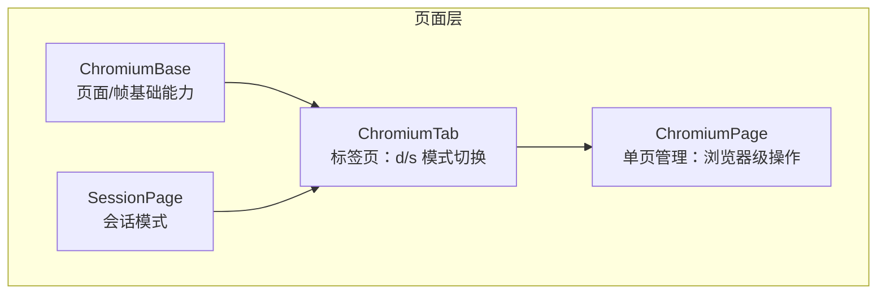
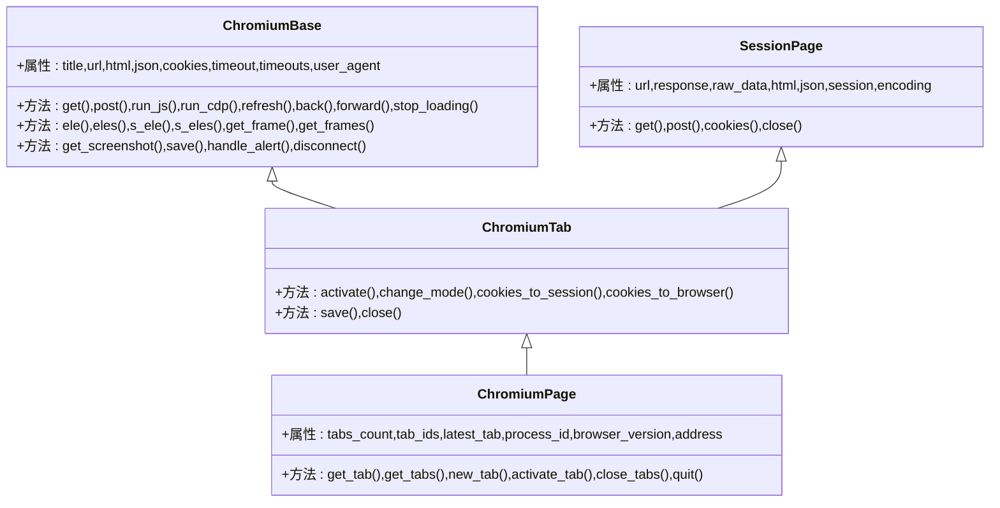
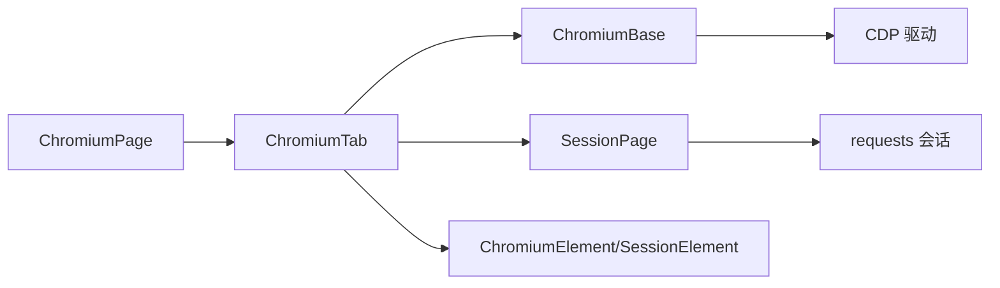
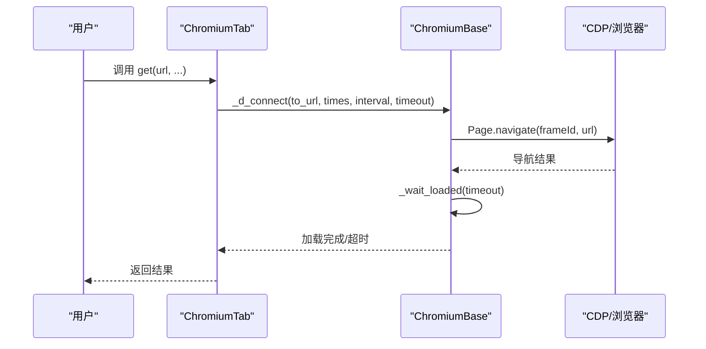
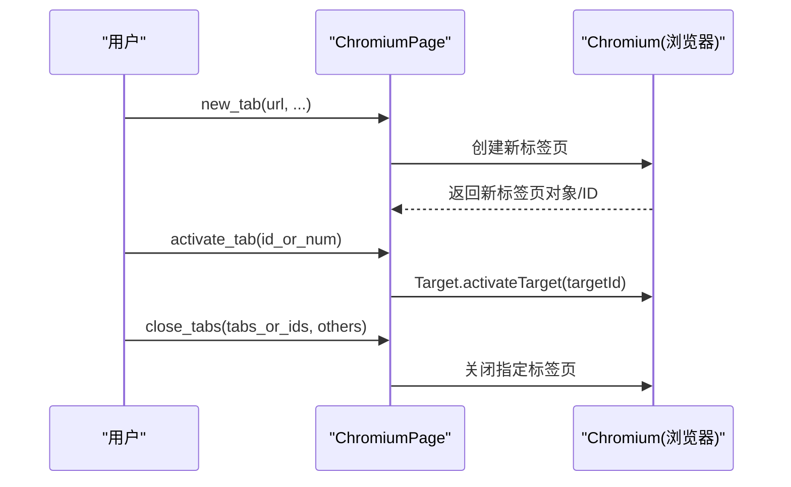
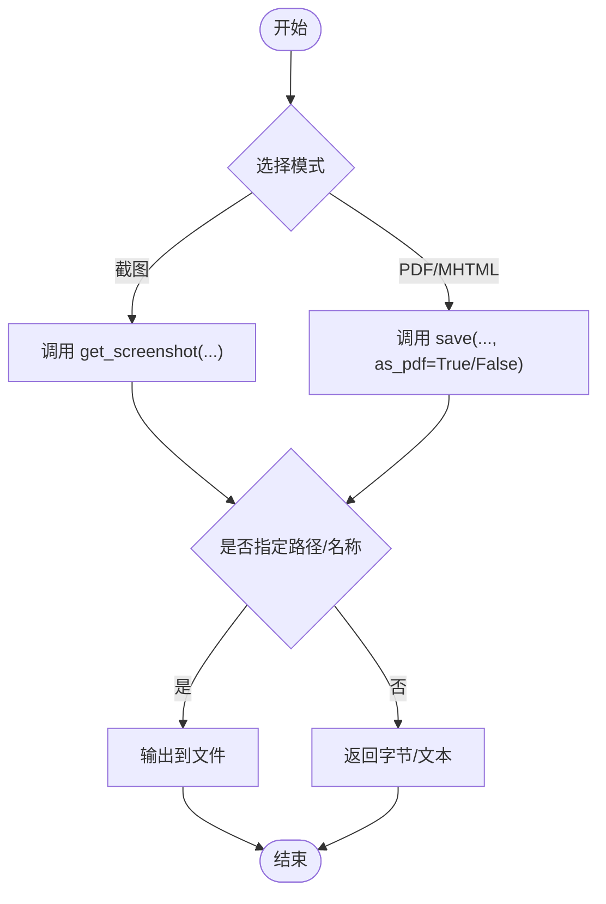

# 页面操作 API

<cite>
**本文引用的文件**
- [chromium_page.py](file://DrissionPage/_pages/chromium_page.py)
- [chromium_page.pyi](file://DrissionPage/_pages/chromium_page.pyi)
- [chromium_tab.py](file://DrissionPage/_pages/chromium_tab.py)
- [chromium_tab.pyi](file://DrissionPage/_pages/chromium_tab.pyi)
- [chromium_base.py](file://DrissionPage/_pages/chromium_base.py)
- [chromium_base.pyi](file://DrissionPage/_pages/chromium_base.pyi)
- [session_page.py](file://DrissionPage/_pages/session_page.py)
- [session_page.pyi](file://DrissionPage/_pages/session_page.pyi)
- [waiter.py](file://DrissionPage/_units/waiter.py)
- [waiter.pyi](file://DrissionPage/_units/waiter.pyi)
- [setter.py](file://DrissionPage/_units/setter.py)
- [chromium_element.py](file://DrissionPage/_elements/chromium_element.py)
- [session_element.py](file://DrissionPage/_elements/session_element.py)
</cite>

## 目录
1. [简介](#简介)
2. [项目结构](#项目结构)
3. [核心组件](#核心组件)
4. [架构总览](#架构总览)
5. [详细组件分析](#详细组件分析)
6. [依赖分析](#依赖分析)
7. [性能考量](#性能考量)
8. [故障排查指南](#故障排查指南)
9. [结论](#结论)
10. [附录](#附录)

## 简介
本文件为 DrissionPage 页面操作模块的完整 API 参考，聚焦 ChromiumPage 与 ChromiumTab 的公共方法与属性，覆盖页面导航、标签页管理、页面状态查询、窗口操作、页面内容获取、URL 处理、页面截图、PDF 导出、异步操作与回调机制等。文档以“由浅入深”的方式组织，既适合快速查阅，也便于深入理解内部机制。

## 项目结构
页面操作模块主要由三层构成：
- ChromiumBase：页面/帧的基础能力，负责与浏览器 CDP 交互、页面状态管理、元素查找、JS/CDP 执行、截图、缓存清理、弹窗处理等。
- SessionPage：基于 requests 的“会话模式”，用于高效抓取静态/动态 HTML、JSON、二进制资源，提供 cookies、响应对象、编码处理等。
- ChromiumTab：继承自 ChromiumBase 与 SessionPage，提供“驱动模式”（d 模式）与“会话模式”（s 模式）之间的切换，并扩展标签页级操作（切换、新建、关闭、获取其他标签页等）。
- ChromiumPage：在单个浏览器实例中管理一个标签页，提供浏览器级操作（如获取/新建/关闭标签页、退出浏览器）。

图表来源
- [chromium_base.py:39-96](file://DrissionPage/_pages/chromium_base.py#L39-L96)
- [session_page.py:25-38](file://DrissionPage/_pages/session_page.py#L25-L38)
- [chromium_tab.py:22-47](file://DrissionPage/_pages/chromium_tab.py#L22-L47)
- [chromium_page.py:17-40](file://DrissionPage/_pages/chromium_page.py#L17-L40)

章节来源
- [chromium_base.py:39-96](file://DrissionPage/_pages/chromium_base.py#L39-L96)
- [session_page.py:25-38](file://DrissionPage/_pages/session_page.py#L25-L38)
- [chromium_tab.py:22-47](file://DrissionPage/_pages/chromium_tab.py#L22-L47)
- [chromium_page.py:17-40](file://DrissionPage/_pages/chromium_page.py#L17-L40)

## 核心组件
- ChromiumBase
  - 页面状态：标题、URL、readyState、加载模式、超时设置、用户代理、活跃元素、窗口矩形、控制台日志、录屏、滚动、动作链、事件监听、页面状态对象。
  - 导航与加载：get、post（d 模式）、refresh、back、forward、stop_loading、等待加载完成。
  - JS/CDP：run_js、run_js_loaded、run_cdp、run_cdp_loaded、run_async_js。
  - 元素查找：ele、eles、s_ele、s_eles、_find_elements、get_frame、get_frames。
  - 资源与缓存：cookies、clear_cache、add_init_js、remove_init_js。
  - 截图与 PDF：get_screenshot、save（保存为 MHTML/PDF）。
  - 弹窗处理：handle_alert、_handle_alert。
  - 连接与断开：disconnect。
- SessionPage
  - 会话模式：get、post、cookies、close、响应对象、编码设置。
  - 元素查找：ele、eles、s_ele、s_eles、_find_elements。
- ChromiumTab
  - 模式切换：change_mode、cookies_to_session、cookies_to_browser。
  - 标签页管理：activate、get、post、ele、eles、s_ele、s_eles、close。
  - 保存：save（MHTML/PDF）。
- ChromiumPage
  - 浏览器级：get_tab、get_tabs、new_tab、activate_tab、close_tabs、quit、process_id、browser_version、address、tabs_count、tab_ids、latest_tab。

章节来源
- [chromium_base.py:240-304](file://DrissionPage/_pages/chromium_base.py#L240-L304)
- [chromium_base.py:376-398](file://DrissionPage/_pages/chromium_base.py#L376-L398)
- [chromium_base.py:403-476](file://DrissionPage/_pages/chromium_base.py#L403-L476)
- [chromium_base.py:643-646](file://DrissionPage/_pages/chromium_base.py#L643-L646)
- [session_page.py:104-146](file://DrissionPage/_pages/session_page.py#L104-L146)
- [chromium_tab.py:124-142](file://DrissionPage/_pages/chromium_tab.py#L124-L142)
- [chromium_tab.py:213-222](file://DrissionPage/_pages/chromium_tab.py#L213-L222)
- [chromium_page.py:82-96](file://DrissionPage/_pages/chromium_page.py#L82-L96)

## 架构总览
ChromiumPage 与 ChromiumTab 继承自 ChromiumBase 与 SessionPage，形成“双模式”能力：
- d 模式（驱动模式）：通过 CDP 控制真实浏览器，适合交互、截图、PDF、动态 DOM 操作。
- s 模式（会话模式）：通过 requests 抓取页面，适合快速解析 HTML/JSON、下载资源、处理 cookies。

图表来源
- [chromium_base.py:39-96](file://DrissionPage/_pages/chromium_base.py#L39-L96)
- [session_page.py:25-38](file://DrissionPage/_pages/session_page.py#L25-L38)
- [chromium_tab.py:22-47](file://DrissionPage/_pages/chromium_tab.py#L22-L47)
- [chromium_page.py:17-40](file://DrissionPage/_pages/chromium_page.py#L17-L40)

## 详细组件分析

### ChromiumPage API
- 初始化与连接
  - __new__(addr_or_opts=None, tab_id=None)
  - __init__(addr_or_opts=None, tab_id=None)
  - __repr__()
- 设置与等待
  - set: 返回 ChromiumPageSetter
  - wait: 返回 ChromiumPageWaiter
- 标签页管理
  - get_tab(id_or_num=None, title=None, url=None, tab_type='page', as_id=False)
  - get_tabs(title=None, url=None, tab_type='page', as_id=False)
  - new_tab(url=None, new_window=False, background=False, hidden=False)
  - activate_tab(id_ind_tab)
  - close_tabs(tabs_or_ids, others=False)
  - tabs_count: int
  - tab_ids: List[str]
  - latest_tab: Union[ChromiumTab, ChromiumPage, str]
- 浏览器信息
  - process_id: Optional[int]
  - browser_version: str
  - address: str
- 退出
  - quit(timeout=5, force=True, del_data=False)

章节来源
- [chromium_page.py:17-40](file://DrissionPage/_pages/chromium_page.py#L17-L40)
- [chromium_page.py:82-96](file://DrissionPage/_pages/chromium_page.py#L82-L96)
- [chromium_page.pyi:18-165](file://DrissionPage/_pages/chromium_page.pyi#L18-L165)

### ChromiumTab API
- 初始化与连接
  - __new__(browser, tab_id, context_id)
  - __init__(browser, tab_id, context_id)
  - __call__(locator, index=1, timeout=None)
  - __repr__()
- 设置与等待
  - set: 返回 ChromiumTabSetter
  - wait: 返回 ChromiumTabWaiter
- 页面信息
  - url: Union[str, None]
  - title: str
  - html: str
  - json: dict
  - raw_data: Union[str, bytes]
  - response: Response
  - mode: Literal['s', 'd']
  - user_agent: str
  - session: Session
  - timeout: float
  - rect: TabRect
- 导航与加载
  - get(url, show_errmsg=False, retry=None, interval=None, timeout=None, ...)
  - post(url, show_errmsg=False, retry=None, interval=None, timeout=None, ...)
  - refresh(ignore_cache=False)
  - back(steps=1)
  - forward(steps=1)
  - stop_loading()
- 元素与框架
  - ele(locator, index=1, timeout=None)
  - eles(locator, timeout=None)
  - s_ele(locator=None, index=1, timeout=None)
  - s_eles(locator, timeout=None)
  - get_frame(loc_ind_ele, timeout=None)
  - get_frames(locator=None, timeout=None)
- 模式切换与 cookies
  - change_mode(mode=None, go=True, copy_cookies=True)
  - cookies_to_session(copy_user_agent=True)
  - cookies_to_browser()
  - cookies(all_domains=False, all_info=False)
- 保存与关闭
  - save(path=None, name=None, as_pdf=False, ...)
  - close(others=False, session=False)

章节来源
- [chromium_tab.py:22-47](file://DrissionPage/_pages/chromium_tab.py#L22-L47)
- [chromium_tab.py:124-142](file://DrissionPage/_pages/chromium_tab.py#L124-L142)
- [chromium_tab.py:213-222](file://DrissionPage/_pages/chromium_tab.py#L213-L222)
- [chromium_tab.pyi:29-394](file://DrissionPage/_pages/chromium_tab.pyi#L29-L394)

### ChromiumBase API
- 页面信息与状态
  - title: str
  - url: str
  - html: str
  - json: Union[dict, None]
  - tab_id: str
  - active_ele: ChromiumElement
  - load_mode: Literal['none', 'normal', 'eager']
  - user_agent: str
  - upload_list: list
  - session: Session
  - timeout: float
  - timeouts: Timeout
- JS/CDP
  - run_js(script, *args, as_expr=False, timeout=None)
  - run_js_loaded(script, *args, as_expr=False, timeout=None)
  - run_cdp(cmd, **cmd_args)
  - run_cdp_loaded(cmd, **cmd_args)
  - run_async_js(script, *args, as_expr=False)
- 导航与加载
  - get(url, show_errmsg=False, retry=None, interval=None, timeout=None)
  - refresh(ignore_cache=False)
  - back(steps=1)
  - forward(steps=1)
  - stop_loading()
  - _wait_loaded(timeout=None)
- 元素与框架
  - ele(locator, index=1, timeout=None)
  - eles(locator, timeout=None)
  - s_ele(locator=None, index=1, timeout=None)
  - s_eles(locator, timeout=None)
  - _find_elements(locator, timeout, index=1, relative=False, raise_err=None)
  - get_frame(loc_ind_ele, timeout=None)
  - get_frames(locator=None, timeout=None)
- 存储与缓存
  - session_storage(item=None)
  - local_storage(item=None)
  - cookies(all_domains=False, all_info=False)
  - clear_cache(session_storage=True, local_storage=True, cache=True, cookies=True)
  - add_init_js(script)
  - remove_init_js(script_id=None)
- 截图与 PDF
  - get_screenshot(path=None, name=None, as_bytes=None, as_base64=None, full_page=False, left_top=None, right_bottom=None)
  - save(path=None, name=None, as_pdf=False, ...)
- 弹窗处理
  - handle_alert(accept=True, send=None, timeout=None, next_one=False)
  - _handle_alert(accept=True, send=None, timeout=None, next_one=False)
- 连接与断开
  - disconnect()

章节来源
- [chromium_base.py:318-327](file://DrissionPage/_pages/chromium_base.py#L318-L327)
- [chromium_base.py:376-398](file://DrissionPage/_pages/chromium_base.py#L376-L398)
- [chromium_base.py:403-476](file://DrissionPage/_pages/chromium_base.py#L403-L476)
- [chromium_base.py:643-646](file://DrissionPage/_pages/chromium_base.py#L643-L646)
- [chromium_base.pyi:34-681](file://DrissionPage/_pages/chromium_base.pyi#L34-L681)

### SessionPage API
- 会话模式
  - get(url, show_errmsg=False, retry=None, interval=None, timeout=None, ...)
  - post(url, show_errmsg=False, retry=None, interval=None, timeout=None, ...)
  - cookies(all_domains=False, all_info=False)
  - close()
  - response: Response
  - encoding: str
  - html: str
  - json: Union[dict, None]
  - raw_data: Union[str, bytes]
  - user_agent: str
  - session: Session
  - timeout: float
  - set: SessionPageSetter

章节来源
- [session_page.py:104-146](file://DrissionPage/_pages/session_page.py#L104-L146)
- [session_page.pyi:22-323](file://DrissionPage/_pages/session_page.pyi#L22-L323)

### 等待器与设置器
- 等待器
  - BaseWaiter：通用等待器
  - ChromiumTabWaiter：标签页等待器（等待加载、标题变化等）
  - ChromiumPageWaiter：页面等待器（等待新标签、下载开始/完成等）
- 设置器
  - ChromiumBaseSetter、ChromiumTabSetter、SessionPageSetter：统一设置入口
  - WindowSetter：窗口设置（最大化、最小化、位置、尺寸）

章节来源
- [waiter.py:271-303](file://DrissionPage/_units/waiter.py#L271-L303)
- [waiter.pyi:238-314](file://DrissionPage/_units/waiter.pyi#L238-L314)
- [setter.py:364-381](file://DrissionPage/_units/setter.py#L364-L381)

### 元素类
- ChromiumElement：d 模式下的元素对象，支持属性、文本、样式、伪元素、滚动、点击、等待、选择框等。
- SessionElement：s 模式下的元素对象，基于 lxml，支持属性、文本、父子兄弟关系、相对定位等。

章节来源
- [chromium_element.py:38-200](file://DrissionPage/_elements/chromium_element.py#L38-L200)
- [session_element.py:23-200](file://DrissionPage/_elements/session_element.py#L23-L200)

## 依赖分析
- 组件耦合
  - ChromiumTab 同时继承 ChromiumBase 与 SessionPage，形成“双模式”能力，耦合度较高但职责清晰。
  - ChromiumPage 仅持有浏览器实例，通过浏览器对象间接管理标签页，降低与具体标签页实现的耦合。
- 外部依赖
  - requests：SessionPage 使用 requests 发起 HTTP 请求。
  - lxml：SessionElement 使用 lxml 解析与定位 HTML。
  - Chrome DevTools Protocol：ChromiumBase 通过 CDP 控制浏览器。
- 循环依赖
  - 未发现直接循环导入；各模块通过接口与属性进行协作。

图表来源
- [chromium_page.py:17-40](file://DrissionPage/_pages/chromium_page.py#L17-L40)
- [chromium_tab.py:22-47](file://DrissionPage/_pages/chromium_tab.py#L22-L47)
- [chromium_base.py:39-96](file://DrissionPage/_pages/chromium_base.py#L39-L96)
- [session_page.py:25-38](file://DrissionPage/_pages/session_page.py#L25-L38)
- [chromium_element.py:38-75](file://DrissionPage/_elements/chromium_element.py#L38-L75)
- [session_element.py:23-40](file://DrissionPage/_elements/session_element.py#L23-L40)

章节来源
- [chromium_page.py:17-40](file://DrissionPage/_pages/chromium_page.py#L17-L40)
- [chromium_tab.py:22-47](file://DrissionPage/_pages/chromium_tab.py#L22-L47)
- [chromium_base.py:39-96](file://DrissionPage/_pages/chromium_base.py#L39-L96)
- [session_page.py:25-38](file://DrissionPage/_pages/session_page.py#L25-L38)

## 性能考量
- 模式切换成本
  - d 模式切换至 s 模式：需复制 cookies 并重建会话，建议在批量抓取场景优先使用 s 模式。
  - s 模式切换至 d 模式：需恢复 cookies 并导航回原 URL，适合需要 DOM 操作的场景。
- 元素查找
  - d 模式使用 CDP 查找，适合复杂页面；s 模式使用 lxml，适合静态/半静态页面。
- 截图与 PDF
  - 全页截图与 PDF 导出会占用较多内存与 CPU，建议按需使用并及时释放资源。
- 超时与重试
  - 合理设置 page_load 与 script 超时，避免长时间阻塞；对网络不稳定环境适当增加 retry 与 interval。

## 故障排查指南
- 页面未加载完成
  - 使用 wait.doc_loaded() 或 wait.load_start()/load_end() 等等待器确保页面状态稳定。
- 弹窗处理
  - 使用 handle_alert() 自动等待并处理 alert/prompt/confirm；必要时设置 auto_handle_alert。
- CDP 连接中断
  - 检查浏览器是否仍在运行；必要时调用 reconnect 或重新初始化页面对象。
- cookies 不一致
  - 在 d/s 模式切换时使用 cookies_to_session()/cookies_to_browser() 同步 cookies。
- 下载与新标签
  - 使用 ChromiumPageWaiter.download_begin()/all_downloads_done() 与 new_tab() 等待器管理下载与新标签。

章节来源
- [chromium_base.py:718-744](file://DrissionPage/_pages/chromium_base.py#L718-L744)
- [chromium_base.py:745-761](file://DrissionPage/_pages/chromium_base.py#L745-L761)
- [waiter.py:271-303](file://DrissionPage/_units/waiter.py#L271-L303)

## 结论
ChromiumPage 与 ChromiumTab 提供了统一而强大的页面操作能力，结合 d/s 双模式可在不同场景下取得最佳性能与体验。通过等待器与设置器，开发者可以更稳健地处理异步与复杂交互；通过元素类与 CDP/requests 的协同，既能满足 DOM 操作需求，也能高效抓取与解析页面内容。

## 附录

### 页面导航与加载流程（序列图）

图表来源
- [chromium_base.py:768-800](file://DrissionPage/_pages/chromium_base.py#L768-L800)
- [chromium_base.py:745-761](file://DrissionPage/_pages/chromium_base.py#L745-L761)

### 标签页管理流程（序列图）

图表来源
- [chromium_page.py:89-96](file://DrissionPage/_pages/chromium_page.py#L89-L96)
- [chromium_page.py:121-137](file://DrissionPage/_pages/chromium_page.py#L121-L137)

### 截图与 PDF 保存流程（流程图）

图表来源
- [chromium_base.py:643-646](file://DrissionPage/_pages/chromium_base.py#L643-L646)
- [chromium_tab.py:232-233](file://DrissionPage/_pages/chromium_tab.py#L232-L233)