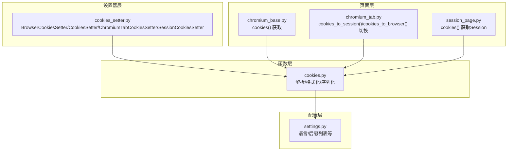
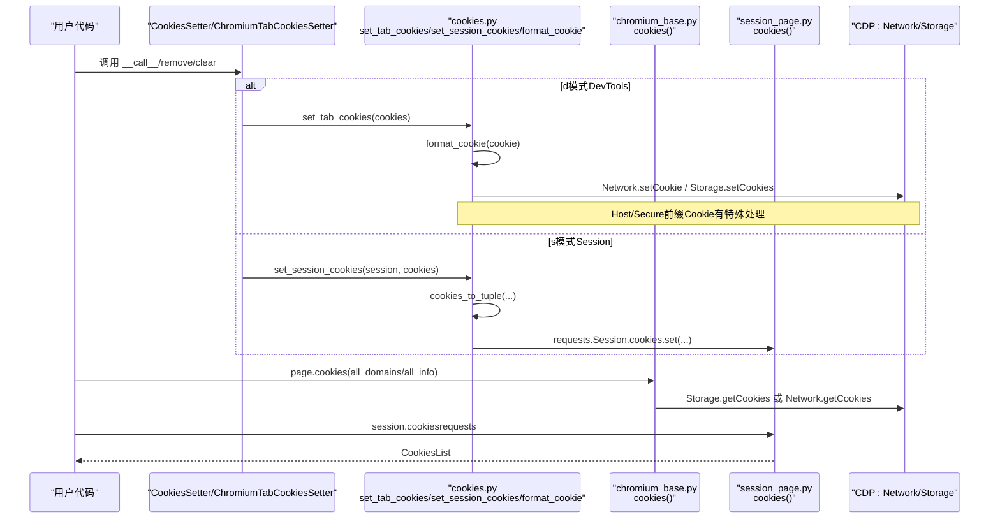
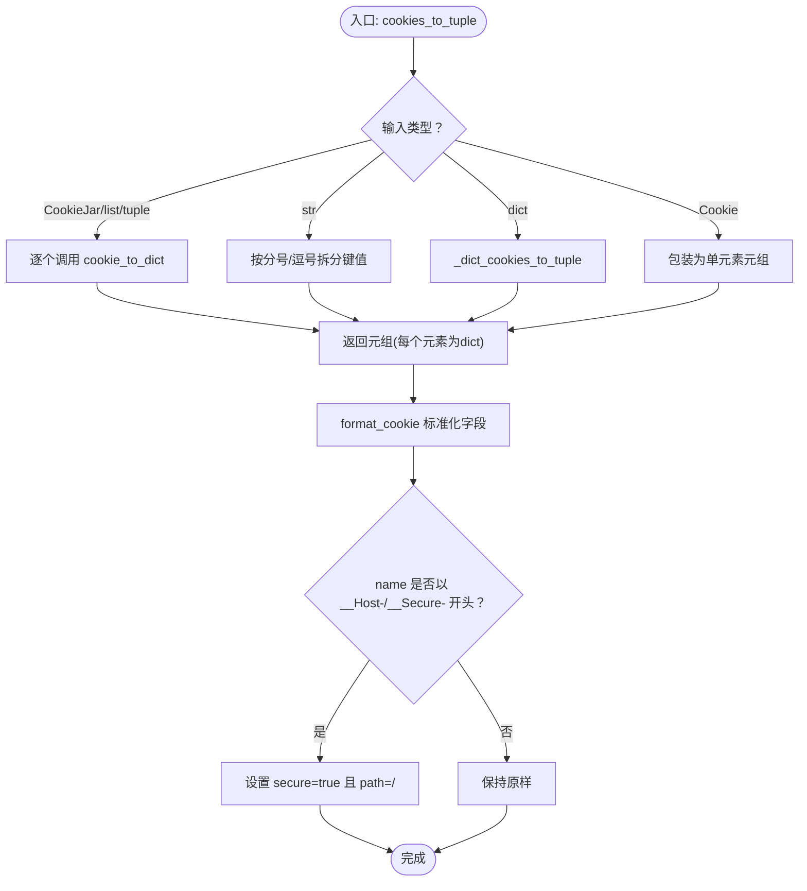
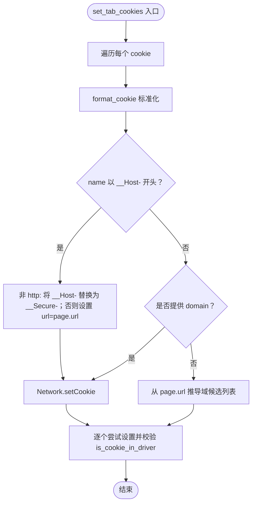
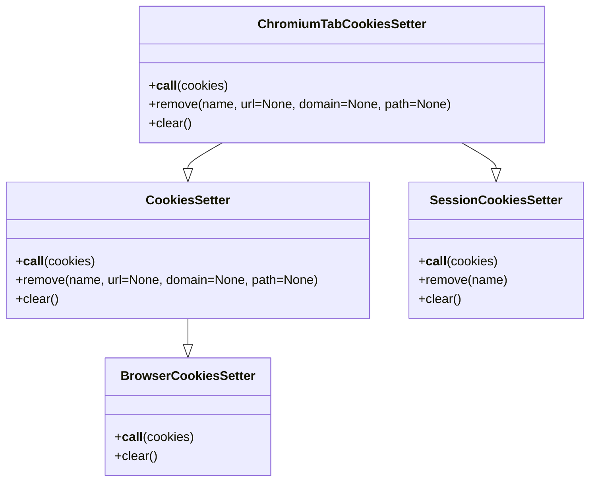
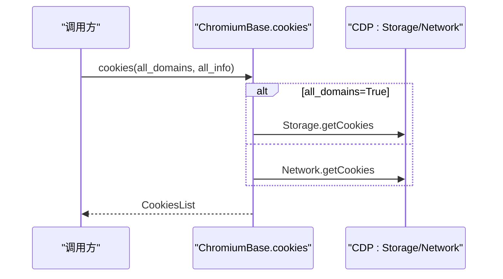
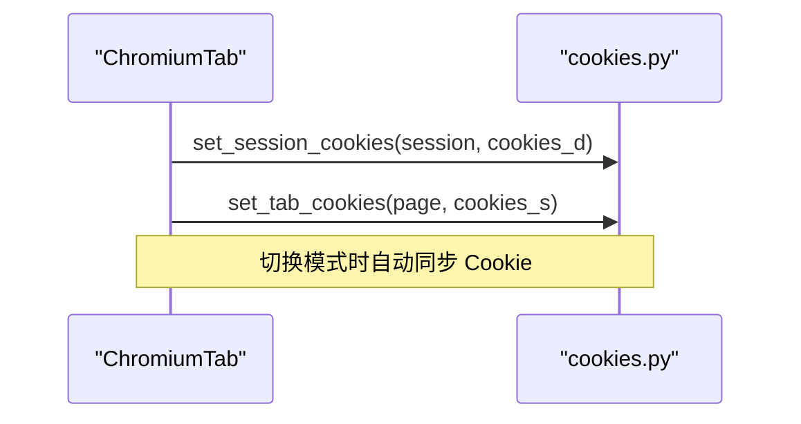
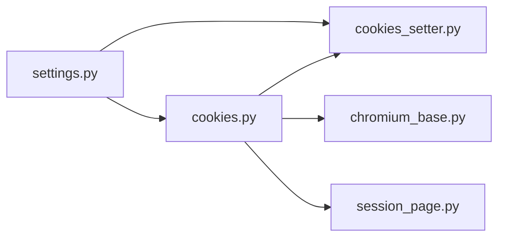

# Cookie 管理

<cite>
**本文引用的文件**
- [cookies.py](file://DrissionPage/_functions/cookies.py)
- [cookies.pyi](file://DrissionPage/_functions/cookies.pyi)
- [cookies_setter.py](file://DrissionPage/_units/cookies_setter.py)
- [cookies_setter.pyi](file://DrissionPage/_units/cookies_setter.pyi)
- [chromium_tab.py](file://DrissionPage/_pages/chromium_tab.py)
- [session_page.py](file://DrissionPage/_pages/session_page.py)
- [chromium_base.py](file://DrissionPage/_pages/chromium_base.py)
- [settings.py](file://DrissionPage/_functions/settings.py)
</cite>

## 目录
1. [简介](#简介)
2. [项目结构](#项目结构)
3. [核心组件](#核心组件)
4. [架构总览](#架构总览)
5. [详细组件分析](#详细组件分析)
6. [依赖关系分析](#依赖关系分析)
7. [性能与可靠性](#性能与可靠性)
8. [实用示例与最佳实践](#实用示例与最佳实践)
9. [调试与故障排除](#调试与故障排除)
10. [结论](#结论)

## 简介
本章节系统性讲解 DrissionPage 的 Cookie 管理能力，覆盖以下主题：
- Cookie 的获取、设置与删除
- 作用域与域范围控制（含 Host/Secure 前缀 Cookie）
- 序列化与反序列化（dict/str/tuple/Cookie 对象互转）
- 跨域与多上下文场景下的处理
- 安全策略（SameSite、Secure、HttpOnly、Priority、SourceScheme）
- 持久化与会话保持（Session 模式 vs. DevTools 模式）
- 实用示例、安全注意事项与调试排障

## 项目结构
围绕 Cookie 功能的关键模块如下：
- 函数层：提供 Cookie 解析、格式化、序列化、批量设置等通用能力
- 设置器层：封装浏览器级、标签页级、Session 级的 Cookie 设置/删除/清空接口
- 页面层：暴露统一的 cookies() 接口；支持 d 模式（DevTools）与 s 模式（Session）切换
- 配置层：提供语言包与公共后缀列表路径等支撑

图示来源
- [cookies.py:18-242](file://DrissionPage/_functions/cookies.py#L18-L242)
- [cookies_setter.py:12-81](file://DrissionPage/_units/cookies_setter.py#L12-L81)
- [chromium_base.py:409-425](file://DrissionPage/_pages/chromium_base.py#L409-L425)
- [chromium_tab.py:195-209](file://DrissionPage/_pages/chromium_tab.py#L195-L209)
- [session_page.py:151-173](file://DrissionPage/_pages/session_page.py#L151-L173)
- [settings.py](file://DrissionPage/_functions/settings.py#L22)

章节来源
- [cookies.py:1-242](file://DrissionPage/_functions/cookies.py#L1-L242)
- [cookies_setter.py:1-81](file://DrissionPage/_units/cookies_setter.py#L1-L81)
- [chromium_base.py:409-425](file://DrissionPage/_pages/chromium_base.py#L409-L425)
- [chromium_tab.py:195-209](file://DrissionPage/_pages/chromium_tab.py#L195-L209)
- [session_page.py:151-173](file://DrissionPage/_pages/session_page.py#L151-L173)
- [settings.py](file://DrissionPage/_functions/settings.py#L22)

## 核心组件
- Cookie 工具函数
  - cookie_to_dict：将 Cookie 对象/字符串/字典统一转为字典
  - cookies_to_tuple：将多种输入（CookieJar/list/tuple/str/dict/Cookie）转为元组
  - format_cookie：标准化 expires、value、sameSite、priority、sourceScheme 等字段
  - set_session_cookies：通过 requests.Session 设置 Cookie
  - set_browser_cookies：通过 CDP Storage.setCookies 设置浏览器级 Cookie
  - set_tab_cookies：通过 CDP Network.setCookie 设置标签页 Cookie，并处理 Host/Secure 前缀约束
  - is_cookie_in_driver：校验 Cookie 是否已在驱动侧生效
  - CookiesList：对 Cookie 列表进行 as_dict/as_str/as_json 序列化输出
- 设置器类
  - BrowserCookiesSetter：浏览器级设置/清空
  - CookiesSetter：标签页级设置/删除/清空
  - ChromiumTabCookiesSetter：根据当前模式（d/s）自动路由到对应实现
  - SessionCookiesSetter：Session 级设置/删除/清空

章节来源
- [cookies.py:18-242](file://DrissionPage/_functions/cookies.py#L18-L242)
- [cookies.pyi:19-96](file://DrissionPage/_functions/cookies.pyi#L19-L96)
- [cookies_setter.py:12-81](file://DrissionPage/_units/cookies_setter.py#L12-L81)
- [cookies_setter.pyi:18-135](file://DrissionPage/_units/cookies_setter.pyi#L18-L135)

## 架构总览
下图展示 Cookie 在不同模式下的流转与调用链：

图示来源
- [cookies_setter.py:26-67](file://DrissionPage/_units/cookies_setter.py#L26-L67)
- [cookies.py:74-146](file://DrissionPage/_functions/cookies.py#L74-L146)
- [chromium_base.py:409-425](file://DrissionPage/_pages/chromium_base.py#L409-L425)
- [session_page.py:151-173](file://DrissionPage/_pages/session_page.py#L151-L173)

## 详细组件分析

### 组件一：Cookie 解析与格式化（cookies.py）
职责与要点：
- 输入兼容：支持 Cookie 对象、字符串、字典、CookieJar、list/tuple、requests 的 CookieJar
- 字段标准化：统一 expires、value、sameSite、priority、sourceScheme、secure、path 等
- Host/Secure 前缀 Cookie：自动设置 secure 与 path 约束
- 删除与清空：通过 Network.deleteCookies 与 Storage.clearCookies 实现

图示来源
- [cookies.py:47-71](file://DrissionPage/_functions/cookies.py#L47-L71)
- [cookies.py:162-218](file://DrissionPage/_functions/cookies.py#L162-L218)

章节来源
- [cookies.py:18-242](file://DrissionPage/_functions/cookies.py#L18-L242)

### 组件二：标签页 Cookie 设置（set_tab_cookies）
关键逻辑：
- Host/Secure 前缀 Cookie：若当前 URL 非 http(s)，自动将 __Host- 替换为 __Secure-；否则强制使用 url 字段
- 域名回退策略：当未显式提供 domain 时，基于当前页面 URL 推导可能的域候选，逐个尝试设置并验证是否生效

图示来源
- [cookies.py:101-146](file://DrissionPage/_functions/cookies.py#L101-L146)
- [cookies.py:149-159](file://DrissionPage/_functions/cookies.py#L149-L159)

章节来源
- [cookies.py:101-146](file://DrissionPage/_functions/cookies.py#L101-L146)
- [cookies.py:149-159](file://DrissionPage/_functions/cookies.py#L149-L159)

### 组件三：设置器类（cookies_setter.py）
- CookiesSetter：面向标签页，支持 remove/clear
- ChromiumTabCookiesSetter：根据当前模式（d/s）自动选择实现
- SessionCookiesSetter：直接操作 requests.Session.cookies

图示来源
- [cookies_setter.py:12-81](file://DrissionPage/_units/cookies_setter.py#L12-L81)
- [cookies_setter.pyi:18-135](file://DrissionPage/_units/cookies_setter.pyi#L18-L135)

章节来源
- [cookies_setter.py:12-81](file://DrissionPage/_units/cookies_setter.py#L12-L81)
- [cookies_setter.pyi:18-135](file://DrissionPage/_units/cookies_setter.pyi#L18-L135)

### 组件四：页面 Cookie 获取（chromium_base.py / session_page.py）
- ChromiumBase.cookies：支持按域获取与全域获取；默认仅返回 name/value/domain
- SessionPage.cookies：基于 requests.Session.cookies；可按域过滤并返回 name/value/domain

图示来源
- [chromium_base.py:409-425](file://DrissionPage/_pages/chromium_base.py#L409-L425)

章节来源
- [chromium_base.py:409-425](file://DrissionPage/_pages/chromium_base.py#L409-L425)
- [session_page.py:151-173](file://DrissionPage/_pages/session_page.py#L151-L173)

### 组件五：模式切换与 Cookie 传递（chromium_tab.py）
- cookies_to_session：将 d 模式的 Cookie 同步到 s 模式使用的 Session
- cookies_to_browser：将 s 模式的 Cookie 同步到 d 模式使用的浏览器上下文
- change_mode：在 d/s 模式间切换时可选择复制 Cookie 并决定是否立即访问

图示来源
- [chromium_tab.py:195-209](file://DrissionPage/_pages/chromium_tab.py#L195-L209)

章节来源
- [chromium_tab.py:195-209](file://DrissionPage/_pages/chromium_tab.py#L195-L209)

## 依赖关系分析
- 函数层依赖
  - cookies.py 依赖 http.cookiejar.Cookie、datetime、urllib.parse、tldextract、settings
  - cookies_setter.py 依赖 cookies.py 与 settings
- 页面层依赖
  - chromium_base.py 依赖 cookies.py 与 settings
  - session_page.py 依赖 cookies.py 与 tldextract
- 设置器层依赖
  - cookies_setter.py 依赖 cookies.py 与 settings

图示来源
- [cookies.py:1-16](file://DrissionPage/_functions/cookies.py#L1-L16)
- [cookies_setter.py:8-9](file://DrissionPage/_units/cookies_setter.py#L8-L9)
- [chromium_base.py:21-24](file://DrissionPage/_pages/chromium_base.py#L21-L24)
- [session_page.py:19-22](file://DrissionPage/_pages/session_page.py#L19-L22)
- [settings.py](file://DrissionPage/_functions/settings.py#L21)

章节来源
- [cookies.py:1-16](file://DrissionPage/_functions/cookies.py#L1-L16)
- [cookies_setter.py:8-9](file://DrissionPage/_units/cookies_setter.py#L8-L9)
- [chromium_base.py:21-24](file://DrissionPage/_pages/chromium_base.py#L21-L24)
- [session_page.py:19-22](file://DrissionPage/_pages/session_page.py#L19-L22)
- [settings.py](file://DrissionPage/_functions/settings.py#L21)

## 性能与可靠性
- 批量设置优化：cookies_to_tuple 一次性将多种输入归一化为元组，减少重复解析
- 域名推导策略：set_tab_cookies 对未提供 domain 的情况，按子域逐步尝试，避免失败重试成本过高
- 校验与回退：is_cookie_in_driver 用于确认设置是否生效，失败时回退到浏览器级设置
- 模式切换：change_mode 支持复制 Cookie，避免重复登录成本

[本节为通用指导，不直接分析具体文件]

## 实用示例与最佳实践
- 获取 Cookie
  - d 模式：page.cookies(all_domains=False, all_info=True) 返回完整信息
  - s 模式：session.cookies 返回 requests CookieJar，可进一步处理
- 设置 Cookie
  - 字符串/字典/列表：cookies_to_tuple 自动归一化
  - Host/Secure 前缀：无需手动设置 secure/path，format_cookie 会自动处理
  - 跨域：未提供 domain 时，set_tab_cookies 会基于当前 URL 推导域候选并逐个尝试
- 删除 Cookie
  - 标签页：CookiesSetter.remove(name[, url/domain/path])
  - 浏览器：BrowserCookiesSetter.clear()
  - Session：SessionCookiesSetter.remove(name)/clear()
- 安全建议
  - 优先使用 secure=true（如 __Secure- 前缀）
  - SameSite 限定 Lax/Strict，避免 CSRF 风险
  - 严格控制 domain/path 范围，最小权限原则
  - 避免在明文传输环境下发 __Host- Cookie
- 会话保持
  - 使用 cookies_to_session()/cookies_to_browser() 在 d/s 模式间同步 Cookie
  - 切换模式时启用 copy_cookies，确保登录态延续

[本节为概念性示例，不直接分析具体文件]

## 调试与故障排除
常见问题与定位思路：
- 设置失败或未生效
  - 检查是否提供了 domain/url；未提供时需确保当前页面 URL 可用
  - 使用 is_cookie_in_driver 校验是否已在驱动侧生效
  - Host/Secure 前缀：确认 URL 为 https
- 跨域不生效
  - 显式提供 domain 或使用 set_tab_cookies 的域推导流程
  - 检查 sameSite/sourceScheme/priority 等字段是否合法
- 清除失败
  - 标签页：使用 CookiesSetter.clear() 或 BrowserCookiesSetter.clear()
  - Session：使用 SessionCookiesSetter.clear()

章节来源
- [cookies.py:92-98](file://DrissionPage/_functions/cookies.py#L92-L98)
- [cookies.py:149-159](file://DrissionPage/_functions/cookies.py#L149-L159)
- [cookies_setter.py:30-45](file://DrissionPage/_units/cookies_setter.py#L30-L45)
- [cookies_setter.py:63-67](file://DrissionPage/_units/cookies_setter.py#L63-L67)

## 结论
DrissionPage 的 Cookie 管理以“统一解析 + 模式适配 + 安全约束”为核心设计，既满足开发者对多模式、多域场景的需求，又通过严格的字段校验与域推导策略降低误用风险。结合实用示例与调试指南，可在自动化场景中稳定地实现 Cookie 的获取、设置、删除与跨域处理。