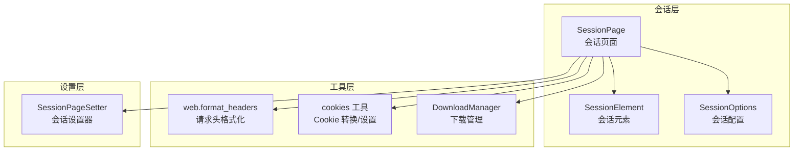
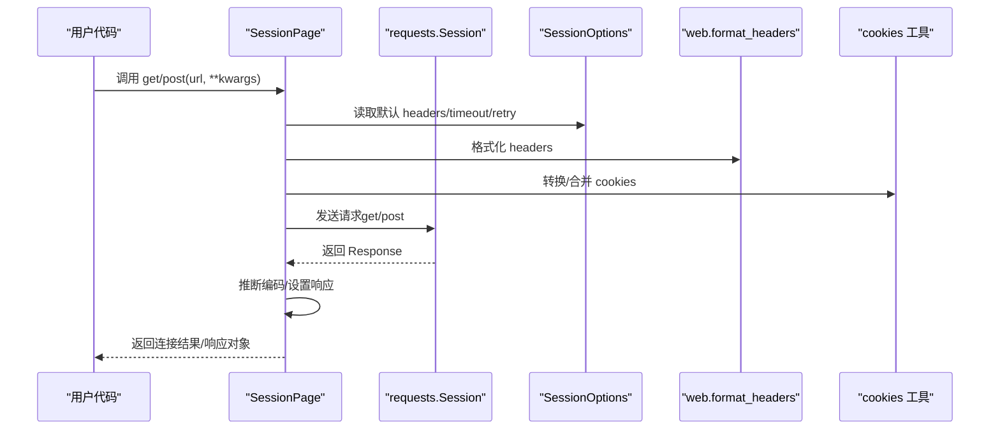
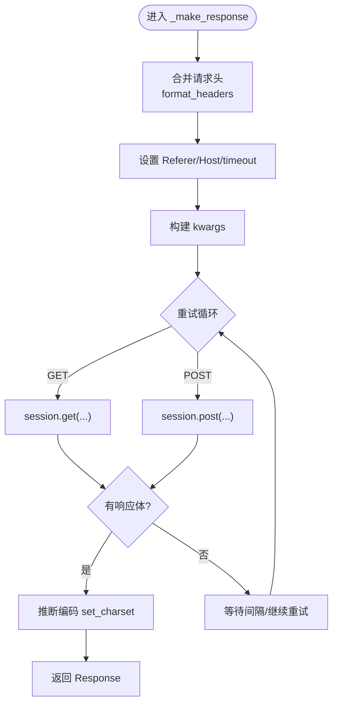
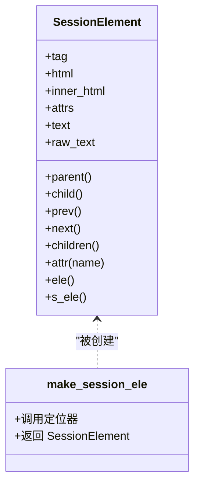
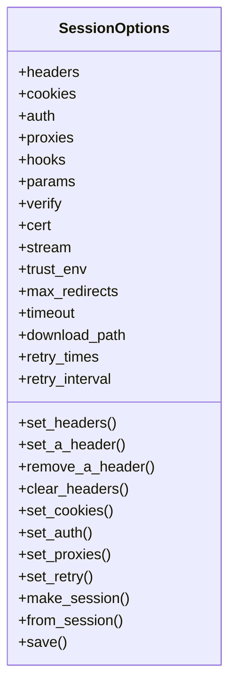
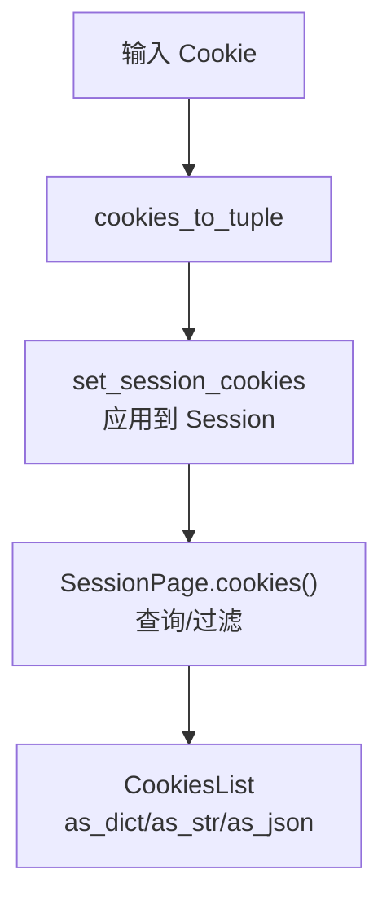
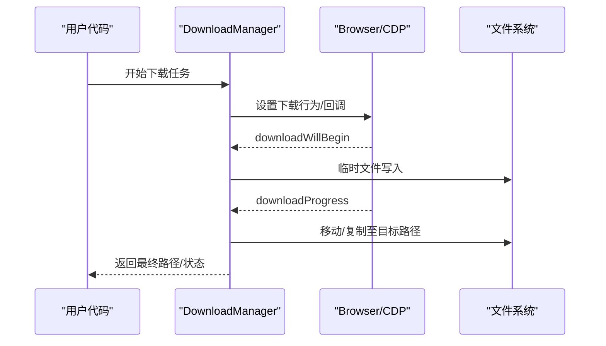
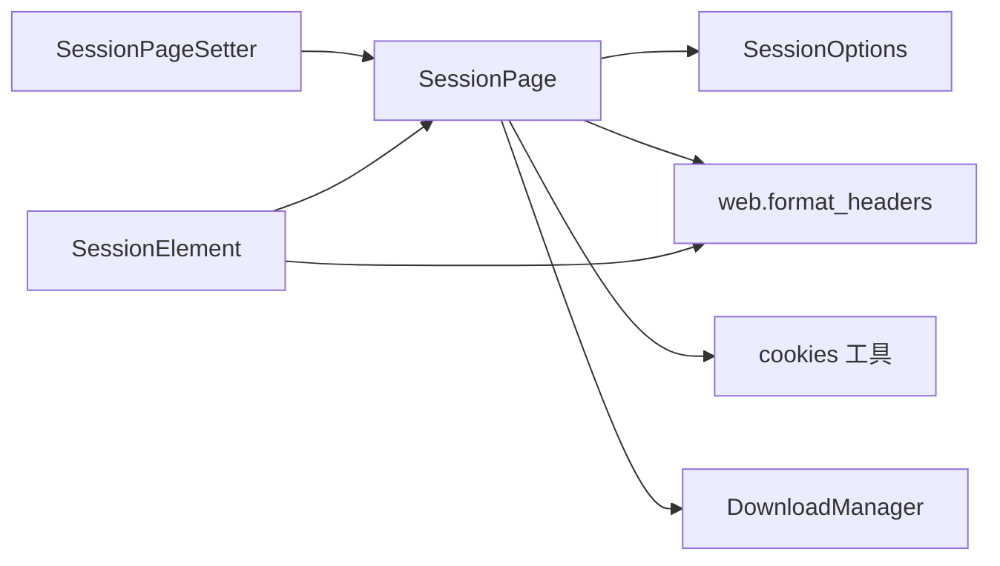

# HTTP 会话模块

<cite>
**本文引用的文件**
- [session_page.py](file://DrissionPage/_pages/session_page.py)
- [session_element.py](file://DrissionPage/_elements/session_element.py)
- [downloader.py](file://DrissionPage/_units/downloader.py)
- [cookies.py](file://DrissionPage/_functions/cookies.py)
- [session_options.py](file://DrissionPage/_configs/session_options.py)
- [setter.py](file://DrissionPage/_units/setter.py)
- [web.py](file://DrissionPage/_functions/web.py)
- [base.py](file://DrissionPage/_base/base.py)
- [settings.py](file://DrissionPage/_functions/settings.py)
</cite>

## 目录
1. [简介](#简介)
2. [项目结构](#项目结构)
3. [核心组件](#核心组件)
4. [架构总览](#架构总览)
5. [详细组件分析](#详细组件分析)
6. [依赖关系分析](#依赖关系分析)
7. [性能考量](#性能考量)
8. [故障排查指南](#故障排查指南)
9. [结论](#结论)
10. [附录](#附录)

## 简介
本章节系统性讲解 DrissionPage 的 HTTP 会话能力，重点围绕 SessionPage 类展开，覆盖会话创建、请求发送、响应处理、Cookie 管理、会话状态维护、错误处理、文件上传/下载与大文件处理、以及会话池与并发请求的最佳实践。文档同时给出关键流程图与时序图，帮助读者快速理解代码结构与调用关系。

## 项目结构
围绕 HTTP 会话功能的关键文件组织如下：
- 会话页面与元素：SessionPage、SessionElement
- 会话配置：SessionOptions
- 请求与响应辅助：web.format_headers、cookies 工具
- 下载管理：DownloadManager、DownloadMission
- 会话设置器：SessionPageSetter
- 基类接口：BasePage 抽象方法

**图表来源**
- [session_page.py:25-294](file://DrissionPage/_pages/session_page.py#L25-L294)
- [session_element.py:23-301](file://DrissionPage/_elements/session_element.py#L23-L301)
- [session_options.py:20-372](file://DrissionPage/_configs/session_options.py#L20-L372)
- [web.py:304-318](file://DrissionPage/_functions/web.py#L304-L318)
- [cookies.py:18-243](file://DrissionPage/_functions/cookies.py#L18-L243)
- [downloader.py:18-309](file://DrissionPage/_units/downloader.py#L18-L309)
- [setter.py:41-104](file://DrissionPage/_units/setter.py#L41-L104)

**章节来源**
- [session_page.py:1-294](file://DrissionPage/_pages/session_page.py#L1-L294)
- [session_element.py:1-301](file://DrissionPage/_elements/session_element.py#L1-L301)
- [session_options.py:1-372](file://DrissionPage/_configs/session_options.py#L1-L372)
- [web.py:1-349](file://DrissionPage/_functions/web.py#L1-L349)
- [cookies.py:1-243](file://DrissionPage/_functions/cookies.py#L1-L243)
- [downloader.py:1-309](file://DrissionPage/_units/downloader.py#L1-L309)
- [setter.py:1-619](file://DrissionPage/_units/setter.py#L1-L619)

## 核心组件
- SessionPage：封装 HTTP 会话，提供 get/post 等请求方法，管理响应、编码、超时、重试等；支持从本地文件加载 HTML。
- SessionElement：基于 lxml 的 HTML 解析与元素定位，支持多种定位器，返回包装后的元素对象。
- SessionOptions：集中管理会话默认配置，如 headers、cookies、timeout、代理、重试策略等，并可生成 requests.Session。
- SessionPageSetter：提供便捷的会话级设置入口，如 headers、user_agent、proxies、auth、params、verify、cert、stream、trust_env、max_redirects、add_adapter 等。
- Cookies 工具：提供 Cookie 的多格式转换与设置，支持字符串、字典、Cookie 对象及 CookieJar。
- DownloadManager：负责下载任务的生命周期管理，包括开始、进度、完成、取消、跳过等。

**章节来源**
- [session_page.py:25-196](file://DrissionPage/_pages/session_page.py#L25-L196)
- [session_element.py:23-150](file://DrissionPage/_elements/session_element.py#L23-L150)
- [session_options.py:20-336](file://DrissionPage/_configs/session_options.py#L20-L336)
- [setter.py:41-104](file://DrissionPage/_units/setter.py#L41-L104)
- [cookies.py:18-243](file://DrissionPage/_functions/cookies.py#L18-L243)
- [downloader.py:18-309](file://DrissionPage/_units/downloader.py#L18-L309)

## 架构总览
SessionPage 通过 requests.Session 发起 HTTP 请求，结合 SessionOptions 提供的默认配置与 SessionPageSetter 的动态设置，统一处理请求头、超时、重试、编码推断与响应读取。Cookie 管理由 cookies 工具与 SessionOptions 协同完成。下载能力由 DownloadManager 管理，支持文件名重命名、覆盖策略与进度追踪。

**图表来源**
- [session_page.py:104-196](file://DrissionPage/_pages/session_page.py#L104-L196)
- [session_options.py:321-336](file://DrissionPage/_configs/session_options.py#L321-L336)
- [web.py:304-318](file://DrissionPage/_functions/web.py#L304-L318)
- [cookies.py:47-87](file://DrissionPage/_functions/cookies.py#L47-L87)

## 详细组件分析

### SessionPage：会话创建、请求与响应处理
- 会话创建与运行时设置
  - 初始化时可传入已有的 requests.Session 或 SessionOptions，否则内部创建默认会话。
  - 运行时设置包括 timeout、下载路径、重试次数与间隔等。
- 请求方法
  - get：支持本地文件加载（file://）与网络请求；支持重试、超时、错误提示。
  - post：以 POST 方式发起请求。
  - 内部统一走 _s_connect 与 _make_response 流程。
- 响应处理
  - 支持 raw_data、html、json 属性；自动推断编码（Content-Type、meta charset、apparent_encoding）。
  - 状态码检查：response.ok 控制可用性；show_errmsg 为 True 时抛出异常。
- Cookie 管理
  - cookies(all_domains/all_info)：按域过滤并返回 Cookie 列表；支持返回简版或完整信息。
- 元素定位
  - ele/eles/s_ele/s_eles：基于 SessionElement 实现，支持 xpath/css 定位与索引控制。

**图表来源**
- [session_page.py:198-265](file://DrissionPage/_pages/session_page.py#L198-L265)
- [web.py:304-318](file://DrissionPage/_functions/web.py#L304-L318)
- [session_page.py:272-293](file://DrissionPage/_pages/session_page.py#L272-L293)

**章节来源**
- [session_page.py:25-196](file://DrissionPage/_pages/session_page.py#L25-L196)
- [session_page.py:198-265](file://DrissionPage/_pages/session_page.py#L198-L265)
- [session_page.py:272-293](file://DrissionPage/_pages/session_page.py#L272-L293)

### SessionElement：HTML 解析与元素定位
- 支持多种定位器：xpath、css selector；支持相对/绝对路径。
- 包装 lxml.HtmlElement，提供 tag、html、inner_html、attrs、text/raw_text 等属性。
- 提供父子兄弟、前后元素等导航方法，返回 SessionElementsList 或 NoneElement。
- make_session_ele：根据传入对象类型（字符串、SessionElement、ChromiumElement、页面对象等）生成 lxml 元素树并定位。

**图表来源**
- [session_element.py:23-150](file://DrissionPage/_elements/session_element.py#L23-L150)
- [session_element.py:169-293](file://DrissionPage/_elements/session_element.py#L169-L293)

**章节来源**
- [session_element.py:23-150](file://DrissionPage/_elements/session_element.py#L23-L150)
- [session_element.py:169-293](file://DrissionPage/_elements/session_element.py#L169-L293)

### SessionOptions：会话配置与默认行为
- 默认配置项：headers、cookies、auth、proxies、hooks、params、verify、cert、stream、trust_env、max_redirects、timeout、download_path、retry_times/retry_interval。
- 动态设置：set_headers、set_a_header、remove_a_header、clear_headers、set_cookies、set_auth、set_proxies、set_retry 等。
- 生成会话：make_session 返回 requests.Session 与 headers 字典；from_session 从现有会话导入配置。
- 保存配置：save/save_to_default 将当前配置写入 ini 文件。

**图表来源**
- [session_options.py:20-336](file://DrissionPage/_configs/session_options.py#L20-L336)

**章节来源**
- [session_options.py:20-336](file://DrissionPage/_configs/session_options.py#L20-L336)

### SessionPageSetter：会话设置器
- 提供 headers、user_agent、proxies、auth、hooks、params、verify、cert、stream、trust_env、max_redirects、add_adapter 等设置方法。
- 支持下载路径设置与编码设置（影响 response.encoding）。

**章节来源**
- [setter.py:41-104](file://DrissionPage/_units/setter.py#L41-L104)

### Cookie 管理与会话状态维护
- Cookie 转换：cookie_to_dict、cookies_to_tuple 支持多种输入格式。
- 会话 Cookie 设置：set_session_cookies 将 Cookie 应用到 requests.Session。
- 会话 Cookie 查询：SessionPage.cookies(all_domains/all_info) 返回 CookiesList，支持 as_dict/as_str/as_json。
- Cookie 格式化：format_cookie 处理 expiry、sameSite、priority、sourceScheme 等字段。

**图表来源**
- [cookies.py:47-87](file://DrissionPage/_functions/cookies.py#L47-L87)
- [cookies.py:221-231](file://DrissionPage/_functions/cookies.py#L221-L231)
- [session_page.py:151-173](file://DrissionPage/_pages/session_page.py#L151-L173)

**章节来源**
- [cookies.py:18-243](file://DrissionPage/_functions/cookies.py#L18-L243)
- [session_page.py:151-173](file://DrissionPage/_pages/session_page.py#L151-L173)

### 响应处理：状态码、内容解析与错误处理
- 状态码检查：response.ok 控制可用性；show_errmsg 为 True 时抛出异常。
- 内容解析：html/text/json/raw_data；json 解析失败时返回 None。
- 编码推断：优先 Content-Type 中的 charset，其次 meta charset，最后 apparent_encoding。
- 错误处理：重试机制（retry_times/retry_interval），异常抛出或返回 None。

**章节来源**
- [session_page.py:64-76](file://DrissionPage/_pages/session_page.py#L64-L76)
- [session_page.py:180-196](file://DrissionPage/_pages/session_page.py#L180-L196)
- [session_page.py:272-293](file://DrissionPage/_pages/session_page.py#L272-L293)

### 文件上传、下载与大文件处理
- 文件上传
  - Chromium 场景可通过 upload_files 触发文件选择对话框并自动填写路径（适用于 ChromiumPage/Tab）。
  - SessionPage 当前未直接暴露上传接口，建议通过 requests 的 files 参数或自定义表单数据实现。
- 文件下载
  - DownloadManager 管理下载任务：开始、进度、完成、取消、跳过。
  - 支持重命名、后缀替换、文件存在策略（rename/overwrite/skip）。
  - DownloadMission 提供进度百分比、最终路径、完成状态等信息。
- 大文件处理
  - 使用 requests 的流式下载（stream=True）与分块读取，避免一次性占用内存。
  - 结合 DownloadManager 的进度与重试策略，提升稳定性。

**图表来源**
- [downloader.py:18-309](file://DrissionPage/_units/downloader.py#L18-L309)

**章节来源**
- [downloader.py:18-309](file://DrissionPage/_units/downloader.py#L18-L309)
- [setter.py:214-224](file://DrissionPage/_units/setter.py#L214-L224)

### 会话池管理与并发请求最佳实践
- 会话池
  - 使用 SessionOptions.make_session 生成独立的 requests.Session，便于复用连接与保持 Cookie。
  - 多线程场景建议每个线程持有独立 Session，避免共享状态导致的竞争问题。
- 并发请求
  - 使用 requests.Session 的线程安全特性，结合线程池（如 concurrent.futures.ThreadPoolExecutor）并发调度。
  - 注意设置合理的超时与重试策略，避免阻塞。
  - 对于高并发下载，结合 DownloadManager 的任务管理与文件存在策略，确保稳定性。
- 最佳实践
  - 明确区分 headers、cookies、params 等配置来源，避免重复设置。
  - 对于大响应体，优先使用流式读取与分块处理，降低内存峰值。
  - 对于不稳定网络，合理设置 retry_times 与 retry_interval，必要时启用 verify/cert 校验。

**章节来源**
- [session_options.py:321-336](file://DrissionPage/_configs/session_options.py#L321-L336)
- [session_page.py:104-134](file://DrissionPage/_pages/session_page.py#L104-L134)
- [downloader.py:18-309](file://DrissionPage/_units/downloader.py#L18-L309)

## 依赖关系分析
- SessionPage 依赖 SessionOptions 提供默认配置，依赖 web.format_headers 格式化请求头，依赖 cookies 工具进行 Cookie 转换与设置。
- SessionPageSetter 作为 SessionPage 的设置入口，直接操作 requests.Session 的属性。
- SessionElement 依赖 lxml 进行 HTML 解析与定位，依赖 web 工具进行链接绝对化等处理。
- DownloadManager 依赖浏览器/CDP 回调事件，管理下载生命周期。

**图表来源**
- [session_page.py:25-196](file://DrissionPage/_pages/session_page.py#L25-L196)
- [session_options.py:321-336](file://DrissionPage/_configs/session_options.py#L321-L336)
- [web.py:304-318](file://DrissionPage/_functions/web.py#L304-L318)
- [cookies.py:47-87](file://DrissionPage/_functions/cookies.py#L47-L87)
- [downloader.py:18-309](file://DrissionPage/_units/downloader.py#L18-L309)
- [setter.py:41-104](file://DrissionPage/_units/setter.py#L41-L104)
- [session_element.py:23-150](file://DrissionPage/_elements/session_element.py#L23-L150)

**章节来源**
- [session_page.py:25-196](file://DrissionPage/_pages/session_page.py#L25-L196)
- [session_element.py:23-150](file://DrissionPage/_elements/session_element.py#L23-L150)
- [session_options.py:321-336](file://DrissionPage/_configs/session_options.py#L321-L336)
- [web.py:304-318](file://DrissionPage/_functions/web.py#L304-L318)
- [cookies.py:47-87](file://DrissionPage/_functions/cookies.py#L47-L87)
- [downloader.py:18-309](file://DrissionPage/_units/downloader.py#L18-L309)
- [setter.py:41-104](file://DrissionPage/_units/setter.py#L41-L104)

## 性能考量
- 连接复用：使用 requests.Session 复用 TCP 连接，减少握手开销。
- 超时与重试：合理设置 timeout 与 retry_times/retry_interval，避免长时间阻塞。
- 编码推断：优先使用 Content-Type，避免不必要的 meta 解析。
- 大文件下载：启用 stream 并分块写入，避免内存峰值过高。
- 并发控制：限制并发数量，结合队列与信号量控制资源竞争。

[本节为通用指导，无需特定文件来源]

## 故障排查指南
- 状态码异常
  - 检查 response.ok 与 show_errmsg；必要时打印状态码与响应头。
- 编码问题
  - 手动设置 encoding 或检查 Content-Type 与 meta charset。
- Cookie 丢失
  - 确认 cookies(all_domains/all_info) 返回值；检查域名匹配与作用域。
- 下载失败
  - 查看 DownloadMission.state 与最终路径；确认权限与磁盘空间。
- 重试无效
  - 检查 retry_times/retry_interval 设置；确认网络环境与服务器响应。

**章节来源**
- [session_page.py:180-196](file://DrissionPage/_pages/session_page.py#L180-L196)
- [session_page.py:272-293](file://DrissionPage/_pages/session_page.py#L272-L293)
- [cookies.py:149-159](file://DrissionPage/_functions/cookies.py#L149-L159)
- [downloader.py:238-309](file://DrissionPage/_units/downloader.py#L238-L309)

## 结论
DrissionPage 的 HTTP 会话模块以 SessionPage 为核心，结合 SessionOptions、SessionPageSetter、cookies 工具与 DownloadManager，提供了完整的请求、响应、Cookie 与下载能力。通过合理的配置与最佳实践，可在稳定性和性能之间取得平衡，满足从简单抓取到复杂并发下载的多种场景需求。

[本节为总结，无需特定文件来源]

## 附录
- HTTP 方法支持现状
  - SessionPage 提供 get/post 方法；其他方法（PUT、DELETE、PATCH、HEAD、OPTIONS）未在 SessionPage 中直接暴露。建议通过 requests.Session 自行调用或扩展 SessionPage。
- 请求头设置
  - 通过 SessionOptions.set_headers 或 SessionPageSetter.headers 设置；web.format_headers 支持字符串与字典格式。
- 参数传递与数据格式
  - params、files、json、data 等通过 kwargs 透传给 requests.Session；注意 Content-Type 与编码设置。
- 会话状态维护
  - 通过 Session.cookies 与 cookies 工具维持跨请求状态；SessionOptions 可预置 cookies。

**章节来源**
- [session_page.py:104-134](file://DrissionPage/_pages/session_page.py#L104-L134)
- [session_options.py:142-168](file://DrissionPage/_configs/session_options.py#L142-L168)
- [setter.py:66-103](file://DrissionPage/_units/setter.py#L66-L103)
- [web.py:304-318](file://DrissionPage/_functions/web.py#L304-L318)
- [cookies.py:47-87](file://DrissionPage/_functions/cookies.py#L47-L87)