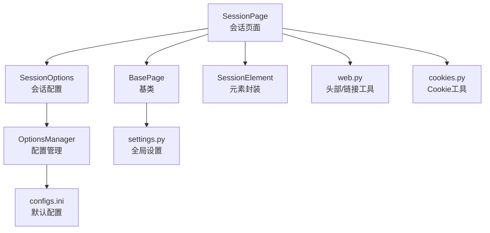
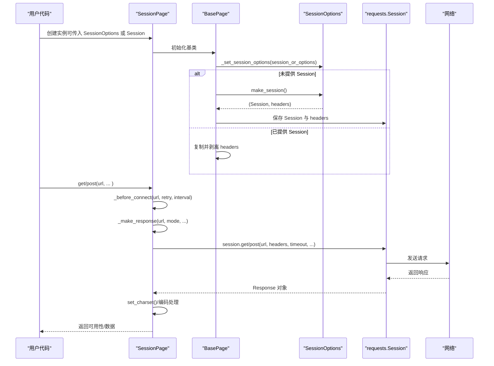
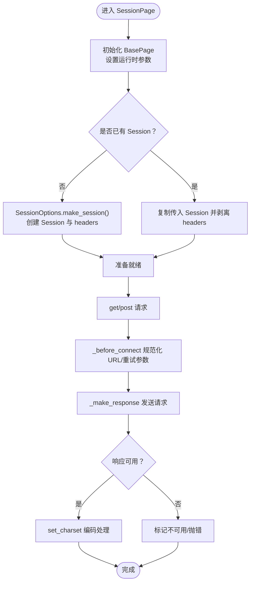
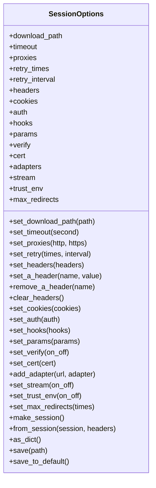
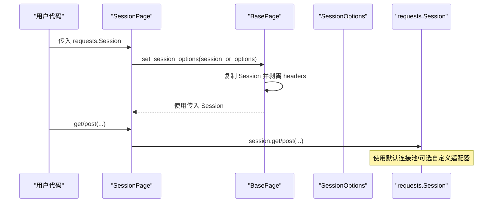
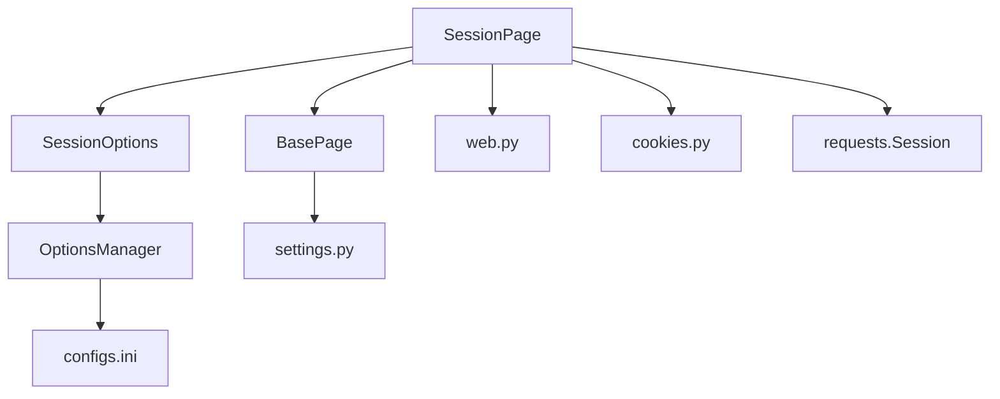

# 会话管理

<cite>
**本文引用的文件**
- [session_page.py](file://DrissionPage/_pages/session_page.py)
- [session_options.py](file://DrissionPage/_configs/session_options.py)
- [base.py](file://DrissionPage/_base/base.py)
- [session_element.py](file://DrissionPage/_elements/session_element.py)
- [options_manage.py](file://DrissionPage/_configs/options_manage.py)
- [configs.ini](file://DrissionPage/_configs/configs.ini)
- [web.py](file://DrissionPage/_functions/web.py)
- [cookies.py](file://DrissionPage/_functions/cookies.py)
- [settings.py](file://DrissionPage/_functions/settings.py)
- [__init__.py](file://DrissionPage/__init__.py)
</cite>

## 目录
1. [简介](#简介)
2. [项目结构](#项目结构)
3. [核心组件](#核心组件)
4. [架构总览](#架构总览)
5. [详细组件分析](#详细组件分析)
6. [依赖分析](#依赖分析)
7. [性能考量](#性能考量)
8. [故障排查指南](#故障排查指南)
9. [结论](#结论)
10. [附录：配置与示例路径](#附录配置与示例路径)

## 简介
本文围绕 DrissionPage 的 SessionPage 会话管理功能展开，系统阐述会话的创建、初始化与生命周期；详解 SessionOptions 配置项的作用与设置方法；说明会话的重用机制与连接池管理策略；解释会话状态维护与多会话隔离；并给出会话关闭与资源清理的最佳实践。文末提供配置示例与常见问题解决方案。

## 项目结构
围绕会话管理的关键文件与职责如下：
- DrissionPage/_pages/session_page.py：定义 SessionPage，封装基于 requests.Session 的网络请求与页面级能力。
- DrissionPage/_configs/session_options.py：定义 SessionOptions，集中管理会话级配置（头、Cookie、代理、超时、重试等）。
- DrissionPage/_base/base.py：提供 BasePage、BaseParser 等基类，统一会话初始化流程与通用方法。
- DrissionPage/_elements/session_element.py：定义 SessionElement，提供基于 lxml 的元素解析与定位能力。
- DrissionPage/_configs/options_manage.py 与 configs.ini：提供配置文件读取、合并与持久化能力。
- DrissionPage/_functions/web.py、cookies.py、settings.py：提供头部格式化、Cookie 转换、TLD 解析、设置项等支撑工具。
- DrissionPage/__init__.py：导出 SessionPage 与 SessionOptions，便于外部使用。

**图示来源**
- [session_page.py:25-36](file://DrissionPage/_pages/session_page.py#L25-L36)
- [base.py:270-338](file://DrissionPage/_base/base.py#L270-L338)
- [session_options.py:20-88](file://DrissionPage/_configs/session_options.py#L20-L88)
- [options_manage.py:15-78](file://DrissionPage/_configs/options_manage.py#L15-L78)
- [configs.ini:19-33](file://DrissionPage/_configs/configs.ini#L19-L33)
- [session_element.py:23-37](file://DrissionPage/_elements/session_element.py#L23-L37)
- [web.py:304-318](file://DrissionPage/_functions/web.py#L304-L318)
- [cookies.py:74-87](file://DrissionPage/_functions/cookies.py#L74-L87)
- [settings.py:13-23](file://DrissionPage/_functions/settings.py#L13-L23)

**章节来源**
- [session_page.py:25-36](file://DrissionPage/_pages/session_page.py#L25-L36)
- [base.py:270-338](file://DrissionPage/_base/base.py#L270-L338)
- [session_options.py:20-88](file://DrissionPage/_configs/session_options.py#L20-L88)
- [options_manage.py:15-78](file://DrissionPage/_configs/options_manage.py#L15-L78)
- [configs.ini:19-33](file://DrissionPage/_configs/configs.ini#L19-L33)
- [session_element.py:23-37](file://DrissionPage/_elements/session_element.py#L23-L37)
- [web.py:304-318](file://DrissionPage/_functions/web.py#L304-L318)
- [cookies.py:74-87](file://DrissionPage/_functions/cookies.py#L74-L87)
- [settings.py:13-23](file://DrissionPage/_functions/settings.py#L13-L23)

## 核心组件
- SessionPage：继承自 BasePage，负责会话的创建、请求发送、响应处理、元素定位与 Cookie 管理。其内部持有 requests.Session 实例与响应对象，支持 GET/POST 请求、重试、编码推断、Referer/Host 自动补全等。
- SessionOptions：集中管理会话配置，包括 headers、cookies、auth、proxies、params、verify、cert、adapters、stream、trust_env、max_redirects、timeout、download_path、retry_times/retry_interval 等。支持从配置文件加载、动态设置、保存到文件。
- BasePage：提供会话初始化流程（_set_session_options、_create_session）、URL 规范化、重试参数传递、下载器创建等通用能力。
- SessionElement：基于 lxml 的元素封装，提供属性访问、父子兄弟查找、CSS/XPath 定位、绝对链接补全等能力，作为 SessionPage 的元素层支撑。
- 工具模块：web.py 提供头部格式化、链接补全；cookies.py 提供 Cookie 转换与设置；settings.py 提供全局设置项；options_manage.py 与 configs.ini 提供配置读取与持久化。

**章节来源**
- [session_page.py:25-36](file://DrissionPage/_pages/session_page.py#L25-L36)
- [session_options.py:20-88](file://DrissionPage/_configs/session_options.py#L20-L88)
- [base.py:270-338](file://DrissionPage/_base/base.py#L270-L338)
- [session_element.py:23-37](file://DrissionPage/_elements/session_element.py#L23-L37)
- [web.py:304-318](file://DrissionPage/_functions/web.py#L304-L318)
- [cookies.py:74-87](file://DrissionPage/_functions/cookies.py#L74-L87)
- [settings.py:13-23](file://DrissionPage/_functions/settings.py#L13-L23)
- [options_manage.py:15-78](file://DrissionPage/_configs/options_manage.py#L15-L78)
- [configs.ini:19-33](file://DrissionPage/_configs/configs.ini#L19-L33)

## 架构总览
下图展示 SessionPage 与 SessionOptions、BasePage、工具模块之间的交互关系，以及会话生命周期中的关键步骤。

**图示来源**
- [session_page.py:25-36](file://DrissionPage/_pages/session_page.py#L25-L36)
- [base.py:319-338](file://DrissionPage/_base/base.py#L319-L338)
- [session_options.py:321-336](file://DrissionPage/_configs/session_options.py#L321-L336)
- [session_page.py:180-266](file://DrissionPage/_pages/session_page.py#L180-L266)

## 详细组件分析

### SessionPage：会话创建、初始化与生命周期
- 初始化与会话注入
  - 支持三种构造方式：不传参（使用默认 SessionOptions）、传入 SessionOptions 实例、传入 requests.Session 实例。当传入 Session 时，会复制该会话并剥离其 headers，以便统一管理。
  - 初始化后，调用 _s_set_runtime_settings 将 timeout、download_path、retry_times、retry_interval 等运行时参数从 SessionOptions 同步到页面对象。
- 生命周期管理
  - get/post：发起请求前先通过 _before_connect 规范化 URL、判断文件路径、设置重试参数；随后通过 _make_response 执行请求，处理响应编码与可用性标志。
  - close：关闭底层 Session 与响应对象，释放连接与资源。
- 元素与 Cookie
  - cookies：支持按域过滤与全域导出，结合 TLDExtract 与公共后缀列表进行域匹配。
  - s_ele/s_eles：基于 SessionElement 提供元素定位与封装。

**图示来源**
- [session_page.py:25-36](file://DrissionPage/_pages/session_page.py#L25-L36)
- [base.py:319-338](file://DrissionPage/_base/base.py#L319-L338)
- [session_page.py:104-196](file://DrissionPage/_pages/session_page.py#L104-L196)
- [session_page.py:198-266](file://DrissionPage/_pages/session_page.py#L198-L266)

**章节来源**
- [session_page.py:25-36](file://DrissionPage/_pages/session_page.py#L25-L36)
- [session_page.py:104-196](file://DrissionPage/_pages/session_page.py#L104-L196)
- [session_page.py:198-266](file://DrissionPage/_pages/session_page.py#L198-L266)
- [base.py:319-338](file://DrissionPage/_base/base.py#L319-L338)

### SessionOptions：配置项作用与设置方法
- 关键配置项
  - headers：统一请求头，支持设置、逐项设置、移除与清空；格式化为大小写不敏感字典。
  - cookies：支持从多种来源导入并设置到 Session。
  - auth/proxies/hooks/params：认证、代理、钩子、查询参数。
  - verify/cert/stream/trust_env/max_redirects/adapters：SSL 验证、客户端证书、流式响应、信任环境变量、最大重定向次数、自定义适配器挂载。
  - timeout/download_path/retry_times/retry_interval：超时、下载路径、重试次数与间隔。
- 设置与持久化
  - set_* 方法用于动态设置；save/save_to_default 将当前配置写回配置文件；as_dict 导出当前配置字典；from_session 可从现有 Session 恢复配置。
  - 从配置文件加载：OptionsManager 读取 configs.ini 中的各节（session_options、timeouts、proxies、paths、others），并与运行时设置合并。

**图示来源**
- [session_options.py:20-372](file://DrissionPage/_configs/session_options.py#L20-L372)

**章节来源**
- [session_options.py:20-372](file://DrissionPage/_configs/session_options.py#L20-L372)
- [options_manage.py:15-143](file://DrissionPage/_configs/options_manage.py#L15-L143)
- [configs.ini:19-33](file://DrissionPage/_configs/configs.ini#L19-L33)

### 会话重用机制与连接池管理
- 重用机制
  - SessionPage 支持直接传入 requests.Session 实例，从而复用已有的会话状态（Cookie、认证、适配器等）。此时会复制该 Session 并剥离其 headers，避免重复覆盖。
  - BasePage._create_session 会在未提供 Session 时，通过 SessionOptions.make_session 创建新的 Session。
- 连接池管理
  - requests.Session 默认启用 HTTPAdapter，具备连接池能力。SessionOptions.add_adapter 可为特定 URL 挂载自定义 HTTPAdapter，以控制并发、超时、重试等策略。
  - 通过 SessionOptions.set_trust_env 控制是否信任环境变量（如 HTTP_PROXY/HTTPS_PROXY），影响连接池与代理行为。
- 重试策略
  - SessionPage._make_response 内部循环重试，结合 retry_times 与 retry_interval；若显式抛错则抛出异常，否则返回 None 或响应对象。

**图示来源**
- [base.py:326-331](file://DrissionPage/_base/base.py#L326-L331)
- [session_options.py:321-336](file://DrissionPage/_configs/session_options.py#L321-L336)
- [session_page.py:180-266](file://DrissionPage/_pages/session_page.py#L180-L266)

**章节来源**
- [base.py:326-331](file://DrissionPage/_base/base.py#L326-L331)
- [session_options.py:321-336](file://DrissionPage/_configs/session_options.py#L321-L336)
- [session_page.py:180-266](file://DrissionPage/_pages/session_page.py#L180-L266)

### 会话状态维护与会话隔离
- 状态维护
  - SessionPage 持有 _session 与 _headers，分别对应 requests.Session 与会话级请求头；通过 _s_set_runtime_settings 将 SessionOptions 的 timeout、download_path、retry_times、retry_interval 同步到页面对象。
  - 响应对象 _response 与编码 _encoding 用于后续 html/json/raw_data 等属性的计算。
- 会话隔离
  - 每个 SessionPage 拥有独立的 _session 与 _headers，不同页面对象之间不会互相污染请求头与 Cookie。
  - cookies 方法支持按域过滤，避免跨域污染；TLDExtract 与公共后缀列表确保域匹配准确。

**章节来源**
- [session_page.py:25-36](file://DrissionPage/_pages/session_page.py#L25-L36)
- [session_page.py:151-173](file://DrissionPage/_pages/session_page.py#L151-L173)
- [settings.py:22](file://DrissionPage/_functions/settings.py#L22)

### 会话关闭与资源清理最佳实践
- 显式关闭
  - 调用 SessionPage.close() 会关闭底层 Session 与响应对象，释放连接与缓冲区。
- 资源清理
  - 在长时间运行的任务中，建议定期关闭不再使用的 SessionPage，避免连接泄漏。
  - 若使用自定义 HTTPAdapter，请确保在任务结束时释放相关资源（如线程池、队列等）。
- 下载与临时文件
  - download_path 由 SessionOptions 提供，建议在任务结束后清理下载目录。

**章节来源**
- [session_page.py:175-179](file://DrissionPage/_pages/session_page.py#L175-L179)

## 依赖分析
- 组件耦合
  - SessionPage 强依赖 BasePage（继承）与 SessionOptions（配置注入）；间接依赖 web.py（头部/链接处理）、cookies.py（Cookie 转换）、settings.py（全局设置）。
  - SessionOptions 依赖 OptionsManager 与配置文件 configs.ini，实现配置的读取与持久化。
- 外部依赖
  - requests.Session 提供 HTTP 会话与连接池；tldextract 提供域名解析；lxml 提供 HTML 解析与定位。

**图示来源**
- [session_page.py:25-36](file://DrissionPage/_pages/session_page.py#L25-L36)
- [base.py:270-338](file://DrissionPage/_base/base.py#L270-L338)
- [session_options.py:20-88](file://DrissionPage/_configs/session_options.py#L20-L88)
- [options_manage.py:15-78](file://DrissionPage/_configs/options_manage.py#L15-L78)
- [configs.ini:19-33](file://DrissionPage/_configs/configs.ini#L19-L33)
- [web.py:304-318](file://DrissionPage/_functions/web.py#L304-L318)
- [cookies.py:74-87](file://DrissionPage/_functions/cookies.py#L74-L87)
- [settings.py:13-23](file://DrissionPage/_functions/settings.py#L13-L23)

**章节来源**
- [session_page.py:25-36](file://DrissionPage/_pages/session_page.py#L25-L36)
- [base.py:270-338](file://DrissionPage/_base/base.py#L270-L338)
- [session_options.py:20-88](file://DrissionPage/_configs/session_options.py#L20-L88)
- [options_manage.py:15-78](file://DrissionPage/_configs/options_manage.py#L15-L78)
- [configs.ini:19-33](file://DrissionPage/_configs/configs.ini#L19-L33)
- [web.py:304-318](file://DrissionPage/_functions/web.py#L304-L318)
- [cookies.py:74-87](file://DrissionPage/_functions/cookies.py#L74-L87)
- [settings.py:13-23](file://DrissionPage/_functions/settings.py#L13-L23)

## 性能考量
- 连接池与并发
  - 使用 requests.Session 默认连接池，减少 TCP 握手开销；通过 SessionOptions.add_adapter 为特定域名挂载自定义适配器，控制并发与超时。
- 超时与重试
  - 合理设置 timeout、retry_times、retry_interval，避免长时间阻塞；在高并发场景下建议降低超时并增加重试间隔。
- 编码与响应处理
  - _make_response 中对响应编码进行推断与设置，避免解码错误导致的性能损耗；必要时使用流式响应（stream）以节省内存。
- 代理与信任环境
  - 通过 set_trust_env 控制是否信任环境变量，避免不必要的代理切换与 DNS 查询。

[本节为通用指导，无需列出具体文件来源]

## 故障排查指南
- 无法连接或响应为空
  - 检查 timeout、retry_times、retry_interval 设置；确认 _make_response 循环重试逻辑是否触发；必要时开启 show_errmsg 查看异常详情。
- 编码错误或乱码
  - 确认响应头中的 Content-Type 与 charset；若缺失，将通过 set_charset 自动推断；也可手动设置 _encoding。
- Cookie 未生效或跨域问题
  - 使用 cookies(all_domains=True/all_info=True) 检查 Cookie 列表；确保域名匹配与路径正确；必要时使用 TLDExtract 进行域解析。
- 代理与环境变量
  - 若使用代理，检查 proxies 设置与信任环境变量；通过 set_trust_env 控制是否信任系统代理。
- 会话状态异常
  - 若传入外部 Session，确认 headers 是否被剥离；避免与页面统一 headers 冲突。

**章节来源**
- [session_page.py:180-266](file://DrissionPage/_pages/session_page.py#L180-L266)
- [session_page.py:272-294](file://DrissionPage/_pages/session_page.py#L272-L294)
- [session_page.py:151-173](file://DrissionPage/_pages/session_page.py#L151-L173)
- [cookies.py:74-87](file://DrissionPage/_functions/cookies.py#L74-L87)
- [settings.py:22](file://DrissionPage/_functions/settings.py#L22)

## 结论
SessionPage 通过 SessionOptions 提供了完善的会话配置与生命周期管理能力，结合 requests.Session 的连接池与重试机制，能够高效地处理网络请求与页面解析。合理设置超时、重试、代理与 Cookie，有助于提升稳定性与性能；在多会话场景下，注意会话隔离与资源清理，避免状态污染与连接泄漏。

[本节为总结性内容，无需列出具体文件来源]

## 附录：配置与示例路径
- 会话配置文件位置与默认值
  - 默认配置文件：DrissionPage/_configs/configs.ini
  - 关键节：session_options、timeouts、proxies、paths、others
- 会话配置类与方法
  - SessionOptions：提供 set_*、add_adapter、make_session、from_session、as_dict、save 等方法
  - OptionsManager：提供读取、写入、合并配置的能力
- 导出与使用
  - 通过 DrissionPage/__init__.py 导出 SessionPage 与 SessionOptions，便于直接使用

**章节来源**
- [configs.ini:19-33](file://DrissionPage/_configs/configs.ini#L19-L33)
- [session_options.py:20-372](file://DrissionPage/_configs/session_options.py#L20-L372)
- [options_manage.py:15-143](file://DrissionPage/_configs/options_manage.py#L15-L143)
- [__init__.py:22-28](file://DrissionPage/__init__.py#L22-L28)