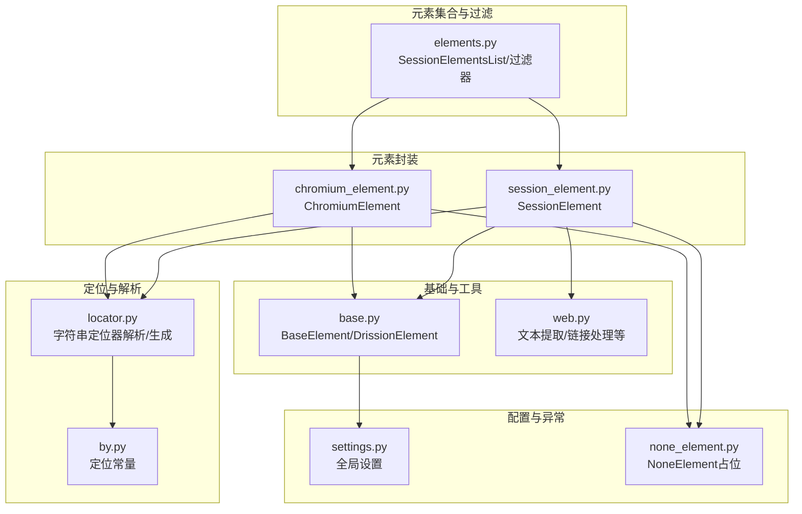
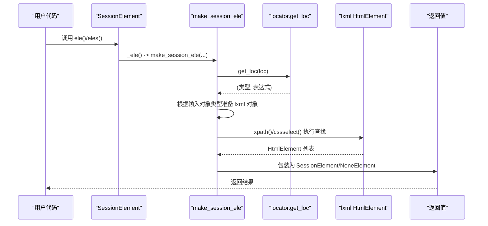
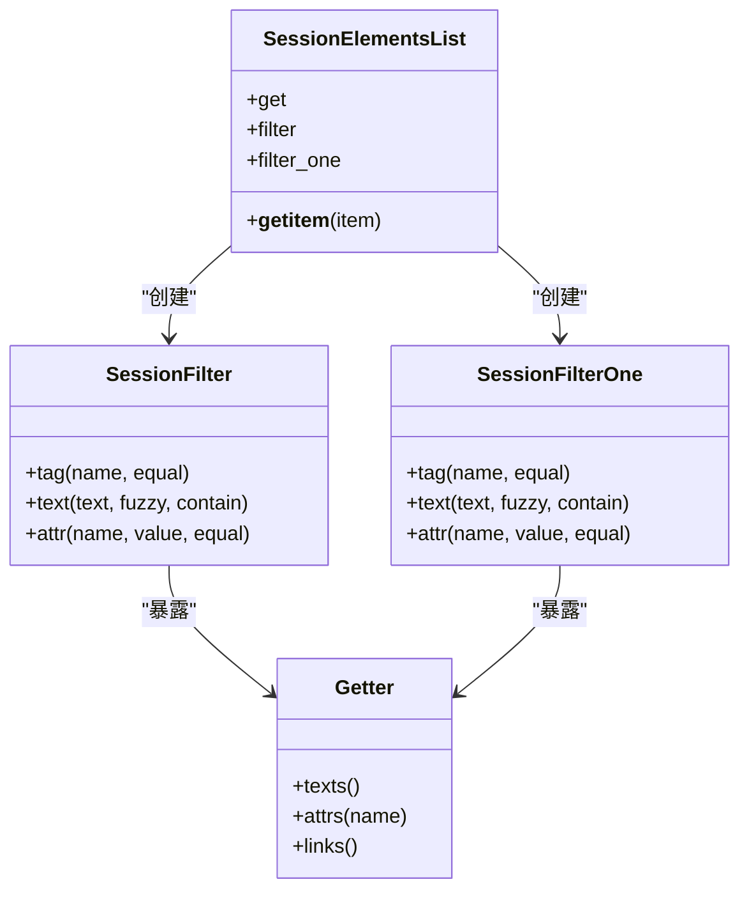
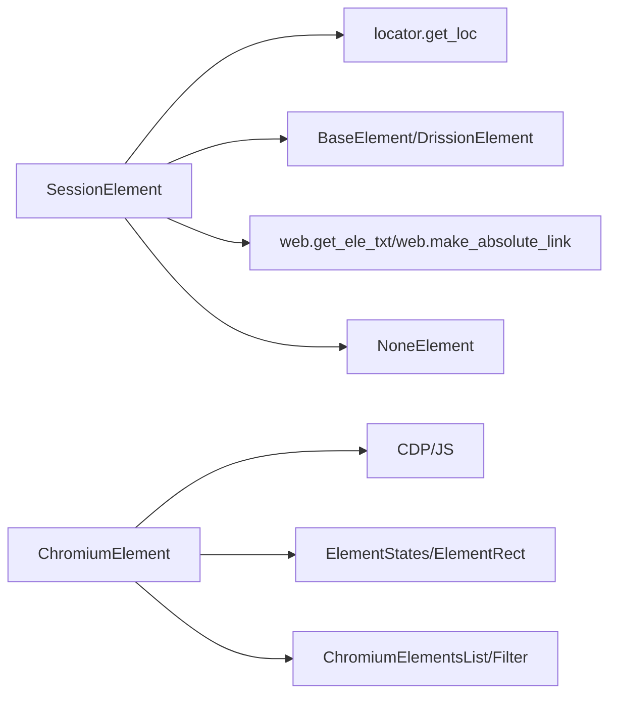

# 元素选择

<cite>
**本文引用的文件**
- [session_element.py](file://DrissionPage/_elements/session_element.py)
- [locator.py](file://DrissionPage/_functions/locator.py)
- [by.py](file://DrissionPage/_functions/by.py)
- [elements.py](file://DrissionPage/_functions/elements.py)
- [chromium_element.py](file://DrissionPage/_elements/chromium_element.py)
- [base.py](file://DrissionPage/_base/base.py)
- [web.py](file://DrissionPage/_functions/web.py)
- [settings.py](file://DrissionPage/_functions/settings.py)
- [none_element.py](file://DrissionPage/_elements/none_element.py)
</cite>

## 目录
1. [简介](#简介)
2. [项目结构](#项目结构)
3. [核心组件](#核心组件)
4. [架构总览](#架构总览)
5. [详细组件分析](#详细组件分析)
6. [依赖分析](#依赖分析)
7. [性能考量](#性能考量)
8. [故障排查指南](#故障排查指南)
9. [结论](#结论)
10. [附录](#附录)

## 简介
本章节系统性介绍 DrissionPage 中 SessionElement 的元素选择能力，涵盖：
- 定位器使用：XPath、CSS 选择器、文本匹配（含精确/模糊/前缀/后缀）
- 查找策略与性能优化
- 元素集合获取与遍历
- 属性读取与设置
- 可见性与交互性判断
- 实用示例、常见问题与最佳实践、调试技巧

## 项目结构
围绕元素选择的关键模块如下：
- 定位与解析：locator.py、by.py
- 元素集合与过滤：elements.py
- 页面/元素基类：base.py
- 元素封装：session_element.py、chromium_element.py
- 工具函数：web.py
- 配置与异常：settings.py、none_element.py

图表来源
- [session_element.py:1-301](file://DrissionPage/_elements/session_element.py#L1-L301)
- [locator.py:1-579](file://DrissionPage/_functions/locator.py#L1-L579)
- [by.py:1-19](file://DrissionPage/_functions/by.py#L1-L19)
- [elements.py:1-461](file://DrissionPage/_functions/elements.py#L1-L461)
- [chromium_element.py:1-800](file://DrissionPage/_elements/chromium_element.py#L1-L800)
- [base.py:1-434](file://DrissionPage/_base/base.py#L1-L434)
- [web.py:1-349](file://DrissionPage/_functions/web.py#L1-L349)
- [settings.py:1-69](file://DrissionPage/_functions/settings.py#L1-L69)
- [none_element.py:1-53](file://DrissionPage/_elements/none_element.py#L1-L53)

章节来源
- [session_element.py:1-301](file://DrissionPage/_elements/session_element.py#L1-L301)
- [locator.py:1-579](file://DrissionPage/_functions/locator.py#L1-L579)
- [by.py:1-19](file://DrissionPage/_functions/by.py#L1-L19)
- [elements.py:1-461](file://DrissionPage/_functions/elements.py#L1-L461)
- [chromium_element.py:1-800](file://DrissionPage/_elements/chromium_element.py#L1-L800)
- [base.py:1-434](file://DrissionPage/_base/base.py#L1-L434)
- [web.py:1-349](file://DrissionPage/_functions/web.py#L1-L349)
- [settings.py:1-69](file://DrissionPage/_functions/settings.py#L1-L69)
- [none_element.py:1-53](file://DrissionPage/_elements/none_element.py#L1-L53)

## 核心组件
- SessionElement：基于 lxml 的静态 HTML 元素选择与封装，支持 ele()/eles()/s_ele()/s_eles() 等接口，内部通过 make_session_ele 完成定位与查找。
- 定位器解析：locator.py 提供字符串定位器解析（支持 @/@|/@! 多属性、tag/text/xpath/css），并生成标准元组形式（类型, 表达式）。
- 元素集合与过滤：elements.py 提供 SessionElementsList 以及过滤器链（tag/text/attr 等），支持链式筛选与批量访问。
- 基类与相对定位：base.py 定义了 DrissionElement 的通用相对定位方法（parent/child/prev/next/before/after 及其复数版本），统一了相对查找策略。
- 工具函数：web.py 提供文本提取、绝对链接拼接等辅助能力；none_element.py 提供未找到元素时的占位对象 NoneElement。

章节来源
- [session_element.py:23-301](file://DrissionPage/_elements/session_element.py#L23-L301)
- [locator.py:15-579](file://DrissionPage/_functions/locator.py#L15-L579)
- [elements.py:16-461](file://DrissionPage/_functions/elements.py#L16-L461)
- [base.py:70-268](file://DrissionPage/_base/base.py#L70-L268)
- [web.py:20-104](file://DrissionPage/_functions/web.py#L20-L104)
- [none_element.py:12-53](file://DrissionPage/_elements/none_element.py#L12-L53)

## 架构总览
SessionElement 的元素选择流程如下：
- 输入定位器（字符串或元组），经 get_loc/str_to_xpath_loc/str_to_css_loc 解析为标准元组
- 根据传入对象类型（SessionElement/ChromiumElement/BasePage/字符串等）准备 lxml HtmlElement 或页面 HTML
- 使用 lxml 的 xpath/cssselect 执行查找，得到 HtmlElement 列表
- 将 HtmlElement 包装为 SessionElement 或 NoneElement 返回

图表来源
- [session_element.py:137-148](file://DrissionPage/_elements/session_element.py#L137-L148)
- [session_element.py:169-293](file://DrissionPage/_elements/session_element.py#L169-L293)
- [locator.py:96-115](file://DrissionPage/_functions/locator.py#L96-L115)
- [base.py:63-94](file://DrissionPage/_base/base.py#L63-L94)

## 详细组件分析

### 定位器与查找策略
- 支持的定位器类型
  - XPath：以 xpath: 或 xpath= 开头，或直接传入 ('xpath', 表达式)
  - CSS 选择器：以 css: 或 css= 开头，或直接 ('css selector', 表达式)
  - 文本匹配：text=、text:、text^、text$，或纯文本模糊匹配
  - 多属性/单属性：@、@@、@|、@!，支持 and/or/否定组合
  - 标签名：tag: 或 tag=
- 解析与生成
  - get_loc：将字符串定位器标准化为 ('xpath'|'css selector', 表达式)
  - str_to_xpath_loc/str_to_css_loc：将字符串转换为 XPath/CSS
  - _make_multi_xpath_str/_make_single_xpath_str/_make_multi_css_str/_make_single_css_str：生成复杂表达式
- 查找执行
  - lxml.html.HtmlElement 提供 xpath()/cssselect()，返回 HtmlElement 列表
  - make_session_ele 根据 index=None 返回集合，否则返回单个元素或 NoneElement

章节来源
- [locator.py:15-579](file://DrissionPage/_functions/locator.py#L15-L579)
- [session_element.py:169-293](file://DrissionPage/_elements/session_element.py#L169-L293)

### 元素集合获取与遍历
- 获取集合
  - SessionElement.eles()/s_eles() 返回 SessionElementsList
  - ChromiumElement.eles()/s_eles() 返回 ChromiumElementsList
- 遍历与切片
  - SessionElementsList 支持切片与整数索引，返回新的 SessionElementsList
  - 过滤器链
    - SessionFilter/SessionFilterOne：按 tag/text/attr 过滤
    - ChromiumFilter/ChromiumFilterOne：按显示状态、可点击、样式等过滤
- 批量访问
  - Getter.texts()/attrs()/links() 提供批量读取

图表来源
- [elements.py:16-461](file://DrissionPage/_functions/elements.py#L16-L461)

章节来源
- [elements.py:16-461](file://DrissionPage/_functions/elements.py#L16-L461)

### 属性读取与设置
- 读取
  - SessionElement.attr(name)：支持 href/src/text/innerText/html/outerHTML/innerHTML 等特殊属性，以及普通属性
  - ChromiumElement.attr(name)/property(name)：支持 DOM 属性与 JS 属性
- 设置
  - ChromiumElement 提供 set 属性（ChromiumElementSetter），用于设置属性/样式/值等
  - 通过 JS 注入或 CDP 设置（如 set.property）

章节来源
- [session_element.py:110-136](file://DrissionPage/_elements/session_element.py#L110-L136)
- [chromium_element.py:372-409](file://DrissionPage/_elements/chromium_element.py#L372-L409)
- [chromium_element.py:419-433](file://DrissionPage/_elements/chromium_element.py#L419-L433)

### 可见性与交互性判断
- 可见性
  - ChromiumElement.states.is_displayed：基于 CDP 计算元素是否可见
- 交互性
  - ChromiumElement.states.is_enabled/is_clickable：判断是否可用/可点击
  - 通过过滤器链 filter/displayed()/enabled()/clickable() 快速筛选
- 文本与标签
  - text/raw_text：文本提取（考虑换行/空白/表格等规则）
  - tag：元素标签名

章节来源
- [chromium_element.py:127-131](file://DrissionPage/_elements/chromium_element.py#L127-L131)
- [chromium_element.py:165-204](file://DrissionPage/_elements/chromium_element.py#L165-L204)
- [web.py:20-104](file://DrissionPage/_functions/web.py#L20-L104)

### 相对定位与路径
- 相对定位
  - parent/child/prev/next/before/after 及其复数版本，统一使用 xpath 生成与执行
- 路径
  - SessionElement.css_selector/xpath：生成 CSS 路径或 XPath
  - ChromiumElement._get_ele_path：JS 计算路径

章节来源
- [base.py:146-245](file://DrissionPage/_base/base.py#L146-L245)
- [session_element.py:126-136](file://DrissionPage/_elements/session_element.py#L126-L136)
- [chromium_element.py:640-677](file://DrissionPage/_elements/chromium_element.py#L640-L677)

### 实用示例与最佳实践
- 使用 XPath 精确查找
  - 示例路径：[session_element.py:137-148](file://DrissionPage/_elements/session_element.py#L137-L148)
- 使用 CSS 选择器
  - 示例路径：[locator.py:184-188](file://DrissionPage/_functions/locator.py#L184-L188)
- 文本模糊匹配
  - 示例路径：[locator.py:189-194](file://DrissionPage/_functions/locator.py#L189-L194)
- 多属性与否定
  - 示例路径：[locator.py:152-157](file://DrissionPage/_functions/locator.py#L152-L157)，[locator.py:301-374](file://DrissionPage/_functions/locator.py#L301-L374)
- 获取集合与遍历
  - 示例路径：[session_element.py:140-141](file://DrissionPage/_elements/session_element.py#L140-L141)，[elements.py:16-41](file://DrissionPage/_functions/elements.py#L16-L41)
- 过滤可见元素
  - 示例路径：[chromium_element.py:224-232](file://DrissionPage/_elements/chromium_element.py#L224-L232)，[elements.py:386-418](file://DrissionPage/_functions/elements.py#L386-L418)

## 依赖分析
- SessionElement 依赖
  - 定位器：locator.get_loc、str_to_xpath_loc、str_to_css_loc
  - 基类：BaseElement/DrissionElement 提供相对定位与通用属性
  - 工具：web.get_ele_txt、web.make_absolute_link
  - 异常：LocatorError、ElementNotFoundError
- 元素集合依赖
  - SessionElementsList/ChromiumElementsList
  - 过滤器：SessionFilter/ChromiumFilter
- ChromiumElement 依赖
  - CDP/JS：DOM.getOuterHTML、DOM.getAttributes、DOM.describeNode、DOM.setFileInputFiles 等
  - 状态：ElementStates、ElementRect、Clicker、SelectElement 等

图表来源
- [session_element.py:169-293](file://DrissionPage/_elements/session_element.py#L169-L293)
- [chromium_element.py:38-83](file://DrissionPage/_elements/chromium_element.py#L38-L83)
- [elements.py:43-62](file://DrissionPage/_functions/elements.py#L43-L62)

章节来源
- [session_element.py:169-293](file://DrissionPage/_elements/session_element.py#L169-L293)
- [chromium_element.py:38-83](file://DrissionPage/_elements/chromium_element.py#L38-L83)
- [elements.py:43-62](file://DrissionPage/_functions/elements.py#L43-L62)

## 性能考量
- 定位器选择
  - CSS 选择器通常比 XPath 更快，优先使用明确的标签/类名选择器
  - 避免过深的层级选择，尽量靠近目标元素
- 集合与过滤
  - 优先使用过滤器链一次性筛选，减少多次遍历
  - 使用 getter 批量读取属性，避免逐个元素访问
- 文本提取
  - text/raw_text 的计算开销不同，按需选择
- 超时与重试
  - 通过超时参数控制等待时间，避免无限阻塞
  - 全局设置可通过 settings 控制异常抛出策略

章节来源
- [elements.py:276-302](file://DrissionPage/_functions/elements.py#L276-L302)
- [settings.py:13-69](file://DrissionPage/_functions/settings.py#L13-L69)

## 故障排查指南
- 定位器错误
  - XPath/CSS 语法错误会抛出定位器异常，检查表达式与转义字符
  - 参考路径：[session_element.py:294-300](file://DrissionPage/_elements/session_element.py#L294-L300)
- 未找到元素
  - NoneElement 占位，可配置是否抛出异常
  - 参考路径：[none_element.py:12-53](file://DrissionPage/_elements/none_element.py#L12-L53)，[settings.py:13-28](file://DrissionPage/_functions/settings.py#L13-L28)
- 相对定位限制
  - CSS 选择器在相对定位中不被支持，需转换为 XPath
  - 参考路径：[base.py:152-153](file://DrissionPage/_base/base.py#L152-L153)，[chromium_element.py:747-748](file://DrissionPage/_elements/chromium_element.py#L747-L748)
- 链接绝对化
  - href/src 会自动拼接绝对链接，注意页面 baseURI
  - 参考路径：[session_element.py:111-120](file://DrissionPage/_elements/session_element.py#L111-L120)，[web.py:137-157](file://DrissionPage/_functions/web.py#L137-L157)

章节来源
- [session_element.py:294-300](file://DrissionPage/_elements/session_element.py#L294-L300)
- [none_element.py:12-53](file://DrissionPage/_elements/none_element.py#L12-L53)
- [settings.py:13-28](file://DrissionPage/_functions/settings.py#L13-L28)
- [base.py:152-153](file://DrissionPage/_base/base.py#L152-L153)
- [chromium_element.py:747-748](file://DrissionPage/_elements/chromium_element.py#L747-L748)
- [web.py:137-157](file://DrissionPage/_functions/web.py#L137-L157)

## 结论
SessionElement 提供了强大而灵活的元素选择能力，结合定位器解析、lxml 查找与集合过滤，能够高效地完成复杂页面元素的定位与操作。通过合理选择定位器、利用过滤器链与批量访问、正确处理可见性与交互性，可以显著提升脚本稳定性与性能。

## 附录
- 常用接口参考
  - ele()/eles()/s_ele()/s_eles()：元素查找与集合获取
  - parent/child/prev/next/before/after 及其复数版本：相对定位
  - attrs/attr/text/raw_text/link/css_selector/xpath：属性与路径
  - filter/filter_one/search/search_one：过滤与筛选
- 调试建议
  - 使用 tree() 输出元素树，辅助定位
  - 逐步缩小定位范围，先用宽泛匹配再精确
  - 对于动态内容，适当增加超时或使用状态判断