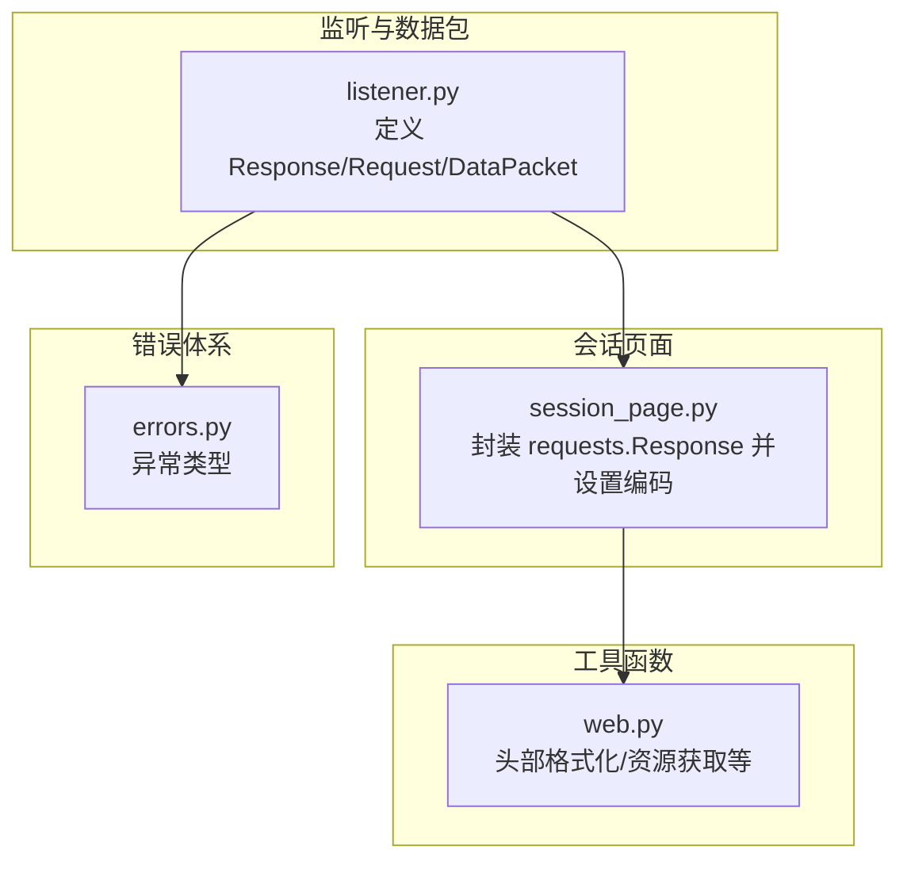
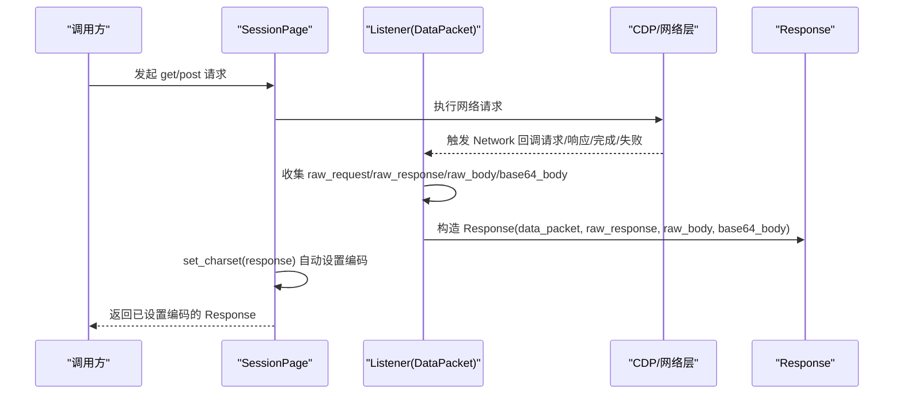
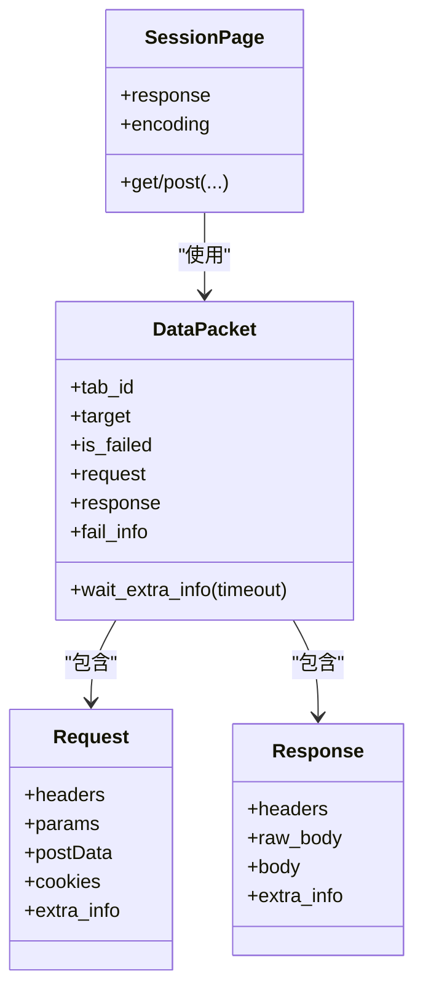

# 响应处理

<cite>
**本文引用的文件**
- [listener.py](file://DrissionPage/_units/listener.py)
- [listener.pyi](file://DrissionPage/_units/listener.pyi)
- [session_page.py](file://DrissionPage/_pages/session_page.py)
- [session_page.pyi](file://DrissionPage/_pages/session_page.pyi)
- [web.py](file://DrissionPage/_functions/web.py)
- [errors.py](file://DrissionPage/errors.py)
</cite>

## 目录
1. [简介](#简介)
2. [项目结构](#项目结构)
3. [核心组件](#核心组件)
4. [架构总览](#架构总览)
5. [组件详解](#组件详解)
6. [依赖关系分析](#依赖关系分析)
7. [性能考量](#性能考量)
8. [故障排查指南](#故障排查指南)
9. [结论](#结论)
10. [附录](#附录)

## 简介
本章节面向“HTTP 响应处理”的功能说明，重点覆盖：
- 响应对象的属性与方法：状态码检查、响应头解析、内容获取与类型推断
- 多种响应类型的处理策略：HTML、JSON、二进制数据（含 base64）
- 编码自动检测与手动设置
- 响应缓存与内容解析机制
- 最佳实践与常见问题解决方案
- 响应数据提取与格式转换的实用示例

## 项目结构
与响应处理相关的核心代码分布在以下模块：
- 监听与数据包：listener.py（定义 Response、Request、DataPacket 等）
- 会话页面封装：session_page.py（对 requests.Response 的二次封装与编码处理）
- 工具函数：web.py（辅助头部格式化、资源获取等）
- 错误体系：errors.py（统一异常类型）

图表来源
- [listener.py:1-543](file://DrissionPage/_units/listener.py#L1-L543)
- [session_page.py:1-294](file://DrissionPage/_pages/session_page.py#L1-L294)
- [web.py:1-349](file://DrissionPage/_functions/web.py#L1-L349)
- [errors.py:1-95](file://DrissionPage/errors.py#L1-L95)

章节来源
- [listener.py:1-543](file://DrissionPage/_units/listener.py#L1-L543)
- [session_page.py:1-294](file://DrissionPage/_pages/session_page.py#L1-L294)
- [web.py:1-349](file://DrissionPage/_functions/web.py#L1-L349)
- [errors.py:1-95](file://DrissionPage/errors.py#L1-L95)

## 核心组件
- Response 对象：封装原始响应信息，提供大小写不敏感的 headers 访问、原始 body 与解析后的 body，并支持额外信息访问
- Request 对象：封装请求信息，提供 headers、params、postData、cookies 等访问
- DataPacket：承载一次网络事件的请求、响应、失败信息与资源类型
- SessionPage：对 requests.Session 的封装，负责连接、重试、状态码检查与编码设置

章节来源
- [listener.py:470-514](file://DrissionPage/_units/listener.py#L470-L514)
- [listener.py:419-468](file://DrissionPage/_units/listener.py#L419-L468)
- [listener.py:335-402](file://DrissionPage/_units/listener.py#L335-L402)
- [session_page.py:25-196](file://DrissionPage/_pages/session_page.py#L25-L196)

## 架构总览
下图展示从监听到响应对象生成的关键流程，以及编码设置的位置。

图表来源
- [session_page.py:180-266](file://DrissionPage/_pages/session_page.py#L180-L266)
- [listener.py:200-294](file://DrissionPage/_units/listener.py#L200-L294)
- [listener.py:392-395](file://DrissionPage/_units/listener.py#L392-L395)
- [listener.py:470-514](file://DrissionPage/_units/listener.py#L470-L514)

## 组件详解

### Response 对象：属性与方法
- 关键属性
  - headers：大小写不敏感的响应头字典，必要时合并额外信息
  - raw_body：未解码的原始 body 文本
  - body：按规则解析后的 body
    - 若标记为 base64，则进行 base64 解码
    - 否则尝试 JSON 解析；失败则回退为原始文本
  - extra_info：响应额外信息（如安全状态、服务端来源等）
  - 其他：url、status、statusText、mimeType、timing 等透传自底层响应字典

- 方法与行为
  - 动态属性：通过 __getattr__ 将未显式定义的属性委托到底层响应字典
  - 头部合并：当存在额外响应头时，优先保留额外头，再补充缺失字段

章节来源
- [listener.py:470-514](file://DrissionPage/_units/listener.py#L470-L514)
- [listener.pyi:298-364](file://DrissionPage/_units/listener.pyi#L298-L364)

### Request 对象：属性与方法
- 关键属性
  - headers：大小写不敏感的请求头字典，必要时合并额外信息
  - params：从 URL 查询串解析的键值对
  - postData：尝试 JSON 解析；失败则回退为原始文本
  - cookies：从额外信息中提取未被屏蔽的 Cookie 列表
  - extra_info：请求额外信息

章节来源
- [listener.py:419-468](file://DrissionPage/_units/listener.py#L419-L468)
- [listener.pyi:298-364](file://DrissionPage/_units/listener.pyi#L298-L364)

### DataPacket：承载一次网络事件
- 职责
  - 存储 raw_request/raw_response/raw_body/base64_body
  - 提供 request/response/fail_info 的惰性构造
  - 提供 wait_extra_info 等等待额外信息的能力

章节来源
- [listener.py:335-402](file://DrissionPage/_units/listener.py#L335-L402)

### SessionPage：连接、重试与编码设置
- 连接与重试
  - get/post 内部调用 _s_connect，循环执行请求，支持重试次数与间隔
  - 当响应内容为空或状态码异常时，根据配置决定抛错或返回不可用
- 状态码检查
  - 使用 response.ok 判断成功与否
- 编码设置
  - 优先从 Content-Type 中提取 charset
  - 若为 text/html 且未在头部找到编码，则尝试从 HTML meta 中提取
  - 若仍无法确定，使用 apparent_encoding 作为后备

章节来源
- [session_page.py:104-134](file://DrissionPage/_pages/session_page.py#L104-L134)
- [session_page.py:180-266](file://DrissionPage/_pages/session_page.py#L180-L266)
- [session_page.py:272-293](file://DrissionPage/_pages/session_page.py#L272-L293)

### 编码自动检测与手动设置
- 自动检测
  - 从响应头 Content-Type 的 charset 参数提取
  - 对 HTML 页面，若头部无编码，则扫描 HTML meta 中的 charset
  - 若仍无结果，采用 apparent_encoding
- 手动设置
  - 可在返回 response 后直接修改 response.encoding
  - 也可在 SessionPage 初始化时设置内部编码，影响后续请求的默认编码

章节来源
- [session_page.py:272-293](file://DrissionPage/_pages/session_page.py#L272-L293)
- [session_page.py:236-238](file://DrissionPage/_pages/session_page.py#L236-L238)

### 响应类型处理策略
- JSON
  - body 属性在非 base64 时尝试 JSON 解析，失败则回退为原始文本
- HTML
  - 由 SessionPage 的 set_charset 负责编码设置，便于后续解析
- 二进制数据（含 base64）
  - 若标记为 base64，则 body 返回解码后的 bytes
  - 否则返回原始文本（如 data URI、blob 资源等）

章节来源
- [listener.py:498-509](file://DrissionPage/_units/listener.py#L498-L509)
- [web.py:169-195](file://DrissionPage/_functions/web.py#L169-L195)

### 响应缓存与内容解析机制
- 缓存来源
  - ResponseExtraInfo 中包含 fromDiskCache、fromServiceWorker、fromPrefetchCache、serviceWorkerResponseSource 等字段，可用于判断响应来源与缓存命中情况
- 内容解析
  - body 的解析逻辑集中在 Response.body 属性中，遵循 base64 优先与 JSON 降级策略
  - headers 的解析与合并逻辑在 Response.headers 属性中实现

章节来源
- [listener.pyi:298-332](file://DrissionPage/_units/listener.pyi#L298-L332)
- [listener.py:482-491](file://DrissionPage/_units/listener.py#L482-L491)
- [listener.py:498-509](file://DrissionPage/_units/listener.py#L498-L509)

### 实用示例（路径指引）
- 获取响应状态码并判断
  - 参考：[session_page.py:188-194](file://DrissionPage/_pages/session_page.py#L188-L194)
- 获取响应头（大小写不敏感）
  - 参考：[listener.py:482-491](file://DrissionPage/_units/listener.py#L482-L491)
- 获取原始 body 与解析后 body
  - 参考：[listener.py:494-509](file://DrissionPage/_units/listener.py#L494-L509)
- 设置编码（自动/手动）
  - 参考：[session_page.py:272-293](file://DrissionPage/_pages/session_page.py#L272-L293)
- 处理 base64 图片或 blob 资源
  - 参考：[web.py:169-195](file://DrissionPage/_functions/web.py#L169-L195)

## 依赖关系分析
- SessionPage 依赖 requests.Session 与 requests.Response，并在连接完成后调用 set_charset 进行编码设置
- Listener/DataPacket/Response 之间通过 DataPacket 协作，将 CDP 回调收集的信息组装为 Response
- Response.headers 与 Request.headers 均使用大小写不敏感字典，提升兼容性

图表来源
- [listener.py:335-402](file://DrissionPage/_units/listener.py#L335-L402)
- [listener.py:419-468](file://DrissionPage/_units/listener.py#L419-L468)
- [listener.py:470-514](file://DrissionPage/_units/listener.py#L470-L514)
- [session_page.py:25-196](file://DrissionPage/_pages/session_page.py#L25-L196)

章节来源
- [listener.py:335-402](file://DrissionPage/_units/listener.py#L335-L402)
- [listener.py:419-468](file://DrissionPage/_units/listener.py#L419-L468)
- [listener.py:470-514](file://DrissionPage/_units/listener.py#L470-L514)
- [session_page.py:25-196](file://DrissionPage/_pages/session_page.py#L25-L196)

## 性能考量
- 惰性求值
  - Response.headers/body 等属性采用惰性计算，避免重复解析与内存占用
- 大小写不敏感字典
  - 使用 CaseInsensitiveDict 减少重复查找成本
- base64 与 JSON 解析
  - 仅在需要时进行，base64 解码与 JSON 解析均为 O(n)，注意大体量响应的内存峰值
- 编码设置
  - HTML meta 扫描为 O(n) 的正则匹配，建议在必要时手动设置编码以减少扫描开销

[本节为通用指导，无需列出具体文件来源]

## 故障排查指南
- 状态码异常
  - 检查 response.ok 与状态码；必要时开启 show_errmsg 抛出异常
  - 参考：[session_page.py:188-194](file://DrissionPage/_pages/session_page.py#L188-L194)
- 编码错误导致乱码
  - 手动设置 response.encoding 或在 SessionPage 初始化时设置编码
  - 参考：[session_page.py:236-238](file://DrissionPage/_pages/session_page.py#L236-L238)
- HTML 编码未正确识别
  - 确认 Content-Type 与 HTML meta 中的 charset 是否存在；必要时手动设置
  - 参考：[session_page.py:272-293](file://DrissionPage/_pages/session_page.py#L272-L293)
- base64 数据未正确解码
  - 确认 base64_body 标记；Response.body 会在 base64 标记时进行解码
  - 参考：[listener.py:498-509](file://DrissionPage/_units/listener.py#L498-L509)
- 二进制资源获取失败
  - 对 data URI 或 blob 资源，使用工具函数进行 base64 解码或 CDP 获取
  - 参考：[web.py:169-195](file://DrissionPage/_functions/web.py#L169-L195)

章节来源
- [session_page.py:188-194](file://DrissionPage/_pages/session_page.py#L188-L194)
- [session_page.py:236-238](file://DrissionPage/_pages/session_page.py#L236-L238)
- [session_page.py:272-293](file://DrissionPage/_pages/session_page.py#L272-L293)
- [listener.py:498-509](file://DrissionPage/_units/listener.py#L498-L509)
- [web.py:169-195](file://DrissionPage/_functions/web.py#L169-L195)

## 结论
- Response 对象提供了统一的响应访问接口，支持大小写不敏感头、原始与解析后内容、额外信息等
- SessionPage 在连接与编码层面提供了稳健的默认行为，同时允许手动干预
- 对于二进制与 JSON 等多类型响应，框架通过 base64 标记与 JSON 解析实现了灵活处理
- 建议在复杂场景下结合缓存来源信息与手动编码设置，以获得更稳定与可控的响应处理体验

[本节为总结性内容，无需列出具体文件来源]

## 附录

### 响应处理最佳实践
- 明确响应类型
  - 通过 Content-Type 与 MIME Type 判断响应类型，必要时强制设置编码
- 控制解析范围
  - 对大体量响应，优先使用 raw_body 或按需解析 JSON/HTML
- 缓存与来源
  - 结合 extra_info 中的缓存来源字段，评估响应新鲜度与可靠性
- 错误与重试
  - 对不稳定网络环境启用重试；对关键接口记录状态码与异常信息

[本节为通用指导，无需列出具体文件来源]