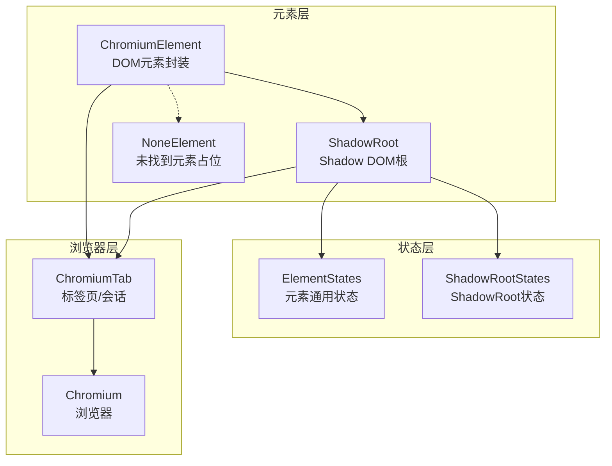
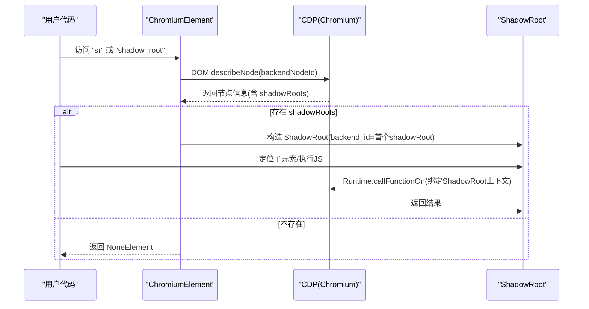
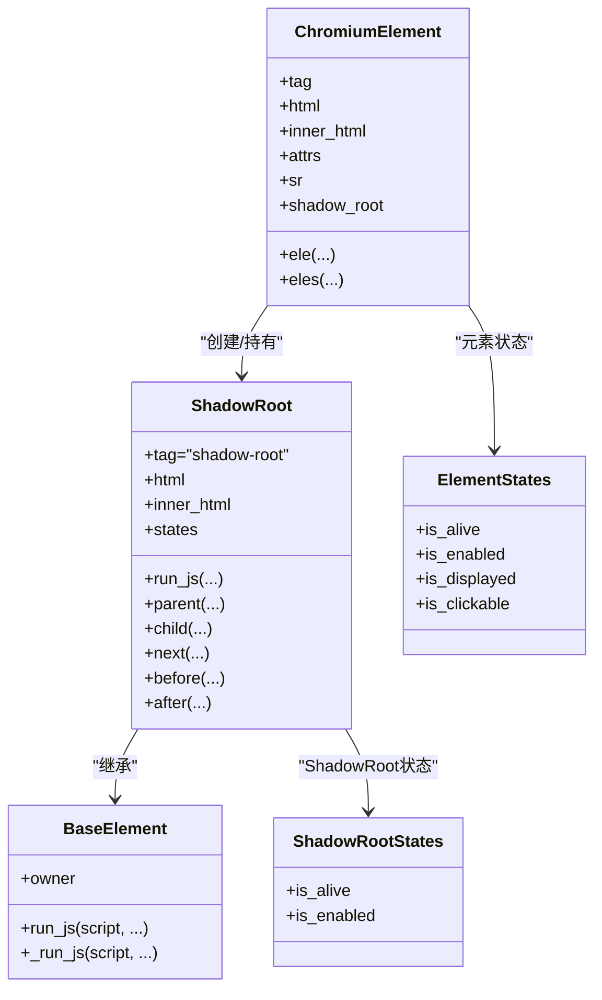
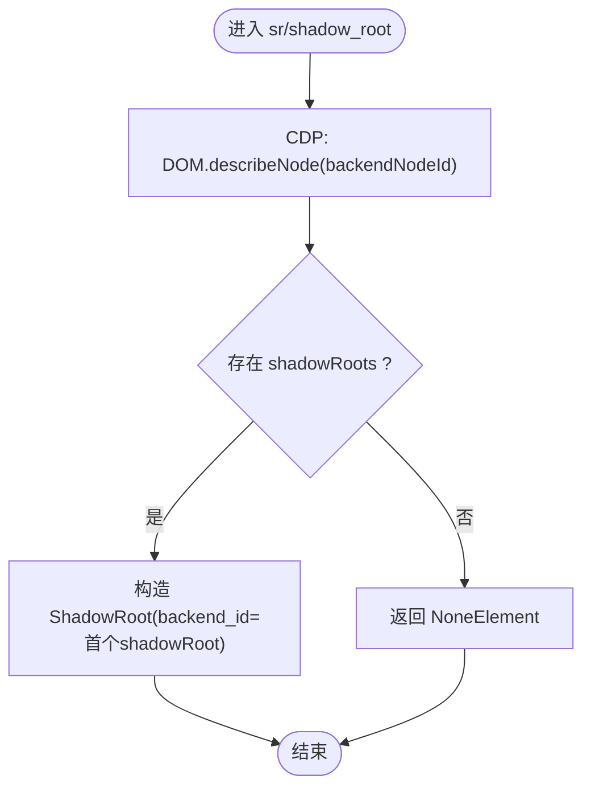
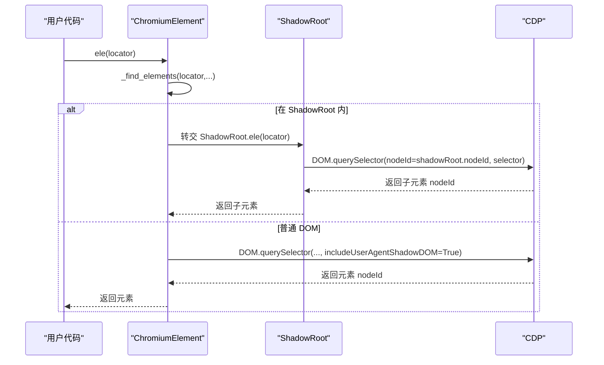
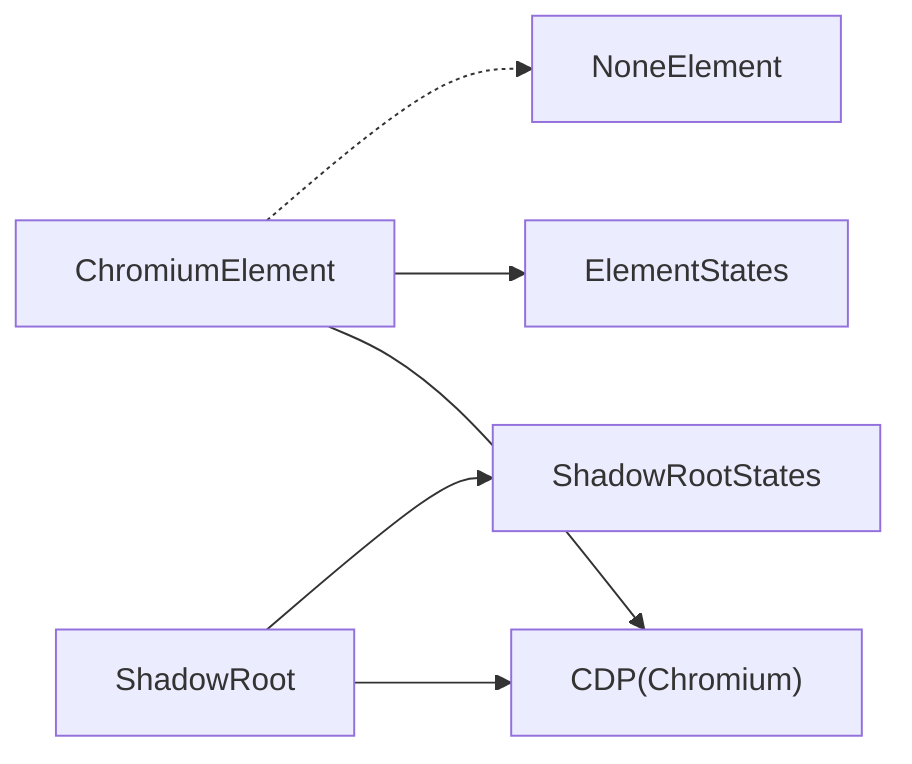

# Shadow DOM 支持

<cite>
**本文引用的文件**
- [chromium_element.py](file://DrissionPage/_elements/chromium_element.py)
- [states.py](file://DrissionPage/_units/states.py)
- [chromium.py](file://DrissionPage/_browsers/chromium.py)
- [none_element.py](file://DrissionPage/_elements/none_element.py)
- [errors.py](file://DrissionPage/errors.py)
</cite>

## 目录
1. [简介](#简介)
2. [项目结构](#项目结构)
3. [核心组件](#核心组件)
4. [架构总览](#架构总览)
5. [组件详解](#组件详解)
6. [依赖关系分析](#依赖关系分析)
7. [性能考量](#性能考量)
8. [故障排除指南](#故障排除指南)
9. [结论](#结论)

## 简介
本章节系统阐述 DrissionPage 对 Shadow DOM 的完整支持能力，涵盖 ShadowRoot 对象的创建与使用、在 Shadow DOM 中定位与操作元素的方法、Shadow Root 的查找与访问机制、Shadow DOM 元素的特殊属性与行为、Shadow DOM 与普通 DOM 的差异及处理差异、复杂 Web Components 的操作技巧，以及调试与故障排除方法。内容基于仓库源码进行深入分析，确保技术细节准确可追溯。

## 项目结构
围绕 Shadow DOM 支持的关键代码主要集中在以下模块：
- 元素层：ChromiumElement 与 ShadowRoot 类，负责 DOM/Shadow DOM 元素的封装、定位与操作
- 状态层：ElementStates 与 ShadowRootStates，提供元素状态判断（如存活、启用、可见等）
- 浏览器层：Chromium（浏览器/标签页）与 ChromiumTab，提供底层 CDP 能力（如查询、解析节点、执行脚本）
- 异常层：统一错误类型，用于定位与恢复
- 空元素：NoneElement，作为“未找到元素”的占位返回，便于统一处理

图表来源
- [chromium_element.py:38-174](file://DrissionPage/_elements/chromium_element.py#L38-L174)
- [chromium_element.py:686-740](file://DrissionPage/_elements/chromium_element.py#L686-L740)
- [states.py:12-73](file://DrissionPage/_units/states.py#L12-L73)
- [states.py:75-91](file://DrissionPage/_units/states.py#L75-L91)
- [chromium.py:686-707](file://DrissionPage/_browsers/chromium.py#L686-L707)

章节来源
- [chromium_element.py:38-174](file://DrissionPage/_elements/chromium_element.py#L38-L174)
- [chromium_element.py:686-740](file://DrissionPage/_elements/chromium_element.py#L686-L740)
- [states.py:12-73](file://DrissionPage/_units/states.py#L12-L73)
- [states.py:75-91](file://DrissionPage/_units/states.py#L75-L91)
- [chromium.py:686-707](file://DrissionPage/_browsers/chromium.py#L686-L707)

## 核心组件
- ChromiumElement：封装普通 DOM 元素，提供属性读取、样式查询、文本提取、JS 运行、相对定位、事件与滚动等能力；新增 shadow_root/sr 属性以访问 ShadowRoot。
- ShadowRoot：封装 Shadow DOM 根节点，继承基础元素能力，提供 JS 运行、父子兄弟定位、HTML/innerHTML 访问、状态判断等。
- ElementStates / ShadowRootStates：分别提供元素与 ShadowRoot 的状态判断（启用、存活、可见、可点击等）。
- Chromium（标签页）：通过 CDP 提供 DOM 查询、节点描述、对象解析、脚本执行等底层能力，是 Shadow DOM 支持的基石。
- NoneElement：当定位失败时返回占位对象，避免异常中断流程，同时可按需抛出异常。

章节来源
- [chromium_element.py:38-174](file://DrissionPage/_elements/chromium_element.py#L38-L174)
- [chromium_element.py:686-740](file://DrissionPage/_elements/chromium_element.py#L686-L740)
- [states.py:12-73](file://DrissionPage/_units/states.py#L12-L73)
- [states.py:75-91](file://DrissionPage/_units/states.py#L75-L91)
- [none_element.py:12-53](file://DrissionPage/_elements/none_element.py#L12-L53)

## 架构总览
Shadow DOM 在 DrissionPage 中的实现路径如下：
- 通过 ChromiumElement 的 sr/shadow_root 属性触发 CDP 描述节点，检测是否存在 shadowRoots 并构造 ShadowRoot 对象
- ShadowRoot 继承基础元素能力，使用 run_js 将执行上下文绑定到 ShadowRoot 对应的对象 ID，从而在 Shadow DOM 内部执行脚本与定位
- Chromium（标签页）提供底层 CDP 能力，包括 DOM.performSearch、DOM.describeNode、DOM.querySelector、DOM.querySelectorAll、Runtime.callFunctionOn 等
- 状态层通过 CDP 判断元素存活与可用性，辅助定位与交互决策

图表来源
- [chromium_element.py:144-156](file://DrissionPage/_elements/chromium_element.py#L144-L156)
- [chromium_element.py:686-740](file://DrissionPage/_elements/chromium_element.py#L686-L740)
- [chromium.py:688-707](file://DrissionPage/_browsers/chromium.py#L688-L707)

## 组件详解

### ShadowRoot 对象模型与类关系
ShadowRoot 作为 Shadow DOM 的根节点，具备与 ChromiumElement 类似的运行时能力，但其定位与查找策略更贴近 Shadow DOM 的语义边界。

图表来源
- [chromium_element.py:38-174](file://DrissionPage/_elements/chromium_element.py#L38-L174)
- [chromium_element.py:686-740](file://DrissionPage/_elements/chromium_element.py#L686-L740)
- [states.py:12-73](file://DrissionPage/_units/states.py#L12-L73)
- [states.py:75-91](file://DrissionPage/_units/states.py#L75-L91)

章节来源
- [chromium_element.py:686-740](file://DrissionPage/_elements/chromium_element.py#L686-L740)
- [states.py:75-91](file://DrissionPage/_units/states.py#L75-L91)

### ShadowRoot 的创建与访问机制
- ChromiumElement 提供 sr/shadow_root 属性，内部通过 CDP DOM.describeNode 获取节点信息，若存在 shadowRoots，则以首个 shadowRoot 的 backendNodeId 构造 ShadowRoot 对象
- 若超时未发现 shadowRoots，返回 NoneElement，避免异常中断流程
- ShadowRoot 的 run_js 使用 run_js 工具函数，将执行上下文绑定到该对象的 objectId，确保在 Shadow DOM 上下文中执行脚本

图表来源
- [chromium_element.py:144-156](file://DrissionPage/_elements/chromium_element.py#L144-L156)
- [chromium_element.py:686-740](file://DrissionPage/_elements/chromium_element.py#L686-L740)

章节来源
- [chromium_element.py:144-156](file://DrissionPage/_elements/chromium_element.py#L144-L156)
- [chromium_element.py:686-740](file://DrissionPage/_elements/chromium_element.py#L686-L740)

### 在 Shadow DOM 中定位与操作元素
- ShadowRoot 支持 child/next/before/after 等相对定位方法，内部将定位表达式转换为 XPath 并在 ShadowRoot 的节点范围内查询
- ShadowRoot 的 ele/eles 基于 make_session_ele 与 CDP DOM.querySelector/DOM.querySelectorAll 实现，支持 CSS 选择器（在 ShadowRoot 内部生效）
- ChromiumElement 的 ele/eles 同样支持在 Shadow DOM 中定位，内部通过 _find_elements 调用 find_in_chromium_ele，结合 CDP 的 includeUserAgentShadowDOM 参数实现跨 DOM 边界的节点探测
- 为避免误判，定位逻辑会过滤掉 html/body/shadow_root 特定路径，确保返回目标元素而非容器结构

图表来源
- [chromium_element.py:419-436](file://DrissionPage/_elements/chromium_element.py#L419-L436)
- [chromium_element.py:758-800](file://DrissionPage/_elements/chromium_element.py#L758-L800)
- [chromium_element.py:861-917](file://DrissionPage/_elements/chromium_element.py#L861-L917)

章节来源
- [chromium_element.py:419-436](file://DrissionPage/_elements/chromium_element.py#L419-L436)
- [chromium_element.py:758-800](file://DrissionPage/_elements/chromium_element.py#L758-L800)
- [chromium_element.py:861-917](file://DrissionPage/_elements/chromium_element.py#L861-L917)

### Shadow DOM 与普通 DOM 的区别与处理差异
- 定位范围差异：普通 DOM 定位默认不穿透 Shadow DOM；在需要穿透时，需显式开启 includeUserAgentShadowDOM 或在 ShadowRoot 上下文中执行
- 定位语法限制：ShadowRoot 不支持 CSS 选择器定位，内部强制转换为 XPath；普通 DOM 可直接使用 CSS 选择器
- 结构路径过滤：在某些定位场景中，系统会过滤 html/body/shadow_root 特定路径，避免将容器结构误认为目标元素
- 上下文绑定：ShadowRoot 的 JS 执行通过 Runtime.callFunctionOn 绑定到该对象的 objectId，确保在 Shadow DOM 内部执行

章节来源
- [chromium_element.py:746-748](file://DrissionPage/_elements/chromium_element.py#L746-L748)
- [chromium_element.py:882-917](file://DrissionPage/_elements/chromium_element.py#L882-L917)
- [chromium_element.py:1235-1290](file://DrissionPage/_elements/chromium_element.py#L1235-L1290)

### 复杂 Web Components 的操作技巧
- 优先通过 ChromiumElement.shadow_root 获取 ShadowRoot，再在 ShadowRoot 内部进行精确定位
- 对于复杂的多层 Shadow DOM，逐层获取 shadow_root 并在每层内定位，避免一次性使用过深的跨层选择器
- 使用 run_js 在 ShadowRoot 上下文中执行自定义逻辑，结合属性/样式/事件模拟实现复杂交互
- 遇到动态内容，结合 ElementStates/ShadowRootStates 的 is_alive/is_enabled 判断元素可用性，必要时配合等待器

章节来源
- [chromium_element.py:686-740](file://DrissionPage/_elements/chromium_element.py#L686-L740)
- [states.py:75-91](file://DrissionPage/_units/states.py#L75-L91)

### Shadow DOM 中元素的特殊属性与行为
- ShadowRoot.tag 固定为 "shadow-root"，用于标识其类型
- ShadowRoot.html/inner_html 提供 ShadowRoot 内部 HTML 的访问接口
- ShadowRoot.states 提供 is_alive/is_enabled 等状态判断，与 ElementStates 行为一致但针对 ShadowRoot
- ChromiumElement.sr/shadow_root 提供延迟查找与缓存，避免重复 CDP 调用

章节来源
- [chromium_element.py:713-728](file://DrissionPage/_elements/chromium_element.py#L713-L728)
- [chromium_element.py:144-156](file://DrissionPage/_elements/chromium_element.py#L144-L156)

## 依赖关系分析
- ChromiumElement 依赖 Chromium（标签页）提供的 CDP 能力（DOM.describeNode、DOM.querySelector、DOM.querySelectorAll、Runtime.callFunctionOn 等），并通过 run_js 将执行上下文绑定到元素对象 ID
- ShadowRoot 继承 BaseElement，复用 run_js 机制，同时扩展了在 Shadow DOM 内部的定位与状态判断
- ElementStates/ShadowRootStates 通过 CDP 判断元素存活与可用性，辅助定位与交互决策
- NoneElement 作为占位返回，统一处理定位失败场景，避免异常中断

图表来源
- [chromium_element.py:38-174](file://DrissionPage/_elements/chromium_element.py#L38-L174)
- [chromium_element.py:686-740](file://DrissionPage/_elements/chromium_element.py#L686-L740)
- [states.py:12-73](file://DrissionPage/_units/states.py#L12-L73)
- [states.py:75-91](file://DrissionPage/_units/states.py#L75-L91)
- [none_element.py:12-53](file://DrissionPage/_elements/none_element.py#L12-L53)

章节来源
- [chromium_element.py:38-174](file://DrissionPage/_elements/chromium_element.py#L38-L174)
- [chromium_element.py:686-740](file://DrissionPage/_elements/chromium_element.py#L686-L740)
- [states.py:12-73](file://DrissionPage/_units/states.py#L12-L73)
- [states.py:75-91](file://DrissionPage/_units/states.py#L75-L91)
- [none_element.py:12-53](file://DrissionPage/_elements/none_element.py#L12-L53)

## 性能考量
- 避免频繁调用 describeNode 与 getNodeForLocation：优先通过已知 backendNodeId 缓存对象，减少 CDP 调用次数
- 在 ShadowRoot 内部定位时，尽量使用精确的 XPath 或 CSS 选择器，减少回溯与全量扫描
- 对动态内容，结合等待器与状态判断（is_alive/is_enabled）降低无效尝试
- 大量元素筛选时，优先使用 CDP 的 DOM.querySelectorAll 并在 Python 层进行二次过滤

## 故障排除指南
常见问题与处理建议：
- 未找到 ShadowRoot：检查元素是否确实挂载了 shadowRoots；确认 includeUserAgentShadowDOM 参数是否正确传递；必要时增加超时重试
- 定位失败返回 NoneElement：根据 Settings.raise_when_ele_not_found 配置决定抛出异常还是返回占位对象；检查定位表达式是否适用于 ShadowRoot（ShadowRoot 不支持 CSS 选择器）
- JS 执行异常：确认执行上下文是否绑定到正确的对象 ID；检查 Runtime.callFunctionOn 的参数与返回值解析；注意异步脚本与 alert 的影响
- 元素不可见/不可点击：结合 ElementStates/ShadowRootStates 的 is_displayed/is_clickable/is_in_viewport 判断，必要时先滚动至可视区域再交互
- 资源加载失败：对于 img/link 等资源，检查 src/baseURI 与 blob 数据获取流程

章节来源
- [chromium_element.py:144-156](file://DrissionPage/_elements/chromium_element.py#L144-L156)
- [chromium_element.py:758-800](file://DrissionPage/_elements/chromium_element.py#L758-L800)
- [chromium_element.py:1235-1290](file://DrissionPage/_elements/chromium_element.py#L1235-L1290)
- [errors.py:21-95](file://DrissionPage/errors.py#L21-L95)

## 结论
DrissionPage 对 Shadow DOM 的支持以 ChromiumElement 与 ShadowRoot 为核心，借助 Chromium 的 CDP 能力实现了对 Shadow DOM 的创建、访问、定位与操作。通过状态判断与异常处理机制，系统在复杂 Web Components 场景下提供了稳定可靠的自动化能力。实践中建议优先在 ShadowRoot 上下文中进行定位与交互，并结合状态判断与等待器提升稳定性与性能。