# 元素信息获取

<cite>
**本文引用的文件**
- [chromium_element.py](file://DrissionPage/_elements/chromium_element.py)
- [session_element.py](file://DrissionPage/_elements/session_element.py)
- [base.py](file://DrissionPage/_base/base.py)
- [rect.py](file://DrissionPage/_units/rect.py)
- [states.py](file://DrissionPage/_units/states.py)
- [web.py](file://DrissionPage/_functions/web.py)
- [none_element.py](file://DrissionPage/_elements/none_element.py)
- [elements.py](file://DrissionPage/_functions/elements.py)
</cite>

## 目录
1. [简介](#简介)
2. [项目结构](#项目结构)
3. [核心组件](#核心组件)
4. [架构总览](#架构总览)
5. [详细组件分析](#详细组件分析)
6. [依赖关系分析](#依赖关系分析)
7. [性能考量](#性能考量)
8. [故障排查指南](#故障排查指南)
9. [结论](#结论)

## 简介
本文系统讲解 DrissionPage 中“元素信息获取”的完整能力，覆盖：
- 属性与文本：attrs、attr、property；text、raw_text、inner_html、html
- 尺寸与位置：rect、size、location、midpoint
- 状态判断：states、is_enabled、is_visible、is_selected
- 路径生成：get_ele_path
- 截图与保存：get_screenshot、save
- 资源获取：src
- DOM 关系查询：parent、child、siblings 及相对方位查询
- 实时更新与缓存机制

## 项目结构
围绕元素信息获取，涉及以下关键模块：
- 元素基类与具体实现：DrissionElement、ChromiumElement、SessionElement
- 位置与尺寸：ElementRect
- 状态判断：ElementStates
- 文本处理：get_ele_txt
- 无结果占位：NoneElement
- 列表与过滤：SessionElementsList、ChromiumElementsList 及其过滤器

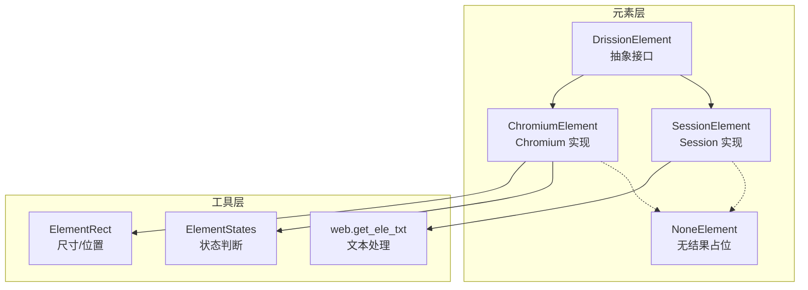

图表来源
- [chromium_element.py:38-174](file://DrissionPage/_elements/chromium_element.py#L38-L174)
- [session_element.py:23-151](file://DrissionPage/_elements/session_element.py#L23-L151)
- [rect.py:10-107](file://DrissionPage/_units/rect.py#L10-L107)
- [states.py:12-73](file://DrissionPage/_units/states.py#L12-L73)
- [web.py:20-104](file://DrissionPage/_functions/web.py#L20-L104)
- [none_element.py:12-53](file://DrissionPage/_elements/none_element.py#L12-L53)

章节来源
- [chromium_element.py:38-174](file://DrissionPage/_elements/chromium_element.py#L38-L174)
- [session_element.py:23-151](file://DrissionPage/_elements/session_element.py#L23-L151)
- [rect.py:10-107](file://DrissionPage/_units/rect.py#L10-L107)
- [states.py:12-73](file://DrissionPage/_units/states.py#L12-L73)
- [web.py:20-104](file://DrissionPage/_functions/web.py#L20-L104)
- [none_element.py:12-53](file://DrissionPage/_elements/none_element.py#L12-L53)

## 核心组件
- DrissionElement：定义通用属性与 DOM 关系查询方法（parent/child/prev/next/before/after 及其复数版本），并提供路径生成、超时控制等基础能力。
- ChromiumElement：基于 Chromium 的具体实现，提供属性与文本获取、样式与属性访问、截图与保存、资源获取、DOM 关系查询、相对方位探测、阴影根等能力，并通过 ElementRect 和 ElementStates 提供尺寸/位置与状态判断。
- SessionElement：基于本地 HTML 解析（lxml）的实现，提供属性与文本获取、DOM 关系查询、路径生成等，适合离线或本地 HTML 处理场景。
- ElementRect：封装元素在视口、页面、屏幕坐标系下的尺寸与位置信息，支持点击点、中间点、四角等计算。
- ElementStates：封装元素可见性、可用性、选中态、可点击等状态判断。
- web.get_ele_txt：统一的文本提取逻辑，考虑标签语义、换行、缩进等。
- NoneElement：当元素未找到时的占位对象，支持配置抛异常或返回默认值/False。

章节来源
- [base.py:70-268](file://DrissionPage/_base/base.py#L70-L268)
- [chromium_element.py:38-174](file://DrissionPage/_elements/chromium_element.py#L38-L174)
- [session_element.py:23-151](file://DrissionPage/_elements/session_element.py#L23-L151)
- [rect.py:10-107](file://DrissionPage/_units/rect.py#L10-L107)
- [states.py:12-73](file://DrissionPage/_units/states.py#L12-L73)
- [web.py:20-104](file://DrissionPage/_functions/web.py#L20-L104)
- [none_element.py:12-53](file://DrissionPage/_elements/none_element.py#L12-L53)

## 架构总览
元素信息获取的调用链路如下：
- 属性与文本：ChromiumElement.attr/property、SessionElement.attr/property、text/raw_text/inner_html/html
- 尺寸与位置：ChromiumElement.rect（内部为 ElementRect），提供 size/location/midpoint/corners 等
- 状态判断：ChromiumElement.states（内部为 ElementStates），提供 is_enabled/is_visible/is_selected/is_clickable 等
- DOM 关系：DrissionElement.parent/child/prev/next/before/after 及其复数版本
- 路径生成：DrissionElement.css_selector/xpath（基于 _get_ele_path）
- 截图与保存：ChromiumElement.get_screenshot/save
- 资源获取：ChromiumElement.src
- 无结果处理：NoneElement

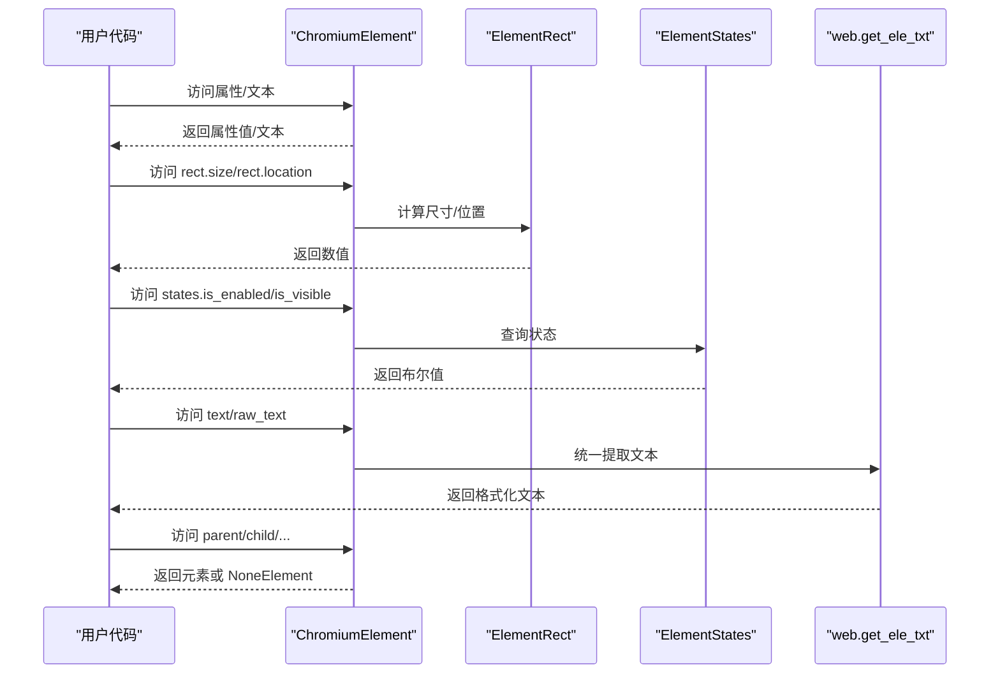

图表来源
- [chromium_element.py:91-118](file://DrissionPage/_elements/chromium_element.py#L91-L118)
- [chromium_element.py:138-142](file://DrissionPage/_elements/chromium_element.py#L138-L142)
- [chromium_element.py:127-131](file://DrissionPage/_elements/chromium_element.py#L127-L131)
- [rect.py:28-58](file://DrissionPage/_units/rect.py#L28-L58)
- [states.py:16-33](file://DrissionPage/_units/states.py#L16-L33)
- [web.py:20-104](file://DrissionPage/_functions/web.py#L20-L104)
- [base.py:146-216](file://DrissionPage/_base/base.py#L146-L216)

## 详细组件分析

### 属性与文本获取
- 属性获取
  - ChromiumElement.attrs：通过 CDP 获取节点属性字典
  - ChromiumElement.attr(name)：按名称返回属性值，特殊处理 href/src/text/innerText/html/innerHTML 等
  - ChromiumElement.property(name)：通过 JS 访问 DOM 属性
  - SessionElement.attrs/attr/property：基于 lxml 元素对象，支持绝对链接补全
- 文本获取
  - text：使用统一的 get_ele_txt 规则提取，考虑换行、缩进、表格列等
  - raw_text：直接返回 innerText
  - inner_html/html：ChromiumElement 使用 JS/CDP，SessionElement 使用 lxml 序列化

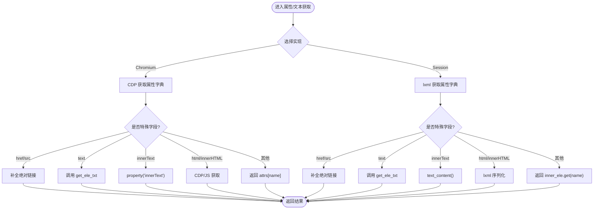

图表来源
- [chromium_element.py:99-118](file://DrissionPage/_elements/chromium_element.py#L99-L118)
- [chromium_element.py:372-398](file://DrissionPage/_elements/chromium_element.py#L372-L398)
- [chromium_element.py:403-408](file://DrissionPage/_elements/chromium_element.py#L403-L408)
- [session_element.py:62-76](file://DrissionPage/_elements/session_element.py#L62-L76)
- [session_element.py:110-136](file://DrissionPage/_elements/session_element.py#L110-L136)
- [web.py:20-104](file://DrissionPage/_functions/web.py#L20-L104)

章节来源
- [chromium_element.py:99-118](file://DrissionPage/_elements/chromium_element.py#L99-L118)
- [chromium_element.py:372-398](file://DrissionPage/_elements/chromium_element.py#L372-L398)
- [chromium_element.py:403-408](file://DrissionPage/_elements/chromium_element.py#L403-L408)
- [session_element.py:62-76](file://DrissionPage/_elements/session_element.py#L62-L76)
- [session_element.py:110-136](file://DrissionPage/_elements/session_element.py#L110-L136)
- [web.py:20-104](file://DrissionPage/_functions/web.py#L20-L104)

### 尺寸与位置信息
- ElementRect 提供：
  - size：元素边框盒宽高
  - location/midpoint/click_point：页面坐标系下的位置
  - viewport_*：视口坐标系下的位置
  - screen_*：屏幕坐标系下的位置（考虑设备像素比）
  - scroll_position：元素滚动位置
- ChromiumElement.rect 作为 ElementRect 的懒加载实例，首次访问时创建并缓存

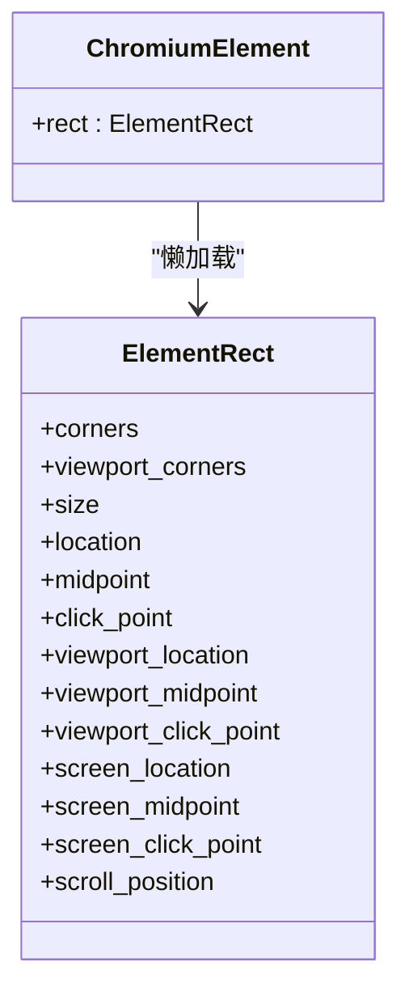

图表来源
- [rect.py:10-107](file://DrissionPage/_units/rect.py#L10-L107)
- [chromium_element.py:138-142](file://DrissionPage/_elements/chromium_element.py#L138-L142)

章节来源
- [rect.py:10-107](file://DrissionPage/_units/rect.py#L10-L107)
- [chromium_element.py:138-142](file://DrissionPage/_elements/chromium_element.py#L138-L142)

### 状态判断
- ElementStates 提供：
  - is_selected/is_checked/is_enabled/is_displayed
  - is_alive/is_in_viewport/is_whole_in_viewport/is_covered/is_clickable/has_rect
- ChromiumElement.states 懒加载缓存

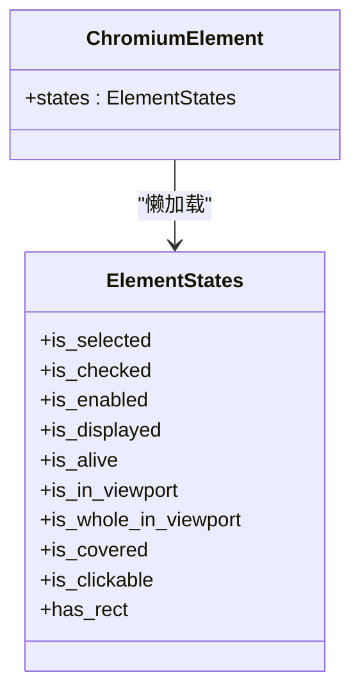

图表来源
- [states.py:12-73](file://DrissionPage/_units/states.py#L12-L73)
- [chromium_element.py:127-131](file://DrissionPage/_elements/chromium_element.py#L127-L131)

章节来源
- [states.py:12-73](file://DrissionPage/_units/states.py#L12-L73)
- [chromium_element.py:127-131](file://DrissionPage/_elements/chromium_element.py#L127-L131)

### DOM 关系查询
- DrissionElement 提供 parent/child/prev/next/before/after 及其复数版本（children/prevs/nexts/befores/afters）
- 支持 XPath/CSS 定位符，CSS 不支持时抛出错误
- SessionElement 与 ChromiumElement 在关系查询上复用父类逻辑

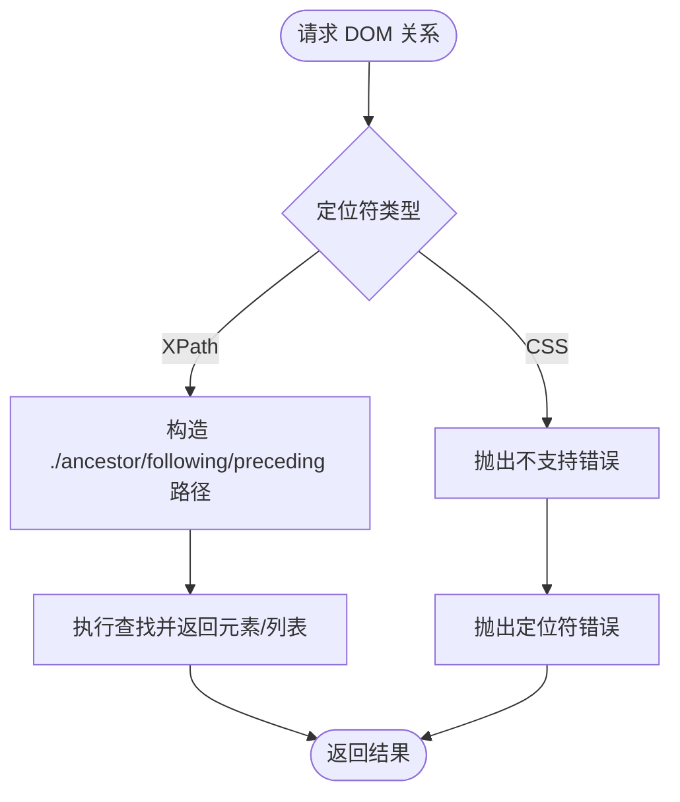

图表来源
- [base.py:146-216](file://DrissionPage/_base/base.py#L146-L216)
- [chromium_element.py:206-238](file://DrissionPage/_elements/chromium_element.py#L206-L238)
- [session_element.py:77-108](file://DrissionPage/_elements/session_element.py#L77-L108)

章节来源
- [base.py:146-216](file://DrissionPage/_base/base.py#L146-L216)
- [chromium_element.py:206-238](file://DrissionPage/_elements/chromium_element.py#L206-L238)
- [session_element.py:77-108](file://DrissionPage/_elements/session_element.py#L77-L108)

### 路径生成
- css_selector/xpath 属性基于 _get_ele_path 实现
- ChromiumElement._get_ele_path 支持 XPath 与 CSS 路径生成，内部通过 JS 遍历父节点构建路径
- SessionElement._get_ele_path 使用 lxml 的 getpath 或自定义 nth-child 计算

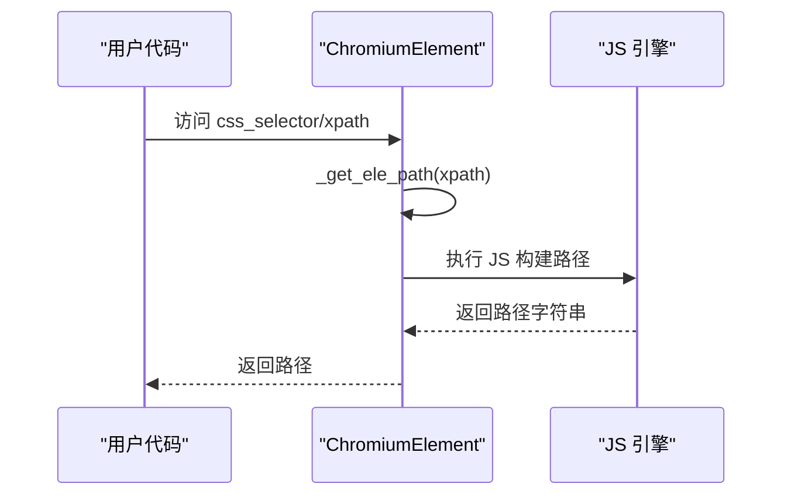

图表来源
- [chromium_element.py:125-136](file://DrissionPage/_elements/chromium_element.py#L125-L136)
- [chromium_element.py:640-677](file://DrissionPage/_elements/chromium_element.py#L640-L677)
- [session_element.py:152-167](file://DrissionPage/_elements/session_element.py#L152-L167)

章节来源
- [chromium_element.py:125-136](file://DrissionPage/_elements/chromium_element.py#L125-L136)
- [chromium_element.py:640-677](file://DrissionPage/_elements/chromium_element.py#L640-L677)
- [session_element.py:152-167](file://DrissionPage/_elements/session_element.py#L152-L167)

### 截图与保存
- get_screenshot：等待图片加载完成（如适用），滚动至可视区域中心，按元素矩形区域进行截图
- save：调用 src 获取资源数据后写入文件，自动推断扩展名

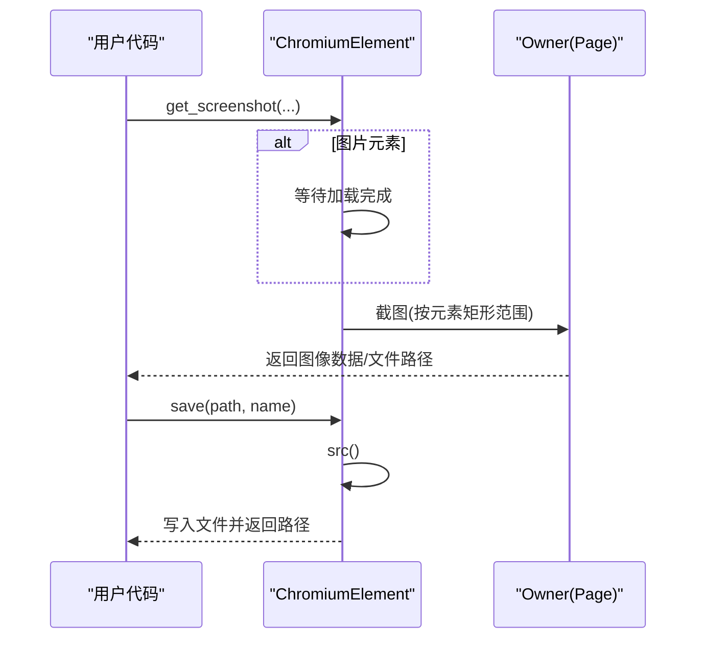

图表来源
- [chromium_element.py:527-546](file://DrissionPage/_elements/chromium_element.py#L527-L546)
- [chromium_element.py:502-526](file://DrissionPage/_elements/chromium_element.py#L502-L526)

章节来源
- [chromium_element.py:527-546](file://DrissionPage/_elements/chromium_element.py#L527-L546)
- [chromium_element.py:502-526](file://DrissionPage/_elements/chromium_element.py#L502-L526)

### 资源获取
- src：优先处理 data:image（base64），其次 blob，最后普通资源通过 Page.getResourceContent 获取
- 自动等待 img 加载完成（如适用）

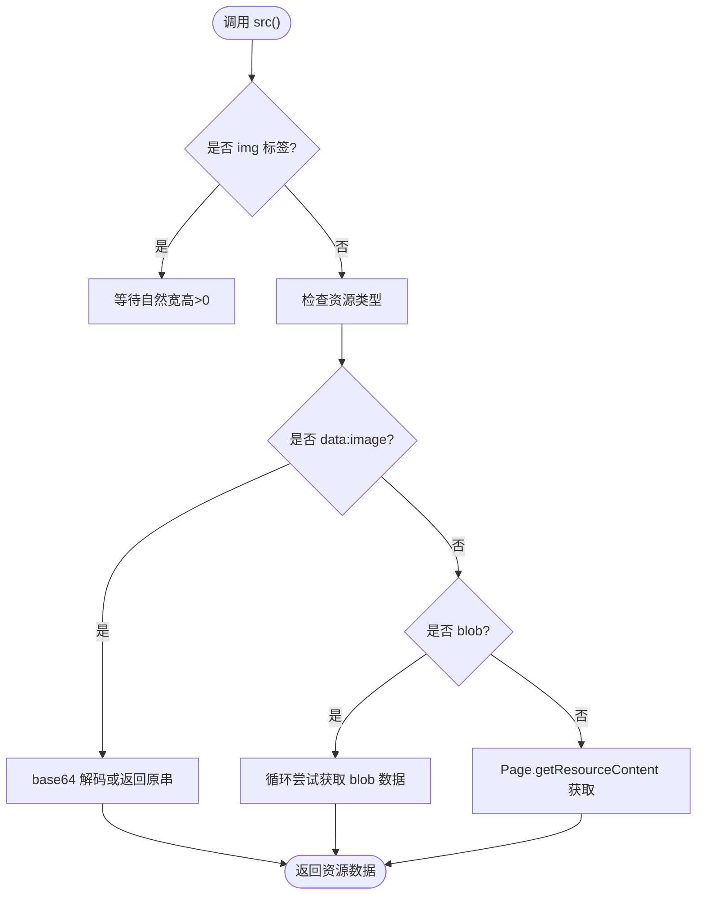

图表来源
- [chromium_element.py:442-501](file://DrissionPage/_elements/chromium_element.py#L442-L501)

章节来源
- [chromium_element.py:442-501](file://DrissionPage/_elements/chromium_element.py#L442-L501)

### 实时更新与缓存机制
- 懒加载与缓存
  - ChromiumElement.rect、states、click、scroll、select、wait、pseudo、set 等均采用懒加载并在首次访问时创建并缓存
  - ChromiumElement.attrs 首次访问失败时会触发 _refresh_id 并重试一次
- 实时性保障
  - 当元素属性或状态可能变化时，可通过重新访问属性或调用 _refresh_id 来刷新 ID
  - 截图前会等待图片加载完成，确保视觉一致性
- 无结果处理
  - 未找到元素时返回 NoneElement，行为可配置（抛异常或返回默认值/False）

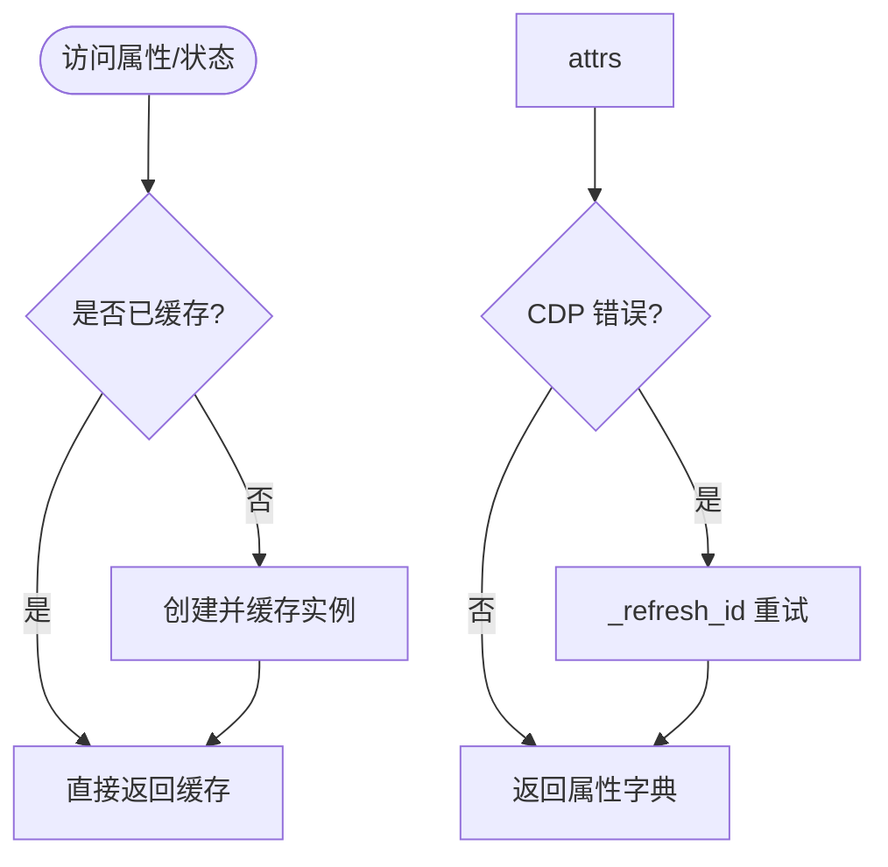

图表来源
- [chromium_element.py:100-110](file://DrissionPage/_elements/chromium_element.py#L100-L110)
- [chromium_element.py:636-639](file://DrissionPage/_elements/chromium_element.py#L636-L639)

章节来源
- [chromium_element.py:100-110](file://DrissionPage/_elements/chromium_element.py#L100-L110)
- [chromium_element.py:636-639](file://DrissionPage/_elements/chromium_element.py#L636-L639)
- [none_element.py:12-53](file://DrissionPage/_elements/none_element.py#L12-L53)

## 依赖关系分析
- 组件耦合
  - ChromiumElement 依赖 ElementRect、ElementStates、web 工具函数
  - SessionElement 依赖 lxml 与 web 工具函数
  - NoneElement 作为占位对象被各实现共享
- 外部依赖
  - CDP（Chrome DevTools Protocol）用于 Chromium 元素的属性、HTML、布局、资源等获取
  - lxml 用于 SessionElement 的 HTML 解析与定位
- 潜在循环依赖
  - 无明显循环依赖，模块职责清晰

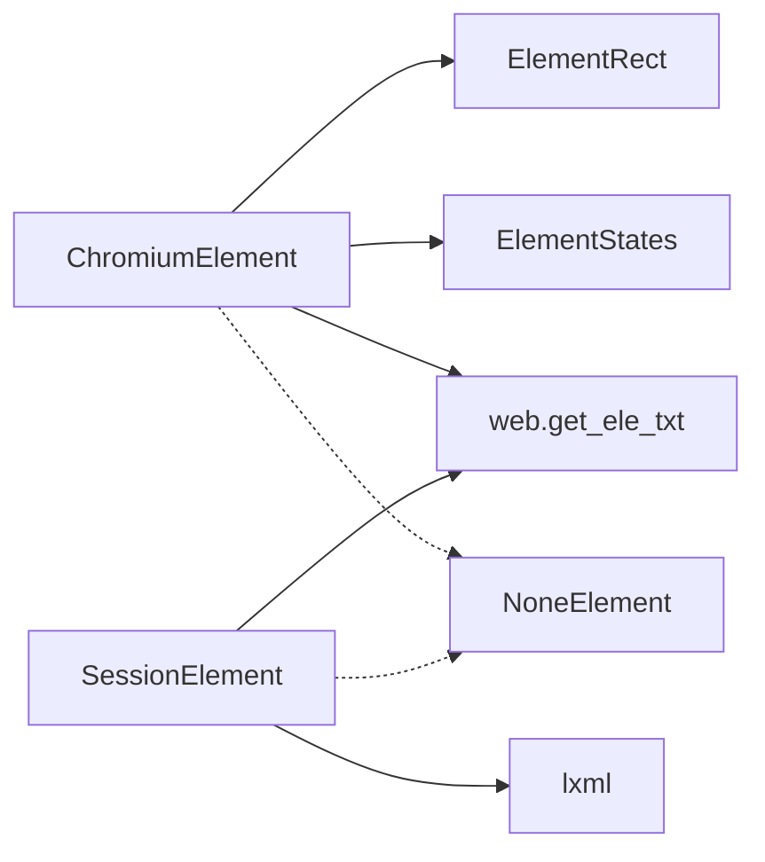

图表来源
- [chromium_element.py:25-31](file://DrissionPage/_elements/chromium_element.py#L25-L31)
- [session_element.py:11-20](file://DrissionPage/_elements/session_element.py#L11-L20)
- [rect.py:10-107](file://DrissionPage/_units/rect.py#L10-L107)
- [states.py:12-73](file://DrissionPage/_units/states.py#L12-L73)
- [web.py:20-104](file://DrissionPage/_functions/web.py#L20-L104)
- [none_element.py:12-53](file://DrissionPage/_elements/none_element.py#L12-L53)

章节来源
- [chromium_element.py:25-31](file://DrissionPage/_elements/chromium_element.py#L25-L31)
- [session_element.py:11-20](file://DrissionPage/_elements/session_element.py#L11-L20)
- [rect.py:10-107](file://DrissionPage/_units/rect.py#L10-L107)
- [states.py:12-73](file://DrissionPage/_units/states.py#L12-L73)
- [web.py:20-104](file://DrissionPage/_functions/web.py#L20-L104)
- [none_element.py:12-53](file://DrissionPage/_elements/none_element.py#L12-L53)

## 性能考量
- 懒加载减少不必要的 CDP 调用，提升初始访问性能
- 对于频繁访问的属性（如 rect、states），建议在单次操作中复用对象，避免重复创建
- 文本提取使用统一规则，避免重复解析
- 截图前等待图片加载，避免半成品图像，但会增加等待时间
- 对于大量元素的 DOM 关系查询，优先使用 XPath，避免多次 CSS 解析

## 故障排查指南
- 元素丢失
  - 现象：CDP 抛错或 states.is_alive 为 False
  - 处理：调用 _refresh_id 刷新对象 ID，或重新定位元素
- 无结果占位
  - 现象：返回 NoneElement
  - 处理：根据 Settings.raise_when_ele_not_found 配置决定抛异常还是返回默认值/False
- 定位符错误
  - 现象：CSS 定位符不支持或表达式无效
  - 处理：改用 XPath，或修正 CSS 语法
- 资源获取失败
  - 现象：src 返回 None 或抛出异常
  - 处理：确认资源类型（data:image/blob/普通），检查网络与权限

章节来源
- [chromium_element.py:636-639](file://DrissionPage/_elements/chromium_element.py#L636-L639)
- [none_element.py:12-53](file://DrissionPage/_elements/none_element.py#L12-L53)
- [base.py:150-158](file://DrissionPage/_base/base.py#L150-L158)
- [chromium_element.py:442-501](file://DrissionPage/_elements/chromium_element.py#L442-L501)

## 结论
DrissionPage 的元素信息获取体系以 DrissionElement 为抽象基类，分别在 Chromium 与 Session 场景下提供一致的 API 体验。通过 ElementRect 与 ElementStates 提供精确的位置与状态信息，结合统一的文本提取与资源获取策略，满足复杂网页自动化场景下的信息采集需求。懒加载与缓存机制在保证实时性的同时兼顾性能，NoneElement 则提供了可控的容错策略。