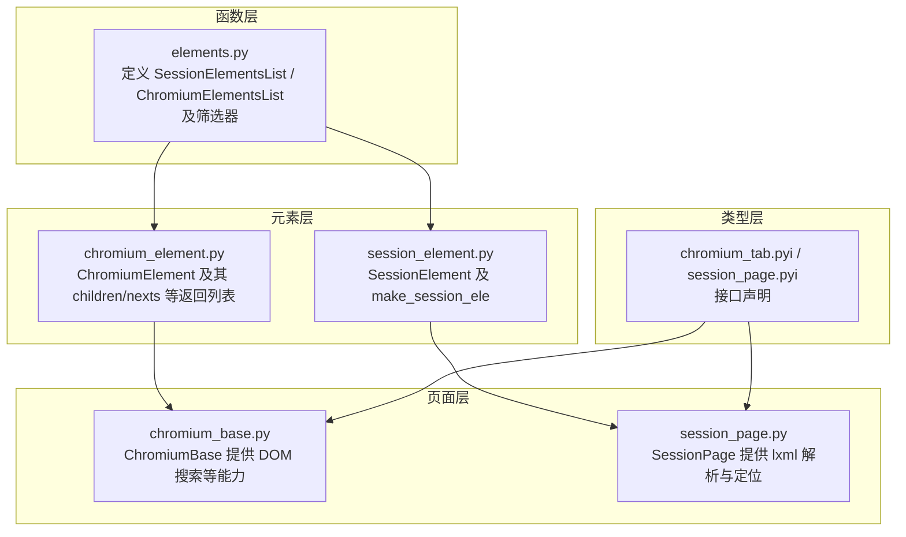
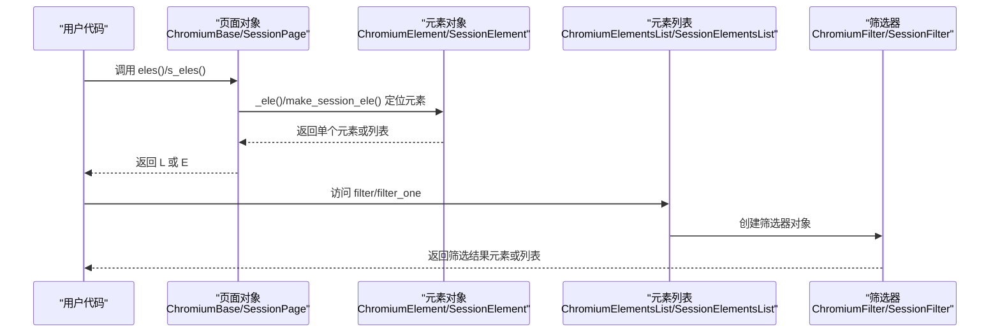
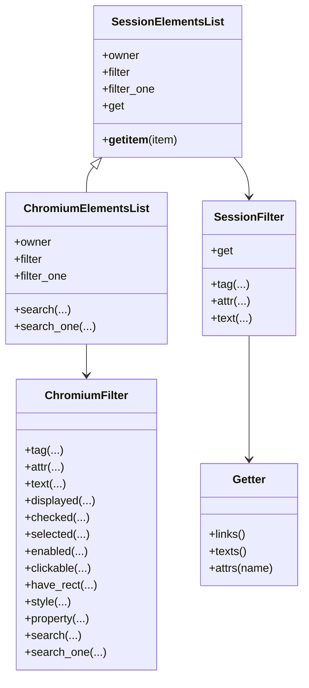
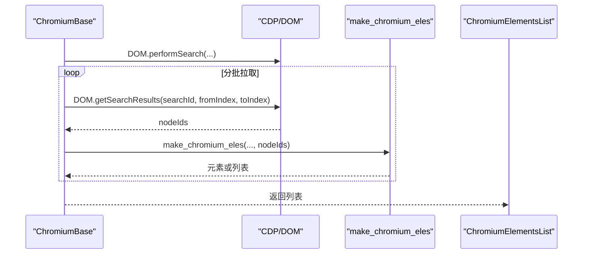
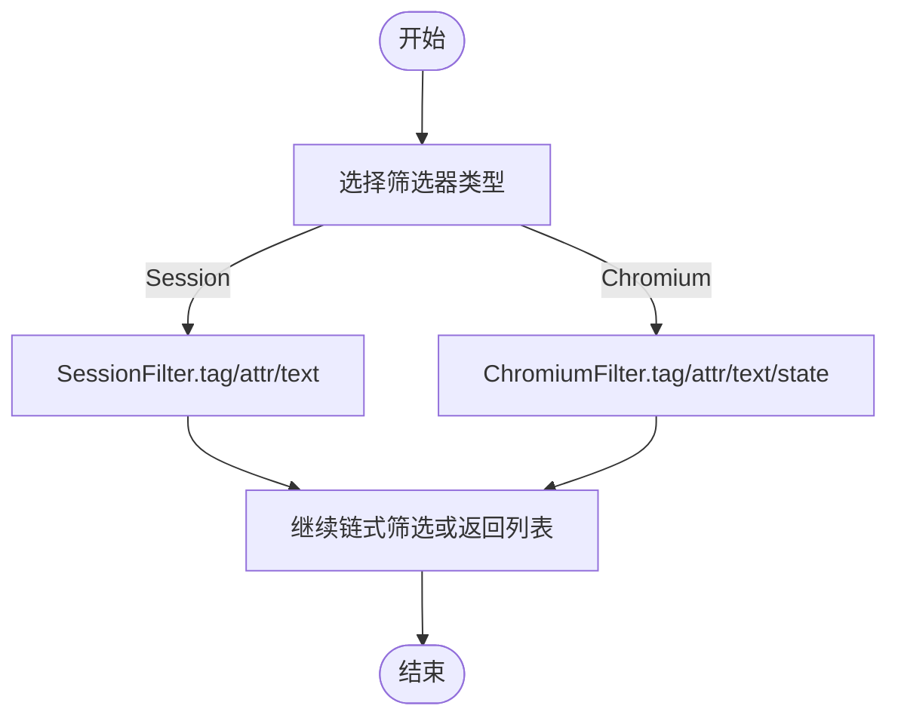
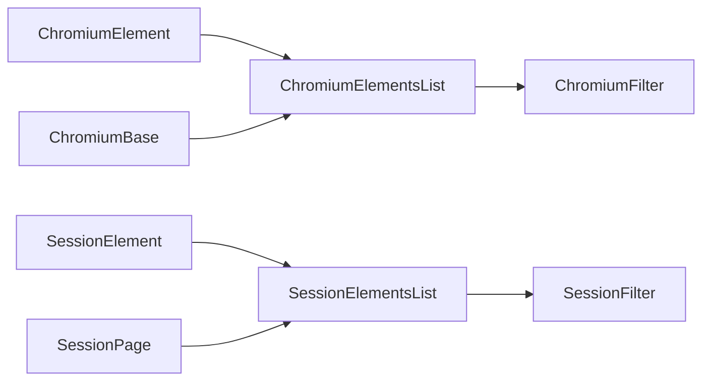

# 元素列表管理

<cite>
**本文引用的文件**
- [elements.py](file://DrissionPage/_functions/elements.py)
- [elements.pyi](file://DrissionPage/_functions/elements.pyi)
- [chromium_element.py](file://DrissionPage/_elements/chromium_element.py)
- [session_element.py](file://DrissionPage/_elements/session_element.py)
- [chromium_base.py](file://DrissionPage/_pages/chromium_base.py)
- [session_page.py](file://DrissionPage/_pages/session_page.py)
- [chromium_tab.pyi](file://DrissionPage/_pages/chromium_tab.pyi)
- [session_page.pyi](file://DrissionPage/_pages/session_page.pyi)
</cite>

## 目录
1. [简介](#简介)
2. [项目结构](#项目结构)
3. [核心组件](#核心组件)
4. [架构总览](#架构总览)
5. [详细组件分析](#详细组件分析)
6. [依赖关系分析](#依赖关系分析)
7. [性能考量](#性能考量)
8. [故障排查指南](#故障排查指南)
9. [结论](#结论)
10. [附录](#附录)

## 简介
本文系统阐述 DrissionPage 中“元素列表”的管理与操作，重点覆盖：
- ChromiumElementsList 与 SessionElementsList 的定义、继承关系与差异
- 批量元素操作的实现原理与性能考量
- 元素列表的筛选、排序、过滤能力
- 遍历与迭代方法
- 列表与单个元素对象之间的转换
- 内存管理与性能优化技巧
- 复杂页面中大规模元素的处理策略

## 项目结构
围绕元素列表的关键代码主要分布在以下模块：
- 元素列表与筛选器：DrissionPage/_functions/elements.py
- Chromium 元素与列表：DrissionPage/_elements/chromium_element.py
- Session 元素与列表：DrissionPage/_elements/session_element.py
- 页面基类与元素查找：DrissionPage/_pages/chromium_base.py、DrissionPage/_pages/session_page.py
- 类型注解与接口：DrissionPage/_pages/chromium_tab.pyi、DrissionPage/_pages/session_page.pyi

图表来源
- [elements.py:16-51](file://DrissionPage/_functions/elements.py#L16-L51)
- [chromium_element.py:224-237](file://DrissionPage/_elements/chromium_element.py#L224-L237)
- [session_element.py:95-108](file://DrissionPage/_elements/session_element.py#L95-L108)
- [chromium_base.py:468-498](file://DrissionPage/_pages/chromium_base.py#L468-L498)
- [session_page.py:139-146](file://DrissionPage/_pages/session_page.py#L139-L146)

章节来源
- [elements.py:16-51](file://DrissionPage/_functions/elements.py#L16-L51)
- [chromium_element.py:224-237](file://DrissionPage/_elements/chromium_element.py#L224-L237)
- [session_element.py:95-108](file://DrissionPage/_elements/session_element.py#L95-L108)
- [chromium_base.py:468-498](file://DrissionPage/_pages/chromium_base.py#L468-L498)
- [session_page.py:139-146](file://DrissionPage/_pages/session_page.py#L139-L146)

## 核心组件
- SessionElementsList：通用元素列表容器，封装切片、索引、属性获取与筛选器入口
- ChromiumElementsList：Chromium 场景下的元素列表，扩展了搜索与状态筛选能力
- 筛选器链：
  - SessionFilterOne / SessionFilter：按标签、属性、文本进行筛选
  - ChromiumFilterOne / ChromiumFilter：在上述基础上增加显示、选中、可用、可点击、矩形存在、样式、属性等状态筛选
- Getter：统一提取链接、文本、属性等常用数据

章节来源
- [elements.py:16-51](file://DrissionPage/_functions/elements.py#L16-L51)
- [elements.py:64-160](file://DrissionPage/_functions/elements.py#L64-L160)
- [elements.py:163-260](file://DrissionPage/_functions/elements.py#L163-L260)
- [elements.py:262-274](file://DrissionPage/_functions/elements.py#L262-L274)

## 架构总览
元素列表在不同页面模式下的创建与使用路径如下：

图表来源
- [chromium_element.py:224-237](file://DrissionPage/_elements/chromium_element.py#L224-L237)
- [session_element.py:95-108](file://DrissionPage/_elements/session_element.py#L95-L108)
- [chromium_base.py:468-498](file://DrissionPage/_pages/chromium_base.py#L468-L498)
- [session_page.py:139-146](file://DrissionPage/_pages/session_page.py#L139-L146)
- [elements.py:35-51](file://DrissionPage/_functions/elements.py#L35-L51)

## 详细组件分析

### 元素列表类体系
- SessionElementsList
  - 继承自 list，持有 owner 页面对象
  - 支持切片返回新的列表实例，支持整数索引
  - 提供 filter/filter_one/get 属性，分别进入筛选器与属性提取
- ChromiumElementsList
  - 在 SessionElementsList 基础上，新增 search/search_one 方法
  - 提供 ChromiumFilter/ChromiumFilterOne 作为筛选器

图表来源
- [elements.py:16-51](file://DrissionPage/_functions/elements.py#L16-L51)
- [elements.py:130-160](file://DrissionPage/_functions/elements.py#L130-L160)
- [elements.py:206-260](file://DrissionPage/_functions/elements.py#L206-L260)
- [elements.py:262-274](file://DrissionPage/_functions/elements.py#L262-L274)

章节来源
- [elements.py:16-51](file://DrissionPage/_functions/elements.py#L16-L51)
- [elements.py:130-160](file://DrissionPage/_functions/elements.py#L130-L160)
- [elements.py:206-260](file://DrissionPage/_functions/elements.py#L206-L260)
- [elements.py:262-274](file://DrissionPage/_functions/elements.py#L262-L274)

### 批量元素操作与实现原理
- Chromium 场景
  - 页面通过 DOM 搜索接口分批获取节点 ID，再映射为元素对象
  - 支持按索引或全部返回；当 index=None 时返回 ChromiumElementsList
- Session 场景
  - 使用 lxml 解析 HTML，基于 xpath/css 选择器返回 SessionElement 列表
  - 支持相对路径与绝对路径组合，兼容多种输入形态

图表来源
- [chromium_base.py:468-498](file://DrissionPage/_pages/chromium_base.py#L468-L498)
- [chromium_element.py:1113-1145](file://DrissionPage/_elements/chromium_element.py#L1113-L1145)

章节来源
- [chromium_base.py:468-498](file://DrissionPage/_pages/chromium_base.py#L468-L498)
- [chromium_element.py:1113-1145](file://DrissionPage/_elements/chromium_element.py#L1113-L1145)

### 筛选、排序与过滤
- 标签筛选：tag(name, equal=True/False)
- 文本筛选：text(text, fuzzy=True/False, contain=True/False)
- 属性筛选：attr(name, value, equal=True/False)
- 状态筛选（Chromium）：displayed/checked/selected/enabled/clickable/have_rect/style/property
- 搜索（Chromium）：search(displayed/checked/selected/enabled/clickable/have_rect/have_text/tag)
- 获取单个：filter_one(...) 后再调用 tag/attr/text 等，返回首个匹配元素或 NoneElement

图表来源
- [elements.py:130-160](file://DrissionPage/_functions/elements.py#L130-L160)
- [elements.py:206-260](file://DrissionPage/_functions/elements.py#L206-L260)
- [elements.py:386-461](file://DrissionPage/_functions/elements.py#L386-L461)

章节来源
- [elements.py:130-160](file://DrissionPage/_functions/elements.py#L130-L160)
- [elements.py:206-260](file://DrissionPage/_functions/elements.py#L206-L260)
- [elements.py:386-461](file://DrissionPage/_functions/elements.py#L386-L461)

### 遍历与迭代
- 列表支持：
  - __iter__/__next__：可直接迭代元素
  - __getitem__(int/slice)：支持索引与切片，切片返回新的列表实例
  - __len__：返回元素数量
- 筛选器支持：
  - SessionFilter/ChromiumFilter 实现 __iter__/__next__/__len__/__getitem__
- Getter：
  - 提供 links/texts/attrs(name) 一次性提取常用属性

章节来源
- [elements.py:130-160](file://DrissionPage/_functions/elements.py#L130-L160)
- [elements.py:262-274](file://DrissionPage/_functions/elements.py#L262-L274)

### 列表与单个元素的转换
- 从列表到单个元素：
  - 使用索引访问：list[i] 返回元素或 NoneElement
  - 使用 filter_one(tag/attr/text) 获取第一个匹配项
- 从单个元素到列表：
  - ChromiumElement.children/nexts 等方法返回列表
  - SessionElement.children/nexts 等方法返回列表
- 从页面到列表：
  - ChromiumBase.eles()/SessionPage.eles() 返回列表
  - ChromiumBase.s_eles()/SessionPage.s_eles() 返回列表

章节来源
- [chromium_element.py:224-237](file://DrissionPage/_elements/chromium_element.py#L224-L237)
- [session_element.py:95-108](file://DrissionPage/_elements/session_element.py#L95-L108)
- [chromium_base.py:468-498](file://DrissionPage/_pages/chromium_base.py#L468-L498)
- [session_page.py:139-146](file://DrissionPage/_pages/session_page.py#L139-L146)

### 复杂页面中大量元素的处理策略
- 分批获取：利用 DOM.getSearchResults 分批拉取节点 ID，避免一次性返回过多节点导致内存压力
- 延迟构建：仅在需要时将 ID 映射为元素对象，减少对象创建开销
- 状态筛选优先：先用 search/filter 减少候选集，再进行昂贵操作（如读取属性、样式）
- 使用 Getter：一次性提取文本/链接/属性，避免多次遍历

章节来源
- [chromium_base.py:468-498](file://DrissionPage/_pages/chromium_base.py#L468-L498)
- [elements.py:386-461](file://DrissionPage/_functions/elements.py#L386-L461)

## 依赖关系分析
- ChromiumElementsList 与 ChromiumFilter 依赖 ChromiumElement 的状态属性（如 is_displayed/is_checked 等）
- SessionElementsList 与 SessionFilter 依赖 SessionElement 的属性与文本
- 页面层通过 _ele()/make_session_ele() 将定位结果封装为元素或列表
- 类型注解层提供接口契约，确保调用方与实现的一致性

图表来源
- [chromium_element.py:224-237](file://DrissionPage/_elements/chromium_element.py#L224-L237)
- [session_element.py:95-108](file://DrissionPage/_elements/session_element.py#L95-L108)
- [elements.py:43-51](file://DrissionPage/_functions/elements.py#L43-L51)
- [chromium_base.py:468-498](file://DrissionPage/_pages/chromium_base.py#L468-L498)
- [session_page.py:139-146](file://DrissionPage/_pages/session_page.py#L139-L146)

章节来源
- [chromium_element.py:224-237](file://DrissionPage/_elements/chromium_element.py#L224-L237)
- [session_element.py:95-108](file://DrissionPage/_elements/session_element.py#L95-L108)
- [elements.py:43-51](file://DrissionPage/_functions/elements.py#L43-L51)
- [chromium_base.py:468-498](file://DrissionPage/_pages/chromium_base.py#L468-L498)
- [session_page.py:139-146](file://DrissionPage/_pages/session_page.py#L139-L146)

## 性能考量
- 批量获取与分页
  - ChromiumBase 使用 DOM.performSearch + DOM.getSearchResults 分批获取，降低内存峰值
- 状态判断与缓存
  - ChromiumElement 的状态属性通过状态对象延迟计算，避免重复 CDP 调用
- 筛选器链式调用
  - 先做宽泛筛选（如 tag/text），再做精确筛选（如属性/样式），减少后续遍历成本
- Getter 批量提取
  - 通过一次遍历提取多个字段，减少循环次数
- 切片与浅拷贝
  - 切片返回新列表实例，避免深拷贝带来的额外开销

章节来源
- [chromium_base.py:468-498](file://DrissionPage/_pages/chromium_base.py#L468-L498)
- [chromium_element.py:127-131](file://DrissionPage/_elements/chromium_element.py#L127-L131)
- [elements.py:262-274](file://DrissionPage/_functions/elements.py#L262-L274)

## 故障排查指南
- 定位符错误
  - 当定位符格式不正确时，抛出定位错误；检查 xpath/css 语法
- 元素丢失
  - ChromiumElement 在读取属性时可能触发 ElementLostError，内部会尝试刷新 ID 并重试
- 列表为空
  - 当无匹配元素时，返回空列表或 NoneElement；确认选择器是否正确
- 超时问题
  - 页面等待文档加载、元素可见等过程可能超时；适当调整超时设置

章节来源
- [chromium_element.py:100-109](file://DrissionPage/_elements/chromium_element.py#L100-L109)
- [chromium_element.py:1108-1110](file://DrissionPage/_elements/chromium_element.py#L1108-L1110)
- [chromium_base.py:495-496](file://DrissionPage/_pages/chromium_base.py#L495-L496)

## 结论
DrissionPage 的元素列表体系以 SessionElementsList/ChromiumElementsList 为核心，结合筛选器链与 Getter，提供了高效、灵活的批量元素管理能力。通过分批获取、状态缓存与链式筛选，能够在复杂页面中稳定处理大量元素，并兼顾性能与易用性。

## 附录
- 接口参考（类型注解）
  - ChromiumElementsList.search/search_one：按显示、选中、可用、可点击、有矩形、有文本、标签等条件筛选
  - SessionElementsList.filter/filter_one：按标签、属性、文本筛选
  - Getter.links/texts/attrs：批量提取常用属性

章节来源
- [elements.pyi:80-124](file://DrissionPage/_functions/elements.pyi#L80-L124)
- [elements.pyi:127-181](file://DrissionPage/_functions/elements.pyi#L127-L181)
- [elements.pyi:537-559](file://DrissionPage/_functions/elements.pyi#L537-L559)