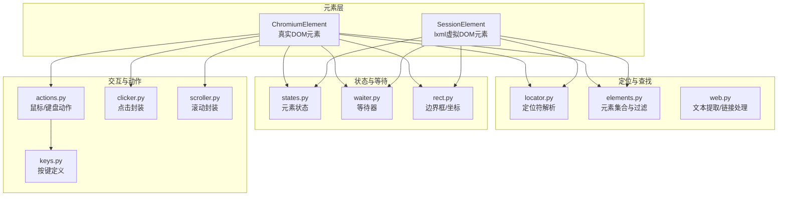
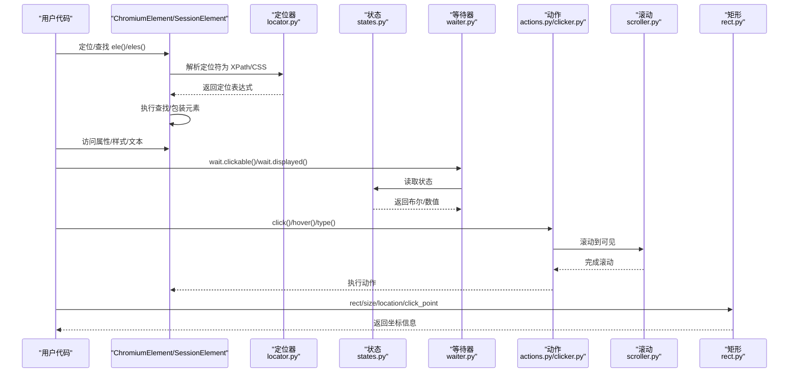
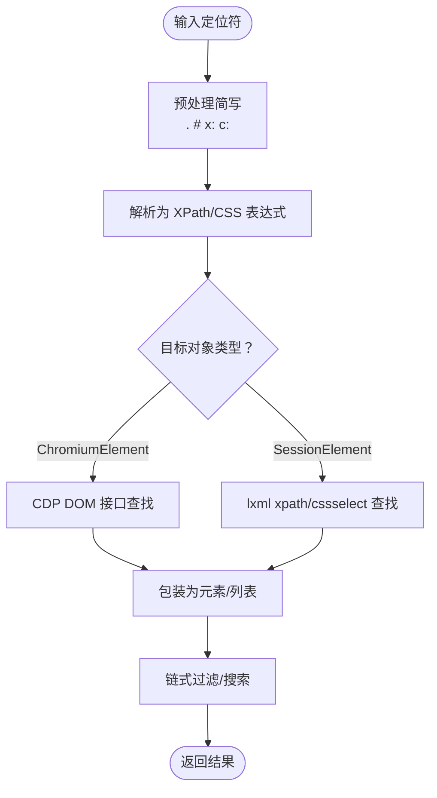
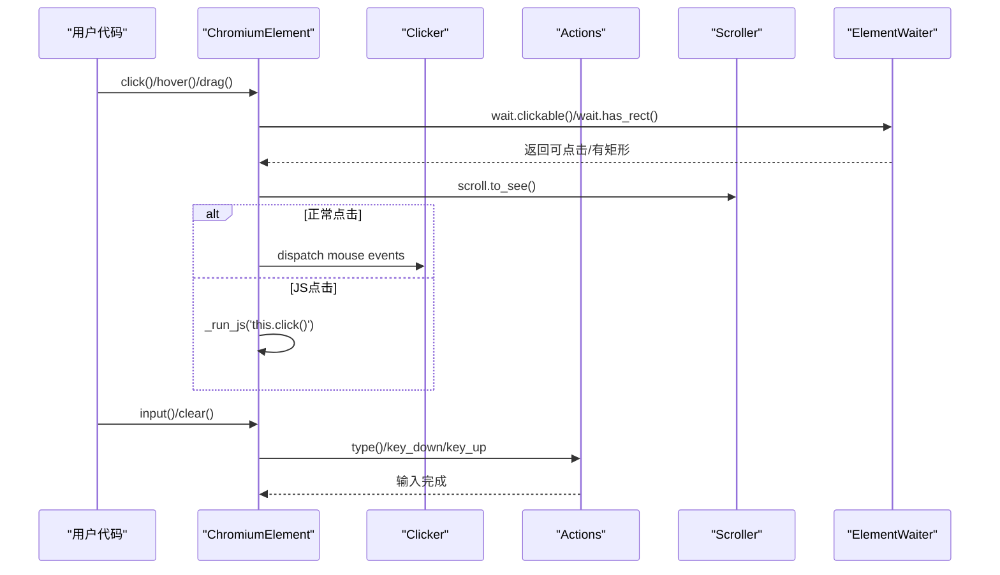
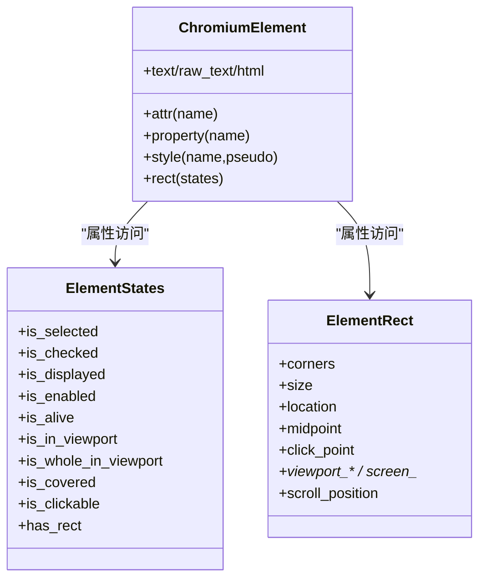
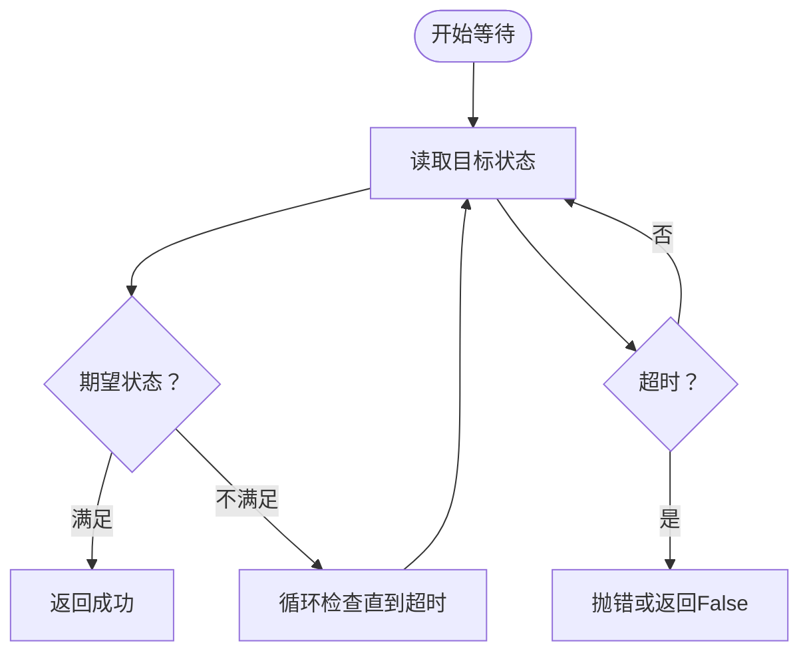
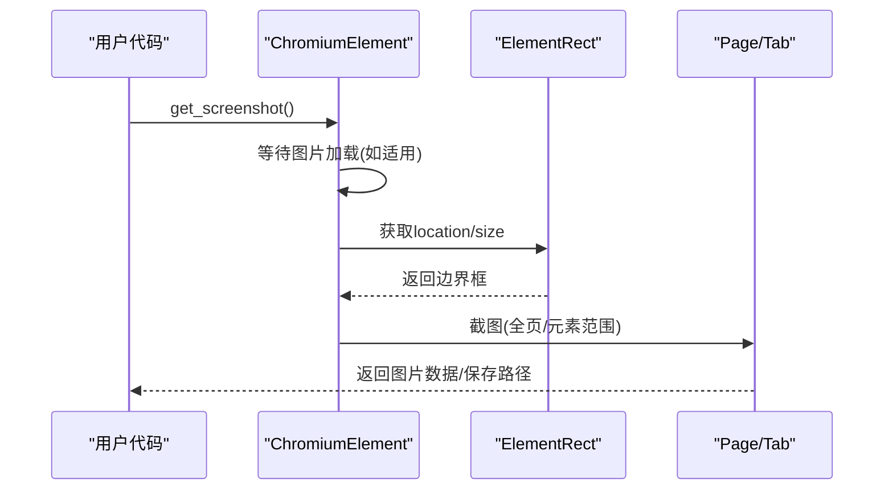
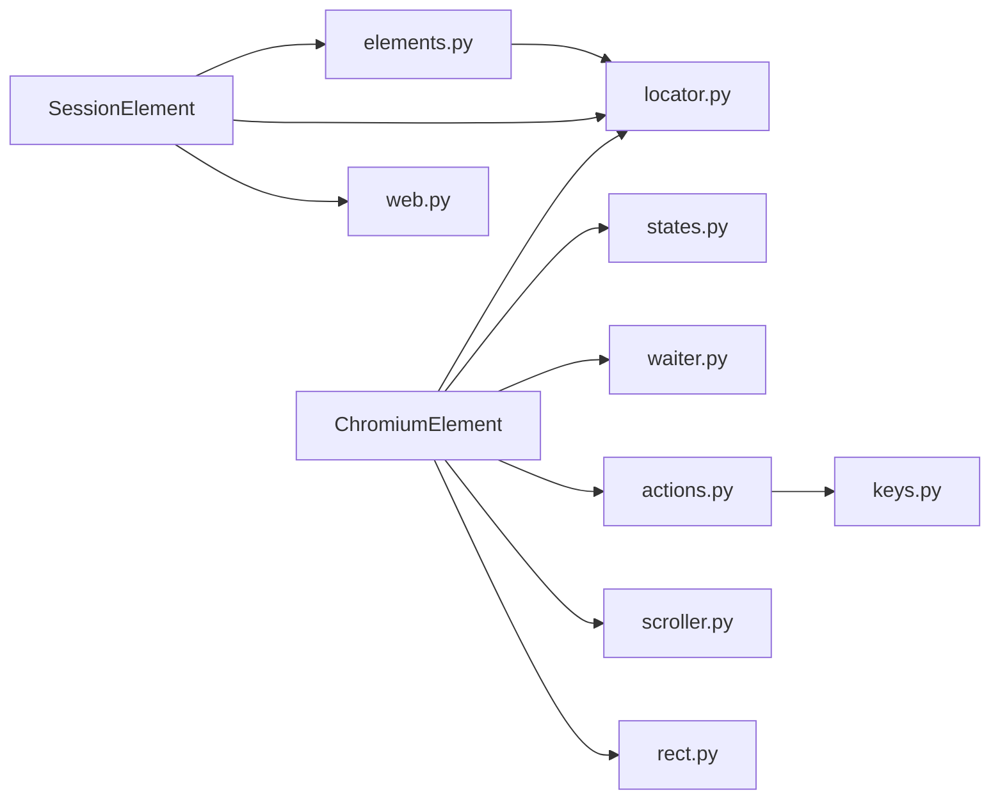

# 元素处理模块

<cite>
**本文引用的文件**
- [chromium_element.py](file://DrissionPage/_elements/chromium_element.py)
- [session_element.py](file://DrissionPage/_elements/session_element.py)
- [locator.py](file://DrissionPage/_functions/locator.py)
- [by.py](file://DrissionPage/_functions/by.py)
- [elements.py](file://DrissionPage/_functions/elements.py)
- [waiter.py](file://DrissionPage/_units/waiter.py)
- [states.py](file://DrissionPage/_units/states.py)
- [rect.py](file://DrissionPage/_units/rect.py)
- [actions.py](file://DrissionPage/_units/actions.py)
- [clicker.py](file://DrissionPage/_units/clicker.py)
- [scroller.py](file://DrissionPage/_units/scroller.py)
- [keys.py](file://DrissionPage/_functions/keys.py)
- [web.py](file://DrissionPage/_functions/web.py)
- [base.py](file://DrissionPage/_base/base.py)
</cite>

## 目录
1. [简介](#简介)
2. [项目结构](#项目结构)
3. [核心组件](#核心组件)
4. [架构总览](#架构总览)
5. [详细组件分析](#详细组件分析)
6. [依赖关系分析](#依赖关系分析)
7. [性能考虑](#性能考虑)
8. [故障排查指南](#故障排查指南)
9. [结论](#结论)

## 简介
本文件系统化梳理 DrissionPage 的元素处理能力，覆盖元素定位（ID、类名、标签名、XPath、CSS 选择器、无障碍 AX）、元素查找策略与性能优化、元素操作（点击、输入、拖拽、悬停）、属性与样式查询、状态判断、等待机制与超时处理、截图与边界框获取、以及复杂页面元素处理技巧与常见问题解决方案。文档面向不同技术背景读者，既提供代码级细节，也给出可视化图示帮助理解。

## 项目结构
DrissionPage 将“元素”抽象为两类：
- ChromiumElement：基于 CDP 的真实 DOM 元素，支持真实交互、等待、滚动、动作等。
- SessionElement：基于 lxml 的虚拟 DOM 元素，适合离线 HTML 解析与快速定位。

定位与查找逻辑集中在 locator、elements、web 等模块；状态、等待、矩形、动作、滚动等分别由 units 子模块提供。

图表来源
- [chromium_element.py:1-1439](file://DrissionPage/_elements/chromium_element.py#L1-L1439)
- [session_element.py:1-301](file://DrissionPage/_elements/session_element.py#L1-L301)
- [locator.py:1-579](file://DrissionPage/_functions/locator.py#L1-L579)
- [elements.py:1-461](file://DrissionPage/_functions/elements.py#L1-L461)
- [web.py:1-349](file://DrissionPage/_functions/web.py#L1-L349)
- [states.py:1-182](file://DrissionPage/_units/states.py#L1-L182)
- [waiter.py:1-433](file://DrissionPage/_units/waiter.py#L1-L433)
- [rect.py:1-217](file://DrissionPage/_units/rect.py#L1-L217)
- [actions.py:1-266](file://DrissionPage/_units/actions.py#L1-L266)
- [clicker.py:1-207](file://DrissionPage/_units/clicker.py#L1-L207)
- [scroller.py:1-142](file://DrissionPage/_units/scroller.py#L1-L142)
- [keys.py:1-451](file://DrissionPage/_functions/keys.py#L1-L451)

章节来源
- [chromium_element.py:1-1439](file://DrissionPage/_elements/chromium_element.py#L1-L1439)
- [session_element.py:1-301](file://DrissionPage/_elements/session_element.py#L1-L301)
- [locator.py:1-579](file://DrissionPage/_functions/locator.py#L1-L579)
- [elements.py:1-461](file://DrissionPage/_functions/elements.py#L1-L461)
- [web.py:1-349](file://DrissionPage/_functions/web.py#L1-L349)

## 核心组件
- 定位与查找
  - 定位符解析：支持 ID、类名、标签名、XPath、CSS、文本、AX 等多种语法，自动转换为 XPath/CSS。
  - 元素集合与过滤：提供链式过滤（按标签、文本、属性、状态）与批量查找。
- 状态与等待
  - 状态检测：可见性、启用/禁用、存活、覆盖、可点击、矩形存在等。
  - 等待机制：元素状态等待、页面加载、下载、弹窗等。
- 交互与动作
  - 鼠标动作：移动、点击、滚轮、拖拽。
  - 键盘输入：字符、组合键、特殊键。
  - 滚动：元素可见、居中、滚动到顶部/底部等。
- 辅助能力
  - 边界框与坐标：视口/页面/屏幕坐标、点击点、滚动位置。
  - 截图：元素范围截图、保存资源、图片等待加载。
  - 文本与链接：规范化文本、绝对链接拼接。

章节来源
- [locator.py:1-579](file://DrissionPage/_functions/locator.py#L1-L579)
- [elements.py:1-461](file://DrissionPage/_functions/elements.py#L1-L461)
- [states.py:1-182](file://DrissionPage/_units/states.py#L1-L182)
- [waiter.py:1-433](file://DrissionPage/_units/waiter.py#L1-L433)
- [actions.py:1-266](file://DrissionPage/_units/actions.py#L1-L266)
- [clicker.py:1-207](file://DrissionPage/_units/clicker.py#L1-L207)
- [scroller.py:1-142](file://DrissionPage/_units/scroller.py#L1-L142)
- [rect.py:1-217](file://DrissionPage/_units/rect.py#L1-L217)
- [web.py:1-349](file://DrissionPage/_functions/web.py#L1-L349)

## 架构总览
下图展示元素层与各功能模块之间的交互关系，体现“定位—查找—状态—等待—动作”的典型流程。

图表来源
- [chromium_element.py:1-1439](file://DrissionPage/_elements/chromium_element.py#L1-L1439)
- [session_element.py:1-301](file://DrissionPage/_elements/session_element.py#L1-L301)
- [locator.py:1-579](file://DrissionPage/_functions/locator.py#L1-L579)
- [states.py:1-182](file://DrissionPage/_units/states.py#L1-L182)
- [waiter.py:1-433](file://DrissionPage/_units/waiter.py#L1-L433)
- [actions.py:1-266](file://DrissionPage/_units/actions.py#L1-L266)
- [clicker.py:1-207](file://DrissionPage/_units/clicker.py#L1-L207)
- [scroller.py:1-142](file://DrissionPage/_units/scroller.py#L1-L142)
- [rect.py:1-217](file://DrissionPage/_units/rect.py#L1-L217)

## 详细组件分析

### 元素定位与查找策略
- 支持的定位语法
  - ID、类名、标签名、XPath、CSS、文本、AX（无障碍角色/名称）。
  - 自定义简写：例如 . 表示 class，# 表示 id，x:/c: 等。
  - 多属性与文本模糊匹配：支持 @@、@|、@! 等组合与前缀/后缀匹配。
- 定位符解析流程
  - 将字符串定位符预处理为标准形式，再生成 XPath 或 CSS 表达式。
  - 对于 CSS，可尝试转换为 XPath 以提升兼容性。
- 查找策略
  - ChromiumElement：通过 CDP DOM 接口查找，支持相对定位（父子兄弟）。
  - SessionElement：使用 lxml 的 xpath/cssselect 查找，支持绝对路径与相对路径。
  - 元素集合与过滤：提供链式过滤（按标签、文本、属性、状态），支持搜索多个条件。

图表来源
- [locator.py:147-395](file://DrissionPage/_functions/locator.py#L147-L395)
- [chromium_element.py:419-436](file://DrissionPage/_elements/chromium_element.py#L419-L436)
- [session_element.py:169-301](file://DrissionPage/_elements/session_element.py#L169-L301)
- [elements.py:16-62](file://DrissionPage/_functions/elements.py#L16-L62)

章节来源
- [locator.py:1-579](file://DrissionPage/_functions/locator.py#L1-L579)
- [by.py:1-19](file://DrissionPage/_functions/by.py#L1-L19)
- [chromium_element.py:419-436](file://DrissionPage/_elements/chromium_element.py#L419-L436)
- [session_element.py:169-301](file://DrissionPage/_elements/session_element.py#L169-L301)
- [elements.py:16-62](file://DrissionPage/_functions/elements.py#L16-L62)

### 元素操作：点击、输入、拖拽、悬停
- 点击
  - 支持左/右/中键，支持在偏移处点击、多击、下载/新标签打开等场景。
  - 自动等待元素可点击、停止移动，必要时使用 JS 点击。
- 输入
  - 支持聚焦、清空、模拟按键输入、组合键（Ctrl+C/V 等）。
  - 文件输入通过 CDP 设置文件路径。
- 拖拽与悬停
  - 提供拖拽到坐标或另一个元素，支持鼠标悬停。
- 动作封装
  - Actions 提供平滑移动轨迹、滚轮、按键、拖放等。
  - Clicker、Scroller、Rect 等子模块提供专用能力。

图表来源
- [clicker.py:23-116](file://DrissionPage/_units/clicker.py#L23-L116)
- [actions.py:25-126](file://DrissionPage/_units/actions.py#L25-L126)
- [chromium_element.py:547-595](file://DrissionPage/_elements/chromium_element.py#L547-L595)
- [waiter.py:289-409](file://DrissionPage/_units/waiter.py#L289-L409)

章节来源
- [clicker.py:1-207](file://DrissionPage/_units/clicker.py#L1-L207)
- [actions.py:1-266](file://DrissionPage/_units/actions.py#L1-L266)
- [chromium_element.py:547-616](file://DrissionPage/_elements/chromium_element.py#L547-L616)
- [waiter.py:289-409](file://DrissionPage/_units/waiter.py#L289-L409)

### 属性获取、样式查询与状态判断
- 属性与文本
  - attr()/property() 获取属性与 DOM 属性；text/raw_text 规范化文本。
  - href/src 绝对链接拼接，支持 data URI 与 blob 资源。
- 样式查询
  - style() 通过 window.getComputedStyle 获取样式值。
- 状态判断
  - states 提供 is_displayed/is_enabled/is_alive/is_clickable/is_covered 等。
  - rect 提供 corners/size/location/midpoint/click_point 等。

图表来源
- [states.py:12-73](file://DrissionPage/_units/states.py#L12-L73)
- [rect.py:10-107](file://DrissionPage/_units/rect.py#L10-L107)
- [chromium_element.py:372-441](file://DrissionPage/_elements/chromium_element.py#L372-L441)

章节来源
- [states.py:1-182](file://DrissionPage/_units/states.py#L1-L182)
- [rect.py:1-217](file://DrissionPage/_units/rect.py#L1-L217)
- [chromium_element.py:372-441](file://DrissionPage/_elements/chromium_element.py#L372-L441)

### 等待机制与超时处理
- 元素等待
  - displayed/hidden/clickable/covered/enabled/disabled/has_rect/stop_moving 等。
  - 支持等待移动结束、等待删除、等待元素出现/消失。
- 页面与浏览器等待
  - 页面加载开始/完成、URL/标题变化、下载开始/完成、新标签页等。
- 超时控制
  - 默认超时来自 owner.timeout，可按需传入；失败时可抛出异常或返回 False。

图表来源
- [waiter.py:289-409](file://DrissionPage/_units/waiter.py#L289-L409)
- [states.py:12-73](file://DrissionPage/_units/states.py#L12-L73)

章节来源
- [waiter.py:1-433](file://DrissionPage/_units/waiter.py#L1-L433)
- [states.py:1-182](file://DrissionPage/_units/states.py#L1-L182)

### 截图、高亮与边界框
- 截图
  - get_screenshot() 按元素边界框截图，支持保存为文件或返回字节/Base64。
  - src()/save() 支持图片资源等待加载、data URI/blob 转换。
- 边界框
  - rect 提供视口/页面/屏幕坐标、尺寸、点击点、滚动位置等。
- 高亮
  - 可结合截图与边界框在视觉上标注元素区域（概念性说明，非具体实现）。

图表来源
- [chromium_element.py:527-546](file://DrissionPage/_elements/chromium_element.py#L527-L546)
- [rect.py:10-107](file://DrissionPage/_units/rect.py#L10-L107)

章节来源
- [chromium_element.py:527-546](file://DrissionPage/_elements/chromium_element.py#L527-L546)
- [rect.py:1-217](file://DrissionPage/_units/rect.py#L1-L217)

### 复杂页面元素处理技巧
- 影子 DOM
  - 支持 ShadowRoot 访问与相对定位（仅限部分 CSS 语法限制）。
- iframe/frame
  - 通过 get_frame() 获取帧元素，支持在帧内定位与切换。
- 文本与链接
  - 使用 web.get_ele_txt() 规范化文本；make_absolute_link() 绝对化链接。
- 多条件筛选
  - 使用 elements.Filter/FilterOne 链式筛选（标签、文本、属性、状态）。

章节来源
- [chromium_element.py:686-800](file://DrissionPage/_elements/chromium_element.py#L686-L800)
- [elements.py:163-260](file://DrissionPage/_functions/elements.py#L163-L260)
- [web.py:20-104](file://DrissionPage/_functions/web.py#L20-L104)

## 依赖关系分析
- 组件耦合
  - ChromiumElement/SessionElement 依赖定位器、状态、等待、动作、滚动、矩形等模块。
  - 元素集合与过滤依赖定位器与状态模块。
- 外部依赖
  - CDP（Chrome DevTools Protocol）用于真实 DOM 交互。
  - lxml 用于离线 HTML 解析。
  - requests/DrissionGet 用于下载与网络请求。

图表来源
- [chromium_element.py:1-1439](file://DrissionPage/_elements/chromium_element.py#L1-L1439)
- [session_element.py:1-301](file://DrissionPage/_elements/session_element.py#L1-L301)
- [elements.py:1-461](file://DrissionPage/_functions/elements.py#L1-L461)
- [locator.py:1-579](file://DrissionPage/_functions/locator.py#L1-L579)
- [states.py:1-182](file://DrissionPage/_units/states.py#L1-L182)
- [waiter.py:1-433](file://DrissionPage/_units/waiter.py#L1-L433)
- [actions.py:1-266](file://DrissionPage/_units/actions.py#L1-L266)
- [scroller.py:1-142](file://DrissionPage/_units/scroller.py#L1-L142)
- [rect.py:1-217](file://DrissionPage/_units/rect.py#L1-L217)
- [keys.py:1-451](file://DrissionPage/_functions/keys.py#L1-L451)
- [web.py:1-349](file://DrissionPage/_functions/web.py#L1-L349)

章节来源
- [base.py:1-434](file://DrissionPage/_base/base.py#L1-L434)

## 性能考虑
- 定位策略
  - 优先使用 ID、类名、标签名等局部定位，减少 XPath/CSS 的复杂度。
  - 对 CSS 选择器可尝试转换为 XPath，提高稳定性。
- 查找与等待
  - 合理设置 timeout，避免过长等待；对已知存在元素可设置 timeout=0 快速返回。
  - 使用链式过滤减少后续遍历成本。
- 交互与滚动
  - 先 scroll.to_see 再动作，减少无效点击与滚动。
  - 避免频繁触发布局抖动，尽量批量操作。
- 资源获取
  - 图片/资源等待加载时采用短间隔轮询，避免阻塞主线程。
  - data URI/blob 资源优先使用 base64 解码，减少额外请求。

[本节为通用建议，无需特定文件引用]

## 故障排查指南
- 定位错误
  - 检查定位符是否符合规范；确认是否使用了不支持的 CSS 语法（如 ShadowRoot 中的相对 CSS）。
  - 使用 get_loc() 验证定位符转换结果。
- 元素不可见/不可点击
  - 使用 wait.clickable()/wait.displayed() 等等待；必要时 scroll.to_see()。
  - 检查 is_covered/is_in_viewport 等状态。
- 超时与异常
  - 设置 raise_when_wait_failed 控制等待失败时抛错；合理设置 timeout。
  - 对下载/新标签等场景，使用对应等待器（如 download_begin、new_tab）。
- 资源加载
  - 图片资源可能为 data URI 或 blob，src() 会自动处理；若失败，检查 base64 编解码与 blob 获取。

章节来源
- [locator.py:96-116](file://DrissionPage/_functions/locator.py#L96-L116)
- [waiter.py:289-409](file://DrissionPage/_units/waiter.py#L289-L409)
- [chromium_element.py:442-501](file://DrissionPage/_elements/chromium_element.py#L442-L501)

## 结论
DrissionPage 的元素处理模块以“真实 DOM + lxml 虚拟 DOM”双轨并行，结合完善的定位、状态、等待、动作与辅助工具，形成一套高效稳定的元素处理体系。通过合理的定位策略、等待机制与交互封装，能够应对复杂页面的元素操作需求。建议在实际使用中优先采用局部定位、链式过滤与等待策略，以获得更佳的性能与稳定性。