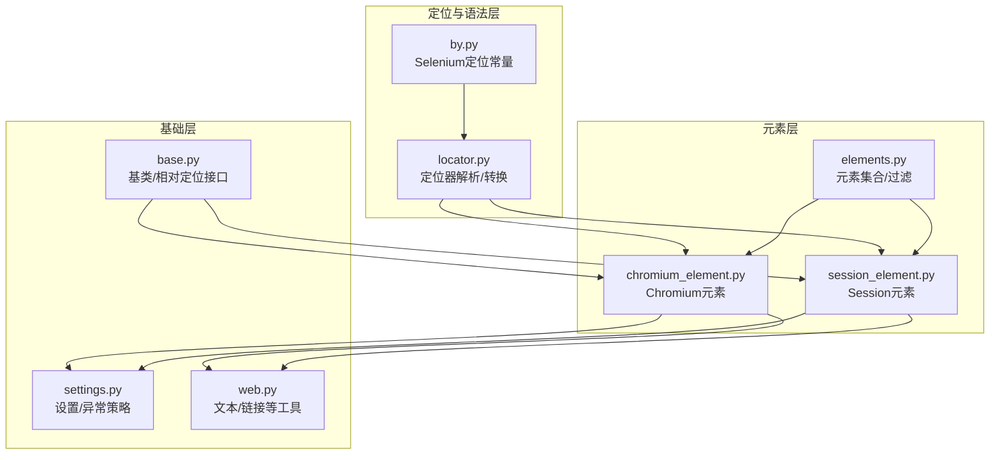
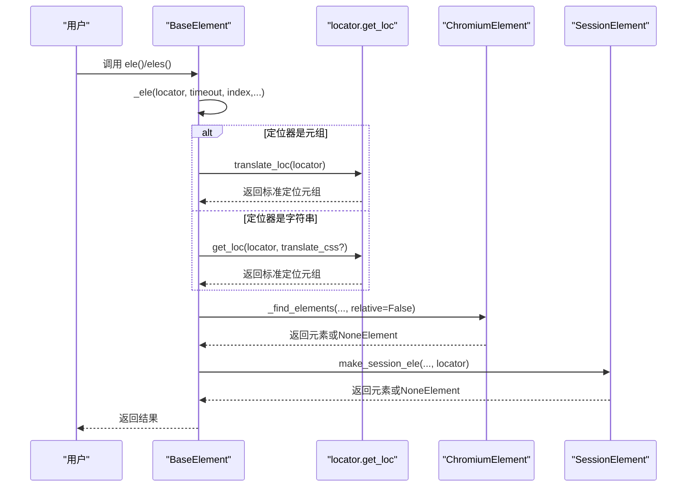
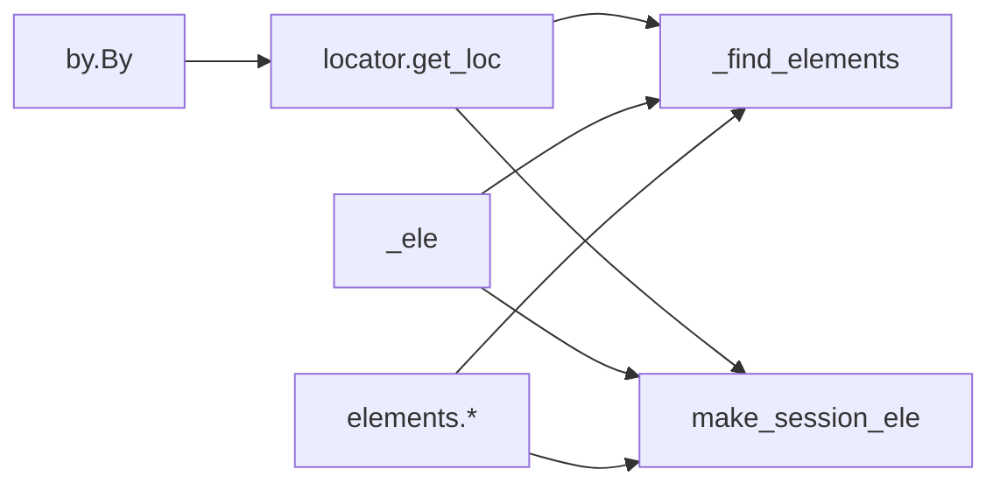

# 元素定位

<cite>
**本文引用的文件**
- [locator.py](file://DrissionPage/_functions/locator.py)
- [by.py](file://DrissionPage/_functions/by.py)
- [elements.py](file://DrissionPage/_functions/elements.py)
- [chromium_element.py](file://DrissionPage/_elements/chromium_element.py)
- [session_element.py](file://DrissionPage/_elements/session_element.py)
- [base.py](file://DrissionPage/_base/base.py)
- [settings.py](file://DrissionPage/_functions/settings.py)
- [web.py](file://DrissionPage/_functions/web.py)
</cite>

## 目录
1. [简介](#简介)
2. [项目结构](#项目结构)
3. [核心组件](#核心组件)
4. [架构总览](#架构总览)
5. [详细组件分析](#详细组件分析)
6. [依赖分析](#依赖分析)
7. [性能考量](#性能考量)
8. [故障排查指南](#故障排查指南)
9. [结论](#结论)
10. [附录](#附录)

## 简介
本章节系统性阐述 DrissionPage 的元素定位机制，覆盖多种定位策略（ID、类名、标签名、XPath、CSS 选择器、文本匹配等）、定位器语法与参数、相对/绝对定位差异、查找优先级与性能优化、复杂页面定位技巧与最佳实践，以及定位失败的常见原因与解决方案。文档同时给出与源码映射的架构图与流程图，帮助读者从高层到代码层面全面理解定位体系。

## 项目结构
围绕“元素定位”的关键模块分布如下：
- 定位语法与转换：locator.py
- Selenium 风格定位常量：by.py
- 元素集合与过滤：elements.py
- Chromium 元素实现：chromium_element.py
- Session 元素实现：session_element.py
- 基类与通用定位接口：base.py
- 设置项与语言资源：settings.py
- 文本提取与辅助工具：web.py

图表来源
- [locator.py:15-579](file://DrissionPage/_functions/locator.py#L15-L579)
- [by.py:10-19](file://DrissionPage/_functions/by.py#L10-L19)
- [elements.py:276-461](file://DrissionPage/_functions/elements.py#L276-L461)
- [chromium_element.py:419-436](file://DrissionPage/_elements/chromium_element.py#L419-L436)
- [session_element.py:169-301](file://DrissionPage/_elements/session_element.py#L169-L301)
- [base.py:39-68](file://DrissionPage/_base/base.py#L39-L68)
- [settings.py:13-69](file://DrissionPage/_functions/settings.py#L13-L69)
- [web.py:20-104](file://DrissionPage/_functions/web.py#L20-L104)

章节来源
- [locator.py:15-579](file://DrissionPage/_functions/locator.py#L15-L579)
- [by.py:10-19](file://DrissionPage/_functions/by.py#L10-L19)
- [elements.py:276-461](file://DrissionPage/_functions/elements.py#L276-L461)
- [chromium_element.py:419-436](file://DrissionPage/_elements/chromium_element.py#L419-L436)
- [session_element.py:169-301](file://DrissionPage/_elements/session_element.py#L169-L301)
- [base.py:39-68](file://DrissionPage/_base/base.py#L39-L68)
- [settings.py:13-69](file://DrissionPage/_functions/settings.py#L13-L69)
- [web.py:20-104](file://DrissionPage/_functions/web.py#L20-L104)

## 核心组件
- 定位器解析与转换：支持字符串定位器预处理、多/单属性组合、文本匹配、AX 格式、CSS 与 XPath 的互转。
- 元素集合与过滤：提供链式过滤（按标签、文本、属性、状态等）与批量查找。
- Chromium 与 Session 元素：分别面向真实浏览器 DOM 与 lxml 解析树，提供统一的定位接口。
- 基类与相对定位：提供 parent/child/prev/next/after/before 等相对定位能力，并限制 CSS 在相对定位中的使用。
- 设置与异常策略：控制找不到元素时的行为、超时、语言等。

章节来源
- [locator.py:96-116](file://DrissionPage/_functions/locator.py#L96-L116)
- [elements.py:276-303](file://DrissionPage/_functions/elements.py#L276-L303)
- [chromium_element.py:419-436](file://DrissionPage/_elements/chromium_element.py#L419-L436)
- [session_element.py:169-301](file://DrissionPage/_elements/session_element.py#L169-L301)
- [base.py:146-244](file://DrissionPage/_base/base.py#L146-L244)
- [settings.py:13-69](file://DrissionPage/_functions/settings.py#L13-L69)

## 架构总览
DrissionPage 的定位体系以“定位器解析”为核心，将用户输入的字符串或元组定位器标准化为 XPath 或 CSS 选择器，再交由具体元素实现（Chromium 或 Session）执行查找。相对定位通过 XPath 的轴表达式实现，且在相对定位中禁止使用 CSS 选择器。

图表来源
- [base.py:81-94](file://DrissionPage/_base/base.py#L81-L94)
- [locator.py:96-116](file://DrissionPage/_functions/locator.py#L96-L116)
- [chromium_element.py:434-436](file://DrissionPage/_elements/chromium_element.py#L434-L436)
- [session_element.py:169-301](file://DrissionPage/_elements/session_element.py#L169-L301)

## 详细组件分析

### 定位器语法与参数
- 字符串定位器支持的前缀与简写：
  - ID：以 # 开头，支持 #=、#:、#$、#^ 等匹配方式；也可用 .id= 简写。
  - 类名：以 . 开头，支持 .=、.:、.$、.# 等匹配方式；也可用 .class= 简写。
  - 标签名：t: 或 tag: 前缀；也可用 .tag= 简写。
  - 文本匹配：text=、text:、text^、text$；tx:、tx=、tx^、tx$ 简写。
  - XPath：xpath: 或 x: 前缀。
  - CSS：css: 或 c: 前缀。
  - AX：ax:role=...、ax:name=... 等。
- 多属性与逻辑组合：
  - @@ 表示 AND 组合，@| 表示 OR 组合，@! 表示否定某个属性条件。
  - 支持在标签名后直接拼接属性，如 tag:div@id=xxx@class=yyy。
- 文本匹配策略：
  - text= 精确匹配
  - text: 模糊包含
  - text^ 开头匹配
  - text$ 结尾匹配
  - 默认模糊匹配
- 特殊处理：
  - 预处理阶段将 .、#、t:、tx:、c:、x: 等简写展开为标准形式。
  - CSS 转 XPath 时，若 CSS 无法转换则回退为 XPath。

章节来源
- [locator.py:15-51](file://DrissionPage/_functions/locator.py#L15-L51)
- [locator.py:85-88](file://DrissionPage/_functions/locator.py#L85-L88)
- [locator.py:147-195](file://DrissionPage/_functions/locator.py#L147-L195)
- [locator.py:198-235](file://DrissionPage/_functions/locator.py#L198-L235)
- [locator.py:552-579](file://DrissionPage/_functions/locator.py#L552-L579)

### Selenium 风格定位
- 支持元组定位器：(By.XPATH, "...")、(By.CSS_SELECTOR, "...")、(By.ID, "...") 等。
- translate_loc 将 Selenium 风格定位器转换为 XPath/CSS 形式。
- translate_css_loc 提供从 Selenium CSS 到 CSS/XPath 的转换。

章节来源
- [by.py:10-19](file://DrissionPage/_functions/by.py#L10-L19)
- [locator.py:468-503](file://DrissionPage/_functions/locator.py#L468-L503)
- [locator.py:506-543](file://DrissionPage/_functions/locator.py#L506-L543)

### 相对定位与绝对定位
- 绝对定位：以根节点为起点的定位，通常使用 XPath 的绝对路径或以 “//” 开头的相对路径。
- 相对定位：基于当前元素的上下文，使用 XPath 轴表达式（如 ancestor、following、preceding、self 等），在相对定位中禁止使用 CSS 选择器。
- 实现要点：
  - parent/child/prev/next/after/before 等方法内部将定位器转换为 XPath 并限定在相对上下文中。
  - 当传入 CSS 选择器给相对定位时会抛出错误。

章节来源
- [base.py:146-244](file://DrissionPage/_base/base.py#L146-L244)
- [chromium_element.py:703-756](file://DrissionPage/_elements/chromium_element.py#L703-L756)
- [chromium_element.py:758-800](file://DrissionPage/_elements/chromium_element.py#L758-L800)
- [session_element.py:169-301](file://DrissionPage/_elements/session_element.py#L169-L301)

### 元素查找优先级与性能优化
- 查找优先级：
  - get_eles 支持多定位器并行尝试，any_one 为真时遇到第一个成功即返回。
  - timeout 控制整体等待时间，内部循环以固定步长轮询。
- 性能优化建议：
  - 优先使用精确的 XPath 或 CSS 选择器，避免模糊匹配。
  - 使用标签限定与属性组合减少候选集。
  - 对于复杂页面，先定位父容器，再在相对上下文中查找子元素。
  - 避免在相对定位中使用 CSS，确保使用 XPath。

章节来源
- [elements.py:276-303](file://DrissionPage/_functions/elements.py#L276-L303)
- [base.py:39-51](file://DrissionPage/_base/base.py#L39-L51)

### 元素集合与过滤
- 提供链式过滤器：
  - 标签过滤：tag(name, equal=True/False)
  - 文本过滤：text(text, fuzzy=True/False, contain=True/False)
  - 属性过滤：attr(name, value, equal=True/False)
  - 状态过滤（Chromium）：displayed/checked/selected/enabled/clickable/have_rect/style/property 等
- 批量查找与单个查找：
  - index=None 返回所有匹配元素；index=1 返回首个匹配元素。
- 搜索函数：
  - search/search_one 支持或关系筛选多个条件。

章节来源
- [elements.py:64-128](file://DrissionPage/_functions/elements.py#L64-L128)
- [elements.py:130-161](file://DrissionPage/_functions/elements.py#L130-L161)
- [elements.py:163-260](file://DrissionPage/_functions/elements.py#L163-L260)
- [elements.py:386-461](file://DrissionPage/_functions/elements.py#L386-L461)

### 文本匹配与路径生成
- 文本提取：get_ele_txt 依据标签规则与空白折叠策略生成规范化文本。
- 路径生成：css_selector/xpath 属性基于 DOM 路径生成，便于调试与复现。

章节来源
- [web.py:20-104](file://DrissionPage/_functions/web.py#L20-L104)
- [chromium_element.py:640-677](file://DrissionPage/_elements/chromium_element.py#L640-L677)
- [session_element.py:152-167](file://DrissionPage/_elements/session_element.py#L152-L167)

### 相对定位实现细节
- east/south/west/north：基于元素矩形边界，沿方向扫描，支持像素偏移与定位器约束。
- offset：在指定坐标点查找元素，支持定位器约束与超时重试。
- _get_relative_eles：沿指定方向逐步移动，命中满足条件的元素并返回第 index 个。

章节来源
- [chromium_element.py:249-371](file://DrissionPage/_elements/chromium_element.py#L249-L371)

## 依赖分析
- 定位器解析依赖：
  - locator.get_loc/translate_loc 将字符串或元组定位器标准化为 XPath/CSS。
  - _preprocess 将简写展开为标准形式。
- 元素实现依赖：
  - ChromiumElement/SessionElement 基于定位器执行查找，并返回 NoneElement 作为占位。
- 基类依赖：
  - BaseElement._ele 统一入口，负责超时、异常策略与返回值封装。
- 过滤与集合：
  - elements.py 提供过滤器与批量查找，内部调用 _find_elements。

图表来源
- [locator.py:96-116](file://DrissionPage/_functions/locator.py#L96-L116)
- [by.py:10-19](file://DrissionPage/_functions/by.py#L10-L19)
- [base.py:81-94](file://DrissionPage/_base/base.py#L81-L94)
- [elements.py:276-303](file://DrissionPage/_functions/elements.py#L276-L303)

章节来源
- [locator.py:96-116](file://DrissionPage/_functions/locator.py#L96-L116)
- [by.py:10-19](file://DrissionPage/_functions/by.py#L10-L19)
- [base.py:81-94](file://DrissionPage/_base/base.py#L81-L94)
- [elements.py:276-303](file://DrissionPage/_functions/elements.py#L276-L303)

## 性能考量
- 定位器选择：
  - 精确选择器优先，避免通配符与模糊匹配。
  - 使用标签限定与属性组合缩小范围。
- 相对定位：
  - 在已知父容器的前提下，使用相对定位减少全局扫描。
  - 避免在相对定位中使用 CSS，确保使用 XPath。
- 超时与轮询：
  - 合理设置 timeout，避免过长等待。
  - any_one 与 first_ele 参数可减少不必要的遍历。
- 文本与路径：
  - 文本提取与路径生成仅在需要时调用，避免重复计算。

[本节为通用指导，无需特定文件来源]

## 故障排查指南
- 常见错误与原因：
  - 定位器格式错误：非字符串/元组或不支持的前缀。
  - CSS 在相对定位中使用：会触发“不支持的 CSS 语法”错误。
  - 定位器冲突：同时出现 @@ 与 @| 会导致冲突。
  - 无效表达式：XPath/CSS 表达式非法。
  - 元素未找到：根据设置 raise_when_ele_not_found 决定抛出异常还是返回 NoneElement。
- 解决方案：
  - 使用 get_loc/translate_loc 标准化定位器。
  - 在相对定位中改用 XPath 轴表达式。
  - 简化定位器，先精后模糊。
  - 使用过滤器进一步缩小范围。
  - 检查页面是否动态加载，适当增加超时或等待元素状态。

章节来源
- [locator.py:96-116](file://DrissionPage/_functions/locator.py#L96-L116)
- [base.py:89-94](file://DrissionPage/_base/base.py#L89-L94)
- [chromium_element.py:746-756](file://DrissionPage/_elements/chromium_element.py#L746-L756)
- [session_element.py:260-300](file://DrissionPage/_elements/session_element.py#L260-L300)

## 结论
DrissionPage 的元素定位体系以灵活的字符串定位器与标准的 Selenium 风格定位器为基础，结合 Chromium 与 Session 两种实现，提供了强大的绝对与相对定位能力。通过合理的定位器设计、过滤器链与超时策略，可在复杂页面中高效稳定地定位元素。遵循本文提供的语法规范、优先级与优化建议，可显著提升定位成功率与稳定性。

[本节为总结，无需特定文件来源]

## 附录

### 定位器语法速查
- ID：#id、#id=、#id:、#id^、#id$
- 类名：.class、.class=、.class:、.class^、.class$
- 标签名：t:tag、tag:tag、tag=tag、tag^tag、tag$tag
- 文本：text=、text:、text^、text$；tx:、tx=、tx^、tx$
- XPath：xpath:、x:
- CSS：css:、c:
- AX：ax:role=...、ax:name=...

章节来源
- [locator.py:85-88](file://DrissionPage/_functions/locator.py#L85-L88)
- [locator.py:147-195](file://DrissionPage/_functions/locator.py#L147-L195)
- [locator.py:198-235](file://DrissionPage/_functions/locator.py#L198-L235)
- [locator.py:118-144](file://DrissionPage/_functions/locator.py#L118-L144)