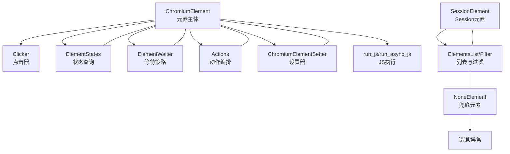
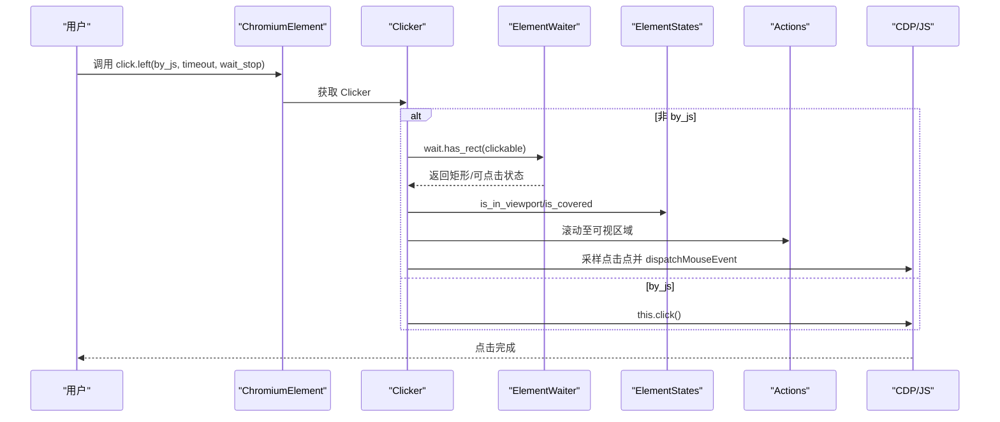
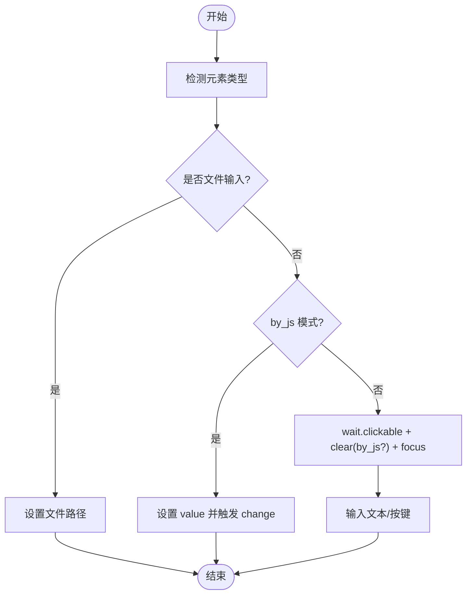
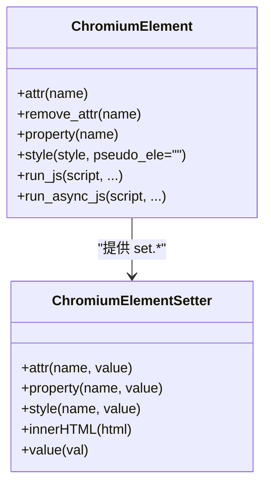
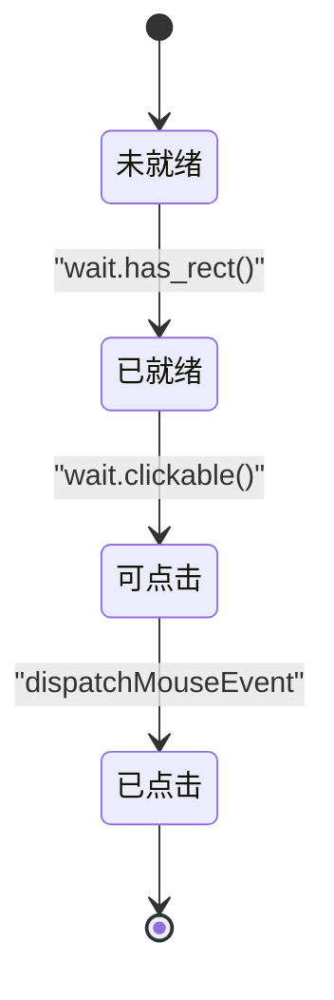
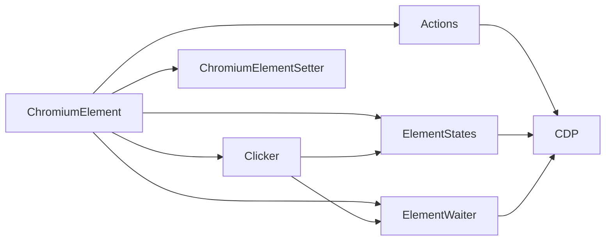

# 元素操作

<cite>
**本文引用的文件**
- [chromium_element.py](file://DrissionPage/_elements/chromium_element.py)
- [session_element.py](file://DrissionPage/_elements/session_element.py)
- [none_element.py](file://DrissionPage/_elements/none_element.py)
- [actions.py](file://DrissionPage/_units/actions.py)
- [clicker.py](file://DrissionPage/_units/clicker.py)
- [setter.py](file://DrissionPage/_units/setter.py)
- [states.py](file://DrissionPage/_units/states.py)
- [waiter.py](file://DrissionPage/_units/waiter.py)
- [elements.py](file://DrissionPage/_functions/elements.py)
- [base.py](file://DrissionPage/_base/base.py)
- [errors.py](file://DrissionPage/errors.py)
</cite>

## 目录
1. [简介](#简介)
2. [项目结构与角色定位](#项目结构与角色定位)
3. [核心组件总览](#核心组件总览)
4. [架构概览](#架构概览)
5. [详细组件解析](#详细组件解析)
6. [依赖关系分析](#依赖关系分析)
7. [性能与稳定性考量](#性能与稳定性考量)
8. [故障排查与错误处理](#故障排查与错误处理)
9. [结论](#结论)
10. [附录：操作清单与最佳实践](#附录操作清单与最佳实践)

## 简介
本文系统梳理 DrissionPage 中“元素”的各类操作能力，覆盖点击、悬停、拖拽、输入、清空、聚焦、属性与样式设置、运行 JS 等，并结合状态检查、等待策略、错误处理与重试机制，给出复杂交互场景下的组合技巧与实操建议。内容基于源码分析，力求准确、可操作且易于理解。

## 项目结构与角色定位
- 元素层：
  - ChromiumElement：面向 Chromium 浏览器的元素封装，提供点击、输入、属性/样式、JS 执行等能力。
  - SessionElement：面向 Session 模式的元素封装，基于 lxml 解析 HTML，适合静态页面或离线场景。
  - NoneElement：占位/兜底元素，当定位不到目标时返回，支持可配置的异常策略与默认值返回。
- 交互层：
  - Actions：统一的鼠标/键盘/拖拽输入动作，负责坐标计算与 CDP 调用。
  - Clicker：元素级点击器，封装可点击性判断、坐标采样、异常处理与等待策略。
- 设置与状态：
  - ChromiumElementSetter：元素属性/样式/innerHTML/value 的设置入口。
  - ElementStates：元素状态查询（可见、启用、可点击、覆盖等）。
  - ElementWaiter：元素状态等待（显示/隐藏/可点击/停止移动等）。
- 列表与过滤：
  - ElementsList 与 Filter：批量筛选、获取属性/文本/链接等，支持链式过滤。
- 基类与通用逻辑：
  - BaseElement/BaseParser：统一的元素定位与相对导航接口。
- 错误体系：
  - errors：统一的异常类型定义，便于捕获与区分。

**章节来源**
- [chromium_element.py:1-1439](file://DrissionPage/_elements/chromium_element.py#L1-L1439)
- [session_element.py:1-301](file://DrissionPage/_elements/session_element.py#L1-L301)
- [none_element.py:1-53](file://DrissionPage/_elements/none_element.py#L1-L53)
- [actions.py:1-266](file://DrissionPage/_units/actions.py#L1-L266)
- [clicker.py:1-207](file://DrissionPage/_units/clicker.py#L1-L207)
- [setter.py:471-500](file://DrissionPage/_units/setter.py#L471-L500)
- [states.py:12-73](file://DrissionPage/_units/states.py#L12-L73)
- [waiter.py:289-409](file://DrissionPage/_units/waiter.py#L289-L409)
- [elements.py:16-461](file://DrissionPage/_functions/elements.py#L16-L461)
- [base.py:70-267](file://DrissionPage/_base/base.py#L70-L267)
- [errors.py:11-95](file://DrissionPage/errors.py#L11-L95)

## 核心组件总览
- 点击操作
  - 属性访问：ChromiumElement.click 返回 Clicker；支持 left/right/middle/at/multi 等。
  - 可点击性：Clicker 内部通过 wait.clickable、states.is_*、rect 采样与 viewport 判断，必要时回退到 by_js。
- 悬停与拖拽
  - hover：通过 Actions.move_to 实现。
  - drag/drag_to：通过 Actions.hold + move_to + release 组合实现。
- 输入与清空
  - input：支持 by_js、clear 参数；内部先 focus，再输入文本或按键序列。
  - clear：支持 by_js 或模拟 Ctrl+A+DEL；对 macOS 默认 by_js。
  - focus：优先 DOM.focus，失败则回退到 JS focus。
- 属性与样式
  - attr/remove_attr：读取/移除属性；特殊字段 href/src 会做绝对链接转换。
  - property/style：通过 JS 访问 DOM 属性与样式。
  - set.attr/set.property/set.style：通过 CDP 或 JS 设置元素属性/样式/innerHTML/value。
- 高级操作
  - run_js/run_async_js：同步/异步执行 JS，支持超时控制。
- 状态检查与等待
  - states.*：可见、启用、可点击、覆盖、矩形存在等。
  - wait.*：显示/隐藏/可点击/停止移动/删除等等待。
- 列表与过滤
  - SessionElementsList/ChromiumElementsList：批量获取与链式过滤。
- 错误与兜底
  - NoneElement：定位失败时的统一兜底，可抛错或返回默认值。
  - errors：统一异常类型，便于上层策略化处理。

**章节来源**
- [chromium_element.py:547-616](file://DrissionPage/_elements/chromium_element.py#L547-L616)
- [chromium_element.py:372-411](file://DrissionPage/_elements/chromium_element.py#L372-L411)
- [chromium_element.py:410-418](file://DrissionPage/_elements/chromium_element.py#L410-L418)
- [clicker.py:26-94](file://DrissionPage/_units/clicker.py#L26-L94)
- [actions.py:25-146](file://DrissionPage/_units/actions.py#L25-L146)
- [setter.py:475-499](file://DrissionPage/_units/setter.py#L475-L499)
- [states.py:12-73](file://DrissionPage/_units/states.py#L12-L73)
- [waiter.py:289-409](file://DrissionPage/_units/waiter.py#L289-L409)
- [elements.py:16-461](file://DrissionPage/_functions/elements.py#L16-L461)
- [none_element.py:12-53](file://DrissionPage/_elements/none_element.py#L12-L53)

## 架构概览
下图展示元素操作的关键调用链路与模块关系。

**图表来源**
- [chromium_element.py:38-174](file://DrissionPage/_elements/chromium_element.py#L38-L174)
- [clicker.py:19-207](file://DrissionPage/_units/clicker.py#L19-L207)
- [states.py:12-73](file://DrissionPage/_units/states.py#L12-L73)
- [waiter.py:289-409](file://DrissionPage/_units/waiter.py#L289-L409)
- [actions.py:16-266](file://DrissionPage/_units/actions.py#L16-L266)
- [setter.py:471-500](file://DrissionPage/_units/setter.py#L471-L500)
- [session_element.py:23-167](file://DrissionPage/_elements/session_element.py#L23-L167)
- [elements.py:16-461](file://DrissionPage/_functions/elements.py#L16-L461)
- [none_element.py:12-53](file://DrissionPage/_elements/none_element.py#L12-L53)

## 详细组件解析

### 点击操作（click、hover、drag、drag_to）
- 点击（left）
  - 通过 ChromiumElement.click 属性返回 Clicker，再调用 left。
  - 行为要点：
    - 对 option 元素：自动委托给父 select 的选择器处理。
    - 非 by_js 模式：
      - 先等待 has_rect 与 clickable，滚动至可视区域，必要时回退到 by_js。
      - 在元素区域内随机采样点击点，若无法确认命中则回退到中心点。
    - by_js 模式：直接执行 this.click()。
  - 异常处理：当 raise_when_click_failed 开启且不可点击时抛出 CanNotClickError。
- 右键与中键
  - right/middle：分别在可视区域点击右键或中键，中键可选打开新标签页并返回。
- 精确定点
  - at(offset_x, offset_y, button, count)：在元素基础上偏移后点击，支持多击。
- 拖拽
  - hover：通过 Actions.move_to 将指针移动到元素或坐标。
  - drag(offset_x, offset_y, duration)：以元素中心为起点，按偏移拖拽。
  - drag_to(ele_or_loc, duration)：拖拽到目标元素或坐标，内部使用 hold -> move_to -> release。
- 注意事项
  - 点击前建议先 wait.clickable 并确保 is_in_viewport。
  - 对于被遮挡元素，优先使用 hover 或调整滚动，避免 pointer-events:none 导致点击无效。

**图表来源**
- [chromium_element.py:164-174](file://DrissionPage/_elements/chromium_element.py#L164-L174)
- [clicker.py:26-94](file://DrissionPage/_units/clicker.py#L26-L94)
- [waiter.py:344-353](file://DrissionPage/_units/waiter.py#L344-L353)
- [states.py:42-65](file://DrissionPage/_units/states.py#L42-L65)
- [actions.py:25-63](file://DrissionPage/_units/actions.py#L25-L63)

**章节来源**
- [chromium_element.py:597-616](file://DrissionPage/_elements/chromium_element.py#L597-L616)
- [chromium_element.py:164-174](file://DrissionPage/_elements/chromium_element.py#L164-L174)
- [clicker.py:26-94](file://DrissionPage/_units/clicker.py#L26-L94)
- [actions.py:25-146](file://DrissionPage/_units/actions.py#L25-L146)

### 输入与清空（input、clear、focus）
- input(vals, clear=False, by_js=False)
  - 文件输入：input[type=file] 特殊处理，走 setFileInputFiles。
  - by_js 模式：直接设置 value 并触发 change 事件。
  - 正常模式：
    - 先 wait.clickable(timeout=0.5)，必要时先 clear。
    - 通过 owner.actions.type 或 input_text_or_keys 输入文本/按键。
- clear(by_js=False)
  - by_js：直接清空 value 并触发 change。
  - 非 by_js：focus 后模拟 Ctrl+A+DEL。
  - macOS 默认 by_js。
- focus()
  - 优先 DOM.focus，失败回退 JS focus。

**图表来源**
- [chromium_element.py:547-582](file://DrissionPage/_elements/chromium_element.py#L547-L582)
- [chromium_element.py:584-595](file://DrissionPage/_elements/chromium_element.py#L584-L595)

**章节来源**
- [chromium_element.py:547-595](file://DrissionPage/_elements/chromium_element.py#L547-L595)

### 属性与样式（attr、remove_attr、property、style）
- attr(name)
  - 支持 href/src/text/innerText/html/outerHTML/innerHTML 等特殊字段的转换与拼接。
  - 其他属性返回 DOM attributes。
- remove_attr(name)
  - 通过 JS this.removeAttribute 删除属性。
- property(name)
  - 通过 JS this.name 读取 DOM 属性，必要时格式化 HTML。
- style(style, pseudo_ele='')
  - 通过 window.getComputedStyle 获取指定样式，支持伪元素参数。
- 设置器（set.attr/property/style/innerHTML/value）
  - set.attr：通过 DOM.setAttributeValue 设置属性。
  - set.property：通过 JS this.name="value" 设置属性。
  - set.style：通过 this.style.name="value" 设置样式，异常时抛出错误。
  - set.innerHTML/value：便捷设置 innerHTML 与 value。

**图表来源**
- [chromium_element.py:372-441](file://DrissionPage/_elements/chromium_element.py#L372-L441)
- [setter.py:475-499](file://DrissionPage/_units/setter.py#L475-L499)

**章节来源**
- [chromium_element.py:372-441](file://DrissionPage/_elements/chromium_element.py#L372-L441)
- [setter.py:475-499](file://DrissionPage/_units/setter.py#L475-L499)

### 高级操作（run_js、run_async_js）
- run_js(script, *args, as_expr=False, timeout=None)
  - 在元素上下文中执行 JS，支持 as_expr 与自定义超时。
- run_async_js(script, *args, as_expr=False)
  - 异步执行 JS，不阻塞主线程。

**章节来源**
- [chromium_element.py:410-418](file://DrissionPage/_elements/chromium_element.py#L410-L418)

### 状态检查与等待（states、wait）
- states.*
  - is_selected/is_checked/is_displayed/is_enabled/is_alive/is_in_viewport/is_whole_in_viewport/is_covered/is_clickable/has_rect
- wait.*
  - displayed/hidden/deleted/covered/not_covered/enabled/disabled/disabled_or_deleted/clickable/has_rect/stop_moving

**图表来源**
- [states.py:12-73](file://DrissionPage/_units/states.py#L12-L73)
- [waiter.py:289-409](file://DrissionPage/_units/waiter.py#L289-L409)

**章节来源**
- [states.py:12-73](file://DrissionPage/_units/states.py#L12-L73)
- [waiter.py:289-409](file://DrissionPage/_units/waiter.py#L289-L409)

### 列表与过滤（ElementsList/Filter）
- SessionElementsList/ChromiumElementsList：支持切片、迭代、链式 get/filter/filter_one/search/search_one。
- FilterOne/Filter：按 tag/text/attr/style/property/state 等条件筛选，支持模糊/包含/相等比较。

**章节来源**
- [elements.py:16-461](file://DrissionPage/_functions/elements.py#L16-L461)

### 兜底与异常（NoneElement、errors）
- NoneElement：定位失败时返回，可配置抛错或返回默认值/False。
- errors：统一异常类型，便于上层策略化处理（如重试、降级）。

**章节来源**
- [none_element.py:12-53](file://DrissionPage/_elements/none_element.py#L12-L53)
- [errors.py:11-95](file://DrissionPage/errors.py#L11-L95)

## 依赖关系分析
- 组件耦合
  - ChromiumElement 依赖 Clicker、Actions、ElementStates、ElementWaiter、ChromiumElementSetter、ChromiumElementRect 等。
  - Clicker 依赖 wait.clickable、states.*、rect、CDP Input.dispatchMouseEvent。
  - Actions 依赖 Keys、location_in_viewport、CDP Input.dispatchKeyEvent/DispatchMouseEvent/DragEvent。
  - ElementWaiter 依赖 states.* 与 CDP 查询。
- 外部依赖
  - CDP（Chrome DevTools Protocol）：DOM、Input、Page、Network、Storage 等。
  - lxml：SessionElement 的 HTML 解析与定位。
- 循环依赖
  - 未发现循环导入；各模块职责清晰，通过属性延迟实例化降低耦合。

**图表来源**
- [chromium_element.py:38-174](file://DrissionPage/_elements/chromium_element.py#L38-L174)
- [clicker.py:19-207](file://DrissionPage/_units/clicker.py#L19-L207)
- [actions.py:16-266](file://DrissionPage/_units/actions.py#L16-L266)
- [states.py:12-73](file://DrissionPage/_units/states.py#L12-L73)
- [waiter.py:289-409](file://DrissionPage/_units/waiter.py#L289-L409)

**章节来源**
- [chromium_element.py:38-174](file://DrissionPage/_elements/chromium_element.py#L38-L174)
- [clicker.py:19-207](file://DrissionPage/_units/clicker.py#L19-L207)
- [actions.py:16-266](file://DrissionPage/_units/actions.py#L16-L266)
- [states.py:12-73](file://DrissionPage/_units/states.py#L12-L73)
- [waiter.py:289-409](file://DrissionPage/_units/waiter.py#L289-L409)

## 性能与稳定性考量
- 点击采样与坐标计算
  - Clicker 在元素区域内多次随机采样，提高命中率；必要时回退到中心点或 by_js。
- 等待策略
  - wait.clickable 会等待元素稳定（stop_moving），减少误判。
  - wait.has_rect 与 states.has_rect 提前规避无矩形元素的点击失败。
- 输入与清空
  - input 前先 wait.clickable，避免在禁用/隐藏状态下输入。
  - clear by_js 更稳定，尤其在 macOS 上。
- JS 执行
  - run_js 支持超时控制；run_async_js 不阻塞主线程，适合长任务。
- 列表与过滤
  - ElementsList/Filter 支持链式筛选，减少重复遍历。

[本节为通用指导，无需特定文件引用]

## 故障排查与错误处理
- 常见异常
  - ElementNotFoundError：定位不到元素时抛出或返回 NoneElement，取决于配置。
  - CanNotClickError：点击失败且开启 raise_when_click_failed。
  - NoRectError：元素无矩形信息。
  - WaitTimeoutError：等待超时。
  - JavaScriptError：JS 设置样式/属性失败。
- 重试与降级
  - 页面/元素级别可通过设置 retry_times/retry_interval 控制重试策略。
  - 点击失败可回退到 by_js；输入失败可切换 clear/by_js。
- 建议流程
  - 定位元素 -> wait.clickable -> hover/scroll -> 点击 -> 验证状态 -> 失败重试/降级。

**章节来源**
- [none_element.py:12-53](file://DrissionPage/_elements/none_element.py#L12-L53)
- [errors.py:11-95](file://DrissionPage/errors.py#L11-L95)
- [clicker.py:88-94](file://DrissionPage/_units/clicker.py#L88-L94)
- [waiter.py:344-353](file://DrissionPage/_units/waiter.py#L344-L353)

## 结论
DrissionPage 的元素操作围绕“状态驱动 + 动作编排 + 错误兜底”构建，既保证了高成功率，又提供了丰富的等待与重试策略。通过合理组合 wait.*、states.*、Clicker/Actions 与 set.*，可在复杂交互场景中实现稳健的自动化。

[本节为总结，无需特定文件引用]

## 附录：操作清单与最佳实践
- 点击
  - 优先：wait.clickable + hover + click.left；失败回退 by_js。
  - 右键/中键：click.right/click.middle；中键可打开新标签并返回。
  - 精确定点：click.at(offset_x, offset_y)。
- 悬停与拖拽
  - hover：hover(offset_x, offset_y)。
  - drag/drag_to：drag(offset_x, offset_y, duration)、drag_to(ele_or_loc, duration)。
- 输入与清空
  - input(vals, clear=False, by_js=False)；clear(by_js=False)；focus()。
- 属性与样式
  - attr/remove_attr/property/style；set.attr/property/style/innerHTML/value。
- 高级操作
  - run_js/run_async_js；结合 wait.* 与 states.* 进行状态校验。
- 最佳实践
  - 先 wait.has_rect 再 wait.clickable；对被遮挡元素先 hover/scroll。
  - 输入前先 focus/clear；macOS 下优先 by_js 清空。
  - 大量元素操作时使用 ElementsList/Filter 链式筛选，减少重复遍历。
  - 对关键步骤增加异常捕获与重试，必要时降级为 by_js。

[本节为实践指南，无需特定文件引用]