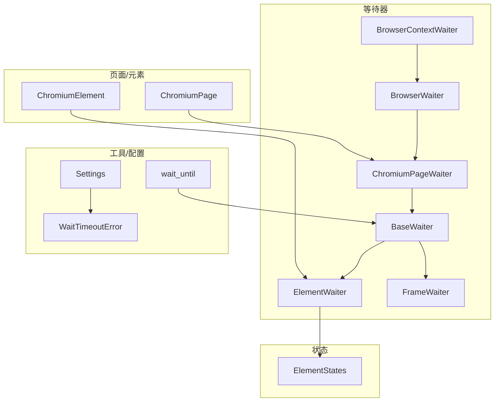
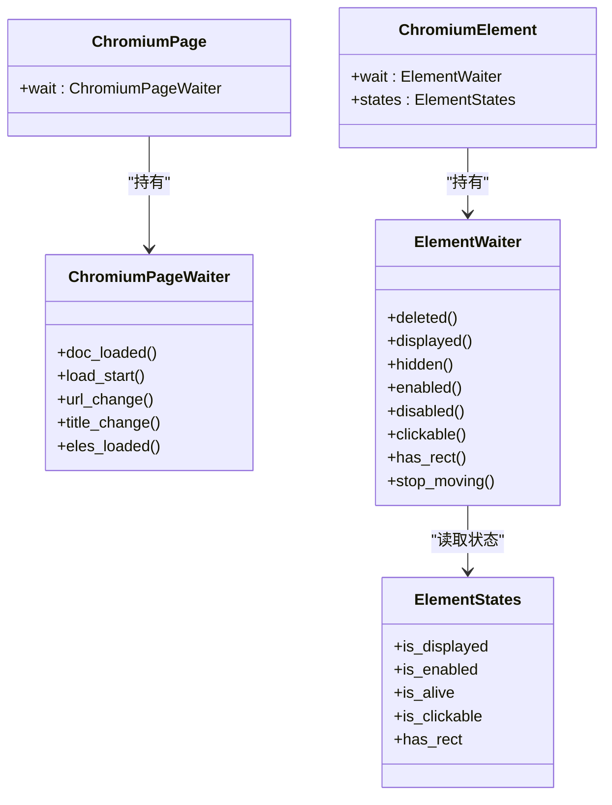
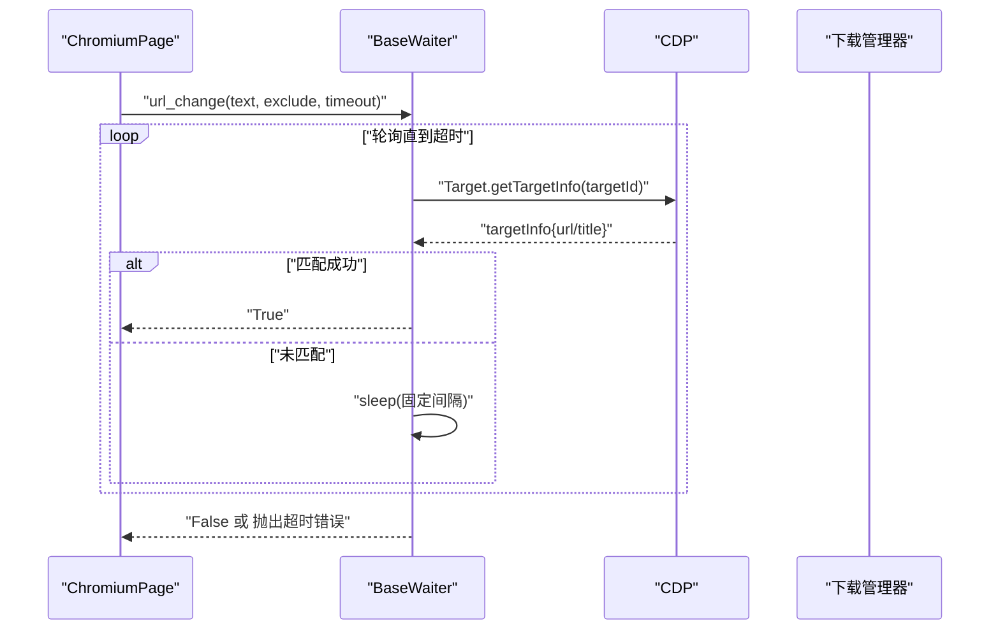
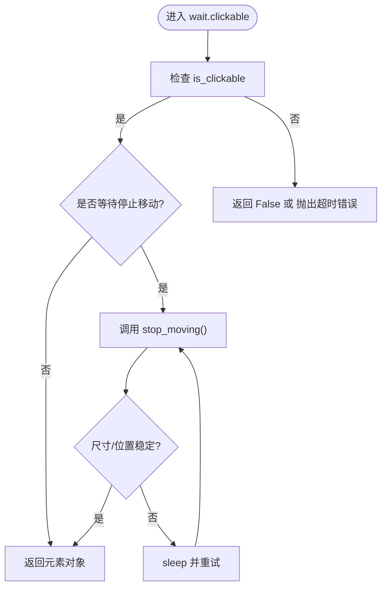
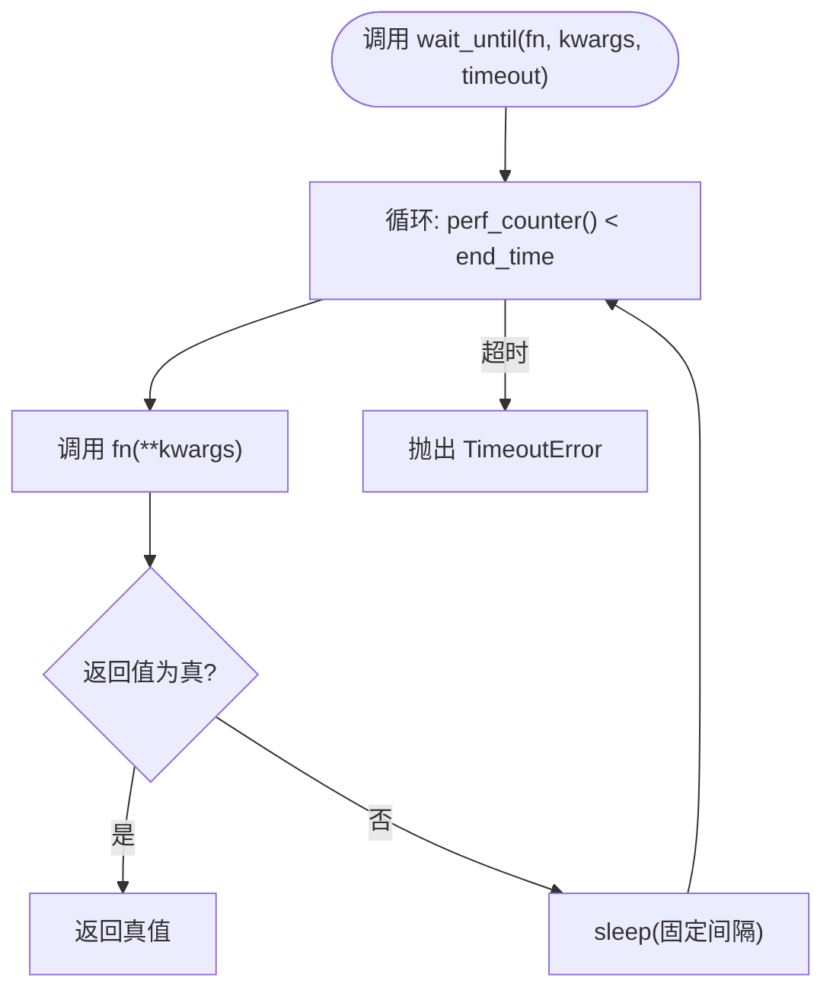
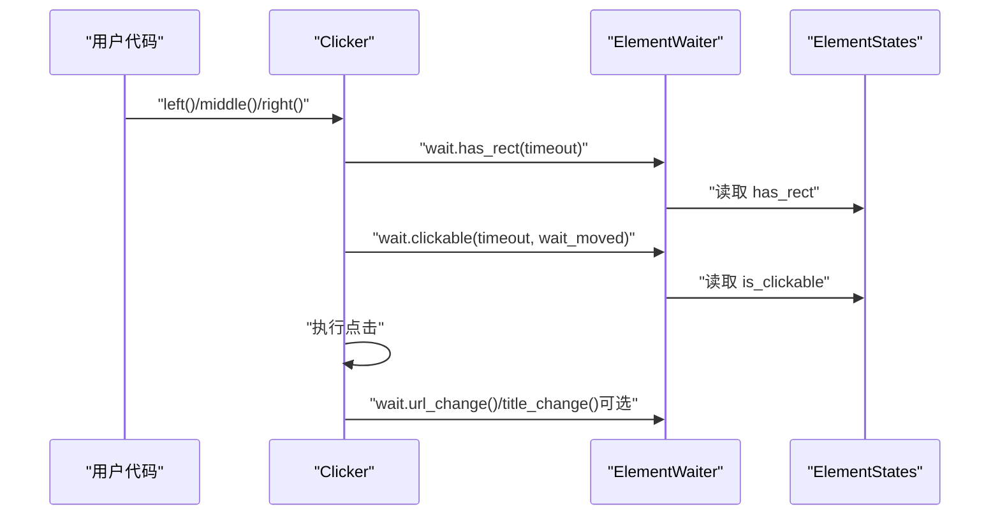
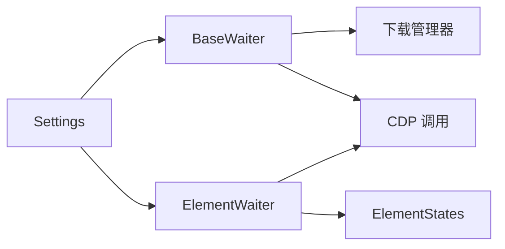

# 元素等待机制

<cite>
**本文引用的文件**
- [waiter.py](file://DrissionPage/_units/waiter.py)
- [chromium_element.py](file://DrissionPage/_elements/chromium_element.py)
- [chromium_page.py](file://DrissionPage/_pages/chromium_page.py)
- [chromium_base.py](file://DrissionPage/_pages/chromium_base.py)
- [states.py](file://DrissionPage/_units/states.py)
- [settings.py](file://DrissionPage/_functions/settings.py)
- [errors.py](file://DrissionPage/errors.py)
- [tools.py](file://DrissionPage/_functions/tools.py)
- [clicker.py](file://DrissionPage/_units/clicker.py)
</cite>

## 目录
1. [简介](#简介)
2. [项目结构](#项目结构)
3. [核心组件](#核心组件)
4. [架构总览](#架构总览)
5. [详细组件分析](#详细组件分析)
6. [依赖分析](#依赖分析)
7. [性能考量](#性能考量)
8. [故障排查指南](#故障排查指南)
9. [结论](#结论)
10. [附录](#附录)

## 简介
本章节系统梳理 DrissionPage 的元素等待机制设计与实现，覆盖以下方面：
- 等待策略：可点击等待（wait.clickable）、可见性等待（wait.displayed/hidden）、存在性等待（wait.eles_loaded）、文本变化等待（wait.url_change/title_change）、属性变化等待（wait._change）等
- 超时设置与重试：基于超时阈值与循环检测，结合 Settings 控制失败行为
- 条件等待与自定义条件：通过状态属性与轮询逻辑实现通用等待框架
- 性能优化与最佳实践：检测频率、超时策略、避免无效轮询
- 错误处理与调试：统一的超时错误类型与调试提示

## 项目结构
围绕等待机制的关键模块与职责如下：
- 等待器与等待入口
  - 页面级等待器：ChromiumPageWaiter、BaseWaiter、BrowserWaiter、BrowserContextWaiter
  - 元素级等待器：ElementWaiter、FrameWaiter
- 状态与属性
  - ElementStates 提供 is_displayed/is_enabled/is_alive/is_clickable 等布尔状态
- 页面与元素
  - ChromiumPage 暴露 wait 属性；ChromiumElement 在首次访问时创建 ElementWaiter
- 工具与配置
  - Settings 控制等待失败时是否抛错
  - wait_until 提供通用条件等待工具
  - errors 定义 WaitTimeoutError 等错误类型

**图表来源**
- [chromium_page.py:52-55](file://DrissionPage/_pages/chromium_page.py#L52-L55)
- [chromium_element.py:170-173](file://DrissionPage/_elements/chromium_element.py#L170-L173)
- [waiter.py:28-433](file://DrissionPage/_units/waiter.py#L28-L433)
- [states.py:12-74](file://DrissionPage/_units/states.py#L12-L74)
- [settings.py:13-69](file://DrissionPage/_functions/settings.py#L13-L69)
- [errors.py:69-70](file://DrissionPage/errors.py#L69-L70)
- [tools.py:139-148](file://DrissionPage/_functions/tools.py#L139-L148)

**章节来源**
- [chromium_page.py:52-55](file://DrissionPage/_pages/chromium_page.py#L52-L55)
- [chromium_element.py:170-173](file://DrissionPage/_elements/chromium_element.py#L170-L173)
- [waiter.py:28-433](file://DrissionPage/_units/waiter.py#L28-L433)
- [states.py:12-74](file://DrissionPage/_units/states.py#L12-L74)
- [settings.py:13-69](file://DrissionPage/_functions/settings.py#L13-L69)
- [errors.py:69-70](file://DrissionPage/errors.py#L69-L70)
- [tools.py:139-148](file://DrissionPage/_functions/tools.py#L139-L148)

## 核心组件
- 页面等待器（BaseWaiter/ChromiumPageWaiter/BrowserWaiter/BrowserContextWaiter）
  - 提供元素可见/隐藏、元素集合加载、文档加载状态、URL/Title 变化、下载开始/完成、新标签页等等待能力
- 元素等待器（ElementWaiter）
  - 基于 ElementStates 的布尔状态进行轮询等待，支持删除、显示、隐藏、覆盖、启用/禁用、可点击、矩形存在、停止移动等
- 状态系统（ElementStates）
  - 将 DOM/CSS/JS 属性映射为布尔状态，如 is_displayed、is_enabled、is_alive、is_clickable、has_rect 等
- 配置与错误
  - Settings.raise_when_wait_failed 控制等待失败是否抛错
  - WaitTimeoutError 统一错误类型

**章节来源**
- [waiter.py:85-234](file://DrissionPage/_units/waiter.py#L85-L234)
- [waiter.py:29-83](file://DrissionPage/_units/waiter.py#L29-L83)
- [waiter.py:289-409](file://DrissionPage/_units/waiter.py#L289-L409)
- [states.py:12-74](file://DrissionPage/_units/states.py#L12-L74)
- [settings.py:13-69](file://DrissionPage/_functions/settings.py#L13-L69)
- [errors.py:69-70](file://DrissionPage/errors.py#L69-L70)

## 架构总览
等待机制采用“等待器 + 状态”的分层设计：
- 等待器负责控制超时、循环检测与错误策略
- 状态系统负责将底层 DOM/CSS/JS 查询转化为布尔状态
- 页面/元素对象通过 wait 属性暴露等待接口

**图表来源**
- [chromium_page.py:52-55](file://DrissionPage/_pages/chromium_page.py#L52-L55)
- [chromium_element.py:170-173](file://DrissionPage/_elements/chromium_element.py#L170-L173)
- [waiter.py:289-409](file://DrissionPage/_units/waiter.py#L289-L409)
- [states.py:12-74](file://DrissionPage/_units/states.py#L12-L74)

## 详细组件分析

### 页面等待策略
- 文档加载开始/完成
  - load_start/doc_loaded：基于页面 states.is_loading 切换等待
- URL/Title 变化
  - url_change/title_change：轮询 CDP Target.getTargetInfo 获取当前 URL/Title，匹配包含/排除规则
- 元素集合存在性
  - eles_loaded：通过 DOM.performSearch 执行查询，逐个检查结果节点有效性，支持 any_one 语义
- 下载任务
  - download_begin/downloads_done：通过下载管理器标志位轮询，支持取消未完成任务
- 新标签页
  - new_tab：轮询最新标签页变化，支持超时与错误策略

**图表来源**
- [waiter.py:186-219](file://DrissionPage/_units/waiter.py#L186-L219)
- [chromium_base.py:457-458](file://DrissionPage/_pages/chromium_base.py#L457-L458)

**章节来源**
- [waiter.py:164-234](file://DrissionPage/_units/waiter.py#L164-L234)
- [waiter.py:186-219](file://DrissionPage/_units/waiter.py#L186-L219)
- [chromium_base.py:430-442](file://DrissionPage/_pages/chromium_base.py#L430-L442)

### 元素等待策略
- 删除/显示/隐藏
  - deleted/displayed/hidden：基于 is_alive/is_displayed 状态轮询
- 覆盖/非覆盖
  - covered/not_covered：通过 DOM.getNodeForLocation 判断点击点对应节点是否为目标元素
- 启用/禁用
  - enabled/disabled：基于 disabled 属性判断
- 可点击
  - clickable：要求 has_rect、is_enabled、is_displayed 且 pointer-events 不为 none，并可选等待停止移动
- 矩形存在
  - has_rect：尝试获取元素矩形，失败则 NoRectError
- 停止移动
  - stop_moving：比较连续两次的尺寸与位置，若一致则认为稳定

**图表来源**
- [waiter.py:344-353](file://DrissionPage/_units/waiter.py#L344-L353)
- [waiter.py:360-388](file://DrissionPage/_units/waiter.py#L360-L388)

**章节来源**
- [waiter.py:289-409](file://DrissionPage/_units/waiter.py#L289-L409)
- [states.py:12-74](file://DrissionPage/_units/states.py#L12-L74)

### 条件等待与自定义等待
- 通用条件等待
  - wait_until：接收函数与超时，循环调用函数直到返回真值或超时
- 页面/元素等待的内部实现
  - 大多数等待通过 _wait_state 或 while 循环 + perf_counter() 实现，结合 Settings.raise_when_wait_failed 控制失败行为

**图表来源**
- [tools.py:139-148](file://DrissionPage/_functions/tools.py#L139-L148)
- [errors.py:94-95](file://DrissionPage/errors.py#L94-L95)

**章节来源**
- [tools.py:139-148](file://DrissionPage/_functions/tools.py#L139-L148)
- [settings.py:35-38](file://DrissionPage/_functions/settings.py#L35-L38)

### 超时设置与重试机制
- 超时来源
  - 页面/元素默认超时来自 owner.timeout 或元素 timeout
  - 明确传参可覆盖默认值
- 重试策略
  - 多数等待采用固定间隔 sleep 进行轮询，部分场景（如下载）支持取消未完成任务
- 失败行为
  - Settings.raise_when_wait_failed 为 True 时，等待失败抛出 WaitTimeoutError；否则返回 False

**章节来源**
- [waiter.py:85-113](file://DrissionPage/_units/waiter.py#L85-L113)
- [waiter.py:390-408](file://DrissionPage/_units/waiter.py#L390-L408)
- [settings.py:35-38](file://DrissionPage/_functions/settings.py#L35-L38)
- [errors.py:69-70](file://DrissionPage/errors.py#L69-L70)

### 与点击流程的集成
- 点击前等待
  - 点击器在点击前会等待元素 has_rect 与 clickable，并在必要时等待停止移动
- 新标签页与 URL/Title 变化
  - 点击后可通过 wait.url_change/title_change 等等待导航或弹窗关闭

**图表来源**
- [clicker.py:50-93](file://DrissionPage/_units/clicker.py#L50-L93)
- [waiter.py:344-353](file://DrissionPage/_units/waiter.py#L344-L353)
- [states.py:12-74](file://DrissionPage/_units/states.py#L12-L74)

**章节来源**
- [clicker.py:50-93](file://DrissionPage/_units/clicker.py#L50-L93)
- [chromium_element.py:559-572](file://DrissionPage/_elements/chromium_element.py#L559-L572)

## 依赖分析
- 组件耦合
  - ElementWaiter 强依赖 ElementStates 的布尔状态
  - 页面等待器依赖 CDP 查询与下载管理器
- 外部依赖
  - CDP 协议调用（Target.getTargetInfo、DOM.performSearch 等）
  - 时间控制 perf_counter/sleep
- 潜在风险
  - 长时间轮询可能带来 CPU 占用，需合理设置超时与间隔

**图表来源**
- [waiter.py:85-234](file://DrissionPage/_units/waiter.py#L85-L234)
- [states.py:12-74](file://DrissionPage/_units/states.py#L12-L74)
- [settings.py:13-69](file://DrissionPage/_functions/settings.py#L13-L69)

**章节来源**
- [waiter.py:85-234](file://DrissionPage/_units/waiter.py#L85-L234)
- [states.py:12-74](file://DrissionPage/_units/states.py#L12-L74)
- [settings.py:13-69](file://DrissionPage/_functions/settings.py#L13-L69)

## 性能考量
- 检测频率
  - 多数等待使用较小 sleep 间隔，建议在高并发或长任务中适当增大间隔以降低 CPU 占用
- 超时策略
  - 对于复杂页面，优先设置合理的 timeout，避免无限等待
- 避免无效轮询
  - 在已知元素不存在时尽早返回，减少不必要的 CDP 调用
- 最佳实践
  - 使用 wait.eles_loaded 批量等待多个元素，减少多次查询
  - 对频繁点击的元素，先 wait.clickable 再执行动作

[本节为通用指导，无需特定文件引用]

## 故障排查指南
- 等待失败
  - 检查 Settings.raise_when_wait_failed 是否开启，以便快速定位问题
  - 使用 wait_until 自定义条件进行断点式调试
- 常见错误
  - WaitTimeoutError：确认超时是否过短，或等待条件是否合理
  - NoRectError：元素尚未渲染或不可见，先等待 has_rect 或 displayed
- 调试技巧
  - 在关键等待点打印当前状态（如 is_displayed/is_enabled/is_alive）
  - 使用最小化示例复现问题，逐步缩小定位范围

**章节来源**
- [errors.py:69-70](file://DrissionPage/errors.py#L69-L70)
- [settings.py:35-38](file://DrissionPage/_functions/settings.py#L35-L38)
- [tools.py:139-148](file://DrissionPage/_functions/tools.py#L139-L148)

## 结论
DrissionPage 的等待机制以“等待器 + 状态”为核心，通过 CDP 与状态布尔值实现高可靠、可扩展的等待体系。页面与元素层面均提供丰富的等待策略，配合 Settings 与统一错误类型，既满足简单场景，也能应对复杂页面加载与交互。

[本节为总结，无需特定文件引用]

## 附录
- 关键 API 路径参考
  - 页面等待：[waiter.py:85-234](file://DrissionPage/_units/waiter.py#L85-L234)
  - 元素等待：[waiter.py:289-409](file://DrissionPage/_units/waiter.py#L289-L409)
  - 状态属性：[states.py:12-74](file://DrissionPage/_units/states.py#L12-L74)
  - 页面 wait 属性：[chromium_page.py:52-55](file://DrissionPage/_pages/chromium_page.py#L52-L55)
  - 元素 wait 属性：[chromium_element.py:170-173](file://DrissionPage/_elements/chromium_element.py#L170-L173)
  - 通用等待工具：[tools.py:139-148](file://DrissionPage/_functions/tools.py#L139-L148)
  - 点击前等待示例：[chromium_element.py:559-572](file://DrissionPage/_elements/chromium_element.py#L559-L572)

[本节为补充信息，无需特定文件引用]