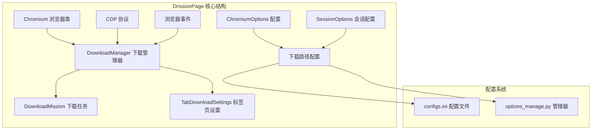
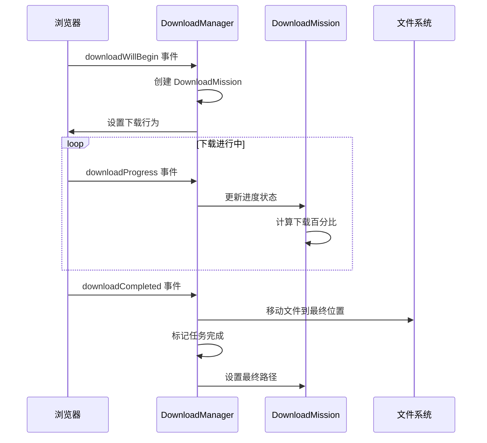
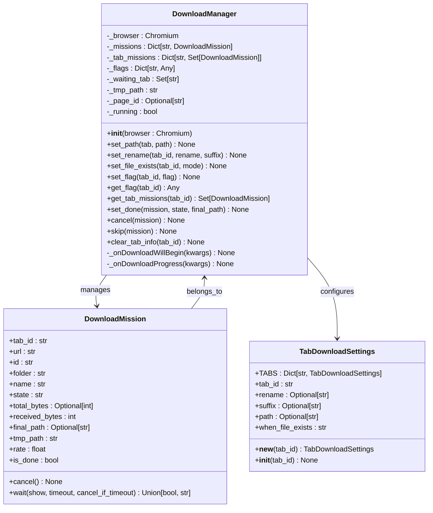
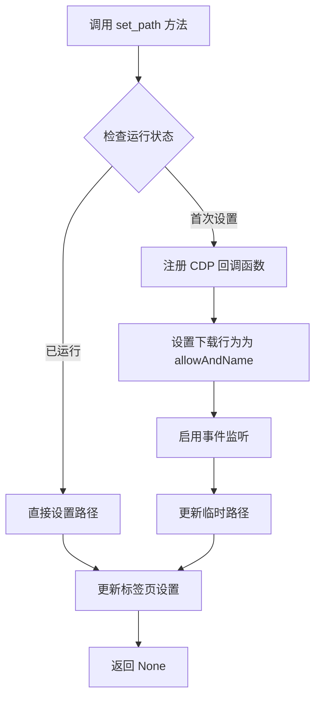
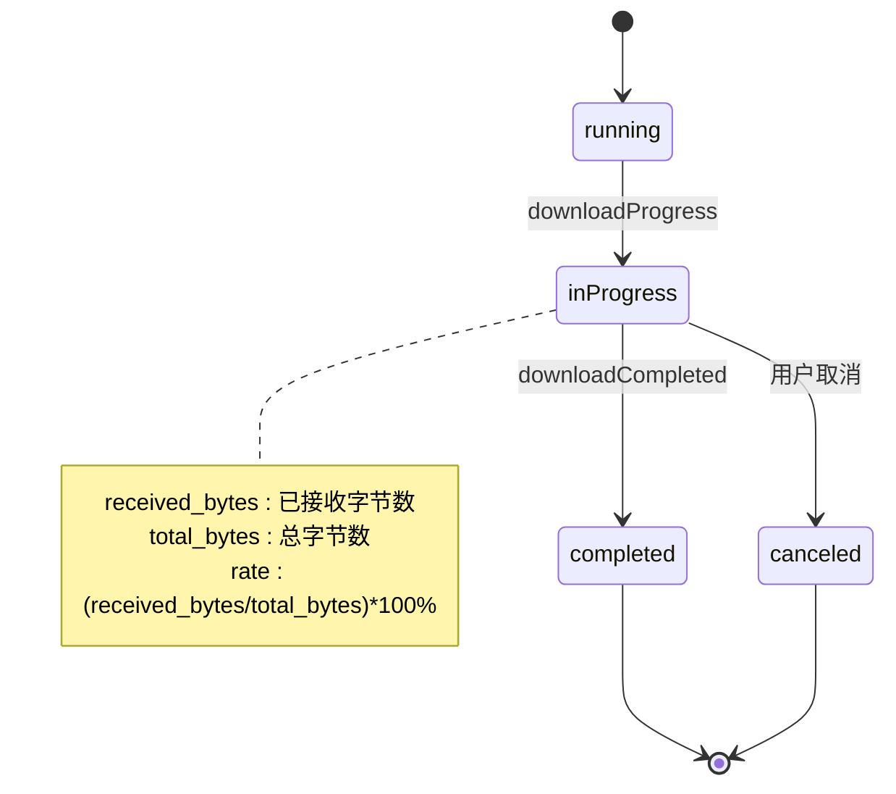
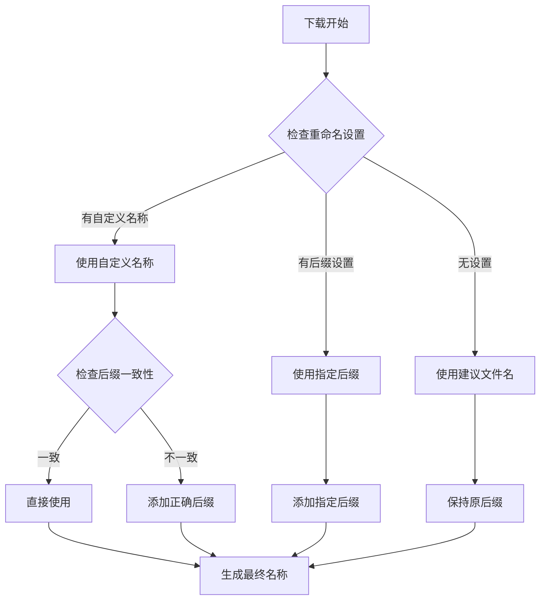
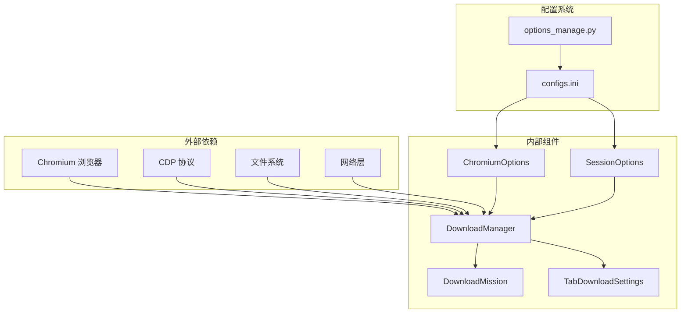
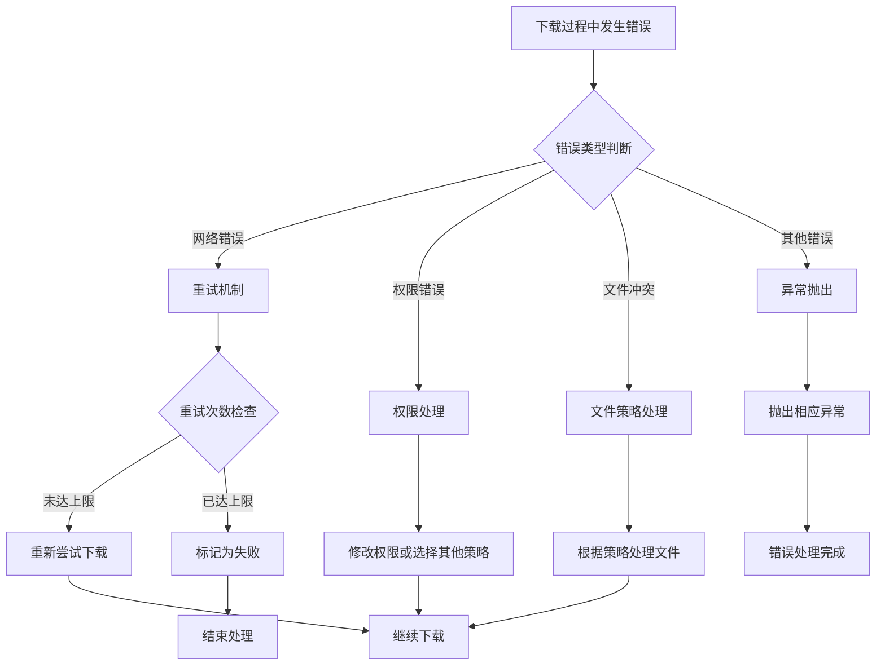

# 下载管理模块

<cite>
**本文档引用的文件**
- [downloader.py](file://DrissionPage/_units/downloader.py)
- [downloader.pyi](file://DrissionPage/_units/downloader.pyi)
- [chromium.py](file://DrissionPage/_browsers/chromium.py)
- [chromium_options.py](file://DrissionPage/_configs/chromium_options.py)
- [session_options.py](file://DrissionPage/_configs/session_options.py)
- [configs.ini](file://DrissionPage/_configs/configs.ini)
- [options_manage.py](file://DrissionPage/_configs/options_manage.py)
- [settings.py](file://DrissionPage/_functions/settings.py)
- [errors.py](file://DrissionPage/errors.py)
- [waiter.py](file://DrissionPage/_units/waiter.py)
</cite>

## 目录
1. [简介](#简介)
2. [项目结构](#项目结构)
3. [核心组件](#核心组件)
4. [架构概览](#架构概览)
5. [详细组件分析](#详细组件分析)
6. [依赖关系分析](#依赖关系分析)
7. [性能考虑](#性能考虑)
8. [故障排除指南](#故障排除指南)
9. [结论](#结论)

## 简介

DrissionPage 的 DownloadManager 下载管理模块是一个强大的浏览器下载管理解决方案，专门设计用于与 Chromium 浏览器集成，通过 Chrome DevTools Protocol (CDP) 实现高效的文件下载管理。该模块提供了完整的下载生命周期管理，包括下载初始化、并发控制、进度监控、断点续传支持以及错误处理等功能。

该模块的核心优势在于其与浏览器的深度集成，能够实时监听下载事件，精确跟踪每个下载任务的状态变化，并提供灵活的配置选项来满足不同场景下的下载需求。

## 项目结构

DownloadManager 模块位于 DrissionPage 项目的 `_units` 目录下，与浏览器核心功能紧密集成：

**图表来源**
- [chromium.py:119](file://DrissionPage/_browsers/chromium.py#L119)
- [downloader.py:18](file://DrissionPage/_units/downloader.py#L18)

**章节来源**
- [downloader.py:1-309](file://DrissionPage/_units/downloader.py#L1-L309)
- [chromium.py:1-200](file://DrissionPage/_browsers/chromium.py#L1-L200)

## 核心组件

DownloadManager 模块包含三个核心类，每个类都有特定的功能职责：

### DownloadManager 主控制器
负责协调整个下载过程，管理所有下载任务的状态和生命周期。

### DownloadMission 任务实体
表示单个下载任务的详细信息，包括进度、状态和文件信息。

### TabDownloadSettings 标签页配置
管理每个标签页的下载配置，支持按标签页级别的个性化设置。

**章节来源**
- [downloader.py:18-309](file://DrissionPage/_units/downloader.py#L18-L309)
- [downloader.pyi:16-211](file://DrissionPage/_units/downloader.pyi#L16-L211)

## 架构概览

DownloadManager 采用事件驱动的架构模式，通过监听浏览器的 CDP 事件来管理下载流程：

**图表来源**
- [downloader.py:44-56](file://DrissionPage/_units/downloader.py#L44-L56)
- [downloader.py:115-168](file://DrissionPage/_units/downloader.py#L115-L168)
- [downloader.py:169-212](file://DrissionPage/_units/downloader.py#L169-L212)

## 详细组件分析

### DownloadManager 类分析

DownloadManager 是下载管理模块的核心控制器，负责管理所有下载相关的操作：

#### 初始化和配置

**图表来源**
- [downloader.py:18-309](file://DrissionPage/_units/downloader.py#L18-L309)
- [downloader.pyi:16-211](file://DrissionPage/_units/downloader.pyi#L16-L211)

#### 下载路径设置机制

DownloadManager 提供了灵活的下载路径配置系统：

**图表来源**
- [downloader.py:41-56](file://DrissionPage/_units/downloader.py#L41-L56)

#### 并发下载管理

DownloadManager 支持多个标签页同时进行下载，通过内部的数据结构管理任务：

- `_missions`: 存储所有活动的下载任务
- `_tab_missions`: 按标签页组织的任务集合
- `_flags`: 下载标志位，支持全局或按标签页控制

**章节来源**
- [downloader.py:28-31](file://DrissionPage/_units/downloader.py#L28-L31)
- [downloader.py:74-75](file://DrissionPage/_units/downloader.py#L74-L75)

### DownloadMission 类分析

DownloadMission 表示单个下载任务的完整生命周期：

#### 进度监控机制

**图表来源**
- [downloader.py:238-266](file://DrissionPage/_units/downloader.py#L238-L266)
- [downloader.py:169-175](file://DrissionPage/_units/downloader.py#L169-L175)

#### 等待机制

DownloadMission 提供了灵活的等待功能：

- 支持显示或隐藏进度信息
- 可配置超时时间
- 超时后的自动取消策略

**章节来源**
- [downloader.py:270-309](file://DrissionPage/_units/downloader.py#L270-L309)

### TabDownloadSettings 类分析

TabDownloadSettings 提供按标签页级别的下载配置：

#### 文件重命名策略

**图表来源**
- [downloader.py:125-147](file://DrissionPage/_units/downloader.py#L125-L147)

**章节来源**
- [downloader.py:214-236](file://DrissionPage/_units/downloader.py#L214-L236)

## 依赖关系分析

DownloadManager 与其他组件的依赖关系如下：

**图表来源**
- [chromium.py:26](file://DrissionPage/_browsers/chromium.py#L26)
- [chromium_options.py:41-43](file://DrissionPage/_configs/chromium_options.py#L41-L43)
- [session_options.py:82-83](file://DrissionPage/_configs/session_options.py#L82-L83)

**章节来源**
- [chromium.py:119](file://DrissionPage/_browsers/chromium.py#L119)
- [chromium_options.py:41-43](file://DrissionPage/_configs/chromium_options.py#L41-L43)
- [session_options.py:82-83](file://DrissionPage/_configs/session_options.py#L82-L83)

## 性能考虑

### 并发下载优化

DownloadManager 在设计上支持多任务并发处理，但需要注意以下性能考量：

1. **内存使用**: 每个下载任务都会在内存中维护进度信息
2. **磁盘 I/O**: 大量并发下载可能对磁盘造成压力
3. **网络带宽**: 合理控制并发数量以避免网络拥塞

### CDP 事件处理

- 使用回调函数监听下载事件，避免轮询造成的资源浪费
- 事件处理函数应尽量轻量，避免阻塞主线程

### 文件操作优化

- 使用移动操作优先于复制操作
- 添加重试机制处理权限冲突
- 支持文件存在时的不同处理策略

## 故障排除指南

### 常见问题及解决方案

#### 下载路径设置问题

**问题**: 下载路径无法设置或无效
**解决方案**: 
- 确保路径存在且具有写入权限
- 使用绝对路径而非相对路径
- 检查浏览器是否支持下载行为设置

#### 下载进度不更新

**问题**: 下载进度显示为 0%
**解决方案**:
- 检查 CDP 连接是否正常
- 确认 downloadProgress 事件是否被正确接收
- 验证 total_bytes 是否正确设置

#### 文件重命名冲突

**问题**: 文件重命名后仍出现冲突
**解决方案**:
- 检查 when_file_exists 设置
- 确认重命名逻辑是否正确
- 验证文件系统权限

**章节来源**
- [downloader.py:50-51](file://DrissionPage/_units/downloader.py#L50-L51)
- [downloader.py:185-194](file://DrissionPage/_units/downloader.py#L185-L194)

### 错误处理机制

DownloadManager 提供了完善的错误处理机制：

**图表来源**
- [errors.py:11-95](file://DrissionPage/errors.py#L11-L95)
- [downloader.py:99-107](file://DrissionPage/_units/downloader.py#L99-L107)

## 结论

DrissionPage 的 DownloadManager 下载管理模块是一个功能完整、设计精良的下载解决方案。它通过与 Chromium 浏览器的深度集成，提供了高效、可靠的下载管理能力。

### 主要优势

1. **完整的生命周期管理**: 从下载开始到完成的全过程跟踪
2. **灵活的配置选项**: 支持全局和按标签页的个性化设置
3. **强大的错误处理**: 完善的异常处理和恢复机制
4. **高性能设计**: 基于事件驱动的架构，避免资源浪费
5. **易于使用**: 简洁的 API 设计，便于集成到现有项目中

### 应用场景

- 批量文件下载管理
- 数据采集过程中的文件下载
- 自动化测试中的资源下载
- 内容爬取和数据导出

### 发展方向

随着浏览器技术的不断发展，DownloadManager 可以进一步扩展：
- 支持更多的下载协议和格式
- 增强断点续传功能
- 优化大文件下载的性能
- 提供更丰富的统计和报告功能

该模块为 DrissionPage 生态系统提供了坚实的下载基础设施，是构建复杂浏览器自动化应用的重要组件。