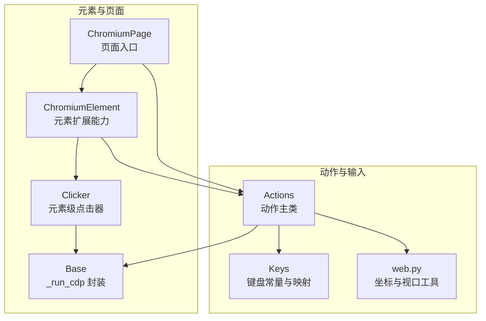
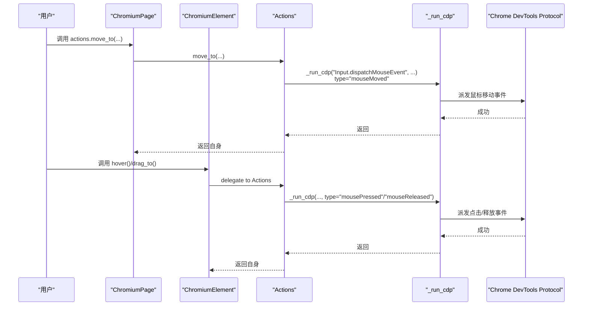
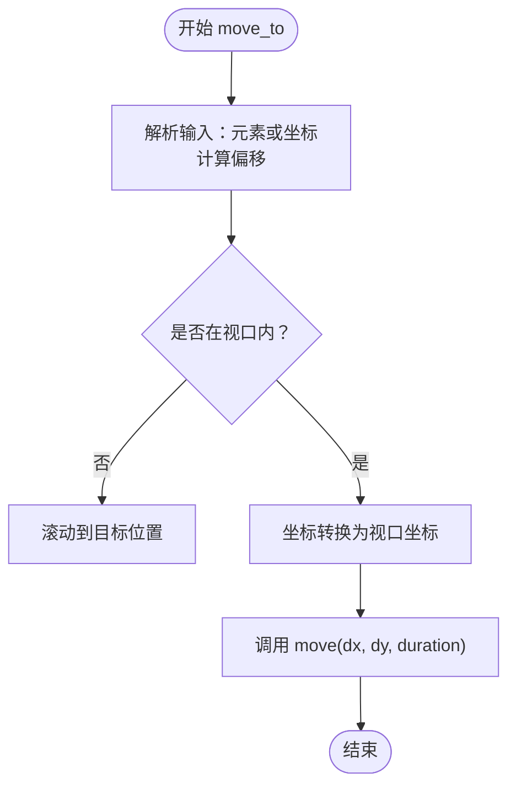
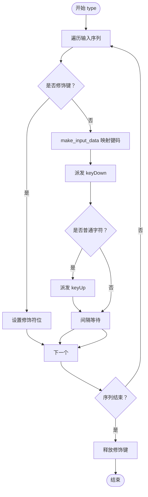
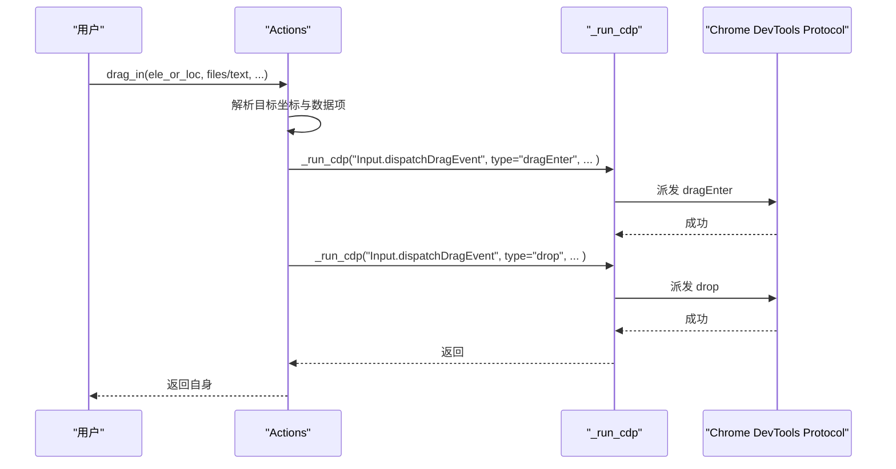
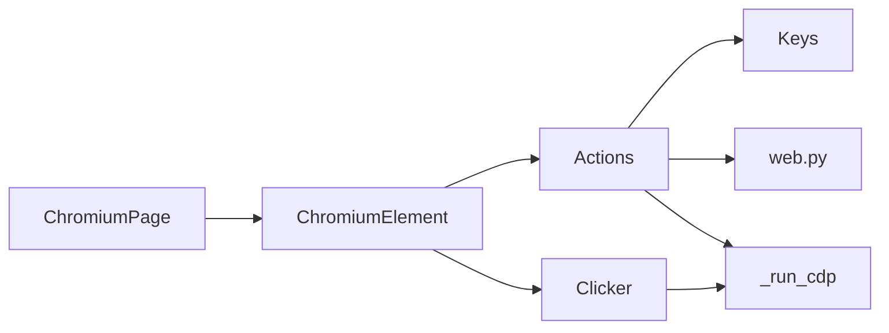

# 动作执行模块

<cite>
**本文引用的文件列表**
- [actions.py](file://DrissionPage/_units/actions.py)
- [keys.py](file://DrissionPage/_functions/keys.py)
- [clicker.py](file://DrissionPage/_units/clicker.py)
- [chromium_element.py](file://DrissionPage/_elements/chromium_element.py)
- [web.py](file://DrissionPage/_functions/web.py)
- [chromium_page.py](file://DrissionPage/_pages/chromium_page.py)
- [base.py](file://DrissionPage/_base/base.py)
</cite>

## 目录
1. [简介](#简介)
2. [项目结构](#项目结构)
3. [核心组件](#核心组件)
4. [架构总览](#架构总览)
5. [详细组件分析](#详细组件分析)
6. [依赖关系分析](#依赖关系分析)
7. [性能考量](#性能考量)
8. [故障排查指南](#故障排查指南)
9. [结论](#结论)
10. [附录：完整示例与最佳实践](#附录完整示例与最佳实践)

## 简介
本章节系统性介绍 DrissionPage 的动作执行模块（Actions），重点覆盖：
- 鼠标操作：move_to、move、click、r_click、m_click、hold/release 及其组合
- 键盘操作：key_down、key_up、type、input 的实现原理与使用场景
- 拖拽与上传：drag_in 的文件上传与文本拖拽
- 修饰键与组合键：修饰键位管理、跨平台差异处理
- 底层机制：基于 CDP 的事件派发与坐标转换
- 复杂交互示例：结合元素定位与等待策略的实战用法

## 项目结构
动作执行模块主要位于以下文件中：
- 动作主类：DrissionPage/_units/actions.py
- 键盘定义与输入：DrissionPage/_functions/keys.py
- 元素级点击器：DrissionPage/_units/clicker.py
- 元素扩展能力（hover/drag）：DrissionPage/_elements/chromium_element.py
- 页面与元素坐标工具：DrissionPage/_functions/web.py
- 页面对象入口：DrissionPage/_pages/chromium_page.py
- CDP 调用封装：DrissionPage/_base/base.py

图表来源
- [actions.py:16-266](file://DrissionPage/_units/actions.py#L16-L266)
- [keys.py:23-451](file://DrissionPage/_functions/keys.py#L23-L451)
- [chromium_element.py:38-683](file://DrissionPage/_elements/chromium_element.py#L38-L683)
- [clicker.py:19-207](file://DrissionPage/_units/clicker.py#L19-L207)
- [web.py:110-134](file://DrissionPage/_functions/web.py#L110-L134)
- [chromium_page.py:17-103](file://DrissionPage/_pages/chromium_page.py#L17-L103)
- [base.py:394-396](file://DrissionPage/_base/base.py#L394-L396)

章节来源
- [actions.py:16-266](file://DrissionPage/_units/actions.py#L16-L266)
- [chromium_element.py:38-683](file://DrissionPage/_elements/chromium_element.py#L38-L683)
- [chromium_page.py:17-103](file://DrissionPage/_pages/chromium_page.py#L17-L103)

## 核心组件
- Actions：统一的动作执行器，负责鼠标移动、点击、滚轮、拖拽以及键盘输入的底层派发
- Keys：键盘按键常量与键码映射，支持修饰键位、大小写处理、跨平台命令键
- Clicker：元素级点击器，提供更贴近真实用户行为的点击策略（含遮挡检测、JS 回退）
- ChromiumElement：元素扩展，提供 hover、drag、drag_to 等便捷方法，内部委托 Actions 执行
- web 工具：视口坐标计算、元素可视区域判断、偏移滚动等
- Base：统一的 CDP 调用封装，所有动作最终通过 _run_cdp 调用 Chrome DevTools 协议

章节来源
- [actions.py:16-266](file://DrissionPage/_units/actions.py#L16-L266)
- [keys.py:23-451](file://DrissionPage/_functions/keys.py#L23-L451)
- [clicker.py:19-207](file://DrissionPage/_units/clicker.py#L19-L207)
- [chromium_element.py:597-616](file://DrissionPage/_elements/chromium_element.py#L597-L616)
- [web.py:110-134](file://DrissionPage/_functions/web.py#L110-L134)
- [base.py:394-396](file://DrissionPage/_base/base.py#L394-L396)

## 架构总览
动作执行的整体流程如下：
- 用户通过页面对象或元素对象触发动作
- 动作被转换为坐标与修饰键状态
- 通过 CDP Input.* 接口派发鼠标/键盘/拖拽事件
- 元素扩展方法在必要时先滚动至可见并进行遮挡检测

图表来源
- [chromium_element.py:597-616](file://DrissionPage/_elements/chromium_element.py#L597-L616)
- [actions.py:25-146](file://DrissionPage/_units/actions.py#L25-L146)
- [base.py:394-396](file://DrissionPage/_base/base.py#L394-L396)

## 详细组件分析

### 鼠标操作详解
- move_to：支持传入元素或坐标；自动滚动到可视区域；可选偏移；内部将目标点转换为视口坐标后移动
- move：按时间分帧插值生成轨迹，逐帧派发 mouseMoved 事件，保证平滑移动
- click/r_click/m_click：内部调用 _hold + 短暂停顿 + _release，模拟真实点击
- hold/release 及其右/中键版本：维护当前按下的按钮状态，用于连续拖拽或长按
- scroll：派发 mouseWheel 事件，支持水平/垂直滚动
- 方向快捷方法：up/down/left/right，基于 move 实现

图表来源
- [actions.py:25-63](file://DrissionPage/_units/actions.py#L25-L63)
- [web.py:110-134](file://DrissionPage/_functions/web.py#L110-L134)

章节来源
- [actions.py:25-146](file://DrissionPage/_units/actions.py#L25-L146)
- [web.py:110-134](file://DrissionPage/_functions/web.py#L110-L134)

### 键盘操作详解
- key_down/key_up：修饰键会更新修饰符位，普通键通过 make_input_data 生成 CDP 参数并派发
- type：支持字符串、元组/列表；自动处理修饰键叠加与释放；字符键会同时派发 keyDown 和 keyUp
- input：委托给 input_text_or_keys，优先走 insertText，必要时回退为键事件
- 跨平台差异：Mac 上 Meta 键与常用命令（如复制/粘贴）映射为 commands

图表来源
- [actions.py:190-212](file://DrissionPage/_units/actions.py#L190-L212)
- [keys.py:371-422](file://DrissionPage/_functions/keys.py#L371-L422)

章节来源
- [actions.py:160-216](file://DrissionPage/_units/actions.py#L160-L216)
- [keys.py:23-451](file://DrissionPage/_functions/keys.py#L23-L451)

### 拖拽与文件上传
- drag_in：支持文件路径数组与文本拖拽；根据传参构造 items 与 mime 类型；派发 dragEnter 与 drop
- 文件拖拽：mimeType 使用 application/octet-stream，包含 files 列表
- 文本拖拽：支持 title/baseURL 或纯文本，分别映射 text/uri-list 与 text/plain
- 元素拖拽：ChromiumElement.drag_to 内部委托 Actions.hold/move_to/release 完成

图表来源
- [actions.py:218-255](file://DrissionPage/_units/actions.py#L218-L255)

章节来源
- [actions.py:218-255](file://DrissionPage/_units/actions.py#L218-L255)
- [chromium_element.py:608-616](file://DrissionPage/_elements/chromium_element.py#L608-L616)

### 修饰键与组合键
- 修饰键位：Alt=1、Ctrl=2、Meta/Command=4、Shift=8，通过位运算组合
- 跨平台命令键：Windows/Linux 使用 Ctrl，Mac 使用 Meta；Keys 中提供 CTRL_COMM 自动适配
- Mac 特殊命令：Meta+字母映射为系统命令（如复制/粘贴）

章节来源
- [keys.py:12-20](file://DrissionPage/_functions/keys.py#L12-L20)
- [keys.py:57-64](file://DrissionPage/_functions/keys.py#L57-L64)
- [keys.py:415-419](file://DrissionPage/_functions/keys.py#L415-L419)

### 底层机制与 CDP 协议
- 所有动作最终通过 _run_cdp 调用 Chrome DevTools 协议
- 鼠标事件：Input.dispatchMouseEvent（mouseMoved/mousePressed/mouseReleased/mouseWheel）
- 键盘事件：Input.dispatchKeyEvent（keyDown/keyUp/rawKeyDown/char）
- 文本输入：Input.insertText
- 拖拽事件：Input.dispatchDragEvent（dragEnter/drop）

章节来源
- [actions.py:77-145](file://DrissionPage/_units/actions.py#L77-L145)
- [actions.py:166-172](file://DrissionPage/_units/actions.py#L166-L172)
- [actions.py:207](file://DrissionPage/_units/actions.py#L207)
- [actions.py:253-254](file://DrissionPage/_units/actions.py#L253-L254)
- [base.py:394-396](file://DrissionPage/_base/base.py#L394-L396)

## 依赖关系分析
- Actions 依赖 Keys 提供键码映射与修饰键位；依赖 web 工具进行坐标转换与视口判断
- ChromiumElement 在 hover/drag_to 中委托 Actions；在 input 中优先使用 insertText，必要时回退到 Actions.type
- Clicker 提供元素级点击策略，内部也通过 _run_cdp 派发鼠标事件
- 页面对象通过 _run_cdp 与浏览器通信

图表来源
- [actions.py:11-12](file://DrissionPage/_units/actions.py#L11-L12)
- [chromium_element.py:597-616](file://DrissionPage/_elements/chromium_element.py#L597-L616)
- [clicker.py:201-205](file://DrissionPage/_units/clicker.py#L201-L205)
- [chromium_page.py:17-103](file://DrissionPage/_pages/chromium_page.py#L17-L103)
- [base.py:394-396](file://DrissionPage/_base/base.py#L394-L396)

章节来源
- [chromium_element.py:547-572](file://DrissionPage/_elements/chromium_element.py#L547-L572)
- [clicker.py:19-207](file://DrissionPage/_units/clicker.py#L19-L207)
- [base.py:394-396](file://DrissionPage/_base/base.py#L394-L396)

## 性能考量
- move_to 的滚动与坐标转换可能触发页面重排，建议批量移动时合并调用
- move 的分帧策略默认约每秒 50 帧，过短的 duration 会被裁剪为最小值，避免过度频繁派发
- 键盘输入 type 支持间隔参数，长文本输入时可适当增大间隔以降低 CPU 占用
- drag_in 仅派发一次 dragEnter 与 drop，避免重复拖拽导致的性能浪费

[本节为通用指导，无需特定文件来源]

## 故障排查指南
- 修饰键无效：确认修饰键名称是否正确（如 Keys.SHIFT），并在 key_down/key_up 中成对使用
- 键盘映射失败：检查输入字符是否在 keyDefinitions 中存在，或使用 char 类型事件
- 鼠标点击未生效：检查元素是否可见、是否被遮挡；必要时使用元素级 Clicker 或通过 Actions.move_to 精确定位
- 拖拽无响应：确认目标坐标是否在视口内，或使用 drag_in 的偏移参数微调
- CDP 调用异常：查看 _run_cdp 的错误处理逻辑，必要时忽略异常或捕获异常后重试

章节来源
- [actions.py:160-216](file://DrissionPage/_units/actions.py#L160-L216)
- [keys.py:371-422](file://DrissionPage/_functions/keys.py#L371-L422)
- [clicker.py:26-93](file://DrissionPage/_units/clicker.py#L26-L93)

## 结论
Actions 模块以 CDP 为核心，提供了高精度、可组合的鼠标与键盘操作能力。通过修饰键位管理、坐标转换与事件派发，能够满足复杂交互场景的需求。配合元素扩展与等待策略，可构建稳定可靠的自动化流程。

[本节为总结，无需特定文件来源]

## 附录：完整示例与最佳实践
以下示例展示常见操作的调用路径（请参考对应源码路径以获取具体实现细节）：
- 移动到元素中心并点击：[actions.py:25-87](file://DrissionPage/_units/actions.py#L25-L87)
- 右键与中键点击：[actions.py:89-95](file://DrissionPage/_units/actions.py#L89-L95)
- 持续按住并释放：[actions.py:97-125](file://DrissionPage/_units/actions.py#L97-L125)
- 滚动页面：[actions.py:141-146](file://DrissionPage/_units/actions.py#L141-L146)
- 输入文本与组合键：[actions.py:190-212](file://DrissionPage/_units/actions.py#L190-L212)
- 直接插入文本：[actions.py:214-216](file://DrissionPage/_units/actions.py#L214-L216)
- 文件拖拽上传：[actions.py:218-255](file://DrissionPage/_units/actions.py#L218-L255)
- 元素悬停与拖拽：[chromium_element.py:597-616](file://DrissionPage/_elements/chromium_element.py#L597-L616)
- 元素点击策略（含遮挡检测）：[clicker.py:26-93](file://DrissionPage/_units/clicker.py#L26-L93)

最佳实践
- 优先使用元素级 hover/drag_to，内部已处理滚动与遮挡
- 键盘输入优先使用 input，必要时再使用 type
- 批量移动时合并调用，减少 CDP 调用次数
- 跨平台兼容：使用 Keys.CTRL_COMM 自动选择 Ctrl/Meta