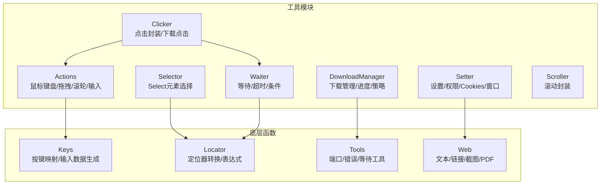
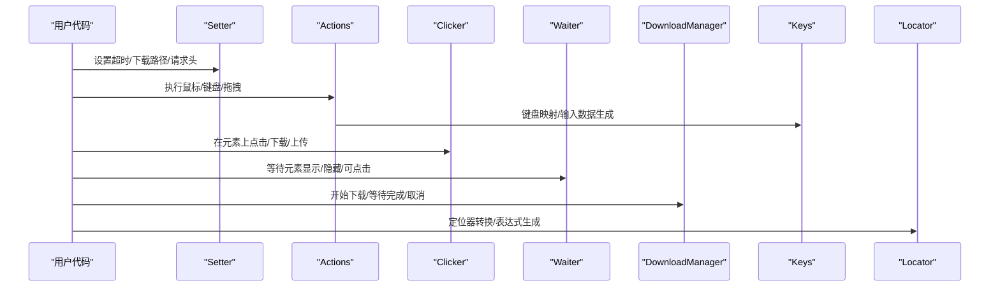
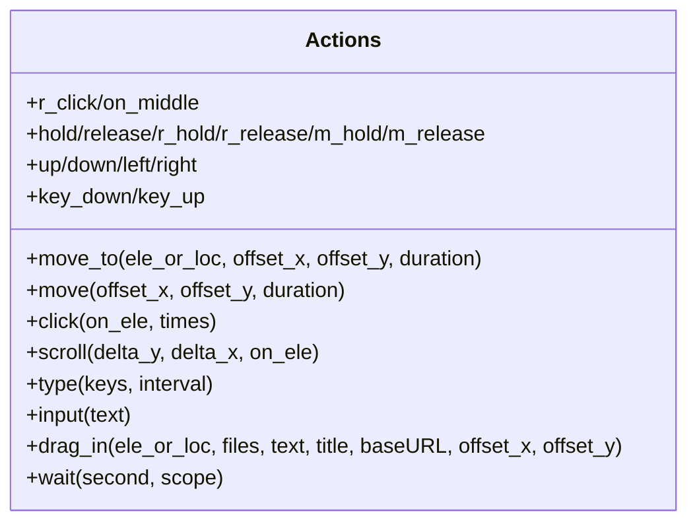
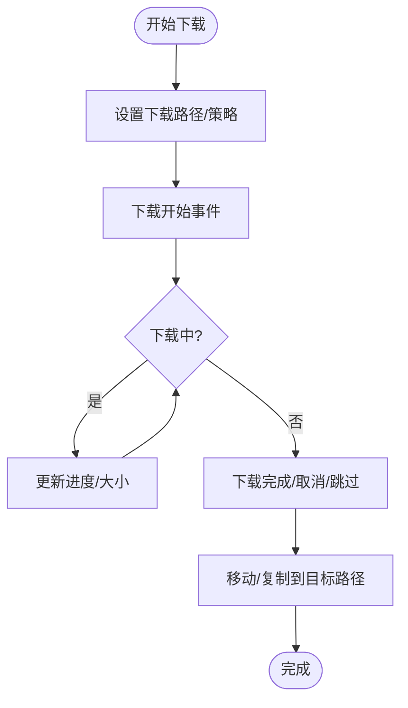
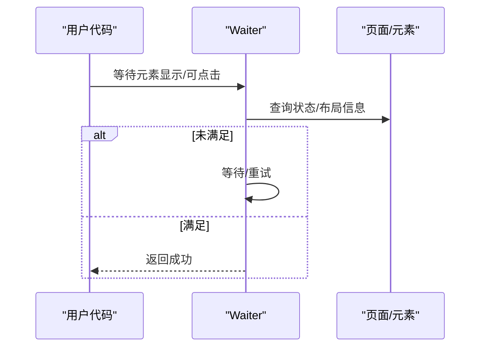
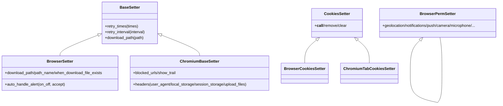
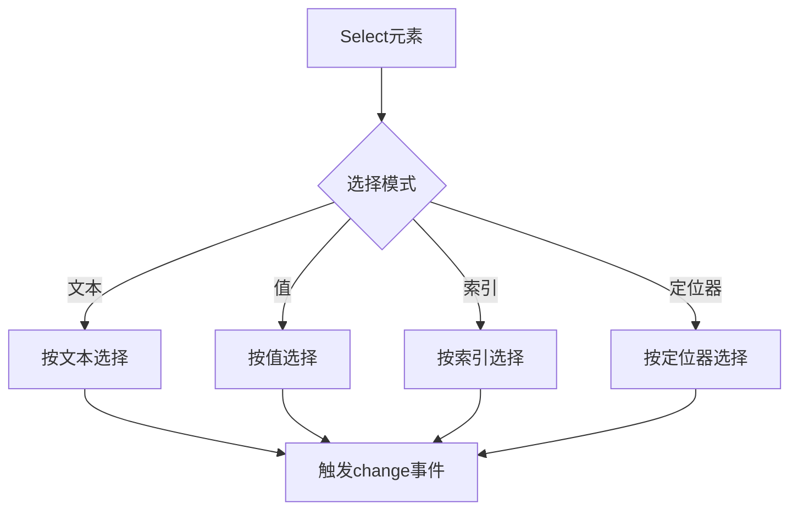
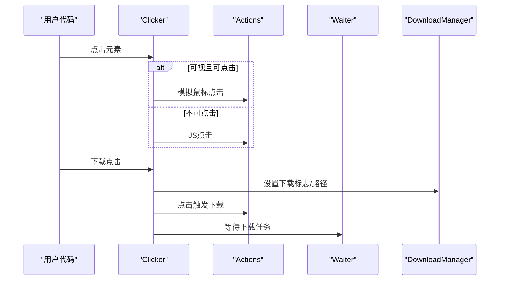
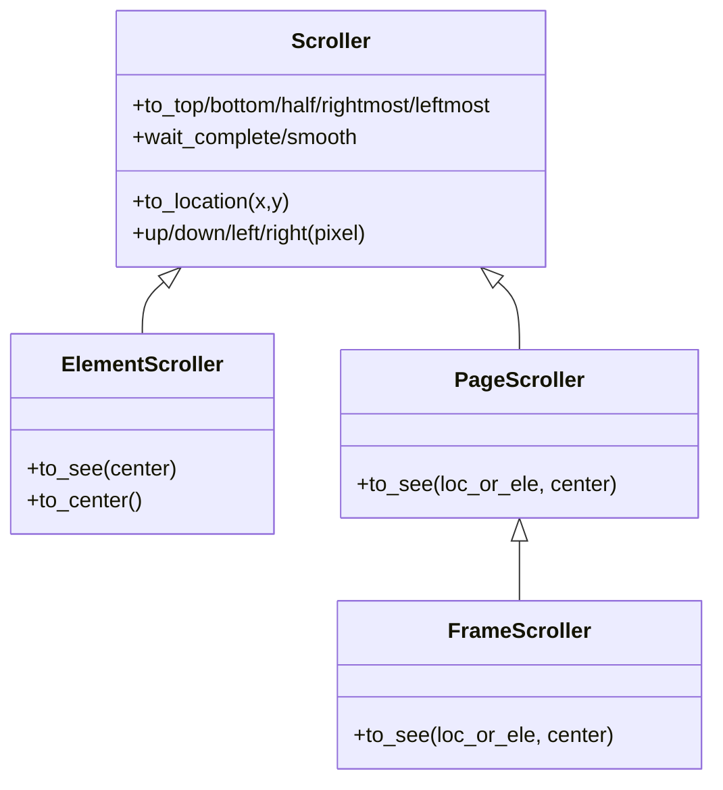
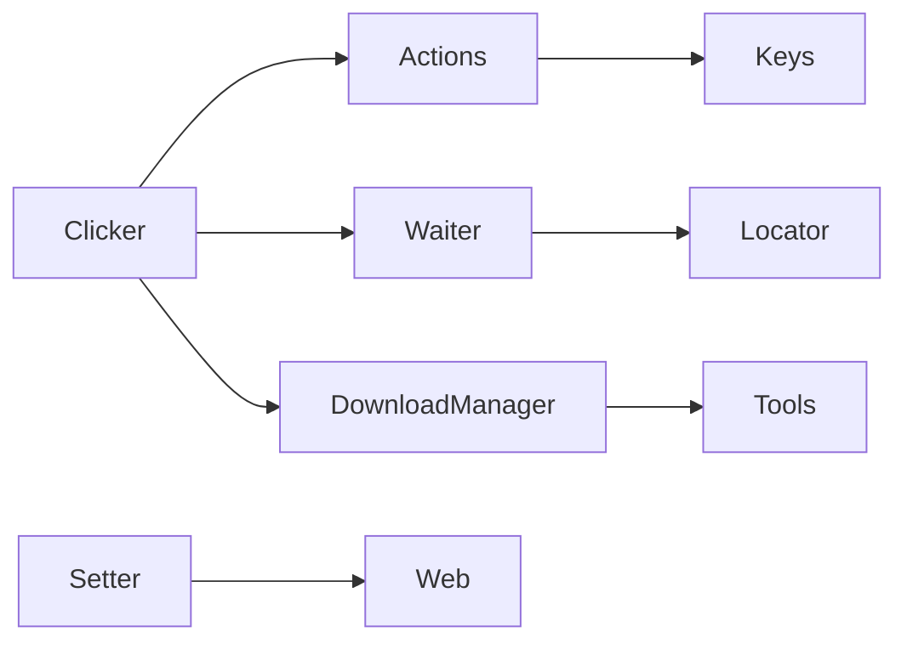

# 工具模块

<cite>
**本文引用的文件**
- [actions.py](file://DrissionPage/_units/actions.py)
- [downloader.py](file://DrissionPage/_units/downloader.py)
- [waiter.py](file://DrissionPage/_units/waiter.py)
- [setter.py](file://DrissionPage/_units/setter.py)
- [selector.py](file://DrissionPage/_units/selector.py)
- [clicker.py](file://DrissionPage/_units/clicker.py)
- [scroller.py](file://DrissionPage/_units/scroller.py)
- [cookies_setter.py](file://DrissionPage/_units/cookies_setter.py)
- [perm_setter.py](file://DrissionPage/_units/perm_setter.py)
- [keys.py](file://DrissionPage/_functions/keys.py)
- [locator.py](file://DrissionPage/_functions/locator.py)
- [tools.py](file://DrissionPage/_functions/tools.py)
- [web.py](file://DrissionPage/_functions/web.py)
</cite>

## 目录
1. [简介](#简介)
2. [项目结构](#项目结构)
3. [核心组件](#核心组件)
4. [架构总览](#架构总览)
5. [详细组件分析](#详细组件分析)
6. [依赖关系分析](#依赖关系分析)
7. [性能考量](#性能考量)
8. [故障排查指南](#故障排查指南)
9. [结论](#结论)
10. [附录](#附录)

## 简介
本章节系统性介绍 DrissionPage 的工具模块，重点覆盖以下方面：
- Actions：鼠标键盘操作（点击、拖拽、滚轮、组合键、输入文本）
- DownloadManager：下载管理（批量下载、断点续传、重命名、覆盖策略、进度监控）
- Waiter：等待机制（元素等待、条件等待、超时处理、下载等待）
- Setter：设置管理（页面设置、浏览器设置、全局配置、权限与Cookies设置）
- Selector：选择器功能与自定义选择器使用
- 实际使用示例与性能优化建议

## 项目结构
工具模块位于 DrissionPage/_units 下，围绕“动作执行”“等待控制”“设置管理”“下载管理”“选择器”等职责划分清晰。同时，底层依赖 DrissionPage/_functions 提供键值映射、定位器转换、通用工具与网页辅助函数。

图表来源
- [actions.py:16-266](file://DrissionPage/_units/actions.py#L16-L266)
- [downloader.py:18-309](file://DrissionPage/_units/downloader.py#L18-L309)
- [waiter.py:15-433](file://DrissionPage/_units/waiter.py#L15-L433)
- [setter.py:21-619](file://DrissionPage/_units/setter.py#L21-L619)
- [selector.py:13-161](file://DrissionPage/_units/selector.py#L13-L161)
- [clicker.py:19-207](file://DrissionPage/_units/clicker.py#L19-L207)
- [scroller.py:11-142](file://DrissionPage/_units/scroller.py#L11-L142)
- [keys.py:23-451](file://DrissionPage/_functions/keys.py#L23-L451)
- [locator.py:15-579](file://DrissionPage/_functions/locator.py#L15-L579)
- [tools.py:21-213](file://DrissionPage/_functions/tools.py#L21-L213)
- [web.py:110-349](file://DrissionPage/_functions/web.py#L110-L349)

章节来源
- [actions.py:16-266](file://DrissionPage/_units/actions.py#L16-L266)
- [downloader.py:18-309](file://DrissionPage/_units/downloader.py#L18-L309)
- [waiter.py:15-433](file://DrissionPage/_units/waiter.py#L15-L433)
- [setter.py:21-619](file://DrissionPage/_units/setter.py#L21-L619)
- [selector.py:13-161](file://DrissionPage/_units/selector.py#L13-L161)
- [clicker.py:19-207](file://DrissionPage/_units/clicker.py#L19-L207)
- [scroller.py:11-142](file://DrissionPage/_units/scroller.py#L11-L142)
- [keys.py:23-451](file://DrissionPage/_functions/keys.py#L23-L451)
- [locator.py:15-579](file://DrissionPage/_functions/locator.py#L15-L579)
- [tools.py:21-213](file://DrissionPage/_functions/tools.py#L21-L213)
- [web.py:110-349](file://DrissionPage/_functions/web.py#L110-L349)

## 核心组件
- Actions：提供鼠标移动、点击、滚轮、修饰键、文本输入、拖拽投放等底层交互能力，并通过 CDP 调用实现高精度模拟。
- DownloadManager：统一管理下载生命周期，支持按标签页隔离、重命名、覆盖策略、完成回调与进度更新。
- Waiter：提供元素状态等待、页面加载状态、URL/标题变化、新标签页、下载开始/完成等等待接口。
- Setter：集中管理页面/浏览器/会话设置，包括超时、请求头、UA、存储、权限、窗口、下载路径等。
- Selector：针对 select 元素的高级选择器，支持按文本/值/索引/定位器选择或取消选择，支持多选反转与清空。
- Clicker：在元素上执行点击，支持左中右键、偏移点击、下载点击、上传点击、新标签页打开、URL/标题变化等待。
- Scroller：封装滚动行为，支持滚动到顶部/底部/居中、按像素滚动、视口可见滚动等。

章节来源
- [actions.py:16-266](file://DrissionPage/_units/actions.py#L16-L266)
- [downloader.py:18-309](file://DrissionPage/_units/downloader.py#L18-L309)
- [waiter.py:15-433](file://DrissionPage/_units/waiter.py#L15-L433)
- [setter.py:21-619](file://DrissionPage/_units/setter.py#L21-L619)
- [selector.py:13-161](file://DrissionPage/_units/selector.py#L13-L161)
- [clicker.py:19-207](file://DrissionPage/_units/clicker.py#L19-L207)
- [scroller.py:11-142](file://DrissionPage/_units/scroller.py#L11-L142)

## 架构总览
工具模块通过统一的 owner 引用与 CDP 接口协作，形成“高层封装 + 底层驱动”的分层架构。Setter 作为配置入口，Actions/Clicker/Scroller/Waiter/DownloadManager/Selector 作为功能单元，共同构成自动化脚本的“动作-等待-设置-选择-下载”闭环。

图表来源
- [setter.py:126-470](file://DrissionPage/_units/setter.py#L126-L470)
- [actions.py:16-266](file://DrissionPage/_units/actions.py#L16-L266)
- [clicker.py:19-207](file://DrissionPage/_units/clicker.py#L19-L207)
- [waiter.py:85-235](file://DrissionPage/_units/waiter.py#L85-L235)
- [downloader.py:18-309](file://DrissionPage/_units/downloader.py#L18-L309)
- [keys.py:371-451](file://DrissionPage/_functions/keys.py#L371-L451)
- [locator.py:96-115](file://DrissionPage/_functions/locator.py#L96-L115)

## 详细组件分析

### Actions：鼠标键盘与拖拽
- 鼠标移动与点击
  - 支持移动到元素中心或指定偏移，自动滚动至可视区域；支持左/右/中键点击、多次点击、按住释放。
  - 支持平滑移动轨迹，按时间分段生成中间点，保证移动过程稳定。
- 滚轮与方向键
  - 提供滚轮滚动接口，支持水平/垂直方向增量。
  - 提供上下左右方向移动快捷方法。
- 键盘与组合键
  - 支持修饰键叠加（Alt/Ctrl/Meta/Shift），按键映射来自 Keys，自动区分大小写与平台差异。
  - 支持连续输入与逐字符输入，支持组合键序列。
- 文本输入
  - 支持直接输入文本或按键序列，自动处理换行与修饰键。
- 拖拽投放
  - 支持文件拖拽与文本拖拽，支持设置标题/基础URL，自动触发 dragEnter/drop 事件。
- 等待
  - 提供 wait(second) 以配合 Waiter 的等待策略。

图表来源
- [actions.py:16-266](file://DrissionPage/_units/actions.py#L16-L266)
- [keys.py:23-451](file://DrissionPage/_functions/keys.py#L23-L451)

章节来源
- [actions.py:25-266](file://DrissionPage/_units/actions.py#L25-L266)
- [keys.py:23-451](file://DrissionPage/_functions/keys.py#L23-L451)

实际使用示例（路径参考）
- 鼠标移动到元素并点击：[actions.py:25-95](file://DrissionPage/_units/actions.py#L25-L95)
- 输入文本与组合键：[actions.py:160-216](file://DrissionPage/_units/actions.py#L160-L216)，[keys.py:371-451](file://DrissionPage/_functions/keys.py#L371-L451)
- 拖拽投放文件/文本：[actions.py:218-255](file://DrissionPage/_units/actions.py#L218-L255)

性能优化建议
- 移动与点击尽量使用元素定位而非绝对坐标，减少滚动与计算开销。
- 批量输入时设置合理的间隔，避免过快导致输入丢失。
- 滚动优先使用视口可见滚动，减少不必要的 DOM 计算。

### DownloadManager：下载管理
- 功能特性
  - 下载路径设置：支持浏览器级与标签页级路径设置，动态生效。
  - 文件命名与后缀：支持重命名与后缀设置，按标签页隔离。
  - 文件存在策略：支持跳过、重命名、覆盖三种模式。
  - 下载生命周期：监听下载开始/进度/完成，自动移动临时文件到目标目录。
  - 任务管理：维护任务字典、标签页任务集合、标志位与取消/跳过逻辑。
- 进度监控
  - 实时更新 received_bytes/total_bytes，提供完成率与最终路径。
  - 支持等待任务完成，可设置超时并自动取消。
- 断点续传
  - 通过临时文件与移动/复制策略实现，遇到权限冲突自动降级复制。

图表来源
- [downloader.py:18-309](file://DrissionPage/_units/downloader.py#L18-L309)

章节来源
- [downloader.py:18-309](file://DrissionPage/_units/downloader.py#L18-L309)

实际使用示例（路径参考）
- 设置下载路径与策略：[downloader.py:41-67](file://DrissionPage/_units/downloader.py#L41-L67)
- 等待下载完成：[downloader.py:270-294](file://DrissionPage/_units/downloader.py#L270-L294)
- 取消/跳过任务：[downloader.py:89-107](file://DrissionPage/_units/downloader.py#L89-L107)

性能优化建议
- 合理设置文件存在策略，避免频繁重命名造成磁盘压力。
- 大文件下载建议开启重命名策略，避免覆盖导致的文件损坏。
- 使用等待超时参数，防止长时间阻塞。

### Waiter：等待机制
- 页面与元素等待
  - 页面加载开始/完成、URL/标题变化、元素显示/隐藏/可点击、元素停止移动等。
  - 支持超时与抛错控制，可选择抛出异常或返回 False。
- 浏览器与标签页等待
  - 新标签页打开等待、下载开始等待、全部下载完成等待。
- 条件等待
  - 支持多个定位器的“任意一个/全部满足”等待，内部使用 DOM 搜索与结果判定。

图表来源
- [waiter.py:85-235](file://DrissionPage/_units/waiter.py#L85-L235)

章节来源
- [waiter.py:15-433](file://DrissionPage/_units/waiter.py#L15-L433)

实际使用示例（路径参考）
- 等待元素可点击：[waiter.py:344-353](file://DrissionPage/_units/waiter.py#L344-L353)
- 等待URL变化：[waiter.py:186-187](file://DrissionPage/_units/waiter.py#L186-L187)
- 等待下载完成：[waiter.py:238-259](file://DrissionPage/_units/waiter.py#L238-L259)

性能优化建议
- 对于高频等待场景，适当增大轮询间隔，减少CPU占用。
- 使用“任意一个满足”模式处理多元素等待，缩短等待时间。

### Setter：设置管理
- 页面设置
  - 超时、编码、请求头、代理、认证、钩子、参数、证书、流式下载、环境信任等。
- 浏览器设置
  - 超时时间线、自动弹窗处理、下载路径、文件名与存在策略。
- Chromium 设置
  - 请求头注入、User-Agent、本地/会话存储、上传文件拦截、阻止URL、鼠标轨迹可视化、窗口尺寸与位置、滚动行为。
- Cookies 设置
  - 支持浏览器级、标签页级、会话级 Cookies 设置、删除与清理。
- 权限设置
  - 地理位置、通知、推送、摄像头、麦克风、剪贴板、全屏等权限批量设置。

图表来源
- [setter.py:21-619](file://DrissionPage/_units/setter.py#L21-L619)
- [cookies_setter.py:12-82](file://DrissionPage/_units/cookies_setter.py#L12-L82)
- [perm_setter.py:2-311](file://DrissionPage/_units/perm_setter.py#L2-L311)

章节来源
- [setter.py:21-619](file://DrissionPage/_units/setter.py#L21-L619)
- [cookies_setter.py:12-82](file://DrissionPage/_units/cookies_setter.py#L12-L82)
- [perm_setter.py:2-311](file://DrissionPage/_units/perm_setter.py#L2-L311)

实际使用示例（路径参考）
- 设置请求头与UA：[setter.py:182-191](file://DrissionPage/_units/setter.py#L182-L191)
- 设置下载路径与策略：[setter.py:150-165](file://DrissionPage/_units/setter.py#L150-L165)
- 设置权限：[perm_setter.py:7-311](file://DrissionPage/_units/perm_setter.py#L7-L311)
- 设置Cookies：[cookies_setter.py:16-67](file://DrissionPage/_units/cookies_setter.py#L16-L67)

性能优化建议
- 批量设置请求头时避免重复调用，合并为一次设置。
- 权限设置仅在需要时启用，减少不必要的权限检查。

### Selector：选择器与Select元素
- Select元素选择器
  - 支持按文本、值、索引、定位器选择或取消选择。
  - 支持多选反转与清空，自动触发 change 事件。
- 选项集合
  - 获取已选选项、所有选项、是否多选等。

图表来源
- [selector.py:13-161](file://DrissionPage/_units/selector.py#L13-L161)

章节来源
- [selector.py:13-161](file://DrissionPage/_units/selector.py#L13-L161)

实际使用示例（路径参考）
- 按文本选择：[selector.py:65-67](file://DrissionPage/_units/selector.py#L65-L67)
- 按索引选择：[selector.py:71-72](file://DrissionPage/_units/selector.py#L71-L72)
- 多选反转：[selector.py:48-58](file://DrissionPage/_units/selector.py#L48-L58)

性能优化建议
- 多选场景下避免逐项选择，优先使用定位器批量选择。
- 选择前先判断是否多选，避免类型错误。

### Clicker：点击封装与下载点击
- 点击行为
  - 支持左/右/中键点击，支持偏移点击、多次点击。
  - 自动处理不可见、被遮挡、覆盖等情况，必要时使用JS点击。
- 下载点击
  - 支持下载点击、新标签页下载、上传点击、URL/标题变化等待。
  - 支持按标签页隔离的下载路径与策略切换。

图表来源
- [clicker.py:19-207](file://DrissionPage/_units/clicker.py#L19-L207)
- [actions.py:16-266](file://DrissionPage/_units/actions.py#L16-L266)
- [waiter.py:421-433](file://DrissionPage/_units/waiter.py#L421-L433)
- [downloader.py:18-309](file://DrissionPage/_units/downloader.py#L18-L309)

章节来源
- [clicker.py:19-207](file://DrissionPage/_units/clicker.py#L19-L207)

实际使用示例（路径参考）
- 左键点击：[clicker.py:26-94](file://DrissionPage/_units/clicker.py#L26-L94)
- 中键点击并获取新标签：[clicker.py:99-108](file://DrissionPage/_units/clicker.py#L99-L108)
- 下载点击：[clicker.py:120-172](file://DrissionPage/_units/clicker.py#L120-L172)

性能优化建议
- 对于复杂页面，优先使用可视区域内的点击，减少JS点击带来的不确定性。
- 下载点击前预设下载路径与策略，避免运行时切换。

### Scroller：滚动封装
- 页面滚动
  - 支持滚动到顶部/底部/半屏、最左/最右、指定位置、按像素滚动。
  - 支持等待滚动完成，基于布局指标检测停止。
- 元素滚动
  - 支持将元素滚动到可视区域，支持居中滚动。
- 滚动行为
  - 支持平滑滚动与等待完成，提升用户体验与稳定性。

图表来源
- [scroller.py:11-142](file://DrissionPage/_units/scroller.py#L11-L142)

章节来源
- [scroller.py:11-142](file://DrissionPage/_units/scroller.py#L11-L142)

实际使用示例（路径参考）
- 滚动到元素可视：[scroller.py:108-127](file://DrissionPage/_units/scroller.py#L108-L127)
- 平滑滚动等待：[scroller.py:69-90](file://DrissionPage/_units/scroller.py#L69-L90)

性能优化建议
- 大范围滚动时使用“到位置”而非多次像素滚动，减少CDP调用次数。
- 等待滚动完成仅在必要时启用，避免过度等待。

## 依赖关系分析
- Actions 依赖 Keys 提供按键映射与输入数据生成。
- Clicker 依赖 Actions、Waiter、DownloadManager 实现点击、等待与下载流程。
- Waiter 依赖 Locator 提供定位器转换与DOM搜索。
- Setter 依赖 Web 提供头部格式化与存储设置。
- Downloader 依赖 Tools 提供端口与错误处理工具。

图表来源
- [actions.py:11-13](file://DrissionPage/_units/actions.py#L11-L13)
- [clicker.py:12-15](file://DrissionPage/_units/clicker.py#L12-L15)
- [waiter.py:10-12](file://DrissionPage/_units/waiter.py#L10-L12)
- [setter.py:17-18](file://DrissionPage/_units/setter.py#L17-L18)
- [downloader.py:13-15](file://DrissionPage/_units/downloader.py#L13-L15)

章节来源
- [actions.py:11-13](file://DrissionPage/_units/actions.py#L11-L13)
- [clicker.py:12-15](file://DrissionPage/_units/clicker.py#L12-L15)
- [waiter.py:10-12](file://DrissionPage/_units/waiter.py#L10-L12)
- [setter.py:17-18](file://DrissionPage/_units/setter.py#L17-L18)
- [downloader.py:13-15](file://DrissionPage/_units/downloader.py#L13-L15)

## 性能考量
- 减少不必要的等待：合理设置超时与轮询间隔，避免长时阻塞。
- 合理使用模拟与JS点击：优先使用可视区域内的模拟点击，降低JS点击失败概率。
- 批量操作合并：将多次设置合并为一次调用，减少CDP往返。
- 下载策略优化：根据文件大小与网络状况选择合适的策略与路径。
- 滚动与布局：使用“到位置”滚动与等待完成，避免频繁布局计算。

## 故障排查指南
- 键盘输入无效
  - 检查修饰键是否正确设置，确认按键映射与平台差异。
  - 参考：[keys.py:371-451](file://DrissionPage/_functions/keys.py#L371-L451)
- 点击无效或无法触发下载
  - 检查元素是否可见、可点击，必要时使用JS点击。
  - 确认下载路径与策略已设置，下载标志位正确。
  - 参考：[clicker.py:26-94](file://DrissionPage/_units/clicker.py#L26-L94)，[downloader.py:41-67](file://DrissionPage/_units/downloader.py#L41-L67)
- 等待超时
  - 调整超时时间，检查等待条件是否合理。
  - 参考：[waiter.py:85-235](file://DrissionPage/_units/waiter.py#L85-L235)
- 权限问题
  - 检查权限设置是否正确，必要时重新授权。
  - 参考：[perm_setter.py:7-311](file://DrissionPage/_units/perm_setter.py#L7-L311)
- 端口占用
  - 使用 PortFinder 获取可用端口，避免冲突。
  - 参考：[tools.py:21-56](file://DrissionPage/_functions/tools.py#L21-L56)

章节来源
- [keys.py:371-451](file://DrissionPage/_functions/keys.py#L371-L451)
- [clicker.py:26-94](file://DrissionPage/_units/clicker.py#L26-L94)
- [downloader.py:41-67](file://DrissionPage/_units/downloader.py#L41-L67)
- [waiter.py:85-235](file://DrissionPage/_units/waiter.py#L85-L235)
- [perm_setter.py:7-311](file://DrissionPage/_units/perm_setter.py#L7-L311)
- [tools.py:21-56](file://DrissionPage/_functions/tools.py#L21-L56)

## 结论
DrissionPage 的工具模块以“可组合、可扩展、可等待”为核心设计理念，通过 Actions、Clicker、Scroller、Waiter、DownloadManager、Setter、Selector 等模块协同工作，为浏览器自动化提供了强大而灵活的能力。结合合理的设置与等待策略，能够在复杂场景下保持稳定与高效。

## 附录
- 实际使用示例（路径参考）
  - 鼠标键盘操作：[actions.py:25-266](file://DrissionPage/_units/actions.py#L25-L266)
  - 下载管理：[downloader.py:18-309](file://DrissionPage/_units/downloader.py#L18-L309)
  - 等待机制：[waiter.py:15-433](file://DrissionPage/_units/waiter.py#L15-L433)
  - 设置管理：[setter.py:21-619](file://DrissionPage/_units/setter.py#L21-L619)
  - 选择器：[selector.py:13-161](file://DrissionPage/_units/selector.py#L13-L161)
  - 点击封装：[clicker.py:19-207](file://DrissionPage/_units/clicker.py#L19-L207)
  - 滚动封装：[scroller.py:11-142](file://DrissionPage/_units/scroller.py#L11-L142)
  - 键盘映射：[keys.py:23-451](file://DrissionPage/_functions/keys.py#L23-L451)
  - 定位器转换：[locator.py:96-115](file://DrissionPage/_functions/locator.py#L96-L115)
  - 通用工具：[tools.py:21-213](file://DrissionPage/_functions/tools.py#L21-L213)
  - 网页辅助：[web.py:110-349](file://DrissionPage/_functions/web.py#L110-L349)