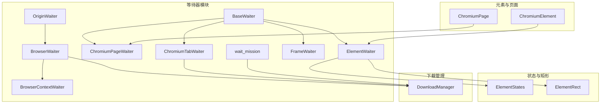
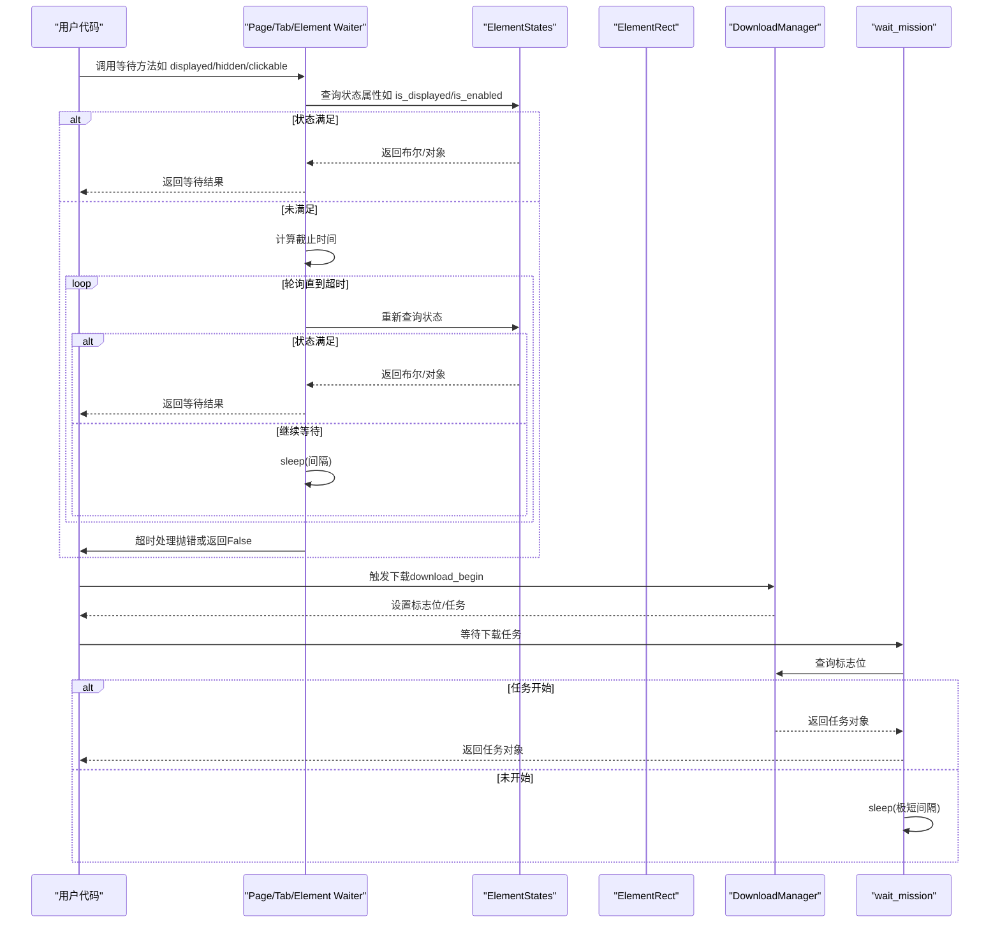
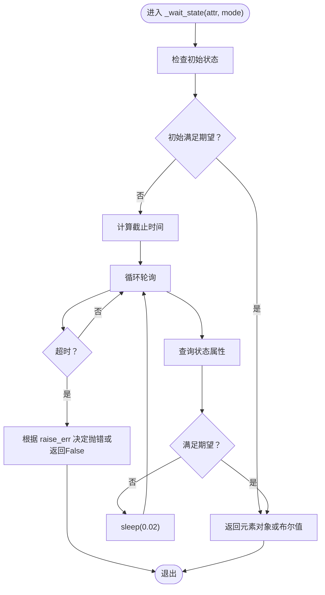
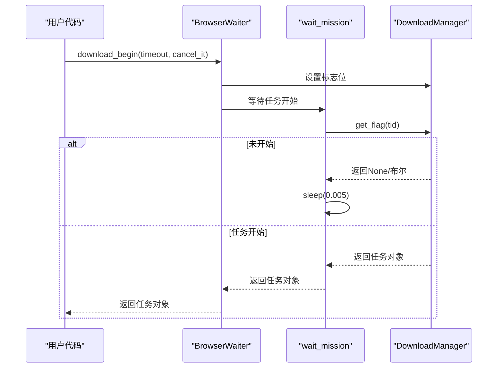
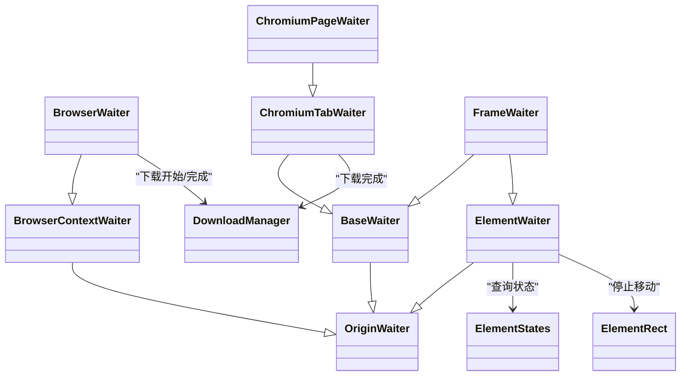

# 等待机制模块

<cite>
**本文引用的文件**
- [waiter.py](file://DrissionPage/_units/waiter.py)
- [waiter.pyi](file://DrissionPage/_units/waiter.pyi)
- [chromium_element.py](file://DrissionPage/_elements/chromium_element.py)
- [chromium_page.py](file://DrissionPage/_pages/chromium_page.py)
- [states.py](file://DrissionPage/_units/states.py)
- [rect.py](file://DrissionPage/_units/rect.py)
- [downloader.py](file://DrissionPage/_units/downloader.py)
- [errors.py](file://DrissionPage/errors.py)
- [settings.py](file://DrissionPage/_functions/settings.py)
- [tools.py](file://DrissionPage/_functions/tools.py)
</cite>

## 目录
1. [简介](#简介)
2. [项目结构](#项目结构)
3. [核心组件](#核心组件)
4. [架构总览](#架构总览)
5. [详细组件分析](#详细组件分析)
6. [依赖关系分析](#依赖关系分析)
7. [性能考量](#性能考量)
8. [故障排查指南](#故障排查指南)
9. [结论](#结论)
10. [附录](#附录)

## 简介
本文件深入解析 DrissionPage 的等待机制模块，重点围绕 Waiter 等待器的工作原理与实现细节展开，涵盖：
- 轮询策略与超时处理
- 元素等待：出现、消失、可见性变化等条件
- 条件等待的实现方式与自定义等待条件
- 超时处理机制与异常策略
- 实际应用场景与最佳实践（性能优化与资源管理）
- 等待器与其他模块的协作关系与集成方式

## 项目结构
等待机制主要位于 units 子模块中，配合元素、页面、状态、矩形等模块共同实现等待功能；同时与下载管理器协作处理下载相关的等待。

图表来源
- [waiter.py:15-433](file://DrissionPage/_units/waiter.py#L15-L433)
- [chromium_element.py:170-173](file://DrissionPage/_elements/chromium_element.py#L170-L173)
- [chromium_page.py:52-55](file://DrissionPage/_pages/chromium_page.py#L52-L55)
- [states.py:12-73](file://DrissionPage/_units/states.py#L12-L73)
- [rect.py:10-106](file://DrissionPage/_units/rect.py#L10-L106)
- [downloader.py:18-76](file://DrissionPage/_units/downloader.py#L18-L76)

章节来源
- [waiter.py:15-433](file://DrissionPage/_units/waiter.py#L15-L433)
- [chromium_element.py:170-173](file://DrissionPage/_elements/chromium_element.py#L170-L173)
- [chromium_page.py:52-55](file://DrissionPage/_pages/chromium_page.py#L52-L55)

## 核心组件
- OriginWaiter：基础等待器，支持固定/随机等待，作为所有等待器的基类。
- BrowserContextWaiter：上下文级等待器，提供新标签页等待能力。
- BrowserWaiter：浏览器级等待器，负责下载开始与下载完成等待。
- BaseWaiter：页面/标签页级等待器，提供元素等待、URL/Title变化、页面加载状态等通用等待。
- ChromiumTabWaiter：标签页级等待器，扩展了下载完成、弹窗关闭等能力。
- ChromiumPageWaiter：页面级等待器，复用浏览器等待器能力。
- ElementWaiter：元素级等待器，提供元素生命周期与状态等待（出现、消失、可见、可点击、可交互等）。
- FrameWaiter：框架等待器，继承页面与元素等待能力，适配框架场景。
- wait_mission：下载任务等待辅助函数。

章节来源
- [waiter.py:15-433](file://DrissionPage/_units/waiter.py#L15-L433)
- [waiter.pyi:20-665](file://DrissionPage/_units/waiter.pyi#L20-L665)

## 架构总览
等待机制采用“分层等待器 + 状态/矩形查询”的设计：
- 层级化等待器：按作用域划分（浏览器、页面、标签页、元素、框架），职责清晰。
- 状态驱动：元素等待依赖 ElementStates 提供的状态属性，避免直接操作 DOM，减少错误。
- 轮询策略：统一使用基于时间片的轮询，结合不同间隔（如 0.01~0.5 秒）平衡响应与开销。
- 超时控制：统一使用 perf_counter 计时，到期后根据 Settings.raise_when_wait_failed 决定抛错或返回 False。
- 下载集成：通过 DownloadManager 的标志位与 wait_mission 协作，实现下载开始/完成的等待。

图表来源
- [waiter.py:85-235](file://DrissionPage/_units/waiter.py#L85-L235)
- [states.py:12-73](file://DrissionPage/_units/states.py#L12-L73)
- [downloader.py:115-168](file://DrissionPage/_units/downloader.py#L115-L168)
- [waiter.py:421-432](file://DrissionPage/_units/waiter.py#L421-L432)

## 详细组件分析

### 基础等待器 OriginWaiter
- 功能：提供固定等待与随机等待（两参数时）。
- 使用：作为所有等待器的父类，统一等待入口。

章节来源
- [waiter.py:15-26](file://DrissionPage/_units/waiter.py#L15-L26)
- [waiter.pyi:20-32](file://DrissionPage/_units/waiter.pyi#L20-L32)

### 浏览器上下文等待器 BrowserContextWaiter
- 新标签页等待：比较“最新标签”在等待期间是否发生变化，变化即视为新标签出现。
- 超时处理：根据 Settings.raise_when_wait_failed 或显式 raise_err 参数决定抛错或返回 False。

章节来源
- [waiter.py:28-49](file://DrissionPage/_units/waiter.py#L28-L49)
- [waiter.pyi:34-62](file://DrissionPage/_units/waiter.pyi#L34-L62)

### 浏览器等待器 BrowserWaiter
- 下载开始：设置标志位，调用 wait_mission 等待任务开始。
- 下载完成：循环检查是否有未完成任务，支持超时取消剩余任务。

章节来源
- [waiter.py:52-83](file://DrissionPage/_units/waiter.py#L52-L83)
- [waiter.pyi:64-96](file://DrissionPage/_units/waiter.pyi#L64-L96)

### 页面/标签页等待器 BaseWaiter
- 元素等待：
  - ele_deleted：等待元素从 DOM 删除。
  - ele_displayed/ele_hidden：等待元素显示/隐藏，内部委托 ElementWaiter。
- 多元素加载等待：eles_loaded 支持“全部满足”或“任一满足”，使用 DOM.performSearch 查询节点。
- 页面加载等待：load_start/doc_loaded 通过内部 _loading 判断加载状态。
- URL/Title 变化：_change 封装 URL/Title 的包含/排除匹配等待。
- 上传路径输入：upload_paths_inputted 等待上传队列清空。
- 下载开始：针对页面/标签页的下载开始等待。

章节来源
- [waiter.py:85-235](file://DrissionPage/_units/waiter.py#L85-L235)
- [waiter.pyi:98-236](file://DrissionPage/_units/waiter.pyi#L98-L236)

### 标签页等待器 ChromiumTabWaiter
- 下载完成：针对当前标签页的任务集合进行等待，支持超时取消。
- 弹窗关闭：通过 states.has_alert 轮询等待弹窗关闭。

章节来源
- [waiter.py:237-276](file://DrissionPage/_units/waiter.py#L237-L276)
- [waiter.pyi:238-301](file://DrissionPage/_units/waiter.pyi#L238-L301)

### 页面等待器 ChromiumPageWaiter
- 复用浏览器等待器能力：new_tab、download_begin、all_downloads_done。
- URL/Title 变化：委托页面对象实现。

章节来源
- [waiter.py:278-287](file://DrissionPage/_units/waiter.py#L278-L287)
- [waiter.pyi:303-370](file://DrissionPage/_units/waiter.pyi#L303-L370)

### 元素等待器 ElementWaiter
- 状态等待：deleted/displayed/hidden/covered/not_covered/enabled/disabled/disabled_or_deleted/clickable/has_rect。
- 停止移动：stop_moving 通过连续检测元素矩形与位置变化判断是否稳定。
- 内部实现：_wait_state 通过 ElementStates 的属性进行轮询，满足条件立即返回，否则按间隔 sleep。

图表来源
- [waiter.py:390-408](file://DrissionPage/_units/waiter.py#L390-L408)
- [states.py:12-73](file://DrissionPage/_units/states.py#L12-L73)

章节来源
- [waiter.py:289-409](file://DrissionPage/_units/waiter.py#L289-L409)
- [waiter.pyi:371-510](file://DrissionPage/_units/waiter.pyi#L371-L510)

### 框架等待器 FrameWaiter
- 继承 BaseWaiter 与 ElementWaiter，适配框架场景。
- URL/Title 变化、元素状态等待均委托给框架内的元素对象。

章节来源
- [waiter.py:411-419](file://DrissionPage/_units/waiter.py#L411-L419)
- [waiter.pyi:511-557](file://DrissionPage/_units/waiter.pyi#L511-L557)

### 下载任务等待 wait_mission
- 通过 DownloadManager 的标志位实现“下载开始”等待。
- 在超时时间内轮询标志位，若非布尔值则表示任务已开始，返回任务对象并清除标志位。

图表来源
- [waiter.py:53-59](file://DrissionPage/_units/waiter.py#L53-L59)
- [waiter.py:421-432](file://DrissionPage/_units/waiter.py#L421-L432)
- [downloader.py:68-72](file://DrissionPage/_units/downloader.py#L68-L72)

章节来源
- [waiter.py:421-432](file://DrissionPage/_units/waiter.py#L421-L432)
- [downloader.py:115-168](file://DrissionPage/_units/downloader.py#L115-L168)

## 依赖关系分析
- 等待器与元素状态/矩形：
  - ElementWaiter 依赖 ElementStates 的布尔属性与 has_rect 的异常处理。
  - 停止移动依赖 ElementRect 的 size/location 查询。
- 等待器与下载管理：
  - BrowserWaiter/ChromiumTabWaiter 通过 DownloadManager 的标志位与 wait_mission 协作。
- 等待器与页面/标签页：
  - ChromiumPageWaiter/ChromiumTabWaiter 复用 BrowserWaiter 能力。
- 超时与异常：
  - 统一使用 perf_counter 计时，超时后依据 Settings.raise_when_wait_failed 或参数 raise_err 抛出 WaitTimeoutError。

图表来源
- [waiter.py:15-433](file://DrissionPage/_units/waiter.py#L15-L433)
- [states.py:12-73](file://DrissionPage/_units/states.py#L12-L73)
- [rect.py:10-106](file://DrissionPage/_units/rect.py#L10-L106)
- [downloader.py:18-76](file://DrissionPage/_units/downloader.py#L18-L76)

章节来源
- [waiter.py:15-433](file://DrissionPage/_units/waiter.py#L15-L433)
- [states.py:12-73](file://DrissionPage/_units/states.py#L12-L73)
- [rect.py:10-106](file://DrissionPage/_units/rect.py#L10-L106)
- [downloader.py:18-76](file://DrissionPage/_units/downloader.py#L18-L76)

## 性能考量
- 轮询间隔选择：
  - 元素状态等待：0.02 秒，兼顾响应与 CPU 占用。
  - 页面加载等待：0.01 秒；URL/Title 变化：0.05 秒；下载完成：0.5 秒；下载开始：0.005 秒。
- 超时控制：
  - 统一使用 perf_counter 计时，避免阻塞线程。
  - 对于超时为 0 的极端情况，内部会调整为最小阈值（如 0.1 秒）。
- 资源管理：
  - 下载完成后及时清理标志位与任务集合，避免内存泄漏。
  - 停止移动时捕获 NoRectError 并在超时后抛出，防止无效轮询。
- 最佳实践：
  - 合理设置 timeout，避免过长导致流程阻塞。
  - 对频繁等待的场景，优先使用元素状态属性而非多次 DOM 查询。
  - 对下载等待，建议在超时后取消剩余任务，避免资源浪费。

[本节为通用性能指导，无需特定文件来源]

## 故障排查指南
- 超时异常：
  - 当 raise_err 为 True 或 Settings.raise_when_wait_failed 为 True 时，等待超时将抛出 WaitTimeoutError。
- 元素无矩形：
  - 停止移动等待可能触发 NoRectError，通常表示元素尚未布局完成或不可见。
- 下载未开始：
  - 若 download_begin 返回 False，检查是否设置了下载路径以及标志位是否被正确设置。
- 页面断开/元素丢失：
  - 等待过程中可能出现 PageDisconnectedError/ElementLostError，需重试或重建连接。

章节来源
- [errors.py:69-70](file://DrissionPage/errors.py#L69-L70)
- [waiter.py:372-377](file://DrissionPage/_units/waiter.py#L372-L377)
- [downloader.py:47-56](file://DrissionPage/_units/downloader.py#L47-L56)
- [tools.py:157-198](file://DrissionPage/_functions/tools.py#L157-L198)

## 结论
DrissionPage 的等待机制通过分层等待器与状态/矩形查询相结合，实现了高可靠、可定制的等待能力。其轮询策略与超时处理兼顾性能与稳定性，下载等待通过 DownloadManager 的标志位实现解耦。在实际应用中，应根据场景合理设置超时、选择合适的等待器类型，并遵循最佳实践以提升自动化脚本的健壮性与效率。

[本节为总结性内容，无需特定文件来源]

## 附录

### 等待器与页面/元素的集成点
- 页面/标签页等待器通过 owner 引用页面对象，间接访问 driver 与 states。
- 元素等待器通过 owner 引用元素对象，直接访问 states 与 rect。

章节来源
- [chromium_page.py:52-55](file://DrissionPage/_pages/chromium_page.py#L52-L55)
- [chromium_element.py:170-173](file://DrissionPage/_elements/chromium_element.py#L170-L173)