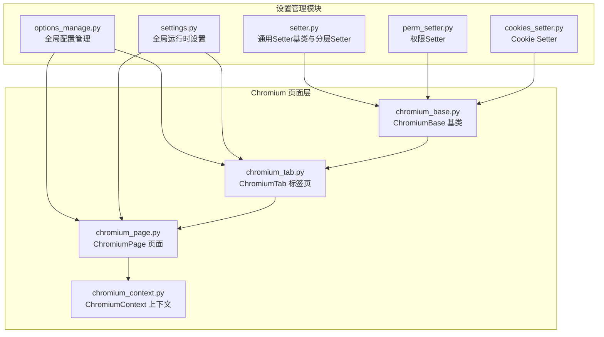
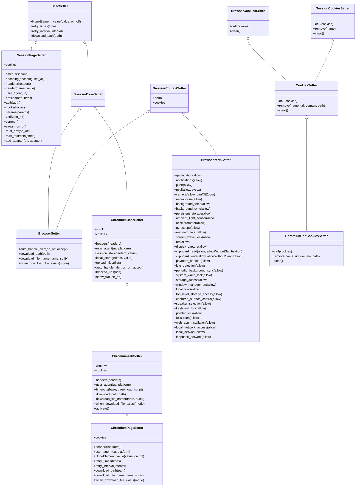
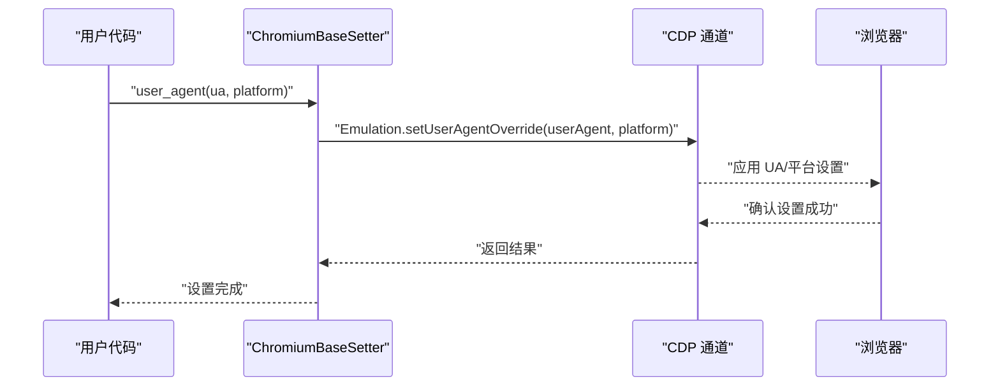
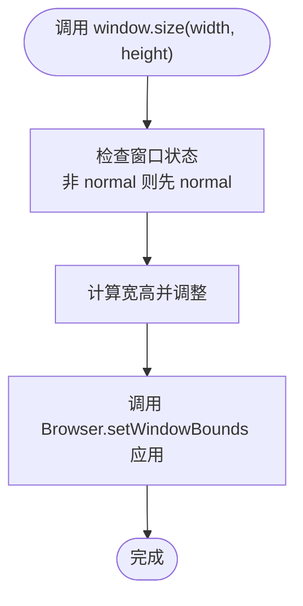
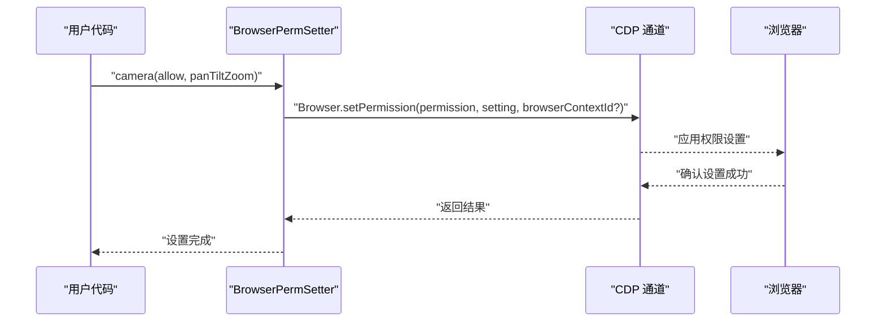
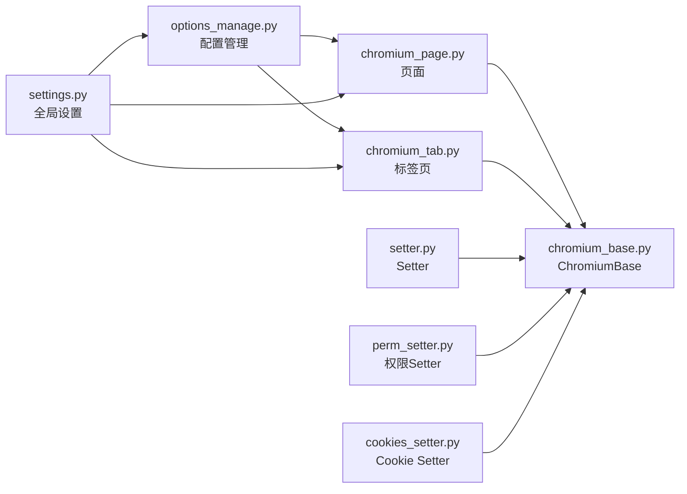

# 设置管理模块

<cite>
**本文档引用的文件**
- [setter.py](file://DrissionPage/_units/setter.py)
- [perm_setter.py](file://DrissionPage/_units/perm_setter.py)
- [cookies_setter.py](file://DrissionPage/_units/cookies_setter.py)
- [options_manage.py](file://DrissionPage/_configs/options_manage.py)
- [settings.py](file://DrissionPage/_functions/settings.py)
- [chromium_context.py](file://DrissionPage/_browsers/chromium_context.py)
- [chromium_page.py](file://DrissionPage/_pages/chromium_page.py)
- [chromium_tab.py](file://DrissionPage/_pages/chromium_tab.py)
- [chromium_base.py](file://DrissionPage/_pages/chromium_base.py)
</cite>

## 目录
1. [简介](#简介)
2. [项目结构](#项目结构)
3. [核心组件](#核心组件)
4. [架构总览](#架构总览)
5. [详细组件分析](#详细组件分析)
6. [依赖关系分析](#依赖关系分析)
7. [性能考量](#性能考量)
8. [故障排查指南](#故障排查指南)
9. [结论](#结论)

## 简介
本章节系统性介绍 DrissionPage 的设置管理模块，重点阐述 Setter 设置器的功能与作用，涵盖页面设置、浏览器设置与全局配置的统一管理。内容包括：
- 设置项的含义与影响范围（如视口大小、用户代理、语言设置、权限配置等）
- 设置的优先级与覆盖规则
- 设置生效的时机与方式
- 与浏览器 CDP 协议的交互机制与底层实现原理
- 设置变更对页面行为的影响与注意事项
- 实际使用示例与最佳实践

## 项目结构
设置管理模块主要分布在以下文件中：
- setter.py：定义各类 Setter 类，负责页面、会话、浏览器与标签页的设置操作
- perm_setter.py：封装浏览器权限设置，基于 CDP Browser.setPermission
- cookies_setter.py：封装 Cookie 设置与清理，支持会话、标签页与浏览器级别
- options_manage.py：全局配置管理，读取/写入 ini 配置文件
- settings.py：全局运行时设置（如超时、语言、错误处理策略等）
- chromium_context.py、chromium_page.py、chromium_tab.py、chromium_base.py：与 Chromium 浏览器交互的基础类，承载 CDP 调用与设置生效逻辑

图表来源
- [setter.py:1-619](file://DrissionPage/_units/setter.py#L1-L619)
- [perm_setter.py:1-311](file://DrissionPage/_units/perm_setter.py#L1-L311)
- [cookies_setter.py:1-82](file://DrissionPage/_units/cookies_setter.py#L1-L82)
- [options_manage.py:1-143](file://DrissionPage/_configs/options_manage.py#L1-L143)
- [settings.py:1-69](file://DrissionPage/_functions/settings.py#L1-L69)
- [chromium_base.py:1-200](file://DrissionPage/_pages/chromium_base.py#L1-L200)
- [chromium_tab.py:1-200](file://DrissionPage/_pages/chromium_tab.py#L1-L200)
- [chromium_page.py:1-103](file://DrissionPage/_pages/chromium_page.py#L1-L103)
- [chromium_context.py:1-62](file://DrissionPage/_browsers/chromium_context.py#L1-L62)

章节来源
- [setter.py:1-619](file://DrissionPage/_units/setter.py#L1-L619)
- [chromium_base.py:1-200](file://DrissionPage/_pages/chromium_base.py#L1-L200)

## 核心组件
- BaseSetter：所有 Setter 的基础类，提供通用设置能力（如 NoneElement 返回值、重试次数与间隔、下载路径等）
- SessionPageSetter：会话页面级别的设置器，支持请求头、用户代理、超时、编码、下载路径等
- BrowserContextSetter：浏览器上下文级别的设置器，提供权限与 Cookie 设置入口
- BrowserSetter：浏览器级别的设置器，扩展自动弹窗处理、下载路径与文件名策略
- ChromiumBaseSetter：Chromium 基础设置器，提供滚动、Cookie、请求头、用户代理、本地/会话存储、上传文件、阻止 URL、鼠标轨迹等功能
- ChromiumTabSetter：标签页级别的设置器，整合会话与 Chromium 设置，支持窗口控制、下载策略、激活标签等
- ChromiumPageSetter：页面级别的设置器，继承标签页设置器并扩展全局设置同步
- ChromiumElementSetter：元素级别的设置器，支持属性、样式、innerHTML、value 等设置
- BrowserPermSetter：权限设置器，通过 CDP Browser.setPermission 设置各类权限
- CookiesSetter 系列：按作用域区分的 Cookie 设置器，支持删除与清理

章节来源
- [setter.py:41-619](file://DrissionPage/_units/setter.py#L41-L619)
- [perm_setter.py:1-311](file://DrissionPage/_units/perm_setter.py#L1-L311)
- [cookies_setter.py:1-82](file://DrissionPage/_units/cookies_setter.py#L1-L82)

## 架构总览
Setter 设置器通过分层设计实现“页面/标签页/会话/浏览器”多层级的设置管理，并以 CDP 协议与浏览器交互，确保设置即时生效。整体架构如下：

图表来源
- [setter.py:41-619](file://DrissionPage/_units/setter.py#L41-L619)
- [perm_setter.py:1-311](file://DrissionPage/_units/perm_setter.py#L1-L311)
- [cookies_setter.py:1-82](file://DrissionPage/_units/cookies_setter.py#L1-L82)

## 详细组件分析

### 页面设置（SessionPageSetter）
- 功能要点
  - 请求头与单个头部设置：支持动态更新请求头，适用于模拟不同客户端特征
  - 用户代理设置：直接修改请求头中的 UA 字段
  - 编码设置：可同时设置响应编码与内部编码
  - 超时设置：统一管理请求与等待超时
  - 下载路径设置：同步更新下载器保存路径
  - 代理、认证、钩子、参数、证书、流式传输、环境信任、最大重定向等：与底层会话对象绑定
- 生效时机
  - 头部与 UA 设置在调用时立即生效于后续请求
  - 编码与超时在对象生命周期内影响后续操作
- 使用建议
  - 在发起请求前集中设置头部与 UA，避免频繁切换
  - 对于需要持久化的会话状态，结合 Cookie 设置器进行管理

章节来源
- [setter.py:41-104](file://DrissionPage/_units/setter.py#L41-L104)

### 浏览器设置（BrowserSetter）
- 功能要点
  - 自动弹窗处理：支持接受或关闭弹窗，或禁用自动处理
  - 下载路径与文件名策略：支持重命名、覆盖、跳过等策略
- 生效时机
  - 下载策略在下载管理器中即时生效
- 使用建议
  - 在批量下载场景中，合理选择文件名策略以避免冲突

章节来源
- [setter.py:146-165](file://DrissionPage/_units/setter.py#L146-L165)

### Chromium 基础设置（ChromiumBaseSetter）
- 功能要点
  - 请求头设置：通过 CDP Network.setExtraHTTPHeaders 设置额外请求头
  - 用户代理设置：通过 CDP Emulation.setUserAgentOverride 设置 UA 与平台
  - 本地/会话存储：通过 DOMStorage 与 Storage 接口设置或移除键值
  - 上传文件：启用文件选择拦截并设置待上传文件列表
  - 弹窗处理：通过内部 alert 控制器设置自动处理策略
  - 阻止 URL：通过 CDP Network.setBlockedURLs 阻止特定资源加载
  - 鼠标轨迹：注入脚本在页面上绘制鼠标轨迹，便于调试
- 生效时机
  - 大部分设置在调用 CDP 后立即生效；部分需要页面重新加载或触发事件
- 使用建议
  - 设置 UA 与平台时注意与实际设备一致，避免被站点识别异常
  - 使用阻断 URL 时需谨慎，避免阻断关键资源导致页面异常

图表来源
- [setter.py:182-190](file://DrissionPage/_units/setter.py#L182-L190)

章节来源
- [setter.py:167-361](file://DrissionPage/_units/setter.py#L167-L361)

### 标签页设置（ChromiumTabSetter）
- 功能要点
  - 窗口控制：最大化、最小化、全屏、常规尺寸、位置调整、显示/隐藏
  - 下载策略：与浏览器下载管理器联动，支持重命名与冲突处理
  - 激活标签：切换当前活动标签
  - 组合设置：根据当前模式（d/s）选择会话或 Chromium 设置路径
- 生效时机
  - 窗口尺寸与位置在 CDP Browser.setWindowBounds 中即时生效
  - 下载策略在下载管理器中即时生效
- 使用建议
  - 在多标签并行场景中，使用激活标签确保后续操作在正确标签执行

图表来源
- [setter.py:582-591](file://DrissionPage/_units/setter.py#L582-L591)

章节来源
- [setter.py:364-417](file://DrissionPage/_units/setter.py#L364-L417)

### 页面设置（ChromiumPageSetter）
- 功能要点
  - 继承标签页设置器的所有能力
  - 同步全局设置：将页面设置同步到浏览器与会话对象
- 使用建议
  - 在页面级统一配置时，优先使用页面设置器以确保全局一致性

章节来源
- [setter.py:419-470](file://DrissionPage/_units/setter.py#L419-L470)

### 权限设置（BrowserPermSetter）
- 功能要点
  - 支持地理位置、通知、推送、MIDI、摄像头、麦克风、后台获取/同步、持久化存储、传感器、唤醒锁、NFC、屏幕捕获、剪贴板、支付、空闲检测、周期性后台同步、系统唤醒锁、存储访问、窗口管理、本地字体、顶级存储访问、表面控制、扬声器选择、键盘锁定、指针锁定、全屏、Web 应用安装、本地网络访问/网络/回环网络等权限
  - 通过 CDP Browser.setPermission 设置权限，支持带上下文 ID 的隔离
- 生效时机
  - 权限设置在 CDP 层即时生效，页面后续请求将遵循新权限
- 使用建议
  - 在需要模拟真实用户授权场景时，提前设置权限以避免页面弹窗干扰自动化流程

图表来源
- [perm_setter.py:45-57](file://DrissionPage/_units/perm_setter.py#L45-L57)

章节来源
- [perm_setter.py:1-311](file://DrissionPage/_units/perm_setter.py#L1-L311)

### Cookie 设置（CookiesSetter 系列）
- 功能要点
  - 浏览器级 Cookie 设置与清理
  - 标签页级 Cookie 设置、删除与清理（支持按名称、URL、域名、路径过滤）
  - 会话级 Cookie 设置、删除与清理
- 生效时机
  - 设置与清理在 CDP 或会话层即时生效
- 使用建议
  - 在跨域场景中，优先使用标签页级 Cookie 设置以避免跨域限制

章节来源
- [cookies_setter.py:1-82](file://DrissionPage/_units/cookies_setter.py#L1-L82)

### 元素设置（ChromiumElementSetter）
- 功能要点
  - 属性设置：通过 DOM.setAttributeValue 设置节点属性
  - 属性/样式/innerHTML/value 设置：通过 JS 执行或 DOM 接口设置
- 使用建议
  - 设置样式失败时抛出运行时错误，需确保元素存在且可编辑

章节来源
- [setter.py:471-500](file://DrissionPage/_units/setter.py#L471-L500)

## 依赖关系分析
- 分层耦合
  - BaseSetter 作为基础，向上派生出 SessionPageSetter、BrowserBaseSetter、ChromiumBaseSetter 等
  - ChromiumBaseSetter 再派生出 ChromiumTabSetter 与 ChromiumPageSetter，形成清晰的职责边界
  - 权限与 Cookie 设置器独立于页面设置器，通过组合方式接入
- 外部依赖
  - CDP 协议：所有设置器最终通过 _run_cdp 或 _run_cdp_loaded 调用浏览器 CDP 接口
  - 全局配置：OptionsManager 提供 ini 文件读写，Settings 提供全局运行时设置
- 潜在循环依赖
  - Setter 与 Chromium 基类相互依赖（Setter 调用 _run_cdp），但通过方法调用而非导入循环，避免循环依赖

图表来源
- [settings.py:1-69](file://DrissionPage/_functions/settings.py#L1-L69)
- [options_manage.py:1-143](file://DrissionPage/_configs/options_manage.py#L1-L143)
- [chromium_page.py:1-103](file://DrissionPage/_pages/chromium_page.py#L1-L103)
- [chromium_tab.py:1-200](file://DrissionPage/_pages/chromium_tab.py#L1-L200)
- [chromium_base.py:1-200](file://DrissionPage/_pages/chromium_base.py#L1-L200)
- [setter.py:1-619](file://DrissionPage/_units/setter.py#L1-L619)
- [perm_setter.py:1-311](file://DrissionPage/_units/perm_setter.py#L1-L311)
- [cookies_setter.py:1-82](file://DrissionPage/_units/cookies_setter.py#L1-L82)

章节来源
- [chromium_context.py:1-62](file://DrissionPage/_browsers/chromium_context.py#L1-L62)

## 性能考量
- CDP 调用频率
  - 频繁设置请求头或 UA 可能导致页面重新加载或触发额外网络请求，建议批量设置后再发起请求
- 存储设置
  - DOMStorage 与 Storage 接口调用涉及序列化与反序列化，大量键值操作可能影响性能
- 下载策略
  - 文件名策略与冲突处理在下载管理器中执行，建议在批量下载时统一策略以减少 IO 开销
- 窗口控制
  - 窗口尺寸与位置调整在 CDP 层执行，频繁调整可能导致页面布局重排，建议合并多次调整

## 故障排查指南
- 设置未生效
  - 检查是否在正确的模式（d/s）下调用对应设置器
  - 确认 CDP 调用是否成功，必要时增加日志输出
- 权限设置无效
  - 确认是否传入了正确的权限名称与允许状态
  - 若使用上下文隔离，确认是否传递了正确的 browserContextId
- Cookie 设置失败
  - 跨域场景下优先使用标签页级 Cookie 设置
  - 删除 Cookie 时需提供 URL 或域名，否则会抛出错误
- 下载策略异常
  - 确认文件名策略是否在允许范围内
  - 检查下载路径是否存在且有写入权限

章节来源
- [cookies_setter.py:30-67](file://DrissionPage/_units/cookies_setter.py#L30-L67)
- [setter.py:157-164](file://DrissionPage/_units/setter.py#L157-L164)

## 结论
DrissionPage 的设置管理模块通过分层 Setter 设计与 CDP 协议集成，实现了从页面到浏览器的多层级设置统一管理。其特点包括：
- 清晰的职责划分与组合复用
- 即时生效的 CDP 驱动
- 广泛的设置项覆盖（请求头、UA、权限、Cookie、下载、窗口等）
- 与全局配置与运行时设置的协同

在实际使用中，建议：
- 明确设置项的作用域与优先级，避免重复设置造成冲突
- 在复杂场景中，优先使用页面级设置器进行全局同步
- 注意 CDP 调用的时机与频率，平衡性能与稳定性
- 针对权限与 Cookie 等敏感设置，提前规划并验证生效情况