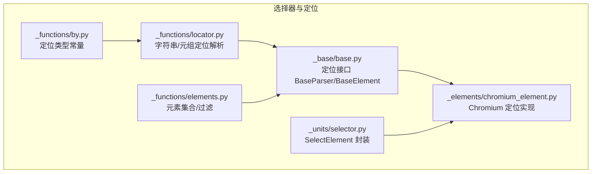
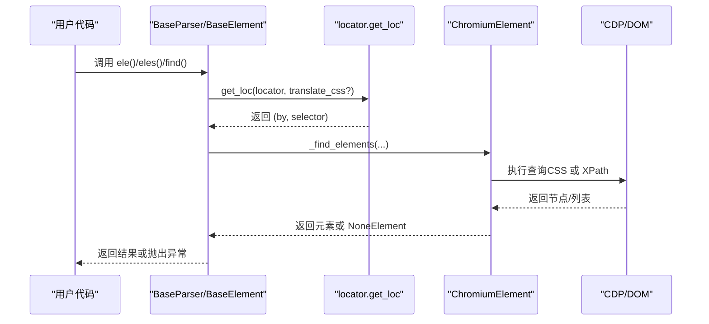
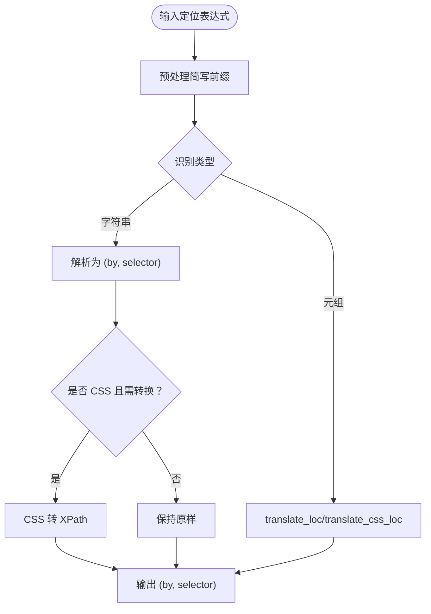
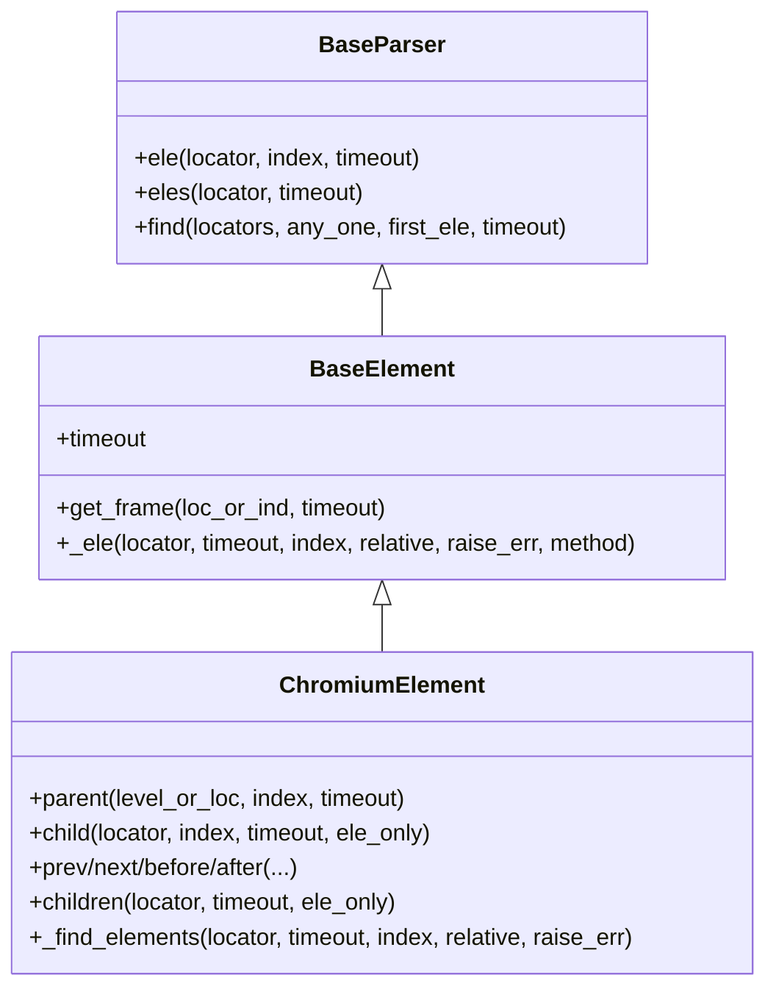
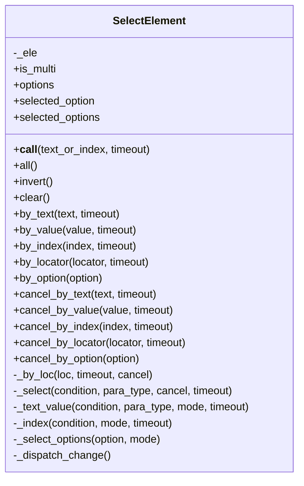
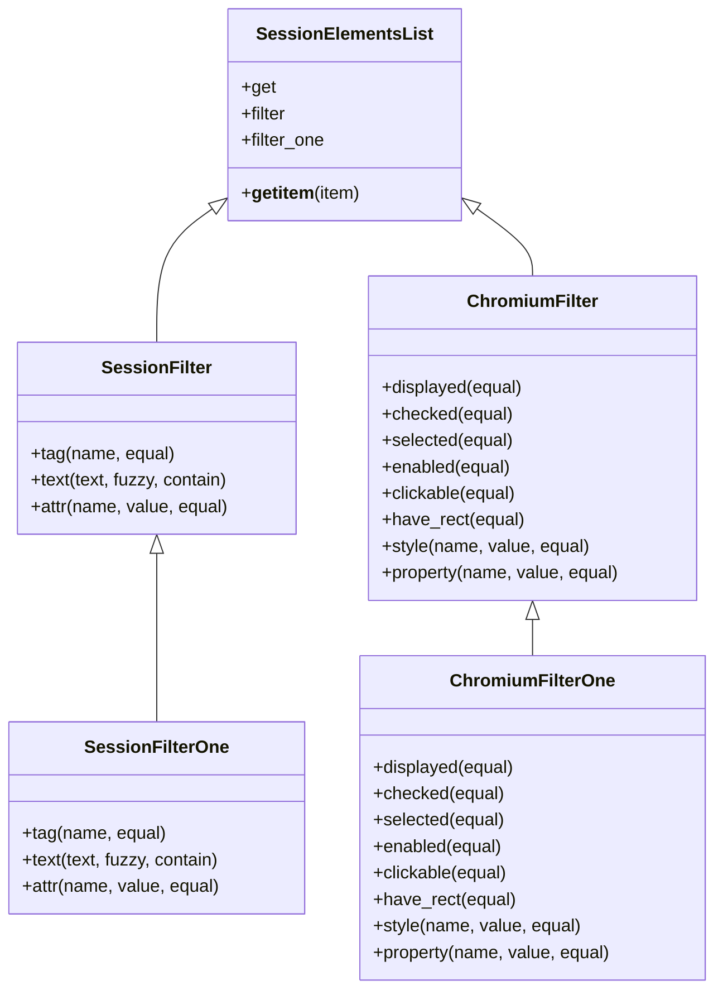
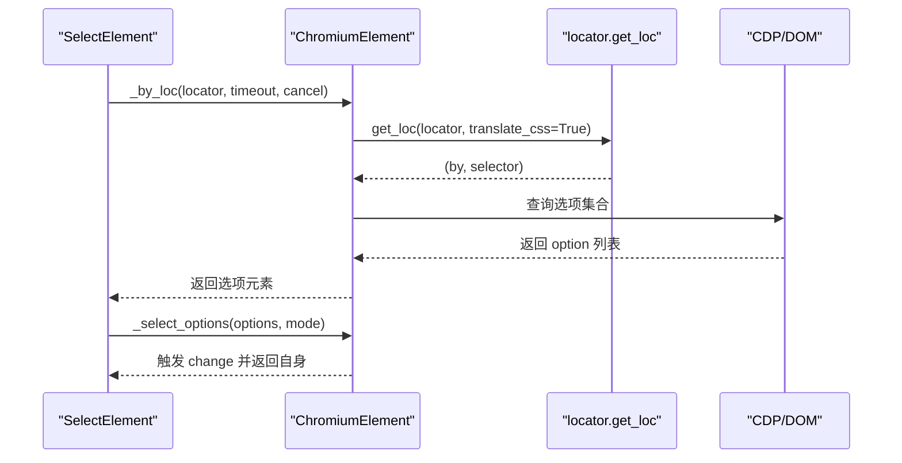
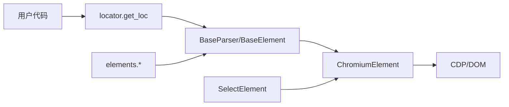

# 选择器模块

<cite>
**本文引用的文件**
- [selector.py](file://DrissionPage/_units/selector.py)
- [selector.pyi](file://DrissionPage/_units/selector.pyi)
- [locator.py](file://DrissionPage/_functions/locator.py)
- [by.py](file://DrissionPage/_functions/by.py)
- [elements.py](file://DrissionPage/_functions/elements.py)
- [base.py](file://DrissionPage/_base/base.py)
- [chromium_element.py](file://DrissionPage/_elements/chromium_element.py)
- [chromium_element.pyi](file://DrissionPage/_elements/chromium_element.pyi)
- [settings.py](file://DrissionPage/_functions/settings.py)
- [errors.py](file://DrissionPage/errors.py)
</cite>

## 目录
1. [简介](#简介)
2. [项目结构](#项目结构)
3. [核心组件](#核心组件)
4. [架构总览](#架构总览)
5. [详细组件分析](#详细组件分析)
6. [依赖分析](#依赖分析)
7. [性能考虑](#性能考虑)
8. [故障排查指南](#故障排查指南)
9. [结论](#结论)
10. [附录](#附录)

## 简介
本文件系统性介绍 DrissionPage 的选择器模块，涵盖选择器的创建与配置、XPath/CSS/文本等多类型选择器的使用方法、自定义与扩展思路、性能优化策略、复杂场景实战与最佳实践，以及选择器与元素定位的集成关系。读者无需深入编程背景即可理解并高效使用。

## 项目结构
选择器模块主要分布在以下文件中：
- 选择器工具与类型常量：_functions/by.py、_functions/locator.py
- 下拉选择器封装：_units/selector.py、_units/selector.pyi
- 元素集合与过滤：_functions/elements.py
- 基类与定位接口：_base/base.py
- Chromium 元素定位实现：_elements/chromium_element.py、_elements/chromium_element.pyi
- 配置与错误类型：_functions/settings.py、errors.py

**图表来源**
- [by.py:10-19](file://DrissionPage/_functions/by.py#L10-L19)
- [locator.py:15-51](file://DrissionPage/_functions/locator.py#L15-L51)
- [selector.py:13-161](file://DrissionPage/_units/selector.py#L13-L161)
- [elements.py:276-303](file://DrissionPage/_functions/elements.py#L276-L303)
- [base.py:29-68](file://DrissionPage/_base/base.py#L29-L68)
- [chromium_element.py:859-917](file://DrissionPage/_elements/chromium_element.py#L859-L917)

**章节来源**
- [by.py:10-19](file://DrissionPage/_functions/by.py#L10-L19)
- [locator.py:15-51](file://DrissionPage/_functions/locator.py#L15-L51)
- [selector.py:13-161](file://DrissionPage/_units/selector.py#L13-L161)
- [elements.py:276-303](file://DrissionPage/_functions/elements.py#L276-L303)
- [base.py:29-68](file://DrissionPage/_base/base.py#L29-L68)
- [chromium_element.py:859-917](file://DrissionPage/_elements/chromium_element.py#L859-L917)

## 核心组件
- 定位类型常量：By 提供标准定位类型（如 id、xpath、css selector 等），用于统一不同定位方式的表达。
- 字符串定位解析：locator 模块负责将字符串形式的定位表达式（如 tag:text@attr=value）解析为标准定位元组（by, selector）。
- 元素定位接口：BaseParser/BaseElement 定义了 ele/eles/find 等统一入口，屏蔽底层差异。
- Chromium 定位实现：ChromiumElement 在 CDP/DOM 查询层实现具体定位逻辑，支持 CSS/XPath。
- SelectElement：专门封装 select 下拉框的选择操作，支持按文本、值、索引及定位器选择，支持多选与事件派发。
- 元素集合与过滤：elements 提供 SessionElementsList/ChromiumElementsList 及其过滤器，便于链式筛选与检索。

**章节来源**
- [by.py:10-19](file://DrissionPage/_functions/by.py#L10-L19)
- [locator.py:96-116](file://DrissionPage/_functions/locator.py#L96-L116)
- [base.py:29-68](file://DrissionPage/_base/base.py#L29-L68)
- [chromium_element.py:859-917](file://DrissionPage/_elements/chromium_element.py#L859-L917)
- [selector.py:13-161](file://DrissionPage/_units/selector.py#L13-L161)
- [elements.py:16-62](file://DrissionPage/_functions/elements.py#L16-L62)

## 架构总览
选择器模块采用“高层抽象 + 底层适配”的分层设计：
- 表达层：用户通过字符串或元组表达定位意图（如 tag:text@id=... 或 (By.CSS_SELECTOR, "...")）。
- 解析层：locator 将表达式标准化为 (by, selector) 元组，并在必要时将 CSS 转换为 XPath。
- 接口层：BaseParser/BaseElement 统一对外提供 ele/eles/find 方法。
- 执行层：ChromiumElement 使用 CDP/DOM 查询执行定位；SelectElement 对 select 元素进行专用操作。
- 过滤层：elements 提供链式过滤与搜索能力，支持按状态、文本、属性等条件筛选。

**图表来源**
- [base.py:33-51](file://DrissionPage/_base/base.py#L33-L51)
- [locator.py:96-116](file://DrissionPage/_functions/locator.py#L96-L116)
- [chromium_element.py:859-917](file://DrissionPage/_elements/chromium_element.py#L859-L917)

## 详细组件分析

### 1) 定位类型与表达式解析
- 定位类型常量：By 提供标准键值，确保跨平台一致。
- 字符串定位规则：
  - 支持前缀简写（如 . 表示 @class=、# 表示 @id=、t: 表示 tag:、x:/c: 表示 xpath:/css: 等）。
  - 支持多属性组合（@@ 与 @| 表示 AND/OR，@! 表示否定），以及文本匹配（=、:、^、$）。
  - 自动将 CSS 表达式在需要时转换为 XPath，以兼容 DOM 查询。
- Selenium 风格元组：translate_loc/translate_css_loc 将 (By.*, selector) 转换为标准定位。

**图表来源**
- [locator.py:15-51](file://DrissionPage/_functions/locator.py#L15-L51)
- [locator.py:147-196](file://DrissionPage/_functions/locator.py#L147-L196)
- [locator.py:468-503](file://DrissionPage/_functions/locator.py#L468-L503)
- [locator.py:506-543](file://DrissionPage/_functions/locator.py#L506-L543)

**章节来源**
- [by.py:10-19](file://DrissionPage/_functions/by.py#L10-L19)
- [locator.py:15-51](file://DrissionPage/_functions/locator.py#L15-L51)
- [locator.py:147-196](file://DrissionPage/_functions/locator.py#L147-L196)
- [locator.py:468-503](file://DrissionPage/_functions/locator.py#L468-L503)
- [locator.py:506-543](file://DrissionPage/_functions/locator.py#L506-L543)

### 2) 元素定位接口与实现
- BaseParser/BaseElement 提供统一入口：ele/eles/find，内部调用 _find_elements 执行定位。
- ChromiumElement 实现具体定位：优先使用 DOM.querySelector/DOM.querySelectorAll（CSS），否则回退到通用实现；同时支持相对路径定位（parent/child/prev/next 等）。
- 错误处理：未找到元素时，根据设置决定抛出异常或返回 NoneElement。

**图表来源**
- [base.py:29-68](file://DrissionPage/_base/base.py#L29-L68)
- [base.py:70-118](file://DrissionPage/_base/base.py#L70-L118)
- [base.py:270-371](file://DrissionPage/_base/base.py#L270-L371)
- [chromium_element.py:859-917](file://DrissionPage/_elements/chromium_element.py#L859-L917)

**章节来源**
- [base.py:29-68](file://DrissionPage/_base/base.py#L29-L68)
- [base.py:70-118](file://DrissionPage/_base/base.py#L70-L118)
- [base.py:270-371](file://DrissionPage/_base/base.py#L270-L371)
- [chromium_element.py:859-917](file://DrissionPage/_elements/chromium_element.py#L859-L917)

### 3) SelectElement 下拉选择器
- 适用范围：仅限 <select> 元素，支持单选与多选。
- 主要能力：
  - 按文本、值、索引选择；支持取消选择。
  - 按定位器选择（如 tag:option）。
  - 全选、反选、清空。
  - 选择后自动触发 change 事件，保证 UI 同步。
- 超时与重试：内部循环等待选项出现，结合超时控制避免死等。
- 错误约束：单选元素不允许传入列表；非多选时多选会截断为一项。

**图表来源**
- [selector.py:13-161](file://DrissionPage/_units/selector.py#L13-L161)
- [selector.pyi:13-82](file://DrissionPage/_units/selector.pyi#L13-L82)

**章节来源**
- [selector.py:13-161](file://DrissionPage/_units/selector.py#L13-L161)
- [selector.pyi:13-82](file://DrissionPage/_units/selector.pyi#L13-L82)

### 4) 元素集合与过滤
- SessionElementsList/ChromiumElementsList：提供链式过滤与检索，支持按标签、文本、属性、状态等筛选。
- SessionFilterOne/SessionFilter：单个/多个结果的过滤器，支持 index 控制返回第 N 个匹配项。
- ChromiumFilterOne/ChromiumFilter：在 Chromium 环境下增加显示、选中、启用、可点击、有矩形等状态过滤。
- 搜索函数：_search/_search_one 支持或关系组合筛选。

**图表来源**
- [elements.py:16-62](file://DrissionPage/_functions/elements.py#L16-L62)
- [elements.py:130-161](file://DrissionPage/_functions/elements.py#L130-L161)
- [elements.py:163-260](file://DrissionPage/_functions/elements.py#L163-L260)
- [elements.py:206-260](file://DrissionPage/_functions/elements.py#L206-L260)

**章节来源**
- [elements.py:16-62](file://DrissionPage/_functions/elements.py#L16-L62)
- [elements.py:130-161](file://DrissionPage/_functions/elements.py#L130-L161)
- [elements.py:163-260](file://DrissionPage/_functions/elements.py#L163-L260)
- [elements.py:206-260](file://DrissionPage/_functions/elements.py#L206-L260)

### 5) 选择器与元素定位的集成
- SelectElement 通过 ChromiumElement 的定位能力完成选项查找（如 tag:option），再对 option 元素执行选中/取消。
- ChromiumElement 的 _find_elements 支持相对路径定位（例如 ./following-sibling::*），并与 locator.get_loc 结合，确保 CSS 与 XPath 的一致性。
- 当定位失败时，根据全局设置决定抛出异常或返回 NoneElement，便于上层统一处理。

**图表来源**
- [selector.py:95-104](file://DrissionPage/_units/selector.py#L95-L104)
- [locator.py:96-116](file://DrissionPage/_functions/locator.py#L96-L116)
- [chromium_element.py:859-917](file://DrissionPage/_elements/chromium_element.py#L859-L917)

**章节来源**
- [selector.py:95-104](file://DrissionPage/_units/selector.py#L95-L104)
- [locator.py:96-116](file://DrissionPage/_functions/locator.py#L96-L116)
- [chromium_element.py:859-917](file://DrissionPage/_elements/chromium_element.py#L859-L917)

## 依赖分析
- 低耦合高内聚：选择器解析与定位实现分离，定位接口与具体实现解耦。
- 关键依赖链：
  - 用户输入 → locator.get_loc → BaseParser/BaseElement → ChromiumElement → CDP/DOM
  - SelectElement 依赖 ChromiumElement 的定位与事件派发能力
  - elements 提供的过滤器依赖 BaseElement 的属性与状态访问

**图表来源**
- [locator.py:96-116](file://DrissionPage/_functions/locator.py#L96-L116)
- [base.py:33-51](file://DrissionPage/_base/base.py#L33-L51)
- [chromium_element.py:859-917](file://DrissionPage/_elements/chromium_element.py#L859-L917)
- [selector.py:13-161](file://DrissionPage/_units/selector.py#L13-L161)
- [elements.py:276-303](file://DrissionPage/_functions/elements.py#L276-L303)

**章节来源**
- [locator.py:96-116](file://DrissionPage/_functions/locator.py#L96-L116)
- [base.py:33-51](file://DrissionPage/_base/base.py#L33-L51)
- [chromium_element.py:859-917](file://DrissionPage/_elements/chromium_element.py#L859-L917)
- [selector.py:13-161](file://DrissionPage/_units/selector.py#L13-L161)
- [elements.py:276-303](file://DrissionPage/_functions/elements.py#L276-L303)

## 性能考虑
- 优先使用 CSS 选择器：在 ChromiumElement 中，CSS 查询路径更短（querySelector/querySelectorAll），通常比 XPath 更快。
- 合理设置超时：通过 timeout 参数控制等待时间，避免无限等待；对批量定位使用 find(any_one/first_ele) 减少重复查询。
- 链式过滤减少范围：先用宽泛定位缩小范围，再用过滤器精确命中，降低 DOM 遍历成本。
- 文本匹配尽量精确：使用 = 或 ^/$ 精确匹配，避免大范围 contains 导致的大量候选节点。
- 多选下拉：SelectElement 内部循环等待选项出现，建议提供更精确的定位器（如 tag:option@value=...）以减少轮询次数。

[本节为通用性能建议，不直接分析具体文件]

## 故障排查指南
- 定位错误（LocatorError）：检查定位表达式是否符合规范（符号冲突、长度、类型），确认是否使用了不支持的 CSS 语法（相对路径父级选择等）。
- 元素未找到（ElementNotFoundError）：确认超时设置是否合理；查看是否返回了 NoneElement；必要时开启 raise_when_ele_not_found。
- 下拉选择异常：
  - 非 select 元素调用 select 方法：确保元素类型正确。
  - 单选传入列表：单选元素不支持列表参数。
  - 选项不存在：确认选项文本/值/索引是否正确，或使用 by_locator 提供更精确的定位器。
- 设置与语言：通过 Settings 类调整抛错策略与语言，便于调试与日志理解。

**章节来源**
- [errors.py:89-90](file://DrissionPage/errors.py#L89-L90)
- [errors.py:21-22](file://DrissionPage/errors.py#L21-L22)
- [settings.py:14-28](file://DrissionPage/_functions/settings.py#L14-L28)
- [selector.py:16-18](file://DrissionPage/_units/selector.py#L16-L18)
- [selector.py:106-108](file://DrissionPage/_units/selector.py#L106-L108)
- [selector.py:96-99](file://DrissionPage/_units/selector.py#L96-L99)

## 结论
DrissionPage 的选择器模块以清晰的分层设计实现了统一、灵活且高性能的元素定位能力。通过字符串与元组双通道表达、CSS 与 XPath 的无缝转换、以及 SelectElement 的专用封装，既能满足日常脚本需求，也能应对复杂场景。配合链式过滤与合理的超时策略，可在稳定性与效率之间取得良好平衡。

[本节为总结性内容，不直接分析具体文件]

## 附录

### A. 常见定位表达式速查
- 标签名：tag:div、tag=button、tag^form、tag$footer
- 文本：text=登录、text:用户名、text^欢迎、text$确定
- 属性：@id=search、@class=btn@|@name=query
- CSS：css:#id、css:.class、css:input[type=text]
- XPath：xpath://div[@class='item']、xpath:=、xpath:、xpath:^、xpath:$

**章节来源**
- [locator.py:147-196](file://DrissionPage/_functions/locator.py#L147-L196)
- [locator.py:198-235](file://DrissionPage/_functions/locator.py#L198-L235)
- [locator.py:552-579](file://DrissionPage/_functions/locator.py#L552-L579)

### B. 最佳实践清单
- 优先使用 CSS 选择器，必要时再转 XPath。
- 对动态内容设置合理 timeout，避免阻塞。
- 下拉选择优先使用 by_value/by_index，其次 by_text，最后 by_locator。
- 使用过滤器链（tag/text/attr/state）逐步缩小范围。
- 对复杂层级使用相对定位（parent/child/prev/next）时，确保表达式简洁明确。

[本节为通用实践建议，不直接分析具体文件]