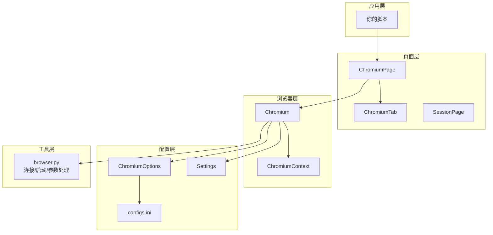
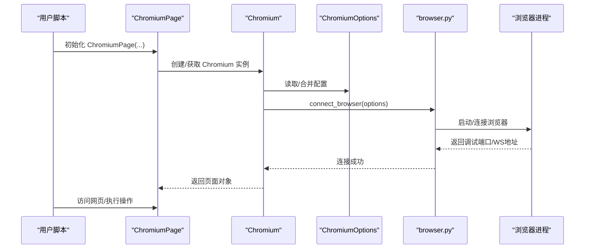
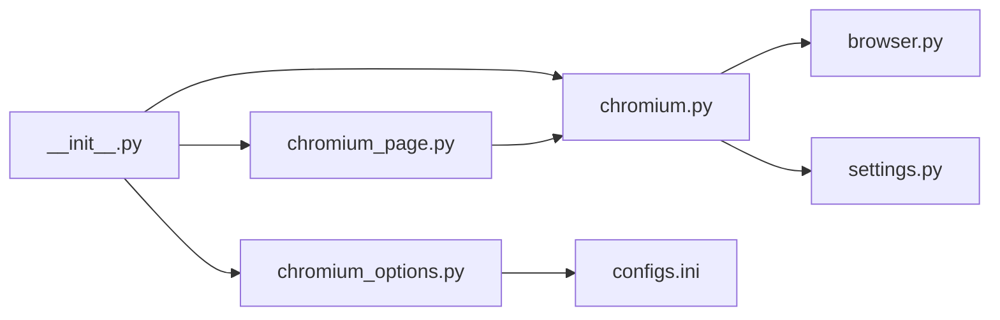

# 快速开始

<cite>
**本文引用的文件**
- [README.md](file://README.md)
- [requirements.txt](file://requirements.txt)
- [DrissionPage/__init__.py](file://DrissionPage/__init__.py)
- [DrissionPage/version.py](file://DrissionPage/version.py)
- [DrissionPage/_functions/browser.py](file://DrissionPage/_functions/browser.py)
- [DrissionPage/_configs/chromium_options.py](file://DrissionPage/_configs/chromium_options.py)
- [DrissionPage/_configs/configs.ini](file://DrissionPage/_configs/configs.ini)
- [DrissionPage/_functions/settings.py](file://DrissionPage/_functions/settings.py)
- [DrissionPage/_browsers/chromium.py](file://DrissionPage/_browsers/chromium.py)
- [DrissionPage/_pages/chromium_page.py](file://DrissionPage/_pages/chromium_page.py)
</cite>

## 目录
1. [简介](#简介)
2. [项目结构](#项目结构)
3. [核心组件](#核心组件)
4. [架构总览](#架构总览)
5. [详细组件分析](#详细组件分析)
6. [依赖关系分析](#依赖关系分析)
7. [性能与最佳实践](#性能与最佳实践)
8. [故障排除指南](#故障排除指南)
9. [结论](#结论)
10. [附录](#附录)

## 简介
本指南面向首次接触 DrissionPage 的用户，帮助你在最短时间内完成安装、配置与基础使用。你将学会：
- 安装与环境准备
- 基本配置与初始化
- 创建浏览器实例、访问网页与执行基本操作
- 常见初始化配置与最佳实践
- 常见问题排查

## 项目结构
DrissionPage 采用模块化设计，核心围绕“浏览器控制 + 页面操作 + 配置管理 + 工具函数”展开。主要目录与职责概览如下：
- DrissionPage/_browsers：浏览器控制层，负责启动/连接浏览器、会话管理等
- DrissionPage/_pages：页面层，封装标签页与页面操作
- DrissionPage/_configs：配置层，提供 ChromiumOptions、SessionOptions 与默认配置文件
- DrissionPage/_functions：通用工具与底层连接逻辑，如浏览器连接、代理、设置等
- DrissionPage/_units：页面单元能力（动作、滚动、监听、截图等）
- DrissionPage/_elements：元素抽象与定位
- DrissionPage/_pages/chromium_base.py：页面基类，统一等待、状态、动作等能力
- DrissionPage/_pages/chromium_tab.py：标签页抽象
- DrissionPage/_pages/session_page.py：Session 模式页面
- DrissionPage/_pages/chromium_frame.py：框架抽象
- DrissionPage/_pages/chromium_page.py：ChromiumPage 封装
- DrissionPage/_browsers/chromium_context.py：上下文（多标签页）管理
- DrissionPage/_browsers/chromium.py：Chromium 类与连接逻辑
- DrissionPage/_functions/browser.py：浏览器连接、进程启动、参数与用户数据目录处理
- DrissionPage/_configs/chromium_options.py：ChromiumOptions 配置类
- DrissionPage/_configs/configs.ini：默认配置文件
- DrissionPage/_functions/settings.py：全局设置（超时、语言、调试等）
- DrissionPage/version.py：版本号
- DrissionPage/__init__.py：对外导出入口

图表来源
- [DrissionPage/_pages/chromium_page.py:17-103](file://DrissionPage/_pages/chromium_page.py#L17-L103)
- [DrissionPage/_browsers/chromium.py:33-127](file://DrissionPage/_browsers/chromium.py#L33-L127)
- [DrissionPage/_configs/chromium_options.py:16-85](file://DrissionPage/_configs/chromium_options.py#L16-L85)
- [DrissionPage/_functions/browser.py:24-87](file://DrissionPage/_functions/browser.py#L24-L87)
- [DrissionPage/_functions/settings.py:13-69](file://DrissionPage/_functions/settings.py#L13-L69)

章节来源
- [README.md:38-42](file://README.md#L38-L42)
- [DrissionPage/_pages/chromium_page.py:17-103](file://DrissionPage/_pages/chromium_page.py#L17-L103)
- [DrissionPage/_browsers/chromium.py:33-127](file://DrissionPage/_browsers/chromium.py#L33-L127)
- [DrissionPage/_configs/chromium_options.py:16-85](file://DrissionPage/_configs/chromium_options.py#L16-L85)
- [DrissionPage/_functions/browser.py:24-87](file://DrissionPage/_functions/browser.py#L24-L87)
- [DrissionPage/_functions/settings.py:13-69](file://DrissionPage/_functions/settings.py#L13-L69)

## 核心组件
- 初始化入口：通过模块导出，可直接导入 Chromium、ChromiumPage、ChromiumOptions、SessionOptions 等
- 浏览器控制：Chromium 类负责连接/启动浏览器、管理上下文与标签页
- 页面封装：ChromiumPage 继承自 ChromiumTab，提供页面级操作与等待
- 配置管理：ChromiumOptions 提供丰富的配置项，支持 ini 文件读取与动态修改
- 工具函数：browser.py 提供浏览器连接、进程启动、参数与用户数据目录处理

章节来源
- [DrissionPage/__init__.py:22-28](file://DrissionPage/__init__.py#L22-L28)
- [DrissionPage/_browsers/chromium.py:33-127](file://DrissionPage/_browsers/chromium.py#L33-L127)
- [DrissionPage/_pages/chromium_page.py:17-103](file://DrissionPage/_pages/chromium_page.py#L17-L103)
- [DrissionPage/_configs/chromium_options.py:16-85](file://DrissionPage/_configs/chromium_options.py#L16-L85)
- [DrissionPage/_functions/browser.py:24-87](file://DrissionPage/_functions/browser.py#L24-L87)

## 架构总览
下图展示了从应用层到浏览器层的调用链与职责分工，帮助你理解“创建浏览器实例 -> 访问网页 -> 执行操作”的整体流程。

图表来源
- [DrissionPage/_pages/chromium_page.py:20-37](file://DrissionPage/_pages/chromium_page.py#L20-L37)
- [DrissionPage/_browsers/chromium.py:37-52](file://DrissionPage/_browsers/chromium.py#L37-L52)
- [DrissionPage/_functions/browser.py:24-87](file://DrissionPage/_functions/browser.py#L24-L87)

## 详细组件分析

### 安装与环境要求
- 支持系统：Windows、Linux、macOS
- Python 版本：3.6 及以上
- 浏览器支持：Chromium 内核浏览器（如 Chrome、Edge），以及 electron 应用
- 依赖包：requests、lxml、cssselect、DrissionGet、DrissionRecord、websocket-client、click、tldextract、psutil

章节来源
- [README.md:38-42](file://README.md#L38-L42)
- [requirements.txt:1-9](file://requirements.txt#L1-L9)

### 基本配置与初始化
- 使用 ChromiumOptions 配置浏览器参数、用户数据目录、代理、加载模式、超时等
- 默认配置来自 configs.ini，也可通过 ini 文件覆盖
- Settings 提供全局超时、语言、调试等设置

章节来源
- [DrissionPage/_configs/chromium_options.py:16-85](file://DrissionPage/_configs/chromium_options.py#L16-L85)
- [DrissionPage/_configs/configs.ini:1-34](file://DrissionPage/_configs/configs.ini#L1-L34)
- [DrissionPage/_functions/settings.py:13-69](file://DrissionPage/_functions/settings.py#L13-L69)

### 创建浏览器实例与访问网页
- 通过 ChromiumPage(addr_or_opts) 创建页面对象，内部会自动创建或复用 Chromium 实例
- 页面对象继承自 ChromiumTab，具备访问网页、等待、滚动、监听等能力

章节来源
- [DrissionPage/_pages/chromium_page.py:20-37](file://DrissionPage/_pages/chromium_page.py#L20-L37)
- [DrissionPage/_pages/chromium_page.py:17-103](file://DrissionPage/_pages/chromium_page.py#L17-L103)

### 常见初始化配置与最佳实践
- 加载模式：normal/eager/none
- 无头模式：headless/new 或关闭
- 图片/JS/音频：可按需禁用以提升性能
- 代理：支持 http/https 代理，自动解析代理字符串
- 用户数据目录：可指定或复制系统用户数据目录
- 自动端口：自动分配调试端口，避免冲突
- 超时：可分别设置基础、页面加载、脚本执行超时
- 重试：设置重试次数与间隔，提升稳定性

章节来源
- [DrissionPage/_configs/chromium_options.py:298-362](file://DrissionPage/_configs/chromium_options.py#L298-L362)
- [DrissionPage/_configs/chromium_options.py:364-408](file://DrissionPage/_configs/chromium_options.py#L364-L408)
- [DrissionPage/_functions/browser.py:24-87](file://DrissionPage/_functions/browser.py#L24-L87)

### 基础操作示例（步骤说明）
以下为“创建浏览器实例、访问网页、执行基本操作”的步骤说明，便于快速上手：
- 步骤1：导入模块并创建 ChromiumPage 实例
- 步骤2：访问目标网页
- 步骤3：执行页面操作（如等待、滚动、监听等）

章节来源
- [DrissionPage/_pages/chromium_page.py:20-37](file://DrissionPage/_pages/chromium_page.py#L20-L37)
- [DrissionPage/_pages/chromium_page.py:17-103](file://DrissionPage/_pages/chromium_page.py#L17-L103)

## 依赖关系分析
- 模块导出：通过 __init__.py 导出核心类，简化用户导入
- 配置依赖：ChromiumOptions 依赖 OptionsManager 读取 configs.ini
- 连接依赖：Chromium 依赖 browser.py 的 connect_browser 启动/连接浏览器
- 页面依赖：ChromiumPage 继承 ChromiumTab，复用浏览器实例

图表来源
- [DrissionPage/__init__.py:22-28](file://DrissionPage/__init__.py#L22-L28)
- [DrissionPage/_configs/chromium_options.py:16-85](file://DrissionPage/_configs/chromium_options.py#L16-L85)
- [DrissionPage/_functions/browser.py:24-87](file://DrissionPage/_functions/browser.py#L24-L87)
- [DrissionPage/_functions/settings.py:13-69](file://DrissionPage/_functions/settings.py#L13-L69)
- [DrissionPage/_pages/chromium_page.py:17-103](file://DrissionPage/_pages/chromium_page.py#L17-L103)

章节来源
- [DrissionPage/__init__.py:22-28](file://DrissionPage/__init__.py#L22-L28)
- [DrissionPage/_configs/chromium_options.py:16-85](file://DrissionPage/_configs/chromium_options.py#L16-L85)
- [DrissionPage/_functions/browser.py:24-87](file://DrissionPage/_functions/browser.py#L24-L87)
- [DrissionPage/_functions/settings.py:13-69](file://DrissionPage/_functions/settings.py#L13-L69)
- [DrissionPage/_pages/chromium_page.py:17-103](file://DrissionPage/_pages/chromium_page.py#L17-L103)

## 性能与最佳实践
- 关闭不必要的资源：可通过参数禁用图片、JS、音频以减少带宽与渲染开销
- 使用无头模式：在服务器或后台任务中建议启用 headless
- 合理设置超时：根据网络状况调整基础/页面加载/脚本执行超时
- 代理与下载：合理配置代理与下载路径，避免阻塞
- 自动端口与用户数据：自动端口可避免冲突；必要时复制系统用户数据以复用登录态
- 重试策略：在网络不稳定时适当提高重试次数与间隔

章节来源
- [DrissionPage/_configs/chromium_options.py:261-303](file://DrissionPage/_configs/chromium_options.py#L261-L303)
- [DrissionPage/_configs/chromium_options.py:305-362](file://DrissionPage/_configs/chromium_options.py#L305-L362)
- [DrissionPage/_configs/chromium_options.py:166-171](file://DrissionPage/_configs/chromium_options.py#L166-L171)
- [DrissionPage/_functions/settings.py:46-58](file://DrissionPage/_functions/settings.py#L46-L58)

## 故障排除指南
- 浏览器未找到
  - 现象：启动失败，提示找不到浏览器可执行文件
  - 排查：确认已安装 Chrome/Edge，或通过 set_browser_path 指定路径
  - 参考：browser.py 中的 get_chrome_path/get_edge_path
- 端口占用或无法连接
  - 现象：连接超时或端口被占用
  - 排查：使用 auto_port 自动分配端口，或更换本地端口；检查防火墙/杀软
  - 参考：browser.py 的 connect_browser/test_connect
- 用户数据目录权限问题
  - 现象：无法创建/删除用户数据目录
  - 排查：确保目录可写；必要时清理旧数据或使用新环境
  - 参考：browser.py 的 ensure_del_dir 与 set_prefs/set_flags
- 代理配置无效
  - 现象：代理未生效
  - 排查：确认代理字符串格式正确；检查代理服务器可用性
  - 参考：ChromiumOptions.set_proxy
- 页面加载缓慢或超时
  - 现象：页面长时间加载
  - 排查：提高 page_load/script 超时；禁用图片/JS；检查网络
  - 参考：ChromiumOptions.set_timeouts 与 Settings

章节来源
- [DrissionPage/_functions/browser.py:24-87](file://DrissionPage/_functions/browser.py#L24-L87)
- [DrissionPage/_functions/browser.py:192-210](file://DrissionPage/_functions/browser.py#L192-L210)
- [DrissionPage/_functions/browser.py:122-157](file://DrissionPage/_functions/browser.py#L122-L157)
- [DrissionPage/_configs/chromium_options.py:293-296](file://DrissionPage/_configs/chromium_options.py#L293-L296)
- [DrissionPage/_functions/settings.py:46-58](file://DrissionPage/_functions/settings.py#L46-L58)

## 结论
通过本指南，你可以快速完成 DrissionPage 的安装与配置，并掌握创建浏览器实例、访问网页与执行基本操作的方法。建议结合默认配置文件与常用配置项逐步深入，遇到问题时优先参考“故障排除指南”。随着使用加深，可进一步探索页面等待、动作模拟、监听与下载等高级能力。

## 附录
- 版本信息：可通过 version.py 获取当前版本
- 官方网站与社区：详见 README 中的链接与交流群二维码

章节来源
- [DrissionPage/version.py:8](file://DrissionPage/version.py#L8)
- [README.md:13-27](file://README.md#L13-L27)