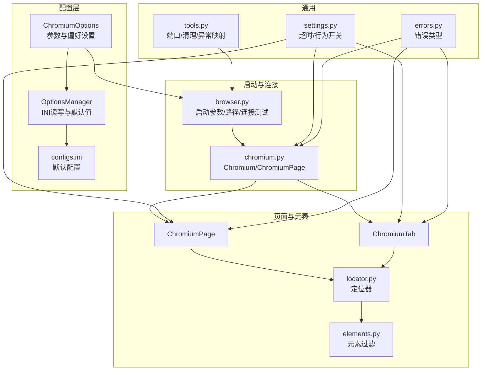
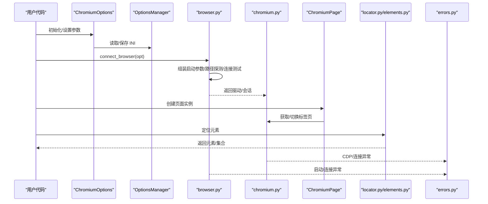
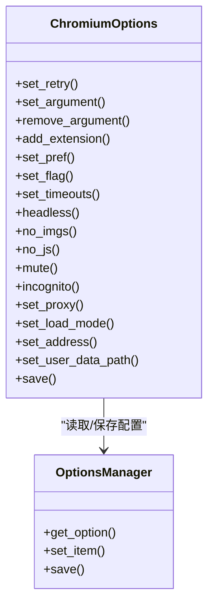
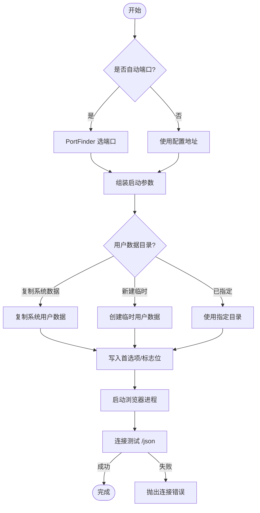
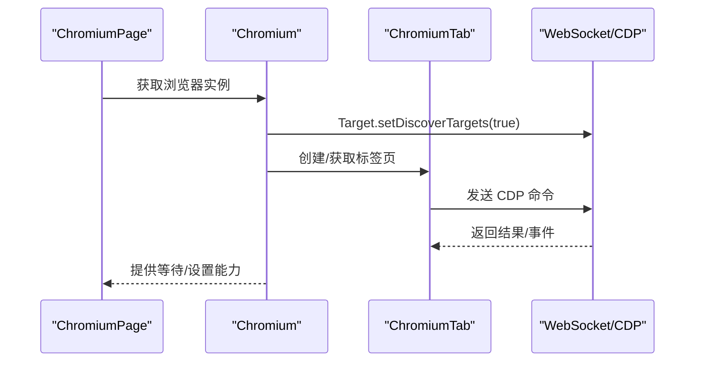
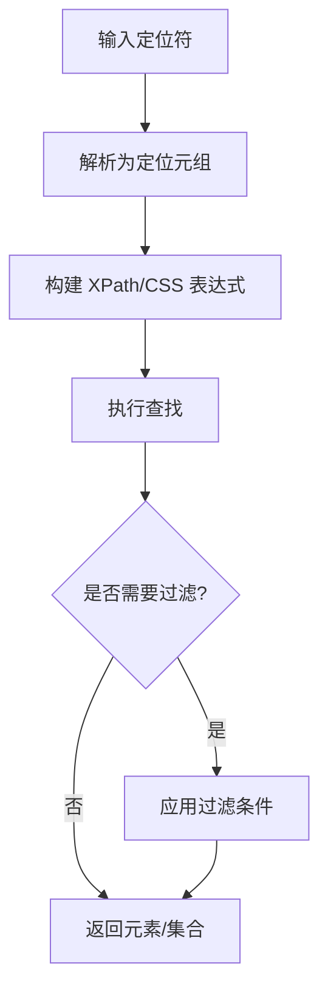
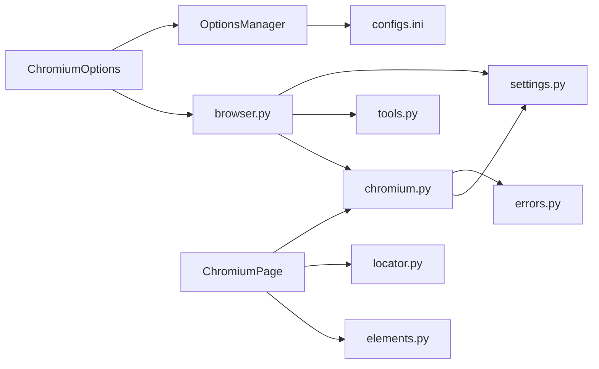

# 兼容性问题排查

<cite>
**本文引用的文件**   
- [DrissionPage/__init__.py](file://DrissionPage/__init__.py)
- [DrissionPage/_configs/chromium_options.py](file://DrissionPage/_configs/chromium_options.py)
- [DrissionPage/_configs/options_manage.py](file://DrissionPage/_configs/options_manage.py)
- [DrissionPage/_configs/configs.ini](file://DrissionPage/_configs/configs.ini)
- [DrissionPage/_functions/browser.py](file://DrissionPage/_functions/browser.py)
- [DrissionPage/_functions/settings.py](file://DrissionPage/_functions/settings.py)
- [DrissionPage/_functions/tools.py](file://DrissionPage/_functions/tools.py)
- [DrissionPage/_functions/locator.py](file://DrissionPage/_functions/locator.py)
- [DrissionPage/_functions/elements.py](file://DrissionPage/_functions/elements.py)
- [DrissionPage/_base/base.py](file://DrissionPage/_base/base.py)
- [DrissionPage/_browsers/chromium.py](file://DrissionPage/_browsers/chromium.py)
- [DrissionPage/_pages/chromium_page.py](file://DrissionPage/_pages/chromium_page.py)
- [DrissionPage/errors.py](file://DrissionPage/errors.py)
</cite>

## 目录
1. [简介](#简介)
2. [项目结构](#项目结构)
3. [核心组件](#核心组件)
4. [架构总览](#架构总览)
5. [详细组件分析](#详细组件分析)
6. [依赖分析](#依赖分析)
7. [性能考虑](#性能考虑)
8. [故障排查指南](#故障排查指南)
9. [结论](#结论)
10. [附录](#附录)

## 简介
本指南聚焦于 DrissionPage 在不同操作系统、浏览器版本与配置组合下的兼容性问题与排查方法。围绕常见表现（元素定位失败、页面渲染异常、功能不可用等），给出基于源码实现的配置调整建议、浏览器更新适配策略、以及可复用的兼容性测试与验证步骤。

## 项目结构
DrissionPage 采用模块化设计，围绕 Chromium 内核浏览器提供高层封装，核心模块包括：
- 配置层：ChromiumOptions、OptionsManager、默认配置文件
- 启动与连接：browser.py 中的启动参数组装、浏览器路径探测、连接测试
- 页面与元素：ChromiumPage、ChromiumTab、元素定位与过滤
- 设置与超时：settings.py 的全局行为控制
- 错误类型：errors.py 定义各类错误类型，便于定位与区分

图表来源
- [DrissionPage/_configs/chromium_options.py:16-417](file://DrissionPage/_configs/chromium_options.py#L16-L417)
- [DrissionPage/_configs/options_manage.py:15-143](file://DrissionPage/_configs/options_manage.py#L15-L143)
- [DrissionPage/_configs/configs.ini:1-34](file://DrissionPage/_configs/configs.ini#L1-L34)
- [DrissionPage/_functions/browser.py:24-120](file://DrissionPage/_functions/browser.py#L24-L120)
- [DrissionPage/_browsers/chromium.py:33-120](file://DrissionPage/_browsers/chromium.py#L33-L120)
- [DrissionPage/_pages/chromium_page.py:17-103](file://DrissionPage/_pages/chromium_page.py#L17-L103)
- [DrissionPage/_functions/locator.py:1-200](file://DrissionPage/_functions/locator.py#L1-L200)
- [DrissionPage/_functions/elements.py:1-200](file://DrissionPage/_functions/elements.py#L1-L200)
- [DrissionPage/_functions/settings.py:13-69](file://DrissionPage/_functions/settings.py#L13-L69)
- [DrissionPage/_functions/tools.py:21-200](file://DrissionPage/_functions/tools.py#L21-L200)
- [DrissionPage/errors.py:11-95](file://DrissionPage/errors.py#L11-L95)

章节来源
- [DrissionPage/__init__.py:22-28](file://DrissionPage/__init__.py#L22-L28)
- [DrissionPage/_configs/chromium_options.py:16-417](file://DrissionPage/_configs/chromium_options.py#L16-L417)
- [DrissionPage/_configs/options_manage.py:15-143](file://DrissionPage/_configs/options_manage.py#L15-L143)
- [DrissionPage/_configs/configs.ini:1-34](file://DrissionPage/_configs/configs.ini#L1-L34)
- [DrissionPage/_functions/browser.py:24-120](file://DrissionPage/_functions/browser.py#L24-L120)
- [DrissionPage/_functions/settings.py:13-69](file://DrissionPage/_functions/settings.py#L13-L69)
- [DrissionPage/_functions/tools.py:21-200](file://DrissionPage/_functions/tools.py#L21-L200)
- [DrissionPage/_functions/locator.py:1-200](file://DrissionPage/_functions/locator.py#L1-L200)
- [DrissionPage/_functions/elements.py:1-200](file://DrissionPage/_functions/elements.py#L1-L200)
- [DrissionPage/_base/base.py:29-120](file://DrissionPage/_base/base.py#L29-L120)
- [DrissionPage/_browsers/chromium.py:33-120](file://DrissionPage/_browsers/chromium.py#L33-L120)
- [DrissionPage/_pages/chromium_page.py:17-103](file://DrissionPage/_pages/chromium_page.py#L17-L103)
- [DrissionPage/errors.py:11-95](file://DrissionPage/errors.py#L11-L95)

## 核心组件
- ChromiumOptions：集中管理启动参数、用户数据目录、扩展、首选项、标志位、超时、代理、加载模式、端口与地址等。支持从 INI 文件读取与保存，便于跨环境迁移与复现。
- OptionsManager：负责 INI 文件的读取、写入与默认值填充；提供 sections 与键值的存取接口。
- browser.py：负责启动参数去重与扩展注入、用户数据目录准备、首选项与标志位写入、浏览器进程创建、连接测试与路径探测。
- settings.py：统一超时、连接超时、单例标签对象、CDP 超时、语言等全局行为开关。
- chromium.py：Chromium/ChromiumPage 的生命周期管理、会话与标签页管理、隐私沙盒弹窗处理、上下文隔离与隐身模式等。
- pages/chromium_page.py：页面级封装，继承自 ChromiumTab，提供页面级等待与设置。
- errors.py：定义各类错误类型，便于在兼容性问题中快速识别（连接失败、元素丢失、CDP 异常、超时等）。

章节来源
- [DrissionPage/_configs/chromium_options.py:16-417](file://DrissionPage/_configs/chromium_options.py#L16-L417)
- [DrissionPage/_configs/options_manage.py:15-143](file://DrissionPage/_configs/options_manage.py#L15-L143)
- [DrissionPage/_functions/browser.py:24-120](file://DrissionPage/_functions/browser.py#L24-L120)
- [DrissionPage/_functions/settings.py:13-69](file://DrissionPage/_functions/settings.py#L13-L69)
- [DrissionPage/_browsers/chromium.py:33-120](file://DrissionPage/_browsers/chromium.py#L33-L120)
- [DrissionPage/_pages/chromium_page.py:17-103](file://DrissionPage/_pages/chromium_page.py#L17-L103)
- [DrissionPage/errors.py:11-95](file://DrissionPage/errors.py#L11-L95)

## 架构总览
下图展示从配置到浏览器连接、再到页面与元素操作的关键流程，以及错误类型在各层的映射。

图表来源
- [DrissionPage/_configs/chromium_options.py:16-417](file://DrissionPage/_configs/chromium_options.py#L16-L417)
- [DrissionPage/_configs/options_manage.py:15-143](file://DrissionPage/_configs/options_manage.py#L15-L143)
- [DrissionPage/_functions/browser.py:24-120](file://DrissionPage/_functions/browser.py#L24-L120)
- [DrissionPage/_browsers/chromium.py:33-120](file://DrissionPage/_browsers/chromium.py#L33-L120)
- [DrissionPage/_pages/chromium_page.py:17-103](file://DrissionPage/_pages/chromium_page.py#L17-L103)
- [DrissionPage/_functions/locator.py:1-200](file://DrissionPage/_functions/locator.py#L1-L200)
- [DrissionPage/_functions/elements.py:1-200](file://DrissionPage/_functions/elements.py#L1-L200)
- [DrissionPage/errors.py:11-95](file://DrissionPage/errors.py#L11-L95)

## 详细组件分析

### 组件一：ChromiumOptions 与配置持久化
- 关键点
  - 参数去重与覆盖：支持添加/移除启动参数，避免重复；特殊参数如 --headless 会同步内部状态。
  - 扩展注入：校验扩展目录存在性，注入扩展参数。
  - 首选项与标志位：通过 Preferences 与 Local State 写入，支持删除特定键。
  - 地址与端口：支持固定端口或自动端口；自动端口会生成临时用户数据目录。
  - 代理与加载模式：支持设置代理、加载模式（normal/eager/none）。
  - 保存与读取：可将当前配置保存到 INI 或默认位置，便于跨环境复用。

图表来源
- [DrissionPage/_configs/chromium_options.py:16-417](file://DrissionPage/_configs/chromium_options.py#L16-L417)
- [DrissionPage/_configs/options_manage.py:15-143](file://DrissionPage/_configs/options_manage.py#L15-L143)

章节来源
- [DrissionPage/_configs/chromium_options.py:16-417](file://DrissionPage/_configs/chromium_options.py#L16-L417)
- [DrissionPage/_configs/options_manage.py:15-143](file://DrissionPage/_configs/options_manage.py#L15-L143)
- [DrissionPage/_configs/configs.ini:1-34](file://DrissionPage/_configs/configs.ini#L1-L34)

### 组件二：browser.py 的启动与连接
- 关键点
  - 自动端口：通过 PortFinder 选择可用端口，避免冲突。
  - 用户数据目录：支持复制系统用户数据、新建临时目录、或指定已有目录；新环境模式会清理旧数据。
  - 首选项与标志位写入：在启动前将 Preferences 与 Local State 写入对应文件。
  - 浏览器路径探测：按平台优先注册表/默认路径/PATH 检索，找不到抛出错误。
  - 连接测试：轮询 /json 列表，确认可调试目标存在。

图表来源
- [DrissionPage/_functions/browser.py:24-120](file://DrissionPage/_functions/browser.py#L24-L120)
- [DrissionPage/_functions/tools.py:21-100](file://DrissionPage/_functions/tools.py#L21-L100)

章节来源
- [DrissionPage/_functions/browser.py:24-120](file://DrissionPage/_functions/browser.py#L24-L120)
- [DrissionPage/_functions/tools.py:21-100](file://DrissionPage/_functions/tools.py#L21-L100)

### 组件三：Chromium 与 ChromiumPage 的生命周期
- 关键点
  - 生命周期：Chromium 单例化管理，ChromiumPage 继承自 ChromiumTab，共享浏览器上下文。
  - 隐身模式与上下文：支持创建独立上下文，设置代理与下载行为。
  - 隐私沙盒弹窗：检测并关闭隐私沙盒提示对话框，避免后续交互阻塞。
  - 标签页管理：创建、激活、关闭、枚举标签页，处理目标创建/销毁事件。

图表来源
- [DrissionPage/_browsers/chromium.py:33-120](file://DrissionPage/_browsers/chromium.py#L33-L120)
- [DrissionPage/_pages/chromium_page.py:17-103](file://DrissionPage/_pages/chromium_page.py#L17-L103)

章节来源
- [DrissionPage/_browsers/chromium.py:33-120](file://DrissionPage/_browsers/chromium.py#L33-L120)
- [DrissionPage/_pages/chromium_page.py:17-103](file://DrissionPage/_pages/chromium_page.py#L17-L103)

### 组件四：元素定位与过滤
- 关键点
  - 定位器：支持字符串定位符、CSS/XPath、多属性组合、无障碍角色等；支持将 CSS 转换为 XPath。
  - 元素过滤：支持按显示状态、选中/勾选、可点击、样式、属性、文本等条件筛选。
  - 容错与返回值：未找到元素时可返回空占位或抛出异常，取决于全局设置。

图表来源
- [DrissionPage/_functions/locator.py:1-200](file://DrissionPage/_functions/locator.py#L1-L200)
- [DrissionPage/_functions/elements.py:1-200](file://DrissionPage/_functions/elements.py#L1-L200)
- [DrissionPage/_base/base.py:29-120](file://DrissionPage/_base/base.py#L29-L120)

章节来源
- [DrissionPage/_functions/locator.py:1-200](file://DrissionPage/_functions/locator.py#L1-L200)
- [DrissionPage/_functions/elements.py:1-200](file://DrissionPage/_functions/elements.py#L1-L200)
- [DrissionPage/_base/base.py:29-120](file://DrissionPage/_base/base.py#L29-L120)

## 依赖分析
- 配置依赖：ChromiumOptions 依赖 OptionsManager 读取/写入 INI；默认配置来自 configs.ini。
- 启动依赖：browser.py 依赖 settings.py 的超时与行为开关；依赖 tools.py 的端口探测与异常映射。
- 运行时依赖：chromium.py 依赖 browser.py 的连接与驱动；依赖 errors.py 的错误类型；依赖 settings.py 的超时与行为。
- 页面与元素：ChromiumPage/ChromiumTab 依赖 locator/elements 提供的定位与过滤能力。

图表来源
- [DrissionPage/_configs/chromium_options.py:16-417](file://DrissionPage/_configs/chromium_options.py#L16-L417)
- [DrissionPage/_configs/options_manage.py:15-143](file://DrissionPage/_configs/options_manage.py#L15-L143)
- [DrissionPage/_configs/configs.ini:1-34](file://DrissionPage/_configs/configs.ini#L1-L34)
- [DrissionPage/_functions/browser.py:24-120](file://DrissionPage/_functions/browser.py#L24-L120)
- [DrissionPage/_functions/settings.py:13-69](file://DrissionPage/_functions/settings.py#L13-L69)
- [DrissionPage/_functions/tools.py:21-200](file://DrissionPage/_functions/tools.py#L21-L200)
- [DrissionPage/_browsers/chromium.py:33-120](file://DrissionPage/_browsers/chromium.py#L33-L120)
- [DrissionPage/_pages/chromium_page.py:17-103](file://DrissionPage/_pages/chromium_page.py#L17-L103)
- [DrissionPage/_functions/locator.py:1-200](file://DrissionPage/_functions/locator.py#L1-L200)
- [DrissionPage/_functions/elements.py:1-200](file://DrissionPage/_functions/elements.py#L1-L200)
- [DrissionPage/errors.py:11-95](file://DrissionPage/errors.py#L11-L95)

章节来源
- [DrissionPage/_configs/chromium_options.py:16-417](file://DrissionPage/_configs/chromium_options.py#L16-L417)
- [DrissionPage/_configs/options_manage.py:15-143](file://DrissionPage/_configs/options_manage.py#L15-L143)
- [DrissionPage/_functions/browser.py:24-120](file://DrissionPage/_functions/browser.py#L24-L120)
- [DrissionPage/_functions/settings.py:13-69](file://DrissionPage/_functions/settings.py#L13-L69)
- [DrissionPage/_functions/tools.py:21-200](file://DrissionPage/_functions/tools.py#L21-L200)
- [DrissionPage/_browsers/chromium.py:33-120](file://DrissionPage/_browsers/chromium.py#L33-L120)
- [DrissionPage/_pages/chromium_page.py:17-103](file://DrissionPage/_pages/chromium_page.py#L17-L103)
- [DrissionPage/_functions/locator.py:1-200](file://DrissionPage/_functions/locator.py#L1-L200)
- [DrissionPage/_functions/elements.py:1-200](file://DrissionPage/_functions/elements.py#L1-L200)
- [DrissionPage/errors.py:11-95](file://DrissionPage/errors.py#L11-L95)

## 性能考虑
- 超时与重试：通过 settings.py 的超时与 ChromiumOptions 的重试配置，平衡稳定性与响应速度。
- 图片/脚本禁用：在低带宽或弱设备上，可通过 no_imgs/no_js 减少资源消耗。
- 加载模式：根据页面复杂度选择 normal/eager/none，避免不必要的等待。
- 端口与用户数据：自动端口与临时用户数据可减少冲突与磁盘占用，但首次启动成本较高。

## 故障排查指南

### 1. 元素定位失败
- 现象
  - 定位不到元素、返回空或抛出异常。
- 排查步骤
  - 检查定位符是否正确，必要时启用 CSS 转 XPath 或使用多属性组合。
  - 确认页面已完全加载，适当增加超时或切换加载模式。
  - 使用元素过滤器（显示状态、可点击、文本等）缩小范围。
- 相关实现参考
  - 定位器解析与表达式构建：[定位器:96-195](file://DrissionPage/_functions/locator.py#L96-L195)
  - 元素过滤与返回空占位：[元素过滤:43-62](file://DrissionPage/_functions/elements.py#L43-L62)
  - 全局异常策略：[基类解析器:33-50](file://DrissionPage/_base/base.py#L33-L50)

章节来源
- [DrissionPage/_functions/locator.py:96-195](file://DrissionPage/_functions/locator.py#L96-L195)
- [DrissionPage/_functions/elements.py:43-62](file://DrissionPage/_functions/elements.py#L43-L62)
- [DrissionPage/_base/base.py:33-50](file://DrissionPage/_base/base.py#L33-L50)

### 2. 页面渲染异常/空白页
- 现象
  - 页面白屏、资源加载失败、JS 报错。
- 排查步骤
  - 禁用图片/脚本以排除网络与渲染影响（no_imgs/no_js）。
  - 切换加载模式（eager/none）观察差异。
  - 检查代理与证书错误处理（忽略证书错误）。
- 相关实现参考
  - 参数设置：[ChromiumOptions 参数:265-288](file://DrissionPage/_configs/chromium_options.py#L265-L288)
  - 默认参数与特性禁用：[默认 INI:8-11](file://DrissionPage/_configs/configs.ini#L8-L11)

章节来源
- [DrissionPage/_configs/chromium_options.py:265-288](file://DrissionPage/_configs/chromium_options.py#L265-L288)
- [DrissionPage/_configs/configs.ini:8-11](file://DrissionPage/_configs/configs.ini#L8-L11)

### 3. 功能不可用（隐身模式、下载、权限）
- 现象
  - 隐身模式下无法创建标签、下载被拦截、权限弹窗干扰。
- 排查步骤
  - 使用隐身模式参数（incognito/inprivate），注意部分功能降级。
  - 设置下载行为与路径，确保权限与代理配置一致。
  - 隐私沙盒弹窗处理：框架会自动关闭提示，避免后续交互阻塞。
- 相关实现参考
  - 隐身模式与上下文：[Chromium 上下文:211-233](file://DrissionPage/_browsers/chromium.py#L211-L233)
  - 下载行为设置：[Chromium 下载:229-232](file://DrissionPage/_browsers/chromium.py#L229-L232)
  - 隐私沙盒处理：[关闭弹窗:686-707](file://DrissionPage/_browsers/chromium.py#L686-L707)

章节来源
- [DrissionPage/_browsers/chromium.py:211-233](file://DrissionPage/_browsers/chromium.py#L211-L233)
- [DrissionPage/_browsers/chromium.py:229-232](file://DrissionPage/_browsers/chromium.py#L229-L232)
- [DrissionPage/_browsers/chromium.py:686-707](file://DrissionPage/_browsers/chromium.py#L686-L707)

### 4. 浏览器连接失败/断开
- 现象
  - 启动后无法连接、连接超时、CDP 报错、标签页断开。
- 排查步骤
  - 确认端口未被占用，必要时启用自动端口。
  - 检查浏览器路径与系统用户数据目录权限。
  - 增加连接超时，查看具体错误类型（连接/断开/元素丢失）。
- 相关实现参考
  - 连接测试与异常：[连接测试:192-210](file://DrissionPage/_functions/browser.py#L192-L210)
  - 端口分配与冲突：[端口工具:21-56](file://DrissionPage/_functions/tools.py#L21-L56)
  - CDP 错误映射：[异常映射:157-197](file://DrissionPage/_functions/tools.py#L157-L197)
  - 错误类型定义：[错误类型:53-94](file://DrissionPage/errors.py#L53-L94)

章节来源
- [DrissionPage/_functions/browser.py:192-210](file://DrissionPage/_functions/browser.py#L192-L210)
- [DrissionPage/_functions/tools.py:21-56](file://DrissionPage/_functions/tools.py#L21-L56)
- [DrissionPage/_functions/tools.py:157-197](file://DrissionPage/_functions/tools.py#L157-L197)
- [DrissionPage/errors.py:53-94](file://DrissionPage/errors.py#L53-L94)

### 5. 浏览器更新导致的功能变化
- 现象
  - 新版本浏览器禁用某些特性、隐私策略变更、沙盒弹窗增多。
- 应对策略
  - 保持配置文件更新，关注默认参数与特性禁用列表。
  - 对隐私沙盒弹窗进行自动处理，避免人工干预。
  - 逐步降低安全限制（如忽略证书错误）以验证兼容性。
- 相关实现参考
  - 默认 INI 中的特性禁用：[默认 INI:8-11](file://DrissionPage/_configs/configs.ini#L8-L11)
  - 隐私沙盒处理：[关闭弹窗:686-707](file://DrissionPage/_browsers/chromium.py#L686-L707)
  - 忽略证书错误参数：[ChromiumOptions:286-288](file://DrissionPage/_configs/chromium_options.py#L286-L288)

章节来源
- [DrissionPage/_configs/configs.ini:8-11](file://DrissionPage/_configs/configs.ini#L8-L11)
- [DrissionPage/_browsers/chromium.py:686-707](file://DrissionPage/_browsers/chromium.py#L686-L707)
- [DrissionPage/_configs/chromium_options.py:286-288](file://DrissionPage/_configs/chromium_options.py#L286-L288)

### 6. 配置参数适配不同运行环境
- 建议
  - 使用 OptionsManager 将配置保存到本地 INI，便于团队共享与复现。
  - 针对不同操作系统设置浏览器路径与用户数据目录策略。
  - 在 CI 环境启用自动端口与临时用户数据，避免磁盘与权限问题。
- 相关实现参考
  - 保存配置：[ChromiumOptions.save:364-408](file://DrissionPage/_configs/chromium_options.py#L364-L408)
  - 读取默认配置：[OptionsManager:15-78](file://DrissionPage/_configs/options_manage.py#L15-L78)
  - 平台路径探测：[browser.py 路径探测:277-340](file://DrissionPage/_functions/browser.py#L277-L340)

章节来源
- [DrissionPage/_configs/chromium_options.py:364-408](file://DrissionPage/_configs/chromium_options.py#L364-L408)
- [DrissionPage/_configs/options_manage.py:15-78](file://DrissionPage/_configs/options_manage.py#L15-L78)
- [DrissionPage/_functions/browser.py:277-340](file://DrissionPage/_functions/browser.py#L277-L340)

### 7. 兼容性测试与验证步骤
- 步骤
  - 固定/自动端口：先用固定端口验证，再切换自动端口。
  - 不同加载模式：对比 normal/eager/none 的加载时间与稳定性。
  - 禁用图片/脚本：评估资源消耗与页面渲染差异。
  - 代理与证书：验证代理连通性与证书错误处理。
  - 隐私沙盒：检查弹窗是否被自动关闭。
  - 元素定位：在不同页面复杂度下验证定位成功率与稳定性。
- 工具与参考
  - 超时与重试：[settings.py:18-20](file://DrissionPage/_functions/settings.py#L18-L20)
  - 重试配置：[ChromiumOptions:166-171](file://DrissionPage/_configs/chromium_options.py#L166-L171)
  - 连接测试：[browser.py:192-210](file://DrissionPage/_functions/browser.py#L192-L210)

章节来源
- [DrissionPage/_functions/settings.py:18-20](file://DrissionPage/_functions/settings.py#L18-L20)
- [DrissionPage/_configs/chromium_options.py:166-171](file://DrissionPage/_configs/chromium_options.py#L166-L171)
- [DrissionPage/_functions/browser.py:192-210](file://DrissionPage/_functions/browser.py#L192-L210)

## 结论
通过合理配置 ChromiumOptions、利用 OptionsManager 管理 INI、结合 browser.py 的启动与连接策略、以及 Chromium/ChromiumPage 的生命周期管理，可以有效应对不同操作系统与浏览器版本带来的兼容性挑战。配合定位器与元素过滤、完善的错误映射与超时策略，能够系统化地定位与解决常见兼容性问题，并建立可复用的测试与验证流程。

## 附录
- 常用配置要点
  - 启动参数：--disable-site-isolation-trials、--test-type 等（默认 INI）
  - 加载模式：normal/eager/none
  - 隐私与安全：忽略证书错误、隐身模式、代理设置
  - 用户数据：系统用户数据复制、临时目录、自动端口
- 相关文件路径
  - [ChromiumOptions:16-417](file://DrissionPage/_configs/chromium_options.py#L16-L417)
  - [OptionsManager:15-143](file://DrissionPage/_configs/options_manage.py#L15-L143)
  - [默认 INI:1-34](file://DrissionPage/_configs/configs.ini#L1-L34)
  - [browser.py:24-120](file://DrissionPage/_functions/browser.py#L24-L120)
  - [settings.py:13-69](file://DrissionPage/_functions/settings.py#L13-L69)
  - [chromium.py:33-120](file://DrissionPage/_browsers/chromium.py#L33-L120)
  - [ChromiumPage:17-103](file://DrissionPage/_pages/chromium_page.py#L17-L103)
  - [locator.py:1-200](file://DrissionPage/_functions/locator.py#L1-L200)
  - [elements.py:1-200](file://DrissionPage/_functions/elements.py#L1-L200)
  - [errors.py:11-95](file://DrissionPage/errors.py#L11-L95)