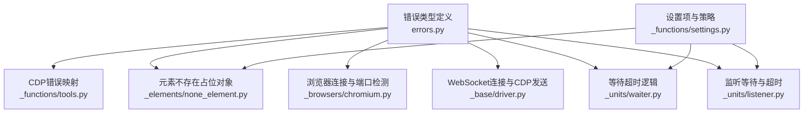
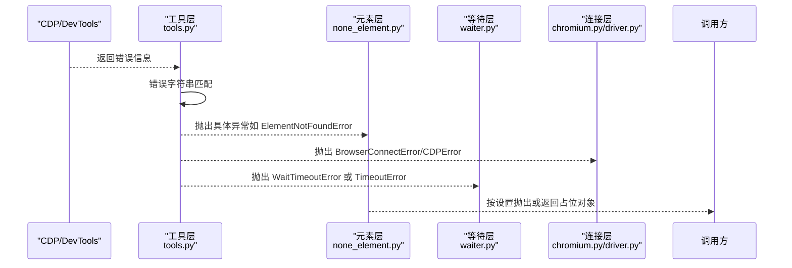
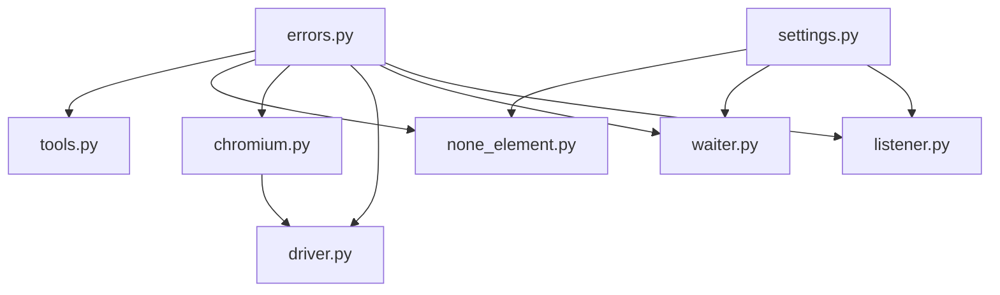

# 常见错误类型与解决

<cite>
**本文引用的文件**
- [errors.py](file://DrissionPage/errors.py)
- [tools.py](file://DrissionPage/_functions/tools.py)
- [settings.py](file://DrissionPage/_functions/settings.py)
- [none_element.py](file://DrissionPage/_elements/none_element.py)
- [chromium.py](file://DrissionPage/_browsers/chromium.py)
- [driver.py](file://DrissionPage/_base/driver.py)
- [waiter.py](file://DrissionPage/_units/waiter.py)
- [listener.py](file://DrissionPage/_units/listener.py)
</cite>

## 目录
1. [简介](#简介)
2. [项目结构](#项目结构)
3. [核心组件](#核心组件)
4. [架构总览](#架构总览)
5. [详细组件分析](#详细组件分析)
6. [依赖分析](#依赖分析)
7. [性能考虑](#性能考虑)
8. [故障排查指南](#故障排查指南)
9. [结论](#结论)

## 简介
本文件系统性梳理 DrissionPage 中常见的异常类型，重点覆盖以下错误：ElementNotFoundError、BrowserConnectError、CDPError、WaitTimeoutError，并补充 AlertExistsError、ContextLostError、ElementLostError、JavaScriptError、NoRectError、PageDisconnectedError、IncorrectURLError、StorageError、CookieFormatError、TargetNotFoundError、LocatorError、UnknownError 等。内容包括：
- 错误的含义与触发场景
- 典型代码路径与触发位置
- 解决方案与最佳实践
- 错误信息解读与调试技巧

## 项目结构
围绕错误处理的关键模块如下：
- 错误类型定义：errors.py
- CDP 错误映射与抛出：_functions/tools.py
- 设置项与异常策略：_functions/settings.py
- 元素不存在时的占位对象：_elements/none_element.py
- 浏览器连接与端口占用：_browsers/chromium.py、_base/driver.py
- 等待超时与监听等待：_units/waiter.py、_units/listener.py

图表来源
- [errors.py:11-94](file://DrissionPage/errors.py#L11-L94)
- [tools.py:158-197](file://DrissionPage/_functions/tools.py#L158-L197)
- [settings.py:13-69](file://DrissionPage/_functions/settings.py#L13-L69)
- [none_element.py:12-37](file://DrissionPage/_elements/none_element.py#L12-L37)
- [chromium.py:520-539](file://DrissionPage/_browsers/chromium.py#L520-L539)
- [driver.py:105-141](file://DrissionPage/_base/driver.py#L105-L141)
- [waiter.py:85-234](file://DrissionPage/_units/waiter.py#L85-L234)
- [listener.py:101-116](file://DrissionPage/_units/listener.py#L101-L116)

章节来源
- [errors.py:11-94](file://DrissionPage/errors.py#L11-L94)
- [tools.py:158-197](file://DrissionPage/_functions/tools.py#L158-L197)
- [settings.py:13-69](file://DrissionPage/_functions/settings.py#L13-L69)
- [none_element.py:12-37](file://DrissionPage/_elements/none_element.py#L12-L37)
- [chromium.py:520-539](file://DrissionPage/_browsers/chromium.py#L520-L539)
- [driver.py:105-141](file://DrissionPage/_base/driver.py#L105-L141)
- [waiter.py:85-234](file://DrissionPage/_units/waiter.py#L85-L234)
- [listener.py:101-116](file://DrissionPage/_units/listener.py#L101-L116)

## 核心组件
- 错误基类与具体异常：BaseError 及若干具体异常类（如 ElementNotFoundError、BrowserConnectError、CDPError、WaitTimeoutError 等）在 errors.py 中定义。
- CDP 错误到 Python 异常的映射：tools.py 的错误分派逻辑将底层 CDP 错误字符串映射为具体异常类型。
- 设置项控制异常行为：settings.py 提供 raise_when_ele_not_found、raise_when_wait_failed 等开关，影响元素不存在或等待失败时的行为。
- 元素不存在占位对象：none_element.py 在未找到元素时返回 NoneElement，按设置决定是否抛出 ElementNotFoundError。
- 连接与端口：chromium.py 与 driver.py 负责浏览器连接、端口占用检测与连接失败时抛出 BrowserConnectError。

章节来源
- [errors.py:11-94](file://DrissionPage/errors.py#L11-L94)
- [tools.py:158-197](file://DrissionPage/_functions/tools.py#L158-L197)
- [settings.py:13-69](file://DrissionPage/_functions/settings.py#L13-L69)
- [none_element.py:12-37](file://DrissionPage/_elements/none_element.py#L12-L37)
- [chromium.py:520-539](file://DrissionPage/_browsers/chromium.py#L520-L539)
- [driver.py:105-141](file://DrissionPage/_base/driver.py#L105-L141)

## 架构总览
下图展示错误在系统中的传播路径：底层 CDP 返回错误 → 工具层映射为具体异常 → 上层根据设置决定抛出或返回占位对象 → 等待模块在超时情况下抛出 WaitTimeoutError。

图表来源
- [tools.py:158-197](file://DrissionPage/_functions/tools.py#L158-L197)
- [none_element.py:12-37](file://DrissionPage/_elements/none_element.py#L12-L37)
- [waiter.py:85-234](file://DrissionPage/_units/waiter.py#L85-L234)
- [chromium.py:520-539](file://DrissionPage/_browsers/chromium.py#L520-L539)
- [driver.py:105-141](file://DrissionPage/_base/driver.py#L105-L141)

## 详细组件分析

### ElementNotFoundError（元素未找到）
- 含义：在查找页面元素时未找到匹配元素。
- 触发场景与路径：
  - 未找到元素时返回 NoneElement；若设置 raise_when_ele_not_found 为真，则在访问 NoneElement 属性或调用其方法时抛出该异常。
  - 元素选择器匹配不到元素时，返回 NoneElement 占位对象。
- 典型代码路径
  - [none_element.py:12-37](file://DrissionPage/_elements/none_element.py#L12-L37)
  - [settings.py:13-28](file://DrissionPage/_functions/settings.py#L13-L28)
- 解决方案
  - 使用更精确的选择器或增加等待时间。
  - 将 raise_when_ele_not_found 设为 False，改为返回 NoneElement 并自行判断。
  - 在调用前先检查元素是否存在，或使用带超时的等待接口。
- 调试技巧
  - 打印当前页面快照或截图，确认元素是否渲染。
  - 检查选择器是否被动态内容覆盖或处于 iframe 内。

章节来源
- [none_element.py:12-37](file://DrissionPage/_elements/none_element.py#L12-L37)
- [settings.py:13-28](file://DrissionPage/_functions/settings.py#L13-L28)

### BrowserConnectError（浏览器连接失败）
- 含义：无法连接到浏览器实例，通常由地址不可达、端口被占用或浏览器未授权等引起。
- 触发场景与路径：
  - WebSocket 握手失败、连接被拒绝、端口不可用、浏览器版本不支持等情况会抛出该异常。
  - 端口占用检测失败或随机端口分配失败也会触发。
- 典型代码路径
  - [driver.py:120-132](file://DrissionPage/_base/driver.py#L120-L132)
  - [chromium.py:520-539](file://DrissionPage/_browsers/chromium.py#L520-L539)
  - [tools.py:36-55](file://DrissionPage/_functions/tools.py#L36-L55)
- 解决方案
  - 检查浏览器地址与端口是否正确且未被占用。
  - 以管理员权限运行或调整安全策略，确保 WebSocket 握手通过。
  - 显式设置本地端口，避免随机端口冲突。
- 调试技巧
  - 使用端口占用检测函数验证端口可用性。
  - 查看浏览器启动参数与 DevTools 授权状态。

章节来源
- [driver.py:120-132](file://DrissionPage/_base/driver.py#L120-L132)
- [chromium.py:520-539](file://DrissionPage/_browsers/chromium.py#L520-L539)
- [tools.py:36-55](file://DrissionPage/_functions/tools.py#L36-L55)

### CDPError（通用 CDP 错误）
- 含义：底层 CDP 调用返回未知或未覆盖的错误时抛出。
- 触发场景与路径：
  - tools.py 对 CDP 错误字符串进行分类映射，未命中任何已知分支时统一抛出 CDPError。
- 典型代码路径
  - [tools.py:191-193](file://DrissionPage/_functions/tools.py#L191-L193)
- 解决方案
  - 记录错误详情（方法名、参数、提示），反馈给社区或升级浏览器版本。
  - 避免使用不稳定的方法或参数组合。
- 调试技巧
  - 开启调试模式查看底层消息，定位具体方法与参数。

章节来源
- [tools.py:191-193](file://DrissionPage/_functions/tools.py#L191-L193)

### WaitTimeoutError（等待超时）
- 含义：等待某个条件（如元素显示、页面加载完成、数据包到达）超时。
- 触发场景与路径：
  - 等待元素显示、等待页面加载、等待下载完成、等待监听队列中出现数据包等均可能抛出该异常。
- 典型代码路径
  - [waiter.py:90-98](file://DrissionPage/_units/waiter.py#L90-L98)
  - [waiter.py:210-219](file://DrissionPage/_units/waiter.py#L210-L219)
  - [waiter.py:221-234](file://DrissionPage/_units/waiter.py#L221-L234)
  - [listener.py:101-116](file://DrissionPage/_units/listener.py#L101-L116)
  - [settings.py:35-38](file://DrissionPage/_functions/settings.py#L35-L38)
- 解决方案
  - 适当延长等待超时时间，或拆分等待步骤。
  - 使用更稳定的等待条件（如等待属性变化而非仅可见）。
  - 关闭 raise_when_wait_failed，改为返回 False 并自行重试。
- 调试技巧
  - 分段等待并记录中间状态，缩小问题范围。
  - 检查网络与资源加载情况，避免因资源阻塞导致超时。

章节来源
- [waiter.py:90-98](file://DrissionPage/_units/waiter.py#L90-L98)
- [waiter.py:210-219](file://DrissionPage/_units/waiter.py#L210-L219)
- [waiter.py:221-234](file://DrissionPage/_units/waiter.py#L221-L234)
- [listener.py:101-116](file://DrissionPage/_units/listener.py#L101-L116)
- [settings.py:35-38](file://DrissionPage/_functions/settings.py#L35-L38)

### 其他常见错误类型与处理要点

#### AlertExistsError（存在弹窗）
- 含义：检测到页面存在弹窗。
- 触发路径：tools.py 基于 CDP 错误字符串映射。
- 处理建议：设置自动处理弹窗或显式关闭弹窗后再继续操作。

章节来源
- [tools.py:168-169](file://DrissionPage/_functions/tools.py#L168-L169)

#### ContextLostError（上下文丢失）
- 含义：CDP 上下文或帧已导航或关闭。
- 触发路径：tools.py 基于 CDP 错误字符串映射。
- 处理建议：重新建立上下文或切换到新的目标页签。

章节来源
- [tools.py:159-161](file://DrissionPage/_functions/tools.py#L159-L161)

#### ElementLostError（元素对象丢失）
- 同上，表示底层节点或对象不再存在。
- 触发路径：tools.py 基于 CDP 错误字符串映射。
- 处理建议：重新查找元素或等待元素重建。

章节来源
- [tools.py:162-165](file://DrissionPage/_functions/tools.py#L162-L165)

#### PageDisconnectedError（页面断开）
- 含义：CDP 会话断开或目标不存在。
- 触发路径：tools.py 基于 CDP 错误字符串映射。
- 处理建议：重建会话或重新连接目标。

章节来源
- [tools.py:166-167](file://DrissionPage/_functions/tools.py#L166-L167)

#### JavaScriptError（JavaScript 执行错误）
- 含义：执行表达式不符合预期或函数声明无效。
- 触发路径：tools.py 基于 CDP 错误字符串映射。
- 处理建议：修正表达式或函数声明，确保可求值。

章节来源
- [tools.py:182-183](file://DrissionPage/_functions/tools.py#L182-L183)

#### NoRectError（无几何信息）
- 含义：元素不可见或布局计算失败。
- 触发路径：tools.py 基于 CDP 错误字符串映射。
- 处理建议：等待元素可见再操作，或检查样式与布局。

章节来源
- [tools.py:170-173](file://DrissionPage/_functions/tools.py#L170-L173)

#### IncorrectURLError（URL 无效）
- 含义：导航到无效 URL。
- 触发路径：tools.py 基于 CDP 错误字符串映射。
- 处理建议：校验 URL 格式与协议。

章节来源
- [tools.py:174-175](file://DrissionPage/_functions/tools.py#L174-L175)

#### StorageError（存储序列化失败）
- 含义：跨源存储键无法序列化。
- 触发路径：tools.py 基于 CDP 错误字符串映射。
- 处理建议：避免跨源存储或调整同源策略。

章节来源
- [tools.py:176-177](file://DrissionPage/_functions/tools.py#L176-L177)

#### CookieFormatError（Cookie 格式错误）
- 含义：设置 Cookie 时格式非法。
- 触发路径：tools.py 基于 CDP 错误字符串映射。
- 处理建议：检查 Cookie 名称、值与域等字段合法性。

章节来源
- [tools.py:178-179](file://DrissionPage/_functions/tools.py#L178-L179)

#### TargetNotFoundError（目标未找到）
- 含义：CDP 目标 ID 不存在。
- 触发路径：tools.py 基于 CDP 错误字符串映射。
- 处理建议：确认目标页签或上下文仍存在。

章节来源
- [tools.py:184-185](file://DrissionPage/_functions/tools.py#L184-L185)

#### LocatorError（定位器错误）
- 含义：定位器相关错误。
- 触发路径：errors.py 定义，实际使用处需结合定位器实现。
- 处理建议：检查定位器语法与目标元素状态。

章节来源
- [errors.py:89-90](file://DrissionPage/errors.py#L89-L90)

#### UnknownError（未知错误）
- 含义：未归类的异常。
- 触发路径：errors.py 定义，用于兜底。
- 处理建议：收集日志并反馈。

章节来源
- [errors.py:93-94](file://DrissionPage/errors.py#L93-L94)

## 依赖分析
- 错误类型定义集中于 errors.py，作为所有异常的基础。
- tools.py 是 CDP 错误到异常的“翻译器”，承担主要的错误分派职责。
- settings.py 通过配置项影响异常抛出策略（如元素不存在、等待失败）。
- none_element.py 与 waiter.py、listener.py 分别在“元素不存在”和“等待超时”场景下触发异常。
- chromium.py 与 driver.py 负责连接与端口管理，失败时抛出 BrowserConnectError。

图表来源
- [errors.py:11-94](file://DrissionPage/errors.py#L11-L94)
- [tools.py:158-197](file://DrissionPage/_functions/tools.py#L158-L197)
- [settings.py:13-69](file://DrissionPage/_functions/settings.py#L13-L69)
- [none_element.py:12-37](file://DrissionPage/_elements/none_element.py#L12-L37)
- [chromium.py:520-539](file://DrissionPage/_browsers/chromium.py#L520-L539)
- [driver.py:105-141](file://DrissionPage/_base/driver.py#L105-L141)
- [waiter.py:85-234](file://DrissionPage/_units/waiter.py#L85-L234)
- [listener.py:101-116](file://DrissionPage/_units/listener.py#L101-L116)

章节来源
- [errors.py:11-94](file://DrissionPage/errors.py#L11-L94)
- [tools.py:158-197](file://DrissionPage/_functions/tools.py#L158-L197)
- [settings.py:13-69](file://DrissionPage/_functions/settings.py#L13-L69)
- [none_element.py:12-37](file://DrissionPage/_elements/none_element.py#L12-L37)
- [chromium.py:520-539](file://DrissionPage/_browsers/chromium.py#L520-L539)
- [driver.py:105-141](file://DrissionPage/_base/driver.py#L105-L141)
- [waiter.py:85-234](file://DrissionPage/_units/waiter.py#L85-L234)
- [listener.py:101-116](file://DrissionPage/_units/listener.py#L101-L116)

## 性能考虑
- 合理设置等待超时与轮询间隔，避免频繁轮询造成 CPU 占用。
- 对于高频等待，优先使用基于事件的监听器（listener.py）替代忙轮询。
- 在连接阶段尽量复用已存在的浏览器实例，减少端口分配与握手开销。

## 故障排查指南
- 元素未找到
  - 现象：ElementNotFoundError。
  - 排查：检查选择器、等待时机、是否在 iframe 内、页面是否加载完成。
  - 参考路径：[none_element.py:12-37](file://DrissionPage/_elements/none_element.py#L12-L37)，[settings.py:13-28](file://DrissionPage/_functions/settings.py#L13-L28)
- 浏览器连接失败
  - 现象：BrowserConnectError。
  - 排查：确认地址与端口、端口占用、WebSocket 握手权限、浏览器版本。
  - 参考路径：[driver.py:120-132](file://DrissionPage/_base/driver.py#L120-L132)，[chromium.py:520-539](file://DrissionPage/_browsers/chromium.py#L520-L539)，[tools.py:36-55](file://DrissionPage/_functions/tools.py#L36-L55)
- 等待超时
  - 现象：WaitTimeoutError。
  - 排查：延长超时、优化等待条件、检查网络与资源加载。
  - 参考路径：[waiter.py:90-98](file://DrissionPage/_units/waiter.py#L90-L98)，[waiter.py:210-219](file://DrissionPage/_units/waiter.py#L210-L219)，[listener.py:101-116](file://DrissionPage/_units/listener.py#L101-L116)，[settings.py:35-38](file://DrissionPage/_functions/settings.py#L35-L38)
- CDP 未知错误
  - 现象：CDPError。
  - 排查：记录方法名、参数与提示，升级浏览器或更换方法。
  - 参考路径：[tools.py:191-193](file://DrissionPage/_functions/tools.py#L191-L193)

章节来源
- [none_element.py:12-37](file://DrissionPage/_elements/none_element.py#L12-L37)
- [settings.py:13-28](file://DrissionPage/_functions/settings.py#L13-L28)
- [driver.py:120-132](file://DrissionPage/_base/driver.py#L120-L132)
- [chromium.py:520-539](file://DrissionPage/_browsers/chromium.py#L520-L539)
- [tools.py:36-55](file://DrissionPage/_functions/tools.py#L36-L55)
- [waiter.py:90-98](file://DrissionPage/_units/waiter.py#L90-L98)
- [waiter.py:210-219](file://DrissionPage/_units/waiter.py#L210-L219)
- [listener.py:101-116](file://DrissionPage/_units/listener.py#L101-L116)
- [settings.py:35-38](file://DrissionPage/_functions/settings.py#L35-L38)
- [tools.py:191-193](file://DrissionPage/_functions/tools.py#L191-L193)

## 结论
- 将错误分为“元素层”“连接层”“等待层”“CDP 层”四类，分别对应 none_element、chromium/driver、waiter/listener、tools 的错误映射。
- 通过 settings 的开关可以灵活控制异常抛出策略，提高脚本健壮性。
- 面对复杂场景，建议结合日志、截图与分段等待进行定位，优先使用监听器替代忙轮询。