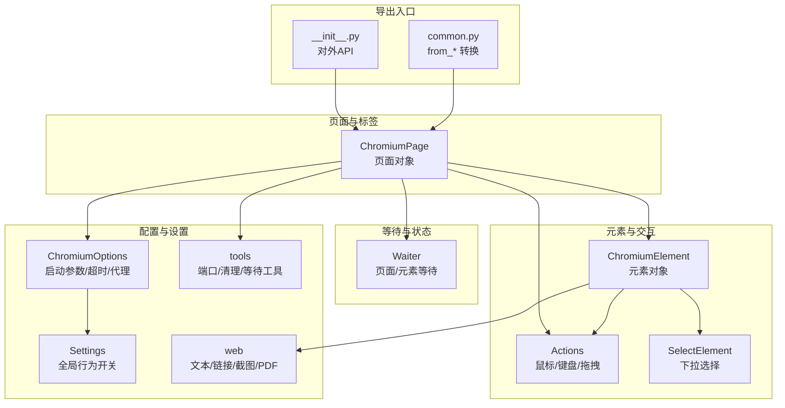
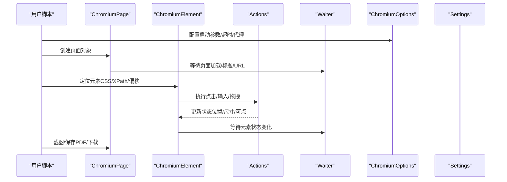
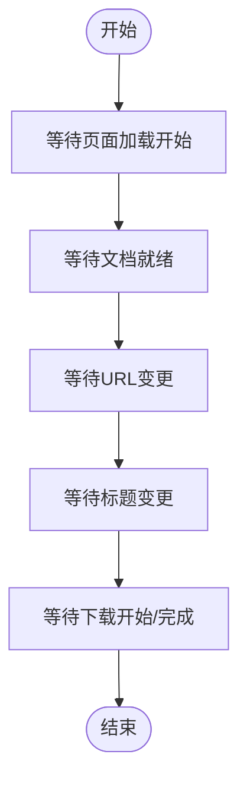
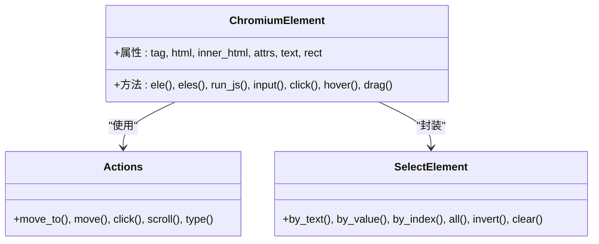
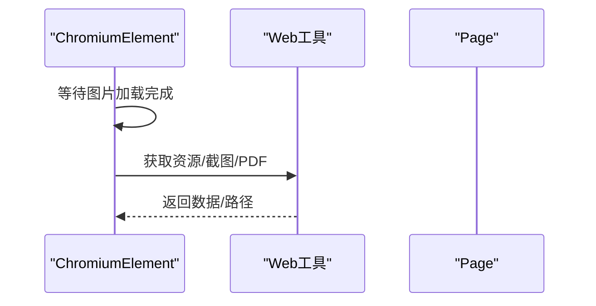
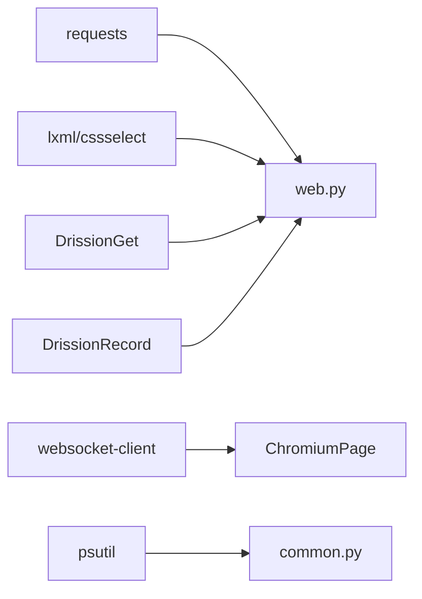

# 性能诊断与优化

<cite>
**本文引用的文件**
- [__init__.py](file://DrissionPage/__init__.py)
- [common.py](file://DrissionPage/common.py)
- [chromium_page.py](file://DrissionPage/_pages/chromium_page.py)
- [chromium_element.py](file://DrissionPage/_elements/chromium_element.py)
- [settings.py](file://DrissionPage/_functions/settings.py)
- [actions.py](file://DrissionPage/_units/actions.py)
- [waiter.py](file://DrissionPage/_units/waiter.py)
- [chromium_options.py](file://DrissionPage/_configs/chromium_options.py)
- [tools.py](file://DrissionPage/_functions/tools.py)
- [selector.py](file://DrissionPage/_units/selector.py)
- [web.py](file://DrissionPage/_functions/web.py)
- [requirements.txt](file://requirements.txt)
</cite>

## 目录
1. [简介](#简介)
2. [项目结构](#项目结构)
3. [核心组件](#核心组件)
4. [架构总览](#架构总览)
5. [详细组件分析](#详细组件分析)
6. [依赖分析](#依赖分析)
7. [性能考量](#性能考量)
8. [故障排查指南](#故障排查指南)
9. [结论](#结论)
10. [附录：性能测试与基准实践](#附录性能测试与基准实践)

## 简介
本指南聚焦 DrissionPage 在实际使用中的性能诊断与优化，围绕页面加载、元素定位、交互与资源管理等关键环节，提供可落地的诊断方法、监控手段与优化策略，并给出性能测试与基准实践建议。文档基于仓库内源码实现细节进行分析，确保建议与实现一致。

## 项目结构
DrissionPage 的核心模块按职责分层组织：
- 页面与标签页：ChromiumPage、ChromiumTab
- 元素模型：ChromiumElement 及其子功能（点击、滚动、选择器等）
- 输入与动作：Actions
- 等待与状态：Waiter（页面、元素、帧等）
- 配置与选项：ChromiumOptions（超时、参数、代理、缓存等）
- 工具与设置：Settings、tools、web
- 导出入口：__init__.py、common.py

图表来源
- [chromium_page.py:17-103](file://DrissionPage/_pages/chromium_page.py#L17-L103)
- [chromium_element.py:38-800](file://DrissionPage/_elements/chromium_element.py#L38-L800)
- [actions.py:16-266](file://DrissionPage/_units/actions.py#L16-L266)
- [waiter.py:15-433](file://DrissionPage/_units/waiter.py#L15-L433)
- [chromium_options.py:16-417](file://DrissionPage/_configs/chromium_options.py#L16-L417)
- [settings.py:13-69](file://DrissionPage/_functions/settings.py#L13-L69)
- [tools.py:21-213](file://DrissionPage/_functions/tools.py#L21-L213)
- [web.py:1-349](file://DrissionPage/_functions/web.py#L1-L349)
- [__init__.py:22-29](file://DrissionPage/__init__.py#L22-L29)
- [common.py:22-57](file://DrissionPage/common.py#L22-L57)

章节来源
- [__init__.py:22-29](file://DrissionPage/__init__.py#L22-L29)
- [common.py:18-57](file://DrissionPage/common.py#L18-L57)
- [chromium_page.py:17-103](file://DrissionPage/_pages/chromium_page.py#L17-L103)
- [chromium_element.py:38-800](file://DrissionPage/_elements/chromium_element.py#L38-L800)
- [actions.py:16-266](file://DrissionPage/_units/actions.py#L16-L266)
- [waiter.py:15-433](file://DrissionPage/_units/waiter.py#L15-L433)
- [chromium_options.py:16-417](file://DrissionPage/_configs/chromium_options.py#L16-L417)
- [settings.py:13-69](file://DrissionPage/_functions/settings.py#L13-L69)
- [tools.py:21-213](file://DrissionPage/_functions/tools.py#L21-L213)
- [web.py:1-349](file://DrissionPage/_functions/web.py#L1-L349)

## 核心组件
- 页面对象（ChromiumPage）：封装标签页生命周期、多标签管理、浏览器退出等；提供 wait/set 属性访问等待器与设置器。
- 元素对象（ChromiumElement）：封装 DOM 访问、属性/文本/样式、滚动、点击、输入、文件上传、截图、资源下载等；内部通过 CDP 与浏览器交互。
- 动作系统（Actions）：鼠标移动、点击、滚轮、按键、拖拽等，支持平滑轨迹与节流。
- 等待系统（Waiter）：页面加载、元素可见/隐藏/可点、下载开始/完成、弹窗关闭等，统一使用计时与轮询。
- 配置系统（ChromiumOptions）：启动参数、超时、代理、用户数据目录、缓存路径、隐身/静音/禁图等。
- 工具与设置（Settings/tools/web）：全局开关（如异常抛出策略）、端口查找、等待 until、文本/链接/截图/PDF 处理。

章节来源
- [chromium_page.py:17-103](file://DrissionPage/_pages/chromium_page.py#L17-L103)
- [chromium_element.py:38-800](file://DrissionPage/_elements/chromium_element.py#L38-L800)
- [actions.py:16-266](file://DrissionPage/_units/actions.py#L16-L266)
- [waiter.py:15-433](file://DrissionPage/_units/waiter.py#L15-L433)
- [chromium_options.py:16-417](file://DrissionPage/_configs/chromium_options.py#L16-L417)
- [settings.py:13-69](file://DrissionPage/_functions/settings.py#L13-L69)
- [tools.py:21-213](file://DrissionPage/_functions/tools.py#L21-L213)
- [web.py:1-349](file://DrissionPage/_functions/web.py#L1-L349)

## 架构总览
DrissionPage 的运行时主要通过 CDP（Chrome DevTools Protocol）与浏览器通信，页面与元素对象作为高层抽象，将复杂交互封装为简洁 API。等待器贯穿各环节，保证在异步页面状态变化下的稳定性。

图表来源
- [chromium_page.py:17-103](file://DrissionPage/_pages/chromium_page.py#L17-L103)
- [chromium_element.py:38-800](file://DrissionPage/_elements/chromium_element.py#L38-L800)
- [actions.py:16-266](file://DrissionPage/_units/actions.py#L16-L266)
- [waiter.py:15-433](file://DrissionPage/_units/waiter.py#L15-L433)
- [chromium_options.py:16-417](file://DrissionPage/_configs/chromium_options.py#L16-L417)
- [settings.py:13-69](file://DrissionPage/_functions/settings.py#L13-L69)

## 详细组件分析

### 页面加载与等待（ChromiumPage/Waiter）
- 页面等待：通过 wait.load_start/doc_loaded/url_change/title_change/download_begin 等接口，结合 Settings 中的超时与异常策略，避免盲目阻塞。
- 下载等待：支持单标签与全浏览器维度的下载完成检测，超时可取消任务。
- 新标签/弹窗：提供新标签打开与弹窗关闭的等待逻辑，减少轮询开销。

图表来源
- [waiter.py:164-235](file://DrissionPage/_units/waiter.py#L164-L235)
- [waiter.py:186-220](file://DrissionPage/_units/waiter.py#L186-L220)
- [waiter.py:238-287](file://DrissionPage/_units/waiter.py#L238-L287)

章节来源
- [chromium_page.py:51-103](file://DrissionPage/_pages/chromium_page.py#L51-L103)
- [waiter.py:15-433](file://DrissionPage/_units/waiter.py#L15-L433)
- [settings.py:13-69](file://DrissionPage/_functions/settings.py#L13-L69)

### 元素定位与交互（ChromiumElement/Actions/Selector）
- 定位策略：支持 CSS/XPath/相对定位（前后左右）、偏移点击、相对元素查找；内部使用 CDP 查询与校验，必要时重试。
- 交互优化：Actions 将长距离移动拆分为多步，控制每步耗时，降低卡顿；输入前等待可点击，减少失败重试。
- 下拉选择：SelectElement 支持按文本/值/索引/定位器选择，批量切换时触发一次 change 事件，减少多次 dispatch。

图表来源
- [chromium_element.py:38-800](file://DrissionPage/_elements/chromium_element.py#L38-L800)
- [actions.py:16-266](file://DrissionPage/_units/actions.py#L16-L266)
- [selector.py:13-161](file://DrissionPage/_units/selector.py#L13-L161)

章节来源
- [chromium_element.py:419-573](file://DrissionPage/_elements/chromium_element.py#L419-L573)
- [actions.py:25-189](file://DrissionPage/_units/actions.py#L25-L189)
- [selector.py:105-161](file://DrissionPage/_units/selector.py#L105-L161)

### 资源获取与截图（ChromiumElement/Web）
- 图片/资源：优先等待 img 自然宽高，支持 blob/base64/CDP 获取；提供保存与命名规则，避免重复写入。
- 截图：滚动至元素中心再截图，避免部分不可见区域；支持字节/字符串返回。
- PDF/MHTML：通过 CDP 输出，支持背景打印与编码转换。

图表来源
- [chromium_element.py:442-546](file://DrissionPage/_elements/chromium_element.py#L442-L546)
- [web.py:169-255](file://DrissionPage/_functions/web.py#L169-L255)

章节来源
- [chromium_element.py:442-546](file://DrissionPage/_elements/chromium_element.py#L442-L546)
- [web.py:169-255](file://DrissionPage/_functions/web.py#L169-L255)

### 配置与超时（ChromiumOptions/Settings）
- 启动参数：禁图、静音、隐身、证书错误、本地端口、用户数据目录、缓存目录、加载模式等。
- 超时：base/page_load/script 三类超时可分别设置；等待器与元素等待默认使用对应超时。
- 重试：连接/端口分配等场景具备重试次数与间隔配置。

章节来源
- [chromium_options.py:16-417](file://DrissionPage/_configs/chromium_options.py#L16-L417)
- [settings.py:13-69](file://DrissionPage/_functions/settings.py#L13-L69)
- [tools.py:37-56](file://DrissionPage/_functions/tools.py#L37-L56)

## 依赖分析
- 外部依赖：requests、lxml、cssselect、DrissionGet、DrissionRecord、websocket-client、click、tldextract、psutil。
- 关键依赖用途：HTTP 请求、DOM 解析、选择器、记录工具、WebSocket 通信、命令行、域名解析、进程与网络信息。

图表来源
- [requirements.txt:1-9](file://requirements.txt#L1-L9)
- [web.py:1-349](file://DrissionPage/_functions/web.py#L1-L349)
- [chromium_page.py:17-103](file://DrissionPage/_pages/chromium_page.py#L17-L103)
- [common.py:47-56](file://DrissionPage/common.py#L47-L56)

章节来源
- [requirements.txt:1-9](file://requirements.txt#L1-L9)

## 性能考量
- 页面加载
  - 使用加载模式与禁图/禁JS策略（在允许场景下）降低首屏渲染成本。
  - 合理设置 page_load 超时，避免长时间阻塞；对静态页面可缩短超时。
- 元素定位
  - 优先使用稳定且范围小的选择器（如 ID/CSS），减少 DOM 搜索范围。
  - 对频繁查询的元素，复用已定位对象，避免重复 CDP 查询。
  - 使用相对定位与偏移点击减少跨层级查找。
- 交互与输入
  - 使用 Actions 的平滑移动与节流，避免高频微小移动造成卡顿。
  - 输入前等待可点击，减少无效尝试；批量输入时设置合理间隔。
- 下拉选择
  - 多选场景一次性切换多个选项后触发一次 change，减少事件分发。
- 资源与截图
  - 对大图/视频资源，先等待加载完成再截图，避免空白或截断。
  - PDF/MHTML 输出时启用背景打印与合适的编码，减少二次处理。
- 配置与环境
  - 启用缓存目录与用户数据目录，提升后续启动速度。
  - 合理设置脚本超时，避免长脚本阻塞整体流程。
- 等待策略
  - 使用精确等待（如元素可点/停止移动）替代固定 sleep，提高响应性。
  - 对下载/弹窗等异步事件，使用专用等待器，避免忙等。

[本节为通用性能指导，无需特定文件引用]

## 故障排查指南
- 等待超时
  - 检查 Settings 的等待失败策略（抛错/返回 False），确认超时是否合理。
  - 使用 Waiter 的具体等待类型（元素可点/停止移动/URL变更）细化条件。
- 元素丢失/连接断开
  - 页面导航或元素销毁会导致 CDP 错误；可在捕获到相应异常时重试或刷新元素对象。
- 端口占用/浏览器连接失败
  - 使用 PortFinder 获取可用端口，避免冲突；必要时清理临时目录。
- 下载路径缺失
  - 下载等待器需要设置下载路径，否则会报错；确保路径存在且可写。
- 文本/链接解析异常
  - 使用 web 工具提供的格式化函数与绝对链接转换，避免解析偏差。

章节来源
- [waiter.py:46-82](file://DrissionPage/_units/waiter.py#L46-L82)
- [tools.py:139-198](file://DrissionPage/_functions/tools.py#L139-L198)
- [chromium_options.py:332-338](file://DrissionPage/_configs/chromium_options.py#L332-L338)
- [web.py:106-158](file://DrissionPage/_functions/web.py#L106-L158)

## 结论
通过合理配置启动参数与超时、优化选择器与交互策略、采用精确等待与资源管理，可显著提升 DrissionPage 的执行效率与稳定性。建议在关键流程中加入性能观测点（执行时间、内存占用、网络请求数），并结合基准测试持续迭代优化。

[本节为总结，无需特定文件引用]

## 附录：性能测试与基准实践
- 性能观测
  - 执行时间：在关键步骤前后记录时间戳，统计平均/分位数。
  - 内存占用：结合系统工具或 Python 监控库观察进程内存峰值。
  - 网络请求：统计请求数量、大小与耗时，识别瓶颈资源。
- 基准测试
  - 设定固定数据集与页面，重复执行相同流程，计算多次结果的均值与标准差。
  - 分场景对比：禁图/禁JS、不同超时、不同选择器策略等，评估影响。
- 实施要点
  - 固定环境：浏览器版本、扩展、代理、网络条件保持一致。
  - 控制变量：每次只改变一个变量，确保结果可解释。
  - 结果归档：记录配置、硬件、运行日志与指标，便于复现与对比。

[本节为通用实践建议，无需特定文件引用]