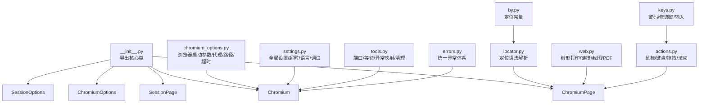
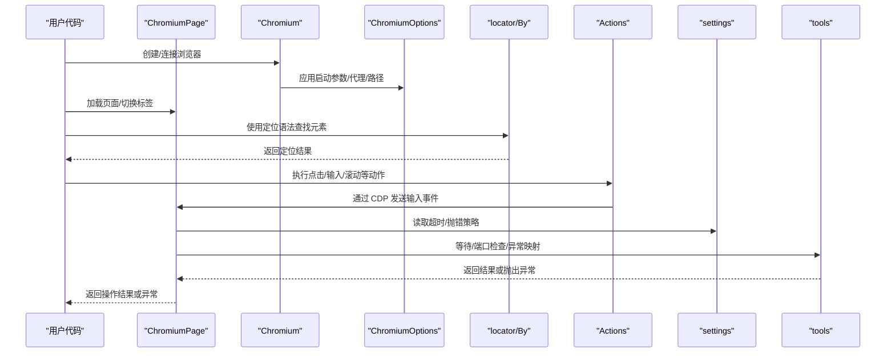
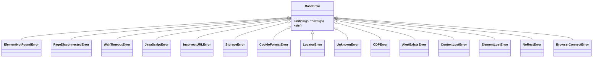
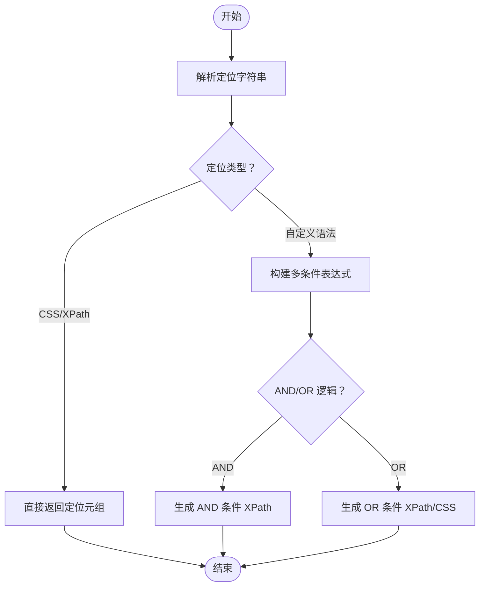
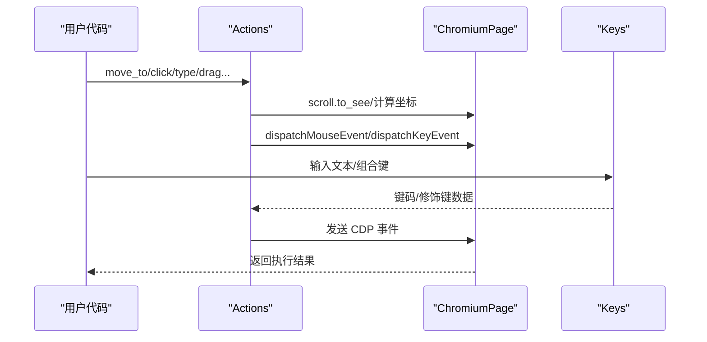
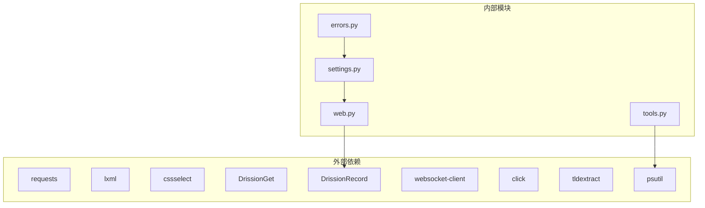

# 故障排除与调试

<cite>
**本文引用的文件**   
- [__init__.py](file://DrissionPage/__init__.py)
- [errors.py](file://DrissionPage/errors.py)
- [common.py](file://DrissionPage/common.py)
- [tools.py](file://DrissionPage/_functions/tools.py)
- [settings.py](file://DrissionPage/_functions/settings.py)
- [chromium_options.py](file://DrissionPage/_configs/chromium_options.py)
- [web.py](file://DrissionPage/_functions/web.py)
- [by.py](file://DrissionPage/_functions/by.py)
- [locator.py](file://DrissionPage/_functions/locator.py)
- [keys.py](file://DrissionPage/_functions/keys.py)
- [actions.py](file://DrissionPage/_units/actions.py)
- [requirements.txt](file://requirements.txt)
</cite>

## 目录
1. [简介](#简介)
2. [项目结构](#项目结构)
3. [核心组件](#核心组件)
4. [架构总览](#架构总览)
5. [详细组件分析](#详细组件分析)
6. [依赖分析](#依赖分析)
7. [性能考虑](#性能考虑)
8. [故障排除指南](#故障排除指南)
9. [结论](#结论)
10. [附录](#附录)

## 简介
本指南面向使用 DrissionPage 的开发者与测试工程师，聚焦“故障排除与调试”。内容覆盖常见错误类型与解决方案（连接失败、元素找不到、超时等）、系统化调试方法与工具使用、日志与输出分析、性能诊断与优化、浏览器兼容性排查、网络与代理问题处理、内存与资源管理监控，以及社区支持与问题反馈渠道。

## 项目结构
DrissionPage 采用模块化设计，围绕浏览器控制（Chromium）、页面与元素抽象、配置与选项、定位器与键盘输入、动作执行、通用工具与设置等维度组织代码。主要模块如下：
- 浏览器与页面：Chromium、ChromiumPage、SessionPage
- 配置：ChromiumOptions、SessionOptions
- 定位与选择：By、locator、web（树形打印、链接处理）
- 输入与动作：Actions、Keys
- 工具与设置：tools（端口、等待、异常映射）、settings（超时、语言、调试开关）
- 错误体系：errors（统一异常基类与各类业务异常）

**图表来源**
- [__init__.py:22-28](file://DrissionPage/__init__.py#L22-L28)
- [chromium_options.py:16-85](file://DrissionPage/_configs/chromium_options.py#L16-L85)
- [settings.py:13-69](file://DrissionPage/_functions/settings.py#L13-L69)
- [tools.py:15-19](file://DrissionPage/_functions/tools.py#L15-L19)
- [errors.py:11-95](file://DrissionPage/errors.py#L11-L95)
- [locator.py:15-51](file://DrissionPage/_functions/locator.py#L15-L51)
- [by.py:10-19](file://DrissionPage/_functions/by.py#L10-L19)
- [web.py:257-302](file://DrissionPage/_functions/web.py#L257-L302)
- [actions.py:16-266](file://DrissionPage/_units/actions.py#L16-L266)
- [keys.py:23-451](file://DrissionPage/_functions/keys.py#L23-L451)

**章节来源**
- [__init__.py:22-28](file://DrissionPage/__init__.py#L22-L28)

## 核心组件
- 异常体系：统一继承自 BaseError，涵盖元素缺失、CDP 错误、页面断开、JavaScript 错误、超时、URL 错误、存储/Cookie 格式错误、目标未找到、定位器错误、未知错误等，便于精准定位问题。
- 设置与超时：通过 Settings 控制元素未找到/点击失败/等待失败的抛错策略、CDP 超时、浏览器连接超时、自动处理弹窗、语言与调试开关等。
- 工具与异常映射：tools.raise_error 将底层 CDP 错误映射为具体异常；PortFinder 提供端口分配与占用检测；wait_until 提供统一等待机制。
- 定位与选择：By 提供标准定位类型；locator 支持自定义语法（如 @id=、text=、tag= 等）与转换为 XPath/CSS；web.tree 打印 DOM 树辅助定位。
- 输入与动作：Actions 提供移动、点击、滚轮、键盘输入、拖拽等；Keys 提供键码与修饰键映射。
- 配置：ChromiumOptions 管理浏览器路径、用户数据目录、下载/临时路径、加载模式、代理、头像、参数、超时、重试次数与间隔、自动端口等。

**章节来源**
- [errors.py:11-95](file://DrissionPage/errors.py#L11-L95)
- [settings.py:13-69](file://DrissionPage/_functions/settings.py#L13-L69)
- [tools.py:157-198](file://DrissionPage/_functions/tools.py#L157-L198)
- [by.py:10-19](file://DrissionPage/_functions/by.py#L10-L19)
- [locator.py:15-51](file://DrissionPage/_functions/locator.py#L15-L51)
- [web.py:257-302](file://DrissionPage/_functions/web.py#L257-L302)
- [actions.py:16-266](file://DrissionPage/_units/actions.py#L16-L266)
- [keys.py:23-451](file://DrissionPage/_functions/keys.py#L23-L451)
- [chromium_options.py:16-85](file://DrissionPage/_configs/chromium_options.py#L16-L85)

## 架构总览
下图展示 DrissionPage 的关键交互：上层通过 Chromium/ChromiumPage 访问浏览器，借助 ChromiumOptions 配置启动参数与代理；定位器将用户输入转换为 XPath/CSS；Actions/Keys 通过 CDP 发送输入事件；tools 与 settings 提供异常映射与超时控制；errors 提供统一异常类型。

**图表来源**
- [__init__.py:22-28](file://DrissionPage/__init__.py#L22-L28)
- [chromium_options.py:16-85](file://DrissionPage/_configs/chromium_options.py#L16-L85)
- [locator.py:15-51](file://DrissionPage/_functions/locator.py#L15-L51)
- [by.py:10-19](file://DrissionPage/_functions/by.py#L10-L19)
- [actions.py:16-266](file://DrissionPage/_units/actions.py#L16-L266)
- [settings.py:13-69](file://DrissionPage/_functions/settings.py#L13-L69)
- [tools.py:139-148](file://DrissionPage/_functions/tools.py#L139-L148)

## 详细组件分析

### 异常体系与错误映射
- 统一异常基类：BaseError，支持本地化消息拼接。
- 常见异常类型：ElementNotFoundError、PageDisconnectedError、WaitTimeoutError、JavaScriptError、IncorrectURLError、StorageError、CookieFormatError、LocatorError、UnknownError 等。
- 异常映射：tools.raise_error 将底层 CDP 错误字符串映射为具体异常，并支持忽略特定类型或用户自定义异常。

**图表来源**
- [errors.py:11-95](file://DrissionPage/errors.py#L11-L95)

**章节来源**
- [errors.py:11-95](file://DrissionPage/errors.py#L11-L95)
- [tools.py:157-198](file://DrissionPage/_functions/tools.py#L157-L198)

### 设置与超时控制
- 关键设置项：元素未找到/点击失败/等待失败的抛错策略；CDP 超时；浏览器连接超时；自动处理弹窗；语言与调试开关；单例标签对象；后缀列表路径。
- 推荐实践：在复杂流程中提高 CDP 超时与等待超时；在调试阶段开启调试输出；根据环境调整连接超时。

**章节来源**
- [settings.py:13-69](file://DrissionPage/_functions/settings.py#L13-L69)

### 定位器与元素查找
- 定位语法：支持 @id=、@class=、text=、tag=、xpath:、css: 等；支持多条件组合与否定；可转换为 XPath 或 CSS。
- 辅助工具：web.tree 可打印 DOM 树，快速定位元素层级与属性。

**图表来源**
- [locator.py:15-51](file://DrissionPage/_functions/locator.py#L15-L51)
- [locator.py:147-195](file://DrissionPage/_functions/locator.py#L147-L195)
- [locator.py:198-235](file://DrissionPage/_functions/locator.py#L198-L235)

**章节来源**
- [by.py:10-19](file://DrissionPage/_functions/by.py#L10-L19)
- [locator.py:15-51](file://DrissionPage/_functions/locator.py#L15-L51)
- [web.py:257-302](file://DrissionPage/_functions/web.py#L257-L302)

### 输入与动作执行
- Actions：移动、点击、滚轮、修饰键、键盘输入、拖拽等；内部通过 CDP 发送事件；支持按像素偏移与持续时间控制。
- Keys：键码映射、修饰键位、跨平台（Mac/Win/Linux）处理；支持组合键与字符输入。

**图表来源**
- [actions.py:25-146](file://DrissionPage/_units/actions.py#L25-L146)
- [keys.py:371-451](file://DrissionPage/_functions/keys.py#L371-L451)

**章节来源**
- [actions.py:16-266](file://DrissionPage/_units/actions.py#L16-L266)
- [keys.py:23-451](file://DrissionPage/_functions/keys.py#L23-L451)

### 配置与代理
- ChromiumOptions：浏览器路径、用户数据目录、下载/临时路径、加载模式、参数、扩展、偏好、标志、地址/WS 地址、自动端口、现有实例模式、新环境变量、证书错误忽略、UA、代理、超时、重试等。
- 代理设置：支持 http/https 代理，解析代理字符串为 URL、用户名、密码；可通过 set_proxy 应用。

**章节来源**
- [chromium_options.py:16-85](file://DrissionPage/_configs/chromium_options.py#L16-L85)
- [chromium_options.py:293-296](file://DrissionPage/_configs/chromium_options.py#L293-L296)
- [chromium_options.py:305-321](file://DrissionPage/_configs/chromium_options.py#L305-L321)
- [chromium_options.py:364-408](file://DrissionPage/_configs/chromium_options.py#L364-L408)

## 依赖分析
- 外部依赖：requests、lxml、cssselect、DrissionGet、DrissionRecord、websocket-client、click、tldextract、psutil。
- 内部依赖：tools 依赖 psutil 进行进程连接检测；web 依赖 DrissionRecord 的工具函数；settings 依赖本地化文本类；errors 依赖 Settings 的语言支持。

**图表来源**
- [requirements.txt:1-9](file://requirements.txt#L1-L9)
- [tools.py:47-56](file://DrissionPage/_functions/tools.py#L47-L56)
- [web.py:14-16](file://DrissionPage/_functions/web.py#L14-L16)
- [settings.py:10-21](file://DrissionPage/_functions/settings.py#L10-L21)
- [errors.py:8-18](file://DrissionPage/errors.py#L8-L18)

**章节来源**
- [requirements.txt:1-9](file://requirements.txt#L1-L9)

## 性能考虑
- 超时与重试：合理设置 CDP 超时与页面加载超时；对不稳定接口增加重试次数与间隔。
- 资源与路径：设置合理的下载/临时路径，避免磁盘 IO 压力；必要时禁用图片/JS 降低带宽与渲染压力。
- 动作与滚动：使用 Actions 的平滑移动与滚轮，减少频繁强制滚动；在大页面中优先可见区域操作。
- 代理与网络：确保代理稳定与低延迟；必要时直连或更换代理节点。
- 日志与调试：在开发阶段开启调试输出，生产关闭以减少开销。

[本节为通用指导，无需列出章节来源]

## 故障排除指南

### 1. 连接失败
- 症状
  - 无法连接到本地浏览器或远程地址
  - 抛出浏览器连接错误或页面断开异常
- 常见原因
  - 端口被占用或地址不正确
  - 浏览器未以调试模式启动
  - 代理/网络限制导致连接失败
- 解决步骤
  - 使用端口检测工具确认端口可用；必要时启用自动端口分配
  - 检查 ChromiumOptions 的地址/WS 地址设置是否正确
  - 在本地 Windows 上隐藏/显示浏览器窗口需管理员权限与相关库
  - 如使用代理，确认代理可用性与认证信息
- 相关实现参考
  - 端口分配与占用检测：[tools.py:21-56](file://DrissionPage/_functions/tools.py#L21-L56)
  - 端口占用检测：[tools.py:58-64](file://DrissionPage/_functions/tools.py#L58-L64)
  - 自动端口开关：[chromium_options.py:354-358](file://DrissionPage/_configs/chromium_options.py#L354-L358)
  - 地址/WS 地址设置：[chromium_options.py:311-321](file://DrissionPage/_configs/chromium_options.py#L311-L321)
  - Windows 显示/隐藏浏览器窗口：[tools.py:79-99](file://DrissionPage/_functions/tools.py#L79-L99)

**章节来源**
- [tools.py:21-56](file://DrissionPage/_functions/tools.py#L21-L56)
- [tools.py:58-64](file://DrissionPage/_functions/tools.py#L58-L64)
- [chromium_options.py:354-358](file://DrissionPage/_configs/chromium_options.py#L354-L358)
- [chromium_options.py:311-321](file://DrissionPage/_configs/chromium_options.py#L311-L321)
- [tools.py:79-99](file://DrissionPage/_functions/tools.py#L79-L99)

### 2. 元素找不到
- 症状
  - 查找元素返回空或抛出元素未找到异常
- 常见原因
  - 定位语法不正确或目标尚未渲染
  - 页面结构变化或动态加载
  - 作用域错误（frame/tab 切换）
- 解决步骤
  - 使用 web.tree 打印 DOM 树核对层级与属性
  - 使用更稳定的定位策略（如基于文本/属性的组合）
  - 提高等待时间或使用显式等待
  - 确认当前页面上下文（主文档/iframe/新标签页）
- 相关实现参考
  - 定位语法解析与转换：[locator.py:147-195](file://DrissionPage/_functions/locator.py#L147-L195)
  - DOM 树打印：[web.py:257-302](file://DrissionPage/_functions/web.py#L257-L302)
  - 设置抛错策略：[settings.py:26-38](file://DrissionPage/_functions/settings.py#L26-L38)

**章节来源**
- [locator.py:147-195](file://DrissionPage/_functions/locator.py#L147-L195)
- [web.py:257-302](file://DrissionPage/_functions/web.py#L257-L302)
- [settings.py:26-38](file://DrissionPage/_functions/settings.py#L26-L38)

### 3. 超时错误
- 症状
  - CDP 请求超时、页面加载超时、等待元素超时
- 常见原因
  - 网络慢或服务端响应慢
  - 页面资源过多导致加载缓慢
  - 设置的超时过短
- 解决步骤
  - 适当提高 CDP 超时与页面加载超时
  - 减少不必要的资源加载（禁用图片/JS）
  - 使用显式等待与重试策略
- 相关实现参考
  - 设置超时：[settings.py:46-53](file://DrissionPage/_functions/settings.py#L46-L53)
  - 显式等待：[tools.py:139-148](file://DrissionPage/_functions/tools.py#L139-L148)
  - ChromiumOptions 超时设置：[chromium_options.py:246-254](file://DrissionPage/_configs/chromium_options.py#L246-L254)

**章节来源**
- [settings.py:46-53](file://DrissionPage/_functions/settings.py#L46-L53)
- [tools.py:139-148](file://DrissionPage/_functions/tools.py#L139-L148)
- [chromium_options.py:246-254](file://DrissionPage/_configs/chromium_options.py#L246-L254)

### 4. JavaScript 错误与弹窗
- 症状
  - 执行 JS 报错或弹窗未处理导致流程中断
- 常见原因
  - JS 语法错误或运行时异常
  - 页面存在未捕获的弹窗
- 解决步骤
  - 捕获并处理 JavaScriptError
  - 开启自动处理弹窗或手动处理
- 相关实现参考
  - JavaScriptError 类型：[errors.py:45-46](file://DrissionPage/errors.py#L45-L46)
  - 自动处理弹窗设置：[settings.py:56-58](file://DrissionPage/_functions/settings.py#L56-L58)

**章节来源**
- [errors.py:45-46](file://DrissionPage/errors.py#L45-L46)
- [settings.py:56-58](file://DrissionPage/_functions/settings.py#L56-L58)

### 5. URL/存储/Cookie 错误
- 症状
  - 无效 URL 导致导航失败
  - 存储序列化错误或 Cookie 格式错误
- 解决步骤
  - 校验 URL 格式；必要时修复协议
  - 清理存储或使用独立用户数据目录
  - 检查 Cookie 字段与格式
- 相关实现参考
  - URL 错误映射：[tools.py:174-175](file://DrissionPage/_functions/tools.py#L174-L175)
  - 存储错误映射：[tools.py:176-177](file://DrissionPage/_functions/tools.py#L176-L177)
  - Cookie 格式错误映射：[tools.py:178-179](file://DrissionPage/_functions/tools.py#L178-L179)

**章节来源**
- [tools.py:174-179](file://DrissionPage/_functions/tools.py#L174-L179)

### 6. 定位器错误
- 症状
  - 定位语法冲突或格式不正确
- 解决步骤
  - 检查符号冲突（如 @@ 与 @| 同时使用）
  - 使用标准定位类型或转换为 XPath/CSS
- 相关实现参考
  - 定位器错误类型：[errors.py:89-90](file://DrissionPage/errors.py#L89-L90)
  - 定位语法解析：[locator.py:54-71](file://DrissionPage/_functions/locator.py#L54-L71)

**章节来源**
- [errors.py:89-90](file://DrissionPage/errors.py#L89-L90)
- [locator.py:54-71](file://DrissionPage/_functions/locator.py#L54-L71)

### 7. 日志记录与输出分析
- 方法
  - 使用 Settings 设置语言与调试开关
  - 通过 web.tree 输出 DOM 结构，辅助定位
  - 对关键步骤添加时间戳与状态输出
- 相关实现参考
  - 设置语言与调试：[settings.py:61-63](file://DrissionPage/_functions/settings.py#L61-L63)
  - DOM 树打印：[web.py:257-302](file://DrissionPage/_functions/web.py#L257-L302)

**章节来源**
- [settings.py:61-63](file://DrissionPage/_functions/settings.py#L61-L63)
- [web.py:257-302](file://DrissionPage/_functions/web.py#L257-L302)

### 8. 性能问题诊断与优化
- 诊断
  - 使用显式等待与超时统计
  - 分析页面资源加载情况（图片/JS/样式）
- 优化
  - 启用自动端口与合适的超时
  - 禁用不必要的资源加载
  - 合理拆分任务与重试策略
- 相关实现参考
  - 超时设置：[settings.py:46-53](file://DrissionPage/_functions/settings.py#L46-L53)
  - 自动端口：[chromium_options.py:354-358](file://DrissionPage/_configs/chromium_options.py#L354-L358)
  - 禁用图片/JS 示例：[chromium_options.py:265-271](file://DrissionPage/_configs/chromium_options.py#L265-L271)

**章节来源**
- [settings.py:46-53](file://DrissionPage/_functions/settings.py#L46-L53)
- [chromium_options.py:354-358](file://DrissionPage/_configs/chromium_options.py#L354-L358)
- [chromium_options.py:265-271](file://DrissionPage/_configs/chromium_options.py#L265-L271)

### 9. 浏览器兼容性问题排查
- 方法
  - 指定浏览器路径或使用 Edge 路径
  - 设置 UA 与禁用 JS/图片等特性
  - 在不同系统上验证键码与修饰键行为
- 相关实现参考
  - 浏览器路径设置：[chromium_options.py:323-330](file://DrissionPage/_configs/chromium_options.py#L323-L330)
  - UA 设置：[chromium_options.py:290-291](file://DrissionPage/_configs/chromium_options.py#L290-L291)
  - 键码与修饰键：[keys.py:23-451](file://DrissionPage/_functions/keys.py#L23-L451)

**章节来源**
- [chromium_options.py:323-330](file://DrissionPage/_configs/chromium_options.py#L323-L330)
- [chromium_options.py:290-291](file://DrissionPage/_configs/chromium_options.py#L290-L291)
- [keys.py:23-451](file://DrissionPage/_functions/keys.py#L23-L451)

### 10. 网络问题与代理配置
- 方法
  - 使用 set_proxy 设置代理；解析代理字符串为 URL/用户名/密码
  - 检查代理可用性与认证
- 相关实现参考
  - 代理设置与解析：[chromium_options.py:293-296](file://DrissionPage/_configs/chromium_options.py#L293-L296)
  - 代理字符串解析：[web.py:321-348](file://DrissionPage/_functions/web.py#L321-L348)

**章节来源**
- [chromium_options.py:293-296](file://DrissionPage/_configs/chromium_options.py#L293-L296)
- [web.py:321-348](file://DrissionPage/_functions/web.py#L321-L348)

### 11. 内存泄漏与资源管理
- 方法
  - 合理设置下载/临时路径，避免磁盘与内存压力
  - 使用 ensure_del_dir 删除临时目录，避免残留
  - 在长时间运行场景中定期重启浏览器或清理缓存
- 相关实现参考
  - 临时目录删除：[tools.py:200-212](file://DrissionPage/_functions/tools.py#L200-L212)

**章节来源**
- [tools.py:200-212](file://DrissionPage/_functions/tools.py#L200-L212)

### 12. 社区支持与问题反馈
- 建议
  - 在使用过程中遇到问题，结合异常类型与日志输出进行复现与归类
  - 参考官方文档与示例，逐步缩小问题范围
  - 通过项目维护方提供的渠道提交问题与建议

[本节为通用指导，无需列出章节来源]

## 结论
通过统一的异常体系、完善的设置与超时控制、强大的定位与动作能力、以及工具化的端口与等待机制，DrissionPage 能够有效支撑自动化脚本的稳定性与可维护性。建议在开发与测试阶段充分利用调试输出、DOM 树打印与显式等待，在生产环境中合理配置超时、代理与资源加载策略，并建立规范的问题反馈与升级流程。

## 附录
- 快速检查清单
  - 确认浏览器已以调试模式启动且地址/端口正确
  - 检查定位语法与目标元素是否可见
  - 提高 CDP/页面加载超时，必要时禁用图片/JS
  - 使用代理时校验认证与可用性
  - 使用 web.tree 核对 DOM 结构
  - 启用调试输出并收集日志

[本节为通用指导，无需列出章节来源]