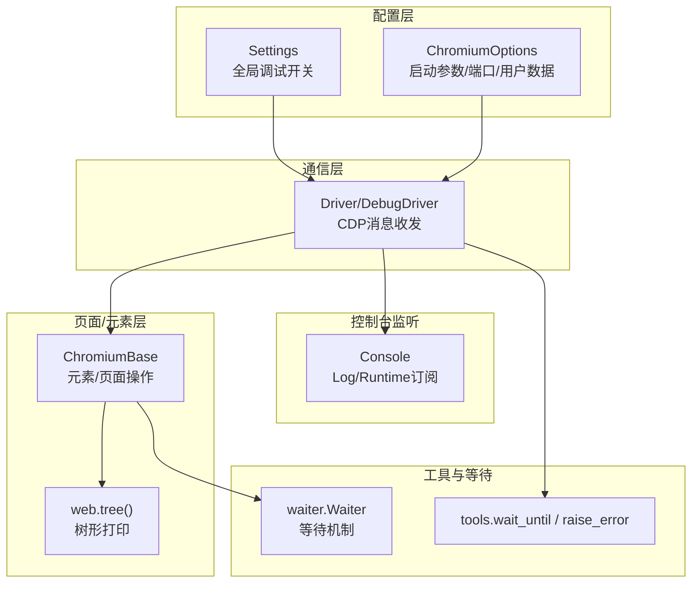
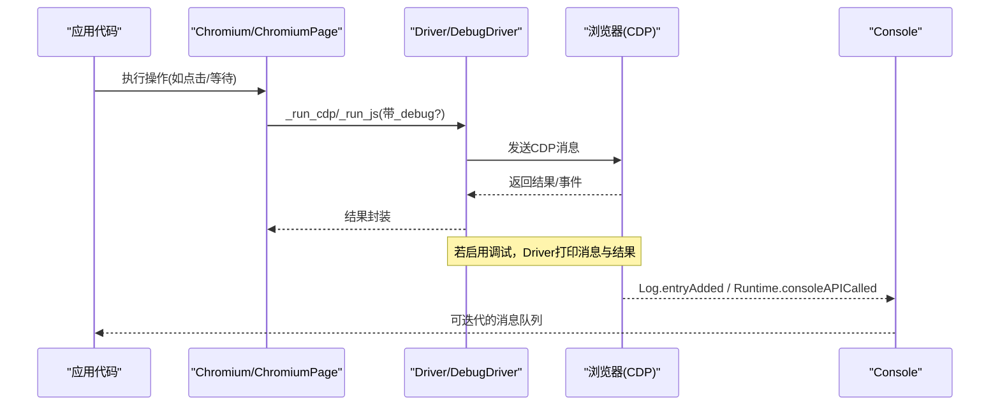
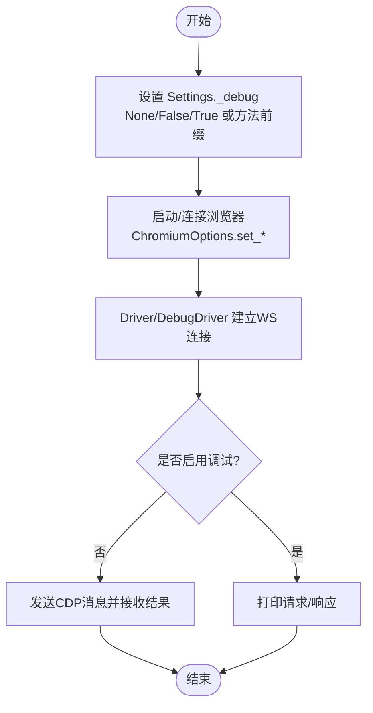
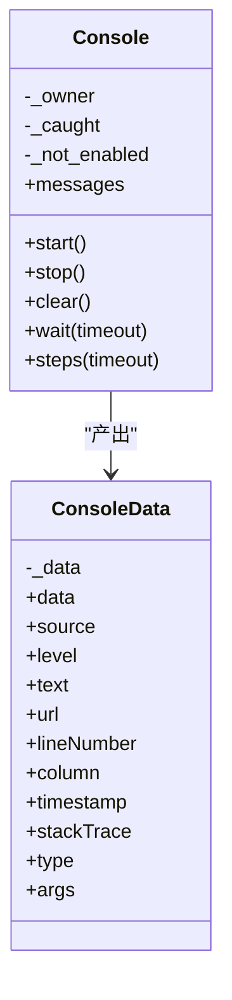
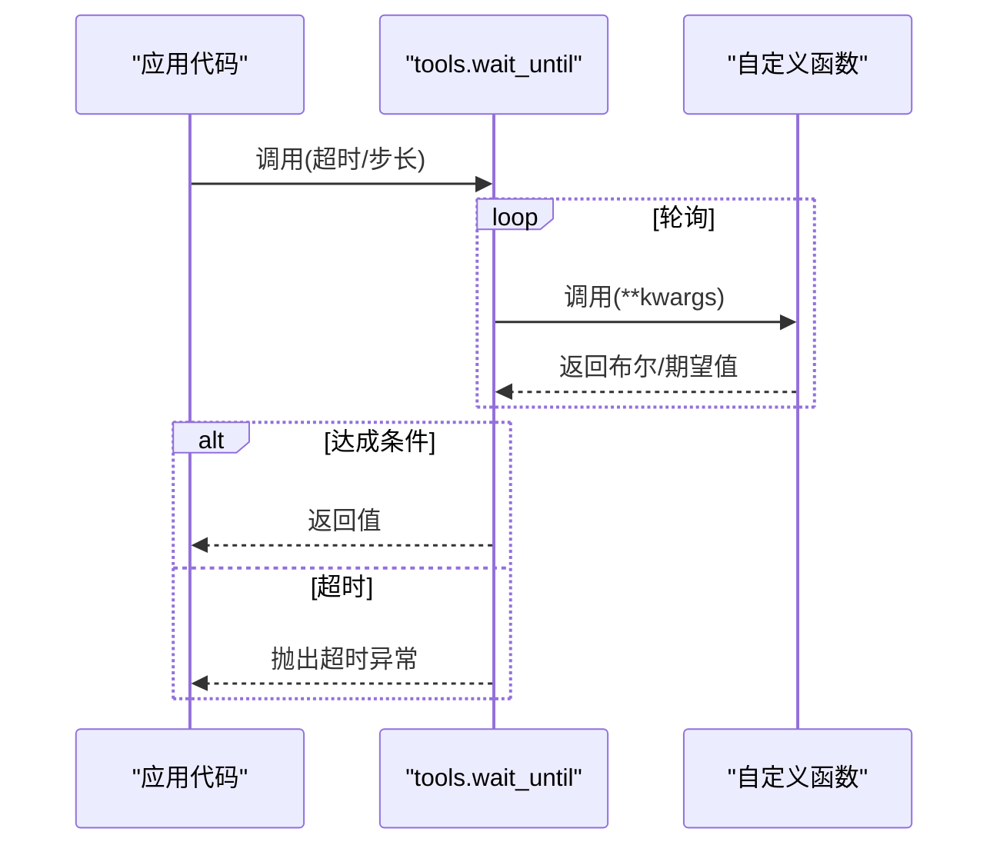
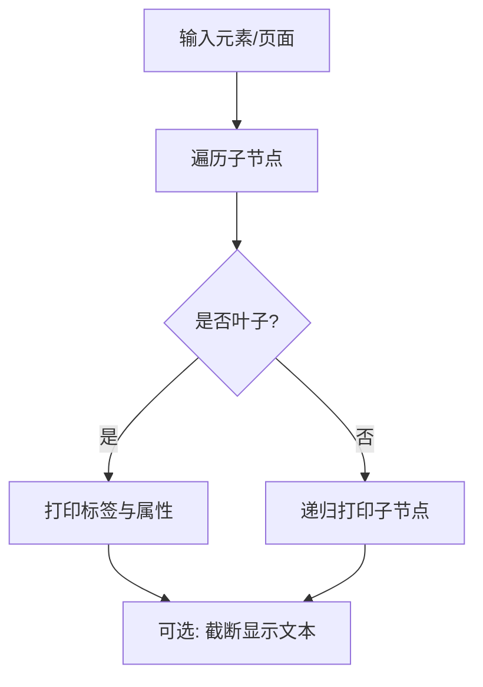
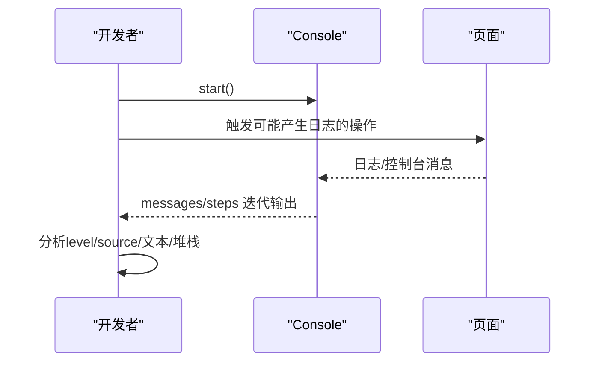
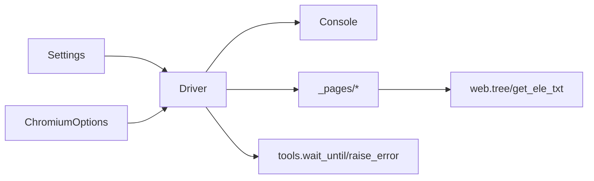

# 调试方法与工具

<cite>
**本文引用的文件**
- [DrissionPage/__init__.py](file://DrissionPage/__init__.py)
- [DrissionPage/common.py](file://DrissionPage/common.py)
- [DrissionPage/_functions/settings.py](file://DrissionPage/_functions/settings.py)
- [DrissionPage/_functions/tools.py](file://DrissionPage/_functions/tools.py)
- [DrissionPage/_functions/texts.py](file://DrissionPage/_functions/texts.py)
- [DrissionPage/_functions/browser.py](file://DrissionPage/_functions/browser.py)
- [DrissionPage/_functions/by.py](file://DrissionPage/_functions/by.py)
- [DrissionPage/_functions/web.py](file://DrissionPage/_functions/web.py)
- [DrissionPage/_base/driver.py](file://DrissionPage/_base/driver.py)
- [DrissionPage/_base/base.py](file://DrissionPage/_base/base.py)
- [DrissionPage/_browsers/chromium.py](file://DrissionPage/_browsers/chromium.py)
- [DrissionPage/_pages/chromium_base.py](file://DrissionPage/_pages/chromium_base.py)
- [DrissionPage/_units/console.py](file://DrissionPage/_units/console.py)
- [DrissionPage/_units/waiter.py](file://DrissionPage/_units/waiter.py)
- [DrissionPage/_configs/chromium_options.py](file://DrissionPage/_configs/chromium_options.py)
- [DrissionPage/errors.py](file://DrissionPage/errors.py)
</cite>

## 目录
1. [简介](#简介)
2. [项目结构](#项目结构)
3. [核心组件](#核心组件)
4. [架构总览](#架构总览)
5. [详细组件分析](#详细组件分析)
6. [依赖分析](#依赖分析)
7. [性能考虑](#性能考虑)
8. [故障排查指南](#故障排查指南)
9. [结论](#结论)
10. [附录](#附录)

## 简介
本指南聚焦 DrissionPage 的系统化调试方法与工具使用，涵盖日志输出、控制台打印、元素信息查看、调试模式启用与配置、浏览器控制台输出分析、内置调试函数与等待机制、以及第三方工具配合使用建议。文档面向不同层次读者，既提供高层概览，也给出代码级图示与具体实践步骤。

## 项目结构
DrissionPage 将调试能力分布在多个层次：
- 配置层：通过 Settings 控制全局调试开关与超时等行为；ChromiumOptions 支持启动参数与端口、用户数据目录等影响调试体验的选项。
- 通信层：Driver/DebugDriver 通过 CDP 发送/接收消息，并可按需打印调试信息。
- 页面/元素层：提供树形结构打印、元素文本提取等辅助诊断能力。
- 控制台监听：Console 类订阅浏览器日志与 console.* 事件，捕获前端输出。
- 工具与等待：tools 提供等待工具、端口检测、错误映射；web 提供树形打印与文本提取；waiter 提供等待机制。

图表来源
- [DrissionPage/_functions/settings.py:13-69](file://DrissionPage/_functions/settings.py#L13-L69)
- [DrissionPage/_configs/chromium_options.py:16-417](file://DrissionPage/_configs/chromium_options.py#L16-L417)
- [DrissionPage/_base/driver.py:24-227](file://DrissionPage/_base/driver.py#L24-L227)
- [DrissionPage/_pages/chromium_base.py:484-501](file://DrissionPage/_pages/chromium_base.py#L484-L501)
- [DrissionPage/_functions/web.py:257-302](file://DrissionPage/_functions/web.py#L257-L302)
- [DrissionPage/_units/console.py:14-99](file://DrissionPage/_units/console.py#L14-L99)
- [DrissionPage/_functions/tools.py:139-148](file://DrissionPage/_functions/tools.py#L139-L148)
- [DrissionPage/_units/waiter.py:412-432](file://DrissionPage/_units/waiter.py#L412-L432)

章节来源
- [DrissionPage/__init__.py:22-29](file://DrissionPage/__init__.py#L22-L29)
- [DrissionPage/common.py:18-19](file://DrissionPage/common.py#L18-L19)

## 核心组件
- 调试开关与超时
  - Settings 提供全局调试开关与超时配置，影响 Driver/DebugDriver 的调试输出策略与等待行为。
- 调试驱动
  - DebugDriver 在 Driver 基础上增加 CDP 消息的打印，支持按方法前缀过滤输出。
- 控制台监听
  - Console 订阅 Log.entryAdded 与 Runtime.consoleAPICalled，捕获浏览器控制台输出，支持队列化读取与迭代。
- 等待与错误映射
  - tools.wait_until 提供统一等待入口；raise_error 将底层错误映射为具体异常类型，便于定位问题。
- 页面/元素诊断
  - web.tree 提供树形结构打印；get_ele_txt 提取元素文本，辅助定位元素与内容问题。

章节来源
- [DrissionPage/_functions/settings.py:13-69](file://DrissionPage/_functions/settings.py#L13-L69)
- [DrissionPage/_base/driver.py:165-227](file://DrissionPage/_base/driver.py#L165-L227)
- [DrissionPage/_units/console.py:14-99](file://DrissionPage/_units/console.py#L14-L99)
- [DrissionPage/_functions/tools.py:139-148](file://DrissionPage/_functions/tools.py#L139-L148)
- [DrissionPage/_functions/tools.py:157-197](file://DrissionPage/_functions/tools.py#L157-L197)
- [DrissionPage/_functions/web.py:257-302](file://DrissionPage/_functions/web.py#L257-L302)

## 架构总览
DrissionPage 的调试链路围绕 CDP 交互展开：应用层通过 Chromium/ChromiumPage/SessionPage 等入口发起操作，底层由 Driver/DebugDriver 与浏览器建立 WebSocket 连接，发送/接收 CDP 消息；Console 订阅浏览器日志与 console 输出；等待与错误映射贯穿整个流程。

图表来源
- [DrissionPage/_base/driver.py:102-118](file://DrissionPage/_base/driver.py#L102-L118)
- [DrissionPage/_base/driver.py:170-194](file://DrissionPage/_base/driver.py#L170-L194)
- [DrissionPage/_units/console.py:30-46](file://DrissionPage/_units/console.py#L30-L46)

## 详细组件分析

### 调试模式启用与配置
- 全局调试开关
  - Settings._debug 支持 None/False/True 或方法前缀过滤。当为 None 时默认不开启；为 True 或指定前缀时，DebugDriver 会打印匹配的 CDP 请求与响应。
- 启动参数与端口
  - ChromiumOptions 提供 set_local_port/set_address/auto_port 等接口，确保能稳定连接到目标浏览器实例，便于后续调试。
- 超时与等待
  - Settings.set_cdp_timeout/set_browser_connect_timeout 控制 CDP 与连接超时；tools.wait_until 提供统一等待入口。

图表来源
- [DrissionPage/_functions/settings.py:23](file://DrissionPage/_functions/settings.py#L23)
- [DrissionPage/_configs/chromium_options.py:305-321](file://DrissionPage/_configs/chromium_options.py#L305-L321)
- [DrissionPage/_base/driver.py:165-194](file://DrissionPage/_base/driver.py#L165-L194)

章节来源
- [DrissionPage/_functions/settings.py:23-24](file://DrissionPage/_functions/settings.py#L23-L24)
- [DrissionPage/_configs/chromium_options.py:305-321](file://DrissionPage/_configs/chromium_options.py#L305-L321)
- [DrissionPage/_base/driver.py:165-194](file://DrissionPage/_base/driver.py#L165-L194)

### 浏览器控制台输出分析
- Console 类
  - start 启用 Log.enable/Runtime.enable 并注册回调；stop 停止监听并禁用相应 CDP；messages/clear/wait/steps 提供队列化读取与迭代。
  - ConsoleData 提供 source/level/text/url/lineNumber/column/timestamp/type/args 等属性，便于按级别与来源筛选。
- 使用建议
  - 在执行可能产生前端日志的操作前后，启动 Console 并消费消息队列，结合步骤迭代器逐步分析。

图表来源
- [DrissionPage/_units/console.py:14-99](file://DrissionPage/_units/console.py#L14-L99)

章节来源
- [DrissionPage/_units/console.py:14-99](file://DrissionPage/_units/console.py#L14-L99)

### 内置调试函数与等待机制
- DebugDriver.run
  - 在 DebugDriver 中，若 _debug 为 True 或匹配方法前缀，则打印发送的消息与返回结果，便于追踪 CDP 调用链。
- tools.wait_until
  - 以固定步长轮询函数返回值，超时抛出异常，适合等待条件达成。
- raise_error
  - 将底层错误映射为具体异常类型（如元素丢失、页面断开、JS 错误等），提升问题定位效率。

图表来源
- [DrissionPage/_functions/tools.py:139-148](file://DrissionPage/_functions/tools.py#L139-L148)

章节来源
- [DrissionPage/_base/driver.py:165-194](file://DrissionPage/_base/driver.py#L165-L194)
- [DrissionPage/_functions/tools.py:139-148](file://DrissionPage/_functions/tools.py#L139-L148)
- [DrissionPage/_functions/tools.py:157-197](file://DrissionPage/_functions/tools.py#L157-L197)

### 元素信息查看与树形打印
- web.tree
  - 递归打印元素树，支持截断文本、显示 script/style 文本等，便于快速定位 DOM 结构与文本内容。
- get_ele_txt
  - 提取元素文本，处理换行、缩进、表格单元格等特殊场景，辅助比对页面渲染结果。

图表来源
- [DrissionPage/_functions/web.py:257-302](file://DrissionPage/_functions/web.py#L257-L302)

章节来源
- [DrissionPage/_functions/web.py:257-302](file://DrissionPage/_functions/web.py#L257-L302)

### 断点、变量检查与执行跟踪
- 断点与执行跟踪
  - 利用 DebugDriver 的调试输出，结合 Console 的实时消息，可在关键 CDP 调用前后观察状态变化。
- 变量检查
  - 在 Console 中按 level/source 过滤错误与警告；在 web.tree 中核对 DOM 结构；在 get_ele_txt 中核对文本内容。

图表来源
- [DrissionPage/_units/console.py:30-81](file://DrissionPage/_units/console.py#L30-L81)

章节来源
- [DrissionPage/_units/console.py:30-81](file://DrissionPage/_units/console.py#L30-L81)

### 第三方调试工具配合
- 浏览器 DevTools
  - 通过 ChromiumOptions 指定 --remote-debugging-port 或使用现有浏览器实例，结合 Console 与 DebugDriver 输出，形成“本地浏览器 + 代码侧调试”的双视角。
- 系统工具
  - tools.get_browser_progress_id/show_or_hide_browser 等可用于定位与控制浏览器窗口，辅助观察页面状态。

章节来源
- [DrissionPage/_functions/browser.py:24-87](file://DrissionPage/_functions/browser.py#L24-L87)
- [DrissionPage/_functions/tools.py:79-99](file://DrissionPage/_functions/tools.py#L79-L99)

## 依赖分析
- 组件耦合
  - Driver/DebugDriver 与 Settings/ChromiumOptions 强耦合，前者受后者控制调试输出与超时。
  - Console 依赖浏览器 CDP 能力，与页面对象存在弱耦合（通过 owner 注册回调）。
  - web.tree 与 get_ele_txt 依赖页面/元素模型，提供诊断信息。
- 外部依赖
  - requests/websocket 等网络库；win32gui/win32process（Windows 下窗口控制）。

图表来源
- [DrissionPage/_functions/settings.py:13-69](file://DrissionPage/_functions/settings.py#L13-L69)
- [DrissionPage/_configs/chromium_options.py:16-417](file://DrissionPage/_configs/chromium_options.py#L16-L417)
- [DrissionPage/_base/driver.py:24-227](file://DrissionPage/_base/driver.py#L24-L227)
- [DrissionPage/_units/console.py:14-99](file://DrissionPage/_units/console.py#L14-L99)
- [DrissionPage/_functions/web.py:257-302](file://DrissionPage/_functions/web.py#L257-L302)
- [DrissionPage/_functions/tools.py:139-148](file://DrissionPage/_functions/tools.py#L139-L148)

## 性能考虑
- 调试输出成本
  - DebugDriver 的打印会带来额外 I/O 与 CPU 开销，建议仅在问题定位阶段开启，或使用方法前缀精确过滤。
- 等待策略
  - 合理设置超时与步长，避免过短导致频繁轮询，过长导致阻塞时间过久。
- 控制台监听
  - Console 的队列容量与迭代频率需平衡内存占用与实时性。

## 故障排查指南
- 连接失败
  - 检查端口占用与地址配置；使用 tools.port_is_using/test_connect 验证连通性；必要时切换 auto_port 或 existing_only。
- 元素/页面状态异常
  - 使用 web.tree 与 get_ele_txt 快速核对 DOM 与文本；结合 Console 的错误日志定位前端脚本报错。
- 超时与异常映射
  - raise_error 将底层错误映射为具体异常类型，便于分类处理；根据异常信息与提示进行针对性修复。
- 等待问题
  - 使用 tools.wait_until 包裹条件判断；结合 waiter 的等待机制，避免忙等与死循环。

章节来源
- [DrissionPage/_functions/browser.py:192-210](file://DrissionPage/_functions/browser.py#L192-L210)
- [DrissionPage/_functions/tools.py:157-197](file://DrissionPage/_functions/tools.py#L157-L197)
- [DrissionPage/_functions/tools.py:139-148](file://DrissionPage/_functions/tools.py#L139-L148)
- [DrissionPage/_units/waiter.py:412-432](file://DrissionPage/_units/waiter.py#L412-L432)

## 结论
DrissionPage 的调试体系以 Settings/ChromiumOptions 为入口，Driver/DebugDriver 为核心，Console 与 web/tree 等工具提供前端与结构化诊断能力。通过合理启用调试、规范等待与错误处理、配合浏览器 DevTools 与系统工具，可高效定位与解决问题。

## 附录
- 常用调试场景步骤
  - 场景一：页面加载异常
    - 步骤：启用 Console；执行导航；观察 Console.messages；结合 web.tree 核对 DOM；必要时开启 DebugDriver 打印关键 CDP。
  - 场景二：元素点击失败
    - 步骤：使用 get_ele_txt 核对文本；使用 web.tree 定位元素；检查 Console 中的 JS 错误；使用 tools.wait_until 确认元素可用。
  - 场景三：连接浏览器失败
    - 步骤：验证端口与地址；使用 tools.test_connect/port_is_using；必要时切换 auto_port/existing_only；参考错误映射定位原因。

章节来源
- [DrissionPage/_units/console.py:30-81](file://DrissionPage/_units/console.py#L30-L81)
- [DrissionPage/_functions/web.py:257-302](file://DrissionPage/_functions/web.py#L257-L302)
- [DrissionPage/_functions/browser.py:192-210](file://DrissionPage/_functions/browser.py#L192-L210)
- [DrissionPage/_functions/tools.py:139-148](file://DrissionPage/_functions/tools.py#L139-L148)