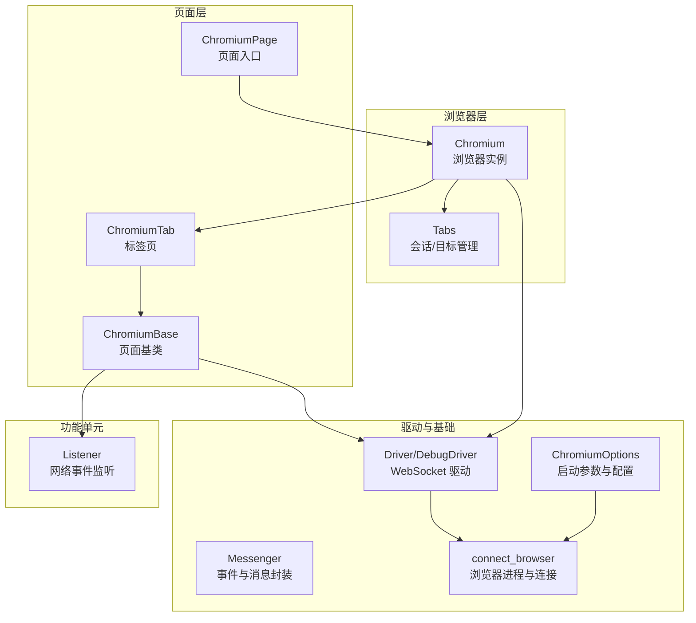
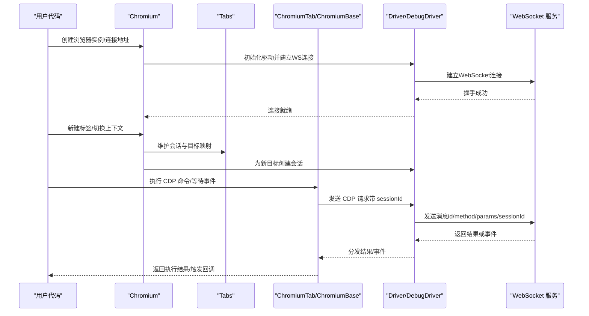
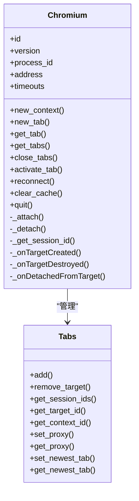
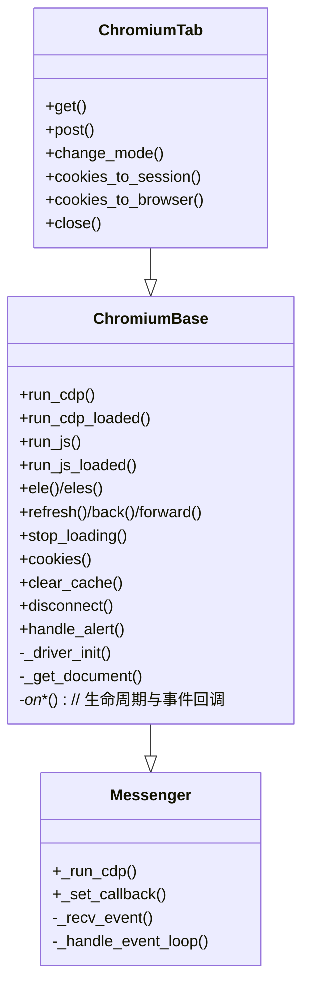
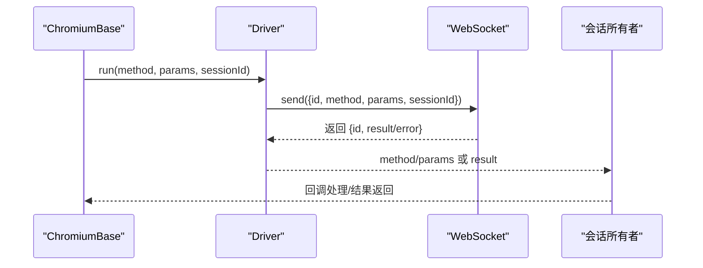
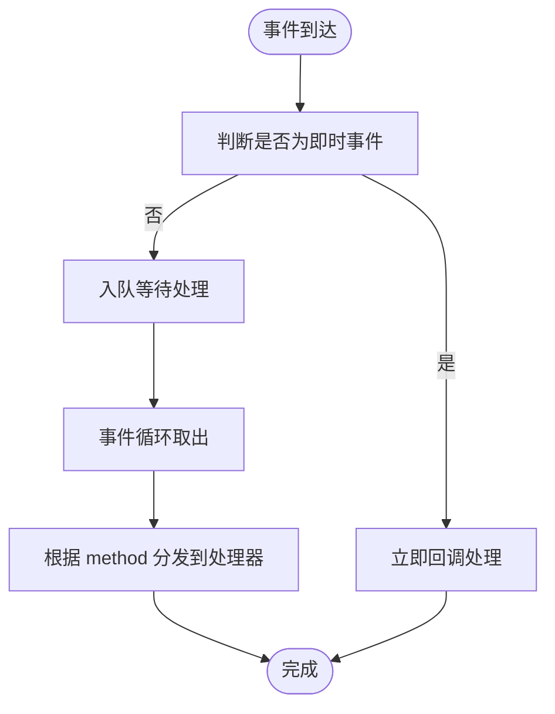
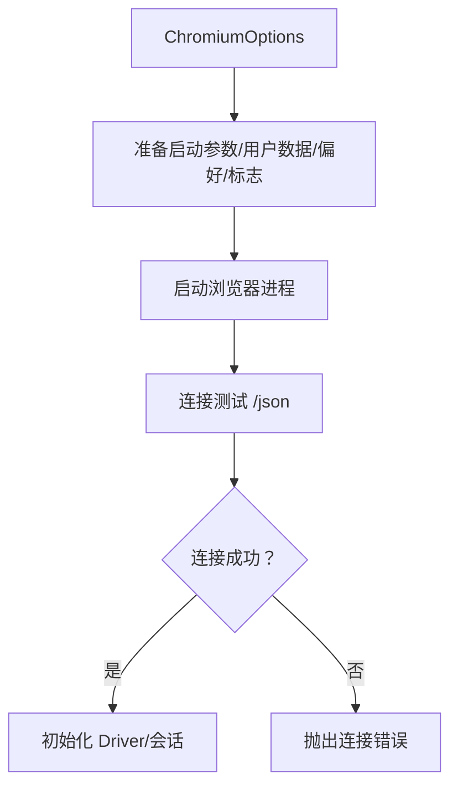
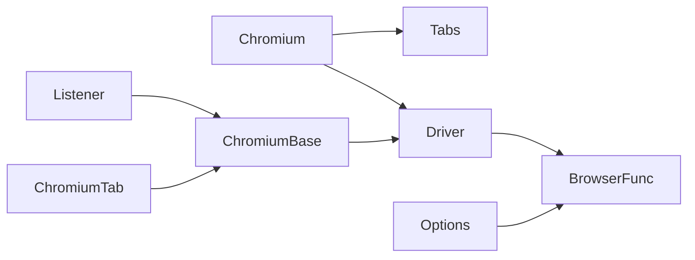

# CDP 协议详解

<cite>
**本文引用的文件**
- [chromium.py](file://DrissionPage/_browsers/chromium.py)
- [chromium_page.py](file://DrissionPage/_pages/chromium_page.py)
- [chromium_base.py](file://DrissionPage/_pages/chromium_base.py)
- [chromium_tab.py](file://DrissionPage/_pages/chromium_tab.py)
- [base.py](file://DrissionPage/_base/base.py)
- [driver.py](file://DrissionPage/_base/driver.py)
- [chromium_options.py](file://DrissionPage/_configs/chromium_options.py)
- [browser.py](file://DrissionPage/_functions/browser.py)
- [listener.py](file://DrissionPage/_units/listener.py)
- [errors.py](file://DrissionPage/errors.py)
- [__init__.py](file://DrissionPage/__init__.py)
</cite>

## 目录
1. [引言](#引言)
2. [项目结构](#项目结构)
3. [核心组件](#核心组件)
4. [架构总览](#架构总览)
5. [详细组件分析](#详细组件分析)
6. [依赖关系分析](#依赖关系分析)
7. [性能考量](#性能考量)
8. [故障排查指南](#故障排查指南)
9. [结论](#结论)
10. [附录](#附录)

## 引言
本篇文档围绕 Chrome DevTools Protocol（CDP）在 DrissionPage 中的应用展开，系统阐述其原理、实现方式与封装策略。CDP 是 Chromium 内核浏览器的官方调试协议，通过 WebSocket 提供对浏览器内核的直接控制能力，支持页面导航、网络拦截、元素操作、事件监听等丰富能力。DrissionPage 在此基础上构建了更高层的 Python 接口，屏蔽底层协议细节，提供更易用、稳定的自动化体验。

与传统 WebDriver 相比，CDP 具备如下优势：
- 更高的性能：直接调用浏览器内核 API，减少中间层开销
- 更强的稳定性：事件驱动与会话管理更精细，断线重连与异常恢复能力更强
- 更丰富的功能：可直接访问 DOM、网络、存储、权限等底层能力，便于高级场景

## 项目结构
DrissionPage 将 CDP 能力按“浏览器实例—标签页—页面对象”的层次组织，配合会话管理、事件队列与驱动层，形成完整的控制链路。

图示来源
- [chromium.py](file://DrissionPage/_browsers/chromium.py)
- [chromium_tab.py](file://DrissionPage/_pages/chromium_tab.py)
- [chromium_base.py](file://DrissionPage/_pages/chromium_base.py)
- [driver.py](file://DrissionPage/_base/driver.py)
- [base.py](file://DrissionPage/_base/base.py)
- [chromium_options.py](file://DrissionPage/_configs/chromium_options.py)
- [browser.py](file://DrissionPage/_functions/browser.py)
- [listener.py](file://DrissionPage/_units/listener.py)

章节来源
- [chromium.py](file://DrissionPage/_browsers/chromium.py)
- [chromium_page.py](file://DrissionPage/_pages/chromium_page.py)
- [chromium_tab.py](file://DrissionPage/_pages/chromium_tab.py)
- [chromium_base.py](file://DrissionPage/_pages/chromium_base.py)
- [driver.py](file://DrissionPage/_base/driver.py)
- [base.py](file://DrissionPage/_base/base.py)
- [chromium_options.py](file://DrissionPage/_configs/chromium_options.py)
- [browser.py](file://DrissionPage/_functions/browser.py)
- [listener.py](file://DrissionPage/_units/listener.py)

## 核心组件
- Chromium：浏览器实例，负责启动/连接浏览器、管理上下文与标签、维护会话映射、处理事件回调。
- ChromiumTab/ChromiumBase：页面对象，封装 CDP 方法调用、事件处理、等待与状态管理；支持 DOM 搜索、JS 执行、网络拦截等。
- Driver/DebugDriver：WebSocket 驱动，负责消息发送、结果等待、事件分发、断线处理。
- Messenger：事件循环与消息封装，统一 CDP 调用入口，支持即时事件与队列事件处理。
- ChromiumOptions + connect_browser：配置浏览器启动参数、用户数据目录、代理、端口等，并负责进程创建与连接测试。
- Listener：基于 Network 事件的网络监听器，捕获请求/响应、额外信息与失败原因，提供统一的数据包接口。

章节来源
- [chromium.py](file://DrissionPage/_browsers/chromium.py)
- [chromium_base.py](file://DrissionPage/_pages/chromium_base.py)
- [driver.py](file://DrissionPage/_base/driver.py)
- [base.py](file://DrissionPage/_base/base.py)
- [chromium_options.py](file://DrissionPage/_configs/chromium_options.py)
- [browser.py](file://DrissionPage/_functions/browser.py)
- [listener.py](file://DrissionPage/_units/listener.py)

## 架构总览
下图展示 DrissionPage 如何通过 CDP 实现对 Chromium 的直接控制，以及各模块之间的交互关系。

图示来源
- [chromium.py](file://DrissionPage/_browsers/chromium.py)
- [chromium_tab.py](file://DrissionPage/_pages/chromium_tab.py)
- [chromium_base.py](file://DrissionPage/_pages/chromium_base.py)
- [driver.py](file://DrissionPage/_base/driver.py)

## 详细组件分析

### Chromium 类：浏览器实例与会话管理
- 负责启动或连接浏览器，解析版本、进程 ID、下载行为等。
- 维护 Tabs 管理器，记录会话、目标、上下文、代理等信息。
- 提供上下文创建、标签页管理、事件回调注册（Target.*）、断线重连等能力。
- 通过 Driver 与 WebSocket 交互，支持 DebugDriver 的调试输出。

图示来源
- [chromium.py](file://DrissionPage/_browsers/chromium.py)

章节来源
- [chromium.py](file://DrissionPage/_browsers/chromium.py)

### ChromiumTab 与 ChromiumBase：页面对象与 CDP 调用
- ChromiumTab：在 ChromiumBase 与 SessionPage 之间切换“开发模式（d）”与“会话模式（s）”，支持跨模式的 Cookie 同步与导航。
- ChromiumBase：封装 CDP 方法调用（DOM/Page/Network/Fetch 等），处理页面生命周期事件（加载、导航、框架变化等），提供等待器、动作、截图、存储清理等能力。
- Messenger：统一 _run_cdp 调用，处理事件入队与即时事件，支持调试模式下的消息打印。

图示来源
- [chromium_tab.py](file://DrissionPage/_pages/chromium_tab.py)
- [chromium_base.py](file://DrissionPage/_pages/chromium_base.py)
- [base.py](file://DrissionPage/_base/base.py)

章节来源
- [chromium_tab.py](file://DrissionPage/_pages/chromium_tab.py)
- [chromium_base.py](file://DrissionPage/_pages/chromium_base.py)
- [base.py](file://DrissionPage/_base/base.py)

### Driver/DebugDriver：WebSocket 驱动与消息编排
- Driver：建立 WebSocket 连接，发送 CDP 请求，等待响应，分发事件至对应会话所有者；支持超时、断线、弹窗标志等特殊处理。
- DebugDriver：在 Driver 基础上增加调试输出，可按方法前缀过滤打印。
- 通过 _session_owner 将事件分发给对应页面对象，实现多标签并发控制。

图示来源
- [driver.py](file://DrissionPage/_base/driver.py)

章节来源
- [driver.py](file://DrissionPage/_base/driver.py)

### 事件处理与网络监听
- ChromiumBase 注册 Page.* 与 DOM/Frame 等事件，驱动页面状态机（加载、交互、完成）。
- Listener 基于 Network.* 事件，捕获请求/响应、额外信息与失败原因，聚合为数据包，便于上层分析与调试。

图示来源
- [base.py](file://DrissionPage/_base/base.py)
- [chromium_base.py](file://DrissionPage/_pages/chromium_base.py)
- [listener.py](file://DrissionPage/_units/listener.py)

章节来源
- [base.py](file://DrissionPage/_base/base.py)
- [chromium_base.py](file://DrissionPage/_pages/chromium_base.py)
- [listener.py](file://DrissionPage/_units/listener.py)

### 配置与启动流程
- ChromiumOptions：集中管理启动参数、用户数据目录、代理、超时、负载模式等。
- connect_browser：根据配置选择端口、准备用户数据目录、设置偏好与实验标志、启动浏览器进程并验证连接。

图示来源
- [chromium_options.py](file://DrissionPage/_configs/chromium_options.py)
- [browser.py](file://DrissionPage/_functions/browser.py)

章节来源
- [chromium_options.py](file://DrissionPage/_configs/chromium_options.py)
- [browser.py](file://DrissionPage/_functions/browser.py)

## 依赖关系分析
- 组件耦合：Chromium 与 Tabs 强耦合，负责会话与目标的生命周期；ChromiumBase 依赖 Driver 完成 CDP 调用；Listener 依赖 ChromiumBase 的事件注册。
- 外部依赖：WebSocket（websocket-client）、HTTP（requests）、JSON 解析、系统进程（subprocess）。
- 循环依赖：未发现直接循环；事件分发通过 _session_owner 松耦合。

图示来源
- [chromium.py](file://DrissionPage/_browsers/chromium.py)
- [chromium_base.py](file://DrissionPage/_pages/chromium_base.py)
- [chromium_tab.py](file://DrissionPage/_pages/chromium_tab.py)
- [driver.py](file://DrissionPage/_base/driver.py)
- [browser.py](file://DrissionPage/_functions/browser.py)
- [chromium_options.py](file://DrissionPage/_configs/chromium_options.py)
- [listener.py](file://DrissionPage/_units/listener.py)

章节来源
- [chromium.py](file://DrissionPage/_browsers/chromium.py)
- [chromium_base.py](file://DrissionPage/_pages/chromium_base.py)
- [chromium_tab.py](file://DrissionPage/_pages/chromium_tab.py)
- [driver.py](file://DrissionPage/_base/driver.py)
- [browser.py](file://DrissionPage/_functions/browser.py)
- [chromium_options.py](file://DrissionPage/_configs/chromium_options.py)
- [listener.py](file://DrissionPage/_units/listener.py)

## 性能考量
- 事件驱动与会话隔离：通过 Tabs 与 Driver 的会话映射，避免全局锁竞争，提升并发性能。
- 延迟加载与按需启用：如 Accessibility.enable、Fetch.enable 等仅在需要时开启，降低开销。
- 超时与重试：统一的超时策略与重试间隔，平衡稳定性与性能。
- 断线恢复：断线时自动重连并重建会话，减少任务中断时间。

## 故障排查指南
- 连接问题
  - 现象：无法连接浏览器或连接被拒绝
  - 排查：确认端口占用、地址格式、浏览器是否以调试端口启动；检查 connect_browser 的连接测试逻辑
- 超时问题
  - 现象：CDP 请求长时间无响应
  - 排查：调整超时设置、检查网络与代理、查看 DebugDriver 输出定位具体方法
- 弹窗阻塞
  - 现象：输入/运行时方法被阻塞
  - 排查：Driver 内部通过 alert_flag 标记弹窗会话，等待弹窗关闭后再继续
- 断线与重连
  - 现象：页面断开或浏览器退出
  - 排查：Chromium.reconnect 触发重连；确认 Tabs 与 Driver 的会话映射是否正确重建
- 错误分类
  - 使用统一的错误类型（CDPError、PageDisconnectedError、JavaScriptError 等）便于定位与处理

章节来源
- [driver.py](file://DrissionPage/_base/driver.py)
- [chromium.py](file://DrissionPage/_browsers/chromium.py)
- [errors.py](file://DrissionPage/errors.py)

## 结论
DrissionPage 通过 Driver/DebugDriver、Messenger、Chromium/ChromiumTab/ChromiumBase 与 Listener 等组件，完整实现了对 CDP 的封装与扩展。它在保持与 Chromium 内核直接通信的同时，提供了更高层的抽象与健壮性，适用于高性能、高稳定性的自动化需求。相比 WebDriver，CDP 在事件驱动、会话管理、网络拦截与底层能力访问方面具备显著优势。

## 附录

### CDP 协议通信机制与消息格式
- 传输层：WebSocket
- 请求格式：包含 id、method、params、sessionId（可选）
- 响应格式：包含 id 与 result 或 error
- 事件格式：包含 method 与 params，由 Driver 分发给对应会话所有者

章节来源
- [driver.py](file://DrissionPage/_base/driver.py)

### 常见 CDP 能力与使用场景
- 页面控制：Page.enable、Page.navigate、Page.reload、Page.stopLoading
- DOM 操作：DOM.enable、DOM.getDocument、DOM.performSearch、DOM.removeNode
- 网络控制：Network.enable、Fetch.enable、Network.getResponseBody、Network.clearBrowserCache/Cookies
- 存储与权限：Storage.getCookies、Storage.clearDataForOrigin、Emulation.setFocusEmulationEnabled
- 事件监听：Page.*、DOM.*、Network.*、Target.*

章节来源
- [chromium_base.py](file://DrissionPage/_pages/chromium_base.py)
- [chromium.py](file://DrissionPage/_browsers/chromium.py)
- [listener.py](file://DrissionPage/_units/listener.py)

### 对比 WebDriver 的优势总结
- 更细粒度的控制：直接调用浏览器内核 API，减少中间层
- 更强的事件驱动：事件驱动模型更适合异步与并发场景
- 更好的网络与存储能力：可直接访问网络拦截、存储清理等底层能力
- 更稳定的断线恢复：会话与事件分离，断线后可快速重建

章节来源
- [chromium.py](file://DrissionPage/_browsers/chromium.py)
- [chromium_base.py](file://DrissionPage/_pages/chromium_base.py)
- [driver.py](file://DrissionPage/_base/driver.py)