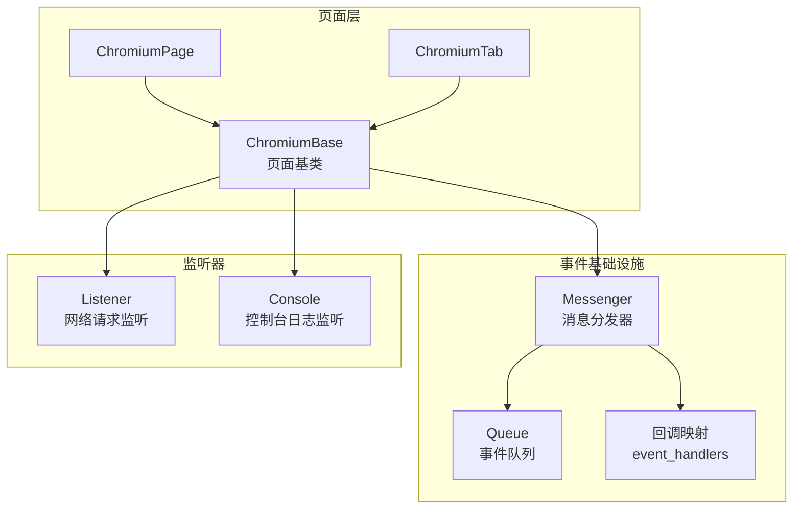
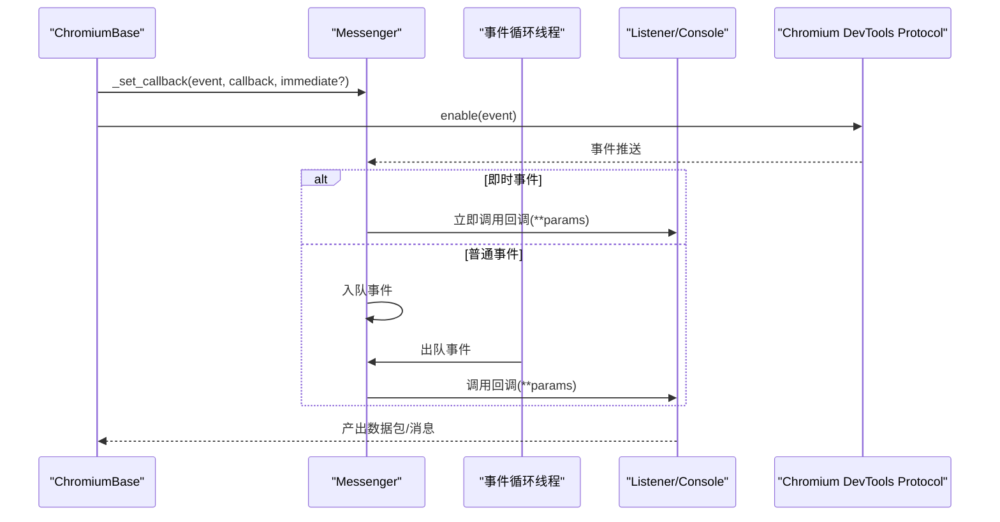
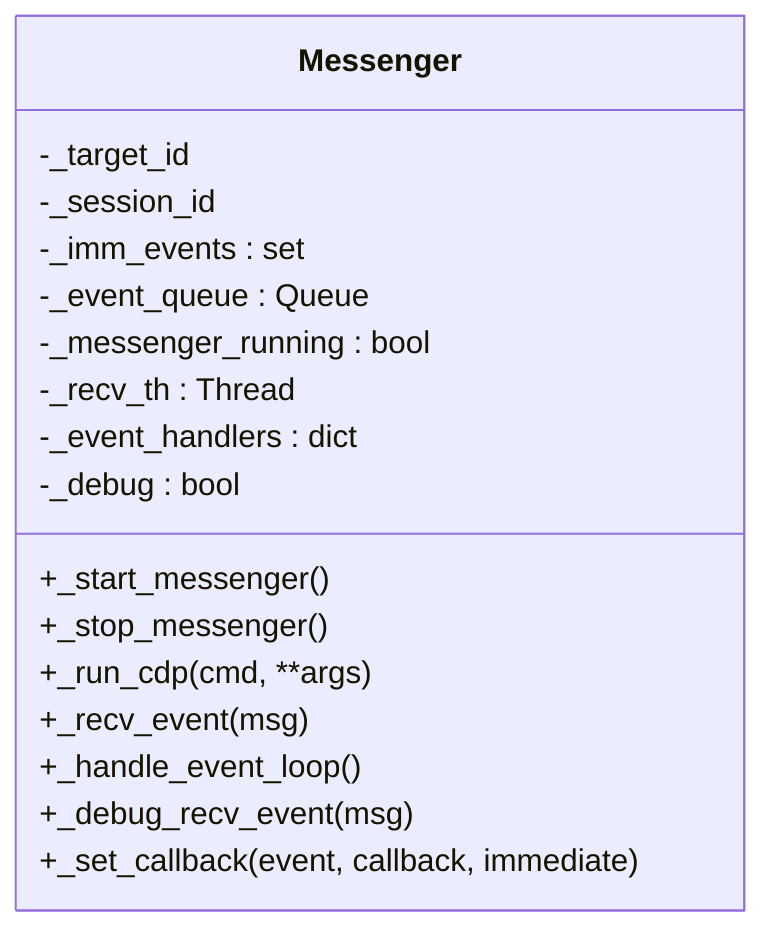
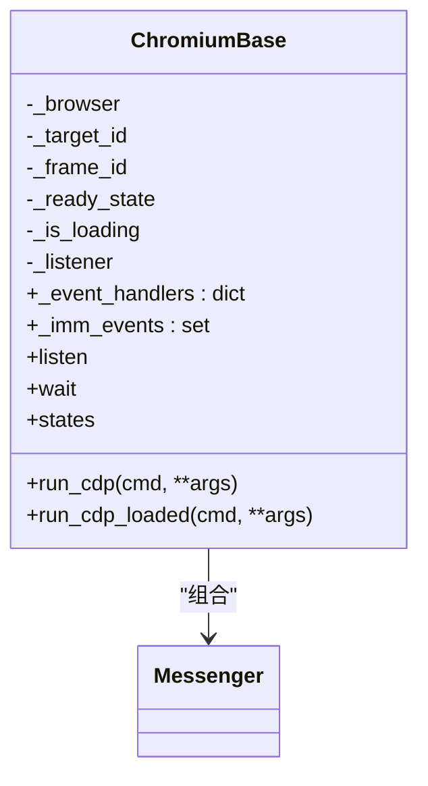
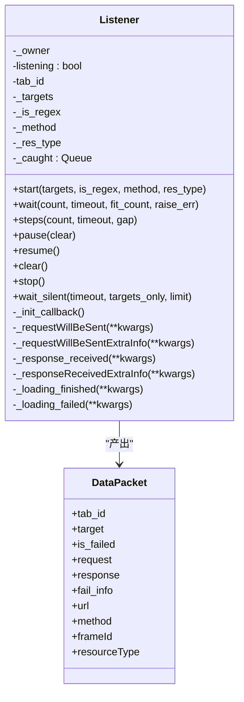
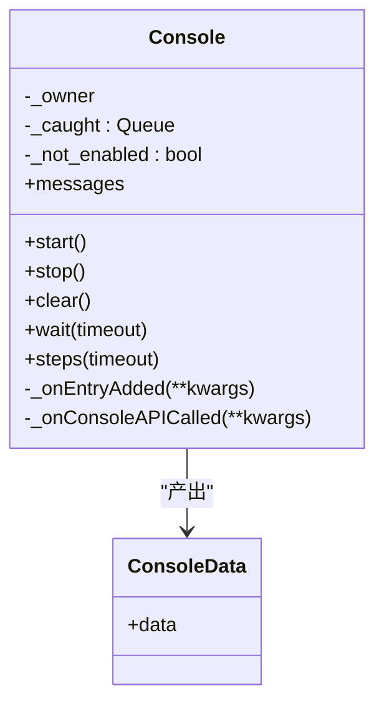
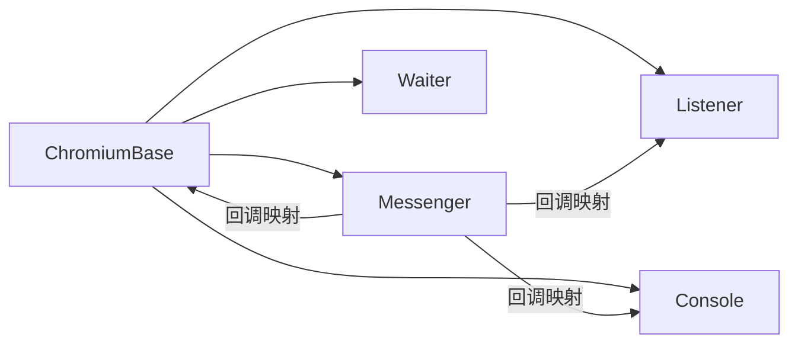

# 事件驱动架构

<cite>
**本文档引用的文件**
- [listener.py](file://DrissionPage/_units/listener.py)
- [base.py](file://DrissionPage/_base/base.py)
- [chromium_base.py](file://DrissionPage/_pages/chromium_base.py)
- [chromium_page.py](file://DrissionPage/_pages/chromium_page.py)
- [chromium_tab.py](file://DrissionPage/_pages/chromium_tab.py)
- [console.py](file://DrissionPage/_units/console.py)
- [waiter.py](file://DrissionPage/_units/waiter.py)
</cite>

## 目录
1. [简介](#简介)
2. [项目结构](#项目结构)
3. [核心组件](#核心组件)
4. [架构总览](#架构总览)
5. [详细组件分析](#详细组件分析)
6. [依赖分析](#依赖分析)
7. [性能考虑](#性能考虑)
8. [故障排查指南](#故障排查指南)
9. [结论](#结论)

## 简介
本文件系统性阐述 DrissionPage 的事件驱动架构设计与实现机制，重点覆盖：
- 事件系统的组成与职责边界
- 事件类型分类与处理流程
- 消息传递机制、事件队列管理与异步事件处理
- 事件监听、回调注册与解绑的实际使用路径
- 在浏览器自动化场景中的优势（实时响应、高效处理）
- 事件调试技巧、性能优化建议与常见问题的解决方案

## 项目结构
DrissionPage 将事件驱动能力以“消息分发器 + 具体监听器”的方式组织：
- 消息分发器：统一负责接收 CDP 事件、入队、派发回调
- 具体监听器：按业务场景订阅特定事件，封装数据包与过滤逻辑
- 页面基类：集成消息分发器，暴露统一的事件注册/解绑接口
- 控制台监听器：演示日志事件的订阅与消费

图表来源
- [base.py:373-433](file://DrissionPage/_base/base.py#L373-L433)
- [chromium_base.py:39-96](file://DrissionPage/_pages/chromium_base.py#L39-L96)
- [chromium_page.py:17-103](file://DrissionPage/_pages/chromium_page.py#L17-L103)
- [chromium_tab.py:22-47](file://DrissionPage/_pages/chromium_tab.py#L22-L47)
- [listener.py:20-321](file://DrissionPage/_units/listener.py#L20-L321)
- [console.py:14-87](file://DrissionPage/_units/console.py#L14-L87)

章节来源
- [base.py:373-433](file://DrissionPage/_base/base.py#L373-L433)
- [chromium_base.py:39-96](file://DrissionPage/_pages/chromium_base.py#L39-L96)

## 核心组件
- 消息分发器（Messenger）：负责启动/停止事件循环、接收 CDP 事件、入队、派发回调；支持即时事件与普通事件两类处理路径
- 页面基类（ChromiumBase）：继承页面解析与 CDP 能力，内置事件处理器映射与即时事件集合，并通过属性暴露监听器实例
- 监听器（Listener/Console）：具体订阅某类事件，封装过滤条件、数据包构建与结果产出
- 等待器（Waiter）：提供基于事件的等待语义，如文档加载完成、元素状态变化等

章节来源
- [base.py:373-433](file://DrissionPage/_base/base.py#L373-L433)
- [chromium_base.py:265-275](file://DrissionPage/_pages/chromium_base.py#L265-L275)
- [listener.py:20-321](file://DrissionPage/_units/listener.py#L20-L321)
- [console.py:14-87](file://DrissionPage/_units/console.py#L14-L87)
- [waiter.py:85-234](file://DrissionPage/_units/waiter.py#L85-L234)

## 架构总览
事件驱动的整体流程如下：
- 页面初始化时启动消息分发器线程，建立 CDP 会话
- 通过 _set_callback 注册事件回调，区分即时事件与普通事件
- CDP 事件到达后，Messenger 决策是否立即调用或入队
- 事件循环从队列取出事件，按 method 查找回调并调用
- 监听器根据过滤规则生成数据包，放入监听器自有队列供上层消费

图表来源
- [base.py:398-433](file://DrissionPage/_base/base.py#L398-L433)
- [chromium_base.py:71-82](file://DrissionPage/_pages/chromium_base.py#L71-L82)
- [listener.py:200-206](file://DrissionPage/_units/listener.py#L200-L206)
- [console.py:30-38](file://DrissionPage/_units/console.py#L30-L38)

## 详细组件分析

### 组件一：消息分发器（Messenger）
- 职责
  - 启动/停止事件循环线程
  - 接收 CDP 事件，区分即时事件与普通事件
  - 维护事件回调映射与即时事件集合
  - 提供 _run_cdp 与 _set_callback 统一入口
- 关键点
  - 即时事件：直接调用回调，不入队
  - 普通事件：入队后由事件循环线程逐条派发
  - 事件循环线程守护态，避免阻塞主线程

图表来源
- [base.py:373-433](file://DrissionPage/_base/base.py#L373-L433)

章节来源
- [base.py:373-433](file://DrissionPage/_base/base.py#L373-L433)

### 组件二：页面基类（ChromiumBase）
- 职责
  - 继承页面解析与 CDP 能力
  - 内置常用事件处理器映射（如页面导航、帧事件、弹窗等）
  - 通过属性暴露监听器实例（listen）、等待器（wait）、状态机（states）等
- 关键点
  - 初始化时启动消息分发器并连接浏览器
  - 将页面生命周期事件映射为内部回调，便于上层等待器与业务逻辑使用

图表来源
- [chromium_base.py:39-96](file://DrissionPage/_pages/chromium_base.py#L39-L96)
- [base.py:373-433](file://DrissionPage/_base/base.py#L373-L433)

章节来源
- [chromium_base.py:39-96](file://DrissionPage/_pages/chromium_base.py#L39-L96)

### 组件三：网络请求监听器（Listener）
- 职责
  - 订阅 Network.* 事件，过滤目标请求
  - 构建数据包（DataPacket），封装请求/响应/失败信息
  - 提供等待、步进、暂停/恢复、清空等操作
- 关键点
  - 支持按 URL、方法、资源类型过滤
  - 支持正则匹配与多目标集合
  - 使用独立队列存放已捕获的数据包，供上层消费

图表来源
- [listener.py:20-321](file://DrissionPage/_units/listener.py#L20-L321)

章节来源
- [listener.py:20-321](file://DrissionPage/_units/listener.py#L20-L321)

### 组件四：控制台监听器（Console）
- 职责
  - 订阅 Log.entryAdded 与 Runtime.consoleAPICalled 事件
  - 将日志消息封装为 ConsoleData，供上层消费
- 关键点
  - 启停时启用/禁用对应 CDP 命令
  - 提供等待与步进接口，便于实时查看日志

图表来源
- [console.py:14-99](file://DrissionPage/_units/console.py#L14-L99)

章节来源
- [console.py:14-99](file://DrissionPage/_units/console.py#L14-L99)

### 组件五：等待器（Waiter）
- 职责
  - 基于事件与状态提供等待语义
  - 如文档加载完成、元素状态变化、下载开始/结束、弹窗关闭等
- 关键点
  - 与页面基类的 ready_state、is_loading 等状态联动
  - 通过 CDP 查询当前状态，避免轮询阻塞

章节来源
- [waiter.py:85-234](file://DrissionPage/_units/waiter.py#L85-L234)

## 依赖分析
- 组件耦合
  - ChromiumBase 组合 Messenger，统一事件入口
  - Listener/Console 依赖 ChromiumBase 的 _set_callback 与 _run_cdp
  - Waiter 依赖 ChromiumBase 的状态与 CDP 查询
- 事件类型分类
  - 即时事件：如 Page.javascriptDialogOpening（立即处理）
  - 普通事件：如 Page.frameStartedLoading/Page.loadEventFired 等（入队后处理）
  - 网络事件：Network.*（由 Listener 订阅）
  - 日志事件：Log.*、Runtime.*（由 Console 订阅）

图表来源
- [chromium_base.py:71-82](file://DrissionPage/_pages/chromium_base.py#L71-L82)
- [base.py:426-433](file://DrissionPage/_base/base.py#L426-L433)
- [listener.py:200-206](file://DrissionPage/_units/listener.py#L200-L206)
- [console.py:30-38](file://DrissionPage/_units/console.py#L30-L38)

章节来源
- [chromium_base.py:71-82](file://DrissionPage/_pages/chromium_base.py#L71-L82)
- [base.py:426-433](file://DrissionPage/_base/base.py#L426-L433)

## 性能考虑
- 事件队列与线程模型
  - 事件循环线程守护态，避免阻塞主线程
  - 普通事件入队后批量派发，降低回调开销
- 过滤策略
  - Listener 支持按 URL、方法、资源类型与正则过滤，减少无效数据包生成
  - wait_silent 提供静默等待，避免频繁轮询
- 数据包构建
  - DataPacket 延迟解析请求/响应头与正文，按需访问，减少内存占用
- 即时事件
  - 对于高频率事件（如弹窗），使用即时事件避免排队延迟

[本节为通用指导，无需列出具体文件来源]

## 故障排查指南
- 现象：未开始监听却调用等待
  - 原因：未调用 start 或未正确设置监听目标
  - 处理：先调用 start，再进行 wait/steps
- 现象：等待超时
  - 原因：目标事件未触发或过滤条件过严
  - 处理：放宽过滤条件（如 res_type=True），检查目标 URL/方法
- 现象：回调未生效
  - 原因：未正确注册回调或回调被解绑
  - 处理：确认 _set_callback(event, callback) 已调用，必要时重新注册
- 现象：内存增长
  - 原因：监听器队列未及时消费
  - 处理：定期调用 steps 或 wait 获取并释放队列项
- 现象：日志未输出
  - 原因：未启用 Log/Runtime 或未 start
  - 处理：调用 Console.start() 并确保 CDP 已 enable

章节来源
- [listener.py:88-116](file://DrissionPage/_units/listener.py#L88-L116)
- [console.py:51-65](file://DrissionPage/_units/console.py#L51-L65)
- [base.py:426-433](file://DrissionPage/_base/base.py#L426-L433)

## 结论
DrissionPage 的事件驱动架构通过“消息分发器 + 具体监听器”的模式，实现了对 CDP 事件的统一接入与灵活扩展。其优势体现在：
- 实时响应：即时事件与事件队列双通道，兼顾低延迟与稳定性
- 高效处理：按需过滤、延迟解析、守护线程，降低资源消耗
- 易用性：统一的回调注册/解绑接口与丰富的等待器语义，便于业务集成

在浏览器自动化场景中，该架构能够有效支撑复杂交互流程的事件感知与处理，提升整体自动化效率与可靠性。