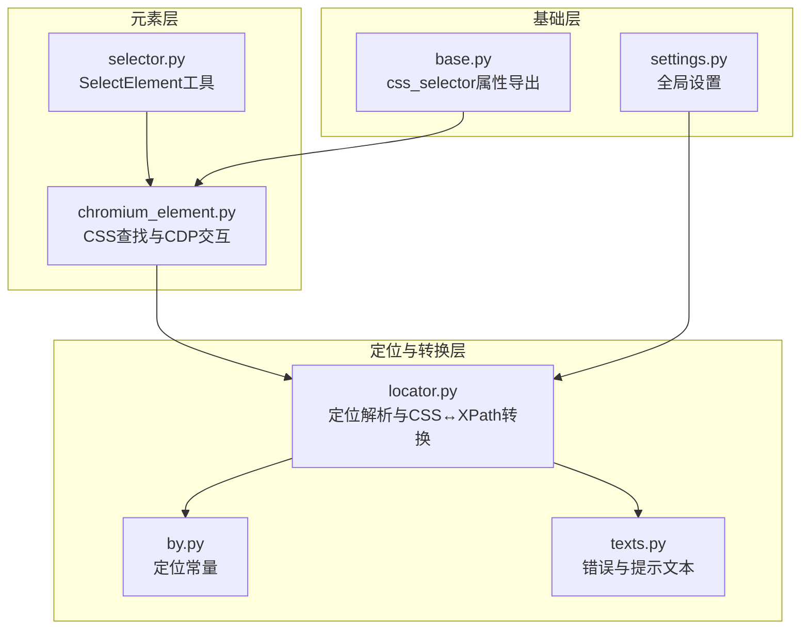
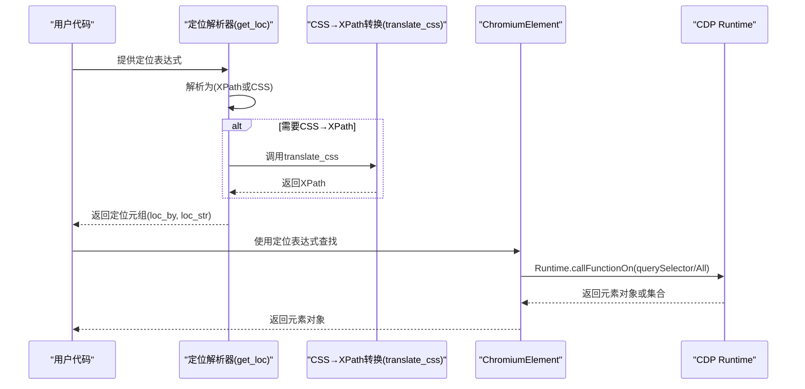
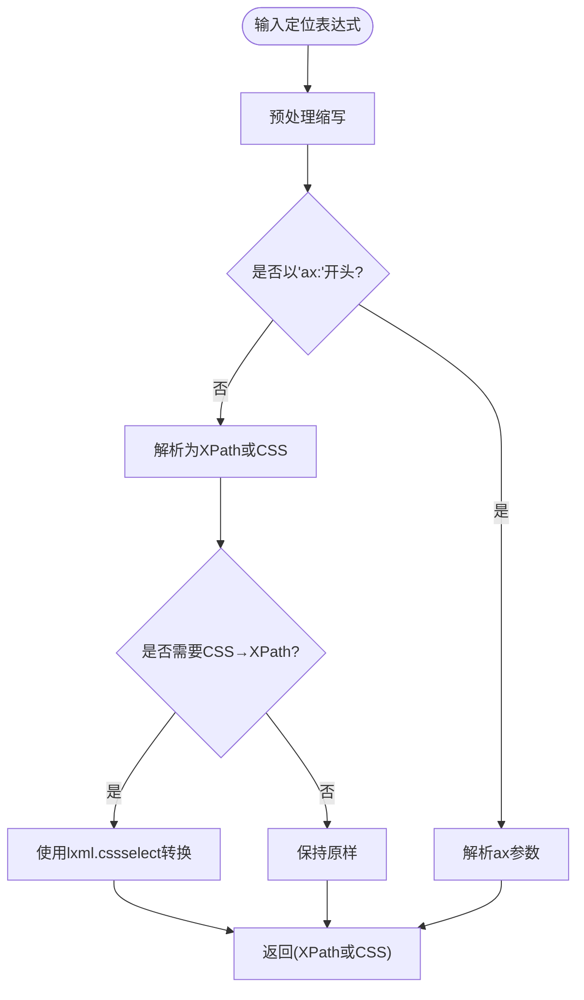
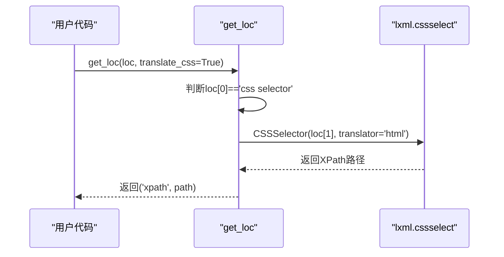
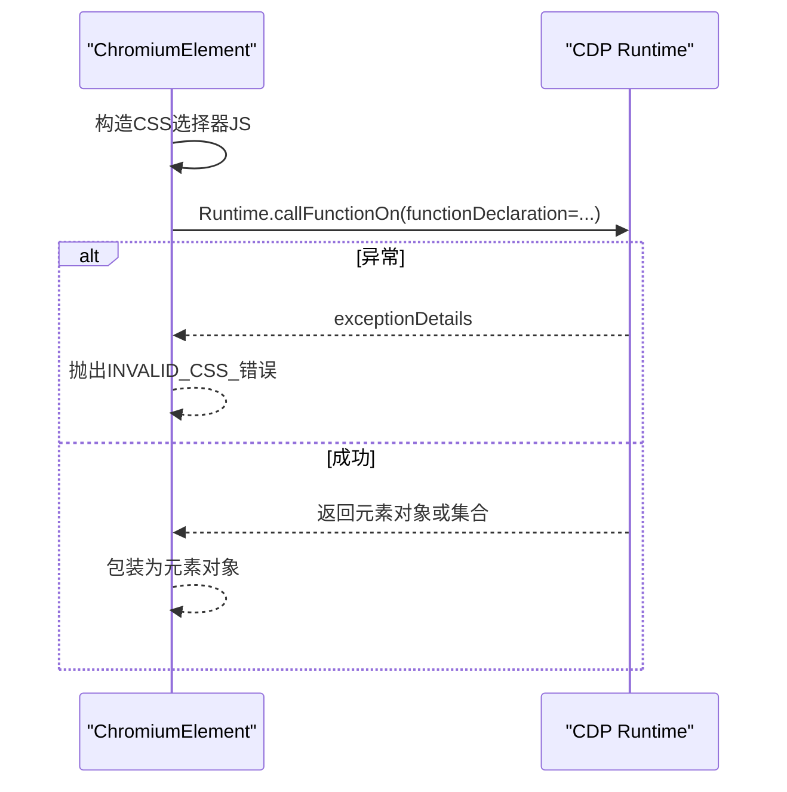
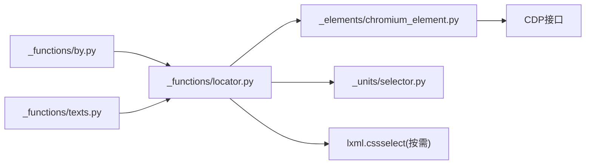

# CSS 选择器策略

<cite>
**本文引用的文件**
- [by.py](file://DrissionPage/_functions/by.py)
- [locator.py](file://DrissionPage/_functions/locator.py)
- [selector.py](file://DrissionPage/_units/selector.py)
- [chromium_element.py](file://DrissionPage/_elements/chromium_element.py)
- [base.py](file://DrissionPage/_base/base.py)
- [settings.py](file://DrissionPage/_functions/settings.py)
- [texts.py](file://DrissionPage/_functions/texts.py)
</cite>

## 目录
1. [简介](#简介)
2. [项目结构](#项目结构)
3. [核心组件](#核心组件)
4. [架构总览](#架构总览)
5. [详细组件分析](#详细组件分析)
6. [依赖关系分析](#依赖关系分析)
7. [性能考量](#性能考量)
8. [故障排查指南](#故障排查指南)
9. [结论](#结论)
10. [附录](#附录)

## 简介
本文件系统性阐述 DrissionPage 中 CSS 选择器定位策略的设计与实现，涵盖：
- CSS 选择器语法规范与缩写映射
- 标签选择器、ID 选择器、类选择器、属性选择器等基础用法
- 复合选择器与伪类选择器的生成与限制
- CSS 与 XPath 的相互转换机制
- 在不同场景下的性能表现对比
- 特殊字符与转义处理
- 实战应用示例与最佳实践

## 项目结构
围绕 CSS 定位策略的关键模块分布如下：
- 定位与转换：_functions/locator.py
- 常量定义：_functions/by.py
- 元素内部 CSS 查找：_elements/chromium_element.py
- 选择器工具（SelectElement）：_units/selector.py
- 文本与错误消息：_functions/texts.py
- 基础能力（路径导出）：_base/base.py
- 设置项：_functions/settings.py

图表来源
- [locator.py:1-579](file://DrissionPage/_functions/locator.py#L1-L579)
- [by.py:10-19](file://DrissionPage/_functions/by.py#L10-L19)
- [chromium_element.py:1070-1111](file://DrissionPage/_elements/chromium_element.py#L1070-L1111)
- [selector.py:13-161](file://DrissionPage/_units/selector.py#L13-L161)
- [base.py:125-136](file://DrissionPage/_base/base.py#L125-L136)
- [settings.py:13-69](file://DrissionPage/_functions/settings.py#L13-L69)
- [texts.py:35-150](file://DrissionPage/_functions/texts.py#L35-L150)

章节来源
- [locator.py:1-579](file://DrissionPage/_functions/locator.py#L1-L579)
- [by.py:10-19](file://DrissionPage/_functions/by.py#L10-L19)
- [chromium_element.py:1070-1111](file://DrissionPage/_elements/chromium_element.py#L1070-L1111)
- [selector.py:13-161](file://DrissionPage/_units/selector.py#L13-L161)
- [base.py:125-136](file://DrissionPage/_base/base.py#L125-L136)
- [settings.py:13-69](file://DrissionPage/_functions/settings.py#L13-L69)
- [texts.py:35-150](file://DrissionPage/_functions/texts.py#L35-L150)

## 核心组件
- 定位常量：提供标准定位类型，其中包含 CSS_SELECTOR。
- 定位解析器：负责将字符串定位表达式解析为 XPath 或 CSS 选择器，并支持 CSS 到 XPath 的转换。
- 元素内部 CSS 查找：通过 CDP Runtime.callFunctionOn 执行 DOM.querySelector/All，实现原生 CSS 查找。
- SelectElement：针对 select 元素的选项选择工具，内部也使用定位解析与 CSS 转换逻辑。
- 错误与提示：统一的错误消息与国际化文本。

章节来源
- [by.py:10-19](file://DrissionPage/_functions/by.py#L10-L19)
- [locator.py:96-116](file://DrissionPage/_functions/locator.py#L96-L116)
- [chromium_element.py:1070-1111](file://DrissionPage/_elements/chromium_element.py#L1070-L1111)
- [selector.py:13-161](file://DrissionPage/_units/selector.py#L13-L161)
- [texts.py:35-150](file://DrissionPage/_functions/texts.py#L35-L150)

## 架构总览
CSS 选择器在 DrissionPage 中的处理流程如下：
- 输入定位表达式（字符串或 Selenium 元组）
- 解析为内部表示（XPath 或 CSS）
- 若需要，将 CSS 转换为 XPath（用于某些相对定位 API）
- 在元素上下文中通过 CDP 执行 CSS 查找
- 返回元素对象或集合

图表来源
- [locator.py:96-116](file://DrissionPage/_functions/locator.py#L96-L116)
- [locator.py:506-543](file://DrissionPage/_functions/locator.py#L506-L543)
- [chromium_element.py:1070-1111](file://DrissionPage/_elements/chromium_element.py#L1070-L1111)

## 详细组件分析

### 定位解析与 CSS→XPath 转换
- 字符串定位解析：支持多种前缀与缩写，自动展开为标准形式；最终输出为 XPath 或 CSS。
- 多属性/单属性解析：分别生成 CSS 或 XPath 表达式。
- CSS→XPath 转换：当 translate_css=True 时，使用 lxml.cssselect 将 CSS 转换为 XPath。
- 缩写映射：.class、#id、tag:text、text:、css:、xpath: 等。

图表来源
- [locator.py:15-51](file://DrissionPage/_functions/locator.py#L15-L51)
- [locator.py:96-116](file://DrissionPage/_functions/locator.py#L96-L116)
- [locator.py:147-195](file://DrissionPage/_functions/locator.py#L147-L195)
- [locator.py:198-235](file://DrissionPage/_functions/locator.py#L198-L235)
- [locator.py:506-543](file://DrissionPage/_functions/locator.py#L506-L543)

章节来源
- [locator.py:15-51](file://DrissionPage/_functions/locator.py#L15-L51)
- [locator.py:96-116](file://DrissionPage/_functions/locator.py#L96-L116)
- [locator.py:147-195](file://DrissionPage/_functions/locator.py#L147-L195)
- [locator.py:198-235](file://DrissionPage/_functions/locator.py#L198-L235)
- [locator.py:506-543](file://DrissionPage/_functions/locator.py#L506-L543)

### CSS 选择器语法与缩写
- 标签选择器：直接使用标签名或通过 tag: 前缀。
- ID 选择器：#id 或 #=、#:、#$、#^ 形式。
- 类选择器：.class 或 .=、.:、.$、.^ 形式。
- 属性选择器：支持 =、:（包含）、^（开头）、$（结尾）。
- 文本匹配：text=、text:、text^、text$，或直接作为模糊文本。
- 组合与多条件：@@（AND）、@|（OR）、@!（排除）。
- CSS 缩写：c:、x:、t:、tx: 等。

章节来源
- [locator.py:54-83](file://DrissionPage/_functions/locator.py#L54-L83)
- [locator.py:147-195](file://DrissionPage/_functions/locator.py#L147-L195)
- [locator.py:198-235](file://DrissionPage/_functions/locator.py#L198-L235)
- [locator.py:552-578](file://DrissionPage/_functions/locator.py#L552-L578)

### CSS 与 XPath 的转换机制
- CSS→XPath：当 translate_css=True 时，使用 lxml.cssselect 的 translator='html'，提取 path 并去除冗余前缀。
- XPath→CSS：提供 translate_css_loc，将常见定位类型转换为 CSS 选择器（如 ID 转 #、CLASS 转 .）。
- 限制：部分 CSS 语法在相对定位 API 中不被支持，会抛出“不支持的 CSS 语法”错误。

图表来源
- [locator.py:96-116](file://DrissionPage/_functions/locator.py#L96-L116)
- [locator.py:506-543](file://DrissionPage/_functions/locator.py#L506-L543)

章节来源
- [locator.py:96-116](file://DrissionPage/_functions/locator.py#L96-L116)
- [locator.py:506-543](file://DrissionPage/_functions/locator.py#L506-L543)

### 元素内部 CSS 查找与 CDP 交互
- 使用 Runtime.callFunctionOn 执行 querySelector 或 querySelectorAll。
- 对 iframe、frame、shadow-root 进行特殊处理，确保在正确的文档上下文中查找。
- 异常处理：捕获无效选择器、查找异常等错误并抛出统一异常。

图表来源
- [chromium_element.py:1070-1111](file://DrissionPage/_elements/chromium_element.py#L1070-L1111)

章节来源
- [chromium_element.py:1070-1111](file://DrissionPage/_elements/chromium_element.py#L1070-L1111)

### SelectElement 工具与 CSS 转换
- SelectElement 内部使用定位解析与 CSS 转换逻辑，支持按文本、value、index 选择选项。
- 多选场景下，支持批量选择与反选、清空等操作。

章节来源
- [selector.py:13-161](file://DrissionPage/_units/selector.py#L13-L161)

### 相对定位 API 中的 CSS 限制
- 当使用相对定位（parent/child/prev/next 等）时，若定位表达式为 CSS，将抛出“不支持的 CSS 语法”错误，需改为 XPath。
- 这一限制源于相对轴（following-sibling、preceding-sibling 等）在 CSS 中无法直接表达。

章节来源
- [base.py:150-171](file://DrissionPage/_base/base.py#L150-L171)
- [base.py:194-235](file://DrissionPage/_base/base.py#L194-L235)
- [texts.py:99-100](file://DrissionPage/_functions/texts.py#L99-L100)

## 依赖关系分析
- 定位解析器依赖定位常量与错误文本。
- 元素层依赖定位解析器与 CDP 接口。
- CSS→XPath 转换依赖 lxml.cssselect（在 get_loc 中按需导入）。
- 错误文本统一由 texts.py 提供，支持中英文。

图表来源
- [by.py:10-19](file://DrissionPage/_functions/by.py#L10-L19)
- [locator.py:96-116](file://DrissionPage/_functions/locator.py#L96-L116)
- [chromium_element.py:1070-1111](file://DrissionPage/_elements/chromium_element.py#L1070-L1111)
- [selector.py:13-161](file://DrissionPage/_units/selector.py#L13-L161)
- [texts.py:35-150](file://DrissionPage/_functions/texts.py#L35-L150)

章节来源
- [by.py:10-19](file://DrissionPage/_functions/by.py#L10-L19)
- [locator.py:96-116](file://DrissionPage/_functions/locator.py#L96-L116)
- [chromium_element.py:1070-1111](file://DrissionPage/_elements/chromium_element.py#L1070-L1111)
- [selector.py:13-161](file://DrissionPage/_units/selector.py#L13-L161)
- [texts.py:35-150](file://DrissionPage/_functions/texts.py#L35-L150)

## 性能考量
- CSS 选择器在现代浏览器中通常比 XPath 更快，尤其在简单场景（标签、类、ID）。
- 复杂 XPath（如 starts-with、substring、contains）在长文本节点上可能较慢。
- DrissionPage 在相对定位 API 中强制使用 XPath，避免 CSS 无法表达的轴关系导致的性能与兼容性问题。
- CSS→XPath 转换仅在必要时触发（translate_css=True），避免不必要的转换开销。

[本节为通用性能讨论，无需特定文件来源]

## 故障排查指南
- 无效 CSS 选择器：当 querySelector 抛出“无效选择器”异常时，会抛出 INVALID_CSS_ 错误。
- 不支持的 CSS 语法：在相对定位 API 中使用 CSS 会抛出“不支持的 CSS 语法”错误。
- XPath 无效：当 XPath 表达式无效时，会抛出 INVALID_XPATH_ 错误。
- 定位格式错误：定位表达式格式不正确时，抛出 LOCATORERROR 或 INVALID_LOC。

章节来源
- [chromium_element.py:1084-1087](file://DrissionPage/_elements/chromium_element.py#L1084-L1087)
- [base.py:150-171](file://DrissionPage/_base/base.py#L150-L171)
- [texts.py:99-100](file://DrissionPage/_functions/texts.py#L99-L100)
- [texts.py:105-106](file://DrissionPage/_functions/texts.py#L105-L106)
- [texts.py:140-141](file://DrissionPage/_functions/texts.py#L140-L141)

## 结论
DrissionPage 的 CSS 选择器策略以“易用+可控”为核心：
- 提供丰富的定位表达式与缩写，降低学习成本
- 在必要时将 CSS 转换为 XPath，保证跨 API 的一致性
- 在相对定位等受限场景中明确限制 CSS 语法，避免歧义
- 通过 CDP 直接执行 CSS 查找，兼顾性能与稳定性
- 统一的错误消息与国际化支持，提升调试体验

[本节为总结性内容，无需特定文件来源]

## 附录

### 常见语法与示例（基于解析规则）
- 标签选择器：div、span、p
- ID 选择器：#id、#id、#id、#id、#id
- 类选择器：.class、.class、.class、.class、.class
- 属性选择器：[attr]、[attr=value]、[attr^=val]、[attr$=val]、[attr*=val]
- 文本匹配：text=、text:、text^、text$
- 组合与多条件：@@（AND）、@|（OR）、@!（排除）
- CSS 缩写：c:、x:、t:、tx:

章节来源
- [locator.py:147-195](file://DrissionPage/_functions/locator.py#L147-L195)
- [locator.py:198-235](file://DrissionPage/_functions/locator.py#L198-L235)
- [locator.py:552-578](file://DrissionPage/_functions/locator.py#L552-L578)

### 特殊字符与转义
- CSS 转义：css_trans 对特殊字符进行转义，确保生成合法 CSS 选择器。
- XPath 文本转义：_quotes_escape 使用 concat 方案处理双引号，避免 XPath 字符串拼接问题。

章节来源
- [locator.py:546-550](file://DrissionPage/_functions/locator.py#L546-L550)
- [locator.py:377-394](file://DrissionPage/_functions/locator.py#L377-L394)

### 实战应用建议
- 简单定位优先使用 CSS（ID、类、标签），性能更优
- 复杂轴关系（兄弟、祖先、后续等）使用 XPath
- 需要跨 API 一致性时，启用 translate_css，让 CSS 自动转换为 XPath
- 文本匹配尽量使用精确匹配（=）或前缀/后缀匹配（^/$），避免昂贵的 contains
- 处理 iframe/shadow-root 时，确保在正确文档上下文中查找

[本节为实践建议，无需特定文件来源]