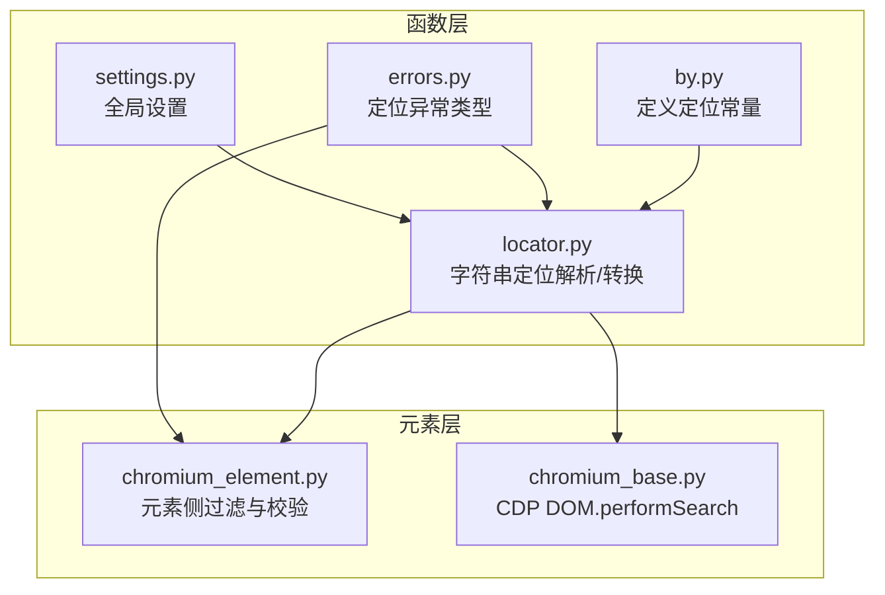
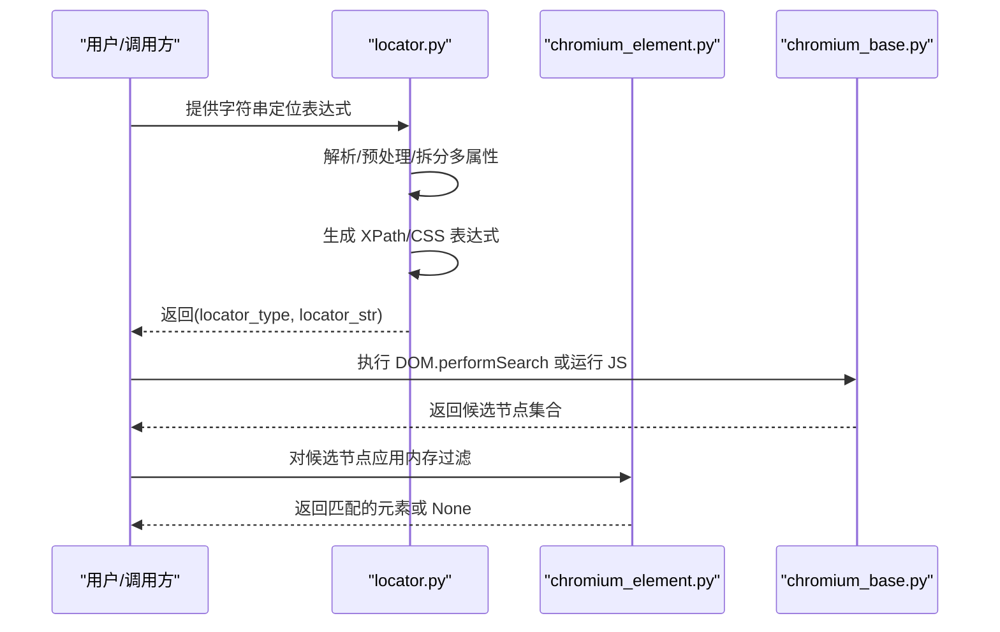
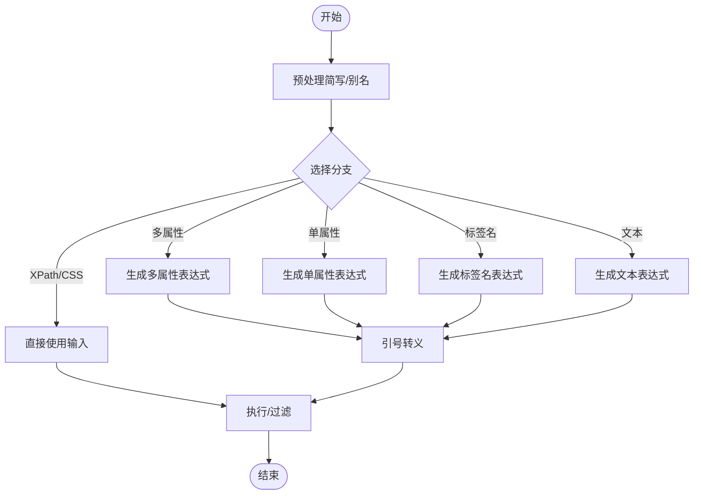
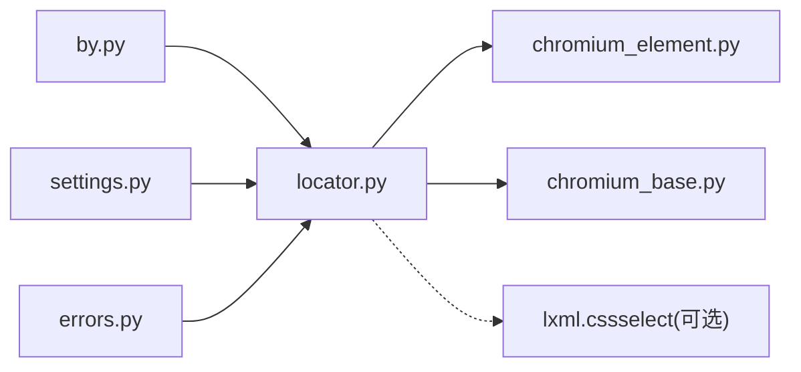

# XPath 定位策略

<cite>
**本文引用的文件列表**
- [by.py](file://DrissionPage/_functions/by.py)
- [locator.py](file://DrissionPage/_functions/locator.py)
- [chromium_element.py](file://DrissionPage/_elements/chromium_element.py)
- [chromium_base.py](file://DrissionPage/_pages/chromium_base.py)
- [errors.py](file://DrissionPage/errors.py)
- [settings.py](file://DrissionPage/_functions/settings.py)
</cite>

## 目录
1. [简介](#简介)
2. [项目结构与定位相关模块](#项目结构与定位相关模块)
3. [核心组件与职责](#核心组件与职责)
4. [架构总览](#架构总览)
5. [详细组件分析](#详细组件分析)
6. [依赖关系分析](#依赖关系分析)
7. [性能考量与优化建议](#性能考量与优化建议)
8. [故障排查指南](#故障排查指南)
9. [结论](#结论)

## 简介
本文件系统性阐述 DrissionPage 中 XPath 定位策略的实现原理与使用方法，覆盖以下要点：
- XPath 表达式构建规则：精确匹配、模糊匹配、前缀匹配、后缀匹配等
- 多属性组合定位的逻辑运算符（@@ 与 @|）及否定（@!）的使用与优先级
- 基于标签名、ID、类名、文本内容等常见场景的定位示例路径
- XPath 转换流程与性能优化技巧
- 与其他定位策略（CSS、Selenium 风格）的对比

## 项目结构与定位相关模块
与 XPath 定位直接相关的模块主要集中在函数层与元素层：
- 函数层负责字符串定位表达式的解析与转换，输出标准的 XPath 或 CSS 选择器
- 元素层负责在页面上下文中执行 XPath 并筛选结果

图表来源
- [by.py:10-19](file://DrissionPage/_functions/by.py#L10-L19)
- [locator.py:147-195](file://DrissionPage/_functions/locator.py#L147-L195)
- [chromium_element.py:1009-1033](file://DrissionPage/_elements/chromium_element.py#L1009-L1033)
- [chromium_base.py:496-512](file://DrissionPage/_pages/chromium_base.py#L496-L512)

章节来源
- [by.py:10-19](file://DrissionPage/_functions/by.py#L10-L19)
- [locator.py:147-195](file://DrissionPage/_functions/locator.py#L147-L195)
- [chromium_element.py:1009-1033](file://DrissionPage/_elements/chromium_element.py#L1009-L1033)
- [chromium_base.py:496-512](file://DrissionPage/_pages/chromium_base.py#L496-L512)

## 核心组件与职责
- 定位常量定义：提供统一的定位类型标识（如 XPATH）
- 字符串定位解析：将简写或复合表达式转换为标准 XPath/CSS
- XPath 构建：按匹配方式生成精确/模糊/前缀/后缀表达式
- 多属性组合：支持 AND/OR 与否定（@!）组合
- 执行与过滤：在页面上下文执行 XPath，并在内存中进一步过滤
- 异常与配置：定位失败、无效 XPath 等错误类型与超时等配置

章节来源
- [by.py:10-19](file://DrissionPage/_functions/by.py#L10-L19)
- [locator.py:147-195](file://DrissionPage/_functions/locator.py#L147-L195)
- [chromium_element.py:1009-1033](file://DrissionPage/_elements/chromium_element.py#L1009-L1033)
- [errors.py:89-90](file://DrissionPage/errors.py#L89-L90)
- [settings.py:13-23](file://DrissionPage/_functions/settings.py#L13-L23)

## 架构总览
下图展示从字符串定位到最终元素匹配的关键流程。

图表来源
- [locator.py:147-195](file://DrissionPage/_functions/locator.py#L147-L195)
- [chromium_element.py:1009-1033](file://DrissionPage/_elements/chromium_element.py#L1009-L1033)
- [chromium_base.py:496-512](file://DrissionPage/_pages/chromium_base.py#L496-L512)

## 详细组件分析

### 1) 字符串定位解析与转换
- 支持的前缀与简写：如 .（类名）、#（ID）、t:/tag:（标签名）、tx:/text:（文本）、x:/xpath:（XPath）、c:/css:（CSS）
- 多属性组合：
  - @@：AND 组合
  - @|：OR 组合
  - @!：否定（排除）某条件
  - 同时出现 @@ 与 @| 将触发冲突错误
- 文本匹配：
  - text=：精确匹配
  - text:：模糊包含
  - text^：前缀匹配
  - text$：后缀匹配
- 标签名匹配：
  - tag:、tag=、tag^、tag$：分别对应标签名的精确/模糊/前缀/后缀匹配
- 输出：
  - 返回标准的 XPath 或 CSS 选择器，以及其类型

章节来源
- [locator.py:15-51](file://DrissionPage/_functions/locator.py#L15-L51)
- [locator.py:54-71](file://DrissionPage/_functions/locator.py#L54-L71)
- [locator.py:74-82](file://DrissionPage/_functions/locator.py#L74-L82)
- [locator.py:85-87](file://DrissionPage/_functions/locator.py#L85-L87)
- [locator.py:96-115](file://DrissionPage/_functions/locator.py#L96-L115)
- [locator.py:118-144](file://DrissionPage/_functions/locator.py#L118-L144)
- [locator.py:147-195](file://DrissionPage/_functions/locator.py#L147-L195)
- [locator.py:238-298](file://DrissionPage/_functions/locator.py#L238-L298)
- [locator.py:301-374](file://DrissionPage/_functions/locator.py#L301-L374)
- [locator.py:552-578](file://DrissionPage/_functions/locator.py#L552-L578)

### 2) XPath 表达式构建规则
- 单属性匹配（@attr=、@attr:、@attr^、@attr$）
  - 精确匹配：直接比较属性值
  - 模糊匹配：contains
  - 前缀匹配：starts-with
  - 后缀匹配：substring 结合 string-length
- 文本匹配（@text()/@tx()）
  - 文本匹配可直接作用于文本节点，必要时通过 /text()[...]/.. 回溯到父元素
- 标签名匹配（@tag()/@t()）
  - 可用于限定标签名，支持否定（@!@tag()=...）
- 多属性组合
  - AND（@@）：所有条件同时满足
  - OR（@|）：任一条件满足
  - 否定（@!）：对当前条件取反
- 特殊情况
  - 仅属性名无值：检查属性是否存在（如 @class）
  - 不查询任何属性：not(@*)

章节来源
- [locator.py:238-298](file://DrissionPage/_functions/locator.py#L238-L298)
- [locator.py:301-374](file://DrissionPage/_functions/locator.py#L301-L374)
- [locator.py:377-394](file://DrissionPage/_functions/locator.py#L377-L394)

### 3) 多属性组合逻辑运算符与优先级
- 运算符优先级
  - @! 优先级最高，先处理否定
  - @@（AND）优先于 @|（OR），即“先 AND 再 OR”
- 组合规则
  - 当同时出现 @@ 与 @| 时抛出冲突错误
  - 标签名条件与属性条件分别处理，标签名默认使用 OR 连接多个值，但可通过 @! 控制为 AND
- 实际应用
  - 例如：@@@id=btn@|@class=btn-primary
    - 含义：(id=btn) 且 (class=btn-primary) 成立，或 (id=btn) 且 (class=btn-primary) 成立
    - 注意：此处示例仅为说明组合含义，具体语法请参考解析规则

章节来源
- [locator.py:54-71](file://DrissionPage/_functions/locator.py#L54-L71)
- [locator.py:301-374](file://DrissionPage/_functions/locator.py#L301-L374)

### 4) 常见场景与示例路径
以下示例均以“代码片段路径”形式给出，便于查阅源码实现细节。请根据路径查看具体实现。

- 基于标签名
  - 精确匹配：[locator.py:160-167](file://DrissionPage/_functions/locator.py#L160-L167)
  - 前缀/后缀匹配：[locator.py:160-167](file://DrissionPage/_functions/locator.py#L160-L167)
- 基于 ID
  - 简写 #id=...：[locator.py:560-564](file://DrissionPage/_functions/locator.py#L560-L564)
  - 直接 @id=...：[locator.py:238-298](file://DrissionPage/_functions/locator.py#L238-L298)
- 基于类名
  - 简写 .class=...：[locator.py:555-558](file://DrissionPage/_functions/locator.py#L555-L558)
  - 直接 @class=...：[locator.py:238-298](file://DrissionPage/_functions/locator.py#L238-L298)
- 基于文本内容
  - 精确匹配：[locator.py:170-171](file://DrissionPage/_functions/locator.py#L170-L171)
  - 模糊匹配：[locator.py:172-173](file://DrissionPage/_functions/locator.py#L172-L173)
  - 前缀匹配：[locator.py:174-175](file://DrissionPage/_functions/locator.py#L174-L175)
  - 后缀匹配：[locator.py:176-178](file://DrissionPage/_functions/locator.py#L176-L178)
- 多属性组合
  - AND 组合：[locator.py:152-153](file://DrissionPage/_functions/locator.py#L152-L153)
  - OR 组合：[locator.py:152-153](file://DrissionPage/_functions/locator.py#L152-L153)
  - 否定（@!）：[locator.py:363-364](file://DrissionPage/_functions/locator.py#L363-L364)

章节来源
- [locator.py:147-195](file://DrissionPage/_functions/locator.py#L147-L195)
- [locator.py:238-298](file://DrissionPage/_functions/locator.py#L238-L298)
- [locator.py:301-374](file://DrissionPage/_functions/locator.py#L301-L374)
- [locator.py:552-578](file://DrissionPage/_functions/locator.py#L552-L578)

### 5) XPath 转换流程与执行
- 字符串定位到 XPath/CSS
  - 预处理简写与别名（如 .、#、t:/tag:、tx:/text:、x:/xpath:、c:/css:）
  - 根据前缀选择分支：多属性、单属性、标签名、文本、XPath、CSS
  - 生成表达式并进行引号转义
- 在页面上下文执行
  - 通过 DOM.performSearch 获取候选节点
  - 若需要更细粒度匹配，使用 JS 执行 document.evaluate 并在内存中进一步过滤
- 内存过滤
  - 对候选元素逐一比对属性值、文本、标签名等，支持否定与多种匹配方式

图表来源
- [locator.py:147-195](file://DrissionPage/_functions/locator.py#L147-L195)
- [locator.py:238-298](file://DrissionPage/_functions/locator.py#L238-L298)
- [locator.py:301-374](file://DrissionPage/_functions/locator.py#L301-L374)
- [locator.py:377-394](file://DrissionPage/_functions/locator.py#L377-L394)
- [chromium_base.py:496-512](file://DrissionPage/_pages/chromium_base.py#L496-L512)
- [chromium_element.py:1009-1033](file://DrissionPage/_elements/chromium_element.py#L1009-L1033)

章节来源
- [locator.py:147-195](file://DrissionPage/_functions/locator.py#L147-L195)
- [locator.py:238-298](file://DrissionPage/_functions/locator.py#L238-L298)
- [locator.py:301-374](file://DrissionPage/_functions/locator.py#L301-L374)
- [locator.py:377-394](file://DrissionPage/_functions/locator.py#L377-L394)
- [chromium_base.py:496-512](file://DrissionPage/_pages/chromium_base.py#L496-L512)
- [chromium_element.py:1009-1033](file://DrissionPage/_elements/chromium_element.py#L1009-L1033)

### 6) 与其他定位策略的对比
- Selenium 风格定位
  - locator.translate_loc 支持将 (By.XPATH, ...)/(..., By.CSS_SELECTOR, ...) 等转换为标准表达式
- CSS 与 XPath 的互转
  - 当传入 translate_css=True 时，CSS 可尝试转换为 XPath；若无法转换则保持原样
- 性能差异
  - XPath 更适合复杂层级与属性组合场景
  - CSS 在简单场景更快，但在复杂条件时可能退化为 XPath

章节来源
- [locator.py:468-503](file://DrissionPage/_functions/locator.py#L468-L503)
- [locator.py:506-543](file://DrissionPage/_functions/locator.py#L506-L543)
- [locator.py:106-113](file://DrissionPage/_functions/locator.py#L106-L113)

## 依赖关系分析
- 模块耦合
  - locator.py 依赖 by.py（常量）、settings.py（语言与提示）、errors.py（异常）
  - 元素层在执行阶段依赖 chromium_base.py 的 DOM 接口与 chromium_element.py 的内存过滤
- 外部依赖
  - lxml.cssselect 用于 CSS 到 XPath 的转换（可选）

图表来源
- [by.py:10-19](file://DrissionPage/_functions/by.py#L10-L19)
- [locator.py:10-12](file://DrissionPage/_functions/locator.py#L10-L12)
- [errors.py:8-9](file://DrissionPage/errors.py#L8-L9)
- [settings.py:13-23](file://DrissionPage/_functions/settings.py#L13-L23)

章节来源
- [by.py:10-19](file://DrissionPage/_functions/by.py#L10-L19)
- [locator.py:10-12](file://DrissionPage/_functions/locator.py#L10-L12)
- [errors.py:8-9](file://DrissionPage/errors.py#L8-L9)
- [settings.py:13-23](file://DrissionPage/_functions/settings.py#L13-L23)

## 性能考量与优化建议
- 优先使用更具体的标签名限定（如 tag:div），减少搜索范围
- 尽量避免过深的层级遍历，结合属性快速收敛
- 文本匹配尽量使用精确匹配或前缀匹配，减少 contains 的使用频率
- 多属性组合时，将最能缩小范围的条件放在前面
- 在已知 CSS 可用的情况下优先使用 CSS，必要时再降级为 XPath
- 对于复杂表达式，考虑先用较粗略的表达式获取候选集，再在内存中做二次过滤

[本节为通用性能建议，不直接分析具体文件]

## 故障排查指南
- 常见错误类型
  - 无效定位格式：当传入的定位既非字符串也非元组时抛出
  - 符号冲突：同时出现 @@ 与 @| 时抛出
  - 不正确的符号：表达式中出现未支持的符号
  - 无效 XPath：JS 执行 document.evaluate 报错
- 定位失败
  - 页面未加载完成或元素不存在
  - 设置 raise_when_ele_not_found 控制是否抛出异常
- 超时与连接问题
  - CDP 超时、浏览器连接超时等，可通过 Settings 调整

章节来源
- [locator.py:96-104](file://DrissionPage/_functions/locator.py#L96-L104)
- [locator.py:54-71](file://DrissionPage/_functions/locator.py#L54-L71)
- [chromium_element.py:1017-1026](file://DrissionPage/_elements/chromium_element.py#L1017-L1026)
- [errors.py:89-90](file://DrissionPage/errors.py#L89-L90)
- [settings.py:13-23](file://DrissionPage/_functions/settings.py#L13-L23)

## 结论
DrissionPage 的 XPath 定位策略通过一套清晰的字符串解析与表达式生成机制，实现了对标签名、ID、类名、文本等多种维度的灵活组合定位。其多属性组合支持 AND/OR 与否定，能够覆盖复杂的业务场景；同时在执行层面结合 DOM 搜索与内存过滤，兼顾了灵活性与准确性。配合性能优化建议与完善的错误处理，可在实际项目中稳定高效地使用。