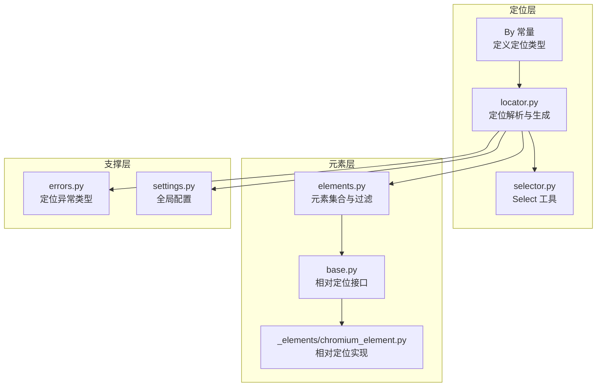
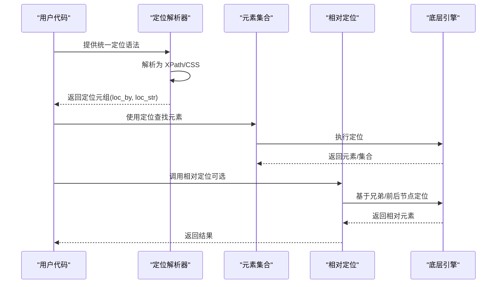
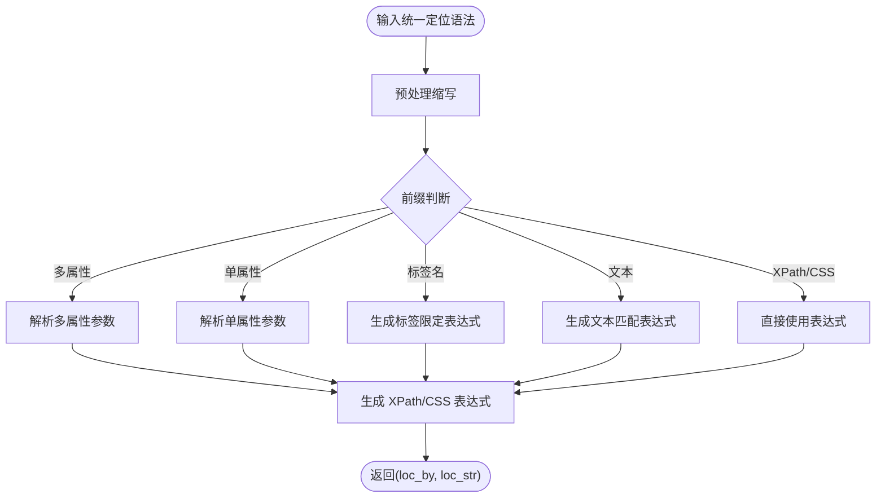
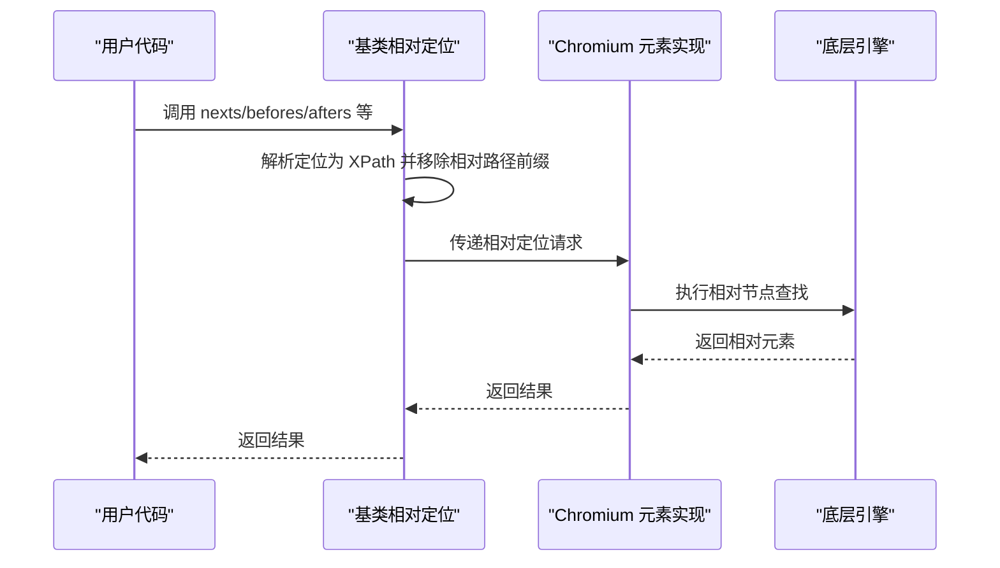
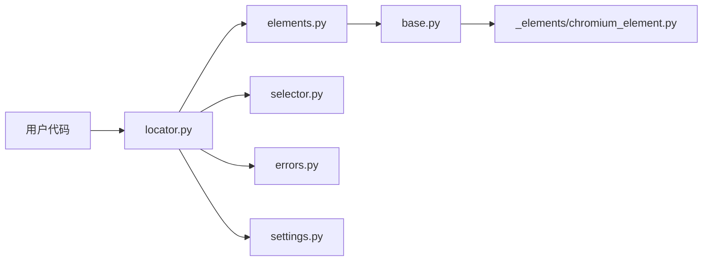

# 元素定位策略

<cite>
**本文引用的文件列表**
- [by.py](file://DrissionPage/_functions/by.py)
- [locator.py](file://DrissionPage/_functions/locator.py)
- [elements.py](file://DrissionPage/_functions/elements.py)
- [selector.py](file://DrissionPage/_units/selector.py)
- [base.py](file://DrissionPage/_base/base.py)
- [chromium_element.py](file://DrissionPage/_elements/chromium_element.py)
- [errors.py](file://DrissionPage/errors.py)
- [settings.py](file://DrissionPage/_functions/settings.py)
</cite>

## 目录
1. [简介](#简介)
2. [项目结构](#项目结构)
3. [核心组件](#核心组件)
4. [架构总览](#架构总览)
5. [详细组件分析](#详细组件分析)
6. [依赖关系分析](#依赖关系分析)
7. [性能考量](#性能考量)
8. [故障排查指南](#故障排查指南)
9. [结论](#结论)
10. [附录](#附录)

## 简介
本文系统梳理 DrissionPage 的元素定位策略与实现原理，涵盖 XPath、CSS 选择器、文本匹配、链接文本、部分链接文本等多种定位方法的语法与使用场景；解释定位器的优先级机制与智能选择算法；提供相对定位与绝对定位的区别及在复杂页面中的应用技巧；并给出性能优化建议与常见问题解决方案。

## 项目结构
围绕“定位”这一主题，关键模块包括：
- 定位常量与类型：定义支持的定位类型（如 XPath、CSS 选择器、ID、类名等）
- 定位解析与生成：将统一的定位语法转换为底层引擎可执行的 XPath/CSS
- 元素集合与过滤：提供链式过滤、搜索与选择
- 相对定位：基于兄弟/前后节点的相对定位
- 选择器工具：针对 select 元素的选项选择
- 错误与配置：定位异常类型与全局配置项

图表来源
- [by.py:10-19](file://DrissionPage/_functions/by.py#L10-L19)
- [locator.py:15-115](file://DrissionPage/_functions/locator.py#L15-L115)
- [elements.py:276-302](file://DrissionPage/_functions/elements.py#L276-L302)
- [base.py:206-244](file://DrissionPage/_base/base.py#L206-L244)
- [chromium_element.py:306-328](file://DrissionPage/_elements/chromium_element.py#L306-L328)
- [selector.py:13-161](file://DrissionPage/_units/selector.py#L13-L161)
- [errors.py:89-90](file://DrissionPage/errors.py#L89-L90)
- [settings.py:13-69](file://DrissionPage/_functions/settings.py#L13-L69)

章节来源
- [by.py:10-19](file://DrissionPage/_functions/by.py#L10-L19)
- [locator.py:15-115](file://DrissionPage/_functions/locator.py#L15-L115)
- [elements.py:276-302](file://DrissionPage/_functions/elements.py#L276-L302)
- [base.py:206-244](file://DrissionPage/_base/base.py#L206-L244)
- [chromium_element.py:306-328](file://DrissionPage/_elements/chromium_element.py#L306-L328)
- [selector.py:13-161](file://DrissionPage/_units/selector.py#L13-L161)
- [errors.py:89-90](file://DrissionPage/errors.py#L89-L90)
- [settings.py:13-69](file://DrissionPage/_functions/settings.py#L13-L69)

## 核心组件
- 定位类型常量：通过 By 类统一管理，便于跨模块一致引用
- 定位解析器：将统一语法转换为 XPath 或 CSS，支持多属性组合、文本匹配、标签名限定等
- 元素集合与过滤：提供链式过滤（按标签、文本、属性、状态等）与搜索
- 相对定位：基于兄弟/前后节点的定位，支持相对路径与索引
- 选择器工具：针对 select 元素的文本/值/索引/定位符选择
- 异常与配置：定位异常类型与全局行为控制

章节来源
- [by.py:10-19](file://DrissionPage/_functions/by.py#L10-L19)
- [locator.py:15-115](file://DrissionPage/_functions/locator.py#L15-L115)
- [elements.py:276-302](file://DrissionPage/_functions/elements.py#L276-L302)
- [base.py:206-244](file://DrissionPage/_base/base.py#L206-L244)
- [selector.py:13-161](file://DrissionPage/_units/selector.py#L13-L161)
- [errors.py:89-90](file://DrissionPage/errors.py#L89-L90)
- [settings.py:13-69](file://DrissionPage/_functions/settings.py#L13-L69)

## 架构总览
DrissionPage 的定位体系以“统一语法 + 解析器 + 底层引擎”为核心，支持：
- 统一定位语法：如 @id=、@class=、@name=、tag:、text=、text:、text^、text$、css:、xpath: 等
- 多种输出：最终统一转换为 XPath 或 CSS，供底层引擎执行
- 过滤与搜索：在元素集合上进行二次筛选，提升命中率与稳定性
- 相对定位：基于兄弟/前后节点的相对定位，避免绝对路径脆弱性

图表来源
- [locator.py:96-115](file://DrissionPage/_functions/locator.py#L96-L115)
- [elements.py:276-302](file://DrissionPage/_functions/elements.py#L276-L302)
- [base.py:225-244](file://DrissionPage/_base/base.py#L225-L244)

## 详细组件分析

### 统一定位语法与解析
- 统一语法支持：
  - 属性定位：@id=、@class=、@name=、@data-* 等
  - 标签名限定：tag:div、tag^、tag$、tag=
  - 文本匹配：text=、text:、text^、text$
  - 多属性组合：@@、@|、@!（与/或/非）
  - 缩写形式：. 代表 @class=、# 代表 @id=、t: 代表 tag:、tx:/text: 代表 text:、c:/css: 代表 css:、x:/xpath: 代表 xpath:
  - Selenium 风格：(By.XPATH, ...), (By.CSS_SELECTOR, ...) 等
- 解析流程：
  - 预处理：将缩写展开为标准形式
  - 分支判断：根据前缀选择对应分支（多属性、单属性、标签名、文本、XPath/CSS）
  - 生成表达式：将参数映射为 XPath 或 CSS
  - 转换：必要时将 CSS 转换为 XPath，提升兼容性

图表来源
- [locator.py:15-115](file://DrissionPage/_functions/locator.py#L15-L115)
- [locator.py:147-195](file://DrissionPage/_functions/locator.py#L147-L195)
- [locator.py:198-235](file://DrissionPage/_functions/locator.py#L198-L235)
- [locator.py:552-578](file://DrissionPage/_functions/locator.py#L552-L578)

章节来源
- [locator.py:15-115](file://DrissionPage/_functions/locator.py#L15-L115)
- [locator.py:147-195](file://DrissionPage/_functions/locator.py#L147-L195)
- [locator.py:198-235](file://DrissionPage/_functions/locator.py#L198-L235)
- [locator.py:552-578](file://DrissionPage/_functions/locator.py#L552-L578)

### XPath 与 CSS 选择器
- XPath 生成规则：
  - 单属性：@id/@class/@name 等，支持精确匹配、前缀/后缀匹配、包含匹配
  - 多属性：支持 @@（与）、@|（或）、@!（非），并可混合标签名限定
  - 文本匹配：text=、text:、text^、text$，分别对应精确、包含、前缀、后缀
  - 转义：对双引号进行 concat 转义，保证表达式正确性
- CSS 生成规则：
  - 单属性：@id、@class、@name 等，支持 =、^、$、*（包含）四种匹配
  - 多属性：同上，但当出现文本匹配时回退到 XPath
  - 转义：对特殊字符进行 CSS 转义
  - 转换：可将 CSS 转换为 XPath，提升兼容性

章节来源
- [locator.py:238-298](file://DrissionPage/_functions/locator.py#L238-L298)
- [locator.py:301-374](file://DrissionPage/_functions/locator.py#L301-L374)
- [locator.py:377-394](file://DrissionPage/_functions/locator.py#L377-L394)
- [locator.py:397-442](file://DrissionPage/_functions/locator.py#L397-L442)
- [locator.py:445-465](file://DrissionPage/_functions/locator.py#L445-L465)
- [locator.py:106-114](file://DrissionPage/_functions/locator.py#L106-L114)

### 文本匹配、链接文本与部分链接文本
- 文本匹配：
  - text=：精确匹配
  - text:：包含匹配
  - text^：前缀匹配
  - text$：后缀匹配
- 链接文本与部分链接文本：
  - 链接文本：通过 a 标签 + text() 精确匹配
  - 部分链接文本：通过 a 标签 + contains(text(), ...) 包含匹配
- 实现要点：
  - 文本匹配默认在父元素上定位，避免误伤
  - 转义与编码确保表达式安全

章节来源
- [locator.py:169-194](file://DrissionPage/_functions/locator.py#L169-L194)
- [locator.py:488-498](file://DrissionPage/_functions/locator.py#L488-L498)
- [locator.py:526-538](file://DrissionPage/_functions/locator.py#L526-L538)

### 定位器优先级与智能选择算法
- 优先级机制：
  - 统一语法优先：先解析为 XPath/CSS，再交由底层引擎执行
  - 多属性组合：@@（与）优先于 @|（或），@!（非）可修饰任意属性
  - 文本匹配：在多属性中可与标签名组合，形成更精准的定位
- 智能选择：
  - CSS 转 XPath：当 CSS 选择器难以表达或性能不佳时，自动转换为 XPath
  - 文本匹配回退：当 CSS 无法表达文本匹配时，自动回退到 XPath
  - 转义与容错：对引号、特殊字符进行转义，避免表达式错误

章节来源
- [locator.py:54-71](file://DrissionPage/_functions/locator.py#L54-L71)
- [locator.py:106-114](file://DrissionPage/_functions/locator.py#L106-L114)
- [locator.py:411-412](file://DrissionPage/_functions/locator.py#L411-L412)

### 相对定位与绝对定位
- 绝对定位：
  - 使用完整的 XPath/CSS 表达式，直接指向目标元素
  - 优点：表达清晰、可读性强
  - 缺点：易受页面结构变化影响，脆弱性高
- 相对定位：
  - 基于兄弟/前后节点定位，使用 ./following-sibling::、./preceding-sibling:: 等
  - 优点：对页面结构变化更具弹性，稳定性更好
  - 限制：仅支持 XPath，不支持 CSS
- 实践建议：
  - 优先使用相对定位，减少绝对路径依赖
  - 在复杂页面中，结合标签名与属性进行多层限定，提高稳定性

图表来源
- [base.py:206-244](file://DrissionPage/_base/base.py#L206-L244)
- [chromium_element.py:306-328](file://DrissionPage/_elements/chromium_element.py#L306-L328)

章节来源
- [base.py:206-244](file://DrissionPage/_base/base.py#L206-L244)
- [chromium_element.py:306-328](file://DrissionPage/_elements/chromium_element.py#L306-L328)

### 元素集合与过滤
- 链式过滤：
  - 按标签：tag(name, equal=True/False)
  - 按文本：text(text, fuzzy=True/False, contain=True/False)
  - 按属性：attr(name, value, equal=True/False)，支持 style/property
  - 按状态：displayed/checked/selected/enabled/clickable/have_rect
- 搜索：
  - search(displayed/checked/selected/enabled/clickable/have_rect/have_text/tag)
  - search_one(index, 同上)
- 适用场景：
  - 在大量候选元素中快速缩小范围
  - 结合相对定位，进一步稳定命中

章节来源
- [elements.py:64-128](file://DrissionPage/_functions/elements.py#L64-L128)
- [elements.py:130-161](file://DrissionPage/_functions/elements.py#L130-L161)
- [elements.py:163-204](file://DrissionPage/_functions/elements.py#L163-L204)
- [elements.py:206-260](file://DrissionPage/_functions/elements.py#L206-L260)
- [elements.py:386-420](file://DrissionPage/_functions/elements.py#L386-L420)
- [elements.py:421-461](file://DrissionPage/_functions/elements.py#L421-L461)

### Select 元素选择
- 支持模式：
  - 文本选择：by_text(text)
  - 值选择：by_value(value)
  - 索引选择：by_index(index)
  - 定位符选择：by_locator(locator)
  - 取消选择：cancel_by_* 系列
- 多选支持：
  - is_multi 判断是否多选
  - invert/invert_all/clear 等批量操作
- 超时与事件：
  - 自动等待选项出现
  - 触发 change 事件以同步状态

章节来源
- [selector.py:13-161](file://DrissionPage/_units/selector.py#L13-L161)

## 依赖关系分析
- 模块耦合：
  - locator.py 依赖 by.py（定位类型）、settings.py（语言与配置）、errors.py（异常）
  - elements.py 依赖 locator.py（定位解析）、errors.py（异常）、settings.py（配置）
  - base.py 依赖 locator.py（相对定位）、errors.py（异常）
  - chromium_element.py 依赖 base.py（相对定位接口）、errors.py（异常）
  - selector.py 依赖 elements.py（元素集合）、errors.py（异常）
- 关键依赖链：
  - 用户输入 → 统一语法 → locator → XPath/CSS → 底层引擎
  - 元素集合 → 过滤/搜索 → 更精准的定位
  - 相对定位 → XPath → 兄弟/前后节点 → 更稳定的定位

图表来源
- [locator.py:10-12](file://DrissionPage/_functions/locator.py#L10-L12)
- [elements.py:10-13](file://DrissionPage/_functions/elements.py#L10-L13)
- [base.py:225-244](file://DrissionPage/_base/base.py#L225-L244)
- [chromium_element.py:306-328](file://DrissionPage/_elements/chromium_element.py#L306-L328)
- [selector.py:13-161](file://DrissionPage/_units/selector.py#L13-L161)
- [errors.py:89-90](file://DrissionPage/errors.py#L89-L90)
- [settings.py:13-69](file://DrissionPage/_functions/settings.py#L13-L69)

章节来源
- [locator.py:10-12](file://DrissionPage/_functions/locator.py#L10-L12)
- [elements.py:10-13](file://DrissionPage/_functions/elements.py#L10-L13)
- [base.py:225-244](file://DrissionPage/_base/base.py#L225-L244)
- [chromium_element.py:306-328](file://DrissionPage/_elements/chromium_element.py#L306-L328)
- [selector.py:13-161](file://DrissionPage/_units/selector.py#L13-L161)
- [errors.py:89-90](file://DrissionPage/errors.py#L89-L90)
- [settings.py:13-69](file://DrissionPage/_functions/settings.py#L13-L69)

## 性能考量
- 优先使用 CSS 选择器：
  - CSS 在现代浏览器中通常更快，适合简单、稳定的定位
- 必要时转换为 XPath：
  - 当 CSS 无法表达文本匹配或多属性组合时，自动转换为 XPath
- 减少绝对路径依赖：
  - 使用相对定位，降低页面结构调整带来的维护成本
- 合理使用过滤：
  - 在元素集合上进行链式过滤，缩小候选集，提升后续定位效率
- 超时与重试：
  - 合理设置超时时间，避免长时间阻塞
  - 对不稳定元素采用多次尝试策略

## 故障排查指南
- 常见异常类型：
  - 定位符冲突：@@ 和 @| 不能同时出现
  - 无效定位符：无法识别的定位语法
  - 定位符长度错误：Selenium 风格定位符长度必须为 2
  - 符号不正确：定位语法中的符号不合法
  - 元素不可点击/无矩形：相对定位需要元素具备尺寸信息
- 排查步骤：
  - 检查定位语法是否符合规范
  - 确认相对定位仅支持 XPath，不支持 CSS
  - 验证元素是否具备尺寸信息（用于相对定位）
  - 使用链式过滤缩小范围，逐步验证定位准确性
  - 查看全局配置项，确认异常抛出策略

章节来源
- [errors.py:89-90](file://DrissionPage/errors.py#L89-L90)
- [texts.py:140-143](file://DrissionPage/_functions/texts.py#L140-L143)
- [base.py:233-234](file://DrissionPage/_base/base.py#L233-L234)
- [chromium_element.py:311-312](file://DrissionPage/_elements/chromium_element.py#L311-L312)

## 结论
DrissionPage 的定位体系通过统一语法、灵活解析与强大的过滤能力，实现了对复杂页面的高效、稳定定位。XPath 与 CSS 的智能选择、相对定位的弹性设计，以及 Select 元素的专用工具，共同构成了完善的定位生态。实践中应优先采用相对定位与链式过滤，结合性能优化策略，获得最佳的自动化体验。

## 附录
- 最佳实践清单：
  - 优先使用相对定位，减少绝对路径依赖
  - 在多属性组合中合理使用 @@、@|、@!
  - 文本匹配优先使用包含匹配，再逐步精确
  - CSS 无法表达时回退到 XPath
  - 使用链式过滤提升命中率与稳定性
  - 对不稳定元素设置合理的超时与重试