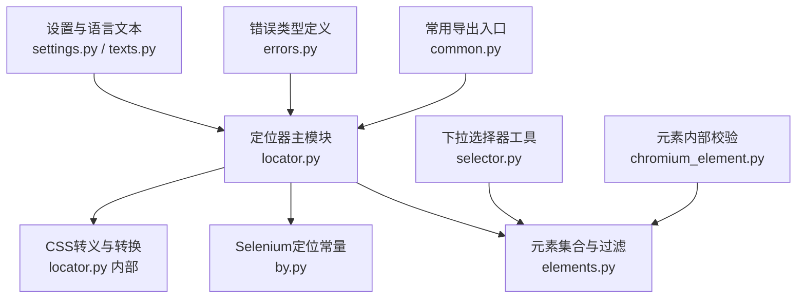
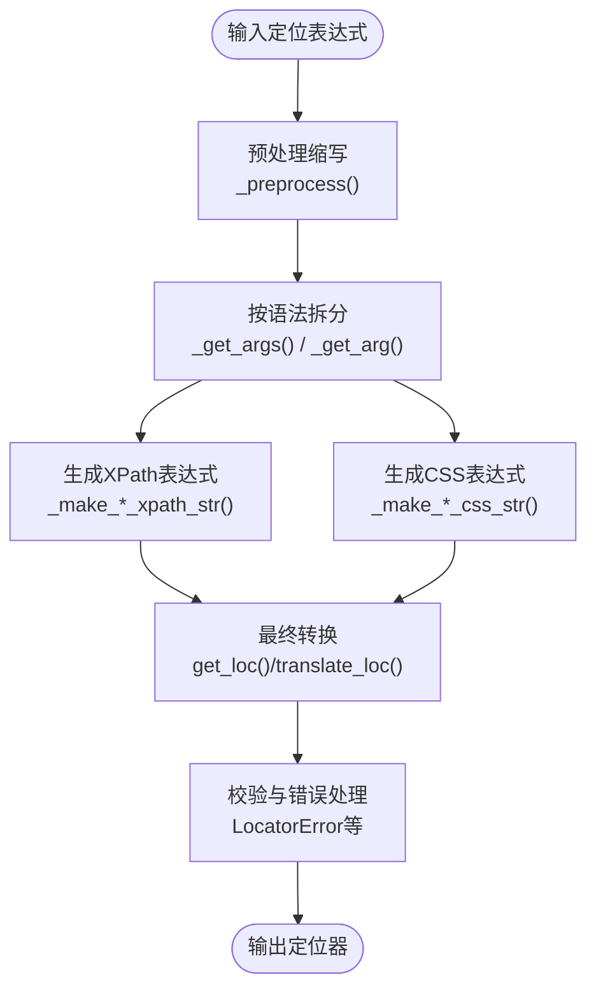
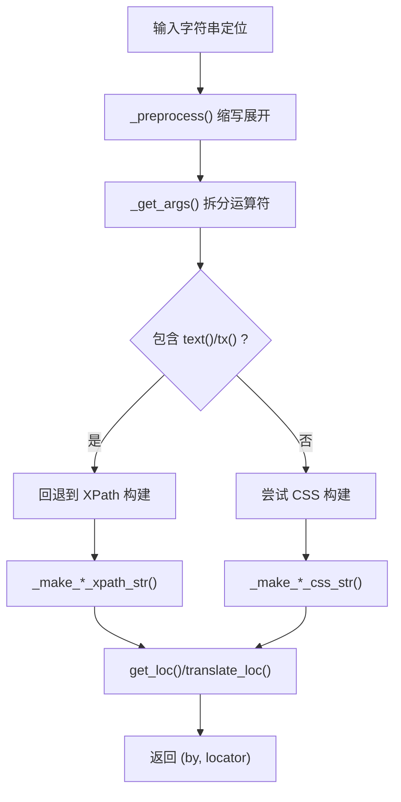
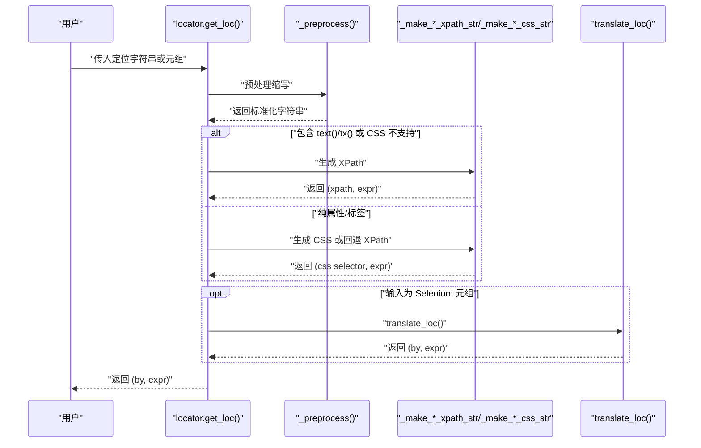
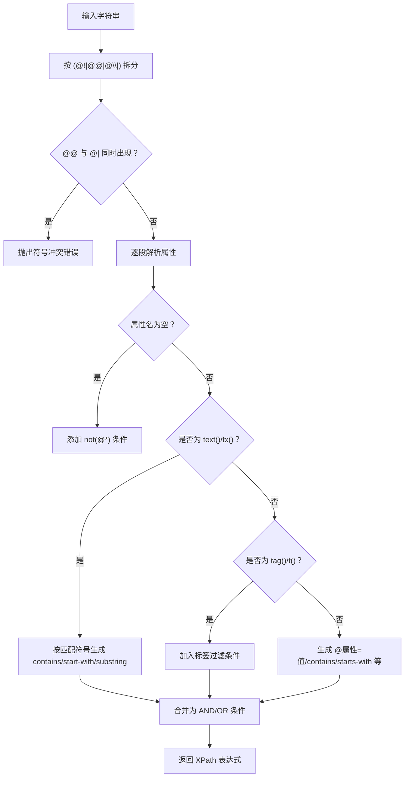
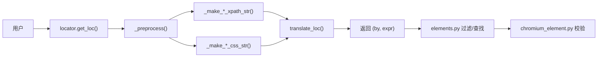

# 定位语法参考

<cite>
**本文引用的文件**
- [locator.py](file://DrissionPage/_functions/locator.py)
- [by.py](file://DrissionPage/_functions/by.py)
- [elements.py](file://DrissionPage/_functions/elements.py)
- [selector.py](file://DrissionPage/_units/selector.py)
- [settings.py](file://DrissionPage/_functions/settings.py)
- [errors.py](file://DrissionPage/errors.py)
- [texts.py](file://DrissionPage/_functions/texts.py)
- [common.py](file://DrissionPage/common.py)
- [chromium_element.py](file://DrissionPage/_elements/chromium_element.py)
</cite>

## 目录
1. [简介](#简介)
2. [项目结构](#项目结构)
3. [核心组件](#核心组件)
4. [架构总览](#架构总览)
5. [详细组件分析](#详细组件分析)
6. [依赖关系分析](#依赖关系分析)
7. [性能考量](#性能考量)
8. [故障排查指南](#故障排查指南)
9. [结论](#结论)
10. [附录](#附录)

## 简介
本手册面向 DrissionPage 的定位系统，系统整理并解释其支持的定位语法格式，包括缩写形式与完整形式的对照、符号与运算符的含义与用法、预处理规则与转换流程、验证规则与错误处理机制，并提供性能对比与常见错误诊断建议，帮助用户高效、稳定地编写定位表达式。

## 项目结构
定位系统主要位于函数模块中，核心文件如下：
- 定位器主逻辑：DrissionPage/_functions/locator.py
- Selenium 定位常量：DrissionPage/_functions/by.py
- 元素集合与过滤：DrissionPage/_functions/elements.py
- 下拉选择器工具：DrissionPage/_units/selector.py
- 设置与语言文本：DrissionPage/_functions/settings.py、DrissionPage/_functions/texts.py
- 错误类型定义：DrissionPage/errors.py
- 常用导出入口：DrissionPage/common.py
- 元素内部定位与校验：DrissionPage/_elements/chromium_element.py

图表来源
- [locator.py:1-579](file://DrissionPage/_functions/locator.py#L1-L579)
- [by.py:1-19](file://DrissionPage/_functions/by.py#L1-L19)
- [elements.py:1-461](file://DrissionPage/_functions/elements.py#L1-L461)
- [selector.py:1-161](file://DrissionPage/_units/selector.py#L1-L161)
- [settings.py:1-69](file://DrissionPage/_functions/settings.py#L1-L69)
- [errors.py:1-95](file://DrissionPage/errors.py#L1-L95)
- [common.py:1-57](file://DrissionPage/common.py#L1-L57)
- [chromium_element.py:1009-1035](file://DrissionPage/_elements/chromium_element.py#L1009-L1035)

章节来源
- [locator.py:1-579](file://DrissionPage/_functions/locator.py#L1-L579)
- [by.py:1-19](file://DrissionPage/_functions/by.py#L1-L19)
- [elements.py:1-461](file://DrissionPage/_functions/elements.py#L1-L461)
- [selector.py:1-161](file://DrissionPage/_units/selector.py#L1-L161)
- [settings.py:1-69](file://DrissionPage/_functions/settings.py#L1-L69)
- [errors.py:1-95](file://DrissionPage/errors.py#L1-L95)
- [common.py:1-57](file://DrissionPage/common.py#L1-L57)
- [chromium_element.py:1009-1035](file://DrissionPage/_elements/chromium_element.py#L1009-L1035)

## 核心组件
- 定位器主函数族
  - 字符串定位到 XPath/CSS 转换：str_to_xpath_loc、str_to_css_loc、str_to_ax_loc
  - 字符串定位到元组格式：get_loc
  - 判断是否为字符串定位：is_str_loc
  - 判断是否为 Selenium 定位：is_selenium_loc
- 预处理与缩写展开：_preprocess
- 多属性/单属性构建器
  - XPath 构建：_make_multi_xpath_str、_make_single_xpath_str
  - CSS 构建：_make_multi_css_str、_make_single_css_str
- 辅助函数
  - 符号转义：_quotes_escape
  - CSS 转义：css_trans
  - Selenium 定位转换：translate_loc、translate_css_loc

章节来源
- [locator.py:15-579](file://DrissionPage/_functions/locator.py#L15-L579)

## 架构总览
定位系统的工作流分为“输入预处理”、“语法解析与拆分”、“生成 XPath/CSS 表达式”、“最终转换与校验”四个阶段。

图表来源
- [locator.py:552-579](file://DrissionPage/_functions/locator.py#L552-L579)
- [locator.py:54-72](file://DrissionPage/_functions/locator.py#L54-L72)
- [locator.py:74-83](file://DrissionPage/_functions/locator.py#L74-L83)
- [locator.py:238-299](file://DrissionPage/_functions/locator.py#L238-L299)
- [locator.py:301-375](file://DrissionPage/_functions/locator.py#L301-L375)
- [locator.py:397-443](file://DrissionPage/_functions/locator.py#L397-L443)
- [locator.py:445-466](file://DrissionPage/_functions/locator.py#L445-L466)
- [locator.py:96-115](file://DrissionPage/_functions/locator.py#L96-L115)
- [locator.py:468-503](file://DrissionPage/_functions/locator.py#L468-L503)

## 详细组件分析

### 1. 缩写形式与完整形式对照表
- 类别与示例
  - 类名定位
    - 缩写：. 或 .=、.:、.^、.$
    - 完整：@class=、@class:、@class^、@class$
  - ID 定位
    - 缩写：# 或 #=、#:、.#、.$
    - 完整：@id=、@id:、@id^、@id$
  - 标签名定位
    - 缩写：t:、t=
    - 完整：tag:、tag=
  - 文本定位
    - 缩写：tx:、tx=、tx^、tx$
    - 完整：text:、text=、text^、text$
  - XPath/CSS 前缀
    - 缩写：x:、x=、c:、c=
    - 完整：xpath:、xpath=、css:、css=

章节来源
- [locator.py:552-579](file://DrissionPage/_functions/locator.py#L552-L579)

### 2. 符号与运算符详解
- 属性匹配符号
  - =：精确匹配
  - :：包含（模糊）
  - ^：开头匹配
  - $：结尾匹配
- 多属性组合运算符
  - @@：与关系（AND），默认
  - @|：或关系（OR）
  - @!：否定（排除）某属性条件
- 特殊占位
  - @：表示“不查询任何属性”，即 not(@*)
- 文本与标签专用
  - text()、tx()：文本匹配
  - tag()、t()：标签名匹配
  - @tag()、@t()：标签名属性匹配

章节来源
- [locator.py:74-83](file://DrissionPage/_functions/locator.py#L74-L83)
- [locator.py:301-375](file://DrissionPage/_functions/locator.py#L301-L375)
- [locator.py:238-299](file://DrissionPage/_functions/locator.py#L238-L299)

### 3. 预处理规则与转换流程
- 预处理步骤
  - 将缩写形式替换为完整形式
  - 保持原样：当缩写不完整或不匹配时
- 解析与拆分
  - 使用正则按运算符拆分：(@!|@@|@\|)
  - 校验 @@ 与 @| 不能同时出现
  - 逐段解析属性名、匹配符号与值
- 生成表达式
  - XPath：根据标签、属性、文本、匹配方式拼接
  - CSS：优先生成 CSS，若包含 text() 或 tx() 则回退到 XPath
- 最终转换
  - get_loc 支持从 Selenium 元组转换为内部格式
  - translate_loc/translate_css_loc 将 Selenium 常量映射为 XPath/CSS

图表来源
- [locator.py:552-579](file://DrissionPage/_functions/locator.py#L552-L579)
- [locator.py:54-72](file://DrissionPage/_functions/locator.py#L54-L72)
- [locator.py:397-443](file://DrissionPage/_functions/locator.py#L397-L443)
- [locator.py:445-466](file://DrissionPage/_functions/locator.py#L445-L466)
- [locator.py:96-115](file://DrissionPage/_functions/locator.py#L96-L115)
- [locator.py:468-503](file://DrissionPage/_functions/locator.py#L468-L503)

### 4. 验证规则与错误处理机制
- 输入类型校验
  - get_loc 仅接受 str 或长度为 2 的 tuple；否则抛出定位格式错误
- 运算符冲突
  - @@ 与 @| 不能同时出现在同一表达式
- 符号合法性
  - 不支持的匹配符号会触发“符号不正确”错误
- XPath/CSS 有效性
  - 元素内部查找时，若 XPath 无效会抛出“无效的 XPath 语句”
- 语言与提示
  - 所有错误通过统一语言类 texts.py 提供本地化提示

章节来源
- [locator.py:96-115](file://DrissionPage/_functions/locator.py#L96-L115)
- [locator.py:308-311](file://DrissionPage/_functions/locator.py#L308-L311)
- [locator.py:287-288](file://DrissionPage/_functions/locator.py#L287-L288)
- [chromium_element.py:1023-1026](file://DrissionPage/_elements/chromium_element.py#L1023-L1026)
- [texts.py:140-147](file://DrissionPage/_functions/texts.py#L140-L147)
- [errors.py:89-90](file://DrissionPage/errors.py#L89-L90)

### 5. 定位语法序列图（字符串到 XPath/CSS）

图表来源
- [locator.py:96-115](file://DrissionPage/_functions/locator.py#L96-L115)
- [locator.py:552-579](file://DrissionPage/_functions/locator.py#L552-L579)
- [locator.py:397-443](file://DrissionPage/_functions/locator.py#L397-L443)
- [locator.py:445-466](file://DrissionPage/_functions/locator.py#L445-L466)
- [locator.py:468-503](file://DrissionPage/_functions/locator.py#L468-L503)

### 6. 多属性解析流程（XPath）

图表来源
- [locator.py:54-72](file://DrissionPage/_functions/locator.py#L54-L72)
- [locator.py:301-375](file://DrissionPage/_functions/locator.py#L301-L375)

### 7. 单属性解析流程（XPath/CSS）
- 单属性 XPath
  - 支持 =、:、^、$ 四种匹配
  - text() 与 tx() 特殊处理：生成 text() 函数或 starts-with/substring
- 单属性 CSS
  - 若属性名为 text()/tx() 或包含不支持的符号，则回退到 XPath
  - 否则生成 CSS 选择器并进行字符转义

章节来源
- [locator.py:238-299](file://DrissionPage/_functions/locator.py#L238-L299)
- [locator.py:445-466](file://DrissionPage/_functions/locator.py#L445-L466)
- [locator.py:397-443](file://DrissionPage/_functions/locator.py#L397-L443)

### 8. 文本匹配与标签匹配
- 文本匹配
  - text=：精确匹配
  - text:：包含匹配
  - text^：开头匹配
  - text$：结尾匹配
- 标签名匹配
  - tag:、tag=：精确匹配标签名
  - tag^、tag$：标签名开头/结尾匹配

章节来源
- [locator.py:147-195](file://DrissionPage/_functions/locator.py#L147-L195)

### 9. Selenium 定位转换
- translate_loc
  - 接受 (by, value) 元组，映射为 XPath 或 CSS
  - 不支持的 by 将抛出“无法识别的定位符”
- translate_css_loc
  - 将 Selenium 的 CSS/ID/CLASS/LINK_TEXT 等转换为 CSS 或回退 XPath

章节来源
- [locator.py:468-503](file://DrissionPage/_functions/locator.py#L468-L503)
- [locator.py:506-543](file://DrissionPage/_functions/locator.py#L506-L543)
- [by.py:10-19](file://DrissionPage/_functions/by.py#L10-L19)

### 10. 元素内部定位校验
- 元素内部遍历时，会根据解析后的定位数据逐条比对
- 支持 deny（@!）否定、多种匹配符号、标签与文本匹配
- 若匹配失败，返回 NoneElement 并携带定位参数

章节来源
- [chromium_element.py:1397-1438](file://DrissionPage/_elements/chromium_element.py#L1397-L1438)

## 依赖关系分析
- 模块耦合
  - locator.py 依赖 by.py（常量）、settings.py（语言）、errors.py（异常）
  - elements.py 依赖 locator.py（判断字符串定位）、errors.py（异常）
  - selector.py 依赖 elements.py（过滤与选择）
  - common.py 导出定位相关接口
- 关键依赖链
  - 用户输入 → locator.get_loc → _preprocess → _make_*_str → translate_loc → 返回定位器
  - 元素内部查找 → chromium_element.py 内部校验逻辑

图表来源
- [locator.py:96-115](file://DrissionPage/_functions/locator.py#L96-L115)
- [locator.py:552-579](file://DrissionPage/_functions/locator.py#L552-L579)
- [locator.py:301-375](file://DrissionPage/_functions/locator.py#L301-L375)
- [locator.py:397-443](file://DrissionPage/_functions/locator.py#L397-L443)
- [locator.py:468-503](file://DrissionPage/_functions/locator.py#L468-L503)
- [elements.py:276-303](file://DrissionPage/_functions/elements.py#L276-L303)
- [chromium_element.py:1397-1438](file://DrissionPage/_elements/chromium_element.py#L1397-L1438)

## 性能考量
- 优先级建议
  - 纯属性定位：CSS 通常更快
  - 文本匹配：XPath 在文本 contains/start-with/substring 场景更灵活
  - 标签名 + 属性：CSS 更简洁；复杂条件建议 XPath
- 注意事项
  - CSS 不支持 text()/tx() 匹配时会回退 XPath
  - 大量 @! 否定条件可能降低性能
  - 多属性 AND/OR 组合应避免冗余条件

[本节为通用性能建议，不直接分析具体文件]

## 故障排查指南
- 常见错误与处理
  - 定位格式不正确：检查输入类型（str 或 tuple），确保符合 LOC_FORMAT
  - @@ 与 @| 同时出现：移除其中一个，或改为多个独立条件
  - 符号不正确：仅支持 =、:、^、$，其他符号将报错
  - 无效的 XPath：检查表达式是否合法，必要时改用 CSS 或简化条件
  - 无法识别的定位符：确认 Selenium 定位 by 是否在支持列表内
- 诊断步骤
  - 使用 is_str_loc/is_selenium_loc 判断输入类型
  - 逐步缩小定位范围，先用标签/类名再加属性
  - 对于文本匹配，优先使用 text: 或 text=，避免过长的 starts-with/substring

章节来源
- [elements.py:276-303](file://DrissionPage/_functions/elements.py#L276-L303)
- [locator.py:96-115](file://DrissionPage/_functions/locator.py#L96-L115)
- [locator.py:308-311](file://DrissionPage/_functions/locator.py#L308-L311)
- [locator.py:287-288](file://DrissionPage/_functions/locator.py#L287-L288)
- [chromium_element.py:1023-1026](file://DrissionPage/_elements/chromium_element.py#L1023-L1026)
- [texts.py:140-147](file://DrissionPage/_functions/texts.py#L140-L147)

## 结论
DrissionPage 的定位系统以“字符串定位 + 预处理 + 多策略生成 + 统一转换”的架构实现，既支持简洁的缩写语法，又提供强大的 XPath/CSS 生成能力。通过严格的验证与错误提示，以及对文本与标签的专门处理，用户可以快速编写高可靠性的定位表达式。建议在实际使用中优先采用 CSS，遇到文本或复杂条件时再转向 XPath，并遵循本文提供的语法与排错建议。

[本节为总结性内容，不直接分析具体文件]

## 附录

### A. 语法速查表
- 缩写与完整对照
  - . → @class=
  - .= → @class=
  - .: → @class:
  - .^ → @class^
  - .$ → @class$
  - # → @id=
  - #= → @id=
  - #: → @id:
  - #^ → @id^
  - #$ → @id$
  - t: → tag:
  - t= → tag=
  - tx: → text:
  - tx= → text=
  - tx^ → text^
  - tx$ → text$
  - x: → xpath:
  - x= → xpath=
  - c: → css:
  - c= → css=
- 匹配符号
  - =：精确
  - :：包含
  - ^：开头
  - $：结尾
- 运算符
  - @@：与（默认）
  - @|：或
  - @!：否定（排除）

章节来源
- [locator.py:552-579](file://DrissionPage/_functions/locator.py#L552-L579)
- [locator.py:74-83](file://DrissionPage/_functions/locator.py#L74-L83)
- [locator.py:301-375](file://DrissionPage/_functions/locator.py#L301-L375)

### B. Selenium 定位常量映射
- By 常量
  - ID、XPATH、LINK_TEXT、PARTIAL_LINK_TEXT、NAME、TAG_NAME、CLASS_NAME、CSS_SELECTOR

章节来源
- [by.py:10-19](file://DrissionPage/_functions/by.py#L10-L19)