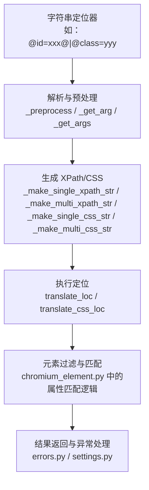
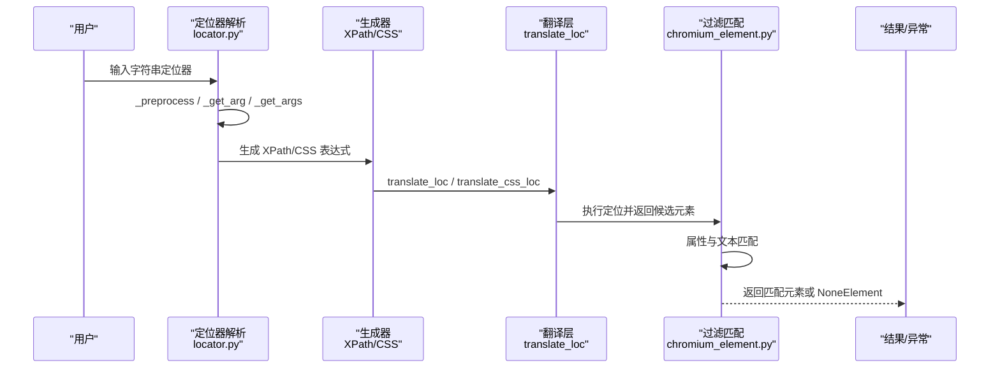
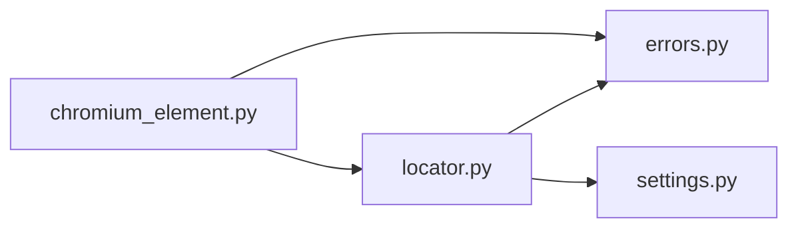

# 属性定位策略

<cite>
**本文引用的文件列表**
- [by.py](file://DrissionPage/_functions/by.py)
- [locator.py](file://DrissionPage/_functions/locator.py)
- [chromium_element.py](file://DrissionPage/_elements/chromium_element.py)
- [elements.py](file://DrissionPage/_functions/elements.py)
- [selector.py](file://DrissionPage/_units/selector.py)
- [errors.py](file://DrissionPage/errors.py)
- [settings.py](file://DrissionPage/_functions/settings.py)
</cite>

## 目录
1. [简介](#简介)
2. [项目结构与定位系统概览](#项目结构与定位系统概览)
3. [核心组件与职责](#核心组件与职责)
4. [架构总览](#架构总览)
5. [详细组件分析](#详细组件分析)
6. [依赖关系分析](#依赖关系分析)
7. [性能与优先级](#性能与优先级)
8. [兼容性与跨浏览器考虑](#兼容性与跨浏览器考虑)
9. [实际应用示例与最佳实践](#实际应用示例与最佳实践)
10. [故障排查指南](#故障排查指南)
11. [结论](#结论)

## 简介
本文件系统化阐述基于 HTML 属性的元素定位策略，重点覆盖：
- 常用属性定位语法：ID 定位（@id=）、类名定位（@class=）、标签名定位（@tag=）等
- 属性值匹配方式：精确匹配、包含匹配、前缀匹配、后缀匹配
- 多属性组合与逻辑关系（AND/OR）
- 否定匹配（@!）
- 转义与特殊字符处理
- 性能与优先级建议
- 在不同浏览器环境中的兼容性要点
- 复杂页面场景下的实战应用

## 项目结构与定位系统概览
定位系统由“字符串定位器解析”“生成 XPath/CSS 选择器”“元素过滤与匹配”三部分组成，并通过统一的错误与设置模块提供一致的体验。

图表来源
- [locator.py:15-578](file://DrissionPage/_functions/locator.py#L15-L578)
- [chromium_element.py:1390-1439](file://DrissionPage/_elements/chromium_element.py#L1390-L1439)

章节来源
- [locator.py:15-578](file://DrissionPage/_functions/locator.py#L15-L578)
- [by.py:10-19](file://DrissionPage/_functions/by.py#L10-L19)

## 核心组件与职责
- 定位器解析与预处理：负责将用户输入的字符串定位器转换为内部统一的数据结构，支持多属性、逻辑关系、匹配符号、转义等。
- XPath/CSS 生成器：根据解析结果生成最终的 XPath 或 CSS 选择器表达式。
- 元素匹配引擎：在已定位到的候选元素集合上，按属性与文本规则进行二次过滤。
- 统一错误与设置：提供一致的异常类型与语言本地化支持。

章节来源
- [locator.py:15-578](file://DrissionPage/_functions/locator.py#L15-L578)
- [chromium_element.py:1390-1439](file://DrissionPage/_elements/chromium_element.py#L1390-L1439)
- [errors.py:89](file://DrissionPage/errors.py#L89)
- [settings.py:13-69](file://DrissionPage/_functions/settings.py#L13-L69)

## 架构总览
下图展示了从字符串定位器到元素匹配的关键流程。

图表来源
- [locator.py:15-578](file://DrissionPage/_functions/locator.py#L15-L578)
- [chromium_element.py:1390-1439](file://DrissionPage/_elements/chromium_element.py#L1390-L1439)

## 详细组件分析

### 字符串定位器语法与解析
- 基础语法
  - 单属性：@name=...、@name:...、@name^...、@name$...
  - 多属性：@@ 或 @| 分隔；@! 表示否定
  - 标签名：tag:... 或 tag=...、tag^...、tag$...
  - 文本：text=...、text:...、text^...、text$...
  - 缩写：# 等价于 @id=，. 等价于 @class=
- 解析流程
  - 预处理：将 .、#、t:、tx:、c:、x: 等缩写展开为标准形式
  - 提取参数：拆分 @@、@|、@! 与属性段，识别匹配符号（=、:、^、$）
  - 生成内部结构：统一为 {and: bool, args: [[name, symbol, value, deny]]}

章节来源
- [locator.py:15-578](file://DrissionPage/_functions/locator.py#L15-L578)
- [locator.py:552-578](file://DrissionPage/_functions/locator.py#L552-L578)

### 属性值匹配方式与转义
- 匹配方式
  - =：精确匹配
  - :：包含匹配（模糊匹配）
  - ^：前缀匹配
  - $：后缀匹配
- 特殊处理
  - 文本匹配时，若属性名为 text() 或 tx()，会走文本节点路径
  - 引号转义：使用 concat(...) 以避免双引号冲突
- 否定匹配
  - @!name=... 表示排除该属性值
  - 多属性时，@! 可作用于任意属性段

章节来源
- [locator.py:238-299](file://DrissionPage/_functions/locator.py#L238-L299)
- [locator.py:301-375](file://DrissionPage/_functions/locator.py#L301-L375)
- [locator.py:377-394](file://DrissionPage/_functions/locator.py#L377-L394)
- [chromium_element.py:1390-1439](file://DrissionPage/_elements/chromium_element.py#L1390-L1439)

### XPath 与 CSS 生成策略
- 单属性
  - 生成对应 XPath 条件或 CSS 属性选择器
  - 文本属性走 XPath 文本节点路径
- 多属性
  - 逻辑 AND/OR：@@ 为 AND，@| 为 OR
  - 否定：@! 作用于某属性段
- 标签名
  - 支持 tag:、tag=、tag^、tag$，可与属性组合
- 文本
  - text=、text:、text^、text$ 自动映射到 XPath 文本匹配

章节来源
- [locator.py:238-299](file://DrissionPage/_functions/locator.py#L238-L299)
- [locator.py:301-375](file://DrissionPage/_functions/locator.py#L301-L375)
- [locator.py:198-235](file://DrissionPage/_functions/locator.py#L198-L235)
- [locator.py:147-195](file://DrissionPage/_functions/locator.py#L147-L195)

### 元素过滤与匹配
- 过滤逻辑
  - AND：所有属性条件均满足
  - OR：任一属性条件满足
  - 否定：@! 使条件取反
- 文本匹配
  - raw_text 与 text() 的差异在实现中有体现
- 标签名与文本
  - tag() 与 text() 作为特殊属性参与匹配

章节来源
- [chromium_element.py:1390-1439](file://DrissionPage/_elements/chromium_element.py#L1390-L1439)

### Selenium 风格定位器翻译
- translate_loc：将 Selenium 元组定位器（By.ID、By.CLASS_NAME 等）翻译为 XPath
- translate_css_loc：将 Selenium 元组定位器翻译为 CSS 选择器

章节来源
- [locator.py:468-543](file://DrissionPage/_functions/locator.py#L468-L543)
- [by.py:10-19](file://DrissionPage/_functions/by.py#L10-L19)

## 依赖关系分析
- 定位器解析依赖
  - 错误类型：LocatorError
  - 设置：语言本地化
- 元素匹配依赖
  - 元素对象属性与状态访问
  - 文本与样式属性读取

图表来源
- [locator.py:10-12](file://DrissionPage/_functions/locator.py#L10-L12)
- [errors.py:89](file://DrissionPage/errors.py#L89)
- [settings.py:21](file://DrissionPage/_functions/settings.py#L21)
- [chromium_element.py:1390-1439](file://DrissionPage/_elements/chromium_element.py#L1390-L1439)

章节来源
- [locator.py:10-12](file://DrissionPage/_functions/locator.py#L10-L12)
- [errors.py:89](file://DrissionPage/errors.py#L89)
- [settings.py:21](file://DrissionPage/_functions/settings.py#L21)
- [chromium_element.py:1390-1439](file://DrissionPage/_elements/chromium_element.py#L1390-L1439)

## 性能与优先级
- 优先级建议
  - 精确匹配（=）通常最快，适合 ID、类名等稳定属性
  - 包含匹配（:）次之，适合动态类名或文本片段
  - 前缀/后缀匹配（^/$）较慢，尽量避免在大文档中使用
  - 多属性 AND 通常比 OR 更快，因为 AND 可以更早短路
- 实践建议
  - 尽量使用稳定且唯一的属性（如 ID），减少回退到文本匹配
  - 对动态类名，优先使用稳定的父容器 + 子属性组合
  - 避免在大列表中使用模糊匹配，必要时先缩小范围再模糊

## 兼容性与跨浏览器考虑
- 浏览器驱动
  - 本项目主要面向 Chromium 系列（通过 CDP），XPath 与 CSS 选择器在 Chromium 中表现一致
- 选择器兼容
  - CSS 选择器在不同浏览器中行为略有差异，但本项目通过转义函数（css_trans）提升兼容性
- 文本匹配
  - text() 与 normalize-space(text()) 的使用在不同浏览器中可能有细微差异，建议优先使用精确匹配或前缀/后缀匹配

## 实际应用示例与最佳实践

### 常用属性定位示例
- ID 定位
  - @id=login-btn
  - #login-btn 或 #=login-btn
- 类名定位
  - @class=btn primary
  - .=btn.primary 或 .=btn:primary
- 标签名定位
  - @tag=button
  - tag:button 或 tag=button
- 文本定位
  - text=提交
  - text:提交（包含）
  - text^登录（前缀）
  - text$成功（后缀）

### 多属性与逻辑组合
- AND 组合（@@）
  - @id=login@|@class=btn
- OR 组合（@|）
  - @id=login@|@name=username
- 否定匹配（@!）
  - @!@class=hidden@|@id=search

### 复杂页面定位策略
- 稳定父容器 + 动态子元素
  - 使用稳定的父容器（如 data-testid）+ 子属性（如按钮的 class 或文本）
- 多步骤缩小范围
  - 先用 tag 和 class 缩小范围，再用 text 或属性进一步精确
- 避免过度模糊
  - 尽量避免仅用 text:，优先使用前缀/后缀或属性组合

### 特殊字符与转义
- 引号处理
  - 当属性值包含双引号时，使用 concat(...) 生成安全的 XPath
- CSS 转义
  - 使用 css_trans 对特殊字符进行转义，确保 CSS 选择器有效

章节来源
- [locator.py:377-394](file://DrissionPage/_functions/locator.py#L377-L394)
- [locator.py:546-549](file://DrissionPage/_functions/locator.py#L546-L549)

## 故障排查指南
- 常见问题
  - 定位器格式错误：检查是否正确使用 =、:、^、$ 符号
  - 多属性逻辑冲突：@@ 与 @| 不能同时出现
  - 未找到元素：确认属性值是否唯一，尝试更精确的组合
  - 文本匹配失败：考虑使用前缀/后缀或精确匹配
- 错误类型
  - LocatorError：定位器相关错误
  - ElementNotFoundError：元素未找到
  - WaitTimeoutError：等待超时
- 设置项
  - 可通过设置 raise_when_ele_not_found 等控制异常抛出策略

章节来源
- [errors.py:89](file://DrissionPage/errors.py#L89)
- [settings.py:13-69](file://DrissionPage/_functions/settings.py#L13-L69)

## 结论
基于属性的元素定位策略在 DrissionPage 中通过统一的解析、生成与匹配机制实现，具备良好的扩展性与可维护性。实践中应优先采用稳定且唯一的属性（如 ID），结合前缀/后缀与精确匹配，合理使用多属性 AND/OR 与否定匹配，以获得更高的稳定性与性能。对于复杂页面，建议采用“父容器 + 子属性”的组合策略，并注意特殊字符的转义处理。