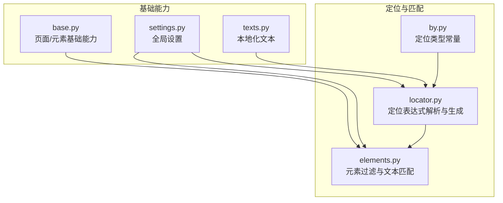
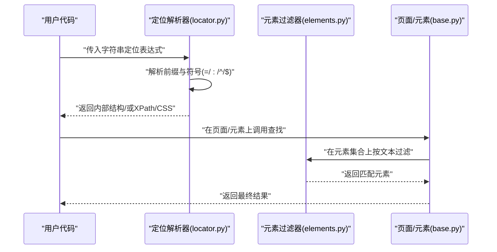
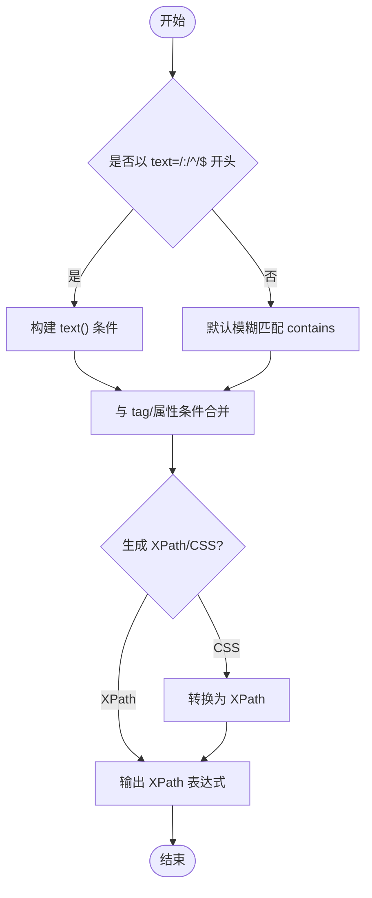
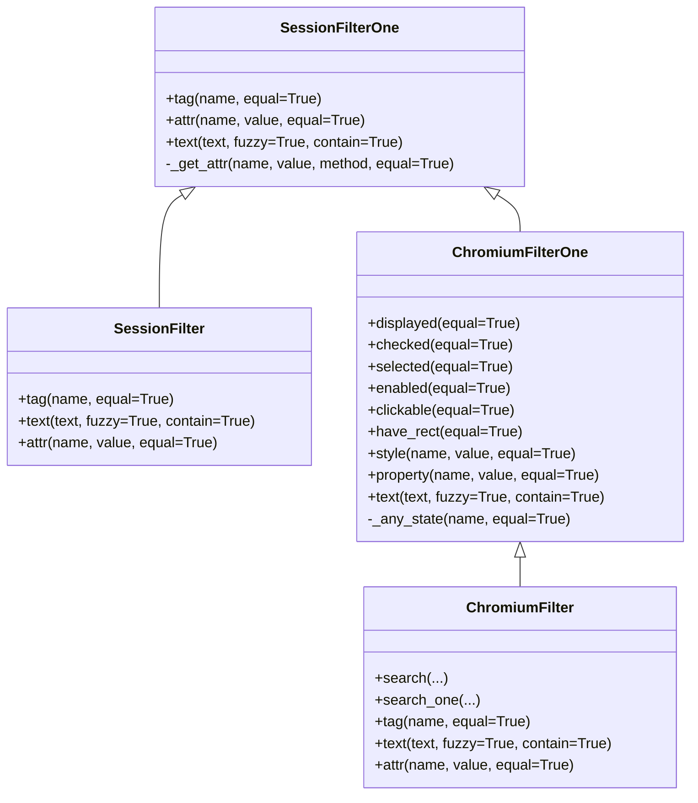
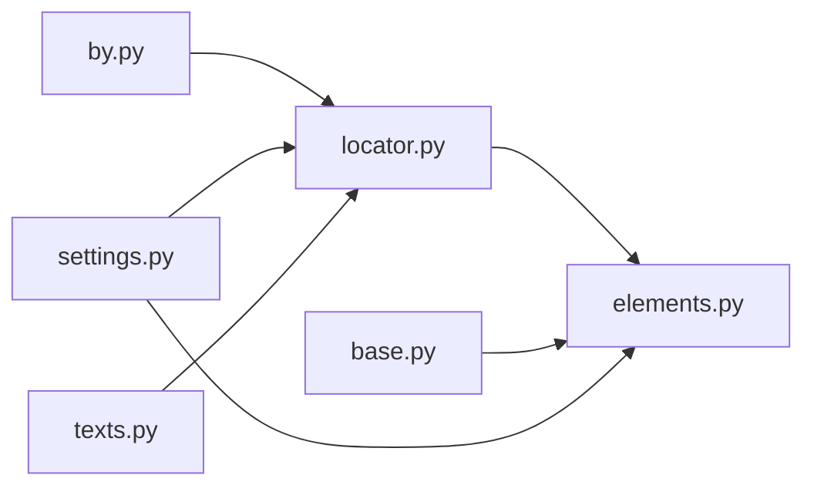

# 文本匹配策略

<cite>
**本文引用的文件**
- [locator.py](file://DrissionPage/_functions/locator.py)
- [elements.py](file://DrissionPage/_functions/elements.py)
- [by.py](file://DrissionPage/_functions/by.py)
- [base.py](file://DrissionPage/_base/base.py)
- [settings.py](file://DrissionPage/_functions/settings.py)
- [texts.py](file://DrissionPage/_functions/texts.py)
</cite>

## 目录
1. [简介](#简介)
2. [项目结构](#项目结构)
3. [核心组件](#核心组件)
4. [架构总览](#架构总览)
5. [详细组件分析](#详细组件分析)
6. [依赖关系分析](#依赖关系分析)
7. [性能考量](#性能考量)
8. [故障排查指南](#故障排查指南)
9. [结论](#结论)
10. [附录](#附录)

## 简介
本文围绕 DrissionPage 的“文本匹配定位策略”展开，系统讲解如何通过多种匹配模式（精确、模糊、前缀、后缀）实现对页面元素的精准定位，并对比文本定位与属性定位的差异与协同使用方法。文中结合源码实现细节，给出语法规范、使用场景、性能建议与最佳实践，帮助读者在复杂页面结构中高效、稳定地完成自动化任务。

## 项目结构
与文本匹配相关的关键模块集中在以下文件：
- 定位器与表达式解析：locator.py
- 元素过滤与文本匹配：elements.py
- 定位类型常量：by.py
- 页面基础能力（文本读取等）：base.py
- 设置与语言本地化：settings.py、texts.py

图表来源
- [locator.py:15-579](file://DrissionPage/_functions/locator.py#L15-L579)
- [elements.py:1-461](file://DrissionPage/_functions/elements.py#L1-L461)
- [by.py:10-19](file://DrissionPage/_functions/by.py#L10-L19)
- [base.py:140-339](file://DrissionPage/_base/base.py#L140-L339)
- [settings.py:13-69](file://DrissionPage/_functions/settings.py#L13-L69)
- [texts.py:13-405](file://DrissionPage/_functions/texts.py#L13-L405)

章节来源
- [locator.py:15-579](file://DrissionPage/_functions/locator.py#L15-L579)
- [elements.py:1-461](file://DrissionPage/_functions/elements.py#L1-L461)
- [by.py:10-19](file://DrissionPage/_functions/by.py#L10-L19)
- [base.py:140-339](file://DrissionPage/_base/base.py#L140-L339)
- [settings.py:13-69](file://DrissionPage/_functions/settings.py#L13-L69)
- [texts.py:13-405](file://DrissionPage/_functions/texts.py#L13-L405)

## 核心组件
- 定位表达式解析器：负责将字符串定位表达式解析为内部统一的数据结构，支持多属性与文本匹配。
- 元素过滤器：在已有元素集合上按文本、属性、状态等条件进行筛选，支持模糊/精确、包含/不包含等组合。
- 定位类型常量：提供标准定位类型（如 XPath、CSS 等），用于跨模块统一约定。
- 页面基础能力：提供文本读取、父子兄弟节点遍历等基础能力，辅助文本匹配的上下文理解。
- 设置与本地化：控制行为开关、超时、语言等，间接影响文本匹配的体验与报错信息。

章节来源
- [locator.py:15-579](file://DrissionPage/_functions/locator.py#L15-L579)
- [elements.py:64-260](file://DrissionPage/_functions/elements.py#L64-L260)
- [by.py:10-19](file://DrissionPage/_functions/by.py#L10-L19)
- [base.py:140-339](file://DrissionPage/_base/base.py#L140-L339)
- [settings.py:13-69](file://DrissionPage/_functions/settings.py#L13-L69)

## 架构总览
文本匹配在 DrissionPage 中的调用链路如下：
- 字符串定位表达式进入解析器，根据前缀判断匹配模式（text=、text:、text^、text$ 或模糊匹配），生成内部结构。
- 若需要生成 XPath/CSS，解析器会将内部结构转换为对应的 XPath/CSS 表达式。
- 在元素集合上进行过滤时，过滤器会遍历元素的原始文本，按模糊/精确、包含/不包含规则筛选。

图表来源
- [locator.py:15-579](file://DrissionPage/_functions/locator.py#L15-L579)
- [elements.py:64-260](file://DrissionPage/_functions/elements.py#L64-L260)
- [base.py:140-339](file://DrissionPage/_base/base.py#L140-L339)

## 详细组件分析

### 定位表达式解析与文本匹配模式
- 支持的文本匹配前缀与符号
  - 精确匹配：text=
  - 模糊匹配：text:
  - 前缀匹配：text^
  - 后缀匹配：text$
- 解析逻辑要点
  - 首次遇到 text=、text:、text^、text$ 时，解析为 text() 函数的精确/模糊/前缀/后缀匹配。
  - 若未指定前缀，则默认进行模糊匹配（contains）。
  - 支持与多属性组合（如 tag:div@id=xxx），解析器会将 tag 与文本条件合并为 AND/OR 条件。
- XPath 生成规则
  - text=：生成精确相等的 XPath。
  - text:：生成 contains 的 XPath。
  - text^：生成 starts-with 的 XPath。
  - text$：生成 substring 结合相等的 XPath。
- CSS 转换
  - 当文本匹配出现在 CSS 场景时，解析器会退化为 XPath（因为 CSS 无法直接表达文本匹配）。

图表来源
- [locator.py:44-49](file://DrissionPage/_functions/locator.py#L44-L49)
- [locator.py:169-195](file://DrissionPage/_functions/locator.py#L169-L195)
- [locator.py:238-298](file://DrissionPage/_functions/locator.py#L238-L298)
- [locator.py:301-374](file://DrissionPage/_functions/locator.py#L301-L374)
- [locator.py:397-442](file://DrissionPage/_functions/locator.py#L397-L442)

章节来源
- [locator.py:44-49](file://DrissionPage/_functions/locator.py#L44-L49)
- [locator.py:169-195](file://DrissionPage/_functions/locator.py#L169-L195)
- [locator.py:238-298](file://DrissionPage/_functions/locator.py#L238-L298)
- [locator.py:301-374](file://DrissionPage/_functions/locator.py#L301-L374)
- [locator.py:397-442](file://DrissionPage/_functions/locator.py#L397-L442)

### 元素过滤与文本匹配
- 过滤接口
  - text(text, fuzzy=True, contain=True)：在元素集合上按文本进行过滤。
  - 支持模糊/精确、包含/不包含的组合，返回第一个匹配元素或 NoneElement。
- 实现要点
  - 对于字符串节点与元素节点分别处理 raw_text。
  - 支持 contain=False 实现“不包含”的反向匹配。
  - 返回 NoneElement 时携带参数，便于后续调试与重试。

图表来源
- [elements.py:64-128](file://DrissionPage/_functions/elements.py#L64-L128)
- [elements.py:130-160](file://DrissionPage/_functions/elements.py#L130-L160)
- [elements.py:163-260](file://DrissionPage/_functions/elements.py#L163-L260)

章节来源
- [elements.py:64-128](file://DrissionPage/_functions/elements.py#L64-L128)
- [elements.py:130-160](file://DrissionPage/_functions/elements.py#L130-L160)
- [elements.py:163-260](file://DrissionPage/_functions/elements.py#L163-L260)

### 文本定位与属性定位的区别与联系
- 区别
  - 文本定位：基于元素可见文本或节点文本进行匹配，适合链接文本、按钮文本、段落文本等。
  - 属性定位：基于元素属性（如 id、class、name、href 等）进行匹配，适合唯一标识或结构化定位。
- 联系
  - 可以组合使用：例如 tag:div@text=...、@@tag():div@text=... 等，先按标签/属性缩小范围，再按文本进一步精确。
  - 在解析器中，文本条件与属性条件会被合并为 AND/OR 条件，提升定位稳定性。
- 应用技巧
  - 复杂页面优先使用属性+文本组合，避免仅靠文本导致的重复或误匹配。
  - 对动态内容，优先使用稳定的属性（如 id/class），文本作为补充校验。

章节来源
- [locator.py:29-41](file://DrissionPage/_functions/locator.py#L29-L41)
- [locator.py:54-71](file://DrissionPage/_functions/locator.py#L54-L71)
- [locator.py:301-374](file://DrissionPage/_functions/locator.py#L301-L374)

### 文本匹配示例（语法与场景）
以下示例展示常见文本匹配语法与适用场景（以路径代替具体代码）：
- 精确匹配
  - 语法：text=登录
  - 场景：按钮、链接的完整文本完全一致时使用
  - 参考路径：[locator.py:170-171](file://DrissionPage/_functions/locator.py#L170-L171)
- 模糊匹配
  - 语法：text=首页
  - 场景：页面标题、导航项等包含关键词即可
  - 参考路径：[locator.py:190-191](file://DrissionPage/_functions/locator.py#L190-L191)
- 前缀匹配
  - 语法：text^http://
  - 场景：链接前缀判断（如外部链接）
  - 参考路径：[locator.py:174-175](file://DrissionPage/_functions/locator.py#L174-L175)
- 后缀匹配
  - 语法：text$.pdf
  - 场景：文件后缀判断（如下载链接）
  - 参考路径：[locator.py:177-178](file://DrissionPage/_functions/locator.py#L177-L178)
- 组合使用（属性+文本）
  - 语法：tag:a@text=点击这里
  - 场景：在特定标签内匹配特定文本
  - 参考路径：[locator.py:29-41](file://DrissionPage/_functions/locator.py#L29-L41)

章节来源
- [locator.py:170-171](file://DrissionPage/_functions/locator.py#L170-L171)
- [locator.py:190-191](file://DrissionPage/_functions/locator.py#L190-L191)
- [locator.py:174-175](file://DrissionPage/_functions/locator.py#L174-L175)
- [locator.py:177-178](file://DrissionPage/_functions/locator.py#L177-L178)
- [locator.py:29-41](file://DrissionPage/_functions/locator.py#L29-L41)

### 文本匹配的性能考量与最佳实践
- 性能考量
  - 模糊匹配（contains）通常比精确匹配更慢，建议在必要时使用精确匹配或前/后缀匹配缩小范围。
  - 组合属性+文本可显著减少扫描范围，提高命中速度。
  - 在元素集合上进行过滤时，尽量先用属性过滤，再用文本过滤。
- 最佳实践
  - 优先使用稳定属性（id/class）+文本组合，避免仅依赖文本。
  - 对动态文本，建议使用 starts-with/ends-with 精确限定范围。
  - 使用索引参数（如 filter().text(..., index=n)）快速定位第 n 个匹配项。
  - 对大页面或长列表，配合等待策略与超时控制，避免长时间阻塞。

章节来源
- [elements.py:93-110](file://DrissionPage/_functions/elements.py#L93-L110)
- [elements.py:366-383](file://DrissionPage/_functions/elements.py#L366-L383)
- [settings.py:13-69](file://DrissionPage/_functions/settings.py#L13-L69)

## 依赖关系分析
- 模块耦合
  - locator.py 与 by.py：通过常量统一定位类型，确保解析与生成的一致性。
  - elements.py 依赖 locator.py 的解析能力，用于在元素集合上进行文本过滤。
  - base.py 提供文本读取能力（raw_text/text），为过滤器提供文本来源。
  - settings.py 与 texts.py 为全局设置与本地化提供支撑，间接影响错误提示与行为。
- 外部依赖
  - CSS 转 XPath 时使用 lxml.cssselect（在特定转换路径中）。

图表来源
- [by.py:10-19](file://DrissionPage/_functions/by.py#L10-L19)
- [locator.py:10-12](file://DrissionPage/_functions/locator.py#L10-L12)
- [elements.py:10-13](file://DrissionPage/_functions/elements.py#L10-L13)
- [base.py:140-339](file://DrissionPage/_base/base.py#L140-L339)
- [settings.py:13-69](file://DrissionPage/_functions/settings.py#L13-L69)
- [texts.py:13-405](file://DrissionPage/_functions/texts.py#L13-L405)

章节来源
- [by.py:10-19](file://DrissionPage/_functions/by.py#L10-L19)
- [locator.py:10-12](file://DrissionPage/_functions/locator.py#L10-L12)
- [elements.py:10-13](file://DrissionPage/_functions/elements.py#L10-L13)
- [base.py:140-339](file://DrissionPage/_base/base.py#L140-L339)
- [settings.py:13-69](file://DrissionPage/_functions/settings.py#L13-L69)
- [texts.py:13-405](file://DrissionPage/_functions/texts.py#L13-L405)

## 性能考量
- 文本匹配成本
  - 精确匹配：O(n) 扫描，代价较低。
  - 模糊匹配（contains）：对每个元素进行字符串包含判断，代价中等。
  - 前/后缀匹配：利用 XPath 内置函数，通常优于纯字符串包含。
- 优化建议
  - 尽量使用属性先行过滤，减少待匹配元素数量。
  - 对高频场景，缓存解析后的 XPath/CSS，避免重复生成。
  - 控制等待时间与超时，避免长时间阻塞。

[本节为通用性能讨论，无需列出具体文件来源]

## 故障排查指南
- 常见问题与定位
  - 定位符格式不正确：检查前缀与符号是否符合规范（=/:/^/$）。
  - 多符号冲突：@@ 与 @| 不能同时出现在同一定位表达式中。
  - CSS 不支持文本匹配：当文本匹配出现在 CSS 场景时，解析器会退化为 XPath。
  - 未找到元素：结合 filter().text(...) 的返回值（NoneElement）进行重试或调整匹配条件。
- 相关错误信息与本地化
  - 错误文本由本地化模块提供，便于在不同语言环境下阅读。

章节来源
- [locator.py:61-62](file://DrissionPage/_functions/locator.py#L61-L62)
- [locator.py:190-191](file://DrissionPage/_functions/locator.py#L190-L191)
- [texts.py:13-405](file://DrissionPage/_functions/texts.py#L13-L405)

## 结论
DrissionPage 的文本匹配策略通过统一的定位表达式解析与灵活的过滤机制，实现了对页面文本的精确、模糊、前缀与后缀匹配。结合属性定位与组合策略，可在复杂页面结构中实现高精度、高性能的元素定位。建议在实际使用中优先采用属性+文本组合，并根据场景选择合适的匹配模式与等待策略，以获得最佳的稳定性与性能表现。

[本节为总结性内容，无需列出具体文件来源]

## 附录
- 关键路径参考
  - 定位表达式解析与 XPath 生成：[locator.py:15-579](file://DrissionPage/_functions/locator.py#L15-L579)
  - 元素过滤与文本匹配：[elements.py:64-260](file://DrissionPage/_functions/elements.py#L64-L260)
  - 页面文本读取能力：[base.py:140-339](file://DrissionPage/_base/base.py#L140-L339)
  - 定位类型常量：[by.py:10-19](file://DrissionPage/_functions/by.py#L10-L19)
  - 设置与本地化：[settings.py:13-69](file://DrissionPage/_functions/settings.py#L13-L69)、[texts.py:13-405](file://DrissionPage/_functions/texts.py#L13-L405)