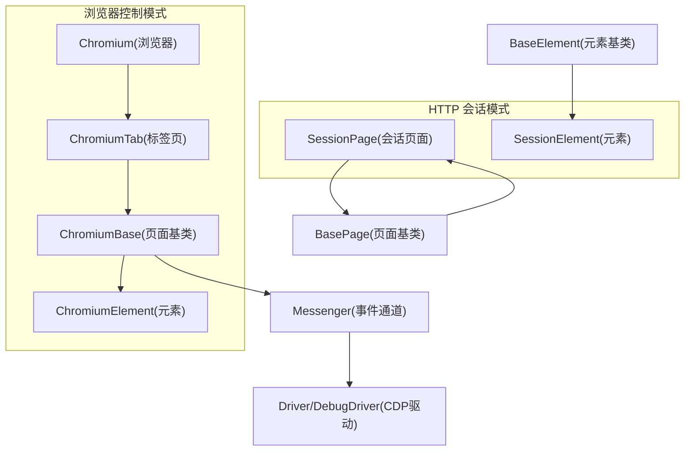
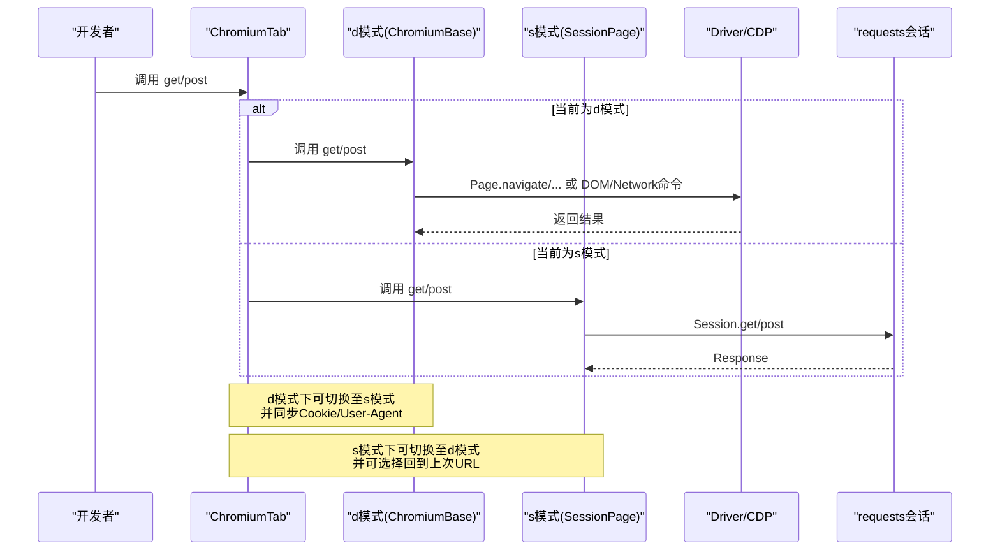
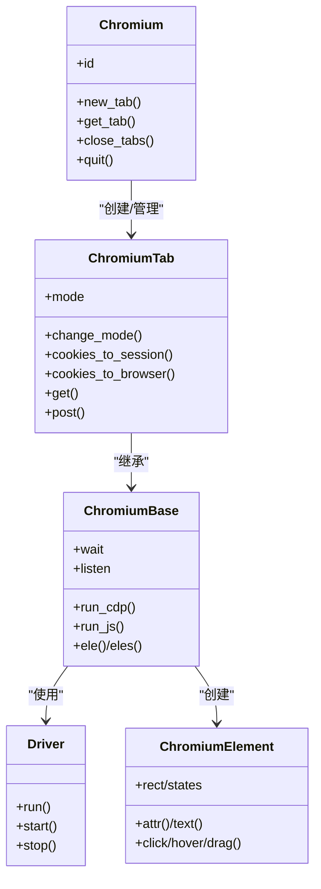
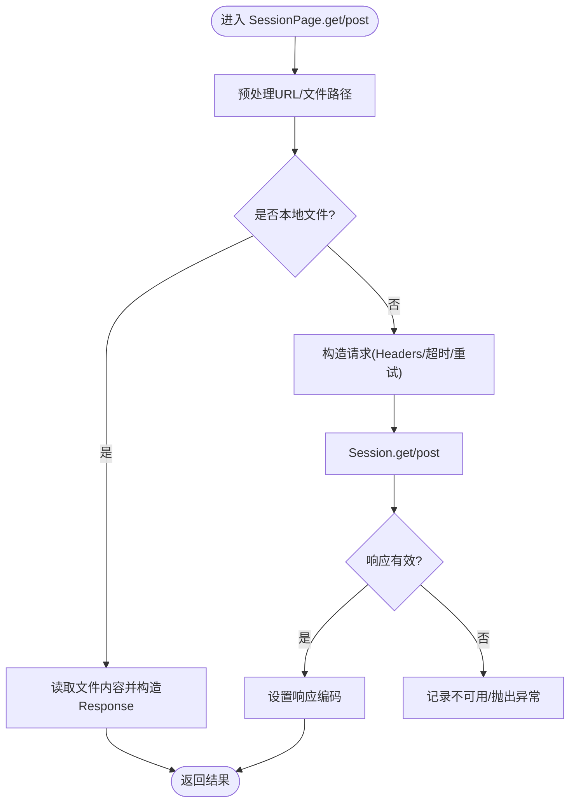
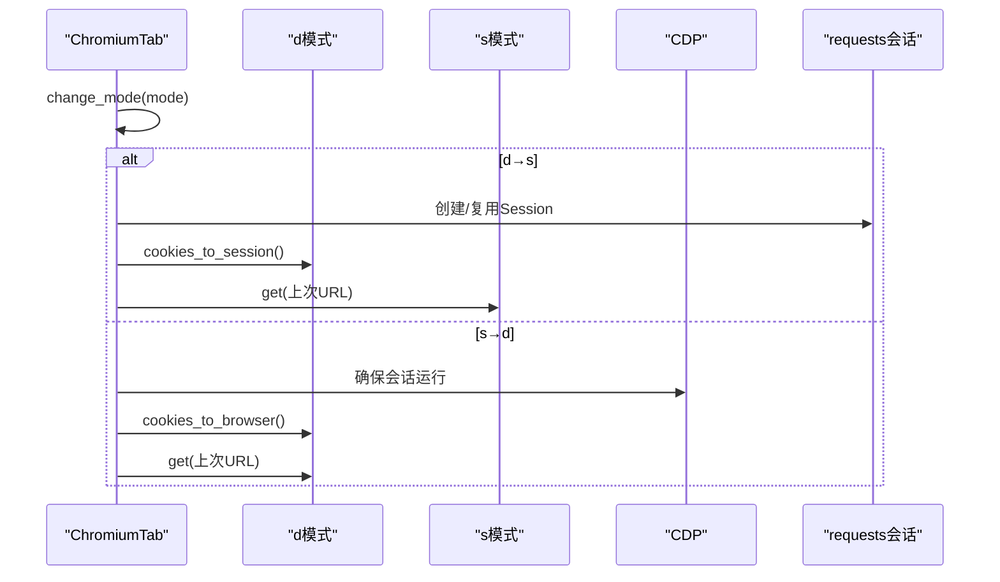
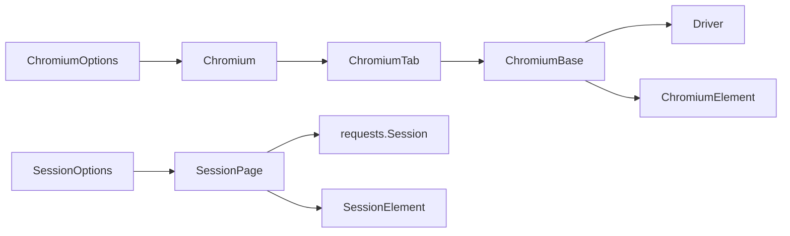

# 双模式架构

<cite>
**本文引用的文件**
- [__init__.py](file://DrissionPage/__init__.py)
- [chromium_page.py](file://DrissionPage/_pages/chromium_page.py)
- [chromium_tab.py](file://DrissionPage/_pages/chromium_tab.py)
- [chromium_base.py](file://DrissionPage/_pages/chromium_base.py)
- [session_page.py](file://DrissionPage/_pages/session_page.py)
- [base.py](file://DrissionPage/_base/base.py)
- [driver.py](file://DrissionPage/_base/driver.py)
- [chromium.py](file://DrissionPage/_browsers/chromium.py)
- [chromium_options.py](file://DrissionPage/_configs/chromium_options.py)
- [session_options.py](file://DrissionPage/_configs/session_options.py)
- [chromium_element.py](file://DrissionPage/_elements/chromium_element.py)
- [session_element.py](file://DrissionPage/_elements/session_element.py)
- [common.py](file://DrissionPage/common.py)
</cite>

## 目录
1. [引言](#引言)
2. [项目结构](#项目结构)
3. [核心组件](#核心组件)
4. [架构总览](#架构总览)
5. [详细组件分析](#详细组件分析)
6. [依赖分析](#依赖分析)
7. [性能考量](#性能考量)
8. [故障排查指南](#故障排查指南)
9. [结论](#结论)
10. [附录：使用示例与切换机制](#附录使用示例与切换机制)

## 引言
本文件系统性解析 DrissionPage 的“双模式架构”：浏览器控制模式（ChromiumPage/ChromiumTab/ChromiumBase）与 HTTP 会话模式（SessionPage）。文档聚焦以下目标：
- 解释两种模式的工作原理、数据流、API 设计与性能特征
- 对比传统 WebDriver 方案，阐明基于 CDP 协议的创新点
- 提供模式切换机制与典型应用场景，帮助开发者做出正确选型

## 项目结构
DrissionPage 将“浏览器控制”与“HTTP 会话”两类能力抽象为两个并行的页面类族，并通过统一的基类与工具模块协同工作：
- 浏览器控制模式：Chromium（浏览器实例）→ ChromiumTab（标签页）→ ChromiumBase（页面基类）
- HTTP 会话模式：SessionPage（会话页面）
- 统一基类与混入：BasePage、BaseElement、Messenger（CDP 消息通道）
- 底层驱动：Driver/DebugDriver（WebSocket CDP 客户端）
- 配置：ChromiumOptions、SessionOptions
- 元素适配：ChromiumElement、SessionElement

图表来源
- [chromium.py:33-120](file://DrissionPage/_browsers/chromium.py#L33-L120)
- [chromium_tab.py:22-47](file://DrissionPage/_pages/chromium_tab.py#L22-L47)
- [chromium_base.py:39-90](file://DrissionPage/_pages/chromium_base.py#L39-L90)
- [chromium_element.py:38-80](file://DrissionPage/_elements/chromium_element.py#L38-L80)
- [session_page.py:25-40](file://DrissionPage/_pages/session_page.py#L25-L40)
- [session_element.py:23-40](file://DrissionPage/_elements/session_element.py#L23-L40)
- [base.py:270-370](file://DrissionPage/_base/base.py#L270-L370)
- [driver.py:24-50](file://DrissionPage/_base/driver.py#L24-L50)

章节来源
- [__init__.py:22-28](file://DrissionPage/__init__.py#L22-L28)
- [chromium.py:33-120](file://DrissionPage/_browsers/chromium.py#L33-L120)
- [chromium_tab.py:22-47](file://DrissionPage/_pages/chromium_tab.py#L22-L47)
- [chromium_base.py:39-90](file://DrissionPage/_pages/chromium_base.py#L39-L90)
- [session_page.py:25-40](file://DrissionPage/_pages/session_page.py#L25-L40)
- [base.py:270-370](file://DrissionPage/_base/base.py#L270-L370)
- [driver.py:24-50](file://DrissionPage/_base/driver.py#L24-L50)

## 核心组件
- Chromium（浏览器）：管理 CDP 会话、标签页集合、上下文、下载等；负责创建/附加 Target 并维护 Tabs 映射。
- ChromiumTab：单标签页视图，支持 d/s 模式切换、Cookie 双向同步、URL 切换等。
- ChromiumBase：页面级能力（CDP 命令、事件监听、等待、JS 执行、元素查找等）。
- SessionPage：基于 requests 的 HTTP 会话封装，提供 get/post、响应读取、编码处理、重试等。
- BasePage/BaseElement/Messenger：统一的页面/元素接口与 CDP 事件通道。
- Driver/DebugDriver：WebSocket CDP 客户端，负责消息发送、接收、结果队列与错误处理。

章节来源
- [chromium.py:33-120](file://DrissionPage/_browsers/chromium.py#L33-L120)
- [chromium_tab.py:22-47](file://DrissionPage/_pages/chromium_tab.py#L22-L47)
- [chromium_base.py:39-90](file://DrissionPage/_pages/chromium_base.py#L39-L90)
- [session_page.py:25-40](file://DrissionPage/_pages/session_page.py#L25-L40)
- [base.py:270-370](file://DrissionPage/_base/base.py#L270-L370)
- [driver.py:24-50](file://DrissionPage/_base/driver.py#L24-L50)

## 架构总览
DrissionPage 的双模式并非“互斥”，而是“互补”：
- 浏览器控制模式：通过 CDP 直接操作浏览器，具备 DOM/JS/网络/存储等全能力，适合复杂交互与可视化任务。
- HTTP 会话模式：通过 requests 发起 HTTP 请求，适合快速抓取、API 调用、轻量数据获取。
- 两者可通过 ChromiumTab 的 change_mode 实现无缝切换，同时保持 Cookie、User-Agent 等状态一致。

图表来源
- [chromium_tab.py:124-142](file://DrissionPage/_pages/chromium_tab.py#L124-L142)
- [chromium_base.py:403-407](file://DrissionPage/_pages/chromium_base.py#L403-L407)
- [session_page.py:104-134](file://DrissionPage/_pages/session_page.py#L104-L134)
- [driver.py:102-118](file://DrissionPage/_base/driver.py#L102-L118)

## 详细组件分析

### 浏览器控制模式（ChromiumPage/ChromiumTab/ChromiumBase）
- 角色与职责
  - Chromium：启动/连接浏览器，管理 Target/Session 映射，暴露标签页管理与全局设置。
  - ChromiumTab：单标签页视图，提供 d/s 模式切换、URL/标题/HTML/JSON 等属性、元素查找、等待、动作等。
  - ChromiumBase：封装 CDP 命令与事件监听，提供 DOM 查询、JS 执行、等待策略、截图、缓存清理等。
- 数据流
  - 页面导航：ChromiumBase 调用 CDP Page.navigate，监听 Page.* 事件推进 ready_state。
  - 元素查找：DOM.performSearch → DOM.getSearchResults → make_chromium_eles。
  - JS 执行：通过 Runtime.evaluate/ callFunctionOn，支持表达式与异步脚本。
- 关键特性
  - 事件驱动：Messenger 统一接收 CDP 事件，分发到对应回调（如 alert、导航、加载）。
  - 等待模型：基于 ready_state 与超时配置，支持 eager/none 模式。
  - 状态同步：与 SessionPage 的 Cookie/User-Agent 同步，保证切换一致性。

图表来源
- [chromium.py:235-320](file://DrissionPage/_browsers/chromium.py#L235-L320)
- [chromium_tab.py:156-194](file://DrissionPage/_pages/chromium_tab.py#L156-L194)
- [chromium_base.py:376-401](file://DrissionPage/_pages/chromium_base.py#L376-L401)
- [driver.py:102-118](file://DrissionPage/_base/driver.py#L102-L118)
- [chromium_element.py:38-80](file://DrissionPage/_elements/chromium_element.py#L38-L80)

章节来源
- [chromium.py:33-120](file://DrissionPage/_browsers/chromium.py#L33-L120)
- [chromium_tab.py:22-47](file://DrissionPage/_pages/chromium_tab.py#L22-L47)
- [chromium_base.py:39-90](file://DrissionPage/_pages/chromium_base.py#L39-L90)
- [chromium_element.py:38-80](file://DrissionPage/_elements/chromium_element.py#L38-L80)
- [driver.py:24-50](file://DrissionPage/_base/driver.py#L24-L50)

### HTTP 会话模式（SessionPage）
- 角色与职责
  - SessionPage：封装 requests.Session，提供 get/post、响应读取、编码推断、重试与超时控制。
  - SessionElement：基于 lxml 的 HTML 解析与元素定位，支持 xpath/css 定位与相对路径查找。
- 数据流
  - 请求发起：Session.get/post → 自动设置 Host/Referer/超时 → 处理响应编码 → 返回 Response。
  - 元素查找：fromstring(html) → lxml.cssselect/xpath → 包装为 SessionElement。
- 关键特性
  - 编码处理：优先从 Content-Type，其次 meta charset，最后 apparent_encoding。
  - 重试机制：可配置重试次数与间隔，失败时可抛出异常或返回 None。
  - 下载集成：通过 DrissionGet 与下载路径配置，支持保存资源。

图表来源
- [session_page.py:180-265](file://DrissionPage/_pages/session_page.py#L180-L265)
- [session_page.py:272-293](file://DrissionPage/_pages/session_page.py#L272-L293)

章节来源
- [session_page.py:25-40](file://DrissionPage/_pages/session_page.py#L25-L40)
- [session_page.py:104-134](file://DrissionPage/_pages/session_page.py#L104-L134)
- [session_page.py:180-265](file://DrissionPage/_pages/session_page.py#L180-L265)
- [session_page.py:272-293](file://DrissionPage/_pages/session_page.py#L272-L293)
- [session_element.py:169-301](file://DrissionPage/_elements/session_element.py#L169-L301)

### 模式切换机制（ChromiumTab.change_mode）
- 切换逻辑
  - d→s：创建/复用 Session，同步 Cookie 与 UA，可选择是否访问当前 d 模式的 URL。
  - s→d：确保 CDP 会话运行，同步 Cookie，可选择是否导航到上次的 s 模式 URL。
- 状态保持
  - cookies_to_session / cookies_to_browser：双向同步 Cookie。
  - 用户代理：s→d 时复制 UA，避免指纹变化。

图表来源
- [chromium_tab.py:156-194](file://DrissionPage/_pages/chromium_tab.py#L156-L194)

章节来源
- [chromium_tab.py:156-194](file://DrissionPage/_pages/chromium_tab.py#L156-L194)

### 统一基类与元素体系
- BasePage：定义页面通用属性（title/url/html/json/response）、连接前处理、会话创建与下载器。
- BaseElement/DrissionElement：定义元素通用接口（attr/text/parent/兄弟/相对定位等），并提供错误处理与超时策略。
- Messenger：统一 CDP 事件接收、队列与回调注册，支持即时事件与延迟事件处理。

章节来源
- [base.py:270-370](file://DrissionPage/_base/base.py#L270-L370)
- [base.py:29-68](file://DrissionPage/_base/base.py#L29-L68)
- [base.py:373-434](file://DrissionPage/_base/base.py#L373-L434)

## 依赖分析
- 组件耦合
  - Chromium 与 ChromiumTab：强耦合（Tab 由 Chromium 创建/管理），通过 Tabs 映射维持 Target/Session 关系。
  - ChromiumBase 与 Driver：紧密耦合（CDP 命令经 Driver 发送），Messenger 作为桥接。
  - SessionPage 与 SessionOptions：强耦合（SessionOptions 决定默认头/代理/超时/重试）。
- 外部依赖
  - requests：HTTP 会话与下载。
  - lxml：HTML 解析与定位。
  - websocket：CDP WebSocket 通信。
- 循环依赖
  - 未发现直接循环导入；ChromiumTab 同时继承自 ChromiumBase 与 SessionPage，形成“多重继承 + 混合模式”的设计，通过方法委托避免循环。

图表来源
- [chromium_options.py:16-85](file://DrissionPage/_configs/chromium_options.py#L16-L85)
- [session_options.py:20-88](file://DrissionPage/_configs/session_options.py#L20-L88)
- [chromium.py:33-120](file://DrissionPage/_browsers/chromium.py#L33-L120)
- [chromium_tab.py:22-47](file://DrissionPage/_pages/chromium_tab.py#L22-L47)
- [chromium_base.py:39-90](file://DrissionPage/_pages/chromium_base.py#L39-L90)
- [driver.py:24-50](file://DrissionPage/_base/driver.py#L24-L50)
- [session_page.py:25-40](file://DrissionPage/_pages/session_page.py#L25-L40)
- [chromium_element.py:38-80](file://DrissionPage/_elements/chromium_element.py#L38-L80)
- [session_element.py:23-40](file://DrissionPage/_elements/session_element.py#L23-L40)

章节来源
- [chromium_options.py:16-85](file://DrissionPage/_configs/chromium_options.py#L16-L85)
- [session_options.py:20-88](file://DrissionPage/_configs/session_options.py#L20-L88)
- [chromium.py:33-120](file://DrissionPage/_browsers/chromium.py#L33-L120)
- [chromium_tab.py:22-47](file://DrissionPage/_pages/chromium_tab.py#L22-L47)
- [chromium_base.py:39-90](file://DrissionPage/_pages/chromium_base.py#L39-L90)
- [driver.py:24-50](file://DrissionPage/_base/driver.py#L24-L50)
- [session_page.py:25-40](file://DrissionPage/_pages/session_page.py#L25-L40)
- [chromium_element.py:38-80](file://DrissionPage/_elements/chromium_element.py#L38-L80)
- [session_element.py:23-40](file://DrissionPage/_elements/session_element.py#L23-L40)

## 性能考量
- 浏览器控制模式
  - 优点：可直接操作 DOM/JS/网络，适合复杂交互与可视化任务。
  - 成本：进程/内存占用高，CDP 事件处理与等待策略影响吞吐。
  - 优化：合理设置 load_mode（normal/eager/none），减少不必要的等待；利用异步 JS 与事件过滤。
- HTTP 会话模式
  - 优点：轻量、快速、可控，适合批量抓取与 API 调用。
  - 成本：无法执行 JS，部分动态渲染内容需额外处理。
  - 优化：合理设置超时与重试，启用连接池与合适的并发；对大响应启用流式下载。
- 切换成本
  - d→s：主要为 Cookie/UA 同步，开销较低。
  - s→d：需重建 CDP 会话与文档树，有一定延迟，建议在必要时才切换。

## 故障排查指南
- CDP 连接问题
  - 现象：Driver 抛出连接断开/超时/握手 403。
  - 处理：检查地址/端口、浏览器版本、调试端口是否被占用；必要时重启浏览器或更换端口。
- 页面加载超时
  - 现象：ready_state 未达 complete，等待超时。
  - 处理：调整 load_mode 与超时；对特定页面使用 stop_loading 或 eager 模式。
- 元素定位失败
  - 现象：定位符无效或返回 NoneElement。
  - 处理：确认定位符格式；在 d 模式下等待文档加载；在 s 模式下检查 HTML 是否完整。
- 会话编码问题
  - 现象：中文乱码或解析异常。
  - 处理：检查 Content-Type 与 meta charset；必要时手动设置 encoding。

章节来源
- [driver.py:120-138](file://DrissionPage/_base/driver.py#L120-L138)
- [chromium_base.py:745-761](file://DrissionPage/_pages/chromium_base.py#L745-L761)
- [session_page.py:272-293](file://DrissionPage/_pages/session_page.py#L272-L293)
- [base.py:356-370](file://DrissionPage/_base/base.py#L356-L370)

## 结论
DrissionPage 的双模式架构以“统一接口 + 分层能力”为核心思想：
- 浏览器控制模式提供强大的 DOM/JS/网络能力，适合复杂交互与可视化任务；
- HTTP 会话模式提供高效、可控的抓取能力，适合批量与 API 场景；
- 通过 ChromiumTab 的无缝切换与状态同步，开发者可在两种模式间灵活权衡性能与功能。

## 附录：使用示例与切换机制
以下示例展示两种模式的基本用法与切换流程（请参考相应文件路径以获取具体实现）：

- 创建浏览器控制模式页面
  - 使用 ChromiumOptions 配置浏览器参数，然后创建 ChromiumPage。
  - 示例路径：[chromium_page.py:17-40](file://DrissionPage/_pages/chromium_page.py#L17-L40)，[chromium_options.py:16-85](file://DrissionPage/_configs/chromium_options.py#L16-L85)

- 在浏览器控制模式下导航与元素操作
  - 使用 get/post 导航，通过 ele()/eles() 查找元素，执行 JS 或等待事件。
  - 示例路径：[chromium_base.py:403-407](file://DrissionPage/_pages/chromium_base.py#L403-L407)，[chromium_element.py:419-435](file://DrissionPage/_elements/chromium_element.py#L419-L435)

- 创建 HTTP 会话模式页面
  - 使用 SessionOptions 配置会话参数，创建 SessionPage。
  - 示例路径：[session_page.py:25-40](file://DrissionPage/_pages/session_page.py#L25-L40)，[session_options.py:20-88](file://DrissionPage/_configs/session_options.py#L20-L88)

- 在 HTTP 会话模式下抓取与解析
  - 使用 get/post 获取响应，读取 html/json/raw_data，通过 make_session_ele 定位元素。
  - 示例路径：[session_page.py:104-134](file://DrissionPage/_pages/session_page.py#L104-L134)，[session_element.py:169-301](file://DrissionPage/_elements/session_element.py#L169-L301)

- 在两种模式之间切换
  - 使用 ChromiumTab.change_mode 切换 d/s 模式，可选择同步 Cookie 与 UA，并决定是否回到上次 URL。
  - 示例路径：[chromium_tab.py:156-194](file://DrissionPage/_pages/chromium_tab.py#L156-L194)

- 从其他框架迁移
  - 提供 from_selenium/from_playwright 工具函数，从现有 WebDriver/Playwright 对象提取调试地址并生成 Chromium 实例。
  - 示例路径：[common.py:22-56](file://DrissionPage/common.py#L22-L56)