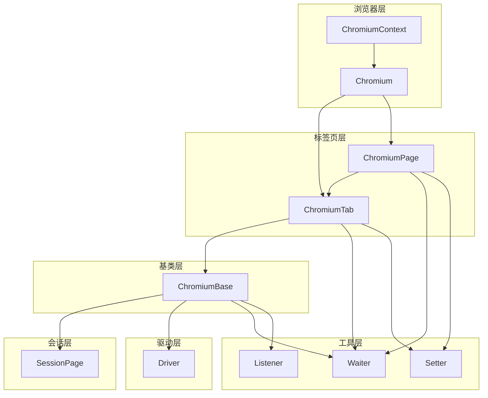
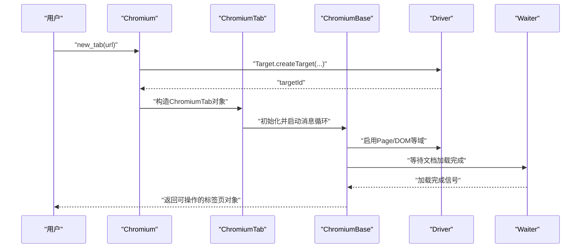
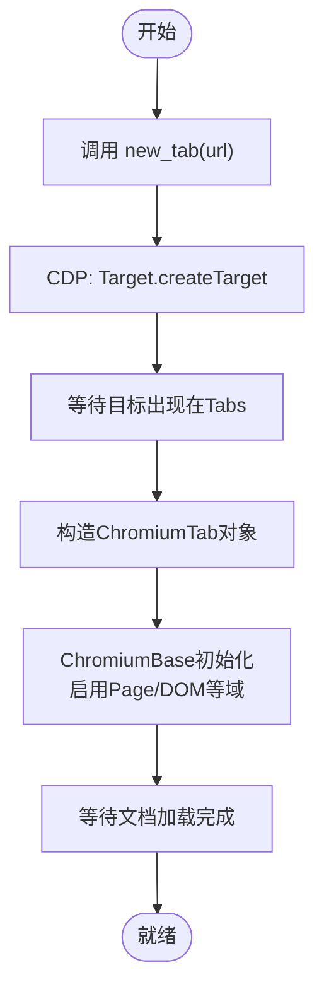
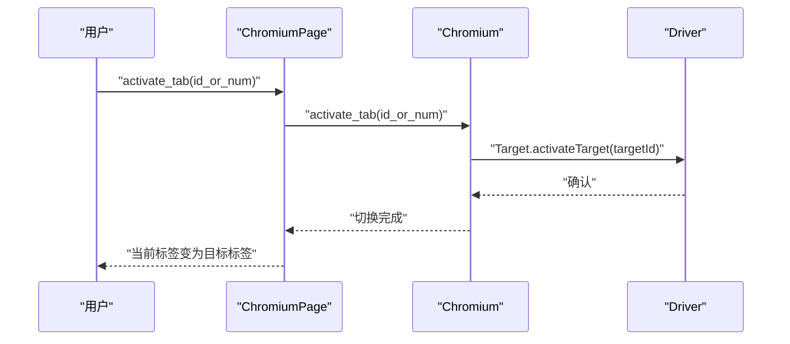
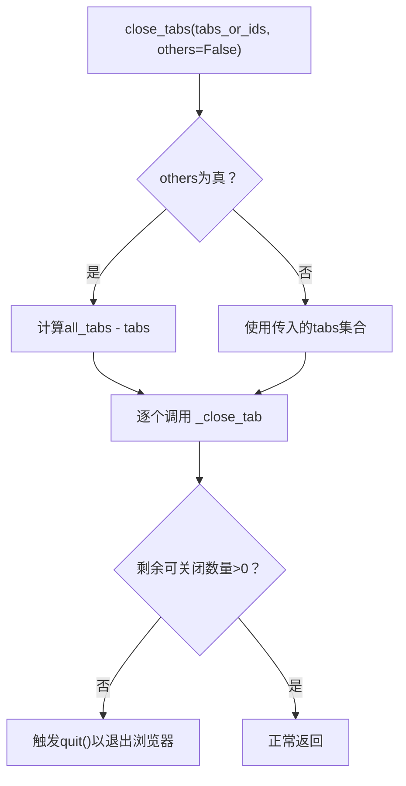
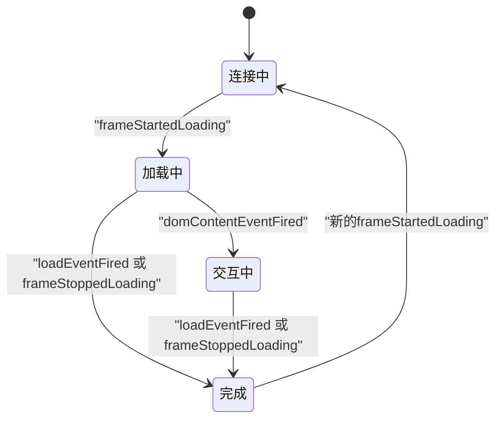
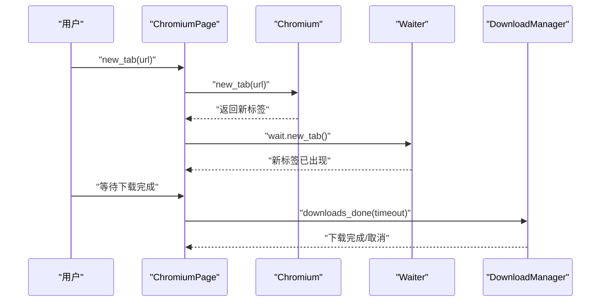
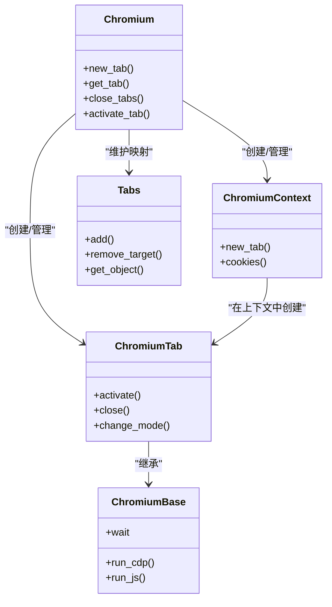
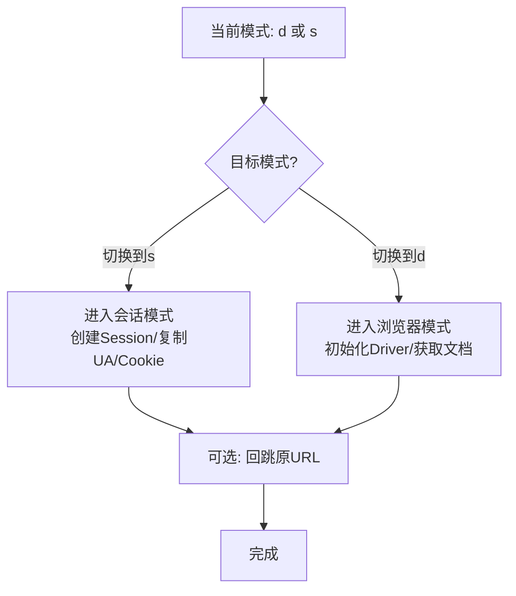
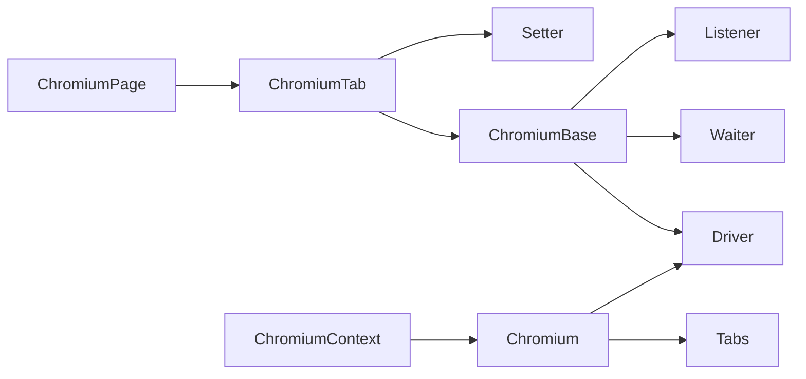

# 标签页管理

<cite>
**本文引用的文件**
- [chromium_tab.py](file://DrissionPage/_pages/chromium_tab.py)
- [chromium_page.py](file://DrissionPage/_pages/chromium_page.py)
- [session_page.py](file://DrissionPage/_pages/session_page.py)
- [chromium_base.py](file://DrissionPage/_pages/chromium_base.py)
- [chromium.py](file://DrissionPage/_browsers/chromium.py)
- [chromium_context.py](file://DrissionPage/_browsers/chromium_context.py)
- [waiter.py](file://DrissionPage/_units/waiter.py)
- [setter.py](file://DrissionPage/_units/setter.py)
- [settings.py](file://DrissionPage/_functions/settings.py)
- [driver.py](file://DrissionPage/_base/driver.py)
- [listener.py](file://DrissionPage/_units/listener.py)
</cite>

## 目录
1. [简介](#简介)
2. [项目结构](#项目结构)
3. [核心组件](#核心组件)
4. [架构总览](#架构总览)
5. [详细组件分析](#详细组件分析)
6. [依赖分析](#依赖分析)
7. [性能考量](#性能考量)
8. [故障排除指南](#故障排除指南)
9. [结论](#结论)
10. [附录](#附录)

## 简介
本篇文档系统性解析 DrissionPage 的标签页管理系统与多标签并发操作机制，覆盖标签页的创建、切换、关闭与监控；阐述状态管理、事件监听与生命周期控制；提供多标签并发处理与同步协调策略；说明标签页隔离与资源共享规则，并给出最佳实践与性能优化建议及常见问题排查方法。

## 项目结构
围绕标签页管理的关键模块组织如下：
- 浏览器层：Chromium、ChromiumContext 统一管理浏览器实例、上下文、标签集合与事件分发
- 标签页层：ChromiumTab、ChromiumPage 提供标签页对象与页面对象能力
- 基类层：ChromiumBase 提供 DevTools 协议交互、事件回调、加载状态等通用能力
- 会话层：SessionPage 提供基于 requests 的会话模式能力
- 工具层：Waiter、Setter、Listener 等提供等待、设置、监听等辅助能力
- 驱动层：Driver 封装 WebSocket 通信与消息收发

图表来源
- [chromium.py:33-127](file://DrissionPage/_browsers/chromium.py#L33-L127)
- [chromium_context.py:7-62](file://DrissionPage/_browsers/chromium_context.py#L7-L62)
- [chromium_tab.py:22-47](file://DrissionPage/_pages/chromium_tab.py#L22-L47)
- [chromium_page.py:17-41](file://DrissionPage/_pages/chromium_page.py#L17-L41)
- [chromium_base.py:39-96](file://DrissionPage/_pages/chromium_base.py#L39-L96)
- [session_page.py:25-36](file://DrissionPage/_pages/session_page.py#L25-L36)
- [waiter.py:15-49](file://DrissionPage/_units/waiter.py#L15-L49)
- [setter.py:21-44](file://DrissionPage/_units/setter.py#L21-L44)
- [listener.py:101-200](file://DrissionPage/_units/listener.py#L101-L200)
- [driver.py:43-79](file://DrissionPage/_base/driver.py#L43-L79)

章节来源
- [chromium.py:33-127](file://DrissionPage/_browsers/chromium.py#L33-L127)
- [chromium_context.py:7-62](file://DrissionPage/_browsers/chromium_context.py#L7-L62)
- [chromium_tab.py:22-47](file://DrissionPage/_pages/chromium_tab.py#L22-L47)
- [chromium_page.py:17-41](file://DrissionPage/_pages/chromium_page.py#L17-L41)
- [chromium_base.py:39-96](file://DrissionPage/_pages/chromium_base.py#L39-L96)
- [session_page.py:25-36](file://DrissionPage/_pages/session_page.py#L25-L36)
- [waiter.py:15-49](file://DrissionPage/_units/waiter.py#L15-L49)
- [setter.py:21-44](file://DrissionPage/_units/setter.py#L21-L44)
- [listener.py:101-200](file://DrissionPage/_units/listener.py#L101-L200)
- [driver.py:43-79](file://DrissionPage/_base/driver.py#L43-L79)

## 核心组件
- Chromium：浏览器进程管理、标签集合、CDP 事件分发、上下文管理、下载管理集成
- ChromiumContext：浏览器上下文封装，支持独立 Cookie、代理、下载策略
- ChromiumTab：单标签页对象，支持 d/s 双模式（浏览器/会话）切换、激活、关闭、保存等
- ChromiumPage：页面对象，聚合 ChromiumTab 并提供多标签页管理入口（新建、切换、关闭）
- ChromiumBase：标签页基类，负责与 DevTools 通信、事件回调、文档加载状态、元素查找等
- SessionPage：会话模式页面，基于 requests 的 HTTP 会话，适合非浏览器场景
- Waiter：等待器，提供标签页等待、下载完成、弹窗关闭、URL/标题变化等等待能力
- Setter：设置器，统一设置超时、下载路径、UA、Cookie、窗口等
- Listener：事件监听器，捕获网络、目标、请求等事件流

章节来源
- [chromium.py:33-127](file://DrissionPage/_browsers/chromium.py#L33-L127)
- [chromium_context.py:7-62](file://DrissionPage/_browsers/chromium_context.py#L7-L62)
- [chromium_tab.py:22-47](file://DrissionPage/_pages/chromium_tab.py#L22-L47)
- [chromium_page.py:17-41](file://DrissionPage/_pages/chromium_page.py#L17-L41)
- [chromium_base.py:39-96](file://DrissionPage/_pages/chromium_base.py#L39-L96)
- [session_page.py:25-36](file://DrissionPage/_pages/session_page.py#L25-L36)
- [waiter.py:15-49](file://DrissionPage/_units/waiter.py#L15-L49)
- [setter.py:21-44](file://DrissionPage/_units/setter.py#L21-L44)
- [listener.py:101-200](file://DrissionPage/_units/listener.py#L101-L200)

## 架构总览
下图展示标签页从创建到事件监控的总体流程，涵盖浏览器、标签页、基类、等待器与驱动之间的交互。

图表来源
- [chromium.py:235-269](file://DrissionPage/_browsers/chromium.py#L235-L269)
- [chromium_tab.py:26-47](file://DrissionPage/_pages/chromium_tab.py#L26-L47)
- [chromium_base.py:103-125](file://DrissionPage/_pages/chromium_base.py#L103-L125)
- [driver.py:43-79](file://DrissionPage/_base/driver.py#L43-L79)
- [waiter.py:164-169](file://DrissionPage/_units/waiter.py#L164-L169)

章节来源
- [chromium.py:235-269](file://DrissionPage/_browsers/chromium.py#L235-L269)
- [chromium_tab.py:26-47](file://DrissionPage/_pages/chromium_tab.py#L26-L47)
- [chromium_base.py:103-125](file://DrissionPage/_pages/chromium_base.py#L103-L125)
- [driver.py:43-79](file://DrissionPage/_base/driver.py#L43-L79)
- [waiter.py:164-169](file://DrissionPage/_units/waiter.py#L164-L169)

## 详细组件分析

### 标签页创建与生命周期
- 创建流程：通过 Chromium.new_tab 或 Chromium._new_tab 发起 Target.createTarget，等待目标出现在 Tabs 列表后构造 ChromiumTab 对象；若非隐藏则阻塞等待直到目标就绪
- 生命周期：ChromiumBase 初始化时启动消息循环，注册 Page/DOM 等域事件；Tabs 维护 session/target/frame/context 映射；销毁时通过 Target.closeTarget 关闭并清理映射

图表来源
- [chromium.py:235-269](file://DrissionPage/_browsers/chromium.py#L235-L269)
- [chromium_tab.py:26-47](file://DrissionPage/_pages/chromium_tab.py#L26-L47)
- [chromium_base.py:103-125](file://DrissionPage/_pages/chromium_base.py#L103-L125)

章节来源
- [chromium.py:235-269](file://DrissionPage/_browsers/chromium.py#L235-L269)
- [chromium_tab.py:26-47](file://DrissionPage/_pages/chromium_tab.py#L26-L47)
- [chromium_base.py:103-125](file://DrissionPage/_pages/chromium_base.py#L103-L125)

### 标签页切换与激活
- 切换方式：ChromiumPage.activate_tab 支持按索引、ID 或对象切换；内部通过 Target.activateTarget 实现
- 最新标签：latest_tab 提供最新打开标签的便捷访问

图表来源
- [chromium_page.py:92-94](file://DrissionPage/_pages/chromium_page.py#L92-L94)
- [chromium.py:306-313](file://DrissionPage/_browsers/chromium.py#L306-L313)

章节来源
- [chromium_page.py:92-94](file://DrissionPage/_pages/chromium_page.py#L92-L94)
- [chromium.py:306-313](file://DrissionPage/_browsers/chromium.py#L306-L313)

### 标签页关闭与批量关闭
- 单个关闭：Chromium._close_tab 调用 Target.closeTarget 并等待从 Tabs 中移除
- 批量关闭：Chromium.close_tabs 支持传入 ID/对象列表或 others=True 关闭除自身外所有标签

图表来源
- [chromium.py:278-298](file://DrissionPage/_browsers/chromium.py#L278-L298)
- [chromium.py:299-305](file://DrissionPage/_browsers/chromium.py#L299-L305)

章节来源
- [chromium.py:278-298](file://DrissionPage/_browsers/chromium.py#L278-L298)
- [chromium.py:299-305](file://DrissionPage/_browsers/chromium.py#L299-L305)

### 标签页状态管理与事件监听
- 加载状态：ChromiumBase 注册 Page.* 事件，维护 ready_state/is_loading/load_mode，并在不同事件中更新状态
- 弹窗处理：自动拦截 Page.javascriptDialogOpening/Closed，支持自动处理或手动接管
- 文档获取：首次导航后通过 DOM.getDocument 获取根节点对象 ID，后续用于元素查询与操作

图表来源
- [chromium_base.py:168-206](file://DrissionPage/_pages/chromium_base.py#L168-L206)
- [chromium_base.py:188-199](file://DrissionPage/_pages/chromium_base.py#L188-L199)

章节来源
- [chromium_base.py:168-206](file://DrissionPage/_pages/chromium_base.py#L168-L206)
- [chromium_base.py:188-199](file://DrissionPage/_pages/chromium_base.py#L188-L199)

### 多标签并发操作与同步协调
- 并发模型：每个标签页拥有独立的 ChromiumBase 会话与事件循环，通过 Tabs 维护 session/target/frame 映射
- 等待机制：Waiter 提供 doc_loaded、url_change、title_change、download_begin/downloads_done 等等待接口
- 新标签等待：BrowserContextWaiter.new_tab 通过比较“最新标签”实现等待新标签打开
- 下载协调：DownloadManager 为每个标签维护下载任务队列，支持按标签等待下载完成

图表来源
- [chromium_page.py:89-96](file://DrissionPage/_pages/chromium_page.py#L89-L96)
- [chromium.py:278-298](file://DrissionPage/_browsers/chromium.py#L278-L298)
- [waiter.py:28-49](file://DrissionPage/_units/waiter.py#L28-L49)
- [waiter.py:237-260](file://DrissionPage/_units/waiter.py#L237-L260)

章节来源
- [chromium_page.py:89-96](file://DrissionPage/_pages/chromium_page.py#L89-L96)
- [chromium.py:278-298](file://DrissionPage/_browsers/chromium.py#L278-L298)
- [waiter.py:28-49](file://DrissionPage/_units/waiter.py#L28-L49)
- [waiter.py:237-260](file://DrissionPage/_units/waiter.py#L237-L260)

### 标签页隔离与资源共享
- 隔离边界：每个标签页有独立的 target_id、session_id、frame 树与 DOM 根对象 ID；ChromiumBase 通过 _target_id 与 _session_id 区分
- 上下文隔离：ChromiumContext 支持独立的浏览器上下文，实现 Cookie、代理、下载策略的隔离
- 资源共享：同一浏览器实例共享 Driver 与 WebSocket 连接；Tabs 维护跨标签的共享映射（如代理、上下文）

图表来源
- [chromium.py:211-234](file://DrissionPage/_browsers/chromium.py#L211-L234)
- [chromium_context.py:44-58](file://DrissionPage/_browsers/chromium_context.py#L44-L58)
- [chromium_tab.py:121-122](file://DrissionPage/_pages/chromium_tab.py#L121-L122)
- [chromium_base.py:376-384](file://DrissionPage/_pages/chromium_base.py#L376-L384)
- [chromium.py:565-684](file://DrissionPage/_browsers/chromium.py#L565-L684)

章节来源
- [chromium.py:211-234](file://DrissionPage/_browsers/chromium.py#L211-L234)
- [chromium_context.py:44-58](file://DrissionPage/_browsers/chromium_context.py#L44-L58)
- [chromium_tab.py:121-122](file://DrissionPage/_pages/chromium_tab.py#L121-L122)
- [chromium_base.py:376-384](file://DrissionPage/_pages/chromium_base.py#L376-L384)
- [chromium.py:565-684](file://DrissionPage/_browsers/chromium.py#L565-L684)

### d/s 模式切换与数据迁移
- 模式切换：ChromiumTab.change_mode 支持 d（浏览器）与 s（会话）模式互切；d→s 时将浏览器 Cookie 迁移到会话；s→d 时将会话 Cookie 迁移到浏览器并可选择回跳原 URL
- Cookie 迁移：cookies_to_session、cookies_to_browser 分别负责双向迁移

图表来源
- [chromium_tab.py:156-194](file://DrissionPage/_pages/chromium_tab.py#L156-L194)
- [chromium_tab.py:195-209](file://DrissionPage/_pages/chromium_tab.py#L195-L209)

章节来源
- [chromium_tab.py:156-194](file://DrissionPage/_pages/chromium_tab.py#L156-L194)
- [chromium_tab.py:195-209](file://DrissionPage/_pages/chromium_tab.py#L195-L209)

### 事件监听与调试
- 事件监听：ChromiumBase 注册 Page.*、DOM.*、Fetch.* 等事件回调，实现自动处理认证、请求拦截、文件选择器等
- 监听器：Listener 提供网络事件捕获、静默等待、步骤式消费等能力，便于调试与自动化观测

章节来源
- [chromium_base.py:71-96](file://DrissionPage/_pages/chromium_base.py#L71-L96)
- [chromium_base.py:218-231](file://DrissionPage/_pages/chromium_base.py#L218-L231)
- [listener.py:101-200](file://DrissionPage/_units/listener.py#L101-L200)

## 依赖分析
- 组件耦合：Chromium 与 Tabs 高内聚，负责标签集合与事件分发；ChromiumTab/ChromiumBase 与 Driver 低耦合，通过 run_cdp/run_js 解耦
- 外部依赖：WebSocket Driver、DevTools 协议、requests 会话、tldextract（Cookie 域提取）
- 潜在风险：多线程访问 Settings.singleton_tab_obj 与 Tabs 缓存需注意锁保护

图表来源
- [chromium.py:33-127](file://DrissionPage/_browsers/chromium.py#L33-L127)
- [chromium_tab.py:22-47](file://DrissionPage/_pages/chromium_tab.py#L22-L47)
- [chromium_base.py:39-96](file://DrissionPage/_pages/chromium_base.py#L39-L96)
- [waiter.py:15-49](file://DrissionPage/_units/waiter.py#L15-L49)
- [listener.py:101-200](file://DrissionPage/_units/listener.py#L101-L200)
- [setter.py:21-44](file://DrissionPage/_units/setter.py#L21-L44)

章节来源
- [chromium.py:33-127](file://DrissionPage/_browsers/chromium.py#L33-L127)
- [chromium_tab.py:22-47](file://DrissionPage/_pages/chromium_tab.py#L22-L47)
- [chromium_base.py:39-96](file://DrissionPage/_pages/chromium_base.py#L39-L96)
- [waiter.py:15-49](file://DrissionPage/_units/waiter.py#L15-L49)
- [listener.py:101-200](file://DrissionPage/_units/listener.py#L101-L200)
- [setter.py:21-44](file://DrissionPage/_units/setter.py#L21-L44)

## 性能考量
- 单例标签对象：通过 Settings.singleton_tab_obj 控制是否复用标签对象，减少重复初始化开销
- 等待策略：合理设置 load_mode（normal/eager/none）与超时，避免过度等待
- 并发限制：多标签并发时建议分批提交任务，结合 Waiter 的批量等待降低资源竞争
- 下载管理：集中配置下载路径与重命名策略，减少磁盘 IO 开销
- 事件过滤：仅启用必要的监听器，避免过多事件回调影响性能

## 故障排除指南
- 标签未就绪：检查 new_tab 后是否等待目标出现在 Tabs；必要时增加超时或重试
- 连接断开：Driver 层会返回连接断开错误，需重建会话或重新 attach
- 加载超时：根据 load_mode 与 page_load 超时调整；必要时调用 stop_loading
- 弹窗干扰：启用自动处理或手动处理弹窗，避免阻塞后续操作
- Cookie 不一致：切换 d/s 模式时确保执行 cookies_to_session/cookies_to_browser

章节来源
- [chromium.py:259-266](file://DrissionPage/_browsers/chromium.py#L259-L266)
- [driver.py:43-79](file://DrissionPage/_base/driver.py#L43-L79)
- [chromium_base.py:768-800](file://DrissionPage/_pages/chromium_base.py#L768-L800)
- [chromium_base.py:687-717](file://DrissionPage/_pages/chromium_base.py#L687-L717)
- [chromium_tab.py:195-209](file://DrissionPage/_pages/chromium_tab.py#L195-L209)

## 结论
DrissionPage 的标签页管理体系以 Chromium 为核心，通过 ChromiumTab/ChromiumBase 提供稳定的浏览器交互能力，结合 Waiter、Setter、Listener 实现完善的等待、设置与监听机制。通过上下文隔离与 Tabs 映射，既保证了多标签并发的灵活性，又实现了资源的有序管理。遵循本文的最佳实践与排障建议，可在复杂场景下稳定高效地进行多标签并发操作。

## 附录
- 并发操作示例思路（以路径代替具体代码）：
  - 并行打开多个标签：使用 Chromium.new_tab 并行发起，随后通过 ChromiumPage.wait.new_tab 等待各自就绪
  - 同步协调：使用 Waiter.url_change/title_change 等等待关键事件，再进行下一步操作
  - 下载协调：使用 ChromiumPage.wait.all_downloads_done 或 wait.downloads_done 等待下载完成
- 隔离与资源共享：
  - 使用 ChromiumContext 为不同任务分配独立上下文，避免 Cookie/代理互相影响
  - 在同一浏览器实例内共享 Driver，但通过 Tabs 精确区分各标签的 session/target

章节来源
- [chromium_page.py:89-96](file://DrissionPage/_pages/chromium_page.py#L89-L96)
- [waiter.py:278-287](file://DrissionPage/_units/waiter.py#L278-L287)
- [waiter.py:237-260](file://DrissionPage/_units/waiter.py#L237-L260)
- [chromium_context.py:44-58](file://DrissionPage/_browsers/chromium_context.py#L44-L58)
- [settings.py:13-69](file://DrissionPage/_functions/settings.py#L13-L69)