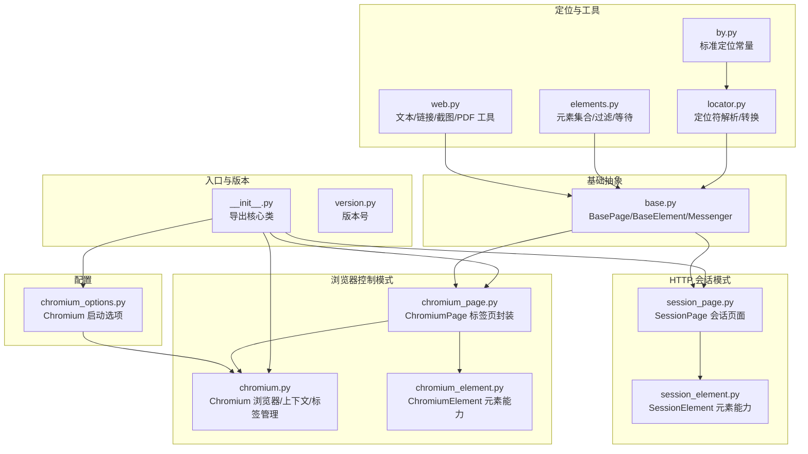
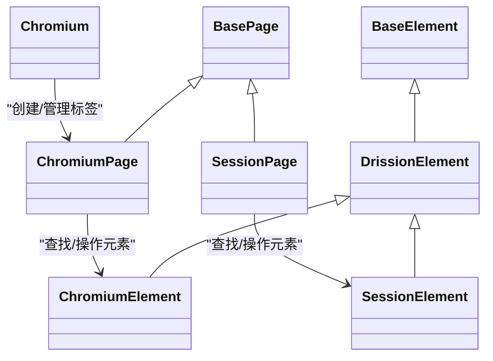
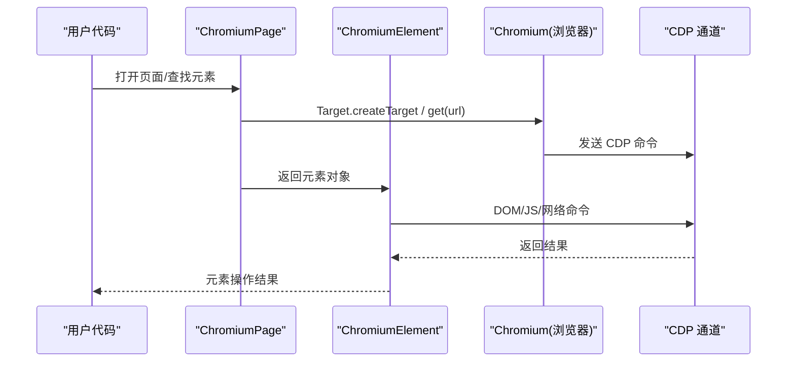
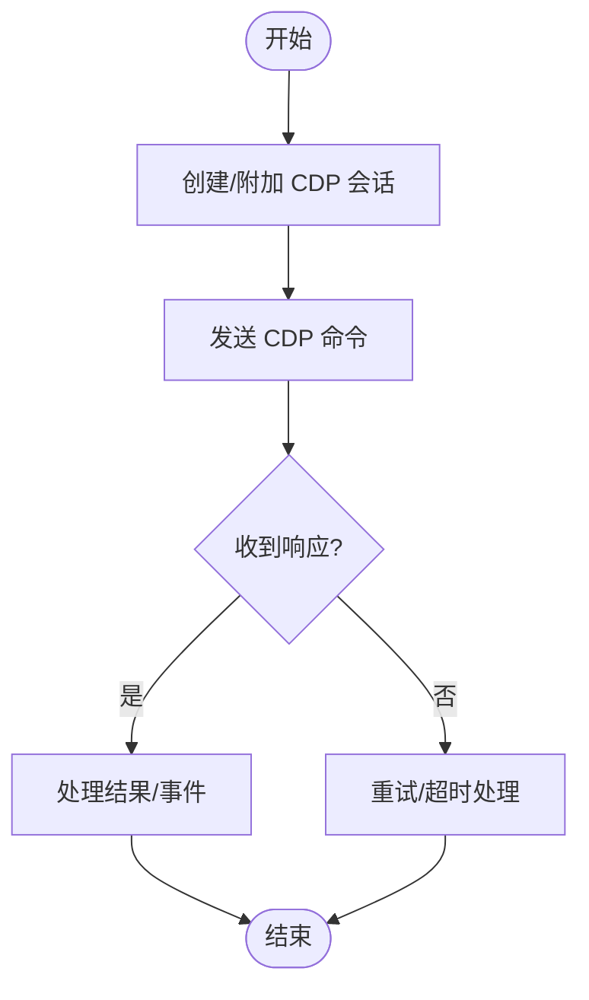
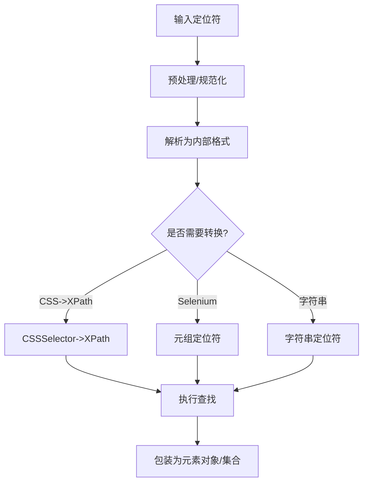
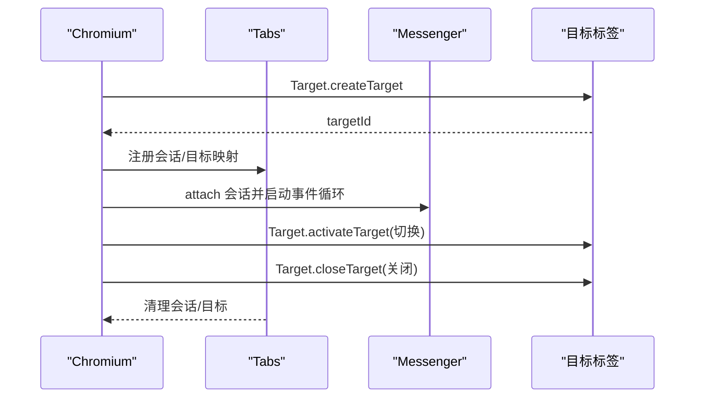
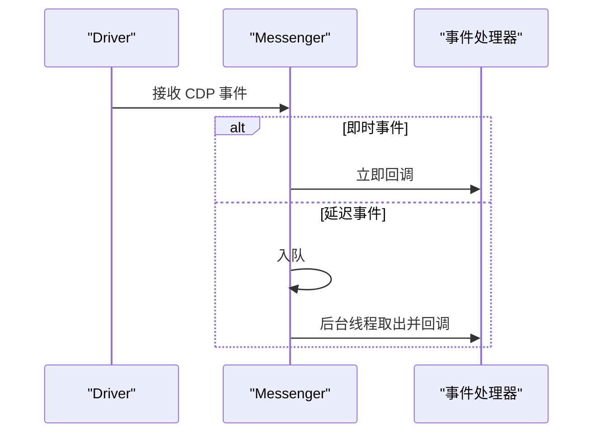
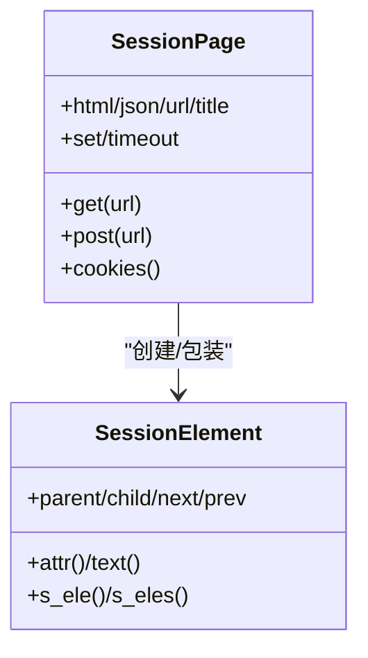
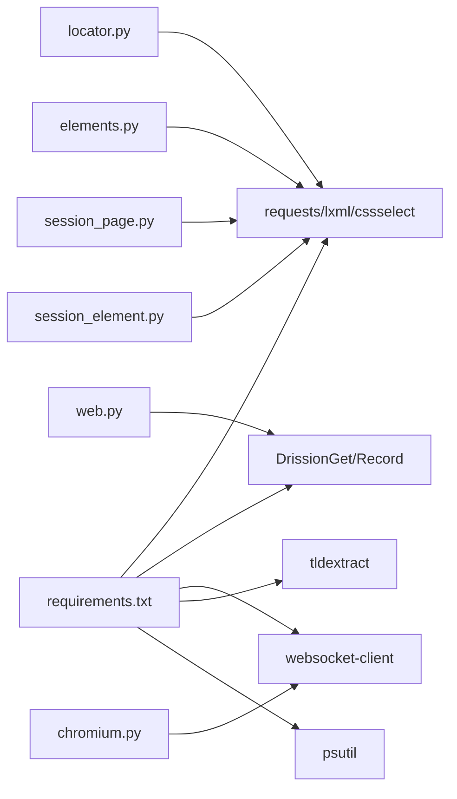

# 核心概念

<cite>
**本文引用的文件**
- [__init__.py](file://DrissionPage/__init__.py)
- [base.py](file://DrissionPage/_base/base.py)
- [chromium.py](file://DrissionPage/_browsers/chromium.py)
- [chromium_page.py](file://DrissionPage/_pages/chromium_page.py)
- [session_page.py](file://DrissionPage/_pages/session_page.py)
- [chromium_element.py](file://DrissionPage/_elements/chromium_element.py)
- [session_element.py](file://DrissionPage/_elements/session_element.py)
- [locator.py](file://DrissionPage/_functions/locator.py)
- [by.py](file://DrissionPage/_functions/by.py)
- [elements.py](file://DrissionPage/_functions/elements.py)
- [web.py](file://DrissionPage/_functions/web.py)
- [chromium_options.py](file://DrissionPage/_configs/chromium_options.py)
- [version.py](file://DrissionPage/version.py)
- [requirements.txt](file://requirements.txt)
</cite>

## 目录
1. [引言](#引言)
2. [项目结构](#项目结构)
3. [核心组件](#核心组件)
4. [架构总览](#架构总览)
5. [详细组件分析](#详细组件分析)
6. [依赖分析](#依赖分析)
7. [性能考量](#性能考量)
8. [故障排查指南](#故障排查指南)
9. [结论](#结论)
10. [附录](#附录)

## 引言
本文件面向希望系统掌握 DrissionPage 设计理念与核心能力的读者，围绕“双模式架构”“CDP 协议”“元素定位策略”“标签页与多标签并发”“事件驱动与异步处理”等主题展开，辅以图示与代码路径指引，帮助快速建立完整的知识体系。

## 项目结构
DrissionPage 将“浏览器控制模式”（Chromium）与“HTTP 会话模式”（Session）两大能力抽象为统一的页面与元素接口层，通过配置与工具模块支撑运行时行为与定位策略。

**图示来源**
- [__init__.py:22-28](file://DrissionPage/__init__.py#L22-L28)
- [base.py:270-372](file://DrissionPage/_base/base.py#L270-L372)
- [chromium.py:33-127](file://DrissionPage/_browsers/chromium.py#L33-L127)
- [chromium_page.py:17-56](file://DrissionPage/_pages/chromium_page.py#L17-L56)
- [session_page.py:25-99](file://DrissionPage/_pages/session_page.py#L25-L99)
- [chromium_element.py:38-118](file://DrissionPage/_elements/chromium_element.py#L38-L118)
- [session_element.py:23-76](file://DrissionPage/_elements/session_element.py#L23-L76)
- [locator.py:96-116](file://DrissionPage/_functions/locator.py#L96-L116)
- [by.py:10-19](file://DrissionPage/_functions/by.py#L10-L19)
- [elements.py:16-62](file://DrissionPage/_functions/elements.py#L16-L62)
- [web.py:106-108](file://DrissionPage/_functions/web.py#L106-L108)
- [chromium_options.py:16-85](file://DrissionPage/_configs/chromium_options.py#L16-L85)

**章节来源**
- [__init__.py:22-28](file://DrissionPage/__init__.py#L22-L28)
- [version.py:8-9](file://DrissionPage/version.py#L8-L9)

## 核心组件
- 页面基类与元素基类
  - BasePage：统一页面级能力（URL、标题、下载、会话、超时等），提供统一的元素查找入口。
  - BaseElement/DrissionElement：统一元素级能力（属性、文本、父子兄弟关系、相对定位、路径等）。
- 浏览器控制模式（Chromium）
  - Chromium：浏览器生命周期、上下文、标签管理、事件订阅、CDP 会话管理。
  - ChromiumPage：单标签页封装，提供标签切换、新建、关闭、等待、设置等。
  - ChromiumElement：基于 DOM/CSS/JS 的元素能力，支持矩形、滚动、悬停、拖拽、阴影根等。
- HTTP 会话模式（Session）
  - SessionPage：基于 requests 的页面对象，支持 GET/POST、响应、HTML 解析、Cookie 管理。
  - SessionElement：基于 lxml 的元素对象，支持 XPath/CSS 定位、文本提取、属性计算。
- 定位与工具
  - locator.py：统一定位符解析（XPath/CSS/文本/多属性等），支持 Selenium 风格定位。
  - elements.py：元素集合、过滤器、Getter、等待辅助。
  - web.py：文本格式化、链接补全、截图/PDF 导出、JS 片段工具。
- 配置
  - chromium_options.py：启动参数、代理、用户数据目录、超时、重试等。

**章节来源**
- [base.py:270-372](file://DrissionPage/_base/base.py#L270-L372)
- [chromium.py:33-127](file://DrissionPage/_browsers/chromium.py#L33-L127)
- [chromium_page.py:17-56](file://DrissionPage/_pages/chromium_page.py#L17-L56)
- [chromium_element.py:38-118](file://DrissionPage/_elements/chromium_element.py#L38-L118)
- [session_page.py:25-99](file://DrissionPage/_pages/session_page.py#L25-L99)
- [session_element.py:23-76](file://DrissionPage/_elements/session_element.py#L23-L76)
- [locator.py:96-116](file://DrissionPage/_functions/locator.py#L96-L116)
- [elements.py:16-62](file://DrissionPage/_functions/elements.py#L16-L62)
- [web.py:106-108](file://DrissionPage/_functions/web.py#L106-L108)
- [chromium_options.py:16-85](file://DrissionPage/_configs/chromium_options.py#L16-L85)

## 架构总览
DrissionPage 的“双模式架构”体现在同一套高层 API 下，既可直接控制真实浏览器（Chromium），也可通过 HTTP 会话模拟页面交互（Session）。二者共享统一的定位与元素模型，便于在不同场景下灵活切换。

**图示来源**
- [base.py:270-372](file://DrissionPage/_base/base.py#L270-L372)
- [chromium.py:33-127](file://DrissionPage/_browsers/chromium.py#L33-L127)
- [chromium_page.py:17-56](file://DrissionPage/_pages/chromium_page.py#L17-L56)
- [chromium_element.py:38-118](file://DrissionPage/_elements/chromium_element.py#L38-L118)
- [session_page.py:25-99](file://DrissionPage/_pages/session_page.py#L25-L99)
- [session_element.py:23-76](file://DrissionPage/_elements/session_element.py#L23-L76)

## 详细组件分析

### 双模式架构：浏览器控制模式 vs HTTP 会话模式
- 浏览器控制模式（Chromium）
  - 通过 CDP 与浏览器通信，具备 DOM/CSS/JS 能力，适合复杂交互、动态渲染、截图/PDF、事件监听等。
  - 关键点：Chromium 管理浏览器生命周期与标签；ChromiumPage 提供标签页操作；ChromiumElement 提供丰富的元素操作。
- HTTP 会话模式（Session）
  - 基于 requests + lxml，适合静态/半静态页面抓取、表单提交、Cookie 管理、响应解析等。
  - 关键点：SessionPage 提供页面级能力；SessionElement 提供 XPath/CSS 定位与文本提取。

**图示来源**
- [chromium_page.py:33-56](file://DrissionPage/_pages/chromium_page.py#L33-L56)
- [chromium.py:235-270](file://DrissionPage/_browsers/chromium.py#L235-L270)
- [chromium_element.py:410-418](file://DrissionPage/_elements/chromium_element.py#L410-L418)

**章节来源**
- [chromium_page.py:17-103](file://DrissionPage/_pages/chromium_page.py#L17-L103)
- [session_page.py:25-147](file://DrissionPage/_pages/session_page.py#L25-L147)
- [chromium.py:33-127](file://DrissionPage/_browsers/chromium.py#L33-L127)

### CDP 协议的作用与优势
- 作用
  - 作为浏览器调试协议，提供对 DOM、CSS、JS、网络、存储、下载等的细粒度控制。
- 优势
  - 无需 GUI，可实现高并发与稳定交互；支持截图、PDF、资源内容读取、事件回调等。
- 在 DrissionPage 中的应用
  - Chromium 通过 Driver/DebugDriver 管理会话；Messenger 负责事件接收与回调；各页面/元素通过 _run_cdp 调用。

**图示来源**
- [chromium.py:373-392](file://DrissionPage/_browsers/chromium.py#L373-L392)
- [base.py:394-404](file://DrissionPage/_base/base.py#L394-L404)

**章节来源**
- [chromium.py:33-127](file://DrissionPage/_browsers/chromium.py#L33-L127)
- [base.py:373-434](file://DrissionPage/_base/base.py#L373-L434)

### 元素定位策略：XPath、CSS 选择器、文本匹配与扩展
- 统一定位符
  - 支持字符串定位符（如以“xpath:”“css:”“text:”等前缀）、元组定位符（Selenium 风格）、对象定位符。
  - locator.py 提供解析与转换逻辑，支持多属性组合、文本模糊/精确/前后缀匹配、CSS 到 XPath 转换等。
- 元素模型
  - ChromiumElement/SessionElement 均继承自 DrissionElement，提供父子兄弟关系、相对定位、属性/文本访问、路径生成等。
- 过滤与批量
  - elements.py 提供元素集合与过滤器，支持按显示状态、选中状态、可点击、样式、属性等条件筛选。

**图示来源**
- [locator.py:96-116](file://DrissionPage/_functions/locator.py#L96-L116)
- [by.py:10-19](file://DrissionPage/_functions/by.py#L10-L19)
- [chromium_element.py:419-435](file://DrissionPage/_elements/chromium_element.py#L419-L435)
- [session_element.py:169-301](file://DrissionPage/_elements/session_element.py#L169-L301)
- [elements.py:16-62](file://DrissionPage/_functions/elements.py#L16-L62)

**章节来源**
- [locator.py:15-579](file://DrissionPage/_functions/locator.py#L15-L579)
- [by.py:10-19](file://DrissionPage/_functions/by.py#L10-L19)
- [chromium_element.py:419-435](file://DrissionPage/_elements/chromium_element.py#L419-L435)
- [session_element.py:169-301](file://DrissionPage/_elements/session_element.py#L169-L301)
- [elements.py:16-62](file://DrissionPage/_functions/elements.py#L16-L62)

### 标签页管理与多标签并发
- 标签页生命周期
  - Chromium.new_tab / get_tab / get_tabs / close_tabs / activate_tab 等。
  - 通过 Target.createTarget/activateTarget/closeTarget 管理标签。
- 并发与会话
  - 每个标签对应一个 CDP 会话；Tabs 管理会话与目标映射；Messenger 管理事件队列与回调。
- 实践建议
  - 使用 get_tab/get_tabs 精确选择目标；避免同时对同一标签进行冲突操作；合理设置超时与重试。

**图示来源**
- [chromium.py:235-313](file://DrissionPage/_browsers/chromium.py#L235-L313)
- [chromium.py:565-684](file://DrissionPage/_browsers/chromium.py#L565-L684)
- [base.py:385-434](file://DrissionPage/_base/base.py#L385-L434)

**章节来源**
- [chromium.py:235-313](file://DrissionPage/_browsers/chromium.py#L235-L313)
- [chromium.py:565-684](file://DrissionPage/_browsers/chromium.py#L565-L684)

### 事件驱动架构与异步处理
- 事件驱动
  - Messenger 维护事件队列与回调注册，支持即时事件与延迟事件处理；Chromium 订阅 Target.* 事件。
- 异步处理
  - 通过线程与队列实现事件异步分发；部分操作支持异步 JS 执行。
- 应用场景
  - 页面导航、弹窗、下载、新标签创建等事件的自动处理。

**图示来源**
- [base.py:373-434](file://DrissionPage/_base/base.py#L373-L434)
- [chromium.py:76-78](file://DrissionPage/_browsers/chromium.py#L76-L78)

**章节来源**
- [base.py:373-434](file://DrissionPage/_base/base.py#L373-L434)
- [chromium.py:76-78](file://DrissionPage/_browsers/chromium.py#L76-L78)

### HTTP 会话模式：SessionPage 与 SessionElement
- SessionPage
  - 统一页面能力：get/post、响应、HTML/json、标题、UA、超时与重试、下载器集成。
- SessionElement
  - 基于 lxml 的元素对象：支持 XPath/CSS、文本提取、属性计算、绝对链接补全等。
- 适用场景
  - 快速抓取、静态页面解析、表单提交、Cookie 管理等。

**图示来源**
- [session_page.py:25-196](file://DrissionPage/_pages/session_page.py#L25-L196)
- [session_element.py:23-167](file://DrissionPage/_elements/session_element.py#L23-L167)

**章节来源**
- [session_page.py:25-294](file://DrissionPage/_pages/session_page.py#L25-L294)
- [session_element.py:23-301](file://DrissionPage/_elements/session_element.py#L23-L301)

## 依赖分析
- 内部依赖
  - 页面与元素：统一继承自 BasePage/BaseElement；ChromiumPage/SessionPage 分别持有 ChromiumElement/SessionElement。
  - 定位：locator.py 与 by.py 提供解析与常量；elements.py 提供集合与过滤。
  - 工具：web.py 提供文本/链接/截图/PDF 等工具函数。
- 外部依赖
  - requests、lxml、cssselect、DrissionGet、DrissionRecord、websocket-client、tldextract、psutil 等。

**图示来源**
- [requirements.txt:1-9](file://requirements.txt#L1-L9)
- [locator.py:96-116](file://DrissionPage/_functions/locator.py#L96-L116)
- [elements.py:16-62](file://DrissionPage/_functions/elements.py#L16-L62)
- [web.py:106-108](file://DrissionPage/_functions/web.py#L106-L108)
- [chromium.py:33-127](file://DrissionPage/_browsers/chromium.py#L33-L127)
- [session_page.py:25-99](file://DrissionPage/_pages/session_page.py#L25-L99)
- [session_element.py:23-76](file://DrissionPage/_elements/session_element.py#L23-L76)

**章节来源**
- [requirements.txt:1-9](file://requirements.txt#L1-L9)

## 性能考量
- 并发与会话
  - 多标签并发时，注意合理设置超时与重试；避免阻塞式等待，优先使用显式等待与事件回调。
- 定位效率
  - 优先使用更精确的定位符（如 CSS/XPath），减少回溯；对复杂页面尽量缩小搜索范围。
- 资源与下载
  - 合理设置下载路径与行为；大文件下载建议使用流式处理与断点续传策略。
- CDP 与 HTTP 的选择
  - 动态渲染、截图/PDF、事件驱动等场景优先使用 Chromium；静态抓取与批量请求优先使用 Session。

## 故障排查指南
- 常见错误与定位
  - 元素未找到：检查定位符是否正确、是否需要等待；查看 raise_when_ele_not_found 配置。
  - CDP 错误：确认浏览器连接状态、会话是否有效；必要时重建会话。
  - URL 不可用：检查重试次数与间隔、状态码与内容为空问题。
- 建议流程
  - 开启调试日志（Messenger.debug）观察事件；逐步缩小定位范围；记录超时与重试参数。

**章节来源**
- [base.py:356-370](file://DrissionPage/_base/base.py#L356-L370)
- [chromium.py:328-372](file://DrissionPage/_browsers/chromium.py#L328-L372)
- [session_page.py:180-265](file://DrissionPage/_pages/session_page.py#L180-L265)

## 结论
DrissionPage 通过“双模式架构”将浏览器控制与 HTTP 会话能力统一到一致的 API 之下，结合 CDP 的强大能力与 Session 的轻量高效，覆盖从静态抓取到复杂交互的广泛场景。借助完善的定位策略、事件驱动与并发管理，用户可在不同需求之间灵活切换，构建稳健高效的自动化方案。

## 附录
- 版本信息
  - 当前版本：参见 [version.py:8-9](file://DrissionPage/version.py#L8-L9)
- 入口导出
  - 核心类导出：参见 [__init__.py:22-28](file://DrissionPage/__init__.py#L22-L28)