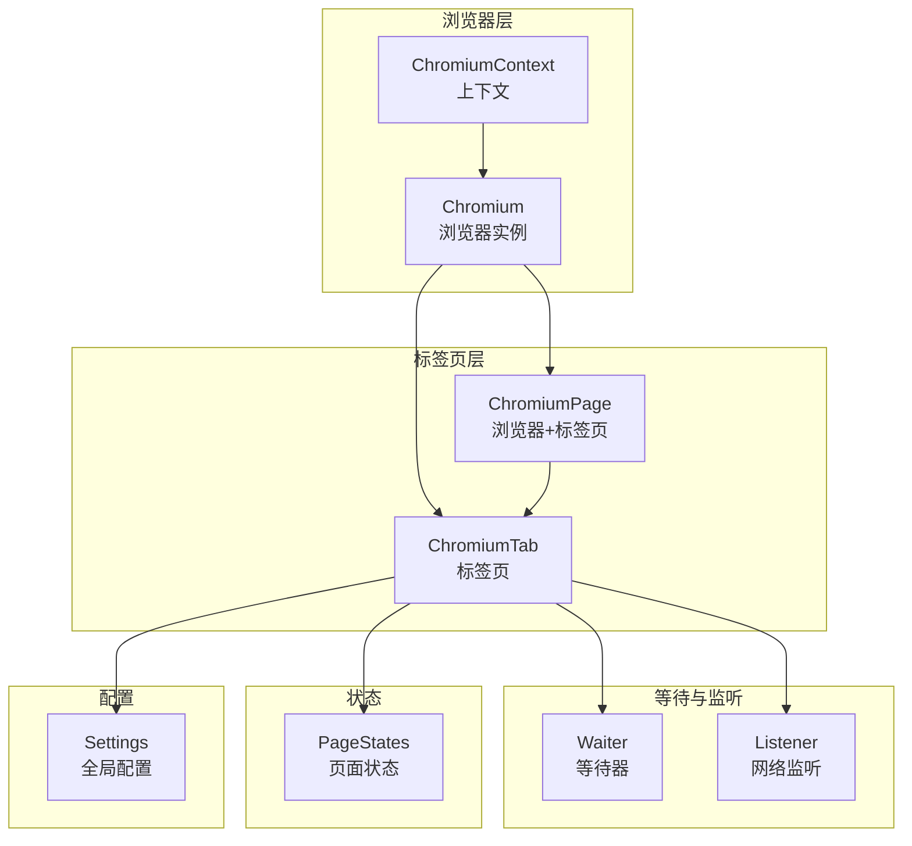
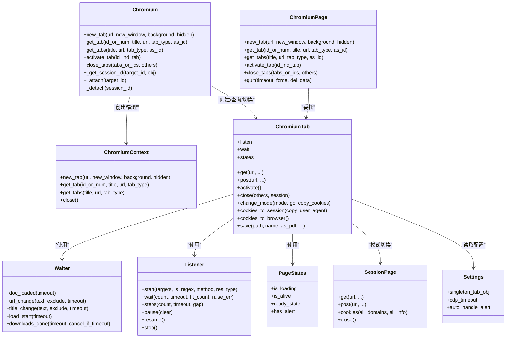
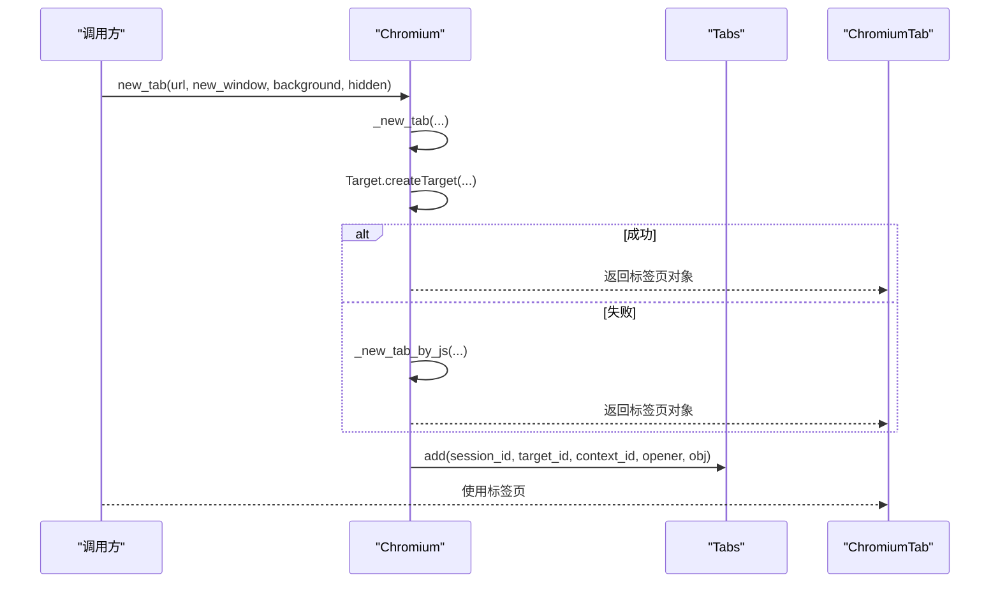
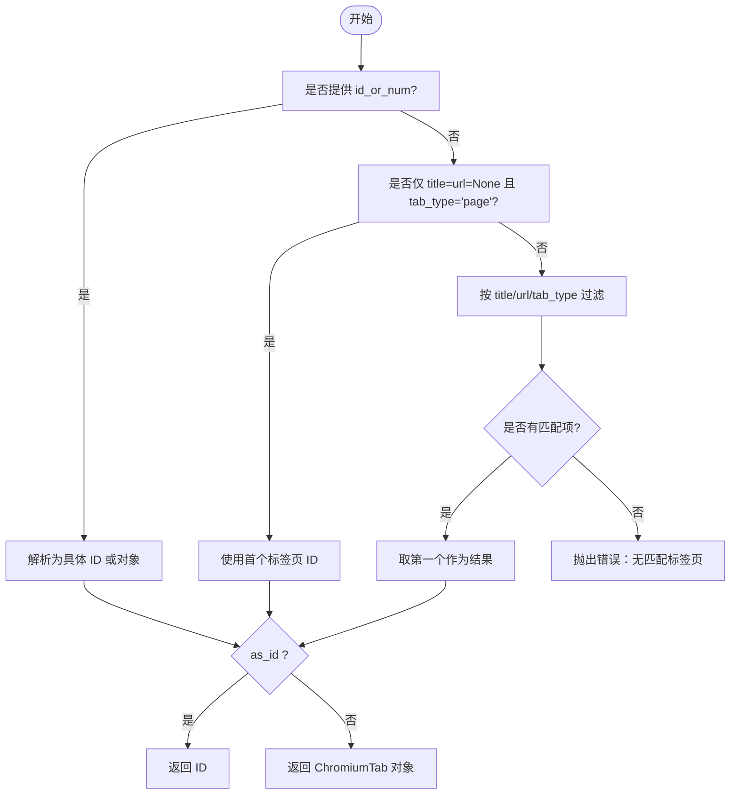
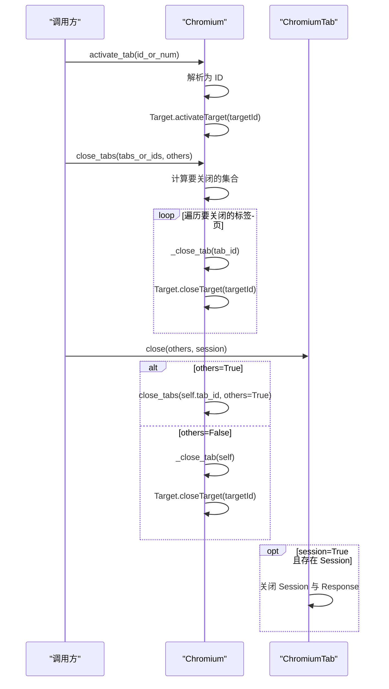
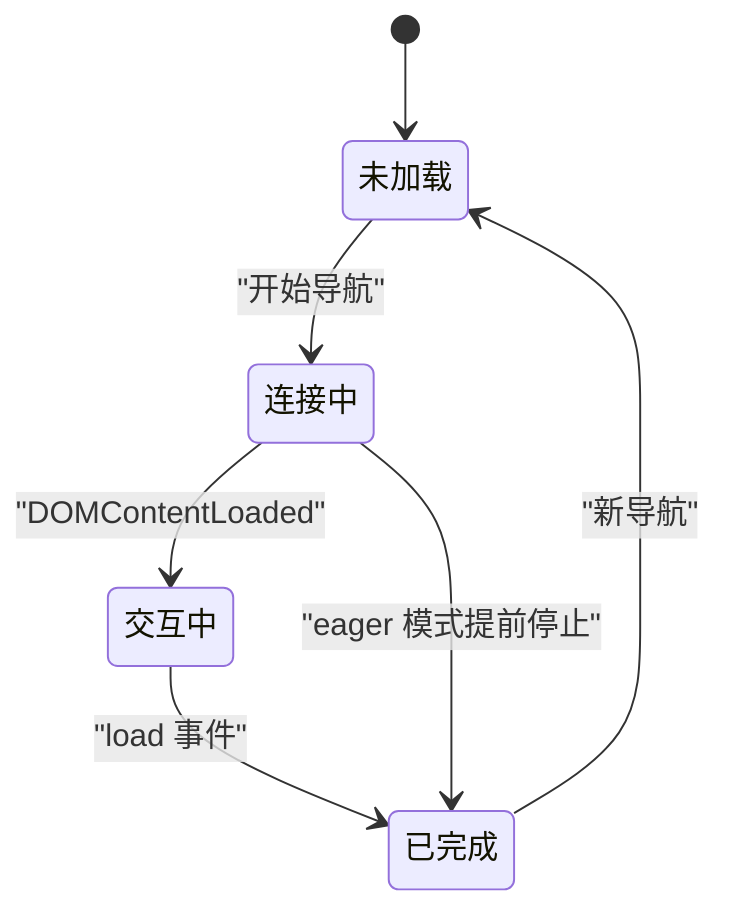
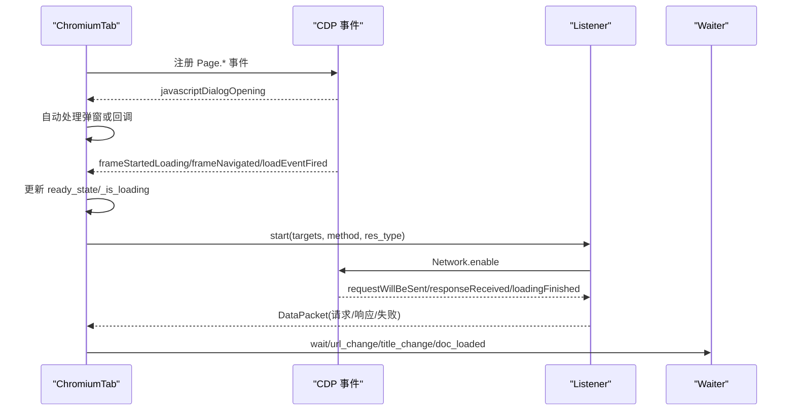
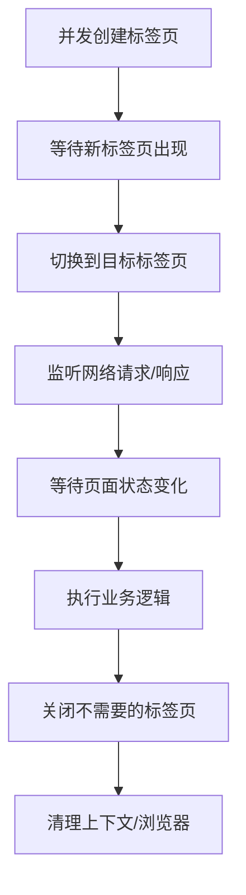
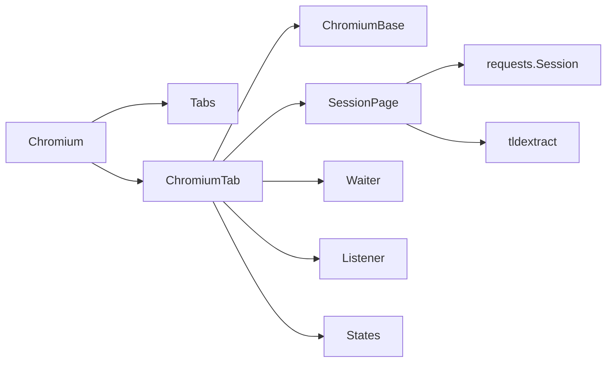

# 标签页管理

<cite>
**本文引用的文件**
- [chromium_tab.py](file://DrissionPage/_pages/chromium_tab.py)
- [chromium_page.py](file://DrissionPage/_pages/chromium_page.py)
- [chromium_base.py](file://DrissionPage/_pages/chromium_base.py)
- [session_page.py](file://DrissionPage/_pages/session_page.py)
- [chromium.py](file://DrissionPage/_browsers/chromium.py)
- [chromium_context.py](file://DrissionPage/_browsers/chromium_context.py)
- [waiter.py](file://DrissionPage/_units/waiter.py)
- [listener.py](file://DrissionPage/_units/listener.py)
- [states.py](file://DrissionPage/_units/states.py)
- [settings.py](file://DrissionPage/_functions/settings.py)
- [chromium_tab.pyi](file://DrissionPage/_pages/chromium_tab.pyi)
- [chromium_page.pyi](file://DrissionPage/_pages/chromium_page.pyi)
</cite>

## 目录
1. [简介](#简介)
2. [项目结构](#项目结构)
3. [核心组件](#核心组件)
4. [架构总览](#架构总览)
5. [详细组件分析](#详细组件分析)
6. [依赖关系分析](#依赖关系分析)
7. [性能考量](#性能考量)
8. [故障排查指南](#故障排查指南)
9. [结论](#结论)
10. [附录](#附录)

## 简介
本章节面向 DrissionPage 的标签页管理系统，系统性阐述标签页的创建、切换、关闭与查询；解释标签页的标识符体系（ID、序号、标题、URL 等）；说明标签页的属性与状态管理（活跃、隐藏、新窗口等）；讲解事件监听与回调机制；阐明标签页与浏览器上下文的关系及隔离机制；并提供多标签并发操作、标签页监控、自动清理等实际应用示例的实现思路与流程图。

## 项目结构
DrissionPage 的标签页管理由“浏览器层”“标签页层”“等待与监听层”“状态层”共同组成：
- 浏览器层负责与浏览器进程交互，提供标签页创建、查询、切换、关闭等能力；
- 标签页层封装了 ChromiumTab 与 ChromiumPage，分别代表单个标签页与“浏览器+单标签页”的便捷入口；
- 等待与监听层提供等待、下载、网络请求监听等能力；
- 状态层提供页面/元素/框架的状态查询；
- 配置层提供全局行为开关（如单例标签对象、CDP 超时等）。

图表来源
- [chromium.py:33-127](file://DrissionPage/_browsers/chromium.py#L33-L127)
- [chromium_context.py:7-62](file://DrissionPage/_browsers/chromium_context.py#L7-L62)
- [chromium_tab.py:22-108](file://DrissionPage/_pages/chromium_tab.py#L22-L108)
- [chromium_page.py:17-102](file://DrissionPage/_pages/chromium_page.py#L17-L102)
- [waiter.py:85-235](file://DrissionPage/_units/waiter.py#L85-L235)
- [listener.py:20-174](file://DrissionPage/_units/listener.py#L20-L174)
- [states.py:113-150](file://DrissionPage/_units/states.py#L113-L150)
- [settings.py:13-69](file://DrissionPage/_functions/settings.py#L13-L69)

章节来源
- [chromium.py:33-127](file://DrissionPage/_browsers/chromium.py#L33-L127)
- [chromium_context.py:7-62](file://DrissionPage/_browsers/chromium_context.py#L7-L62)
- [chromium_tab.py:22-108](file://DrissionPage/_pages/chromium_tab.py#L22-L108)
- [chromium_page.py:17-102](file://DrissionPage/_pages/chromium_page.py#L17-L102)
- [waiter.py:85-235](file://DrissionPage/_units/waiter.py#L85-L235)
- [listener.py:20-174](file://DrissionPage/_units/listener.py#L20-L174)
- [states.py:113-150](file://DrissionPage/_units/states.py#L113-L150)
- [settings.py:13-69](file://DrissionPage/_functions/settings.py#L13-L69)

## 核心组件
- Chromium（浏览器）：负责与浏览器进程交互，提供标签页创建、查询、切换、关闭、上下文管理等能力；维护 Tabs 会话映射表，记录标签页与会话之间的关系。
- ChromiumContext（上下文）：封装浏览器上下文，支持在不同上下文中创建标签页、查询标签页、关闭上下文等。
- ChromiumTab（标签页）：封装单个标签页，提供 get/post、元素查找、切换模式、关闭、保存等功能；支持事件回调与等待器。
- ChromiumPage（浏览器+标签页）：提供更高级的入口，便于直接操作浏览器与当前标签页。
- SessionPage（会话页面）：在“s 模式”下通过 HTTP 会话访问页面，提供 get/post、cookies、响应体等能力。
- Waiter（等待器）：提供页面加载、元素出现、URL/标题变化、下载完成等等待能力。
- Listener（监听器）：提供网络请求/响应监听、失败信息捕获、分步获取等能力。
- PageStates（页面状态）：提供页面加载状态、是否弹窗、是否存活等状态查询。
- Settings（配置）：提供全局行为开关，如单例标签对象、CDP 超时、自动处理弹窗等。

章节来源
- [chromium.py:33-127](file://DrissionPage/_browsers/chromium.py#L33-L127)
- [chromium_context.py:7-62](file://DrissionPage/_browsers/chromium_context.py#L7-L62)
- [chromium_tab.py:22-108](file://DrissionPage/_pages/chromium_tab.py#L22-L108)
- [chromium_page.py:17-102](file://DrissionPage/_pages/chromium_page.py#L17-L102)
- [session_page.py:25-103](file://DrissionPage/_pages/session_page.py#L25-L103)
- [waiter.py:85-235](file://DrissionPage/_units/waiter.py#L85-L235)
- [listener.py:20-174](file://DrissionPage/_units/listener.py#L20-L174)
- [states.py:113-150](file://DrissionPage/_units/states.py#L113-L150)
- [settings.py:13-69](file://DrissionPage/_functions/settings.py#L13-L69)

## 架构总览
标签页管理的整体架构围绕 Chromium 与 ChromiumTab 展开，Chromium 维护浏览器生命周期与标签页集合，ChromiumTab 封装标签页的属性、状态与行为；ChromiumPage 提供便捷入口；Waiter/Listener/States/Settings 分别提供等待、监听、状态与配置能力。

图表来源
- [chromium.py:235-441](file://DrissionPage/_browsers/chromium.py#L235-L441)
- [chromium_context.py:44-62](file://DrissionPage/_browsers/chromium_context.py#L44-L62)
- [chromium_tab.py:121-238](file://DrissionPage/_pages/chromium_tab.py#L121-L238)
- [chromium_page.py:89-102](file://DrissionPage/_pages/chromium_page.py#L89-L102)
- [session_page.py:104-196](file://DrissionPage/_pages/session_page.py#L104-L196)
- [waiter.py:85-235](file://DrissionPage/_units/waiter.py#L85-L235)
- [listener.py:78-174](file://DrissionPage/_units/listener.py#L78-L174)
- [states.py:113-150](file://DrissionPage/_units/states.py#L113-L150)
- [settings.py:13-69](file://DrissionPage/_functions/settings.py#L13-L69)

## 详细组件分析

### 标签页创建与上下文
- 创建标签页：Chromium.new_tab 通过 Target.createTarget 创建标签页，若失败则回退到 JS 方式；支持在新窗口、后台、隐藏等模式下创建。
- 上下文隔离：ChromiumContext 提供独立上下文，可在不同上下文中创建标签页，支持代理、下载行为等上下文级配置。
- 最新标签页：Tabs 维护每个上下文的最新标签页，便于快速定位。

图表来源
- [chromium.py:235-270](file://DrissionPage/_browsers/chromium.py#L235-L270)
- [chromium.py:710-720](file://DrissionPage/_browsers/chromium.py#L710-L720)
- [chromium.py:565-684](file://DrissionPage/_browsers/chromium.py#L565-L684)

章节来源
- [chromium.py:235-270](file://DrissionPage/_browsers/chromium.py#L235-L270)
- [chromium.py:710-720](file://DrissionPage/_browsers/chromium.py#L710-L720)
- [chromium.py:565-684](file://DrissionPage/_browsers/chromium.py#L565-L684)

### 标签页查询与定位
- 查询单个标签页：Chromium.get_tab 支持通过 ID、序号、标题、URL、类型进行定位；支持返回对象或 ID。
- 查询多个标签页：Chromium.get_tabs 支持批量筛选。
- 上下文查询：ChromiumContext.get_tab/get_tabs 在指定上下文中进行查询。
- 序号规则：序号从 1 开始，支持负数表示倒数第 N 个；注意不是视觉排列顺序，而是激活顺序。

图表来源
- [chromium.py:394-441](file://DrissionPage/_browsers/chromium.py#L394-L441)
- [chromium_context.py:48-53](file://DrissionPage/_browsers/chromium_context.py#L48-L53)

章节来源
- [chromium.py:394-441](file://DrissionPage/_browsers/chromium.py#L394-L441)
- [chromium_context.py:48-53](file://DrissionPage/_browsers/chromium_context.py#L48-L53)

### 标签页切换与关闭
- 切换：Chromium.activate_tab 支持通过序号、ID、对象进行切换；序号从 1 开始。
- 关闭：Chromium.close_tabs 支持关闭指定标签页或“除自身外其余”；ChromiumTab.close 支持关闭自身并可选关闭关联 Session。

图表来源
- [chromium.py:306-305](file://DrissionPage/_browsers/chromium.py#L306-L305)
- [chromium.py:278-298](file://DrissionPage/_browsers/chromium.py#L278-L298)
- [chromium_tab.py:213-222](file://DrissionPage/_pages/chromium_tab.py#L213-L222)

章节来源
- [chromium.py:306-305](file://DrissionPage/_browsers/chromium.py#L306-L305)
- [chromium.py:278-298](file://DrissionPage/_browsers/chromium.py#L278-L298)
- [chromium_tab.py:213-222](file://DrissionPage/_pages/chromium_tab.py#L213-L222)

### 标签页标识符系统
- ID：ChromiumTab.tab_id 即 ChromiumBase._target_id，唯一标识标签页。
- 序号：Chromium.tab_ids 返回当前上下文下的标签页 ID 列表，序号基于激活顺序。
- 标题/URL：通过 get_tab/get_tabs 的 title/url 参数进行模糊匹配。
- 类型：支持 page/webview 等类型过滤。
- 单例对象：Settings.singleton_tab_obj 控制返回对象还是 ID。

章节来源
- [chromium_base.py:342-343](file://DrissionPage/_pages/chromium_base.py#L342-L343)
- [chromium.py:186-198](file://DrissionPage/_browsers/chromium.py#L186-L198)
- [chromium.py:394-441](file://DrissionPage/_browsers/chromium.py#L394-L441)
- [settings.py](file://DrissionPage/_functions/settings.py#L17)

### 标签页属性与状态管理
- 基础属性：url/title/html/json/user_agent/response/mode(rect、timeout 等)。
- 加载状态：PageStates.ready_state/is_loading/is_alive；ChromiumBase 内部维护 _ready_state/_is_loading。
- 弹窗状态：has_alert；自动处理弹窗策略来自 Settings.auto_handle_alert。
- 模式切换：d 模式（驱动模式）与 s 模式（会话模式）互切，支持 cookies 复制与 URL 同步。

图表来源
- [chromium_base.py:168-206](file://DrissionPage/_pages/chromium_base.py#L168-L206)
- [states.py:119-134](file://DrissionPage/_units/states.py#L119-L134)

章节来源
- [chromium_base.py:318-327](file://DrissionPage/_pages/chromium_base.py#L318-L327)
- [chromium_base.py:168-206](file://DrissionPage/_pages/chromium_base.py#L168-L206)
- [states.py:119-134](file://DrissionPage/_units/states.py#L119-L134)
- [chromium_tab.py:156-194](file://DrissionPage/_pages/chromium_tab.py#L156-L194)

### 事件监听与回调机制
- 事件注册：ChromiumBase 初始化时注册 Page.* 与 DOM/Frame 相关事件回调。
- 弹窗事件：Page.javascriptDialogOpening/Page.javascriptDialogClosed 触发自动处理或回调。
- 网络监听：Listener.start 启用 Network.* 事件，捕获请求/响应/失败信息，支持正则匹配与方法/资源类型过滤。
- 等待器：BaseWaiter 提供 URL/标题变化、加载状态、元素出现/消失等等待能力。

图表来源
- [chromium_base.py:71-82](file://DrissionPage/_pages/chromium_base.py#L71-L82)
- [chromium_base.py:718-744](file://DrissionPage/_pages/chromium_base.py#L718-L744)
- [listener.py:78-174](file://DrissionPage/_units/listener.py#L78-L174)
- [waiter.py:164-235](file://DrissionPage/_units/waiter.py#L164-L235)

章节来源
- [chromium_base.py:71-82](file://DrissionPage/_pages/chromium_base.py#L71-L82)
- [chromium_base.py:718-744](file://DrissionPage/_pages/chromium_base.py#L718-L744)
- [listener.py:78-174](file://DrissionPage/_units/listener.py#L78-L174)
- [waiter.py:164-235](file://DrissionPage/_units/waiter.py#L164-L235)

### 标签页与浏览器上下文的关系与隔离
- 上下文创建：Chromium.new_context 创建独立上下文，支持代理、下载行为等上下文级配置。
- 会话映射：Tabs 维护 session_id/target_id/context_id/opener 等映射，确保事件与对象正确关联。
- 代理与下载：上下文级代理设置与下载行为配置，影响该上下文内所有标签页。
- 关闭上下文：ChromiumContext.close 释放非默认上下文，清理映射。

章节来源
- [chromium.py:211-234](file://DrissionPage/_browsers/chromium.py#L211-L234)
- [chromium_context.py:55-62](file://DrissionPage/_browsers/chromium_context.py#L55-L62)
- [chromium.py:565-684](file://DrissionPage/_browsers/chromium.py#L565-L684)

### 实际应用示例与实现思路
- 多标签并发操作
  - 并发创建：使用 ChromiumContext.new_tab 并发创建多个标签页，利用 Waiter.new_tab 等待新标签页出现。
  - 并发切换：通过 Chromium.activate_tab 切换至目标标签页，结合 Waiter.url_change/title_change 等等待其就绪。
  - 并发关闭：Chromium.close_tabs 批量关闭指定标签页，或 others=True 关闭除自身外其余。
- 标签页监控
  - 使用 Listener.start 监听特定 URL/方法/资源类型的请求，通过 wait/steps 分批获取数据包。
  - 使用 Waiter.url_change/title_change/doc_loaded 监控页面状态变化。
- 自动清理
  - 任务结束后：Chromium.quit 关闭浏览器；ChromiumContext.close 关闭上下文；ChromiumTab.close(others=False, session=True) 清理会话。
  - 定时清理：周期性检查 Tabs 中的会话映射，移除断开连接的会话。

图表来源
- [chromium.py:235-270](file://DrissionPage/_browsers/chromium.py#L235-L270)
- [waiter.py:29-50](file://DrissionPage/_units/waiter.py#L29-L50)
- [listener.py:78-174](file://DrissionPage/_units/listener.py#L78-L174)
- [chromium_tab.py:213-222](file://DrissionPage/_pages/chromium_tab.py#L213-L222)
- [chromium.py:328-372](file://DrissionPage/_browsers/chromium.py#L328-L372)

章节来源
- [chromium.py:235-270](file://DrissionPage/_browsers/chromium.py#L235-L270)
- [waiter.py:29-50](file://DrissionPage/_units/waiter.py#L29-L50)
- [listener.py:78-174](file://DrissionPage/_units/listener.py#L78-L174)
- [chromium_tab.py:213-222](file://DrissionPage/_pages/chromium_tab.py#L213-L222)
- [chromium.py:328-372](file://DrissionPage/_browsers/chromium.py#L328-L372)

## 依赖关系分析
- 组件耦合
  - Chromium 与 Tabs：强耦合，Chromium 通过 Tabs 管理会话与标签页映射。
  - ChromiumTab 与 ChromiumBase/SessionPage：继承关系，ChromiumTab 在 d/s 模式间切换。
  - Waiter/Listener/States：均依赖 ChromiumBase 的 CDP 能力与事件回调。
- 外部依赖
  - CDP（Chrome DevTools Protocol）：贯穿标签页管理的底层通信协议。
  - Requests：SessionPage 使用 requests.Session 发起 HTTP 请求。
  - tldextract：解析域名，用于 cookies 过滤。

图表来源
- [chromium.py:33-127](file://DrissionPage/_browsers/chromium.py#L33-L127)
- [chromium_tab.py:22-108](file://DrissionPage/_pages/chromium_tab.py#L22-L108)
- [session_page.py:13-22](file://DrissionPage/_pages/session_page.py#L13-L22)

章节来源
- [chromium.py:33-127](file://DrissionPage/_browsers/chromium.py#L33-L127)
- [chromium_tab.py:22-108](file://DrissionPage/_pages/chromium_tab.py#L22-L108)
- [session_page.py:13-22](file://DrissionPage/_pages/session_page.py#L13-L22)

## 性能考量
- 单例标签对象：Settings.singleton_tab_obj 控制是否复用标签页对象，减少重复创建带来的开销。
- 等待策略：合理设置 Waiter 的超时与轮询间隔，避免过度轮询导致 CPU 占用。
- 模式切换：频繁 d/s 模式切换会带来额外成本，建议在批量操作时统一模式。
- 监听器：Listener.start 后会持续占用资源，建议在不需要时及时 pause/resume 或 stop。

## 故障排查指南
- 标签页未找到
  - 检查 get_tab/get_tabs 的参数是否正确；确认上下文是否正确；确认序号是否从 1 开始。
- 切换失败
  - 确认目标 ID 是否有效；检查 Chromium.activate_tab 的参数类型（ID/序号/对象）。
- 关闭失败
  - 确认标签页是否仍处于激活状态；检查 others 参数是否导致关闭了全部标签页。
- 等待超时
  - 调整 Waiter 的超时时间；确认等待条件是否合理；必要时启用 raise_when_wait_failed。
- 弹窗问题
  - 设置 Settings.auto_handle_alert；或在代码中显式处理弹窗。
- 监听器无效
  - 确认 Listener.start 已调用；确认 Network.enable 已启用；检查过滤条件是否过于严格。

章节来源
- [chromium.py:394-441](file://DrissionPage/_browsers/chromium.py#L394-L441)
- [chromium.py:306-305](file://DrissionPage/_browsers/chromium.py#L306-L305)
- [chromium.py:278-298](file://DrissionPage/_browsers/chromium.py#L278-L298)
- [waiter.py:164-235](file://DrissionPage/_units/waiter.py#L164-L235)
- [listener.py:78-174](file://DrissionPage/_units/listener.py#L78-L174)
- [settings.py](file://DrissionPage/_functions/settings.py#L17)

## 结论
DrissionPage 的标签页管理系统以 Chromium 为核心，通过 ChromiumTab/ChromiumPage 提供统一的标签页操作接口；借助 Waiter/Listener/States/Settings 等模块，实现了完善的等待、监听、状态与配置能力。系统支持多上下文隔离、灵活的标签页定位与切换、事件回调与自动清理，适用于多标签并发操作、监控与自动化的复杂场景。

## 附录
- API 速查
  - 创建：Chromium.new_tab / ChromiumContext.new_tab
  - 查询：Chromium.get_tab / Chromium.get_tabs / ChromiumContext.get_tab / ChromiumContext.get_tabs
  - 切换：Chromium.activate_tab
  - 关闭：Chromium.close_tabs / ChromiumTab.close
  - 等待：Waiter.url_change / Waiter.title_change / Waiter.doc_loaded / Waiter.load_start
  - 监听：Listener.start / Listener.wait / Listener.steps / Listener.stop
  - 状态：PageStates.ready_state / PageStates.has_alert / PageStates.is_alive
  - 配置：Settings.singleton_tab_obj / Settings.cdp_timeout / Settings.auto_handle_alert

章节来源
- [chromium.py:235-270](file://DrissionPage/_browsers/chromium.py#L235-L270)
- [chromium_context.py:44-53](file://DrissionPage/_browsers/chromium_context.py#L44-L53)
- [chromium_page.py:87-102](file://DrissionPage/_pages/chromium_page.py#L87-L102)
- [chromium_tab.py:121-238](file://DrissionPage/_pages/chromium_tab.py#L121-L238)
- [waiter.py:164-235](file://DrissionPage/_units/waiter.py#L164-L235)
- [listener.py:78-174](file://DrissionPage/_units/listener.py#L78-L174)
- [states.py:119-150](file://DrissionPage/_units/states.py#L119-L150)
- [settings.py](file://DrissionPage/_functions/settings.py#L17)