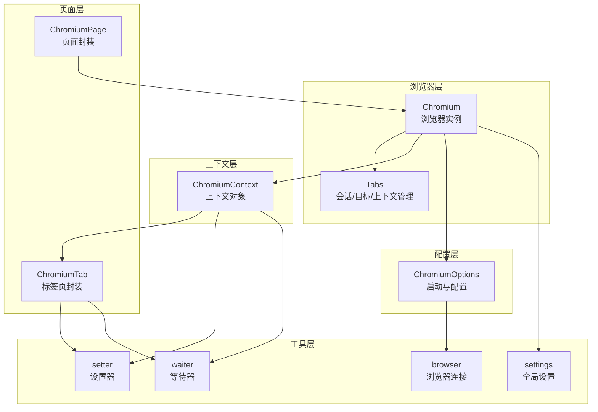
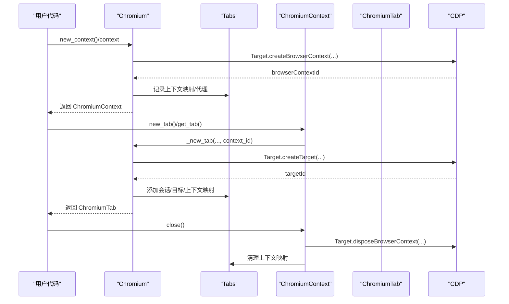
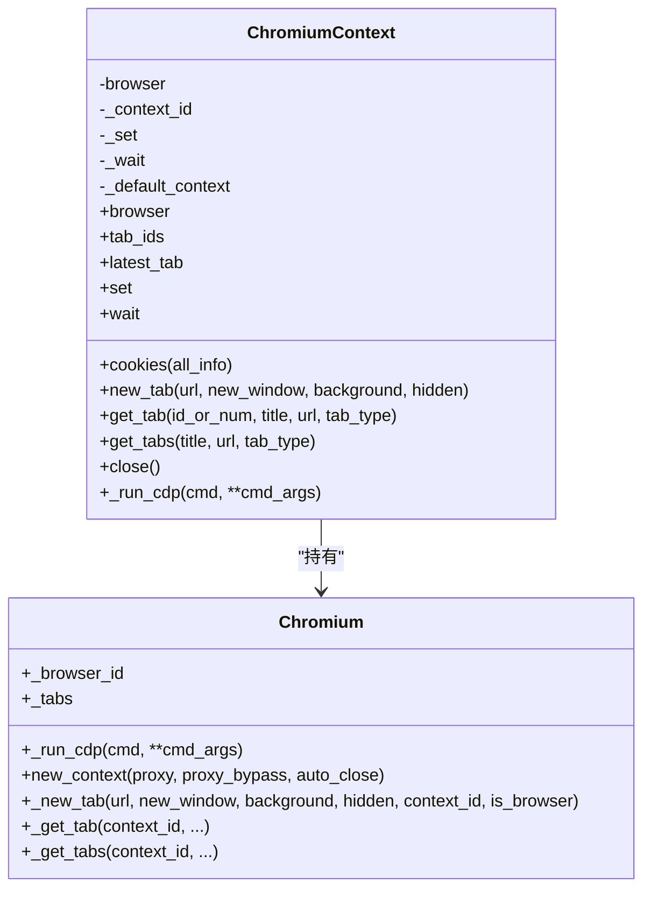
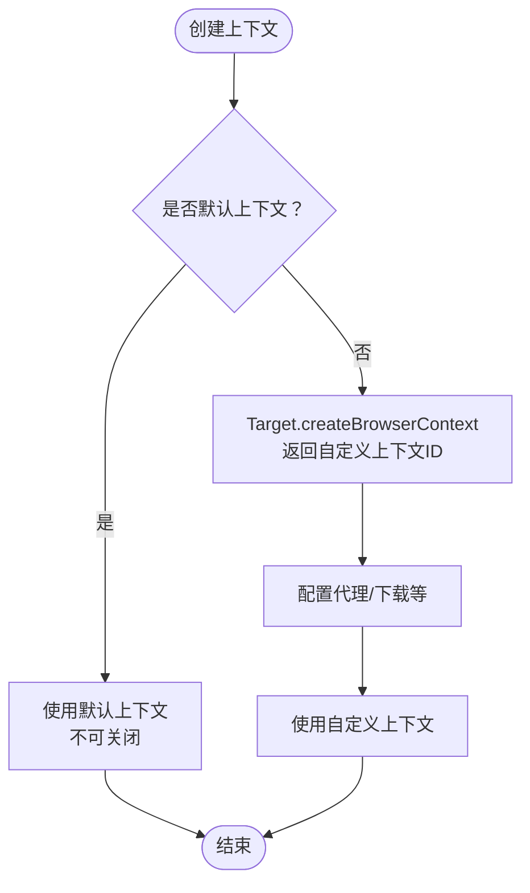
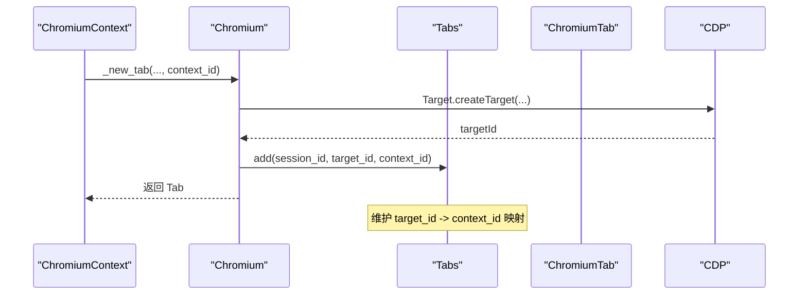
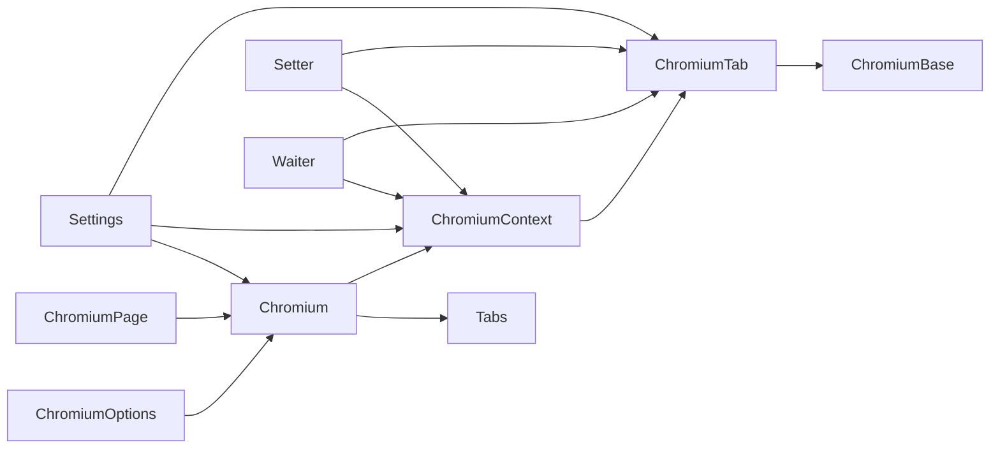

# 浏览器上下文管理

<cite>
**本文档引用的文件**
- [chromium_context.py](file://DrissionPage/_browsers/chromium_context.py)
- [chromium.py](file://DrissionPage/_browsers/chromium.py)
- [chromium_options.py](file://DrissionPage/_configs/chromium_options.py)
- [chromium_page.py](file://DrissionPage/_pages/chromium_page.py)
- [chromium_tab.py](file://DrissionPage/_pages/chromium_tab.py)
- [browser.py](file://DrissionPage/_functions/browser.py)
- [setter.py](file://DrissionPage/_units/setter.py)
- [waiter.py](file://DrissionPage/_units/waiter.py)
- [settings.py](file://DrissionPage/_functions/settings.py)
- [chromium_base.py](file://DrissionPage/_pages/chromium_base.py)
</cite>

## 目录
1. [简介](#简介)
2. [项目结构](#项目结构)
3. [核心组件](#核心组件)
4. [架构总览](#架构总览)
5. [详细组件分析](#详细组件分析)
6. [依赖关系分析](#依赖关系分析)
7. [性能考量](#性能考量)
8. [故障排查指南](#故障排查指南)
9. [结论](#结论)
10. [附录](#附录)

## 简介
本节介绍 DrissionPage 的浏览器上下文管理机制，重点围绕 ChromiumContext 类展开，涵盖上下文的创建、配置、销毁流程；解释浏览器上下文的概念与作用（用户数据隔离、隐私模式、代理设置等）；区分默认上下文与自定义上下文的使用场景；说明上下文间的切换与管理机制；阐述上下文与标签页的关系与生命周期；最后给出多账户管理、隐私保护、代理轮换等最佳实践与配置示例。

## 项目结构
DrissionPage 的浏览器上下文管理主要集中在以下模块：
- 浏览器与上下文：Chromium、ChromiumContext
- 上下文配置：ChromiumOptions
- 页面与标签页：ChromiumPage、ChromiumTab
- 工具与设置：setter、waiter、settings、browser
- 基类与事件：chromium_base

**图表来源**
- [chromium.py:33-127](file://DrissionPage/_browsers/chromium.py#L33-L127)
- [chromium_context.py:7-62](file://DrissionPage/_browsers/chromium_context.py#L7-L62)
- [chromium_page.py:17-103](file://DrissionPage/_pages/chromium_page.py#L17-L103)
- [chromium_tab.py:22-238](file://DrissionPage/_pages/chromium_tab.py#L22-L238)
- [chromium_options.py:16-417](file://DrissionPage/_configs/chromium_options.py#L16-L417)
- [setter.py:106-124](file://DrissionPage/_units/setter.py#L106-L124)
- [waiter.py:28-50](file://DrissionPage/_units/waiter.py#L28-L50)
- [settings.py:13-69](file://DrissionPage/_functions/settings.py#L13-L69)
- [browser.py:24-87](file://DrissionPage/_functions/browser.py#L24-L87)

**章节来源**
- [chromium.py:33-127](file://DrissionPage/_browsers/chromium.py#L33-L127)
- [chromium_context.py:7-62](file://DrissionPage/_browsers/chromium_context.py#L7-L62)
- [chromium_page.py:17-103](file://DrissionPage/_pages/chromium_page.py#L17-L103)
- [chromium_tab.py:22-238](file://DrissionPage/_pages/chromium_tab.py#L22-L238)
- [chromium_options.py:16-417](file://DrissionPage/_configs/chromium_options.py#L16-L417)
- [setter.py:106-124](file://DrissionPage/_units/setter.py#L106-L124)
- [waiter.py:28-50](file://DrissionPage/_units/waiter.py#L28-L50)
- [settings.py:13-69](file://DrissionPage/_functions/settings.py#L13-L69)
- [browser.py:24-87](file://DrissionPage/_functions/browser.py#L24-L87)

## 核心组件
- Chromium：浏览器主类，负责启动/连接浏览器、维护上下文与标签页、执行 CDP 命令、管理下载等。
- ChromiumContext：上下文封装，提供 cookies、新标签页、标签页查询、关闭上下文等能力，并通过 setter/waiter 提供配置与等待能力。
- ChromiumOptions：浏览器启动选项，支持用户数据目录、隐身模式、代理、下载路径、超时等配置。
- ChromiumPage/ChromiumTab：页面与标签页封装，提供导航、元素操作、等待、下载等能力。
- Tabs：内部会话/目标/上下文映射与代理管理容器。
- setter/waiter：上下文/页面设置器与等待器，统一配置入口与等待逻辑。
- settings：全局运行时设置，如单例标签对象、CDP 超时、语言等。

**章节来源**
- [chromium.py:33-127](file://DrissionPage/_browsers/chromium.py#L33-L127)
- [chromium_context.py:7-62](file://DrissionPage/_browsers/chromium_context.py#L7-L62)
- [chromium_options.py:16-417](file://DrissionPage/_configs/chromium_options.py#L16-L417)
- [chromium_page.py:17-103](file://DrissionPage/_pages/chromium_page.py#L17-L103)
- [chromium_tab.py:22-238](file://DrissionPage/_pages/chromium_tab.py#L22-L238)
- [setter.py:106-124](file://DrissionPage/_units/setter.py#L106-L124)
- [waiter.py:28-50](file://DrissionPage/_units/waiter.py#L28-L50)
- [settings.py:13-69](file://DrissionPage/_functions/settings.py#L13-L69)

## 架构总览
DrissionPage 的上下文管理基于 Chromium DevTools Protocol（CDP），Chromium 类作为顶层协调者，ChromiumContext 代表一个独立的浏览器上下文（可视为“无痕”或“用户数据隔离”的容器），ChromiumTab 代表上下文内的标签页。ChromiumOptions 决定浏览器启动方式与行为，Tabs 维护上下文与标签页的映射关系以及代理信息。

**图表来源**
- [chromium.py:211-233](file://DrissionPage/_browsers/chromium.py#L211-L233)
- [chromium.py:239-269](file://DrissionPage/_browsers/chromium.py#L239-L269)
- [chromium_context.py:55-62](file://DrissionPage/_browsers/chromium_context.py#L55-L62)
- [chromium.py:634-636](file://DrissionPage/_browsers/chromium.py#L634-L636)

**章节来源**
- [chromium.py:211-233](file://DrissionPage/_browsers/chromium.py#L211-L233)
- [chromium.py:239-269](file://DrissionPage/_browsers/chromium.py#L239-L269)
- [chromium_context.py:55-62](file://DrissionPage/_browsers/chromium_context.py#L55-L62)
- [chromium.py:634-636](file://DrissionPage/_browsers/chromium.py#L634-L636)

## 详细组件分析

### ChromiumContext 类详解
ChromiumContext 是上下文的门面对象，持有浏览器实例与上下文 ID，提供以下关键能力：
- 属性访问：browser、tab_ids、latest_tab、set、wait
- 数据与标签页：cookies()、new_tab()、get_tab()、get_tabs()
- 生命周期：close()（仅对非默认上下文）
- CDP 透传：_run_cdp()

**图表来源**
- [chromium_context.py:7-62](file://DrissionPage/_browsers/chromium_context.py#L7-L62)
- [chromium.py:33-127](file://DrissionPage/_browsers/chromium.py#L33-L127)

**章节来源**
- [chromium_context.py:7-62](file://DrissionPage/_browsers/chromium_context.py#L7-L62)

### 浏览器上下文的概念与作用
- 用户数据隔离：每个上下文拥有独立的用户数据目录、Cookie、缓存、本地存储等，互不干扰。
- 隐私模式：通过隐身模式参数实现，适合需要避免持久化记录的场景。
- 代理设置：可在创建上下文时指定代理服务器与绕过规则，也可在运行时通过 setter 配置。
- 下载行为：上下文级下载路径与行为可单独配置，避免与其他上下文冲突。

**章节来源**
- [chromium.py:211-233](file://DrissionPage/_browsers/chromium.py#L211-L233)
- [chromium_options.py:277-281](file://DrissionPage/_configs/chromium_options.py#L277-L281)
- [chromium_options.py:293-296](file://DrissionPage/_configs/chromium_options.py#L293-L296)
- [setter.py:106-124](file://DrissionPage/_units/setter.py#L106-L124)

### 默认上下文 vs 自定义上下文
- 默认上下文：对应浏览器的默认上下文 ID，通常与浏览器进程绑定，不可被 dispose。
- 自定义上下文：通过 new_context() 创建，可设置代理、自动关闭、下载行为等，适合多账户、多环境隔离。

**图表来源**
- [chromium.py:100-101](file://DrissionPage/_browsers/chromium.py#L100-L101)
- [chromium.py:211-233](file://DrissionPage/_browsers/chromium.py#L211-L233)

**章节来源**
- [chromium.py:100-101](file://DrissionPage/_browsers/chromium.py#L100-L101)
- [chromium.py:211-233](file://DrissionPage/_browsers/chromium.py#L211-L233)

### 上下文与标签页的关系与生命周期
- 上下文内标签页：通过 _get_tab/_get_tabs 获取，支持按标题、URL、类型过滤。
- 新建标签页：通过 _new_tab 或上下文的 new_tab，支持隐藏、后台、新窗口等。
- 生命周期：标签页创建、激活、关闭、销毁均通过 CDP 事件与 Tabs 容器维护映射关系。

**图表来源**
- [chromium.py:239-269](file://DrissionPage/_browsers/chromium.py#L239-L269)
- [chromium.py:442-450](file://DrissionPage/_browsers/chromium.py#L442-L450)
- [chromium.py:597-606](file://DrissionPage/_browsers/chromium.py#L597-L606)

**章节来源**
- [chromium.py:239-269](file://DrissionPage/_browsers/chromium.py#L239-L269)
- [chromium.py:442-450](file://DrissionPage/_browsers/chromium.py#L442-L450)
- [chromium.py:597-606](file://DrissionPage/_browsers/chromium.py#L597-L606)

### 上下文管理最佳实践
- 多账户管理：为每个账户创建独立上下文，避免 Cookie/Storage 干扰；必要时设置不同用户数据目录。
- 隐私保护：启用隐身模式或独立上下文，避免历史记录与缓存泄露。
- 代理轮换：为不同上下文设置不同代理，或在运行时动态切换代理；注意认证请求处理。
- 下载隔离：为不同上下文设置独立下载路径，避免文件覆盖。
- 资源清理：任务完成后调用上下文的 close()（非默认上下文），释放资源。

**章节来源**
- [chromium.py:211-233](file://DrissionPage/_browsers/chromium.py#L211-L233)
- [chromium_options.py:277-281](file://DrissionPage/_configs/chromium_options.py#L277-L281)
- [chromium_options.py:293-296](file://DrissionPage/_configs/chromium_options.py#L293-L296)
- [setter.py:106-124](file://DrissionPage/_units/setter.py#L106-L124)

## 依赖关系分析
- Chromium 依赖 ChromiumOptions 进行启动配置，依赖 Tabs 管理会话/目标/上下文映射。
- ChromiumContext 依赖 Chromium 的 CDP 能力与 Tabs。
- ChromiumPage/ChromiumTab 依赖 Chromium 与底层 CDP。
- setter/waiter 为各层提供统一的配置与等待接口。
- settings 控制全局行为，如单例标签对象、CDP 超时等。

**图表来源**
- [chromium.py:33-127](file://DrissionPage/_browsers/chromium.py#L33-L127)
- [chromium_context.py:7-62](file://DrissionPage/_browsers/chromium_context.py#L7-L62)
- [chromium_page.py:17-103](file://DrissionPage/_pages/chromium_page.py#L17-L103)
- [chromium_tab.py:22-238](file://DrissionPage/_pages/chromium_tab.py#L22-L238)
- [chromium_base.py:39-96](file://DrissionPage/_pages/chromium_base.py#L39-L96)
- [setter.py:106-124](file://DrissionPage/_units/setter.py#L106-L124)
- [waiter.py:28-50](file://DrissionPage/_units/waiter.py#L28-L50)
- [settings.py:13-69](file://DrissionPage/_functions/settings.py#L13-L69)

**章节来源**
- [chromium.py:33-127](file://DrissionPage/_browsers/chromium.py#L33-L127)
- [chromium_context.py:7-62](file://DrissionPage/_browsers/chromium_context.py#L7-L62)
- [chromium_page.py:17-103](file://DrissionPage/_pages/chromium_page.py#L17-L103)
- [chromium_tab.py:22-238](file://DrissionPage/_pages/chromium_tab.py#L22-L238)
- [chromium_base.py:39-96](file://DrissionPage/_pages/chromium_base.py#L39-L96)
- [setter.py:106-124](file://DrissionPage/_units/setter.py#L106-L124)
- [waiter.py:28-50](file://DrissionPage/_units/waiter.py#L28-L50)
- [settings.py:13-69](file://DrissionPage/_functions/settings.py#L13-L69)

## 性能考量
- 单例标签对象：通过 Settings.singleton_tab_obj 控制是否复用标签对象，减少重复创建开销。
- CDP 超时：Settings.cdp_timeout 控制 CDP 请求超时，避免长时间阻塞。
- 加载模式：ChromiumOptions.load_mode 支持 normal/eager/none，影响页面加载策略与等待时机。
- 代理与认证：启用 Fetch.authRequired 会增加额外回调处理成本，建议按需开启。
- 下载管理：启用下载管理器会引入异步任务与状态检查，合理设置下载路径与重命名策略。

**章节来源**
- [settings.py:13-69](file://DrissionPage/_functions/settings.py#L13-L69)
- [chromium_options.py:298-303](file://DrissionPage/_configs/chromium_options.py#L298-L303)
- [chromium_base.py:86-96](file://DrissionPage/_pages/chromium_base.py#L86-L96)
- [chromium.py:120-127](file://DrissionPage/_browsers/chromium.py#L120-L127)

## 故障排查指南
- 上下文关闭失败：仅非默认上下文可被 dispose，确认 _default_context 判断。
- 标签页获取异常：检查上下文 ID 是否正确，使用 _get_tab/_get_tabs 的过滤条件。
- 代理认证问题：若上下文设置了代理且需要认证，确保启用 Fetch.authRequired 并正确处理回调。
- 连接断开：ChromiumBase 在连接断开时会清理映射，检查 _on_disconnect 与 Tabs 清理逻辑。
- 下载未触发：确认已设置下载路径与行为，且上下文/标签页的下载标志已正确设置。

**章节来源**
- [chromium_context.py:55-62](file://DrissionPage/_browsers/chromium_context.py#L55-L62)
- [chromium.py:394-441](file://DrissionPage/_browsers/chromium.py#L394-L441)
- [chromium_base.py:86-96](file://DrissionPage/_pages/chromium_base.py#L86-L96)
- [chromium.py:461-466](file://DrissionPage/_browsers/chromium.py#L461-L466)
- [waiter.py:53-82](file://DrissionPage/_units/waiter.py#L53-L82)

## 结论
DrissionPage 的上下文管理以 ChromiumContext 为核心，结合 ChromiumOptions 与 Tabs 实现了灵活的用户数据隔离、隐私模式与代理配置能力。通过统一的 setter/waiter 接口，开发者可以便捷地在上下文中进行配置与等待操作。遵循最佳实践（多账户隔离、代理轮换、下载隔离、资源清理）可显著提升稳定性与安全性。

## 附录
- 启动与连接：browser.connect_browser() 负责根据 ChromiumOptions 启动或连接浏览器，处理端口占用、用户数据目录、扩展与首选项等。
- 选项配置：ChromiumOptions 提供丰富的启动参数与偏好设置，支持隐身模式、代理、下载路径、超时等。
- 页面与标签：ChromiumPage/ChromiumTab 提供导航、元素操作、等待与下载等常用能力，支持模式切换（d/s）与会话同步。

**章节来源**
- [browser.py:24-87](file://DrissionPage/_functions/browser.py#L24-L87)
- [chromium_options.py:16-417](file://DrissionPage/_configs/chromium_options.py#L16-L417)
- [chromium_page.py:17-103](file://DrissionPage/_pages/chromium_page.py#L17-L103)
- [chromium_tab.py:22-238](file://DrissionPage/_pages/chromium_tab.py#L22-L238)