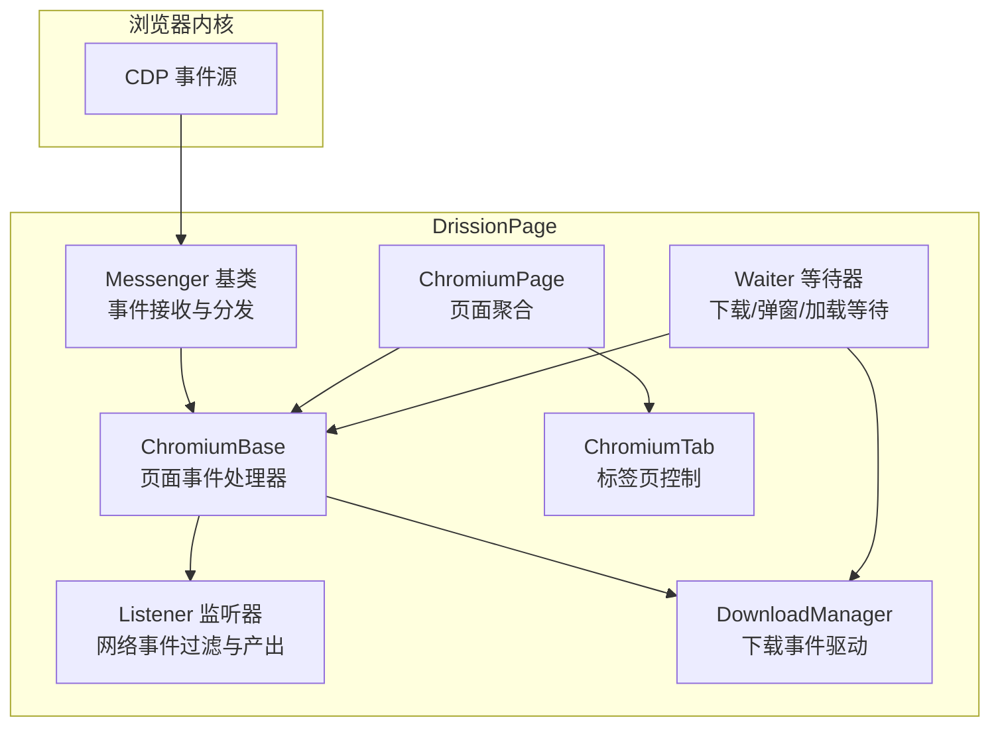
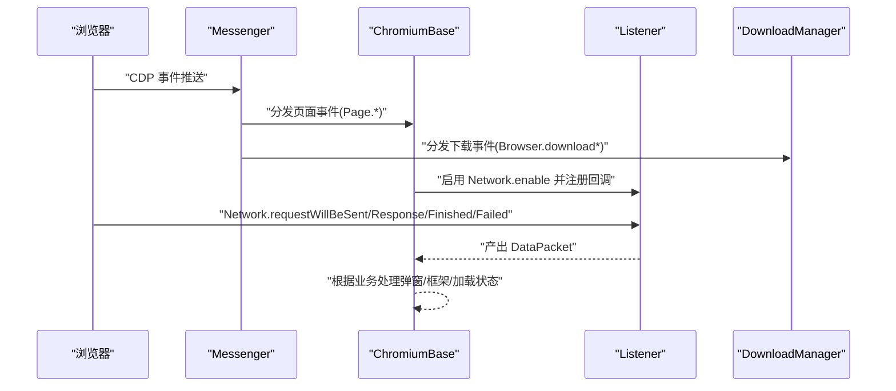
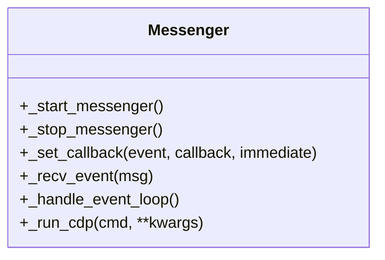
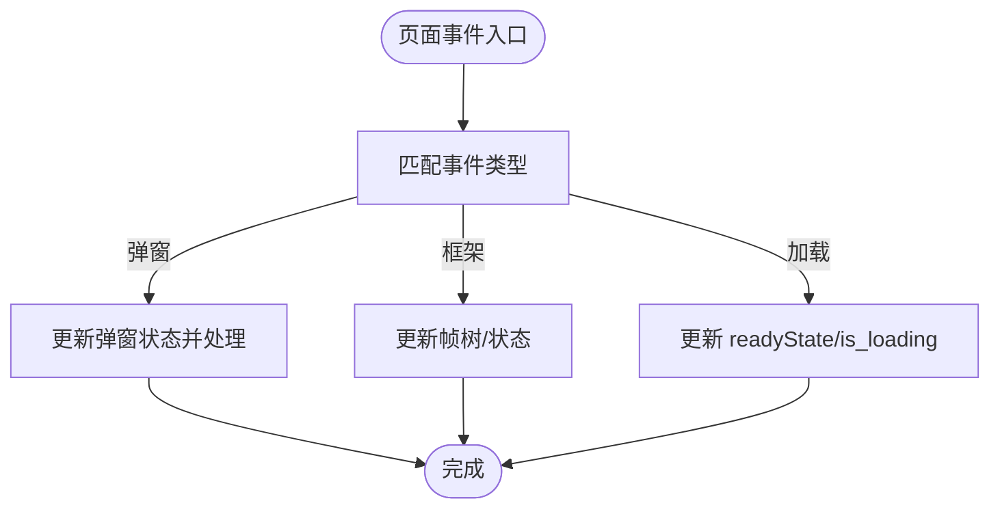
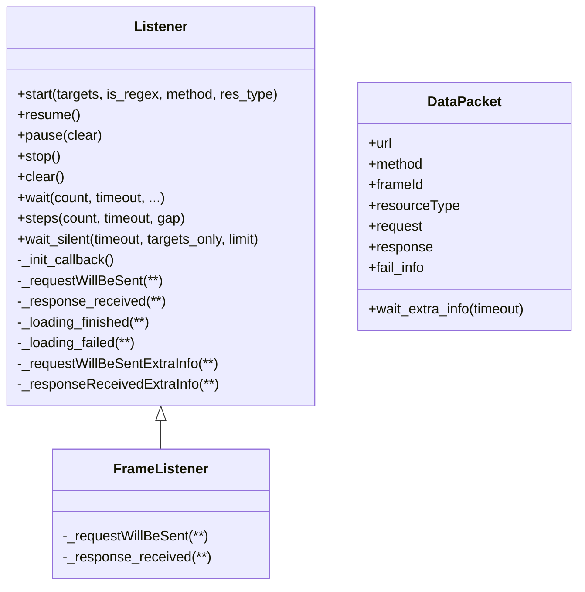
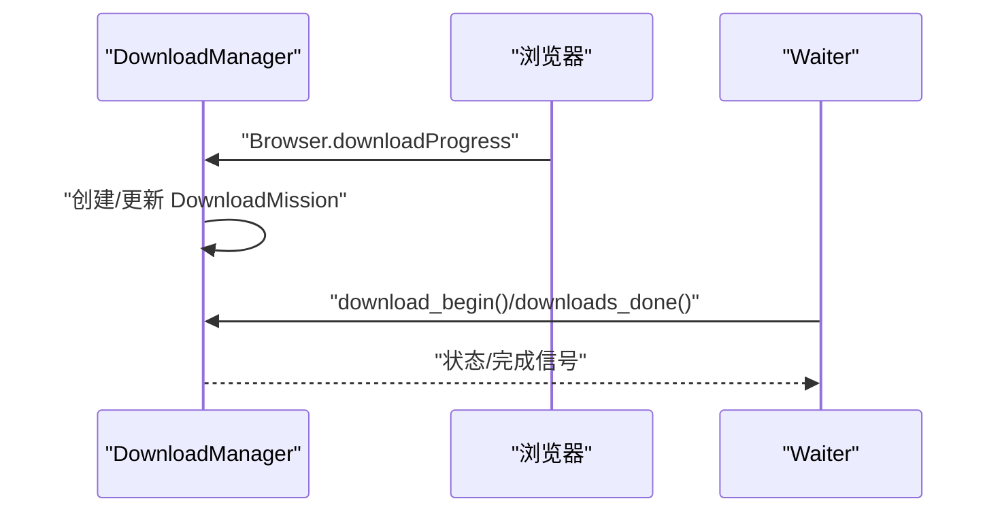
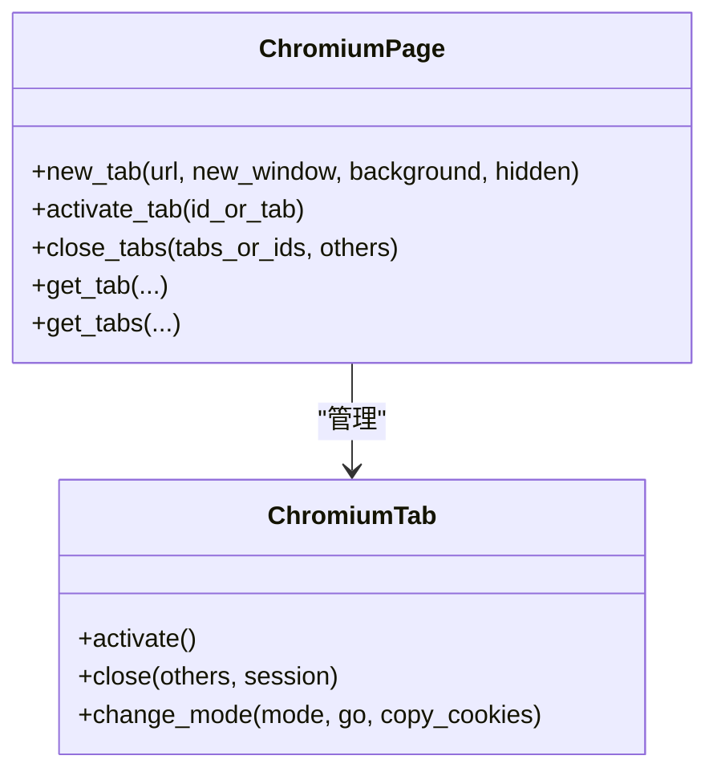
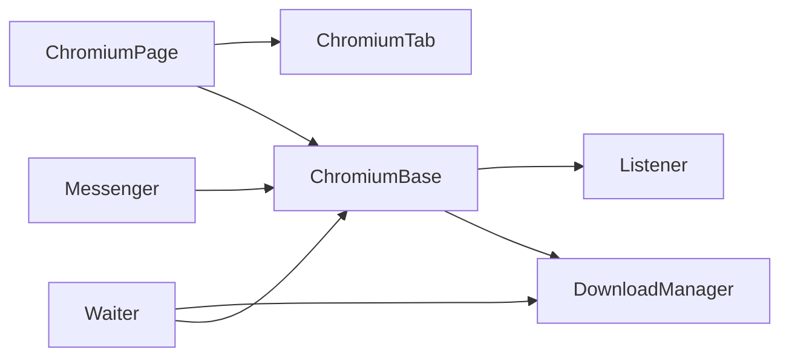

# 浏览器事件监听

<cite>
**本文引用的文件**
- [listener.py](file://DrissionPage/_units/listener.py)
- [chromium_base.py](file://DrissionPage/_pages/chromium_base.py)
- [chromium_page.py](file://DrissionPage/_pages/chromium_page.py)
- [chromium_tab.py](file://DrissionPage/_pages/chromium_tab.py)
- [base.py](file://DrissionPage/_base/base.py)
- [downloader.py](file://DrissionPage/_units/downloader.py)
- [waiter.py](file://DrissionPage/_units/waiter.py)
- [chromium.py](file://DrissionPage/_browsers/chromium.py)
</cite>

## 目录
1. [简介](#简介)
2. [项目结构与角色定位](#项目结构与角色定位)
3. [核心组件](#核心组件)
4. [架构总览](#架构总览)
5. [详细组件分析](#详细组件分析)
6. [依赖关系分析](#依赖关系分析)
7. [性能考量与优化建议](#性能考量与优化建议)
8. [故障排查指南](#故障排查指南)
9. [结论](#结论)

## 简介
本章节系统性阐述 DrissionPage 的浏览器事件监听机制，覆盖网络请求事件、页面生命周期事件、弹窗事件以及下载事件的监听与处理。文档从代码层面解析事件注册、回调分发、数据封装、等待与异步处理流程，并给出常见场景的实践建议与性能优化策略。

## 项目结构与角色定位
- 事件总线与分发：基于消息循环的事件接收与回调映射，负责将 CDP 事件派发到对应处理器。
- 页面与标签页：承载事件处理器与监听器实例，暴露统一的事件访问入口。
- 监听器：封装网络事件过滤、聚合与产出数据包；提供阻塞/非阻塞等待接口。
- 下载管理：通过浏览器事件驱动下载任务的创建、跟踪与完成通知。
- 等待器：提供下载、弹窗、页面加载等场景的等待与轮询能力。

图表来源
- [base.py:373-425](file://DrissionPage/_base/base.py#L373-L425)
- [chromium_base.py:39-96](file://DrissionPage/_pages/chromium_base.py#L39-L96)
- [chromium_page.py:17-40](file://DrissionPage/_pages/chromium_page.py#L17-L40)
- [chromium_tab.py:22-47](file://DrissionPage/_pages/chromium_tab.py#L22-L47)
- [listener.py:20-36](file://DrissionPage/_units/listener.py#L20-L36)
- [downloader.py:18-44](file://DrissionPage/_units/downloader.py#L18-L44)
- [waiter.py:52-82](file://DrissionPage/_units/waiter.py#L52-L82)

章节来源
- [base.py:373-425](file://DrissionPage/_base/base.py#L373-L425)
- [chromium_base.py:39-96](file://DrissionPage/_pages/chromium_base.py#L39-L96)
- [chromium_page.py:17-40](file://DrissionPage/_pages/chromium_page.py#L17-L40)
- [chromium_tab.py:22-47](file://DrissionPage/_pages/chromium_tab.py#L22-L47)
- [listener.py:20-36](file://DrissionPage/_units/listener.py#L20-L36)
- [downloader.py:18-44](file://DrissionPage/_units/downloader.py#L18-L44)
- [waiter.py:52-82](file://DrissionPage/_units/waiter.py#L52-L82)

## 核心组件
- 事件总线与分发（Messenger）：启动事件会话、维护事件回调表、区分即时事件与队列事件、守护线程循环处理。
- 页面事件处理器（ChromiumBase）：内置页面生命周期与弹窗事件处理器，连接浏览器、启用必要 CDP 模块。
- 监听器（Listener/FrameListener）：过滤网络请求事件，聚合请求/响应/失败信息，产出数据包供上层消费。
- 下载管理（DownloadManager）：订阅浏览器下载事件，构建下载任务，跟踪进度与完成状态。
- 等待器（Waiter）：提供下载开始、下载完成、弹窗出现/关闭、页面加载等等待接口。

章节来源
- [base.py:373-425](file://DrissionPage/_base/base.py#L373-L425)
- [chromium_base.py:39-96](file://DrissionPage/_pages/chromium_base.py#L39-L96)
- [listener.py:20-36](file://DrissionPage/_units/listener.py#L20-L36)
- [downloader.py:18-44](file://DrissionPage/_units/downloader.py#L18-L44)
- [waiter.py:52-82](file://DrissionPage/_units/waiter.py#L52-L82)

## 架构总览
DrissionPage 的事件监听采用“事件总线 + 页面处理器 + 监听器”的分层设计：
- 事件总线负责接收来自浏览器的 CDP 事件，按方法名路由到回调函数。
- 页面处理器注册页面级事件（如页面加载、弹窗、框架变化等），并可选择性启用网络监听。
- 监听器在需要时启用 Network.* 事件，按目标、方法、资源类型进行过滤，产出标准化的数据包。
- 下载管理器订阅浏览器下载事件，驱动下载任务生命周期。
- 等待器提供高层等待语义，简化业务逻辑。

图表来源
- [base.py:398-416](file://DrissionPage/_base/base.py#L398-L416)
- [chromium_base.py:71-96](file://DrissionPage/_pages/chromium_base.py#L71-L96)
- [listener.py:200-206](file://DrissionPage/_units/listener.py#L200-L206)
- [downloader.py:118-155](file://DrissionPage/_units/downloader.py#L118-L155)

章节来源
- [base.py:398-416](file://DrissionPage/_base/base.py#L398-L416)
- [chromium_base.py:71-96](file://DrissionPage/_pages/chromium_base.py#L71-L96)
- [listener.py:200-206](file://DrissionPage/_units/listener.py#L200-L206)
- [downloader.py:118-155](file://DrissionPage/_units/downloader.py#L118-L155)

## 详细组件分析

### 事件总线与分发（Messenger）
- 启动与停止：建立会话、启动守护线程、停止时断开会话。
- 回调注册：支持即时事件与普通事件，即时事件直接同步执行，普通事件进入队列后异步处理。
- CDP 调用：统一封装 CDP 请求，错误时按配置抛出异常或忽略。

图表来源
- [base.py:373-425](file://DrissionPage/_base/base.py#L373-L425)

章节来源
- [base.py:373-425](file://DrissionPage/_base/base.py#L373-L425)

### 页面事件处理器（ChromiumBase）
- 内置页面事件：javascriptDialogOpening/Closed、frameStartedLoading/Navigated/StoppedLoading、domContentEventFired/loadEventFired、frameAttached/Detached。
- 弹窗处理：自动接管弹窗，支持自动处理或手动处理。
- 加载状态：维护 readyState、is_loading、加载超时控制。
- 连接与初始化：启用 DOM/Page/Fetch 等模块，建立帧树，准备文档对象。

图表来源
- [chromium_base.py:71-96](file://DrissionPage/_pages/chromium_base.py#L71-L96)
- [chromium_base.py:168-206](file://DrissionPage/_pages/chromium_base.py#L168-L206)
- [chromium_base.py:718-744](file://DrissionPage/_pages/chromium_base.py#L718-L744)

章节来源
- [chromium_base.py:71-96](file://DrissionPage/_pages/chromium_base.py#L71-L96)
- [chromium_base.py:168-206](file://DrissionPage/_pages/chromium_base.py#L168-L206)
- [chromium_base.py:718-744](file://DrissionPage/_pages/chromium_base.py#L718-L744)

### 监听器（Listener/FrameListener）
- 目标过滤：支持目标 URL（字符串/列表/正则）、HTTP 方法集合、资源类型集合。
- 事件回调：注册 Network.requestWillBeSent/responseReceived/loadingFinished/loadingFailed/requestWillBeSentExtraInfo/responseReceivedExtraInfo。
- 数据包产出：将请求/响应/失败信息封装为 DataPacket，延迟取体、解码、合并额外信息。
- 控制接口：start/resume/pause/stop/clear/wait/steps/wait_silent。

图表来源
- [listener.py:20-36](file://DrissionPage/_units/listener.py#L20-L36)
- [listener.py:200-206](file://DrissionPage/_units/listener.py#L200-L206)
- [listener.py:323-334](file://DrissionPage/_units/listener.py#L323-L334)
- [listener.py:335-417](file://DrissionPage/_units/listener.py#L335-L417)

章节来源
- [listener.py:20-36](file://DrissionPage/_units/listener.py#L20-L36)
- [listener.py:78-116](file://DrissionPage/_units/listener.py#L78-L116)
- [listener.py:200-206](file://DrissionPage/_units/listener.py#L200-L206)
- [listener.py:323-334](file://DrissionPage/_units/listener.py#L323-L334)
- [listener.py:335-417](file://DrissionPage/_units/listener.py#L335-L417)

### 下载管理（DownloadManager）
- 事件驱动：订阅浏览器下载进度事件，生成下载任务并跟踪状态。
- 任务管理：维护全局与按标签页的任务集合，支持取消、等待、重命名与覆盖策略。
- 集成等待：等待下载开始/全部完成，支持超时与取消。

图表来源
- [downloader.py:18-44](file://DrissionPage/_units/downloader.py#L18-L44)
- [downloader.py:118-155](file://DrissionPage/_units/downloader.py#L118-L155)
- [waiter.py:52-82](file://DrissionPage/_units/waiter.py#L52-L82)

章节来源
- [downloader.py:18-44](file://DrissionPage/_units/downloader.py#L18-L44)
- [downloader.py:118-155](file://DrissionPage/_units/downloader.py#L118-L155)
- [waiter.py:52-82](file://DrissionPage/_units/waiter.py#L52-L82)

### 页面与标签页（ChromiumPage/ChromiumTab）
- 页面聚合：ChromiumPage 组合浏览器与标签页，提供标签页切换、新建、关闭等操作。
- 标签页控制：ChromiumTab 提供激活、关闭、模式切换等能力。
- 事件入口：页面对象暴露 listen 属性以获取监听器实例。

图表来源
- [chromium_page.py:82-96](file://DrissionPage/_pages/chromium_page.py#L82-L96)
- [chromium_tab.py:121-222](file://DrissionPage/_pages/chromium_tab.py#L121-L222)

章节来源
- [chromium_page.py:82-96](file://DrissionPage/_pages/chromium_page.py#L82-L96)
- [chromium_tab.py:121-222](file://DrissionPage/_pages/chromium_tab.py#L121-L222)

## 依赖关系分析
- ChromiumBase 继承自 BasePage 与 Messenger，内置页面事件处理器与监听器入口。
- Listener/FrameListener 依赖 ChromiumBase 的回调注册与 CDP 能力。
- DownloadManager 依赖浏览器事件与等待器的集成。
- Waiter 依赖 DownloadManager 与页面状态。

图表来源
- [chromium_base.py:265-269](file://DrissionPage/_pages/chromium_base.py#L265-L269)
- [chromium_page.py:33-40](file://DrissionPage/_pages/chromium_page.py#L33-L40)
- [chromium_tab.py:45-47](file://DrissionPage/_pages/chromium_tab.py#L45-L47)
- [downloader.py:18-44](file://DrissionPage/_units/downloader.py#L18-L44)
- [waiter.py:52-82](file://DrissionPage/_units/waiter.py#L52-L82)
- [base.py:373-425](file://DrissionPage/_base/base.py#L373-L425)

章节来源
- [chromium_base.py:265-269](file://DrissionPage/_pages/chromium_base.py#L265-L269)
- [chromium_page.py:33-40](file://DrissionPage/_pages/chromium_page.py#L33-L40)
- [chromium_tab.py:45-47](file://DrissionPage/_pages/chromium_tab.py#L45-L47)
- [downloader.py:18-44](file://DrissionPage/_units/downloader.py#L18-L44)
- [waiter.py:52-82](file://DrissionPage/_units/waiter.py#L52-L82)
- [base.py:373-425](file://DrissionPage/_base/base.py#L373-L425)

## 性能考量与优化建议
- 事件粒度控制
  - 使用监听器的目标过滤（URL/正则、方法、资源类型）缩小事件范围，减少无效数据包。
  - 在不需要时调用 pause 或 stop，避免持续占用 CDP 通道与内存。
- 异步与阻塞
  - 使用 steps/gap 批量消费事件，降低频繁阻塞带来的上下文切换成本。
  - 使用 wait_silent 在目标计数归零时再继续，避免空转。
- 数据包处理
  - DataPacket 延迟解析响应体与请求体，仅在需要时解码，避免不必要的 CPU 开销。
  - 合理设置超时，防止长时间阻塞导致资源泄漏。
- 下载与弹窗等待
  - 使用 Waiter 的超时与取消策略，避免无限等待。
  - 下载完成后及时清理任务，释放资源。
- 线程与队列
  - 事件队列为空时守护线程处于休眠状态，注意不要过度频繁地启停监听器。

章节来源
- [listener.py:78-116](file://DrissionPage/_units/listener.py#L78-L116)
- [listener.py:118-143](file://DrissionPage/_units/listener.py#L118-L143)
- [listener.py:175-191](file://DrissionPage/_units/listener.py#L175-L191)
- [downloader.py:270-294](file://DrissionPage/_units/downloader.py#L270-L294)
- [waiter.py:52-82](file://DrissionPage/_units/waiter.py#L52-L82)

## 故障排查指南
- 未在监听状态
  - 若调用 wait/steps 等接口而未启用监听，会抛出运行时错误。请先调用 start/resume。
- 等待超时
  - wait 支持超时与抛错策略，可根据配置决定抛出异常或返回 False。
- 下载路径缺失
  - 下载等待前需设置下载路径，否则会提示需要设置下载路径。
- 弹窗处理
  - 弹窗事件会自动更新状态，可通过 states.has_alert 或等待器 alert_closed 判断弹窗状态。
- 页面断开
  - 断开连接时，Messenger 会停止会话并清理资源；页面对象提供断开回调以便回收缓存。

章节来源
- [listener.py:88-116](file://DrissionPage/_units/listener.py#L88-L116)
- [waiter.py:52-82](file://DrissionPage/_units/waiter.py#L52-L82)
- [chromium_base.py:718-744](file://DrissionPage/_pages/chromium_base.py#L718-L744)
- [base.py:390-393](file://DrissionPage/_base/base.py#L390-L393)

## 结论
DrissionPage 的事件监听体系以 Messenger 为枢纽，ChromiumBase 为页面事件中枢，Listener 为网络事件过滤与产出者，DownloadManager 与 Waiter 提供下载与等待的高层抽象。通过合理的事件粒度控制、异步消费与超时策略，可在保证功能完整性的同时获得良好的性能表现。实际使用中建议结合业务场景选择合适的监听范围与等待策略，并在不需要时及时暂停或停止监听器，以降低资源占用。