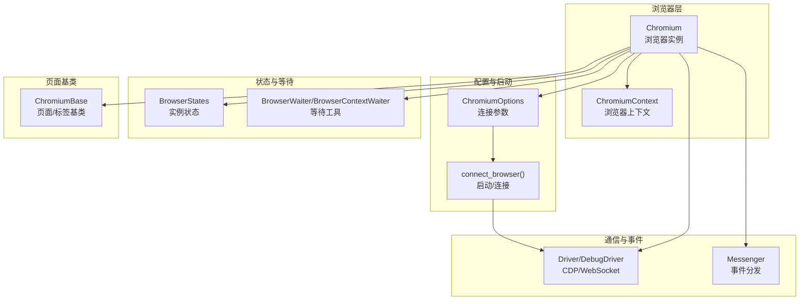
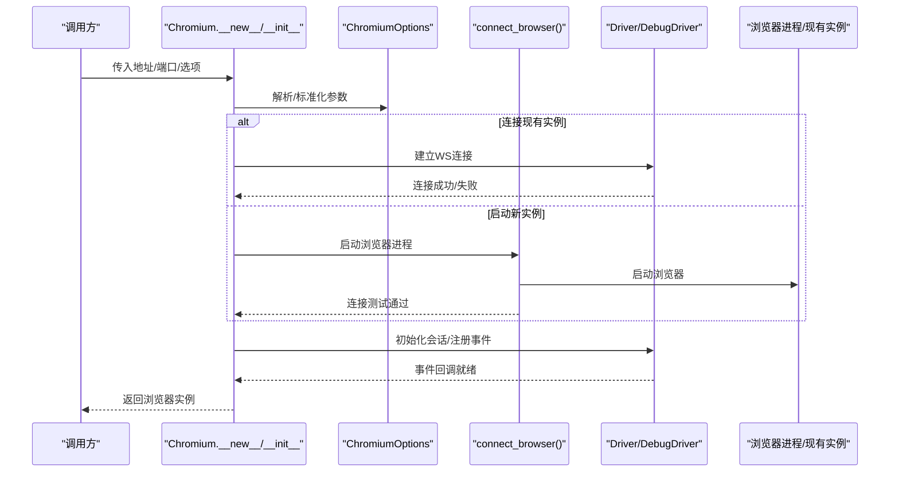
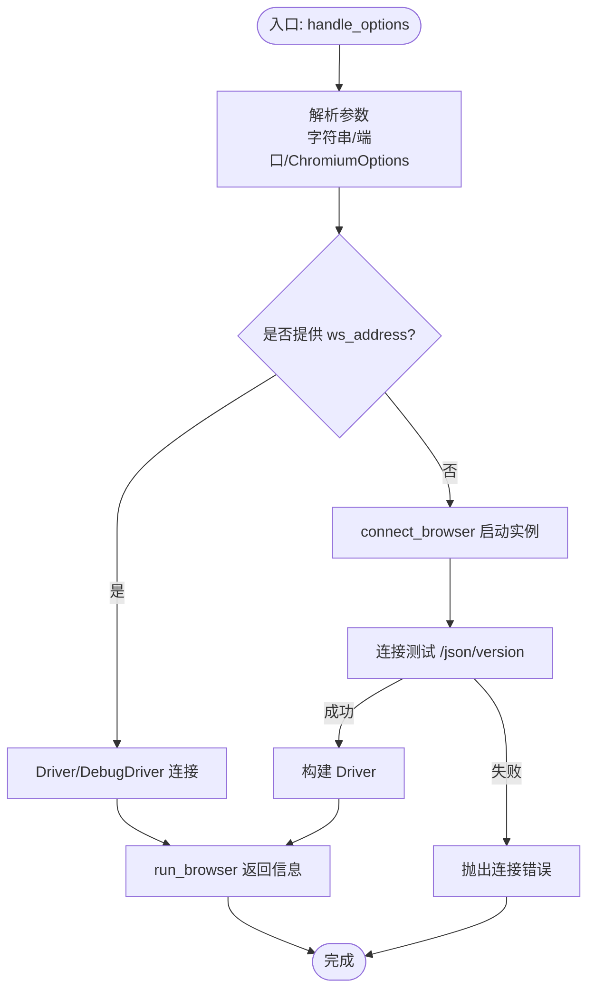
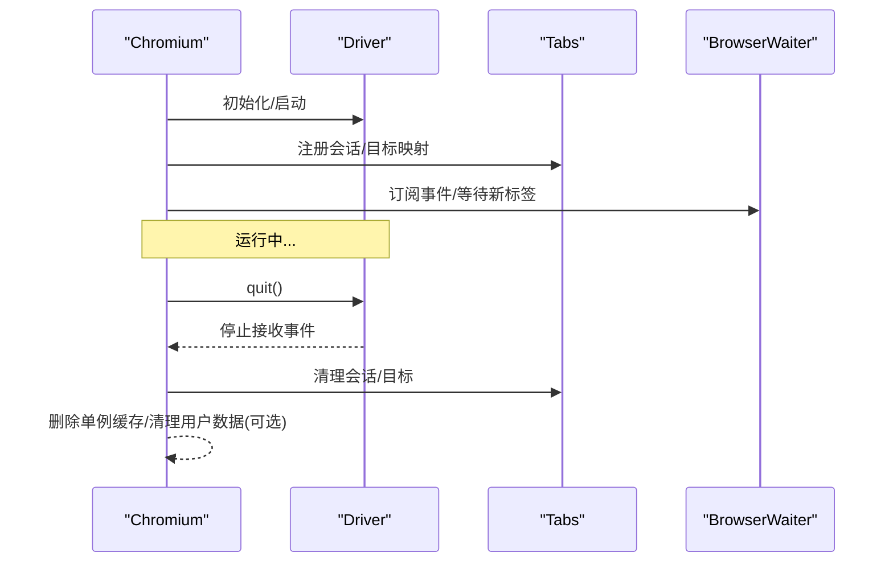
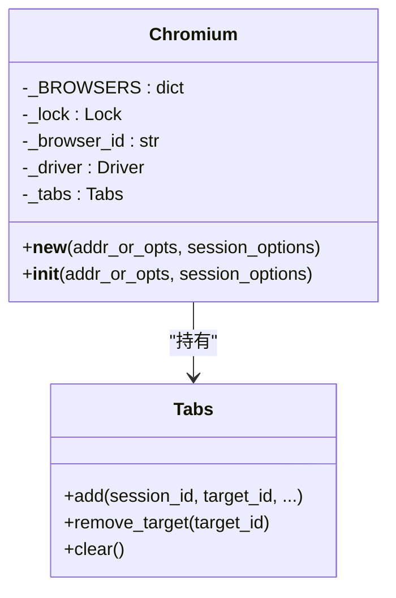
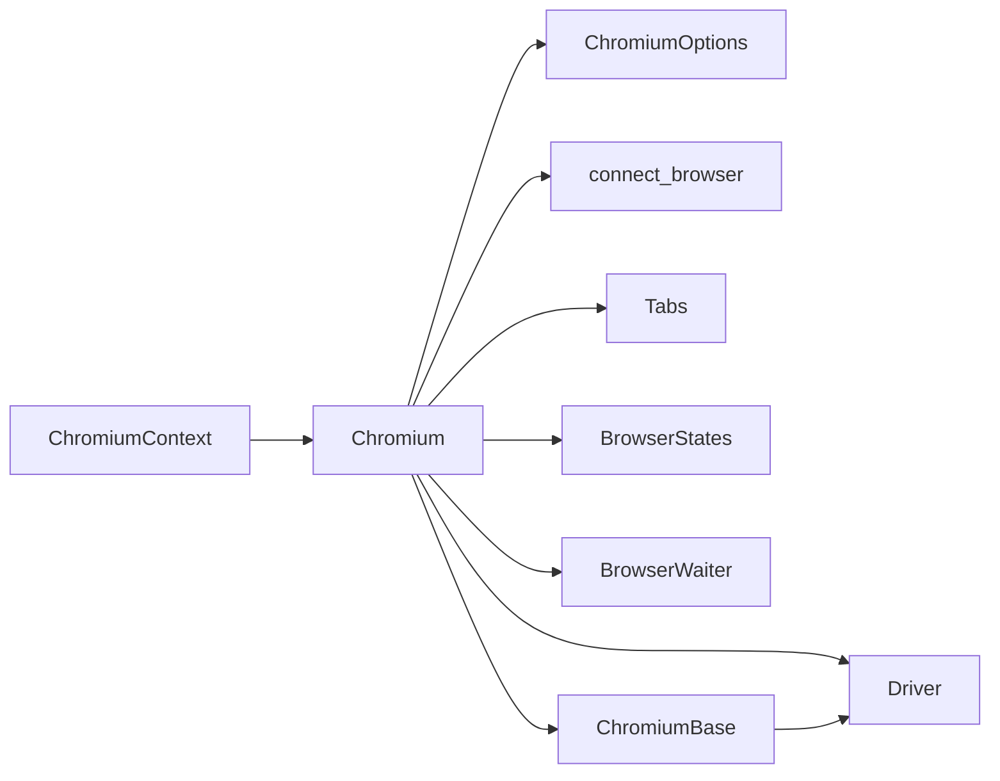

# 浏览器实例管理

<cite>
**本文引用的文件**
- [chromium.py](file://DrissionPage/_browsers/chromium.py)
- [chromium.pyi](file://DrissionPage/_browsers/chromium.pyi)
- [chromium_context.py](file://DrissionPage/_browsers/chromium_context.py)
- [chromium_context.pyi](file://DrissionPage/_browsers/chromium_context.pyi)
- [chromium_options.py](file://DrissionPage/_configs/chromium_options.py)
- [browser.py](file://DrissionPage/_functions/browser.py)
- [driver.py](file://DrissionPage/_base/driver.py)
- [base.py](file://DrissionPage/_base/base.py)
- [states.py](file://DrissionPage/_units/states.py)
- [waiter.py](file://DrissionPage/_units/waiter.py)
- [chromium_base.py](file://DrissionPage/_pages/chromium_base.py)
</cite>

## 目录
1. [简介](#简介)
2. [项目结构](#项目结构)
3. [核心组件](#核心组件)
4. [架构总览](#架构总览)
5. [详细组件分析](#详细组件分析)
6. [依赖关系分析](#依赖关系分析)
7. [性能考量](#性能考量)
8. [故障排查指南](#故障排查指南)
9. [结论](#结论)

## 简介
本节面向 DrissionPage 中 Chromium 类的浏览器实例管理能力，系统性阐述两类实例创建方式（连接现有浏览器与启动新浏览器）、生命周期管理（启动、连接、断开、销毁）、单例与多实例机制、连接参数配置、状态检测与健康检查，并给出最佳实践与常见问题解决方案。文档兼顾技术深度与可读性，适合不同背景读者快速上手与深入理解。

## 项目结构
围绕浏览器实例管理的关键模块如下：
- 浏览器类与上下文：Chromium、ChromiumContext
- 连接与启动：ChromiumOptions、browser.py 的 connect_browser
- 通信与事件：Driver/DebugDriver、Messenger
- 状态与等待：BrowserStates、BrowserWaiter、BrowserContextWaiter
- 页面基类：ChromiumBase（承载 CDP 会话、事件处理）

图表来源
- [chromium.py:33-127](file://DrissionPage/_browsers/chromium.py#L33-L127)
- [chromium_context.py:7-62](file://DrissionPage/_browsers/chromium_context.py#L7-L62)
- [chromium_options.py:16-165](file://DrissionPage/_configs/chromium_options.py#L16-L165)
- [browser.py:24-87](file://DrissionPage/_functions/browser.py#L24-L87)
- [driver.py:24-153](file://DrissionPage/_base/driver.py#L24-L153)
- [base.py:373-434](file://DrissionPage/_base/base.py#L373-L434)
- [states.py:92-112](file://DrissionPage/_units/states.py#L92-L112)
- [waiter.py:28-50](file://DrissionPage/_units/waiter.py#L28-L50)
- [chromium_base.py:39-96](file://DrissionPage/_pages/chromium_base.py#L39-L96)

章节来源
- [chromium.py:33-127](file://DrissionPage/_browsers/chromium.py#L33-L127)
- [chromium_context.py:7-62](file://DrissionPage/_browsers/chromium_context.py#L7-L62)
- [chromium_options.py:16-165](file://DrissionPage/_configs/chromium_options.py#L16-L165)
- [browser.py:24-87](file://DrissionPage/_functions/browser.py#L24-L87)
- [driver.py:24-153](file://DrissionPage/_base/driver.py#L24-L153)
- [base.py:373-434](file://DrissionPage/_base/base.py#L373-L434)
- [states.py:92-112](file://DrissionPage/_units/states.py#L92-L112)
- [waiter.py:28-50](file://DrissionPage/_units/waiter.py#L28-L50)
- [chromium_base.py:39-96](file://DrissionPage/_pages/chromium_base.py#L39-L96)

## 核心组件
- Chromium：浏览器实例主类，负责实例创建、连接、生命周期、事件分发、标签管理、上下文管理等。
- ChromiumContext：浏览器上下文封装，支持独立 Cookie/下载/代理等隔离环境。
- ChromiumOptions：浏览器连接与启动参数配置，支持地址、端口、调试模式、用户数据目录、扩展、偏好、标志等。
- connect_browser：根据配置决定连接现有浏览器或启动新浏览器，并进行连接测试。
- Driver/DebugDriver：基于 WebSocket 的 CDP 通信层，负责发送/接收消息、事件分发、断线处理。
- BrowserStates/BrowserWaiter：实例状态查询与等待工具，用于健康检查与异步等待。
- ChromiumBase：页面/标签基类，承载 CDP 会话、事件回调、文档加载状态等。

章节来源
- [chromium.py:33-127](file://DrissionPage/_browsers/chromium.py#L33-L127)
- [chromium_context.py:7-62](file://DrissionPage/_browsers/chromium_context.py#L7-L62)
- [chromium_options.py:16-165](file://DrissionPage/_configs/chromium_options.py#L16-L165)
- [browser.py:24-87](file://DrissionPage/_functions/browser.py#L24-L87)
- [driver.py:24-153](file://DrissionPage/_base/driver.py#L24-L153)
- [states.py:92-112](file://DrissionPage/_units/states.py#L92-L112)
- [waiter.py:28-50](file://DrissionPage/_units/waiter.py#L28-L50)
- [chromium_base.py:39-96](file://DrissionPage/_pages/chromium_base.py#L39-L96)

## 架构总览
下图展示浏览器实例从创建到运行的总体流程，涵盖参数解析、启动/连接、CDP 会话建立、事件订阅与生命周期管理。

图表来源
- [chromium.py:37-52](file://DrissionPage/_browsers/chromium.py#L37-L52)
- [chromium.py:491-542](file://DrissionPage/_browsers/chromium.py#L491-L542)
- [browser.py:24-87](file://DrissionPage/_functions/browser.py#L24-L87)
- [driver.py:120-132](file://DrissionPage/_base/driver.py#L120-L132)

章节来源
- [chromium.py:37-52](file://DrissionPage/_browsers/chromium.py#L37-L52)
- [chromium.py:491-542](file://DrissionPage/_browsers/chromium.py#L491-L542)
- [browser.py:24-87](file://DrissionPage/_functions/browser.py#L24-L87)
- [driver.py:120-132](file://DrissionPage/_base/driver.py#L120-L132)

## 详细组件分析

### 组件一：浏览器实例创建与连接模式
- 地址/端口连接现有浏览器
  - 支持传入字符串地址（含端口）或整型端口；内部转换为 ChromiumOptions 并尝试 WS 连接。
  - 若 ws_address 已显式提供，则直接使用该地址建立 Driver/DebugDriver。
  - 成功后解析浏览器 ID、是否无头、是否隐身模式、是否仅能用 WS 等信息。
- 启动新浏览器
  - 若未提供 ws_address，且地址可用或 existing_only 为真，则尝试启动新实例。
  - connect_browser 决定端口（自动端口或固定端口）、浏览器路径、用户数据目录、启动参数等。
  - 启动后进行连接测试，确保 /json 可访问并获取版本信息，再建立 Driver。
- 参数解析与校验
  - handle_options 将传入参数统一为 ChromiumOptions，支持字符串地址、端口、ChromiumOptions 对象等。
  - run_browser 在连接模式下直接建立 Driver，在启动模式下先启动进程再连接。

图表来源
- [chromium.py:473-488](file://DrissionPage/_browsers/chromium.py#L473-L488)
- [chromium.py:491-542](file://DrissionPage/_browsers/chromium.py#L491-L542)
- [browser.py:24-87](file://DrissionPage/_functions/browser.py#L24-L87)

章节来源
- [chromium.py:473-488](file://DrissionPage/_browsers/chromium.py#L473-L488)
- [chromium.py:491-542](file://DrissionPage/_browsers/chromium.py#L491-L542)
- [browser.py:24-87](file://DrissionPage/_functions/browser.py#L24-L87)

### 组件二：浏览器实例生命周期管理
- 启动阶段
  - __new__/__init__ 完成 Driver 初始化、事件订阅、Target 发现、下载管理器初始化、代理设置等。
  - 获取浏览器版本、进程 ID、设置默认上下文等。
- 运行阶段
  - 通过 Messenger 与 Driver 交互，订阅 Target 事件，维护 Tabs 会话映射。
  - 提供标签页管理（创建、获取、关闭、激活）与上下文管理（创建、关闭）。
- 断开与销毁
  - quit：关闭所有标签、触发 Browser.close、停止消息循环；对本地 127.0.0.1 实例可强制终止进程并清理临时用户数据。
  - reconnect：断开后重建 Driver 并重新订阅 Target。
  - _on_disconnect：断线回调，清理单例缓存、必要时删除用户数据目录。

图表来源
- [chromium.py:328-372](file://DrissionPage/_browsers/chromium.py#L328-L372)
- [chromium.py:314-320](file://DrissionPage/_browsers/chromium.py#L314-L320)
- [chromium.py:461-467](file://DrissionPage/_browsers/chromium.py#L461-L467)
- [chromium.py:565-684](file://DrissionPage/_browsers/chromium.py#L565-L684)
- [waiter.py:28-50](file://DrissionPage/_units/waiter.py#L28-L50)

章节来源
- [chromium.py:314-320](file://DrissionPage/_browsers/chromium.py#L314-L320)
- [chromium.py:328-372](file://DrissionPage/_browsers/chromium.py#L328-L372)
- [chromium.py:461-467](file://DrissionPage/_browsers/chromium.py#L461-L467)
- [chromium.py:565-684](file://DrissionPage/_browsers/chromium.py#L565-L684)
- [waiter.py:28-50](file://DrissionPage/_units/waiter.py#L28-L50)

### 组件三：单例与多实例管理机制
- 单例模式
  - Chromium 内部维护 _BROWSERS 字典与锁，按 browser_id 缓存实例，避免重复创建。
  - __new__ 中若同一 browser_id 已存在，直接返回缓存实例。
- 多实例管理
  - 通过不同的 ChromiumOptions（如不同端口、用户数据目录、隐身模式等）创建多个实例。
  - 每个实例拥有独立 Driver、Tabs、事件处理与上下文集合。

图表来源
- [chromium.py:33-52](file://DrissionPage/_browsers/chromium.py#L33-L52)
- [chromium.py:565-684](file://DrissionPage/_browsers/chromium.py#L565-L684)

章节来源
- [chromium.py:33-52](file://DrissionPage/_browsers/chromium.py#L33-L52)
- [chromium.py:565-684](file://DrissionPage/_browsers/chromium.py#L565-L684)

### 组件四：连接参数设置（地址、端口、调试模式等）
- 地址与端口
  - set_address：支持 http/ws/wss 地址，自动规范化为 address 与 ws_address。
  - set_local_port：设置本地端口，禁用自动端口。
  - auto_port：启用自动端口分配，范围可配置。
- 浏览器路径与用户数据
  - set_browser_path：设置浏览器可执行路径或使用 chrome/msedge。
  - set_user_data_path：设置用户数据目录，影响启动参数与偏好写入。
  - use_system_user_path：复制系统用户数据目录作为新环境。
- 启动参数与偏好
  - set_argument/remove_argument/add_extension/set_pref/set_flag/headless/incognito 等。
  - existing_only/new_env：控制连接策略与环境隔离。
- 超时与重试
  - set_timeouts/set_retry：设置 CDP/连接超时与重试策略。

章节来源
- [chromium_options.py:305-362](file://DrissionPage/_configs/chromium_options.py#L305-L362)
- [chromium_options.py:173-281](file://DrissionPage/_configs/chromium_options.py#L173-L281)
- [chromium_options.py:246-254](file://DrissionPage/_configs/chromium_options.py#L246-L254)
- [chromium_options.py:166-172](file://DrissionPage/_configs/chromium_options.py#L166-L172)

### 组件五：状态检测与健康检查
- 实例状态
  - BrowserStates.is_alive：基于 Driver.is_running 判断实例是否存活。
  - is_headless/is_existed/is_incognito：实例属性快照。
- 页面/元素状态
  - PageStates/ElementStates 提供页面加载、元素可见性、可点击性等状态判断。
- 等待工具
  - BrowserWaiter/BrowserContextWaiter 提供下载、新标签等等待逻辑。
  - ChromiumBase.wait 提供文档加载、URL/标题变化、元素可见性等等待。

章节来源
- [states.py:92-112](file://DrissionPage/_units/states.py#L92-L112)
- [chromium_base.py:240-304](file://DrissionPage/_pages/chromium_base.py#L240-L304)
- [waiter.py:28-50](file://DrissionPage/_units/waiter.py#L28-L50)

### 组件六：标签与上下文管理
- 标签管理
  - new_tab/get_tab/get_tabs/close_tabs/activate_tab 等接口。
  - _new_tab/_get_tab/_get_tabs 内部实现，支持隐身模式降级为 JS 打开新标签。
- 上下文管理
  - new_context 创建独立上下文，支持代理、自动关闭等。
  - ChromiumContext 封装上下文内的标签与等待/设置工具。

章节来源
- [chromium.py:235-298](file://DrissionPage/_browsers/chromium.py#L235-L298)
- [chromium.py:394-441](file://DrissionPage/_browsers/chromium.py#L394-L441)
- [chromium.py:211-234](file://DrissionPage/_browsers/chromium.py#L211-L234)
- [chromium_context.py:7-62](file://DrissionPage/_browsers/chromium_context.py#L7-L62)

## 依赖关系分析
- Chromium 依赖
  - ChromiumOptions：参数解析与启动配置
  - connect_browser：启动/连接逻辑
  - Driver/DebugDriver：CDP 通信
  - Messenger：事件分发
  - Tabs：会话/目标映射
  - BrowserStates/BrowserWaiter：状态与等待
  - ChromiumBase：页面/标签基类
- 关键耦合点
  - Chromium 与 Driver 的强耦合（会话 owner、事件回调）
  - Chromium 与 Tabs 的会话映射（target/session 映射）
  - Chromium 与 ChromiumContext 的上下文隔离

图表来源
- [chromium.py:15-30](file://DrissionPage/_browsers/chromium.py#L15-L30)
- [chromium_context.py:7-13](file://DrissionPage/_browsers/chromium_context.py#L7-L13)
- [chromium_base.py:39-43](file://DrissionPage/_pages/chromium_base.py#L39-L43)

章节来源
- [chromium.py:15-30](file://DrissionPage/_browsers/chromium.py#L15-L30)
- [chromium_context.py:7-13](file://DrissionPage/_browsers/chromium_context.py#L7-L13)
- [chromium_base.py:39-43](file://DrissionPage/_pages/chromium_base.py#L39-L43)

## 性能考量
- 自动端口与用户数据目录
  - auto_port 与 use_system_user_path/new_env 可减少磁盘 IO 与启动时间，但需注意资源占用与隔离需求。
- 会话与事件处理
  - Driver 的事件队列与线程模型保证低延迟响应；合理使用 wait 工具可避免忙轮询。
- 下载与缓存
  - 下载管理器与缓存清理接口可用于批量清理，降低内存与磁盘压力。
- 无头模式
  - headless 模式显著降低资源消耗，适合批量任务与 CI 环境。

[本节为通用指导，无需特定文件引用]

## 故障排查指南
- 连接失败
  - 端口占用：确认端口是否被占用，必要时启用 auto_port 或更换端口。
  - 浏览器不可控：检查 /json 是否可达，确认浏览器支持远程调试。
  - 权限/握手异常：检查 WebSocket 握手状态，必要时升级浏览器版本。
- 断线与重连
  - 使用 reconnect 重建 Driver；关注 _on_disconnect 回调中的清理逻辑。
- 进程残留
  - quit 时对本地实例可强制终止并清理用户数据目录；注意权限与平台差异。
- 等待超时
  - 调整超时设置（set_timeouts/set_retry），或使用更精确的等待工具（BrowserWaiter/BrowserContextWaiter）。

章节来源
- [browser.py:192-211](file://DrissionPage/_functions/browser.py#L192-L211)
- [driver.py:120-132](file://DrissionPage/_base/driver.py#L120-L132)
- [chromium.py:314-320](file://DrissionPage/_browsers/chromium.py#L314-L320)
- [chromium.py:328-372](file://DrissionPage/_browsers/chromium.py#L328-L372)
- [chromium.py:461-467](file://DrissionPage/_browsers/chromium.py#L461-L467)

## 结论
DrissionPage 的 Chromium 类通过清晰的参数体系、稳健的启动/连接流程、完善的事件与会话管理，提供了可靠的浏览器实例管理能力。结合单例与多实例机制、上下文隔离、状态与等待工具，既满足轻量脚本场景，也能支撑复杂业务的稳定运行。建议在生产环境中优先采用自动端口与隔离用户数据目录，配合合理的超时与重试策略，以获得更好的稳定性与可维护性。