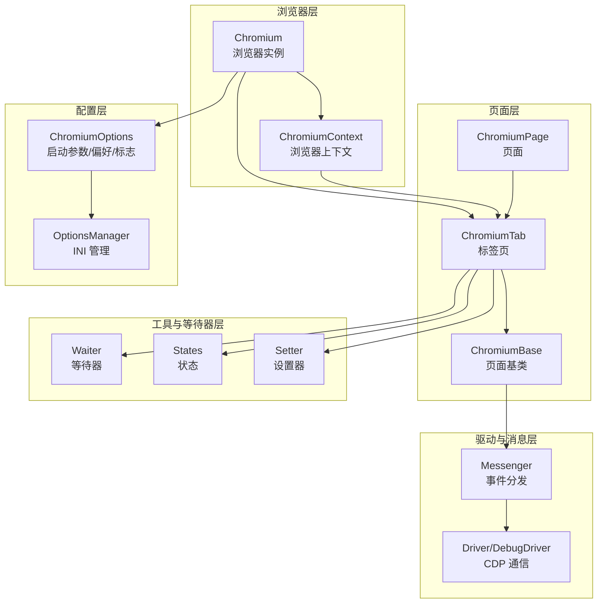
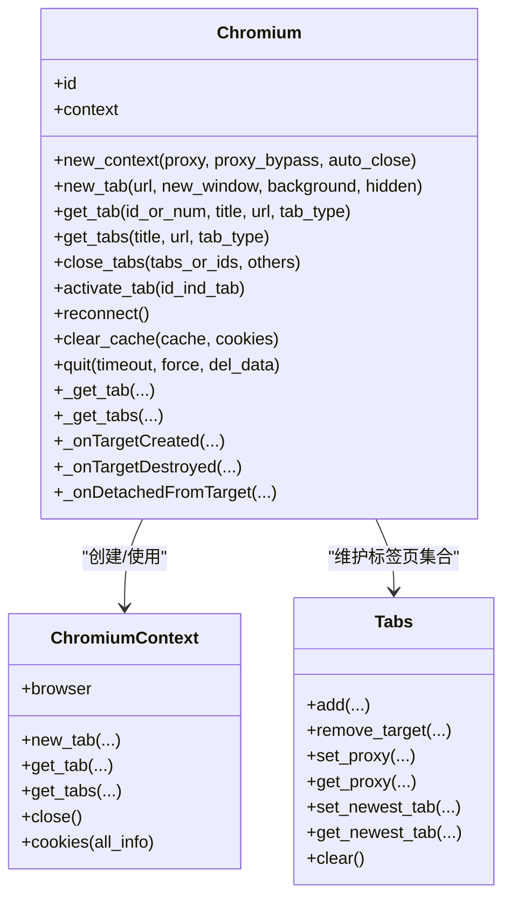
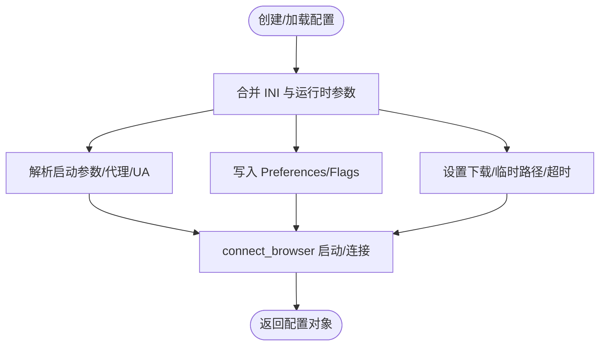
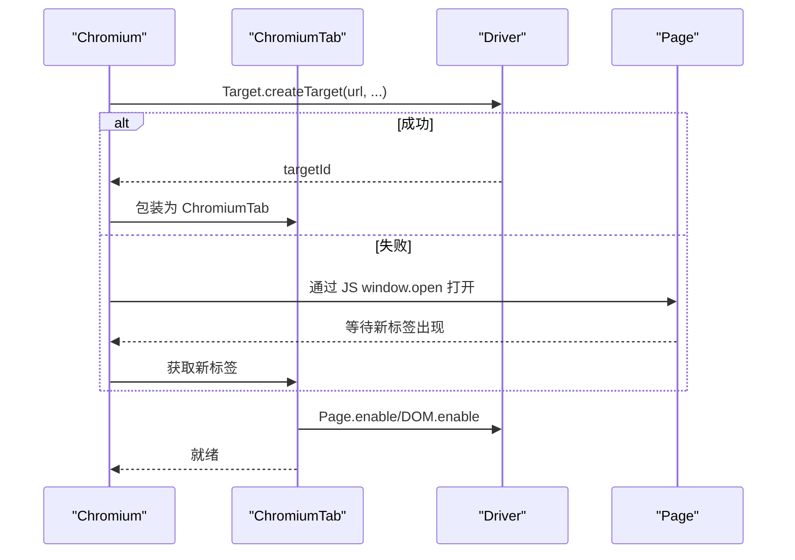
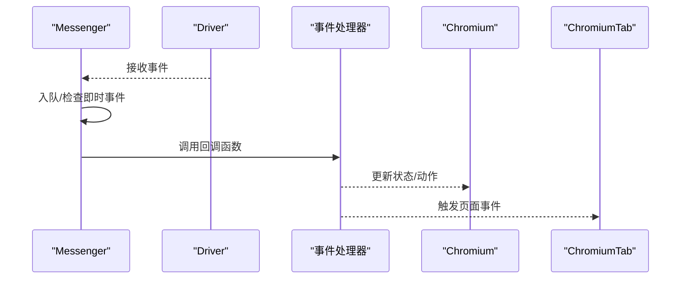
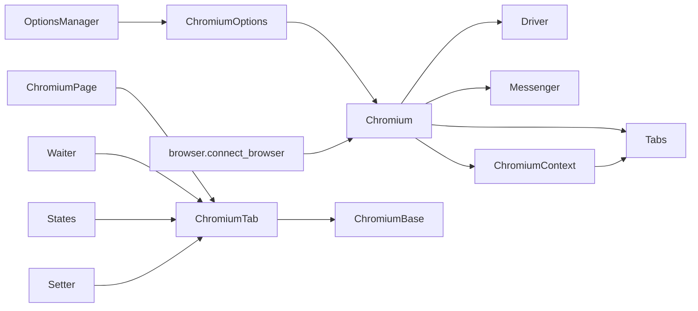

# 浏览器控制模块

<cite>
**本文引用的文件**
- [chromium.py](file://DrissionPage/_browsers/chromium.py)
- [chromium_context.py](file://DrissionPage/_browsers/chromium_context.py)
- [chromium_options.py](file://DrissionPage/_configs/chromium_options.py)
- [browser.py](file://DrissionPage/_functions/browser.py)
- [chromium_base.py](file://DrissionPage/_pages/chromium_base.py)
- [chromium_tab.py](file://DrissionPage/_pages/chromium_tab.py)
- [chromium_page.py](file://DrissionPage/_pages/chromium_page.py)
- [options_manage.py](file://DrissionPage/_configs/options_manage.py)
- [waiter.py](file://DrissionPage/_units/waiter.py)
- [states.py](file://DrissionPage/_units/states.py)
- [setter.py](file://DrissionPage/_units/setter.py)
- [driver.py](file://DrissionPage/_base/driver.py)
- [base.py](file://DrissionPage/_base/base.py)
</cite>

## 目录
1. [简介](#简介)
2. [项目结构](#项目结构)
3. [核心组件](#核心组件)
4. [架构总览](#架构总览)
5. [详细组件分析](#详细组件分析)
6. [依赖关系分析](#依赖关系分析)
7. [性能考量](#性能考量)
8. [故障排除指南](#故障排除指南)
9. [结论](#结论)
10. [附录](#附录)

## 简介
本文件系统性阐述 DrissionPage 的浏览器控制能力，聚焦 Chromium 类的使用与扩展，涵盖浏览器实例创建、配置与生命周期管理；启动参数与优化选项；上下文与用户数据隔离、隐私模式；窗口与标签页管理及并发操作；事件监听与回调机制；以及性能优化与故障排除建议。文档以代码为依据，配合图示帮助读者快速掌握从入门到进阶的使用方式。

## 项目结构
DrissionPage 将浏览器控制按职责拆分为“浏览器层”“页面层”“配置层”“工具与等待器层”“驱动与消息层”，形成清晰的分层架构：
- 浏览器层：Chromium 类负责浏览器实例、上下文、标签页集合与生命周期管理
- 页面层：ChromiumBase/ChromiumTab/ChromiumPage 提供页面与标签页能力
- 配置层：ChromiumOptions 与 OptionsManager 提供启动参数、偏好、标志、代理等配置
- 工具与等待器层：Waiter、States、Setter 提供等待、状态查询与设置能力
- 驱动与消息层：Driver/DebugDriver、Messenger 提供 CDP 通信与事件分发



图表来源
- [chromium.py:33-127](file://DrissionPage/_browsers/chromium.py#L33-L127)
- [chromium_context.py:7-62](file://DrissionPage/_browsers/chromium_context.py#L7-L62)
- [chromium_base.py:39-96](file://DrissionPage/_pages/chromium_base.py#L39-L96)
- [chromium_tab.py:22-47](file://DrissionPage/_pages/chromium_tab.py#L22-L47)
- [chromium_page.py:17-44](file://DrissionPage/_pages/chromium_page.py#L17-L44)
- [chromium_options.py:16-85](file://DrissionPage/_configs/chromium_options.py#L16-L85)
- [options_manage.py:15-46](file://DrissionPage/_configs/options_manage.py#L15-L46)
- [waiter.py:15-433](file://DrissionPage/_units/waiter.py#L15-L433)
- [states.py:92-182](file://DrissionPage/_units/states.py#L92-L182)
- [setter.py:21-619](file://DrissionPage/_units/setter.py#L21-L619)
- [driver.py:24-153](file://DrissionPage/_base/driver.py#L24-L153)
- [base.py:373-434](file://DrissionPage/_base/base.py#L373-L434)

章节来源
- [chromium.py:33-127](file://DrissionPage/_browsers/chromium.py#L33-L127)
- [chromium_options.py:16-85](file://DrissionPage/_configs/chromium_options.py#L16-L85)
- [options_manage.py:15-46](file://DrissionPage/_configs/options_manage.py#L15-L46)
- [driver.py:24-153](file://DrissionPage/_base/driver.py#L24-L153)
- [base.py:373-434](file://DrissionPage/_base/base.py#L373-L434)

## 核心组件
- Chromium：浏览器实例入口，负责启动/连接浏览器、维护会话、标签页集合、上下文、事件与生命周期
- ChromiumContext：浏览器上下文封装，支持独立 Cookie、代理、权限等隔离
- ChromiumBase/ChromiumTab/ChromiumPage：页面与标签页能力，提供导航、元素查找、等待、截图、下载等
- ChromiumOptions/OptionsManager：启动参数、偏好、标志、代理、超时等配置
- Driver/DebugDriver + Messenger：CDP 通信与事件分发
- Waiter/States/Setter：等待、状态查询、设置（超时、UA、下载、窗口等）

章节来源
- [chromium.py:33-127](file://DrissionPage/_browsers/chromium.py#L33-L127)
- [chromium_context.py:7-62](file://DrissionPage/_browsers/chromium_context.py#L7-L62)
- [chromium_base.py:39-96](file://DrissionPage/_pages/chromium_base.py#L39-L96)
- [chromium_tab.py:22-47](file://DrissionPage/_pages/chromium_tab.py#L22-L47)
- [chromium_page.py:17-44](file://DrissionPage/_pages/chromium_page.py#L17-L44)
- [chromium_options.py:16-85](file://DrissionPage/_configs/chromium_options.py#L16-L85)
- [options_manage.py:15-46](file://DrissionPage/_configs/options_manage.py#L15-L46)
- [waiter.py:15-433](file://DrissionPage/_units/waiter.py#L15-L433)
- [states.py:92-182](file://DrissionPage/_units/states.py#L92-L182)
- [setter.py:21-619](file://DrissionPage/_units/setter.py#L21-L619)
- [driver.py:24-153](file://DrissionPage/_base/driver.py#L24-L153)
- [base.py:373-434](file://DrissionPage/_base/base.py#L373-L434)

## 架构总览
Chromium 类通过 ChromiumOptions 决定启动行为，调用 connect_browser 生成启动参数并创建/连接浏览器，随后建立 Driver 与 Messenger，启用 Target/Page 等 CDP 模块，并注册事件处理器。每个标签页对应一个 ChromiumTab，内部持有 ChromiumBase，负责 DOM、网络、存储、控制等能力。

```mermaid
sequenceDiagram
participant U as "用户"
participant C as "Chromium"
participant OPT as "ChromiumOptions"
participant BF as "browser.connect_browser"
participant DR as "Driver"
participant MS as "Messenger"
participant TAB as "ChromiumTab"
U->>C : 初始化(地址/选项)
C->>OPT : 解析/合并配置
C->>BF : 启动/连接浏览器
BF-->>C : 返回启动参数/连接成功
C->>DR : 建立 WebSocket 连接
C->>MS : 启动消息循环/绑定会话
C->>TAB : 创建/获取标签页
TAB->>MS : 绑定事件处理器
TAB-->>U : 可进行导航/元素操作
```

图表来源
- [chromium.py:37-127](file://DrissionPage/_browsers/chromium.py#L37-L127)
- [browser.py:24-87](file://DrissionPage/_functions/browser.py#L24-L87)
- [driver.py:24-153](file://DrissionPage/_base/driver.py#L24-L153)
- [base.py:373-434](file://DrissionPage/_base/base.py#L373-L434)

章节来源
- [chromium.py:37-127](file://DrissionPage/_browsers/chromium.py#L37-L127)
- [browser.py:24-87](file://DrissionPage/_functions/browser.py#L24-L87)
- [driver.py:24-153](file://DrissionPage/_base/driver.py#L24-L153)
- [base.py:373-434](file://DrissionPage/_base/base.py#L373-L434)

## 详细组件分析

### Chromium 类：浏览器实例与生命周期
- 实例化与单例缓存：Chromium 使用类内字典缓存已创建实例，避免重复启动
- 启动/连接流程：handle_options 解析输入，run_browser 决策本地启动或远程连接，connect_browser 生成启动参数并创建/连接浏览器
- 会话与事件：初始化时启动 Messenger，绑定 Target/Page 等事件处理器，维护 Tabs 集合
- 上下文管理：支持默认上下文与新上下文创建，新上下文可独立设置代理、下载策略
- 标签页管理：提供 new_tab/get_tab/get_tabs/close_tabs/activate_tab 等接口
- 生命周期：quit 支持强制关闭、清理用户数据目录、进程回收；reconnect 支持断线重连



图表来源
- [chromium.py:33-127](file://DrissionPage/_browsers/chromium.py#L33-L127)
- [chromium.py:211-234](file://DrissionPage/_browsers/chromium.py#L211-L234)
- [chromium.py:235-298](file://DrissionPage/_browsers/chromium.py#L235-L298)
- [chromium.py:442-460](file://DrissionPage/_browsers/chromium.py#L442-L460)
- [chromium.py:565-684](file://DrissionPage/_browsers/chromium.py#L565-L684)
- [chromium_context.py:7-62](file://DrissionPage/_browsers/chromium_context.py#L7-L62)

章节来源
- [chromium.py:33-127](file://DrissionPage/_browsers/chromium.py#L33-L127)
- [chromium.py:211-298](file://DrissionPage/_browsers/chromium.py#L211-L298)
- [chromium.py:442-460](file://DrissionPage/_browsers/chromium.py#L442-L460)
- [chromium.py:565-684](file://DrissionPage/_browsers/chromium.py#L565-L684)
- [chromium_context.py:7-62](file://DrissionPage/_browsers/chromium_context.py#L7-L62)

### ChromiumOptions：启动参数与优化
- 参数来源：INI 文件（OptionsManager）与运行时参数合并
- 关键能力：
  - 启动参数：--headless/--user-agent/--proxy-server/--incognito 等
  - 偏好与标志：prefs/flags 写入用户数据目录
  - 地址与端口：自动端口、固定地址、WS 地址
  - 下载路径、临时路径、超时、重试
- 便捷方法：headless/no_imgs/no_js/mute/incognito/auto_port/set_user_agent/set_proxy/set_download_path 等



图表来源
- [chromium_options.py:16-85](file://DrissionPage/_configs/chromium_options.py#L16-L85)
- [chromium_options.py:290-339](file://DrissionPage/_configs/chromium_options.py#L290-L339)
- [chromium_options.py:340-358](file://DrissionPage/_configs/chromium_options.py#L340-L358)
- [chromium_options.py:364-408](file://DrissionPage/_configs/chromium_options.py#L364-L408)
- [options_manage.py:15-46](file://DrissionPage/_configs/options_manage.py#L15-L46)
- [browser.py:90-119](file://DrissionPage/_functions/browser.py#L90-L119)
- [browser.py:122-189](file://DrissionPage/_functions/browser.py#L122-L189)

章节来源
- [chromium_options.py:16-85](file://DrissionPage/_configs/chromium_options.py#L16-L85)
- [chromium_options.py:290-358](file://DrissionPage/_configs/chromium_options.py#L290-L358)
- [chromium_options.py:364-408](file://DrissionPage/_configs/chromium_options.py#L364-L408)
- [options_manage.py:15-46](file://DrissionPage/_configs/options_manage.py#L15-L46)
- [browser.py:90-189](file://DrissionPage/_functions/browser.py#L90-L189)

### 浏览器上下文与隐私模式
- 默认上下文：与浏览器实例关联，共享用户数据
- 新建上下文：Target.createBrowserContext，支持独立代理、下载行为
- 隐私模式：通过 --incognito/--inprivate 参数开启隐身上下文
- Cookie 隔离：不同上下文独立存储 Cookie，支持按上下文获取/清空

章节来源
- [chromium.py:211-234](file://DrissionPage/_browsers/chromium.py#L211-L234)
- [chromium_context.py:41-62](file://DrissionPage/_browsers/chromium_context.py#L41-L62)
- [chromium_options.py:277-281](file://DrissionPage/_configs/chromium_options.py#L277-L281)

### 窗口与标签页管理
- 标签页创建：优先使用 Target.createTarget，失败回退 JS 打开窗口
- 标签页选择：按 id/序号/title/url/tab_type 获取，支持最新标签
- 并发操作：Tabs 维护会话/目标映射，支持多标签并行
- 窗口控制：最大化/最小化/全屏/尺寸/位置，通过 Browser.setWindowBounds 控制



图表来源
- [chromium.py:235-298](file://DrissionPage/_browsers/chromium.py#L235-L298)
- [chromium.py:710-720](file://DrissionPage/_browsers/chromium.py#L710-L720)
- [chromium_base.py:103-125](file://DrissionPage/_pages/chromium_base.py#L103-L125)

章节来源
- [chromium.py:235-298](file://DrissionPage/_browsers/chromium.py#L235-L298)
- [chromium.py:710-720](file://DrissionPage/_browsers/chromium.py#L710-L720)
- [chromium_base.py:103-125](file://DrissionPage/_pages/chromium_base.py#L103-L125)

### 页面与标签页能力
- 导航与等待：get/post，支持超时与重试；等待文档加载/元素出现
- 元素查找：支持多种定位器，支持 Shadow DOM
- 截图：支持全页/区域/格式/质量
- 存储与 Cookie：支持 DOMStorage、Network/Cookie 清理
- 对话框：自动处理 alert/prompt/confirm
- 窗口与滚动：窗口状态与尺寸控制，平滑滚动

章节来源
- [chromium_base.py:403-426](file://DrissionPage/_pages/chromium_base.py#L403-L426)
- [chromium_base.py:444-513](file://DrissionPage/_pages/chromium_base.py#L444-L513)
- [chromium_base.py:643-647](file://DrissionPage/_pages/chromium_base.py#L643-L647)
- [chromium_base.py:664-682](file://DrissionPage/_pages/chromium_base.py#L664-L682)
- [chromium_base.py:718-744](file://DrissionPage/_pages/chromium_base.py#L718-L744)
- [chromium_base.py:816-893](file://DrissionPage/_pages/chromium_base.py#L816-L893)
- [chromium_tab.py:124-142](file://DrissionPage/_pages/chromium_tab.py#L124-L142)
- [setter.py:553-619](file://DrissionPage/_units/setter.py#L553-L619)

### 事件监听与回调机制
- 事件注册：Messenger 维护事件处理器与队列，支持即时事件与异步事件
- 浏览器事件：Target.*、Page.* 等，Chromium 内部注册 _onTargetCreated/_onTargetDestroyed/_onDetachedFromTarget
- 页面事件：javascriptDialogOpening/Closed、frameStartedLoading/Navigated/StoppedLoading、domContentEventFired/loadEventFired 等
- 回调触发：事件到达后派发至对应处理器，支持立即回调与队列处理



图表来源
- [base.py:373-434](file://DrissionPage/_base/base.py#L373-L434)
- [chromium.py:76-79](file://DrissionPage/_browsers/chromium.py#L76-L79)
- [chromium.py:442-460](file://DrissionPage/_browsers/chromium.py#L442-L460)
- [chromium_base.py:71-96](file://DrissionPage/_pages/chromium_base.py#L71-L96)

章节来源
- [base.py:373-434](file://DrissionPage/_base/base.py#L373-L434)
- [chromium.py:76-79](file://DrissionPage/_browsers/chromium.py#L76-L79)
- [chromium.py:442-460](file://DrissionPage/_browsers/chromium.py#L442-L460)
- [chromium_base.py:71-96](file://DrissionPage/_pages/chromium_base.py#L71-L96)

### 驱动与消息层：CDP 通信
- Driver：建立 WebSocket 连接，发送/接收消息，维护会话所有者映射
- DebugDriver：增强调试输出，可按方法过滤
- Messenger：统一事件分发，错误包装与重试策略

章节来源
- [driver.py:24-153](file://DrissionPage/_base/driver.py#L24-L153)
- [driver.py:165-217](file://DrissionPage/_base/driver.py#L165-L217)
- [base.py:373-434](file://DrissionPage/_base/base.py#L373-L434)

## 依赖关系分析
- Chromium 依赖 ChromiumOptions/OptionsManager/浏览器进程/Driver/Messenger/Tabs
- ChromiumContext 依赖 Chromium 与上下文 ID
- ChromiumTab/ChromiumPage 依赖 ChromiumBase 与 SessionPage
- Waiter/States/Setter 依赖各组件暴露的属性与方法
- Driver/Messenger 作为底层通信与事件中枢



图表来源
- [chromium.py:37-127](file://DrissionPage/_browsers/chromium.py#L37-L127)
- [chromium_options.py:16-85](file://DrissionPage/_configs/chromium_options.py#L16-L85)
- [options_manage.py:15-46](file://DrissionPage/_configs/options_manage.py#L15-L46)
- [browser.py:24-87](file://DrissionPage/_functions/browser.py#L24-L87)
- [chromium_tab.py:22-47](file://DrissionPage/_pages/chromium_tab.py#L22-L47)
- [chromium_page.py:17-44](file://DrissionPage/_pages/chromium_page.py#L17-L44)
- [waiter.py:15-433](file://DrissionPage/_units/waiter.py#L15-L433)
- [states.py:92-182](file://DrissionPage/_units/states.py#L92-L182)
- [setter.py:21-619](file://DrissionPage/_units/setter.py#L21-L619)

章节来源
- [chromium.py:37-127](file://DrissionPage/_browsers/chromium.py#L37-L127)
- [chromium_options.py:16-85](file://DrissionPage/_configs/chromium_options.py#L16-L85)
- [options_manage.py:15-46](file://DrissionPage/_configs/options_manage.py#L15-L46)
- [browser.py:24-87](file://DrissionPage/_functions/browser.py#L24-L87)
- [chromium_tab.py:22-47](file://DrissionPage/_pages/chromium_tab.py#L22-L47)
- [chromium_page.py:17-44](file://DrissionPage/_pages/chromium_page.py#L17-L44)
- [waiter.py:15-433](file://DrissionPage/_units/waiter.py#L15-L433)
- [states.py:92-182](file://DrissionPage/_units/states.py#L92-L182)
- [setter.py:21-619](file://DrissionPage/_units/setter.py#L21-L619)

## 性能考量
- 减少资源消耗
  - 无头模式：使用 headless(true) 降低内存与 CPU 开销
  - 禁用图片/脚本：no_imgs/on_no_js 在弱机或高并发场景显著节省带宽与渲染时间
  - 静音：mute(true) 避免音频事件干扰
- 启动参数优化
  - 自动端口：auto_port(true) 避免端口冲突，便于多实例并行
  - 用户数据隔离：独立 user_data_path 避免共享缓存带来的竞争
  - 系统用户路径：use_system_user_path(true) 可直接复用系统配置
- 等待与超时
  - 合理设置 timeouts.base/page_load/script，避免过长阻塞
  - 使用 wait.eles_loaded 等等待器减少轮询
- 并发与会话
  - 多上下文/多标签并行，注意资源上限与限速
  - 合理使用 clear_cache/clear_cookies 避免缓存膨胀

## 故障排除指南
- 连接问题
  - 远程地址不可达：确认 address/ws_address 正确，检查防火墙与端口占用
  - 连接被拒绝：检查浏览器是否以 --remote-debugging-port 启动
  - 断线重连：使用 reconnect() 恢复会话
- 启动失败
  - 浏览器路径：确保 browser_path 指向可执行文件或系统可发现路径
  - 用户数据目录：权限不足或被占用时清理或更换路径
- 页面加载卡住
  - 调整 load_mode 到 eager 或 none，或手动 stop_loading()
  - 检查 blocked_urls 与网络拦截
- 对话框处理
  - 自动处理：set.auto_handle_alert(true, accept=True/False) 或 prompt 文本
  - 手动处理：wait.alert_closed() 等待关闭
- 下载问题
  - 必须设置 download_path，否则下载等待器会报错
  - 多标签下载：使用 wait.downloads_done()/download_begin() 按标签区分

章节来源
- [driver.py:120-153](file://DrissionPage/_base/driver.py#L120-L153)
- [chromium.py:314-320](file://DrissionPage/_browsers/chromium.py#L314-L320)
- [browser.py:24-87](file://DrissionPage/_functions/browser.py#L24-L87)
- [chromium_base.py:718-744](file://DrissionPage/_pages/chromium_base.py#L718-L744)
- [waiter.py:52-83](file://DrissionPage/_units/waiter.py#L52-L83)
- [waiter.py:237-276](file://DrissionPage/_units/waiter.py#L237-L276)

## 结论
DrissionPage 的浏览器控制模块以 Chromium 为核心，结合配置、驱动与工具层，提供了从启动、上下文隔离、标签页并发到事件监听与性能优化的完整能力。通过合理设置启动参数与等待策略，可在保证稳定性的同时提升运行效率。遇到问题时，可依据连接、启动、加载、下载与对话框等维度逐步排查。

## 附录
- 常用配置示例（以方法调用形式）
  - 无头模式：ChromiumOptions.headless(True)
  - 代理设置：ChromiumOptions.set_proxy("http://host:port[;https://...]")，或在新上下文中传入
  - 用户代理：ChromiumOptions.set_user_agent("...") 或在页面层 set.user_agent("...")
  - 自动端口：ChromiumOptions.auto_port(True)，或 set_local_port/set_address
  - 隐身模式：ChromiumOptions.incognito(True)
  - 禁用图片/脚本：ChromiumOptions.no_imgs(True)/no_js(True)
  - 静音：ChromiumOptions.mute(True)
  - 下载路径：ChromiumOptions.set_download_path("...")

章节来源
- [chromium_options.py:261-297](file://DrissionPage/_configs/chromium_options.py#L261-L297)
- [chromium_options.py:305-339](file://DrissionPage/_configs/chromium_options.py#L305-L339)
- [chromium_options.py:340-358](file://DrissionPage/_configs/chromium_options.py#L340-L358)
- [setter.py:146-165](file://DrissionPage/_units/setter.py#L146-L165)
- [setter.py:182-191](file://DrissionPage/_units/setter.py#L182-L191)