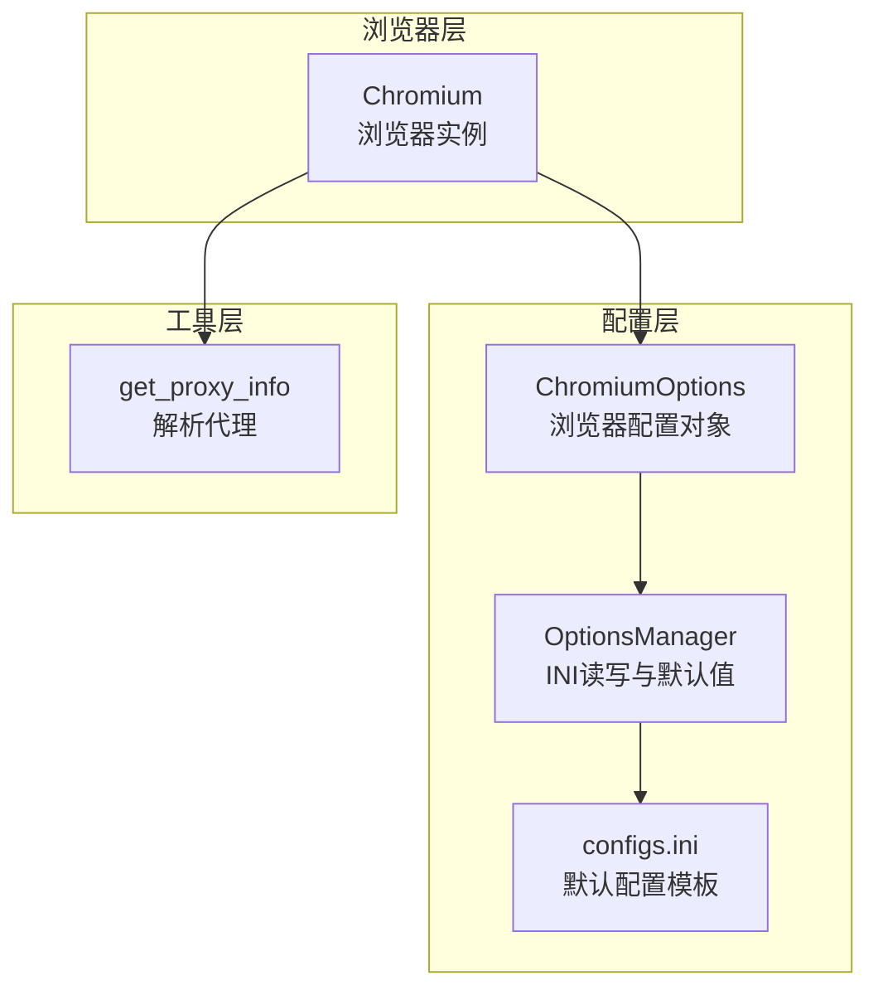
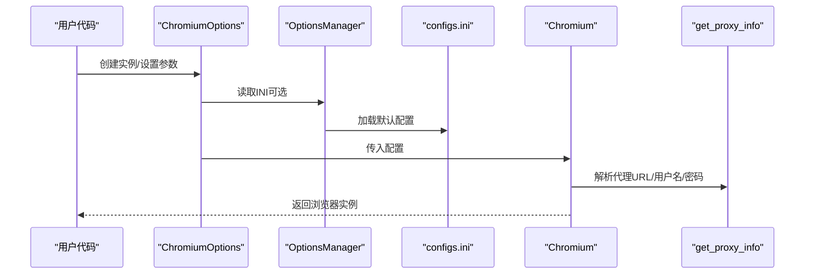
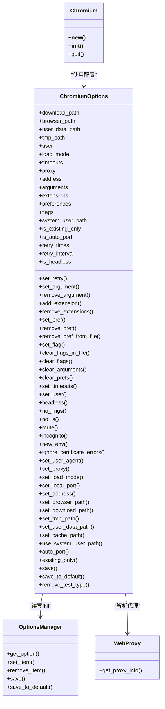

# 浏览器配置选项

<cite>
**本文引用的文件列表**
- [chromium_options.py](file://DrissionPage/_configs/chromium_options.py)
- [options_manage.py](file://DrissionPage/_configs/options_manage.py)
- [configs.ini](file://DrissionPage/_configs/configs.ini)
- [chromium.py](file://DrissionPage/_browsers/chromium.py)
- [web.py](file://DrissionPage/_functions/web.py)
- [session_options.py](file://DrissionPage/_configs/session_options.py)
</cite>

## 目录
1. [简介](#简介)
2. [项目结构](#项目结构)
3. [核心组件](#核心组件)
4. [架构总览](#架构总览)
5. [详细组件分析](#详细组件分析)
6. [依赖关系分析](#依赖关系分析)
7. [性能考量](#性能考量)
8. [故障排查指南](#故障排查指南)
9. [结论](#结论)
10. [附录](#附录)

## 简介
本文件系统性介绍 DrissionPage 的浏览器配置体系，重点围绕 ChromiumOptions 类展开，涵盖启动参数、用户数据路径、代理设置、无头模式、偏好与标志、超时与重试、下载与临时目录、端口与地址、扩展与加载模式等配置项，并解释配置来源与优先级（构造函数参数、运行时 set_* 方法、配置文件），以及配置验证与错误处理机制。同时提供常见场景的配置组合建议：开发调试、生产部署、性能优化等。

## 项目结构
与浏览器配置相关的核心模块如下：
- 配置定义与管理
  - ChromiumOptions：浏览器配置对象，提供丰富的 set_* 方法与属性访问
  - OptionsManager：INI 配置读写与默认值初始化
  - configs.ini：默认配置文件模板
- 浏览器启动与连接
  - Chromium：浏览器实例，负责启动或连接已有浏览器，应用配置
- 工具与辅助
  - web.get_proxy_info：解析代理字符串为 URL、用户名、密码
  - SessionOptions：会话层配置（与 ChromiumOptions 并行存在）

图表来源
- [chromium_options.py:16-85](file://DrissionPage/_configs/chromium_options.py#L16-L85)
- [options_manage.py:15-78](file://DrissionPage/_configs/options_manage.py#L15-L78)
- [configs.ini:1-34](file://DrissionPage/_configs/configs.ini#L1-L34)
- [chromium.py:33-127](file://DrissionPage/_browsers/chromium.py#L33-L127)
- [web.py:321-348](file://DrissionPage/_functions/web.py#L321-L348)

章节来源
- [chromium_options.py:16-85](file://DrissionPage/_configs/chromium_options.py#L16-L85)
- [options_manage.py:15-78](file://DrissionPage/_configs/options_manage.py#L15-L78)
- [configs.ini:1-34](file://DrissionPage/_configs/configs.ini#L1-L34)
- [chromium.py:33-127](file://DrissionPage/_browsers/chromium.py#L33-L127)
- [web.py:321-348](file://DrissionPage/_functions/web.py#L321-L348)

## 核心组件
- ChromiumOptions
  - 职责：集中管理 Chromium 启动参数、用户数据路径、代理、偏好、标志、超时、重试、下载与临时目录、端口与地址、扩展、加载模式等
  - 特点：支持从配置文件读取默认值；支持运行时动态 set_* 修改；支持保存到配置文件
- OptionsManager
  - 职责：INI 文件读取、默认值初始化、键值存取、保存
  - 特点：自动创建默认配置节与默认值；支持保存到指定路径
- configs.ini
  - 职责：提供默认配置模板，包含 paths、chromium_options、session_options、timeouts、proxies、others 等节
- Chromium
  - 职责：根据配置启动或连接浏览器，应用配置（如代理、下载路径、超时、重试）
- web.get_proxy_info
  - 职责：解析代理字符串，拆分为 URL、用户名、密码
- SessionOptions
  - 职责：HTTP 会话层配置（与 ChromiumOptions 并行存在），可与 ChromiumOptions 协同工作

章节来源
- [chromium_options.py:16-417](file://DrissionPage/_configs/chromium_options.py#L16-L417)
- [options_manage.py:15-143](file://DrissionPage/_configs/options_manage.py#L15-L143)
- [configs.ini:1-34](file://DrissionPage/_configs/configs.ini#L1-L34)
- [chromium.py:33-127](file://DrissionPage/_browsers/chromium.py#L33-L127)
- [web.py:321-348](file://DrissionPage/_functions/web.py#L321-L348)
- [session_options.py:20-372](file://DrissionPage/_configs/session_options.py#L20-L372)

## 架构总览
ChromiumOptions 作为配置中心，被 Chromium 在启动或连接时消费。OptionsManager 提供 INI 读写能力，configs.ini 提供默认模板。web.get_proxy_info 用于解析代理字符串，Chromium 在需要时调用它以提取代理 URL、用户名、密码。

图表来源
- [chromium_options.py:16-85](file://DrissionPage/_configs/chromium_options.py#L16-L85)
- [options_manage.py:15-78](file://DrissionPage/_configs/options_manage.py#L15-L78)
- [configs.ini:1-34](file://DrissionPage/_configs/configs.ini#L1-L34)
- [chromium.py:33-127](file://DrissionPage/_browsers/chromium.py#L33-L127)
- [web.py:321-348](file://DrissionPage/_functions/web.py#L321-L348)

## 详细组件分析

### ChromiumOptions 配置项与方法
- 基础属性
  - 下载路径、浏览器路径、用户数据路径、临时路径、用户档案、加载模式、超时、代理、地址、启动参数、扩展、偏好、标志、系统用户路径、仅连接现有、新环境、自动端口、重试次数与间隔、是否无头
- 关键方法
  - set_retry、set_argument、remove_argument、add_extension、remove_extensions、set_pref、remove_pref、remove_pref_from_file、set_flag、clear_flags_in_file、clear_flags、clear_arguments、clear_prefs、set_timeouts、set_user、headless、no_imgs、no_js、mute、incognito、new_env、ignore_certificate_errors、set_user_agent、set_proxy、set_load_mode、set_local_port、set_address、set_browser_path、set_download_path、set_tmp_path、set_user_data_path、set_cache_path、use_system_user_path、auto_port、existing_only、save、save_to_default、remove_test_type
- 配置来源与优先级
  - 构造函数参数：优先于配置文件
  - 运行时 set_* 方法：覆盖构造函数与配置文件
  - 配置文件（configs.ini）：默认值来源
- 验证与错误处理
  - set_load_mode 对值进行校验，非法值抛出异常
  - set_proxy 使用 get_proxy_info 解析代理，内部逻辑保证 URL、用户名、密码正确提取
  - 未找到 INI 文件时抛出异常
  - 保存配置时若目标路径不存在，会自动创建父目录

章节来源
- [chromium_options.py:16-417](file://DrissionPage/_configs/chromium_options.py#L16-L417)
- [web.py:321-348](file://DrissionPage/_functions/web.py#L321-L348)

### OptionsManager 与 configs.ini
- OptionsManager
  - 初始化时可选择默认路径、自定义路径或不读取文件
  - 自动创建默认配置节与默认值（如 arguments、extensions、prefs、flags、load_mode、timeouts、proxies、others 等）
  - 提供 get_option、set_item、remove_item、save 等操作
- configs.ini
  - 默认模板包含各节及默认值，ChromiumOptions 与 SessionOptions 在初始化时读取该模板

章节来源
- [options_manage.py:15-143](file://DrissionPage/_configs/options_manage.py#L15-L143)
- [configs.ini:1-34](file://DrissionPage/_configs/configs.ini#L1-L34)

### Chromium 与配置应用
- 启动或连接流程
  - handle_options 将传入参数转换为 ChromiumOptions
  - run_browser 根据配置启动浏览器或连接已存在的浏览器
  - Chromium 初始化时读取 ChromiumOptions 中的超时、加载模式、下载路径、重试等
  - 若存在代理，Chromium 会将其应用到标签页上下文
- 退出与清理
  - quit 时根据 is_auto_port 或 del_data 删除用户数据目录

章节来源
- [chromium.py:33-127](file://DrissionPage/_browsers/chromium.py#L33-L127)
- [chromium.py:328-372](file://DrissionPage/_browsers/chromium.py#L328-L372)

### 代理解析与应用
- get_proxy_info
  - 支持多种代理字符串格式，统一解析为 URL、用户名、密码
- Chromium 应用代理
  - ChromiumOptions.set_proxy 内部调用 get_proxy_info，并将代理 URL 注入启动参数
  - Chromium 初始化时将代理应用到主上下文

章节来源
- [web.py:321-348](file://DrissionPage/_functions/web.py#L321-L348)
- [chromium_options.py:293-296](file://DrissionPage/_configs/chromium_options.py#L293-L296)
- [chromium.py:124-126](file://DrissionPage/_browsers/chromium.py#L124-L126)

### 配置优先级与覆盖规则
- 来源顺序（从高到低）
  1) 运行时 set_* 方法（最高优先级）
  2) 构造函数参数（次之）
  3) 配置文件（最低优先级）
- 具体体现
  - 构造函数读取 INI 并设置初始值
  - set_* 方法修改内存中的配置
  - save/save_to_default 将当前内存状态写回 INI

章节来源
- [chromium_options.py:16-85](file://DrissionPage/_configs/chromium_options.py#L16-L85)
- [chromium_options.py:364-417](file://DrissionPage/_configs/chromium_options.py#L364-L417)

### 配置验证机制与错误处理
- set_load_mode：对传入值进行校验，非法值抛出异常
- INI 文件缺失：构造函数或保存时抛出异常
- 代理解析：get_proxy_info 对不同格式进行解析，确保 URL、用户名、密码正确提取
- 浏览器连接：run_browser 对连接失败、版本信息缺失等情况抛出相应异常

章节来源
- [chromium_options.py:298-303](file://DrissionPage/_configs/chromium_options.py#L298-L303)
- [chromium_options.py:35-36](file://DrissionPage/_configs/chromium_options.py#L35-L36)
- [web.py:321-348](file://DrissionPage/_functions/web.py#L321-L348)
- [chromium.py:491-542](file://DrissionPage/_browsers/chromium.py#L491-L542)

### 常见配置组合示例
以下为典型场景的配置思路（以方法调用形式描述，便于对照源码）：
- 开发调试
  - 无头模式关闭：headless(False)
  - 显示图片：no_imgs(False)
  - JavaScript 启用：no_js(False)
  - 静音：mute(False)
  - 用户代理：set_user_agent(...)
  - 代理：set_proxy(...)
  - 下载路径：set_download_path(...)
  - 超时：set_timeouts(...)
  - 重试：set_retry(...)
- 生产部署
  - 无头模式开启：headless(True)
  - 禁用图片：no_imgs(True)
  - 禁用 JS：no_js(True)
  - 忽略证书错误：ignore_certificate_errors(True)
  - 系统用户路径：use_system_user_path(True)
  - 自动端口：auto_port(True)
  - 扩展禁用：remove_extensions()
  - 加载模式：set_load_mode('eager'|'none')
- 性能优化
  - 禁用图片与 JS（见上）
  - 缓存目录：set_cache_path(...)
  - 临时目录：set_tmp_path(...)
  - 新环境：new_env(True)
  - 地址固定：set_local_port(...) 或 set_address(...)

章节来源
- [chromium_options.py:261-359](file://DrissionPage/_configs/chromium_options.py#L261-L359)

## 依赖关系分析
- ChromiumOptions 依赖 OptionsManager 读取/写入 INI，依赖 web.get_proxy_info 解析代理
- Chromium 依赖 ChromiumOptions 获取配置，依赖 web.get_proxy_info 处理代理
- SessionOptions 与 ChromiumOptions 并行存在，分别管理浏览器与 HTTP 会话层配置

图表来源
- [chromium_options.py:16-417](file://DrissionPage/_configs/chromium_options.py#L16-L417)
- [options_manage.py:15-143](file://DrissionPage/_configs/options_manage.py#L15-L143)
- [chromium.py:33-127](file://DrissionPage/_browsers/chromium.py#L33-L127)
- [web.py:321-348](file://DrissionPage/_functions/web.py#L321-L348)

## 性能考量
- 禁用图片与 JavaScript 可显著降低资源占用，适合批量抓取或生产环境
- 使用缓存目录与临时目录可减少磁盘碎片与 IO 压力
- 无头模式避免图形开销，适合服务器环境
- 自动端口与用户数据路径结合，可实现多实例隔离与并发控制

## 故障排查指南
- 代理无法生效
  - 检查代理字符串格式，确认 get_proxy_info 能正确解析
  - 确认 set_proxy 已调用且未被后续 set_* 覆盖
- 浏览器无法连接
  - 检查 address/ws_address 是否正确
  - 确认浏览器已启动且 DevTools 接口可用
- INI 文件问题
  - 确认 INI 路径存在，否则会抛出异常
  - 使用 save_to_default 将配置写回默认位置
- 加载模式错误
  - set_load_mode 仅允许 'normal'、'eager'、'none'，传入其他值会抛出异常

章节来源
- [chromium_options.py:298-303](file://DrissionPage/_configs/chromium_options.py#L298-L303)
- [chromium_options.py:35-36](file://DrissionPage/_configs/chromium_options.py#L35-L36)
- [chromium.py:491-542](file://DrissionPage/_browsers/chromium.py#L491-L542)

## 结论
ChromiumOptions 提供了完善的浏览器配置能力，结合 OptionsManager 与 configs.ini 实现“默认值 + 运行时覆盖”的灵活配置模型。通过合理的配置组合，可在开发调试、生产部署与性能优化等场景下获得稳定高效的运行体验。建议在团队内统一配置规范，并通过 save/save_to_default 将最佳实践固化到配置文件中。

## 附录
- 配置文件节与字段参考
  - paths：download_path、tmp_path
  - chromium_options：address、browser_path、arguments、extensions、prefs、flags、load_mode、user、auto_port、system_user_path、existing_only、new_env
  - timeouts：base、page_load、script
  - proxies：http、https
  - others：retry_times、retry_interval

章节来源
- [configs.ini:1-34](file://DrissionPage/_configs/configs.ini#L1-L34)
- [options_manage.py:40-77](file://DrissionPage/_configs/options_manage.py#L40-L77)