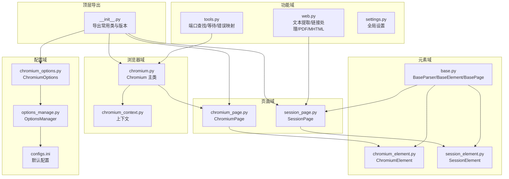
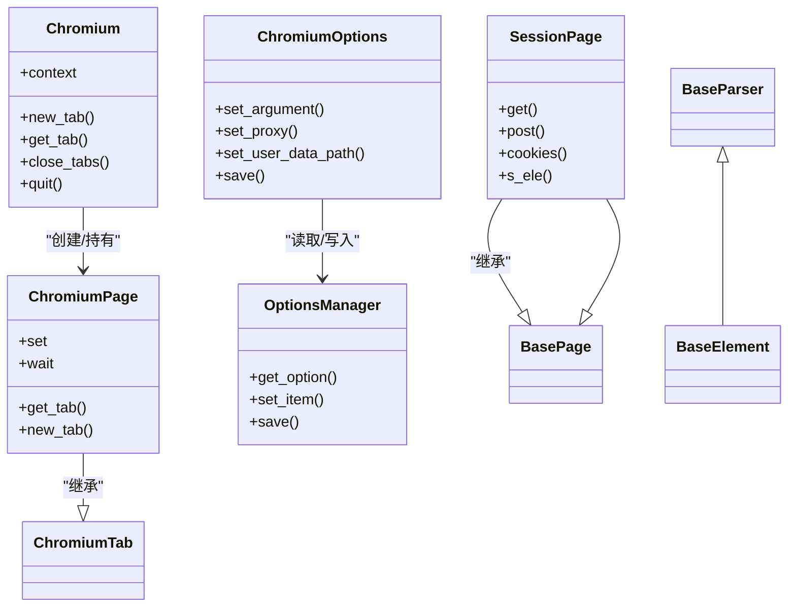
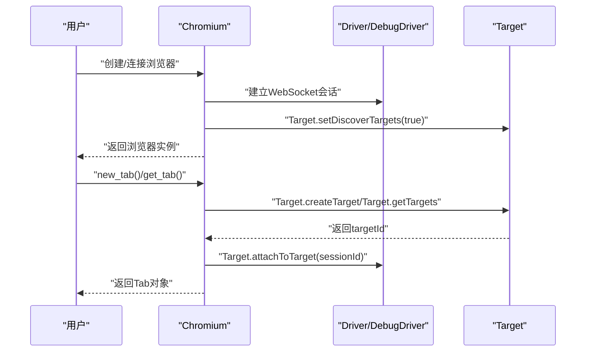
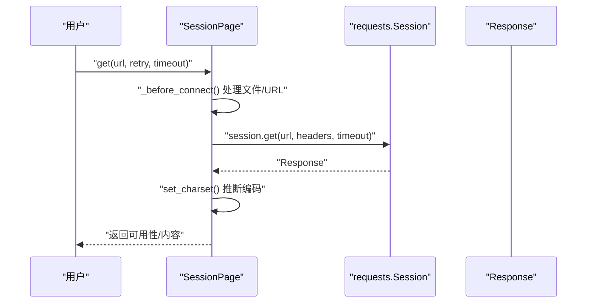
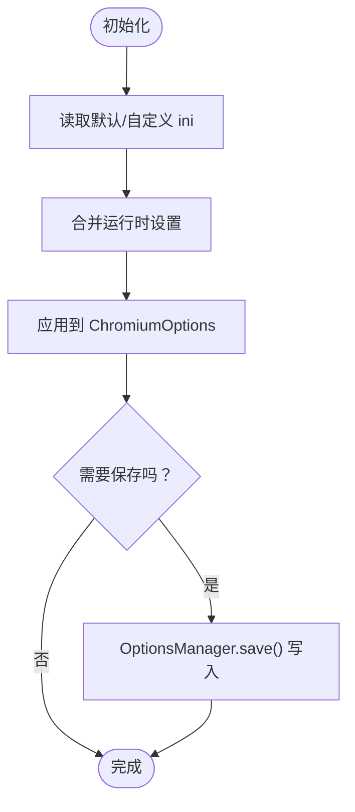
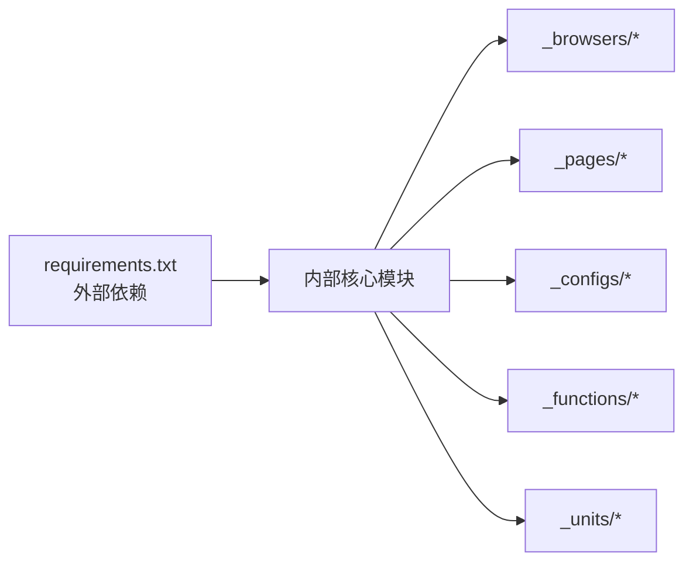

# 代码组织与架构

<cite>
**本文引用的文件**
- [__init__.py](file://DrissionPage/__init__.py)
- [common.py](file://DrissionPage/common.py)
- [base.py](file://DrissionPage/_base/base.py)
- [chromium.py](file://DrissionPage/_browsers/chromium.py)
- [chromium_page.py](file://DrissionPage/_pages/chromium_page.py)
- [session_page.py](file://DrissionPage/_pages/session_page.py)
- [chromium_options.py](file://DrissionPage/_configs/chromium_options.py)
- [options_manage.py](file://DrissionPage/_configs/options_manage.py)
- [configs.ini](file://DrissionPage/_configs/configs.ini)
- [tools.py](file://DrissionPage/_functions/tools.py)
- [web.py](file://DrissionPage/_functions/web.py)
- [settings.py](file://DrissionPage/_functions/settings.py)
- [version.py](file://DrissionPage/version.py)
- [requirements.txt](file://requirements.txt)
- [.gitignore](file://.gitignore)
</cite>

## 目录
1. [简介](#简介)
2. [项目结构](#项目结构)
3. [核心组件](#核心组件)
4. [架构总览](#架构总览)
5. [详细组件分析](#详细组件分析)
6. [依赖分析](#依赖分析)
7. [性能考虑](#性能考虑)
8. [故障排查指南](#故障排查指南)
9. [结论](#结论)
10. [附录](#附录)

## 简介
本指南面向 DrissionPage 的使用者与贡献者，系统性总结其代码组织与架构最佳实践，涵盖目录结构设计原则、模块化编程与代码复用策略、配置管理、测试规范、代码审查标准以及持续集成与部署建议。文档以“渐进式复杂度”呈现，既适合初学者快速上手，也便于资深开发者深入理解与优化。

## 项目结构
DrissionPage 采用按职责域划分的包结构：浏览器域、页面域、元素域、功能工具域、配置域、通用单元域等。顶层通过导出入口统一对外暴露常用类与函数，形成清晰的“公共 API”。

- 包级导出：顶层模块集中导出常用类型，便于用户以单一导入点使用。
- 分层职责：
  - 浏览器域：Chromium 及上下文、标签页管理。
  - 页面域：ChromiumPage、SessionPage 提供不同浏览模式的统一接口。
  - 元素域：抽象基类与具体元素实现，支持定位与层级遍历。
  - 功能域：浏览器连接、网络请求、工具函数、Web 辅助等。
  - 配置域：ChromiumOptions、SessionOptions、OptionsManager 与配置文件。
  - 通用单元：动作、等待、监听、下载、状态等可复用能力。

图表来源
- [__init__.py:22-28](file://DrissionPage/__init__.py#L22-L28)
- [chromium.py:33-120](file://DrissionPage/_browsers/chromium.py#L33-L120)
- [chromium_page.py:17-60](file://DrissionPage/_pages/chromium_page.py#L17-L60)
- [session_page.py:25-120](file://DrissionPage/_pages/session_page.py#L25-L120)
- [base.py:29-120](file://DrissionPage/_base/base.py#L29-L120)
- [chromium_options.py:16-120](file://DrissionPage/_configs/chromium_options.py#L16-L120)
- [options_manage.py:15-80](file://DrissionPage/_configs/options_manage.py#L15-L80)
- [configs.ini:1-34](file://DrissionPage/_configs/configs.ini#L1-L34)
- [tools.py:21-80](file://DrissionPage/_functions/tools.py#L21-L80)
- [web.py:1-40](file://DrissionPage/_functions/web.py#L1-L40)

章节来源
- [__init__.py:22-28](file://DrissionPage/__init__.py#L22-L28)
- [chromium.py:33-120](file://DrissionPage/_browsers/chromium.py#L33-L120)
- [chromium_page.py:17-60](file://DrissionPage/_pages/chromium_page.py#L17-L60)
- [session_page.py:25-120](file://DrissionPage/_pages/session_page.py#L25-L120)
- [base.py:29-120](file://DrissionPage/_base/base.py#L29-L120)
- [chromium_options.py:16-120](file://DrissionPage/_configs/chromium_options.py#L16-L120)
- [options_manage.py:15-80](file://DrissionPage/_configs/options_manage.py#L15-L80)
- [configs.ini:1-34](file://DrissionPage/_configs/configs.ini#L1-L34)
- [tools.py:21-80](file://DrissionPage/_functions/tools.py#L21-L80)
- [web.py:1-40](file://DrissionPage/_functions/web.py#L1-L40)

## 核心组件
- 导出入口：统一导出 Chromium、ChromiumPage、SessionPage、ChromiumOptions、SessionOptions 与版本号，简化用户导入路径。
- 基类体系：BaseParser、BaseElement、BasePage 定义统一的定位、元素操作与页面交互接口，派生类遵循一致契约。
- 浏览器主类：Chromium 负责浏览器生命周期、上下文与标签页管理、事件会话、下载与代理等。
- 页面类：ChromiumPage 与 SessionPage 提供统一的 get/post/eles/s_ele 等接口，分别适配浏览器与纯 HTTP 模式。
- 配置体系：ChromiumOptions 与 OptionsManager 解耦配置读取、合并与持久化，支持 ini 文件与运行时修改。
- 工具与 Web 辅助：PortFinder、wait_until、raise_error、get_blob、get_pdf/get_mhtml 等提升稳定性与易用性。

章节来源
- [__init__.py:22-28](file://DrissionPage/__init__.py#L22-L28)
- [base.py:29-120](file://DrissionPage/_base/base.py#L29-L120)
- [chromium.py:33-120](file://DrissionPage/_browsers/chromium.py#L33-L120)
- [chromium_page.py:17-60](file://DrissionPage/_pages/chromium_page.py#L17-L60)
- [session_page.py:25-120](file://DrissionPage/_pages/session_page.py#L25-L120)
- [chromium_options.py:16-120](file://DrissionPage/_configs/chromium_options.py#L16-L120)
- [options_manage.py:15-80](file://DrissionPage/_configs/options_manage.py#L15-L80)
- [tools.py:139-198](file://DrissionPage/_functions/tools.py#L139-L198)
- [web.py:169-255](file://DrissionPage/_functions/web.py#L169-L255)

## 架构总览
下图展示 DrissionPage 的高层架构：顶层导出、浏览器主类、页面类、元素抽象、配置与功能模块之间的关系。

图表来源
- [chromium.py:33-120](file://DrissionPage/_browsers/chromium.py#L33-L120)
- [chromium_page.py:17-60](file://DrissionPage/_pages/chromium_page.py#L17-L60)
- [session_page.py:25-120](file://DrissionPage/_pages/session_page.py#L25-L120)
- [chromium_options.py:16-120](file://DrissionPage/_configs/chromium_options.py#L16-L120)
- [options_manage.py:15-80](file://DrissionPage/_configs/options_manage.py#L15-L80)
- [base.py:29-120](file://DrissionPage/_base/base.py#L29-L120)

## 详细组件分析

### 组件一：浏览器主类（Chromium）
- 角色与职责
  - 单例化浏览器实例管理，维护 Target/Session 映射与事件队列。
  - 提供上下文创建、标签页管理、下载行为控制、代理设置、超时与重试策略。
- 关键流程
  - 实例化：根据传入地址或选项启动/连接浏览器，建立 DevTools WebSocket 会话。
  - 标签页：创建、切换、关闭、查询；处理 Target 事件与会话附加。
  - 生命周期：断开、重连、退出，清理临时数据与进程。
- 设计要点
  - 使用 Tabs 管理会话与目标映射，避免循环引用。
  - Messenger 线程安全地接收与分发事件回调。
  - 通过 ChromiumOptions 注入配置，支持自动端口与用户数据路径。

图表来源
- [chromium.py:33-120](file://DrissionPage/_browsers/chromium.py#L33-L120)
- [chromium.py:235-270](file://DrissionPage/_browsers/chromium.py#L235-L270)
- [chromium.py:442-460](file://DrissionPage/_browsers/chromium.py#L442-L460)

章节来源
- [chromium.py:33-120](file://DrissionPage/_browsers/chromium.py#L33-L120)
- [chromium.py:235-270](file://DrissionPage/_browsers/chromium.py#L235-L270)
- [chromium.py:442-460](file://DrissionPage/_browsers/chromium.py#L442-L460)

### 组件二：页面类（ChromiumPage 与 SessionPage）
- 角色与职责
  - ChromiumPage：基于浏览器的页面操作，提供标签页集合、等待器、setter 等。
  - SessionPage：基于 HTTP 会话的页面操作，提供 get/post、响应解析、Cookie 管理。
- 关键流程
  - 初始化：ChromiumPage 通过 Chromium 获取/创建标签页；SessionPage 创建/注入会话与超时。
  - 请求流程：SessionPage 封装 requests，自动设置 Host/Referer/超时，支持重试与编码推断。
- 设计要点
  - 统一的定位接口（ele/eles/s_ele）与 BasePage 抽象，降低使用复杂度。
  - SessionPage 对响应内容进行编码识别与设置，提升跨站点兼容性。

图表来源
- [session_page.py:104-196](file://DrissionPage/_pages/session_page.py#L104-L196)
- [session_page.py:198-265](file://DrissionPage/_pages/session_page.py#L198-L265)
- [web.py:272-293](file://DrissionPage/_functions/web.py#L272-L293)

章节来源
- [chromium_page.py:17-60](file://DrissionPage/_pages/chromium_page.py#L17-L60)
- [session_page.py:104-196](file://DrissionPage/_pages/session_page.py#L104-L196)
- [session_page.py:198-265](file://DrissionPage/_pages/session_page.py#L198-L265)
- [web.py:272-293](file://DrissionPage/_functions/web.py#L272-L293)

### 组件三：配置管理（ChromiumOptions 与 OptionsManager）
- 角色与职责
  - ChromiumOptions：封装浏览器启动参数、用户数据路径、代理、超时、重试等配置项。
  - OptionsManager：读取/写入 ini 配置，支持默认模板与自定义路径。
- 关键流程
  - 初始化：从 ini 读取各节配置，合并运行时设置。
  - 写入：将当前配置保存到指定路径，支持默认位置与自定义目录。
- 设计要点
  - 配置项与 ini 键名解耦，通过 OptionsManager 统一访问。
  - 支持动态覆盖（如 set_user_data_path/set_proxy），并在保存时同步到 ini。

图表来源
- [chromium_options.py:16-120](file://DrissionPage/_configs/chromium_options.py#L16-L120)
- [options_manage.py:15-80](file://DrissionPage/_configs/options_manage.py#L15-L80)
- [configs.ini:1-34](file://DrissionPage/_configs/configs.ini#L1-L34)

章节来源
- [chromium_options.py:16-120](file://DrissionPage/_configs/chromium_options.py#L16-L120)
- [options_manage.py:15-80](file://DrissionPage/_configs/options_manage.py#L15-L80)
- [configs.ini:1-34](file://DrissionPage/_configs/configs.ini#L1-L34)

### 组件四：工具与辅助（PortFinder、wait_until、raise_error）
- 角色与职责
  - PortFinder：线程安全地分配可用端口，避免冲突。
  - wait_until：统一的轮询等待机制，支持超时与异常。
  - raise_error：将底层错误映射为语义化异常，便于上层处理。
- 设计要点
  - 使用锁与缓存减少重复扫描，提升性能。
  - 异常映射覆盖常见场景（上下文丢失、元素丢失、CDP 超时等）。

章节来源
- [tools.py:21-80](file://DrissionPage/_functions/tools.py#L21-L80)
- [tools.py:139-198](file://DrissionPage/_functions/tools.py#L139-L198)

### 组件五：Web 辅助（文本提取、链接处理、PDF/MHTML）
- 角色与职责
  - 文本提取：按 HTML 结构规则提取可读文本，处理换行与缩进。
  - 链接处理：相对/绝对链接规范化，协议补全。
  - PDF/MHTML：调用 CDP 导出页面快照或 PDF。
- 设计要点
  - 通过 XPath 与 DOM 查询结合，兼顾准确性与性能。
  - 输出命名使用合法文件名规则，避免平台差异问题。

章节来源
- [web.py:20-104](file://DrissionPage/_functions/web.py#L20-L104)
- [web.py:137-157](file://DrissionPage/_functions/web.py#L137-L157)
- [web.py:198-254](file://DrissionPage/_functions/web.py#L198-L254)

## 依赖分析
- 外部依赖：requests、lxml、cssselect、DrissionGet、DrissionRecord、websocket-client、click、tldextract、psutil 等。
- 内部依赖：浏览器域依赖配置域与功能域；页面域依赖元素抽象与功能工具；工具与 Web 辅助被多处复用。
- 循环依赖：当前结构通过“导出入口”与“分层职责”避免循环依赖，建议新增模块时保持单向依赖。

图表来源
- [requirements.txt:1-9](file://requirements.txt#L1-L9)
- [__init__.py:22-28](file://DrissionPage/__init__.py#L22-L28)

章节来源
- [requirements.txt:1-9](file://requirements.txt#L1-L9)
- [__init__.py:22-28](file://DrissionPage/__init__.py#L22-L28)

## 性能考虑
- 端口分配：PortFinder 使用随机端口与缓存已用端口集合，避免频繁扫描。
- 事件处理：Messenger 使用队列与守护线程，异步分发事件，降低阻塞。
- 请求重试：SessionPage 支持重试次数与间隔，结合编码推断减少无效请求。
- 超时控制：ChromiumOptions 与 Settings 提供统一超时配置，避免长阻塞。
- 下载管理：DownloadManager 与 DrissionGet 集成，减少额外 I/O 开销。

## 故障排查指南
- 常见异常映射
  - 上下文丢失：当目标导航或关闭时触发。
  - 元素丢失：DOM 结构变化导致节点不可用。
  - 断开连接：浏览器进程退出或会话失效。
  - 超时：CDP 或网络请求超过阈值。
- 排查步骤
  - 检查浏览器连接地址与端口，必要时启用自动端口。
  - 查看日志与事件回调，确认 Target 事件是否正常。
  - 调整超时与重试参数，观察稳定性改善情况。
  - 使用 raise_error 的映射信息定位具体原因。

章节来源
- [tools.py:157-198](file://DrissionPage/_functions/tools.py#L157-L198)

## 结论
DrissionPage 通过清晰的分层与职责划分、统一的抽象基类、完善的配置与工具体系，实现了浏览器自动化与 HTTP 会话的双模支持。遵循本文档的组织与架构最佳实践，可在保证可维护性的前提下，进一步提升扩展性与稳定性。

## 附录

### 目录结构设计原则
- 按域分层：浏览器、页面、元素、配置、功能、通用单元各司其职。
- 导出统一：通过顶层导出集中暴露常用类型，降低用户心智负担。
- 配置解耦：OptionsManager 与 ChromiumOptions 分离读取与持久化，便于测试与定制。

### 模块化编程与代码复用
- 抽象优先：先定义 BaseParser/BaseElement/BasePage，再实现具体子类。
- 工具复用：将通用逻辑下沉至 tools.py/web.py，避免重复实现。
- 配置驱动：通过 ini 与运行时设置组合，支持灵活定制。

### 配置管理最佳实践
- 默认配置：使用 configs.ini 提供合理默认值。
- 自定义路径：支持自定义 ini 路径与保存位置。
- 环境变量：建议在 CI 中通过环境变量覆盖地址与代理，避免硬编码。

### 测试代码编写规范与策略
- 单元测试：针对独立函数（如 get_proxy_info、format_headers）编写边界用例。
- 集成测试：验证 Chromium 与 SessionPage 的端到端流程，覆盖超时、重试、断线重连。
- 回归测试：对关键路径（PDF/MHTML 导出、Cookie 管理、文本提取）定期回归。

### 代码审查标准与质量保证
- 一致性：遵循统一的命名、异常与日志风格。
- 可测试性：尽量减少全局状态，增加可注入依赖。
- 文档与注释：关键流程与异常分支补充注释，便于审查与维护。

### 持续集成与部署建议
- 环境隔离：使用虚拟环境与依赖锁定文件，确保构建一致性。
- 自动化：在 CI 中执行单元与集成测试，失败即阻断发布。
- 配置注入：通过环境变量注入地址、代理与下载路径，避免泄露敏感信息。
- 版本管理：遵循语义化版本，变更记录与发布说明清晰。