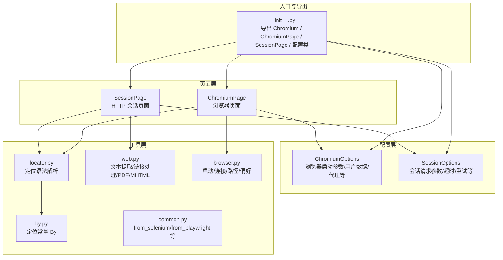
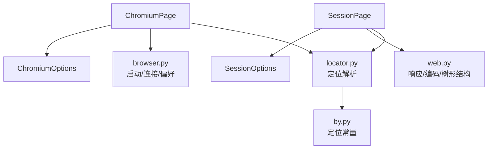
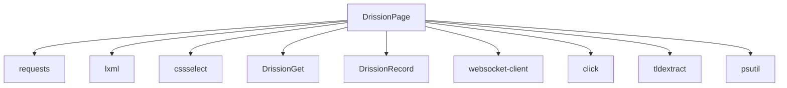

# 基础使用示例

<cite>
**本文引用的文件**
- [DrissionPage/__init__.py](file://DrissionPage/__init__.py)
- [DrissionPage/_pages/chromium_page.py](file://DrissionPage/_pages/chromium_page.py)
- [DrissionPage/_pages/session_page.py](file://DrissionPage/_pages/session_page.py)
- [DrissionPage/_functions/browser.py](file://DrissionPage/_functions/browser.py)
- [DrissionPage/_functions/by.py](file://DrissionPage/_functions/by.py)
- [DrissionPage/_functions/web.py](file://DrissionPage/_functions/web.py)
- [DrissionPage/_functions/locator.py](file://DrissionPage/_functions/locator.py)
- [DrissionPage/_configs/chromium_options.py](file://DrissionPage/_configs/chromium_options.py)
- [DrissionPage/_configs/session_options.py](file://DrissionPage/_configs/session_options.py)
- [DrissionPage/common.py](file://DrissionPage/common.py)
- [requirements.txt](file://requirements.txt)
- [README.md](file://README.md)
</cite>

## 目录
1. [简介](#简介)
2. [项目结构](#项目结构)
3. [核心组件](#核心组件)
4. [架构总览](#架构总览)
5. [详细组件分析](#详细组件分析)
6. [依赖分析](#依赖分析)
7. [性能考虑](#性能考虑)
8. [故障排查指南](#故障排查指南)
9. [结论](#结论)
10. [附录](#附录)

## 简介
本章节面向初学者，提供 DrissionPage 最常用的入门示例，涵盖：
- 创建浏览器实例（ChromiumPage）
- 打开网页
- 元素定位（多种定位方式）
- 点击、输入文本等基本操作
- 使用 SessionPage 发起 HTTP 请求与数据提取
- 表单填写示例
- 清晰的步骤说明与预期输出提示

DrissionPage 支持两种模式：
- ChromiumPage：控制真实浏览器（Chromium 内核，如 Chrome/Edge），适合需要真实渲染、JS 执行、截图、下载等场景。
- SessionPage：基于会话的 HTTP 客户端，适合快速抓取、解析 HTML/JSON、发送请求。

## 项目结构
DrissionPage 的核心模块围绕“页面类型 + 配置 + 工具函数”组织：
- 页面层：ChromiumPage、SessionPage
- 配置层：ChromiumOptions、SessionOptions
- 工具层：定位、浏览器连接、Web 辅助、按键、动作等
- 导出入口：统一在包级导出常用类与工具

图表来源
- [DrissionPage/__init__.py:22-28](file://DrissionPage/__init__.py#L22-L28)
- [DrissionPage/_pages/chromium_page.py:17-103](file://DrissionPage/_pages/chromium_page.py#L17-L103)
- [DrissionPage/_pages/session_page.py:25-294](file://DrissionPage/_pages/session_page.py#L25-L294)
- [DrissionPage/_configs/chromium_options.py:16-417](file://DrissionPage/_configs/chromium_options.py#L16-L417)
- [DrissionPage/_configs/session_options.py:20-372](file://DrissionPage/_configs/session_options.py#L20-L372)
- [DrissionPage/_functions/by.py:10-19](file://DrissionPage/_functions/by.py#L10-L19)
- [DrissionPage/_functions/locator.py:15-579](file://DrissionPage/_functions/locator.py#L15-L579)
- [DrissionPage/_functions/web.py:1-349](file://DrissionPage/_functions/web.py#L1-L349)
- [DrissionPage/_functions/browser.py:24-439](file://DrissionPage/_functions/browser.py#L24-L439)
- [DrissionPage/common.py:18-57](file://DrissionPage/common.py#L18-L57)

章节来源
- [DrissionPage/__init__.py:22-28](file://DrissionPage/__init__.py#L22-L28)
- [README.md:46-90](file://README.md#L46-L90)

## 核心组件
- ChromiumPage：控制浏览器标签页，支持多标签、等待、截图、PDF、下载等。
- SessionPage：基于会话的 HTTP 客户端，支持 GET/POST、响应解析、Cookie 管理、重试等。
- ChromiumOptions：管理浏览器启动参数、用户数据目录、代理、无头模式、超时等。
- SessionOptions：管理会话请求参数、超时、重试、代理、证书校验等。
- 定位工具：By 常量、locator 解析、translate_loc 等，支持 XPath/CSS/ID/NAME/CLASS 等。
- 浏览器连接工具：connect_browser、get_launch_args、test_connect、路径探测等。

章节来源
- [DrissionPage/_pages/chromium_page.py:17-103](file://DrissionPage/_pages/chromium_page.py#L17-L103)
- [DrissionPage/_pages/session_page.py:25-294](file://DrissionPage/_pages/session_page.py#L25-L294)
- [DrissionPage/_configs/chromium_options.py:16-417](file://DrissionPage/_configs/chromium_options.py#L16-L417)
- [DrissionPage/_configs/session_options.py:20-372](file://DrissionPage/_configs/session_options.py#L20-L372)
- [DrissionPage/_functions/by.py:10-19](file://DrissionPage/_functions/by.py#L10-L19)
- [DrissionPage/_functions/locator.py:15-579](file://DrissionPage/_functions/locator.py#L15-L579)
- [DrissionPage/_functions/browser.py:24-439](file://DrissionPage/_functions/browser.py#L24-L439)

## 架构总览
下图展示了 DrissionPage 的高层架构：页面层（ChromiumPage/SessionPage）通过配置层（Options）与工具层（定位/浏览器/网络）协作，最终与目标网站交互。

图表来源
- [DrissionPage/_pages/chromium_page.py:17-103](file://DrissionPage/_pages/chromium_page.py#L17-L103)
- [DrissionPage/_pages/session_page.py:25-294](file://DrissionPage/_pages/session_page.py#L25-L294)
- [DrissionPage/_configs/chromium_options.py:16-417](file://DrissionPage/_configs/chromium_options.py#L16-L417)
- [DrissionPage/_configs/session_options.py:20-372](file://DrissionPage/_configs/session_options.py#L20-L372)
- [DrissionPage/_functions/browser.py:24-439](file://DrissionPage/_functions/browser.py#L24-L439)
- [DrissionPage/_functions/web.py:1-349](file://DrissionPage/_functions/web.py#L1-L349)
- [DrissionPage/_functions/locator.py:15-579](file://DrissionPage/_functions/locator.py#L15-L579)
- [DrissionPage/_functions/by.py:10-19](file://DrissionPage/_functions/by.py#L10-L19)

## 详细组件分析

### 示例一：创建浏览器实例并打开网页（ChromiumPage）
- 步骤
  1) 创建 ChromiumOptions 并设置浏览器路径、用户数据目录、无头模式等。
  2) 通过 ChromiumOptions 初始化 ChromiumPage。
  3) 使用 get(url) 打开目标网页。
- 预期输出
  - 页面标题、URL 可通过属性获取；若打开成功，页面可进行后续元素定位与操作。

章节来源
- [DrissionPage/_configs/chromium_options.py:16-417](file://DrissionPage/_configs/chromium_options.py#L16-L417)
- [DrissionPage/_pages/chromium_page.py:33-44](file://DrissionPage/_pages/chromium_page.py#L33-L44)
- [DrissionPage/_functions/browser.py:24-87](file://DrissionPage/_functions/browser.py#L24-L87)

### 示例二：元素定位与点击（ChromiumPage）
- 定位方式
  - 使用 By 常量：ID/XPATH/LINK_TEXT/NAME/TAG_NAME/CLASS_NAME/CSS_SELECTOR
  - 或使用字符串定位语法：如 "#id"、".class"、"text=..."、"xpath=..."
- 点击
  - 定位到元素后，调用点击相关方法完成交互。
- 预期输出
  - 点击后页面跳转或弹窗出现，可通过后续 get(url)/title/url 等验证。

章节来源
- [DrissionPage/_functions/by.py:10-19](file://DrissionPage/_functions/by.py#L10-L19)
- [DrissionPage/_functions/locator.py:96-115](file://DrissionPage/_functions/locator.py#L96-L115)
- [DrissionPage/_functions/locator.py:468-503](file://DrissionPage/_functions/locator.py#L468-L503)

### 示例三：输入文本（ChromiumPage）
- 方法
  - 定位输入框元素，调用输入相关方法设置值。
- 注意
  - 对于需要触发特定事件（如输入后搜索）的页面，可在输入后模拟回车或点击按钮。

章节来源
- [DrissionPage/_pages/chromium_page.py:45-55](file://DrissionPage/_pages/chromium_page.py#L45-L55)

### 示例四：数据提取（ChromiumPage）
- 获取页面标题、URL、HTML 文本、JSON 响应等。
- 使用 web 工具函数进行文本格式化、树形结构打印等辅助分析。

章节来源
- [DrissionPage/_pages/chromium_page.py:45-55](file://DrissionPage/_pages/chromium_page.py#L45-L55)
- [DrissionPage/_functions/web.py:20-104](file://DrissionPage/_functions/web.py#L20-L104)

### 示例五：表单填写（ChromiumPage）
- 步骤
  1) 定位用户名/密码等输入框。
  2) 输入文本。
  3) 定位提交按钮并点击。
- 验证
  - 通过页面跳转后的 URL/标题或弹窗确认登录是否成功。

章节来源
- [DrissionPage/_pages/chromium_page.py:33-44](file://DrissionPage/_pages/chromium_page.py#L33-L44)
- [DrissionPage/_functions/locator.py:96-115](file://DrissionPage/_functions/locator.py#L96-L115)

### 示例六：使用 SessionPage 发起请求与数据提取（SessionPage）
- 步骤
  1) 创建 SessionOptions 并设置超时、重试、代理等。
  2) 初始化 SessionPage。
  3) 使用 get/post 发送请求。
  4) 通过 title/url/html/json/response 等属性提取所需数据。
- 预期输出
  - 成功获取响应内容，可解析 HTML 或 JSON，或保存为 PDF/MHTML。

章节来源
- [DrissionPage/_configs/session_options.py:20-372](file://DrissionPage/_configs/session_options.py#L20-L372)
- [DrissionPage/_pages/session_page.py:25-294](file://DrissionPage/_pages/session_page.py#L25-L294)
- [DrissionPage/_functions/web.py:198-254](file://DrissionPage/_functions/web.py#L198-L254)

### 示例七：截图与 PDF（ChromiumPage）
- 截图
  - 可直接调用截图相关方法保存页面快照。
- PDF
  - 使用 web 工具函数将当前页面保存为 PDF。

章节来源
- [DrissionPage/_functions/web.py:198-254](file://DrissionPage/_functions/web.py#L198-L254)

### 示例八：从 Selenium/Playwright 生成 Chromium 实例（高级）
- 通过 common 工具函数将已有的 WebDriver/Browser 对象转换为 DrissionPage 的 Chromium 实例，以便复用已有浏览器会话。

章节来源
- [DrissionPage/common.py:22-57](file://DrissionPage/common.py#L22-L57)

## 依赖分析
- DrissionPage 依赖 requests、lxml、cssselect、DrissionGet、DrissionRecord、websocket-client、click、tldextract、psutil 等库。
- 依赖关系示意：

图表来源
- [requirements.txt:1-9](file://requirements.txt#L1-L9)

章节来源
- [requirements.txt:1-9](file://requirements.txt#L1-L9)

## 性能考虑
- 选择合适的页面模式：需要真实渲染与 JS 执行时使用 ChromiumPage；纯数据抓取优先 SessionPage。
- 合理设置超时与重试：ChromiumOptions/SessionOptions 提供超时与重试配置，避免网络波动影响稳定性。
- 减少不必要的等待：利用等待器（waiter）与自动重试机制，减少手动轮询。
- 合理使用无头模式：在不需要可视化时开启无头模式，提高运行效率。

## 故障排查指南
- 浏览器无法连接
  - 检查端口占用与地址配置；使用 connect_browser/test_connect 验证连接。
  - 若指定用户数据目录，注意权限与路径有效性。
- 定位失败
  - 确认定位语法正确；必要时使用 translate_loc 将 Selenium 定位转换为 XPath/CSS。
  - 对动态内容，适当增加等待或重试。
- 编码问题
  - SessionPage 会自动检测响应编码；必要时可手动设置编码。
- 下载与截图
  - 确认下载路径存在且可写；截图/导出 PDF 时检查权限与磁盘空间。

章节来源
- [DrissionPage/_functions/browser.py:192-210](file://DrissionPage/_functions/browser.py#L192-L210)
- [DrissionPage/_functions/locator.py:96-115](file://DrissionPage/_functions/locator.py#L96-L115)
- [DrissionPage/_pages/session_page.py:198-265](file://DrissionPage/_pages/session_page.py#L198-L265)

## 结论
通过本指南，你可以快速掌握 DrissionPage 的基础用法：创建浏览器实例、打开网页、定位元素、点击与输入、数据提取、表单填写，以及使用 SessionPage 发起 HTTP 请求。建议结合实际需求选择页面模式，并根据网络环境合理配置超时与重试策略，以获得稳定高效的自动化体验。

## 附录
- 快速参考
  - 页面类型：ChromiumPage、SessionPage
  - 定位常量：By.ID、By.XPATH、By.LINK_TEXT、By.NAME、By.TAG_NAME、By.CLASS_NAME、By.CSS_SELECTOR
  - 关键流程：创建选项 → 初始化页面 → 打开网页/发起请求 → 定位元素 → 操作（点击/输入） → 数据提取/保存